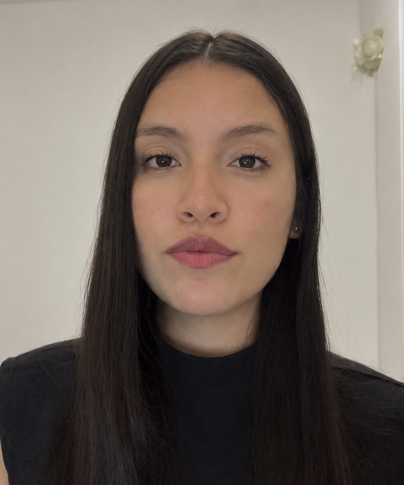
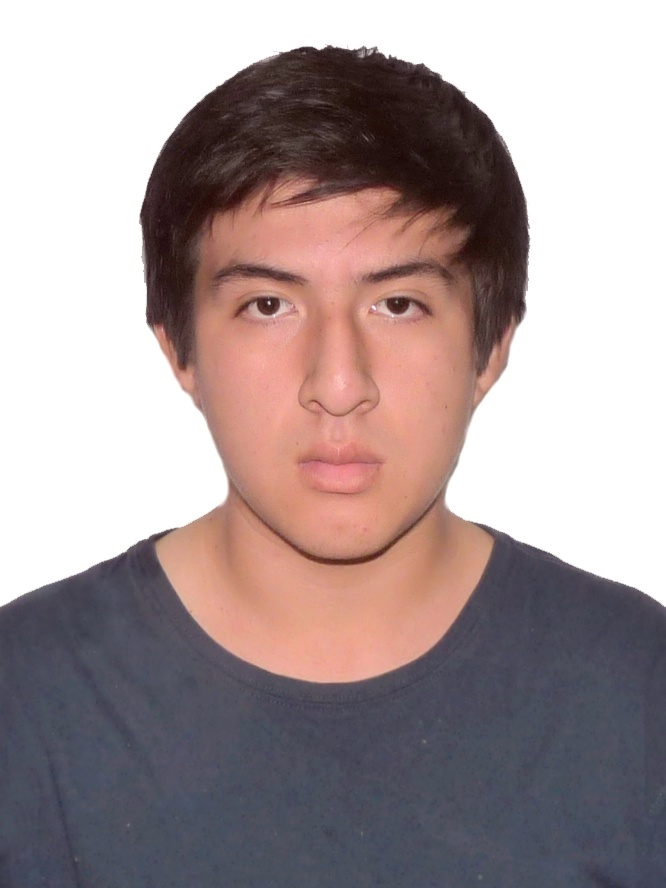

# Capítulo I: Introducción

## 1.1. Startup Profile

### 1.1.1. Descripción de la Startup

**Oso Terra** es una startup peruana de tecnología agrícola creada por estudiantes de Ingeniería de Software de la Universidad Peruana de Ciencias Aplicadas. La empresa nace con el propósito de acercar soluciones IoT al sector agrícola, especialmente a productores que necesitan información clara, oportuna y accesible para tomar mejores decisiones sobre el estado de sus suelos.

El nombre **Oso Terra** combina la idea de vigilancia y resistencia asociada al oso con el concepto de tierra como base de la producción agrícola. Esta relación expresa el objetivo central de la startup: observar de manera constante las condiciones del suelo y convertir los datos recolectados en información útil para el agricultor.

**Misión.** Democratizar el acceso al monitoreo agrícola mediante una solución IoT de bajo costo que permita a pequeños y medianos productores conocer el estado de sus parcelas, detectar riesgos asociados a la salinidad del suelo y actuar oportunamente con información comprensible.

**Visión.** Ser una startup referente en el monitoreo inteligente de suelos agrícolas en el Perú, impulsando el uso de tecnología accesible para mejorar la productividad, reducir pérdidas y fortalecer la toma de decisiones en la agricultura familiar y de mediana escala.

**Propuesta de valor.** Oso Terra desarrolla **OsoSense**, una solución IoT orientada al monitoreo continuo del suelo agrícola. El producto integra sensores de campo, procesamiento de datos y una plataforma digital que presenta alertas tempranas y recomendaciones comprensibles para el usuario. De esta forma, el productor puede identificar cambios relevantes en la conductividad eléctrica, humedad y temperatura del suelo sin depender únicamente de diagnósticos de laboratorio esporádicos.

**Valores.**

- **Accesibilidad.** La solución se diseña considerando la realidad económica y tecnológica de pequeños y medianos productores.
- **Utilidad.** Los datos recolectados deben convertirse en alertas y recomendaciones claras, no solo en mediciones técnicas.
- **Rigor técnico.** Las lecturas del dispositivo deben ser calibradas y contrastadas para generar confianza en el usuario.
- **Diseño inclusivo.** La experiencia debe ser comprensible para usuarios con distintos niveles de alfabetización digital.
- **Transparencia.** El productor debe comprender qué datos se recopilan, cómo se interpretan y para qué se utilizan.

### 1.1.2. Perfiles de integrantes del equipo

| Foto del estudiante | Nombres y apellidos | Código de estudiante | Descripción |
|---|---|---|---|
|  | Barturen Panez, Iker Gabriel | u202312629 | Estudiante de Ingeniería de Software. Participa en la documentación del proyecto, revisión de perfiles y organización de recursos para el informe. |
|  | Encalada Salazar, Alexis | u20211g481 | Estudiante de Ingeniería de Software. Apoya en el desarrollo conceptual del producto, revisión de secciones del informe y análisis de necesidades de usuarios. |
|  | Goñe Araccata, Esther Abigail | u202318049 | Estudiante de Ingeniería de Software. Participa en la elaboración del informe, análisis del problema y organización de los artefactos del proyecto OsoSense. |
|  | Ortiz Alarcon, Victor Nicolas | u202312899 | Estudiante de Ingeniería de Software. Participa en la estructuración del repositorio, redacción del Capítulo I y organización de la documentación del proyecto. |
|  | Salazar Caballero, Alvaro Fabrizzio | u202321941 | Estudiante de Ingeniería de Software. Contribuye en la investigación del contexto agrícola, definición de requisitos y documentación de la solución IoT. |
|  | Santiago Peña, Andreow Jomark | u202317362 | Estudiante de Ingeniería de Software. Contribuye en el análisis de la solución, documentación técnica y revisión colaborativa de los contenidos del informe. |
|  | Tumi Oliden, Manuel Ignacio | u20241c134 | Estudiante de Ingeniería de Software. Apoya en la investigación del producto, definición de criterios de diseño y consolidación de información del equipo. |

## 1.2. Solution Profile

**Nombre del producto:** OsoSense

**OsoSense** es una solución IoT desarrollada por Oso Terra para el monitoreo continuo del suelo agrícola. Su objetivo es ayudar a pequeños y medianos productores a detectar de manera temprana riesgos asociados a la salinización, una problemática que afecta la productividad de los cultivos y que suele identificarse cuando el daño ya es visible.

La solución está compuesta por un dispositivo de campo que registra variables como conductividad eléctrica, humedad y temperatura del suelo. Estas mediciones permiten observar cambios relevantes en la parcela y generar información útil para el productor. A partir de los datos recolectados, OsoSense busca presentar alertas comprensibles, recomendaciones de acción y un historial que facilite el seguimiento del estado del suelo.

El producto no busca reemplazar el análisis de laboratorio, ya que este sigue siendo necesario para diagnósticos formales y validaciones técnicas. Su propósito es complementar ese proceso mediante una herramienta de detección temprana, de menor costo y uso frecuente, que permita actuar antes de que la salinidad impacte de forma severa en el rendimiento del cultivo.

OsoSense se orienta a un contexto agrícola donde muchos productores no cuentan con acceso constante a servicios especializados, conectividad estable o herramientas digitales complejas. Por ello, la solución prioriza una experiencia simple, visual y accesible desde dispositivos móviles, considerando que el valor principal no está solo en medir el suelo, sino en traducir esas mediciones en decisiones claras para el usuario.

### 1.2.1. Antecedentes y problemática

#### Aplicación de la técnica 5W + 2H

**What — ¿Qué está ocurriendo?**

Los suelos agrícolas de la costa peruana se están salinizando. Un suelo se clasifica como salino cuando la conductividad eléctrica de su extracto de saturación (CEe) alcanza o supera los **4 dS/m**, umbral a partir del cual las sales disueltas elevan el potencial osmótico de la solución del suelo y dificultan que la raíz absorba agua y nutrientes, aun cuando el suelo esté húmedo (INIA, 2024). El cultivo entra en estrés hídrico en una parcela regada.

El Ministerio de Desarrollo Agrario y Riego estima que **al menos el 40 % de los suelos agrícolas de la costa está afectado por procesos de salinización y mal drenaje** (MIDAGRI, s.f.). El referente histórico más citado, elaborado por la Oficina Nacional de Evaluación de Recursos Naturales, cuantificó alrededor de **300 000 hectáreas con problemas de salinidad y drenaje sobre un total de 1 050 000 hectáreas en distritos de riego**, cerca de un tercio de la superficie bajo riego. Estimaciones posteriores del INRENA situaron las superficies salinas de la costa en torno a las **306 701 hectáreas**.

En el plano internacional, la FAO presentó en diciembre de 2024 su informe *Global Status of Salt-Affected Soils*, el primer diagnóstico global en cincuenta años, que estima **1 381 millones de hectáreas afectadas por sales, equivalentes al 10,7 % de la superficie terrestre mundial** (FAO, 2024). El fenómeno no es una particularidad peruana, pero sí lo es la combinación de alta exposición y bajo nivel de monitoreo.

**Where — ¿Dónde ocurre?**

El problema se concentra en la costa, región árida donde la agricultura depende casi por completo del riego. MIDAGRI identifica a **Piura, en el sistema Chira-Piura, y a Lambayeque, en el sistema Chancay-Lambayeque**, como las zonas más comprometidas por mal drenaje y manejo del riego. Dentro de cada valle, el daño se concentra en las partes bajas, donde la napa freática asciende y la evaporación deposita las sales en el horizonte superficial.

La evidencia académica documenta casos concretos con superficie medida. En el valle bajo del río Santa, en Áncash, se registraron entre 1973 y 2008 suelos con salinidad alta y muy alta en el 5,16 % y el 31,96 % del área evaluada respectivamente, con **712,86 hectáreas** de superficie agrícola dañada. En los distritos limeños de San Antonio y Mala se documentó la **pérdida de 1 690,47 hectáreas** de tierra cultivable por salinización entre 1976 y 2016, con deterioro en la mayoría de los puntos de muestreo (PUCP, 2020).

**When — ¿Desde cuándo y con qué evolución?**

El problema no es nuevo, pero se agrava y se mide poco. Los casos documentados del valle del Santa y de San Antonio y Mala muestran expansión sostenida a lo largo de tres y cuatro décadas respectivamente, lo que confirma que se trata de un proceso acumulativo y no de un evento.

El propio Estado reconoce que el diagnóstico disponible está desactualizado: los datos base provienen de la ONERN de la década de 1970 y las evaluaciones oficiales señalan que la situación actual es probablemente más severa. Existe además un antecedente legislativo, el **Proyecto de Ley 7786/2020-CR**, que declara de interés nacional la prevención de la salinización del suelo agrícola, señal de que el problema está reconocido en la agenda pública pero sin instrumento de medición continua que lo respalde.

En la escala de la parcela, el calendario es igual de revelador. Las sales se acumulan a lo largo de toda la campaña, con mayor velocidad en los periodos de alta evaporación y después de riegos abundantes sin lámina de lavado. La detección, en cambio, ocurre en un solo momento y tarde: cuando el rendimiento ya cayó.

**Who — ¿A quiénes afecta?**

Afecta a los **2 260 973 productores agropecuarios** del país (INEI, IV CENAGRO), de los cuales el **81,9 % conduce unidades menores a cinco hectáreas**. Este segmento tiene una edad promedio de **54,5 años** y un nivel educativo mayoritariamente primario (**57,7 %**), rasgos que condicionan directamente cómo debe presentarse la información técnica.

Junto al productor, el problema alcanza a un segundo actor: el **ingeniero agrónomo y asesor técnico independiente**, del que el Colegio de Ingenieros del Perú (Consejo de Lima) registra alrededor de **6 000 profesionales** en la especialidad. Es quien interpreta el dato agronómico y sustenta la recomendación, pero trabaja mediante visitas periódicas, de modo que su capacidad de seguimiento está limitada por el desplazamiento físico.

El impacto se extiende además a las asociaciones y cooperativas de productores, que gestionan compras agregadas y planes de negocio; a las agencias agrarias regionales y a los programas estatales de extensión, cuya cobertura es reconocidamente desigual; y, en última instancia, al abastecimiento del mercado interno, dado que la costa norte concentra los cultivos de mayor superficie del país.

**Why — ¿Por qué ocurre?**

Las causas se dividen en dos grupos.

*Naturales:* clima árido con evapotranspiración elevada, origen marino de los suelos costeros, ascenso capilar de sales por evaporación y napas freáticas altas en las partes bajas de los valles.

*Antrópicas:* riego con agua de mala calidad, dado que los pozos de la costa presentan niveles elevados de sodio, calcio, cloruros, sulfatos y boro; sobre-irrigación; drenaje deficiente por obras incompletas o sin mantenimiento; uso excesivo de fertilizantes; y predominio del riego por gravedad, que **solo el 14,9 % de los pequeños y medianos productores bajo riego** sustituye por riego tecnificado (INEI, ENA).

A estas dos causas físicas se suma una tercera, de naturaleza informacional, que es la que el proyecto aborda: **no existe en el mercado peruano un instrumento de monitoreo continuo de salinidad al alcance de una parcela de menos de cinco hectáreas**. El laboratorio entrega precisión pero no frecuencia; las plataformas de agricultura de precisión entregan frecuencia pero a un precio diseñado para la agroexportación; y el medidor portátil entrega bajo costo pero exige presencia física y no genera serie histórica. El vacío no está en la tecnología de medición, sino en su costo y en su continuidad.

**How — ¿Cómo se manifiesta y cómo se detecta hoy?**

La salinización se manifiesta primero como una caída de rendimiento sin causa aparente. El agricultor observa plantas de menor vigor, hojas con bordes quemados y parches improductivos, pero atribuye el problema a plagas, a la semilla o a la fertilización, porque la sal es invisible hasta que aflora como costra. El diagnóstico equivocado tiene además un costo propio: se fertiliza o se fumiga un problema que no es de nutrición ni de plagas.

La detección formal exige un análisis de laboratorio. En el Perú, un análisis básico de fertilidad cuesta entre **S/ 80 y S/ 150 por muestra** y una caracterización completa entre **S/ 350 y S/ 600**, con tiempos de entrega de **7 a 15 días hábiles**. Los laboratorios de referencia son el LASPAF de la Universidad Nacional Agraria La Molina, que procesa alrededor de 18 000 muestras al año, y la red LABSAF del INIA, acreditada por INACAL.

La alternativa intermedia es el conductímetro portátil, que resuelve el costo y la inmediatez, pero obliga a que alguien esté físicamente en la parcela en el momento de la medición, entrega un valor aislado sin registro ni tendencia, y no interpreta el resultado según el cultivo.

El resultado combinado es que la detección llega tarde, de forma puntual, y solo para quien puede costearla o desplazarse.

**How much — ¿Cuál es la magnitud del impacto?**

*En rendimiento.* La FAO señala que en los países más afectados el estrés salino puede provocar pérdidas de rendimiento **de hasta el 70 %** en cultivos como el arroz o el frijol (FAO, 2024). En la costa norte esto es particularmente crítico porque el arroz, cultivo dominante en Piura y Lambayeque, tiene un umbral de tolerancia de apenas **3,0 dS/m** según el modelo de Maas y Hoffman (1977).

*En acceso al diagnóstico.* **Solo el 2,5 % de los pequeños y medianos productores realiza análisis de suelo de sus parcelas** (INEI, ENA). El 97,5 % restante gestiona su suelo a ciegas.

*En costo de la alternativa tecnológica.* Las sondas de las plataformas comerciales de agricultura de precisión se ubican entre **USD 500 y USD 2 398 por unidad**, más suscripción, lo que las sitúa fuera del alcance del segmento objetivo por al menos un orden de magnitud.

*En capacidad de respuesta.* **Solo alrededor del 8 % de los productores agropecuarios accede a crédito en el sistema financiero formal** (INEI, IV CENAGRO), lo que limita severamente su margen para invertir en soluciones correctivas o preventivas una vez detectado el problema.

*En capacidad de recepción.* Frente a todo lo anterior, **el 85,8 % de la población rural accede a internet mediante telefonía móvil**, lo que demuestra que el canal para entregar la información ya existe y está instalado; lo que falta es el instrumento asequible que la genere.

#### Enunciado del problema

Los pequeños y medianos productores de la costa peruana, y los asesores técnicos que los acompañan, no cuentan con un medio asequible y continuo para conocer la salinidad de sus parcelas. La salinización avanza durante toda la campaña, pero se detecta tarde, con análisis de laboratorio esporádicos, costosos y lentos, o con medidores portátiles que exigen presencia física y no dejan historial. Como resultado, las decisiones de riego y manejo se toman sin evidencia y la pérdida de rendimiento se descubre cuando ya es irreversible.

#### Puntos clave que debe resolver la solución

1. **Monitoreo continuo:** capturar de forma periódica la conductividad eléctrica, la humedad y la temperatura del suelo de cada parcela, sin que alguien deba estar presente en el campo.
2. **Interpretación según el cultivo:** comparar cada lectura, compensada por temperatura, con el umbral de tolerancia del cultivo registrado en la parcela.
3. **Alerta temprana y accionable:** avisar al productor y a su asesor en un lenguaje simple, con un nivel de severidad y una acción recomendada.
4. **Historial y tendencia:** conservar las lecturas para mostrar la evolución de la salinidad y respaldar las recomendaciones del asesor.
5. **Supervisión de varias parcelas:** permitir que el asesor priorice sus visitas comparando el estado de las parcelas de sus clientes.
6. **Operación con conectividad intermitente:** no perder lecturas cuando el campo se queda sin señal.
7. **Confianza en la medición:** contrastar las lecturas del dispositivo con análisis de laboratorio.

#### Objetivos

**Objetivo general.** Desarrollar OsoSense, una solución IoT de bajo costo que monitoree de forma continua la salinidad del suelo agrícola y la traduzca en alertas y recomendaciones comprensibles para pequeños y medianos productores y para sus asesores técnicos.

**Objetivos específicos.**

1. Construir un prototipo físico del dispositivo IoT, con una Embedded Application que mida conductividad eléctrica, humedad y temperatura del suelo.
2. Implementar un Edge Service que valide, compense por temperatura y almacene localmente las lecturas, y que las sincronice con la plataforma al recuperar la conexión.
3. Implementar un RESTful API que gestione cuentas, suscripciones, fincas, parcelas, cultivos, lecturas, alertas y reportes.
4. Desarrollar una Web Application y una Mobile Application con interfaz adaptable, integradas con el RESTful API, para el productor y el asesor técnico.
5. Publicar un Landing Page con contenido diferenciado para cada segmento y call-to-action hacia las aplicaciones.
6. Integrar al menos un servicio externo de terceros, como información meteorológica, para enriquecer la interpretación de las lecturas.

#### Restricciones y alcance

- **Variables medidas:** el alcance se limita a conductividad eléctrica, humedad y temperatura del suelo. No incluye pH, nutrientes (NPK) ni imágenes satelitales o de drones.
- **Complemento del laboratorio:** OsoSense es una herramienta de detección temprana y seguimiento de tendencia. No reemplaza el análisis de laboratorio acreditado ni emite diagnósticos formales.
- **Monitoreo, no control:** la solución no acciona sistemas de riego ni de fertirriego; entrega información y recomendaciones para que el usuario decida.
- **Costo del dispositivo:** el hardware debe basarse en componentes de bajo costo y disponibilidad local, como el microcontrolador ESP32, para mantener un precio de acceso muy inferior al de las sondas comerciales.
- **Conectividad:** la solución debe tolerar la conectividad móvil intermitente propia del campo y priorizar el uso desde el teléfono móvil.
- **Foco inicial:** pequeños y medianos productores de la costa, empezando por los valles de Piura y Lambayeque, y los asesores técnicos que los atienden.
- **Plazo y tecnología:** el proyecto se desarrolla durante el ciclo académico 2026-20, con las herramientas y tecnologías establecidas por el curso. Las interfaces usan inglés como idioma por defecto e incluyen español latinoamericano mediante i18n.

### 1.2.2. Lean UX Process

El equipo aplicó el **Lean UX Process** para ordenar las principales creencias del proyecto antes de iniciar la construcción de la solución. De acuerdo con las instrucciones del enunciado, este proceso parte del dominio del problema, identifica los segmentos afectados, precisa los dolores actuales, reconoce la brecha que no cubren las alternativas existentes y formula una estrategia inicial de producto.

Para esta sección se emplea el template **Brand new initiative**, debido a que OsoSense corresponde a una propuesta nueva y no a la mejora de un producto existente. Además, se desarrolla un único Problem Statement para todo el proyecto, considerando dentro de él a los segmentos objetivo definidos para la solución. A partir de este enunciado se organizan los assumptions en cinco categorías: Business Assumptions, Business Outcome Assumptions, User Assumptions, User Outcome and Benefit Assumptions y Feature Assumptions. Posteriormente, cada Feature Assumption servirá como base para formular su respectivo Hypothesis Statement.

El resultado del proceso permitirá validar si OsoSense responde realmente a una necesidad relevante del mercado agrícola, si la solución propuesta es viable para pequeños y medianos productores, y si la experiencia planteada puede ser comprendida y utilizada por los usuarios esperados.

#### 1.2.2.1. Lean UX Problem Statements

**Problem Statement - OsoSense**

El estado actual del monitoreo de la salud del suelo agrícola en el Perú se ha enfocado principalmente en grandes empresas agroexportadoras con capacidad de inversión en agricultura de precisión, diagnósticos puntuales de laboratorio y procesos reactivos que se activan cuando la pérdida de rendimiento ya es visible en el cultivo.

Lo que los productos y servicios existentes no logran atender es la ausencia de una herramienta de monitoreo continuo, asequible e interpretable que permita al pequeño y mediano productor anticipar riesgos de salinización antes de que estos comprometan su campaña agrícola. Esta brecha también afecta a asesores técnicos e ingenieros agrónomos que necesitan dar seguimiento a varias parcelas y sustentar sus recomendaciones con datos actualizados.

OsoSense atenderá esta brecha mediante un dispositivo IoT de bajo costo que mide variables del suelo como conductividad eléctrica, humedad y temperatura, junto con una plataforma web y móvil que procesa las lecturas, las interpreta según el cultivo registrado y presenta alertas tempranas en un lenguaje comprensible para el productor.

El foco inicial del producto será el pequeño y mediano productor agrícola de la costa peruana, especialmente en zonas expuestas a salinización y mal drenaje, así como los asesores técnicos que acompañan la gestión de parcelas agrícolas. Estos segmentos necesitan una solución que combine monitoreo frecuente, bajo costo, facilidad de uso y criterios técnicos suficientes para orientar decisiones.

Sabremos que OsoSense tiene éxito cuando los productores consulten el estado de sus parcelas de forma recurrente, comprendan el nivel de riesgo indicado por la plataforma, ejecuten acciones correctivas o preventivas a partir de las alertas recibidas y los asesores técnicos utilicen la información histórica para sustentar recomendaciones de manejo del suelo.

#### 1.2.2.2. Lean UX Assumptions

Los assumptions se organizaron siguiendo las cinco categorías solicitadas en el enunciado del proyecto. Cada enunciado expresa una creencia que deberá validarse durante las entrevistas, el diseño de prototipos y las pruebas de uso del producto.

**Business Assumptions**

1. Creemos que existe en el Perú un mercado desatendido de monitoreo de suelo orientado al pequeño y mediano productor agrícola.
2. Creemos que la oferta actual de agricultura de precisión resulta costosa o compleja para productores que administran parcelas pequeñas.
3. Creemos que OsoSense puede diferenciarse mediante una solución IoT de bajo costo enfocada en salinidad, humedad y temperatura del suelo.
4. Creemos que el modelo de negocio puede combinar la venta o instalación del dispositivo con una suscripción accesible por parcela monitoreada.
5. Creemos que los asesores técnicos, cooperativas y programas de asistencia agrícola pueden funcionar como canales de adopción del producto.
6. Creemos que los datos históricos y georreferenciados del suelo pueden aportar valor para futuras decisiones agrícolas e investigaciones sobre salinidad.

**Business Outcome Assumptions**

1. Creemos que el éxito inicial se reflejará en una tasa de conversión de visitantes del Landing Page a usuarios registrados.
2. Creemos que la retención mensual aumentará si el productor percibe que las alertas ayudan a prevenir pérdidas en su campaña.
3. Creemos que el costo de adquisición será menor cuando la recomendación provenga de asesores técnicos o redes agrícolas de confianza.
4. Creemos que cada asesor técnico incorporado puede facilitar la llegada de OsoSense a varios productores.
5. Creemos que demostrar ahorro frente a diagnósticos frecuentes de laboratorio fortalecerá la disposición de pago por la solución.

**User Assumptions**

1. Creemos que el usuario principal es el pequeño o mediano productor agrícola de la costa peruana, especialmente de zonas expuestas a salinización.
2. Creemos que este usuario utiliza principalmente el teléfono móvil para consultar información digital.
3. Creemos que muchos productores no interpretan fácilmente valores técnicos como conductividad eléctrica en dS/m.
4. Creemos que el asesor técnico o ingeniero agrónomo requiere datos más detallados para sustentar sus recomendaciones.
5. Creemos que la confianza en un dispositivo de bajo costo será una barrera inicial de adopción.
6. Creemos que ambos segmentos valoran información histórica que permita observar tendencias y no solo mediciones aisladas.

**User Outcome and Benefit Assumptions**

1. Creemos que el productor busca evitar pérdidas de rendimiento mediante alertas tempranas sobre el estado del suelo.
2. Creemos que el productor obtiene valor al recibir recomendaciones claras para ajustar riego, lavado de sales o seguimiento de la parcela.
3. Creemos que el productor busca reducir decisiones basadas únicamente en intuición o síntomas visibles del cultivo.
4. Creemos que el asesor técnico busca supervisar varias parcelas sin desplazarse físicamente a cada una con la misma frecuencia.
5. Creemos que el asesor técnico obtiene valor al contar con reportes históricos que respalden sus recomendaciones ante el productor.
6. Creemos que ambos segmentos se benefician al diferenciar entre un problema de salinidad y otros problemas agrícolas como fertilización o plagas.

**Feature Assumptions**

1. Creemos que un dispositivo IoT de campo que mida conductividad eléctrica, humedad y temperatura permite monitorear el suelo de forma continua.
2. Creemos que un motor de umbrales por cultivo permite generar alertas más pertinentes que un umbral único para todos los casos.
3. Creemos que las notificaciones móviles con niveles de severidad facilitan que el productor reaccione oportunamente.
4. Creemos que un tablero con histórico y tendencia por parcela ayuda a comprender la evolución del problema.
5. Creemos que un módulo de gestión de fincas, parcelas y cultivos es necesario para contextualizar cada lectura.
6. Creemos que un tablero multiparcela permite que el asesor técnico supervise a varios productores de manera ordenada.
7. Creemos que los reportes exportables permiten sustentar decisiones y recomendaciones técnicas.
8. Creemos que un servicio de borde con almacenamiento local y sincronización diferida reduce la pérdida de datos ante conectividad intermitente.
9. Creemos que un módulo de calibración contra referencias de laboratorio incrementa la confianza en las mediciones.
10. Creemos que integrar información meteorológica externa mejora la interpretación de cambios en el suelo.
11. Creemos que un Landing Page con mensajes diferenciados para productores y asesores mejora la conversión de usuarios.
12. Creemos que un plan gratuito limitado reduce la barrera de entrada para pequeños productores.

#### 1.2.2.3. Lean UX Hypothesis Statements

De acuerdo con las instrucciones del enunciado, se formula un Hypothesis Statement por cada Feature Assumption. Cada hipótesis se identifica con un código (HS-01 a HS-12) que corresponde, en el mismo orden, a la Feature Assumption que la origina, y que se usa en el Lean UX Canvas. Cada hipótesis expresa una creencia sobre una característica, el segmento beneficiado, el resultado esperado y la forma en que se validará si dicha creencia es correcta.

**HS-01.** Creemos que ofrecer un dispositivo IoT de campo que mida conductividad eléctrica, humedad y temperatura para pequeños y medianos productores agrícolas y asesores técnicos logrará aumentar la adopción inicial de OsoSense al brindar monitoreo continuo del estado del suelo. Sabremos que esto es cierto cuando los usuarios piloto consulten las lecturas del dispositivo de forma recurrente durante las pruebas de validación.

**HS-02.** Creemos que implementar un motor de umbrales configurables por cultivo para productores agrícolas y asesores técnicos logrará reducir las alertas poco pertinentes al evaluar cada parcela según el cultivo registrado. Sabremos que esto es cierto cuando, en escenarios de prueba con cultivos distintos, las alertas generadas correspondan al nivel de tolerancia definido para cada cultivo.

**HS-03.** Creemos que enviar notificaciones móviles por nivel de severidad para productores agrícolas logrará una respuesta más rápida ante niveles críticos de salinidad. Sabremos que esto es cierto cuando, en una prueba de uso, los productores identifiquen la alerta crítica y seleccionen una acción correctiva recomendada sin requerir explicación adicional.

**HS-04.** Creemos que ofrecer un tablero con histórico y tendencia por parcela para productores agrícolas y asesores técnicos logrará aumentar la frecuencia de consulta de la plataforma al facilitar la comprensión de la evolución de la salinidad. Sabremos que esto es cierto cuando los usuarios puedan explicar si el estado del suelo mejora, empeora o se mantiene estable a partir de la visualización histórica.

**HS-05.** Creemos que permitir la gestión de fincas, parcelas y cultivos para productores agrícolas y asesores técnicos logrará una interpretación más precisa de las mediciones al asociar cada lectura con su contexto agrícola. Sabremos que esto es cierto cuando cada dispositivo registrado pueda vincularse correctamente con una finca, una parcela y un cultivo durante la prueba funcional.

**HS-06.** Creemos que ofrecer un tablero multiparcela para asesores técnicos independientes logrará que supervisen más parcelas desde la plataforma al comparar rápidamente el estado de varios clientes. Sabremos que esto es cierto cuando, en un escenario de prueba con múltiples parcelas, el asesor pueda identificar cuáles requieren atención prioritaria sin revisar cada parcela por separado.

**HS-07.** Creemos que generar reportes exportables por parcela y periodo para asesores técnicos independientes logrará fortalecer la utilidad percibida de OsoSense al permitir sustentar recomendaciones ante productores. Sabremos que esto es cierto cuando los asesores puedan generar un reporte con lecturas, tendencia y recomendación asociada durante una prueba de validación.

**HS-08.** Creemos que incorporar un servicio de borde con almacenamiento local y sincronización diferida para productores ubicados en zonas con conectividad intermitente logrará reducir la pérdida de lecturas en campo. Sabremos que esto es cierto cuando las mediciones capturadas sin conexión se conserven localmente y se sincronicen correctamente al restablecerse la conectividad.

**HS-09.** Creemos que incluir un módulo de calibración y validación para productores agrícolas y asesores técnicos logrará aumentar la confianza en el dispositivo al contrastar las mediciones de OsoSense con referencias de laboratorio. Sabremos que esto es cierto cuando los usuarios puedan revisar la comparación entre ambas mediciones y declarar que la lectura del dispositivo es confiable para tomar decisiones preliminares.

**HS-10.** Creemos que integrar información meteorológica externa para productores agrícolas y asesores técnicos logrará mejorar la interpretación del diagnóstico del suelo al relacionar las variaciones de salinidad con lluvia y condiciones ambientales. Sabremos que esto es cierto cuando los usuarios puedan identificar si un cambio en las lecturas coincide con un evento meteorológico relevante.

**HS-11.** Creemos que diseñar un Landing Page con contenido diferenciado por segmento para productores agrícolas y asesores técnicos logrará incrementar la conversión de visitantes a registros. Sabremos que esto es cierto cuando los visitantes identifiquen con claridad la propuesta de valor correspondiente a su rol y completen el formulario de registro o manifiesten intención de contacto.

**HS-12.** Creemos que ofrecer un plan gratuito limitado para pequeños productores agrícolas logrará reducir la barrera de entrada y aumentar la activación inicial de OsoSense. Sabremos que esto es cierto cuando los productores puedan probar la solución en una parcela sin pago recurrente y completar el flujo inicial de registro y monitoreo.

#### 1.2.2.4. Lean UX Canvas

El Lean UX Canvas consolida en un solo artefacto los resultados de las secciones anteriores y los convierte en un plan de aprendizaje. El equipo lo recorrió en el orden propuesto por Jeff Gothelf: se parte del problema de negocio, se define cómo se vería el éxito en términos de comportamiento observable, se identifica a quién debe cambiar ese comportamiento y qué gana con ello, y solo entonces se proponen soluciones. Los tres últimos bloques traducen esas apuestas en hipótesis verificables y en el experimento mínimo necesario para reducir incertidumbre.

<em>Figura. Lean UX Canvas de OsoSense.</em>

| # | Bloque | Contenido |
|---|---|---|
| **1** | **Business Problem** | El monitoreo de salinidad de suelos en el Perú está calibrado en precio y complejidad para la agroexportación. El pequeño y mediano productor —81,9 % del universo de 2 260 973 productores— carece de un instrumento asequible de detección temprana: solo el 2,5 % realiza análisis de suelo. La salinización afecta al menos al 40 % de los suelos agrícolas de la costa y se detecta cuando el daño ya es visible en el rendimiento del cultivo. |
| **2** | **Business Outcomes** | Tasa de conversión de visitante del Landing Page a usuario registrado ≥ 15 %. Consulta del estado de la parcela ≥ 3 veces por semana entre usuarios activos. Al menos el 60 % de las alertas de severidad crítica deriva en una acción correctiva registrada dentro de 72 horas. Retención mensual de suscripciones ≥ 70 % desde el tercer mes. Promedio de ≥ 8 parcelas gestionadas por asesor técnico. Migración de plan gratuito a plan de pago ≥ 30 % en seis meses. Al menos 3 productores incorporados por cada asesor técnico. |
| **3** | **Users** | **Segmento 1:** productor agropecuario pequeño y mediano de la costa norte, con unidades menores a cinco hectáreas, edad promedio de 54,5 años, educación mayoritariamente primaria (57,7 %) y acceso a internet exclusivamente por telefonía móvil (85,8 % en el ámbito rural). **Segmento 2:** ingeniero agrónomo o asesor técnico agrícola independiente, colegiado, de 30 a 45 años, que atiende simultáneamente a varios productores mediante visitas periódicas y cuyo principal costo operativo es el desplazamiento. |
| **4** | **User Outcomes & Benefits** | *Productor:* evitar la pérdida de rendimiento de la campaña; distinguir un problema de salinidad de uno de fertilidad y dejar de gastar en fertilizante inútil; tener certeza sobre una variable hoy invisible; decidir el riego con evidencia y no por intuición. *Asesor:* sustentar técnicamente sus recomendaciones con evidencia histórica; supervisar más clientes sin multiplicar los desplazamientos; diferenciar su servicio profesional frente a otros asesores. |
| **5** | **Solutions** | Dispositivo IoT de campo que mide conductividad eléctrica, humedad y temperatura. Motor de umbrales configurable por cultivo. Alertas móviles con severidad cualitativa. Tablero con histórico y tendencia por parcela. Módulo de gestión de fincas, parcelas y cultivos. Tablero multiparcela para asesores. Reportes exportables por parcela y periodo. Edge Service con almacenamiento local y sincronización diferida. Módulo de calibración contra referencias de laboratorio. Integración con servicio meteorológico externo. Landing Page con contenido diferenciado por segmento. Suscripción por parcela con plan gratuito limitado. |
| **6** | **Hypotheses** | Los doce enunciados HS-01 a HS-12 de la sección 1.2.2.3, uno por cada feature assumption. Las de mayor riesgo para el modelo son HS-01 (dispositivo IoT de campo), HS-02 (motor de umbrales por cultivo) y HS-09 (módulo de calibración), porque de ellas depende que la medición sea creíble y pertinente; el resto del valor del producto se apoya sobre esas tres. |
| **7** | **What's the most important thing we need to learn first?** | Si el productor pequeño confía lo suficiente en un dispositivo de bajo costo como para tomar decisiones de riego basadas en sus lecturas. Toda la propuesta de valor depende de esa confianza; sin ella, la precisión técnica y el precio son irrelevantes. En segundo lugar, si el asesor técnico está dispuesto a pagar por una herramienta que hoy sustituye con su propio criterio y con análisis de laboratorio esporádicos. |
| **8** | **What's the least amount of work we need to do to learn the next most important thing?** | Entrevistas de needfinding con 3 a 5 representantes de cada segmento, mostrando un prototipo de baja fidelidad del tablero y del flujo de alerta, e indagando explícitamente sobre la disposición a confiar en un sensor de bajo costo y sobre la disposición a pagar. Complementariamente, una prueba de campo comparando las lecturas del prototipo contra un análisis de laboratorio acreditado sobre las mismas muestras. |

## 1.3. Segmentos objetivo

La solución se dirige a dos segmentos con roles claramente diferenciados dentro del mismo dominio: quien conduce la parcela y quien la asesora técnicamente. No se trata de variantes del mismo usuario. El productor monitorea su propia unidad agropecuaria y necesita una traducción accionable del dato; el asesor supervisa simultáneamente las parcelas de varios clientes y necesita el dato crudo, la comparación entre parcelas y la evidencia documentada para sustentar su recomendación.

### Segmento 1: Pequeños y medianos productores agropecuarios de la costa norte

**Tamaño del universo.** El IV Censo Nacional Agropecuario registró **2 260 973 productores agropecuarios** en el Perú, que ocupan 38 742 465 hectáreas de superficie total y aproximadamente 7,1 millones de hectáreas de superficie agrícola (INEI, 2013). De ese universo, el **81,9 % conduce unidades menores a cinco hectáreas**, condición que define a la pequeña agricultura. MIDAGRI complementa que el 85 % de los productores maneja menos de diez hectáreas, con un 33 % situado entre tres y diez hectáreas, rango que corresponde a la mediana agricultura.

**Distribución territorial.** Sesenta y cuatro de cada cien productores se ubican en la sierra, y los departamentos de Cajamarca, Puno y Cusco concentran el 32 % del total (INEI, 2013). El foco inicial de la solución, sin embargo, se sitúa en la costa norte por dos razones convergentes: la severidad documentada del problema de salinización en los sistemas Chira-Piura y Chancay-Lambayeque, señalados por MIDAGRI como los más comprometidos por mal drenaje y manejo del riego; y la coincidencia geográfica con los cultivos de mayor extensión de la región, el arroz con **57 545 hectáreas sembradas en Piura** durante la campaña 2024-2025 y la caña de azúcar con **25 595 hectáreas cosechadas en Lambayeque**.

**Perfil demográfico.** Según la Encuesta Nacional Agropecuaria más reciente, el productor agropecuario peruano tiene una **edad promedio de 54,5 años**, con una tendencia sostenida al envejecimiento: 53,9 años en 2023 y 54,3 en 2024. El **37,9 % tiene 60 años o más** y apenas el 0,9 % se ubica entre los 15 y 24 años. En cuanto a género, el **31,2 % son mujeres y el 68,8 % hombres**, con una participación femenina en descenso. El nivel educativo es determinante para el diseño de la interfaz: el **57,7 % alcanzó únicamente educación primaria**, el 32,9 % secundaria y solo el 9,4 % educación superior. Respecto de la lengua materna, el 56,4 % declara castellano y el 36,3 % quechua.

**Situación económica y capacidad de pago.** Los hogares agropecuarios registraron una **incidencia de pobreza del 49,3 % en 2020**, seis puntos porcentuales por encima del año previo. El acceso al financiamiento formal constituye la restricción más severa del segmento: **solo alrededor del 8 % de los productores —unos 186 mil— accede a crédito en el sistema financiero nacional** (INEI, IV CENAGRO), lo que equivale a decir que más del 91 % de las unidades agropecuarias no accede a financiamiento formal. El ticket promedio del crédito al pequeño productor se sitúa entre S/ 8 000 y S/ 9 000. Este dato impone una restricción directa al modelo de negocio: cualquier desembolso inicial significativo excluye al grueso del segmento.

**Adopción tecnológica.** Aquí el panorama es favorable y contraintuitivo. El **97,2 % de los hogares peruanos cuenta con al menos un dispositivo móvil**, y el acceso a internet mediante dispositivo móvil en el ámbito rural pasó del 41,5 % en 2019 al **85,8 % en 2025** (OSIPTEL, ERESTEL). Debe distinguirse, sin embargo, entre acceso móvil y acceso fijo: el **acceso domiciliario a internet en el área rural alcanza solo el 23,6 %**, mientras que el **88 % de los hogares rurales dispone de al menos un celular** (INEI, ENAHO). La implicación de diseño es inequívoca: la solución debe concebirse como *mobile-first* y operar sobre datos móviles con tolerancia a la intermitencia, no sobre banda ancha fija.

**Prácticas actuales.** Solo el **14,9 % de los pequeños y medianos productores bajo riego emplea riego tecnificado**, frente al 56,5 % de los grandes productores. Únicamente el **2,5 % realiza análisis de suelo** de sus parcelas. El 44,2 % de quienes venden su producción a grandes productores recibe de estos algún tipo de asistencia técnica o capacitación, lo que confirma que la vía de acceso al conocimiento agronómico es indirecta y depende de terceros.

**Perfil resumido del segmento.** Un hombre de alrededor de 55 años, con educación primaria completa, que conduce menos de cinco hectáreas de arroz o maíz en un valle de Piura o Lambayeque, riega por gravedad, no ha hecho nunca un análisis de suelo, no accede a crédito formal, y tiene un teléfono con conexión de datos que usa principalmente para mensajería.

### Segmento 2: Ingenieros agrónomos y asesores técnicos agrícolas independientes

**Tamaño del universo.** El Capítulo de Ingeniería Agronómica y Zootecnia del Colegio de Ingenieros del Perú, Consejo Departamental de Lima, registra alrededor de **6 000 profesionales** entre ambas especialidades. Los ingenieros agrónomos figuran entre los fundadores del CIP en 1962. El propio Colegio reconoce que la empleabilidad de estas especialidades atraviesa un momento desfavorable, situación más marcada entre las profesionales mujeres, lo que sugiere una masa de profesionales disponible para el ejercicio independiente.

**Perfil laboral.** El asesor técnico agrícola se desempeña en empresas agroexportadoras, consultoría independiente, cooperativas y asociaciones de productores, el sector público y las tiendas de agroinsumos. En el ejercicio independiente, su modelo de trabajo consiste en atender simultáneamente a varios productores mediante visitas periódicas, lo que convierte el desplazamiento en su principal costo operativo y en el límite efectivo de su capacidad de atención. Cobra por visita o por servicio de asesoría, de modo que su disposición a pagar por una herramienta profesional es estructuralmente mayor que la del productor.

**Herramientas actuales.** El asesor combina el análisis de laboratorio, los medidores portátiles de conductividad eléctrica y pH, y su propio criterio agronómico acumulado. Las plataformas de agricultura de precisión —sensores IoT, drones, imágenes satelitales— se emplean casi exclusivamente en clientes agroexportadores, por su costo. El registro de campo se apoya con frecuencia en anotaciones en papel que luego se transcriben, con la consiguiente duplicación de esfuerzo.

**Contexto institucional.** Existe un conjunto de programas estatales de asistencia técnica y extensión: **AGROIDEAS**, que cofinancia planes de negocio de organizaciones agrarias incluyendo asistencia técnica y activos productivos; **AGRO RURAL**; el **PNIA** y el **INIA** como ente rector del Sistema Nacional de Innovación Agraria; el **Fondo Sierra Azul**; y el **PSI**. El propio INIA reconoce, sobre la base del CENAGRO 2012 y la ENA 2018, que los servicios de extensión agraria no alcanzan a todos quienes los necesitan, que su cobertura es desigual según el tamaño de la unidad agropecuaria y que dependen de la vigencia de proyectos específicos. Esa brecha de cobertura pública es precisamente el espacio en el que opera el asesor independiente y en el que la solución puede insertarse.

**Perfil resumido del segmento.** Un ingeniero agrónomo colegiado, de entre 30 y 45 años, con formación superior completa, que atiende de forma independiente a un conjunto de productores en uno o varios valles, cobra por visita o por servicio de asesoría, dispone de smartphone y computadora, interpreta sin dificultad una lectura en dS/m, y necesita sustentar técnicamente cada recomendación que emite ante un cliente que costea sus decisiones.

### Justificación de la selección de ambos segmentos

La elección conjunta responde a tres razones.

**Primera, los roles son estructuralmente distintos.** Uno conduce una parcela y otro supervisa muchas, lo que genera necesidades de producto genuinamente diferentes y no variantes de la misma. El productor requiere que el dato se traduzca a una acción concreta; el asesor requiere el dato crudo, la comparación entre parcelas y el histórico exportable.

**Segunda, el asesor resuelve la restricción de capacidad de pago del productor.** Dado que solo el 8 % de los productores accede a crédito formal, un modelo que dependa exclusivamente de la venta directa al pequeño agricultor enfrenta un techo estructural. El asesor, en cambio, cobra por su servicio profesional y puede internalizar el costo de la herramienta como parte de él.

**Tercera, el asesor actúa como canal de distribución y como validador técnico.** Su respaldo reduce la barrera de desconfianza del productor hacia un dispositivo de bajo costo, que es precisamente el supuesto de mayor riesgo identificado en el bloque 7 del Lean UX Canvas.

