# Capítulo II: Requirements Elicitation & Analysis

## 2.1. Competidores

El mercado de monitoreo de suelo agrícola en el Perú está ocupado por tres tipos de oferta. En primer lugar, las plataformas internacionales de agricultura de precisión, que ofrecen sondas multiparamétricas con conectividad y suscripción, dirigidas a la agroexportación. En segundo lugar, los laboratorios de análisis de suelo, que entregan un diagnóstico preciso pero puntual y diferido. En tercer lugar, los medidores portátiles de conductividad eléctrica, que resuelven el costo pero no el monitoreo continuo. OsoTerra IoT se sitúa deliberadamente en el espacio que ninguno de los tres ocupa.

**Competidores directos identificados:**

- **CropX** (Estados Unidos e Israel, fundada en 2013), líder global en sensores de suelo multiparamétricos con medición de conductividad eléctrica.
- **WiseConn** (Chile, fundada en 2006), con presencia comercial verificada en el Perú, especializada en telemetría de riego y fertirriego con medición de pH y CE.
- **Teralytic** (Estados Unidos, 2019), fabricante de la sonda inalámbrica más completa del mercado, con 26 sensores incluyendo salinidad y NPK.

**Competidores directos complementarios:** Sensoterra (Países Bajos) y Sentek (Australia) en el plano internacional; Kilimo (Argentina) e Instacrops (Chile) en el plano regional; y **Smelpro** en el plano local peruano, con sensores de suelo y riego automatizado.

**Competidores indirectos:** los laboratorios de análisis de suelo —SGS Perú, AGQ Labs Perú, LASPAF-UNALM, INIA-LABSAF— y los medidores portátiles de conductividad eléctrica de marcas como Hanna Instruments, Bluelab, Extech y Milwaukee.

### 2.1.1. Análisis competitivo

#### Competitive Analysis Landscape

<table>
  <tbody>
    <tr>
      <th colspan="2">Competitive Analysis Landscape</th>
    </tr>
    <tr>
      <td><strong>¿Por qué llevar a cabo este análisis?</strong></td>
      <td>Determinar si existe un espacio de mercado no atendido en el monitoreo de salinidad de suelos para el pequeño y mediano productor peruano, e identificar en qué dimensiones —precio, complejidad, especificidad del caso de uso y canal— la oferta actual deja una brecha aprovechable para una solución de bajo costo.</td>
    </tr>
  </tbody>
</table>

<table>
  <thead>
    <tr>
      <th></th>
      <th></th>
      <th>Su startup <strong>OsoTerra</strong> <em>(OsoTerra IoT)</em> </th>
      <th>Competidor 1 <strong>CropX</strong> </th>
      <th>Competidor 2 <strong>WiseConn</strong> <em>(DropControl)</em> </th>
      <th>Competidor 3 <strong>Teralytic</strong> </th>
    </tr>
  </thead>
  <tbody>
    <tr>
      <td rowspan="2"><strong>Perfil</strong></td>
      <td><strong>Overview</strong></td>
      <td>Startup peruana fundada en 2026. Solución IoT de bajo costo para monitoreo continuo y detección temprana de salinización, orientada específicamente a la pequeña y mediana agricultura de la costa peruana.</td>
      <td>Empresa fundada en 2013 con operación global. Plataforma de agricultura de precisión basada en sondas de suelo multiprofundidad integradas a un sistema de recomendación agronómica.</td>
      <td>Empresa chilena fundada en 2006, especializada en automatización y telemetría de riego. Opera con más de 15 000 equipos en más de 2 500 campos en Chile, <strong>Perú</strong>, México, Estados Unidos, España, Italia y Australia, con cerca de 200 000 hectáreas automatizadas.</td>
      <td>Empresa estadounidense que lanzó en 2019 la primera sonda inalámbrica de suelo con medición de NPK. Integra 26 sensores en tres profundidades.</td>
    </tr>
    <tr>
      <td><strong>Ventaja competitiva</strong> ¿Qué valor ofrece a los clientes?</td>
      <td>Precio de acceso al menos un orden de magnitud inferior al de las sondas comerciales, especialización en el caso de uso de salinización, y traducción del dato técnico a lenguaje accionable para un usuario de baja alfabetización digital. Umbrales contextualizados por cultivo.</td>
      <td>Precisión y madurez del algoritmo agronómico. Integración directa con sistemas de riego. Cobertura de un sensor por cada 40 acres aproximadamente, lo que reduce la densidad de dispositivos necesaria.</td>
      <td>Presencia y soporte técnico local en el Perú. Control efectivo del riego, no solo monitoreo. Robustez probada en operaciones agroexportadoras de gran escala.</td>
      <td>Amplitud de variables medidas en un solo dispositivo: humedad, salinidad, temperatura, pH, NPK, aireación y respiración del suelo, en tres profundidades simultáneas.</td>
    </tr>
    <tr>
      <td rowspan="2"><strong>Perfil de Marketing</strong></td>
      <td><strong>Mercado objetivo</strong></td>
      <td>Pequeños y medianos productores de la costa norte peruana con unidades menores a 10 ha, e ingenieros agrónomos y asesores técnicos independientes que los atienden.</td>
      <td>Agricultura comercial de mediana y gran escala a nivel global. Agroexportación.</td>
      <td>Agroexportación y agricultura de gran escala en Latinoamérica, Estados Unidos y Europa. Fundos con riego tecnificado.</td>
      <td>Agricultura comercial de gran escala, principalmente en Estados Unidos. Investigación agronómica.</td>
    </tr>
    <tr>
      <td><strong>Estrategias de marketing</strong></td>
      <td>Marketing de contenido educativo sobre salinización dirigido al productor. Canal B2B2C mediante asesores técnicos y cooperativas. Articulación con programas estatales de asistencia técnica (AGROIDEAS, AGRO RURAL). Demostración de correspondencia con laboratorio acreditado como argumento de confianza.</td>
      <td>Presencia en ferias internacionales de agtech. Alianzas con distribuidores de insumos y con fabricantes de sistemas de riego. Casos de estudio con grandes productores.</td>
      <td>Fuerza de ventas directa con presencia local. Participación en medios especializados del sector, como Redagrícola. Demostraciones en campo con fundos de referencia.</td>
      <td>Comunicación centrada en la innovación tecnológica —primera sonda NPK inalámbrica del mundo—. Prensa especializada en agricultura de precisión.</td>
    </tr>
    <tr>
      <td rowspan="3"><strong>Perfil de Producto</strong></td>
      <td><strong>Productos &amp; Servicios</strong></td>
      <td>Dispositivo IoT de campo basado en ESP32 (CE, humedad, temperatura). Edge Service con sincronización diferida. Plataforma web y aplicación móvil. Motor de alertas por cultivo. Reportes exportables. Landing Page informativo.</td>
      <td>Sondas de suelo Apex y Vertex. Plataforma en la nube con aplicación móvil. Recomendaciones de riego y fertilización. Integración con equipos de riego.</td>
      <td>Nodos de campo, estaciones meteorológicas, sensores de humedad, pH y CE. Plataforma DropControl. Control automatizado de riego y fertirriego. Gestión de pozos.</td>
      <td>Sonda de suelo con 26 sensores. Red LoRa con gateway. Plataforma de análisis. Servicio de reemplazo de componentes incluido en la suscripción.</td>
    </tr>
    <tr>
      <td><strong>Precios &amp; Costos</strong></td>
      <td>Modelo objetivo: dispositivo a precio de acceso significativamente inferior al rango comercial internacional, más suscripción mensual por parcela, con un plan gratuito limitado a una parcela. <em>(Estructura de precios en definición.)</em></td>
      <td>Sensores entre <strong>USD 600 y USD 899</strong> por unidad, más <strong>USD 275 anuales por sensor</strong> de suscripción. El modelo Vertex V4 alcanza aproximadamente <strong>USD 2 398</strong>. El modelo Apex requiere telemetría adquirida por separado.</td>
      <td>Precio bajo cotización. No publica tarifario. Proyecto llave en mano dimensionado por hectárea y por complejidad del sistema de riego.</td>
      <td>Paquete inicial de 10 sondas por <strong>USD 5 000</strong>; <strong>USD 500</strong> por sonda adicional. Modelo de suscripción que incluye el reemplazo de piezas.</td>
    </tr>
    <tr>
      <td><strong>Canales de distribución</strong> (Web y/o Móvil)</td>
      <td>Landing Page con call-to-action diferenciado por segmento, aplicación web responsive y aplicación móvil nativa. Canal indirecto mediante asesores técnicos y organizaciones de productores.</td>
      <td>Tienda en línea propia, aplicación web y móvil. Red de distribuidores e integradores.</td>
      <td>Venta directa con oficinas y soporte en los países donde opera, incluido el Perú. Plataforma web y móvil.</td>
      <td>Venta directa en línea. Plataforma web.</td>
    </tr>
    <tr>
      <td rowspan="4"><strong>Análisis SWOT</strong></td>
      <td><strong>Fortalezas</strong></td>
      <td>
        <ul>
          <li>Especialización en un caso de uso concreto —la salinización— que ningún competidor aborda como propuesta central.</li>
          <li>Estructura de costos que permite un precio de acceso incompatible con el modelo de los competidores internacionales.</li>
          <li>Conocimiento del contexto local: perfil demográfico, restricciones de conectividad y capacidad de pago del productor peruano.</li>
          <li>Diseño explícitamente inclusivo, calibrado para un usuario de 55 años con educación primaria.</li>
          <li>Contextualización de alertas por cultivo, apoyada en umbrales agronómicos reconocidos.</li>
        </ul>
      </td>
      <td>
        <ul>
          <li>Madurez tecnológica y precisión validada del algoritmo agronómico.</li>
          <li>Marca consolidada internacionalmente y ecosistema de integraciones.</li>
          <li>Cobertura amplia por sensor, que reduce la densidad de dispositivos requerida.</li>
          <li>Modelo de negocio recurrente y probado.</li>
        </ul>
      </td>
      <td>
        <ul>
          <li>Presencia comercial y soporte técnico verificados en el Perú.</li>
          <li>Trayectoria desde 2006 y escala probada: más de 15 000 equipos y cerca de 200 000 hectáreas.</li>
          <li>Capacidad de control efectivo del riego, no solo de monitoreo.</li>
          <li>Conocimiento del contexto agrícola latinoamericano.</li>
        </ul>
      </td>
      <td>
        <ul>
          <li>Amplitud de variables medidas sin equivalente en el mercado: 26 sensores en tres profundidades.</li>
          <li>Modelo de suscripción con reemplazo de piezas incluido, que reduce el riesgo del cliente.</li>
          <li>Posicionamiento como referente de innovación en agricultura de precisión.</li>
        </ul>
      </td>
    </tr>
    <tr>
      <td><strong>Debilidades</strong></td>
      <td>
        <ul>
          <li>Marca inexistente y ausencia total de historial comercial o casos de referencia.</li>
          <li>Precisión del sensor de bajo costo inferior a la de las sondas comerciales y a la del laboratorio acreditado.</li>
          <li>Ausencia de red de soporte técnico en campo y de capacidad logística de distribución.</li>
          <li>Equipo sin experiencia previa en manufactura ni en certificación de hardware.</li>
          <li>Dependencia de la validación contra laboratorio para construir confianza, lo que introduce un costo y un plazo.</li>
        </ul>
      </td>
      <td>
        <ul>
          <li>Precio prohibitivo para el pequeño productor: USD 600 a 899 por sensor más USD 275 anuales.</li>
          <li>Ausencia de foco específico en salinización; la CE es una variable más dentro de un conjunto.</li>
          <li>Interfaz y comunicación diseñadas para un usuario técnico, no para un agricultor de baja alfabetización digital.</li>
          <li>Sin presencia comercial ni soporte local dedicado en el Perú.</li>
        </ul>
      </td>
      <td>
        <ul>
          <li>Propuesta dimensionada para fundos con riego tecnificado, del que solo dispone el 14,9 % de los pequeños y medianos productores.</li>
          <li>Precio bajo cotización, sin transparencia, lo que dificulta el acceso del pequeño productor.</li>
          <li>Complejidad de instalación y de operación que exige personal técnico.</li>
          <li>La salinidad es una función secundaria dentro de una plataforma de gestión de riego.</li>
        </ul>
      </td>
      <td>
        <ul>
          <li>Barrera de entrada muy alta: paquete inicial de USD 5 000 por diez sondas.</li>
          <li>Requiere infraestructura de red LoRa con gateway propio.</li>
          <li>Orientación al mercado estadounidense, sin presencia ni soporte en el Perú.</li>
        </ul>
      </td>
    </tr>
    <tr>
      <td><strong>Oportunidades</strong></td>
      <td>
        <ul>
          <li>Brecha de diagnóstico masiva: solo el 2,5 % de los pequeños y medianos productores realiza análisis de suelo.</li>
          <li>Crecimiento acelerado de la conectividad móvil rural: del 41,5 % en 2019 al 85,8 % en 2025.</li>
          <li>Ausencia de un inventario nacional reciente de salinidad, que otorga valor a los datos agregados de la plataforma.</li>
          <li>Existencia de programas estatales que cofinancian asistencia técnica y activos productivos (AGROIDEAS, AGRO RURAL).</li>
          <li>Cobertura insuficiente de los servicios públicos de extensión agraria, reconocida por el propio INIA.</li>
        </ul>
      </td>
      <td>
        <ul>
          <li>Expansión hacia mercados emergentes con líneas de producto de menor costo.</li>
          <li>Integración con sistemas de riego de terceros.</li>
        </ul>
      </td>
      <td>
        <ul>
          <li>Expansión hacia la mediana agricultura peruana mediante productos simplificados.</li>
          <li>Aprovechamiento de proyectos de irrigación estatales en ejecución.</li>
        </ul>
      </td>
      <td>
        <ul>
          <li>Aplicación en investigación agronómica y en agricultura regenerativa.</li>
          <li>Valorización de los datos agregados de suelo.</li>
        </ul>
      </td>
    </tr>
    <tr>
      <td><strong>Amenazas</strong></td>
      <td>
        <ul>
          <li>Baja capacidad de pago del segmento principal: pobreza del 49,3 % en hogares agropecuarios y acceso a crédito formal de solo el 8 %.</li>
          <li>Envejecimiento del productor —edad promedio 54,5 años— y baja alfabetización digital como barreras de adopción.</li>
          <li>Medidores portátiles de conductividad eléctrica importados a bajo precio que compiten por costo, aunque no por continuidad.</li>
          <li>Entrada de un competidor establecido, como WiseConn, con una línea económica dirigida al mismo segmento.</li>
          <li>Conectividad móvil variable en campo, que puede degradar la experiencia de uso.</li>
        </ul>
      </td>
      <td>
        <ul>
          <li>Erosión de su mercado medio por soluciones locales de bajo costo.</li>
          <li>Presión regulatoria y arancelaria sobre hardware importado.</li>
        </ul>
      </td>
      <td>
        <ul>
          <li>Concentración de su cartera en agroexportación, vulnerable a ciclos del mercado externo.</li>
          <li>Entrada de competidores de bajo costo en el segmento medio.</li>
        </ul>
      </td>
      <td>
        <ul>
          <li>Complejidad del dispositivo como factor de fragilidad en campo.</li>
          <li>Competencia de soluciones especializadas y más simples por caso de uso.</li>
        </ul>
      </td>
    </tr>
  </tbody>
</table>

#### Análisis SWOT — competidores indirectos

**Laboratorios y medidores portátiles**

| Fortalezas | Debilidades |
|---|---|
| **Laboratorios:** precisión, trazabilidad y acreditación INACAL, que los hace referencia legal y técnica. | **Laboratorios:** costo de S/ 80 a S/ 600 por muestra y demora de 7 a 15 días hábiles; el resultado es un dato puntual, no una serie. |
| **Medidores portátiles:** bajo costo relativo, lectura instantánea y ausencia de dependencia tecnológica. | **Medidores portátiles:** medición manual y puntual, sin registro histórico, sin alertas, sin conectividad y sin contextualización por cultivo. Exigen que alguien esté físicamente en la parcela. |

| Oportunidades | Amenazas |
|---|---|
| Los laboratorios pueden convertirse en aliados de validación y no solo en competidores. | La percepción de que "el laboratorio es lo confiable" puede frenar la adopción de un sensor de bajo costo. |
| Los medidores portátiles pueden ser complemento de la solución en la fase de calibración. | La disponibilidad de medidores importados muy económicos compite directamente por presupuesto. |

### 2.1.2. Estrategias y tácticas frente a competidores

**Estrategia 1 — Competir por especificidad, no por amplitud.**
Frente a competidores que miden más variables y con mayor precisión, OsoTerra IoT no intenta igualarlos: resuelve un problema que ellos tratan como función secundaria. *Tácticas:* posicionar toda la comunicación en torno a la salinización y no al monitoreo genérico de suelo; construir el motor de umbrales por cultivo como diferenciador funcional visible; producir contenido educativo sobre reconocimiento temprano de sales dirigido al productor.

**Estrategia 2 — Convertir la restricción de precio en la barrera de entrada del competidor.**
El rango de USD 500 a 2 398 por sonda que manejan CropX y Teralytic no puede reducirse sin canibalizar su propio mercado. *Tácticas:* diseñar el dispositivo sobre componentes de bajo costo y disponibilidad local; ofrecer un plan gratuito limitado a una parcela que elimine la barrera de desembolso inicial; estructurar la suscripción por parcela y no por finca, de modo que el costo escale con el beneficio percibido.

**Estrategia 3 — Usar al asesor técnico como canal y como aval.**
La desconfianza hacia un dispositivo económico es la principal amenaza de adopción, y el asesor técnico es quien puede disolverla. *Tácticas:* diseñar funcionalidades específicas para el asesor —tablero multiparcela, reportes exportables— que le den razones propias para adoptar la plataforma; establecer un esquema de referidos por productor incorporado; entregar al asesor el dato crudo además de la interpretación, porque su credibilidad profesional depende de poder auditarlo.

**Estrategia 4 — Neutralizar la ventaja de precisión del laboratorio convirtiéndolo en aliado.**
No se compite contra el laboratorio en exactitud; se compite en frecuencia y en costo. *Tácticas:* publicar la comparación entre las lecturas del dispositivo y las de un laboratorio acreditado como evidencia de confiabilidad; comunicar explícitamente que OsoTerra IoT es un instrumento de detección temprana y seguimiento de tendencia, no un sustituto del análisis certificado; permitir el registro manual de resultados de laboratorio dentro de la plataforma para calibrar el dispositivo.

**Estrategia 5 — Superar a los medidores portátiles en aquello que estructuralmente no pueden ofrecer.**
Un medidor de mano requiere presencia física y produce un dato aislado. *Tácticas:* enfatizar la continuidad del monitoreo y la alerta proactiva como diferencial; mostrar la línea de tendencia como el artefacto que un medidor portátil nunca puede producir; destacar el ahorro en desplazamientos para el asesor.

**Estrategia 6 — Aprovechar el financiamiento público como sustituto del crédito privado.**
Dado que solo el 8 % de los productores accede a crédito formal, la vía de adopción masiva pasa por la compra agregada. *Tácticas:* documentar la solución en el formato exigido por AGROIDEAS para planes de negocio de organizaciones agrarias; desarrollar una modalidad de dispositivo compartido por asociación de productores; establecer contacto con agencias agrarias regionales de Piura y Lambayeque.

## 2.2. Entrevistas

### 2.2.1. Diseño de entrevistas

Las entrevistas buscan conocer, con palabras sencillas, cómo los participantes cuidan el suelo en la actualidad, qué problemas encuentran, qué productos o métodos emplean para prevenirlos y cómo toman sus decisiones. También permiten conocer su relación con la tecnología y evaluar si una herramienta de monitoreo y alertas sería comprensible y útil para ellos.

Se preparó una guía diferente para cada uno de los dos segmentos definidos en el Capítulo I. Primero se pregunta por experiencias y acciones reales. La propuesta de OsoTerra IoT se presenta recién al final para no influir en las respuestas. Las preguntas complementarias solo se utilizarán cuando sea necesario profundizar en alguna respuesta.

#### Guía de entrevista — Segmento 1: Pequeños y medianos productores agropecuarios

**Objetivo.** Conocer cómo el productor cuida su suelo, si ha tenido problemas de salinidad, qué soluciones utiliza actualmente y qué necesitaría para adoptar una herramienta de prevención.

**Preguntas:**

1. ¿Cuál es su nombre y en qué zona tiene su parcela?
2. ¿Qué cultiva actualmente?
3. ¿Qué hace para cuidar su suelo antes de que aparezcan problemas?
4. ¿Usa algún producto, abono o método para mejorar o proteger el suelo? ¿Cuál?
5. ¿Quién le recomendó ese producto o método?
6. ¿Le ha funcionado bien? ¿Por qué?
7. ¿Ha visto tierra blanca, salitrosa o plantas que crecen poco en alguna parte de su terreno?
8. Cuando nota un problema en el suelo, ¿a quién le pide ayuda?
9. ¿Alguna vez ha hecho un análisis de suelo? ¿Fue fácil o difícil?
10. Si un dispositivo le avisara antes de que la sal dañe su cultivo, ¿lo usaría? ¿Qué necesitaría para confiar?

#### Guía de entrevista — Segmento 2: Ingenieros agrónomos y asesores técnicos

**Objetivo.** Conocer cómo el asesor detecta y previene problemas del suelo en las parcelas de sus clientes, qué herramientas recomienda y qué información necesita para tomar decisiones.

**Preguntas:**

1. ¿Cuál es su nombre y desde cuándo asesora agricultores?
2. ¿En qué zonas trabaja normalmente?
3. ¿Qué problemas del suelo ve con más frecuencia?
4. ¿Qué recomienda para prevenir esos problemas?
5. ¿Recomienda productos, abonos o tratamientos para cuidar el suelo? ¿Cuáles?
6. ¿Cómo sabe si esas recomendaciones están funcionando?
7. ¿Ha visto casos de salinidad en suelos? ¿Cómo los identifica?
8. ¿Usa análisis de suelo, sensores o alguna herramienta de medición?
9. ¿Qué dificultad tiene para revisar varias parcelas o atender a varios productores?
10. Si recibiera alertas sobre salinidad en una parcela, ¿le servirían? ¿Qué información deberían mostrar?

### 2.2.2. Registro de entrevistas

Las entrevistas se realizaron para conocer de primera mano cómo los usuarios objetivo abordan actualmente el cuidado del suelo, la detección de problemas de salinidad y el uso de herramientas de medición o seguimiento. A partir de sus respuestas se identifican necesidades, frustraciones, hábitos de trabajo y expectativas frente a una solución IoT para monitoreo de salinidad.

<table>
  <thead>
    <tr>
      <th>Segmento objetivo</th>
      <th>Datos</th>
      <th>Resumen</th>
      <th>Video</th>
    </tr>
  </thead>
  <tbody>
    <tr>
      <td rowspan="3"><strong>Pequeños y medianos productores agropecuarios</strong></td>
      <td><strong>Entrevista 1</strong>  <strong>Entrevistado:</strong> Diego Ramirez <strong>Edad:</strong> 20 años <strong>Zona / distrito:</strong> Huaral, Lima; durante sus vacaciones apoya en la parcela o planta familiar  <strong>Perfil:</strong> Alumno universitario que colabora con las actividades agrícolas de su familia durante sus vacaciones  <strong>Screenshot:</strong> 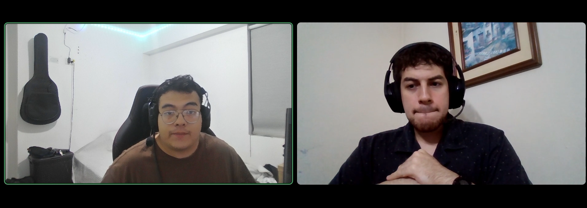</td>
      <td><strong>Datos generales:</strong> El entrevistado tiene 20 años, vive en Lima y es alumno universitario. Durante sus vacaciones ayuda a su familia en la parcela o planta familiar, por lo que participa directamente en algunas actividades agrícolas, aunque no se dedica a tiempo completo a la producción.  <strong>Cultivos y cuidado del suelo:</strong> Su familia cultiva principalmente hortalizas, como lechuga, cebolla, zanahoria y hierbas. Para cuidar el suelo procuran mantenerlo limpio, retirar los residuos de los cultivos y controlar el riego. También utilizan compost, estiércol y, en algunas ocasiones, fertilizantes; además, intentan rotar los cultivos para evitar el desgaste del suelo.  <strong>Decisiones y resultados:</strong> Las recomendaciones provienen principalmente de sus padres y familiares con más experiencia. También consultan a otros agricultores de la zona o buscan información en internet. El compost y el estiércol les han funcionado porque ayudan a que las plantas crezcan mejor y mantienen el suelo más suelto, aunque no siempre saben cuál es la cantidad correcta que deben aplicar.  <strong>Problemas de salinidad y apoyo:</strong> Han observado en algunas zonas tierra un poco blanca y plantas que crecen menos, pero no saben con seguridad si se debe a la salinidad o a un problema con el riego. Cuando aparece un problema, primero consultan entre la familia y con otros agricultores conocidos; si parece más serio, buscan orientación de un técnico agrícola.  <strong>Análisis de suelo:</strong> El entrevistado no ha realizado personalmente un análisis de suelo. Su familia hizo uno hace algunos años, pero el proceso fue complicado porque tuvieron que llevar la muestra a un laboratorio y esperar los resultados. Además, no siempre comprendían completamente la información recibida.  <strong>Expectativas frente a una herramienta:</strong> Sí usaría un dispositivo que avisara antes de que la sal dañara el cultivo, siempre que fuera fácil de instalar y tuviera un costo accesible. Para confiar en él necesitaría mediciones claras, alertas anticipadas e indicaciones sobre qué acción tomar. También consideró importante que funcionara correctamente en el campo y que alguien les enseñara a utilizarlo.</td>
      <td><strong>URL:</strong> <a href="https://upcedupe-my.sharepoint.com/:v:/g/personal/u202312899_upc_edu_pe/IQAcB97pG-fDS4BQGTQK2N5WAdovrJhmt2a7BnUcWfZR03Y?nav=eyJyZWZlcnJhbEluZm8iOnsicmVmZXJyYWxBcHAiOiJPbmVEcml2ZUZvckJ1c2luZXNzIiwicmVmZXJyYWxBcHBQbGF0Zm9ybSI6IldlYiIsInJlZmVycmFsTW9kZSI6InZpZXciLCJyZWZlcnJhbFZpZXciOiJNeUZpbGVzTGlua0NvcHkifX0&e=NYGUsb">Ver video</a> <strong>Inicio:</strong> 00:00 <strong>Duración:</strong> 04:09</td>
    </tr>
    <tr>
      <td><strong>Entrevista 2</strong>  <strong>Entrevistado:</strong> Mathias Peña <strong>Edad:</strong> 22 años <strong>Zona / distrito:</strong> Ferreñafe, Lambayeque; vive y estudia en Lima  <strong>Perfil:</strong> Estudiante universitario cuya familia tiene una parcela de unas 3 hectáreas; apoya en vacaciones y algunos fines de semana largos  <strong>Screenshot:</strong> 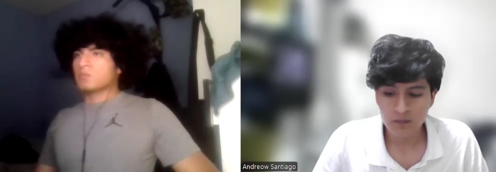</td>
      <td><strong>Datos generales:</strong> Mathias tiene 22 años y estudia en Lima. Su familia tiene una parcela de unas 3 hectáreas en Ferreñafe, Lambayeque, que maneja su papá. Él va a la parcela en vacaciones o algunos fines de semana largos, por lo que sigue lo que pasa en el campo principalmente a distancia.  <strong>Cultivos y cuidado del suelo:</strong> Cultivan principalmente arroz y, a veces, entre campañas siembran un poco de maíz. Para cuidar el suelo usan urea y guano, y en ocasiones limpian los canales para que el agua corra mejor.  <strong>Decisiones y recomendaciones:</strong> Las prácticas que aplican las recomienda la tienda de insumos del pueblo y se basan en lo que su papá aprendió de su abuelo, sin un diagnóstico técnico del suelo.  <strong>Problemas de salinidad:</strong> En una esquina de la parcela, donde el agua se queda empozada, aparece una costra blanca cuando se seca. En esa zona el arroz sale más bajo y amarillento. Su papá lo atribuye al salitre, pero no saben cuánto afecta ni cómo solucionarlo bien.  <strong>Análisis de suelo:</strong> Hicieron un análisis hace unos tres años. Tuvieron que llevar la muestra a Chiclayo y el resultado demoró casi dos semanas. Cuando llegó, tenía muchos números y términos que no entendieron, así que terminaron consultando a un ingeniero conocido.  <strong>Expectativas frente a una herramienta:</strong> Sí usaría un dispositivo que avise antes de que la sal dañe el cultivo, sobre todo porque desde Lima se entera tarde de lo que pasa en la parcela. Le gustaría recibir la alerta en el celular y poder reenviarla por WhatsApp a su papá. Para confiar en él, la herramienta tendría que explicar en palabras simples qué pasa y qué hacer, funcionar aunque la señal en el campo sea mala y no ser muy cara.</td>
      <td><strong>URL:</strong> Pendiente <strong>Inicio:</strong> Pendiente <strong>Duración:</strong> Pendiente</td>
    </tr>
    <tr>
      <td><strong>Entrevista 3</strong>  <strong>Entrevistado:</strong> Alex Ávila <strong>Edad:</strong> 23 años <strong>Zona / distrito:</strong> Salas Guadalupe, Ica  <strong>Perfil:</strong> Técnico agropecuario que trabaja a tiempo completo en el fundo familiar de unas 6 hectáreas, a cargo del riego y la fertilización junto con su tío  <strong>Screenshot:</strong> 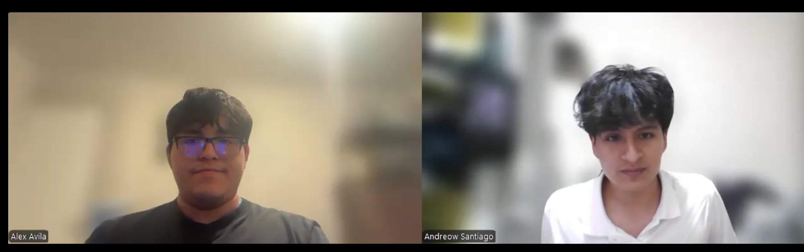</td>
      <td><strong>Datos generales:</strong> Alex tiene 23 años y vive en Salas Guadalupe, Ica. Estudió técnico agropecuario en un instituto y trabaja a tiempo completo en el fundo de su familia, de unas 6 hectáreas. Desde hace dos años se encarga del riego y de la fertilización junto con su tío, por lo que participa directamente en las decisiones de manejo del suelo.  <strong>Cultivos y mercado:</strong> Cultivan uva de mesa en 4 hectáreas y palto en las otras 2. La producción se vende a una agroexportadora, que les exige calidad y calibre, por lo que cualquier pérdida de rendimiento afecta directamente sus ingresos.  <strong>Cuidado del suelo y decisiones:</strong> Cuentan con riego por goteo con fertirriego. Aplican yeso agrícola y ácidos húmicos, y cada cierto tiempo realizan riegos largos para lavar las sales. Estas prácticas las recomendó el técnico de la agroexportadora y se complementan con lo que Alex aprendió en el instituto. Sin embargo, como el técnico visita el fundo una vez al mes, muchas decisiones se toman "al ojo".  <strong>Problemas de salinidad:</strong> El principal problema no es el agua empozada, sino el agua de riego, que se vuelve más salada sobre todo en verano, cuando baja el nivel. En el palto se queman las puntas de las hojas y en algunas hileras de uva el racimo sale más chico. Casi no se observa costra blanca, porque con el goteo la sal se acumula en el borde del bulbo húmedo; por eso, cuando se nota el problema, el cultivo ya presenta daño.  <strong>Análisis de suelo:</strong> Realizan dos análisis al año, uno de suelo y otro de agua, en un laboratorio de Ica. Cada uno cuesta alrededor de S/ 250 y el resultado llega en una semana o diez días. Alex entiende la conductividad eléctrica, pero considera que el análisis es una foto de un solo día: entre un análisis y otro la salinidad cambia y no saben en qué momento ocurrió.  <strong>Expectativas frente a una herramienta:</strong> Sí usaría un dispositivo que avise antes de que la sal dañe el cultivo, siempre que mida de forma continua y guarde el historial para ver cómo sube la salinidad después de cada riego. Le gustaría que sugiera cuándo realizar un lavado de sales y que sus mediciones puedan compararse con las del laboratorio para verificar su precisión. Además, necesita que funcione con panel solar, porque en el fundo no hay enchufes. Sobre el precio, estaría dispuesto a pagarlo si al año le cuesta menos que dos o tres análisis de laboratorio y le ayuda a no perder calibre en la uva.</td>
      <td><strong>URL:</strong> Pendiente <strong>Inicio:</strong> Pendiente <strong>Duración:</strong> Pendiente</td>
    </tr>
    <tr>
      <td rowspan="3"><strong>Ingenieros agrónomos y asesores técnicos agrícolas</strong></td>
      <td><strong>Entrevista 1</strong>  <strong>Entrevistada:</strong> Yeira Momán <strong>Edad:</strong> 30 años <strong>Zona de trabajo:</strong> Zonas agrícolas de la costa  <strong>Screenshot:</strong> </td>
      <td><strong>Datos generales:</strong> Yeira es ingeniera agrónoma y cuenta con varios años de experiencia en el sector agrícola, brindando asesorías a productores. Trabaja principalmente en zonas agrícolas de la costa y visita diferentes parcelas según las necesidades de los agricultores que asesora.  <strong>Trabajo y responsabilidades:</strong> Su labor se centra en evaluar el estado del suelo, identificar problemas que afectan el desarrollo del cultivo y recomendar acciones de manejo. Entre los problemas más frecuentes mencionó la salinidad, la falta de nutrientes y las dificultades relacionadas con el riego y el drenaje.  <strong>Herramientas y tecnología:</strong> Para sustentar sus recomendaciones utiliza análisis de laboratorio y medidores portátiles de conductividad eléctrica, porque permiten obtener una lectura rápida directamente en campo. También realiza seguimiento comparando resultados de análisis y observando la evolución del cultivo para decidir si el manejo aplicado está funcionando o debe modificarse.  <strong>Necesidades y frustraciones:</strong> Su principal dificultad es el tiempo que demanda revisar varias parcelas y desplazarse entre productores ubicados en diferentes lugares. Esto complica realizar visitas frecuentes, mantener actualizada la información de cada parcela y detectar oportunamente cambios en las condiciones del suelo.  <strong>Expectativas:</strong> Considera que recibir alertas sobre salinidad sería útil porque permitiría anticipar el problema. Para que una alerta aporte valor, debería mostrar el nivel de conductividad eléctrica, la ubicación de la parcela, la fecha de medición, la evolución del valor en el tiempo y un historial de mediciones.</td>
      <td><strong>URL:</strong> Pendiente <strong>Inicio:</strong> Pendiente <strong>Duración:</strong> Pendiente</td>
    </tr>
    <tr>
      <td>
  <strong>Entrevista 2</strong>  
  <strong>Entrevistada:</strong> Emperatriz Sessarego 
  <strong>Edad:</strong> 63 años 
  <strong>Zona de trabajo:</strong> Zonas agrícolas del norte  
  <strong>Screenshot:</strong> 
  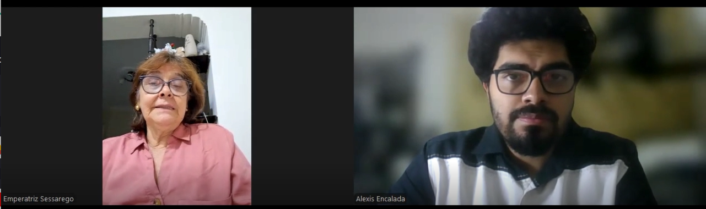
</td>
<td>
  <strong>Datos generales:</strong> La entrevistada es Emperatriz Sessarego, de 63 años, quien reside en el distrito de Jesús María, en Lima. Cuenta con formación técnica en Administración de Empresas por el CENECAP John F. Kennedy, de donde egresó aproximadamente en 1990. Actualmente se desempeña bajo relación de dependencia dentro de una empresa de consultoría agrícola, brindando asesoría a productores situados en la zona norte del país, cuyas parcelas promedian entre 20 y 30 hectáreas cada una.  
  <strong>Trabajo y responsabilidades:</strong> Su labor principal consiste en gestionar y asesorar a una cartera de aproximadamente 10 productores dedicados a cultivos vegetales y productos naturales. Su rutina implica desplazarse al campo unos tres días por semana para atender a dos o tres clientes por jornada, programando visitas con una periodicidad mensual tras una coordinación telefónica previa. En el terreno inspecciona visualmente el estado del cultivo y del suelo para identificar anomalías —como exceso de salinidad o zonas quemadas—, toma muestras para enviarlas al laboratorio interno de su empresa y brinda las recomendaciones técnicas de forma presencial y directa al agricultor.  
  <strong>Herramientas y tecnologías:</strong> Para sus labores utiliza principalmente su teléfono celular y una tablet, combinándolos con el método tradicional de apuntes en papel durante la visita de campo. En cuanto a tecnología agronómica, recurre a drones para sobrevolar las hectáreas y evaluar el terreno desde el aire, mostrando las tomas en pantalla al productor. No emplea medidores portátiles de conductividad eléctrica en suelo, sino que apoya su gestión técnica en una plataforma digital propia desarrollada por su empresa, la cual sintetiza los diagnósticos, el historial de las parcelas y las soluciones recomendadas.  
  <strong>Necesidades y frustraciones:</strong> Su principal desafío radica en la brecha tecnológica de los agricultores, quienes suelen ser reacios a la lectura de reportes digitales o a interactuar con plataformas, lo que la obliga a depender del trato presencial y de demostraciones visuales in situ. A esto se suma la ineficiencia de realizar un doble registro de datos —anotar primero a mano en papel para luego transcribir y ampliar la información en digital al volver a la oficina—, así como la considerable demanda de tiempo y esfuerzo que suponen los constantes traslados entre parcelas distantes durante la semana.  
  <strong>Expectativas:</strong> Espera contar con herramientas más ágiles, como un tablero de monitoreo de salinidad en tiempo real que le permita diagnosticar a distancia y comunicarse rápidamente con el productor por teléfono sin esperar al viaje mensual. Muestra disposición a adoptar sensores de suelo de bajo costo siempre que ofrezcan mediciones fiables, y destaca la necesidad de reportes automatizados que recopilen datos históricos, estados del suelo y seguimiento de acciones previas para comprobar si el agricultor aplicó las mejoras sugeridas.
</td>
<td>
  <strong>URL:</strong> <a href="https://upcedupe-my.sharepoint.com/:v:/g/personal/u20211g491_upc_edu_pe/IQCTehknzuIeRrR82obsOJzfAVX-4ZePCDMVwhEOjFG98mw?e=nsp1DO" target="_blank">Ver video</a> 
  <strong>Inicio:</strong> 00:00 
  <strong>Duración:</strong> 10:19
</td>
    </tr>
    <tr>
      <td>
  <strong>Entrevista 3</strong>  
  <strong>Entrevistado:</strong> Germán Villalobos Lauro 
  <strong>Edad:</strong> 30 años 
  <strong>Zona de trabajo:</strong> Valles de la costa (Lambayeque, La Libertad y Chincha)  
  <strong>Screenshot:</strong>
  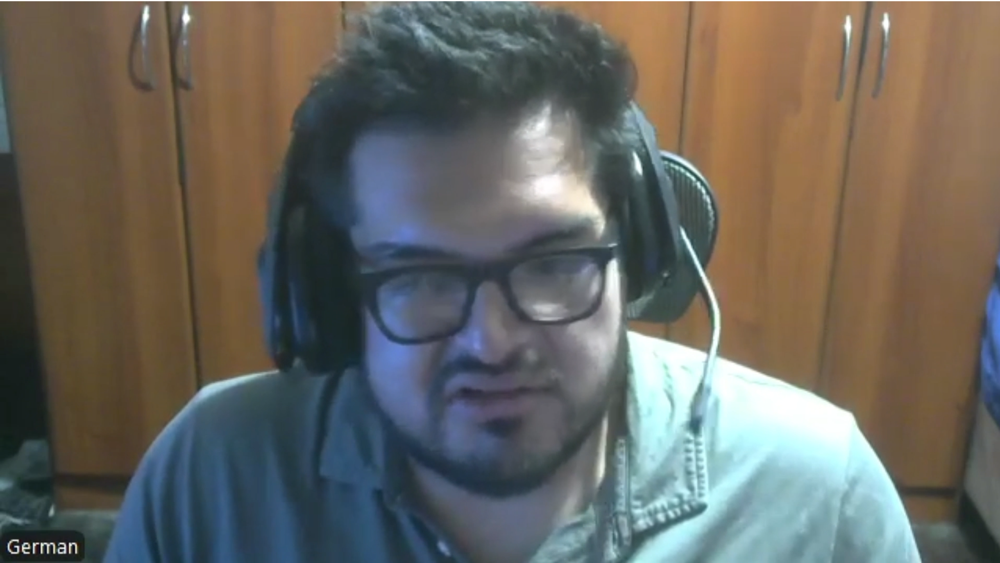
</td>
<td>
  <strong>Datos generales:</strong> El entrevistado es Germán Villalobos Lauro, de 30 años, ingeniero agrónomo egresado de la Universidad Nacional de Ingeniería (UNI). Cuenta con aproximadamente 8 años de experiencia trabajando directamente con productores agrícolas. Inició su trayectoria en una cooperativa, donde atendía a varios agricultores de la zona, y conforme fue conociendo los problemas de campo pasó a trabajar de manera independiente. Actualmente asesora a diferentes productores según los cultivos y las necesidades que cada uno tenga.  
  <strong>Trabajo y responsabilidades:</strong> Trabaja principalmente en la costa, sobre todo en los valles de Lambayeque y La Libertad, además de algunos clientes en la zona de Chincha, donde la agricultura depende bastante del riego. Su labor consiste en evaluar el estado del suelo, identificar problemas que afectan el cultivo y recomendar acciones de manejo. Entre los problemas más frecuentes menciona la salinidad y el drenaje: parcelas con costra blanca sobre el suelo (señal de acumulación de sales), terrenos que permanecen encharcados demasiado tiempo tras el riego, cultivos que pierden rendimiento sin causa evidente y compactación del suelo por el uso constante de maquinaria en la misma zona.  
  <strong>Herramientas y tecnología:</strong> Se apoya principalmente en análisis de laboratorio, solicitando conductividad eléctrica, pH y textura, además de otros parámetros según el terreno. Para confirmar problemas de salinidad utiliza la conductividad eléctrica del suelo, comparándola con la tolerancia del cultivo, ya que algunas especies toleran niveles de salinidad mayores que otras. Como recomendaciones de manejo aplica riegos de lavado calculados cuando hay acumulación de sales, sistemas de drenaje para evacuar las sales de la zona radicular, incorporación de materia orgánica (compost, guano u otros abonos), yeso agrícola para problemas de sodio, ácidos húmicos y la elección de cultivos adecuados a las condiciones del terreno. Insiste en no aplicar productos "a ciegas" solo porque a otro productor le funcionaron, sin conocer primero el estado del suelo.  
  <strong>Necesidades y frustraciones:</strong> Su mayor dificultad es atender a varios productores ubicados en zonas distintas: la distancia le impide visitar las parcelas con la frecuencia que quisiera, por lo que debe priorizar según qué productor reporta un problema o qué cultivo parece más comprometido. Muchas veces, cuando llega al terreno, el daño ya está bastante avanzado. A esto se suma el costo del análisis de laboratorio (una muestra puede ir desde unos 80 dólares hasta miles, según la complejidad y el laboratorio) y los tiempos de espera, que en ocasiones han tomado semanas por temas del propio laboratorio.  
  <strong>Expectativas:</strong> Considera que recibir alertas de salinidad le ayudaría a anticipar los problemas y, sobre todo, a organizar mejor sus visitas cuando maneja varios clientes, permitiéndole decidir si una parcela requiere atención inmediata o puede esperar. Para que la alerta aporte valor, debería mostrar qué parcela la presenta y su productor dueño, el nivel de conductividad eléctrica y su evolución reciente (si va en aumento o disminución), el nivel de tolerancia del cultivo sembrado en esa parcela, la fecha de la última revisión y un parámetro crítico de prioridad (bajo, medio o alto). Idealmente, también poder comparar varias parcelas en una sola pantalla.
</td>
<td><strong>URL:</strong> Pendiente <strong>Inicio:</strong> Pendiente <strong>Duración:</strong> Pendiente</td>
    </tr>
  </tbody>
</table>

### 2.2.3. Análisis de entrevistas

En esta sección se analizan las seis entrevistas registradas en la sección 2.2.2, tres por cada segmento objetivo. Para obtener el sustento estadístico, el equipo leyó el resumen de cada entrevista y marcó qué características objetivas (edad, ubicación, ocupación, herramientas) y subjetivas (frustraciones, motivaciones, condiciones de confianza) aparecen en él. Cada porcentaje indica qué parte de los entrevistados del segmento presenta la característica; como cada segmento tiene tres entrevistas, los valores posibles son 33% (1 de 3), 67% (2 de 3) y 100% (3 de 3). En cada gráfico se muestran las iniciales de los entrevistados que respaldan el valor, de modo que cada característica puede rastrearse hasta su resumen.

**Perfil general de los entrevistados**

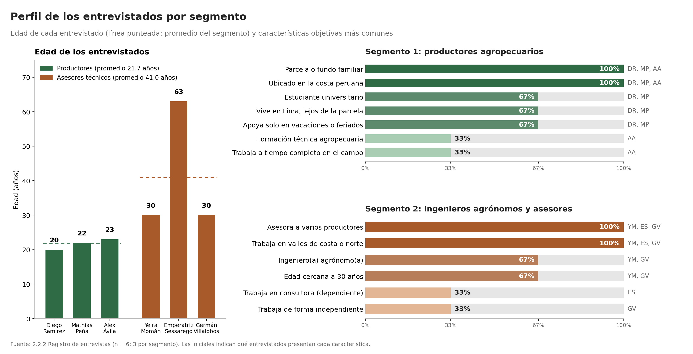

<em>Gráfico 1. Perfil de los entrevistados por segmento.</em>

Los dos segmentos tienen perfiles claramente diferentes. Los productores entrevistados son jóvenes (promedio de 21.7 años) y todos están vinculados a una parcela o fundo familiar en la costa peruana. El 67% son estudiantes universitarios que viven en Lima y apoyan en la parcela solo en vacaciones o feriados, mientras que el 33% trabaja a tiempo completo en el campo y tiene formación técnica agropecuaria. En el caso de los asesores, el promedio de edad es de 41 años, aunque el 67% tiene alrededor de 30 años; el 100% asesora a varios productores en valles de la costa o del norte y el 67% es ingeniero agrónomo.

#### Segmento 1: Pequeños y medianos productores agropecuarios

**Prácticas de cuidado del suelo y fuentes de recomendación**

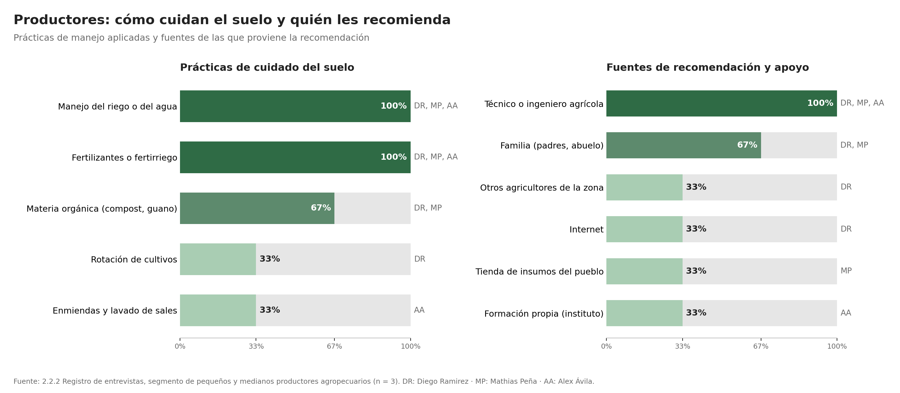

<em>Gráfico 2. Productores: prácticas de cuidado del suelo y fuentes de recomendación.</em>

El 100% de los productores maneja el riego o el agua de su parcela y aplica fertilizantes, y el 67% usa materia orgánica como compost, estiércol o guano. Solo el 33% aplica enmiendas específicas contra las sales (yeso agrícola, ácidos húmicos y lavados), lo que muestra que la mayoría no tiene un manejo dirigido a la salinidad. En cuanto a las recomendaciones, el 100% recurre en algún momento a un técnico o ingeniero agrícola, pero lo hace cuando el problema ya es serio, para interpretar un análisis o durante visitas mensuales. En el día a día, el 67% decide con base en la experiencia familiar, y cada entrevistado suma una fuente distinta: otros agricultores, internet, la tienda de insumos del pueblo o su propia formación técnica.

**Percepción de la salinidad**

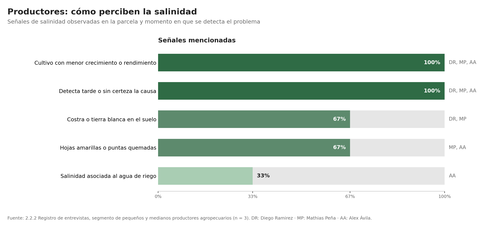

<em>Gráfico 3. Productores: señales de salinidad percibidas.</em>

El 100% de los productores ha observado cultivos con menor crecimiento o rendimiento, y el 100% detecta el problema tarde o sin certeza de su causa: Diego no sabe si se debe a la salinidad o al riego, Mathias no sabe cuánto afecta ni cómo solucionarlo, y Alex explica que, con riego por goteo, cuando se nota el problema el cultivo ya presenta daño. El 67% reconoce la costra o tierra blanca y el 67% observa hojas amarillas o con puntas quemadas. Estas señales son visibles solo cuando la sal ya afectó al cultivo, lo que confirma la necesidad de una medición anticipada.

**Experiencia con el análisis de suelo**

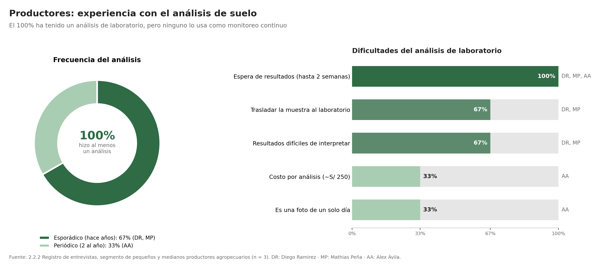

<em>Gráfico 4. Productores: experiencia con el análisis de suelo.</em>

El 100% de los productores ha tenido al menos un análisis de suelo en su parcela, pero el 67% lo hizo de forma esporádica, hace varios años, y solo el 33% lo realiza de manera periódica (dos veces al año). La dificultad común a todos es la espera de resultados, que llega hasta dos semanas. El 67% tuvo que trasladar la muestra a un laboratorio y el 67% no comprendió del todo los resultados. El productor con análisis periódicos agrega que cada uno cuesta alrededor de S/ 250 y que el resultado es una foto de un solo día, por lo que no sabe en qué momento sube la salinidad entre un análisis y otro.

**Condiciones para adoptar un dispositivo de alerta**

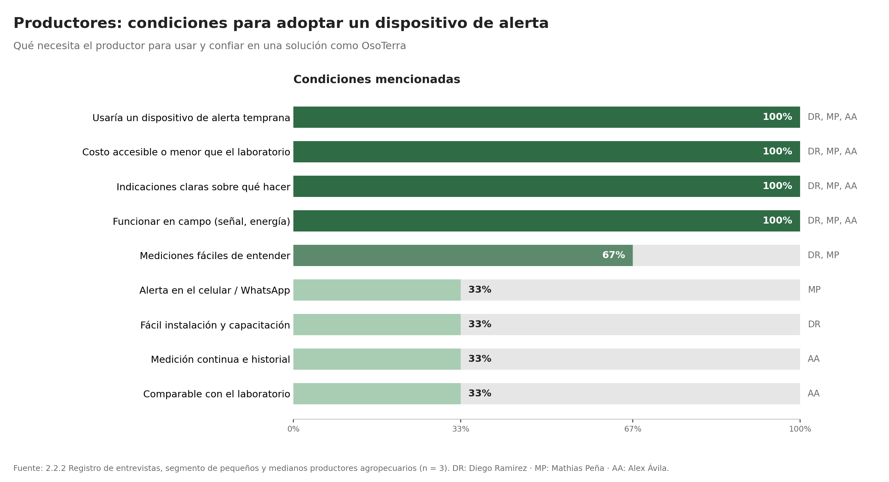

<em>Gráfico 5. Productores: condiciones para adoptar un dispositivo de alerta.</em>

El 100% de los productores usaría un dispositivo que avise antes de que la sal dañe el cultivo. Para confiar en él, el 100% exige un costo accesible (o menor que el de los análisis de laboratorio), indicaciones claras sobre qué acción tomar y que funcione en las condiciones reales del campo, con mala señal o sin enchufes. El 67% pide que las mediciones se expliquen de forma clara y simple. Otras condiciones aparecen en un solo entrevistado, pero son relevantes para el diseño: recibir la alerta en el celular y reenviarla por WhatsApp, contar con instalación sencilla y capacitación, guardar un historial continuo y poder comparar las mediciones con las del laboratorio.

**Resumen de características del segmento 1**

| Tipo | Característica | % | Entrevistados |
|---|---|---|---|
| Objetiva | Edad entre 20 y 23 años (promedio 21.7) | 100% | DR, MP, AA |
| Objetiva | Parcela o fundo familiar en la costa peruana | 100% | DR, MP, AA |
| Objetiva | Estudiante universitario que vive en Lima, lejos de la parcela | 67% | DR, MP |
| Objetiva | Ha tenido al menos un análisis de suelo | 100% | DR, MP, AA |
| Objetiva | Menciona el celular y WhatsApp como canal para recibir alertas | 33% | MP |
| Subjetiva | Decide por experiencia familiar, sin diagnóstico técnico continuo | 67% | DR, MP |
| Subjetiva | Detecta la salinidad tarde o sin certeza de la causa | 100% | DR, MP, AA |
| Subjetiva | Le frustra la espera de resultados del laboratorio | 100% | DR, MP, AA |
| Subjetiva | No entiende del todo los resultados del análisis | 67% | DR, MP |
| Subjetiva | Usaría un dispositivo de alerta temprana | 100% | DR, MP, AA |
| Subjetiva | Necesita costo accesible, indicaciones claras y funcionamiento en campo | 100% | DR, MP, AA |

*DR: Diego Ramirez · MP: Mathias Peña · AA: Alex Ávila.*

#### Segmento 2: Ingenieros agrónomos y asesores técnicos agrícolas

**Problemas atendidos y herramientas de diagnóstico**

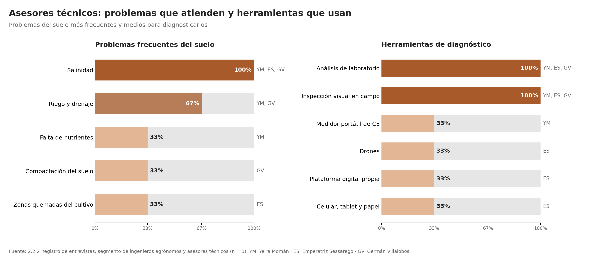

<em>Gráfico 6. Asesores técnicos: problemas atendidos y herramientas de diagnóstico.</em>

La salinidad es un problema frecuente para el 100% de los asesores, seguida del riego y el drenaje (67%). Para diagnosticarla, el 100% combina el análisis de laboratorio con la inspección visual en campo. El uso de otras tecnologías es disperso: solo el 33% tiene un medidor portátil de conductividad eléctrica, y solo el 33% trabaja con drones, una plataforma digital propia de su empresa y registros en celular, tablet y papel. Ningún asesor cuenta con una medición continua de la conductividad eléctrica en las parcelas que atiende.

**Frustraciones en el trabajo**

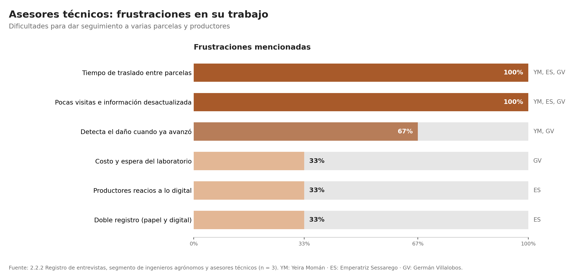

<em>Gráfico 7. Asesores técnicos: frustraciones en su trabajo.</em>

El 100% de los asesores identifica como principal frustración el tiempo de traslado entre parcelas de distintos productores, y el 100% indica que por eso visita pocas veces cada parcela y trabaja con información desactualizada. Como consecuencia, el 67% encuentra el daño ya avanzado o tiene dificultades para detectar a tiempo los cambios del suelo. Otras frustraciones son el costo y la espera del laboratorio, la resistencia de algunos productores a leer reportes digitales y el doble registro de datos en papel y en digital (33% cada una).

**Información requerida en una alerta de salinidad**

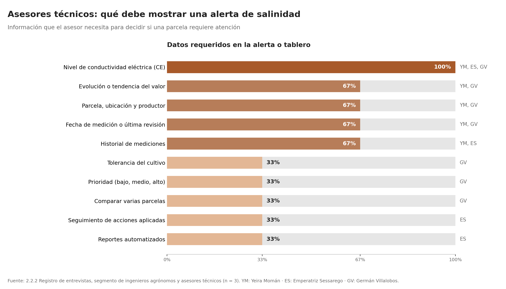

<em>Gráfico 8. Asesores técnicos: información requerida en una alerta de salinidad.</em>

El 100% de los asesores considera útil recibir alertas o monitorear la salinidad a distancia, y el 100% necesita ver el nivel de conductividad eléctrica. El 67% pide además la evolución o tendencia del valor, la parcela con su ubicación y productor, la fecha de medición o de la última revisión y el historial de mediciones. El 33% agrega datos que permiten priorizar el trabajo cuando se manejan varios clientes: la tolerancia del cultivo sembrado, un nivel de prioridad (bajo, medio o alto), la comparación de varias parcelas en una sola pantalla, el seguimiento de las acciones aplicadas y reportes automatizados.

**Resumen de características del segmento 2**

| Tipo | Característica | % | Entrevistados |
|---|---|---|---|
| Objetiva | Asesora a varios productores en valles de la costa o del norte | 100% | YM, ES, GV |
| Objetiva | Ingeniero(a) agrónomo(a) | 67% | YM, GV |
| Objetiva | Edad de alrededor de 30 años (promedio del segmento: 41) | 67% | YM, GV |
| Objetiva | Usa análisis de laboratorio e inspección visual en campo | 100% | YM, ES, GV |
| Objetiva | Usa celular, tablet, drones y una plataforma digital | 33% | ES |
| Subjetiva | Le frustra el tiempo de traslado entre parcelas | 100% | YM, ES, GV |
| Subjetiva | Trabaja con información desactualizada por las pocas visitas | 100% | YM, ES, GV |
| Subjetiva | Detecta tarde el daño en el cultivo | 67% | YM, GV |
| Subjetiva | Valora las alertas y el monitoreo de salinidad a distancia | 100% | YM, ES, GV |
| Subjetiva | Necesita ver en la alerta la tendencia de la CE, la parcela y la fecha | 67% | YM, GV |

*YM: Yeira Momán · ES: Emperatriz Sessarego · GV: Germán Villalobos.*

#### Comparación entre segmentos

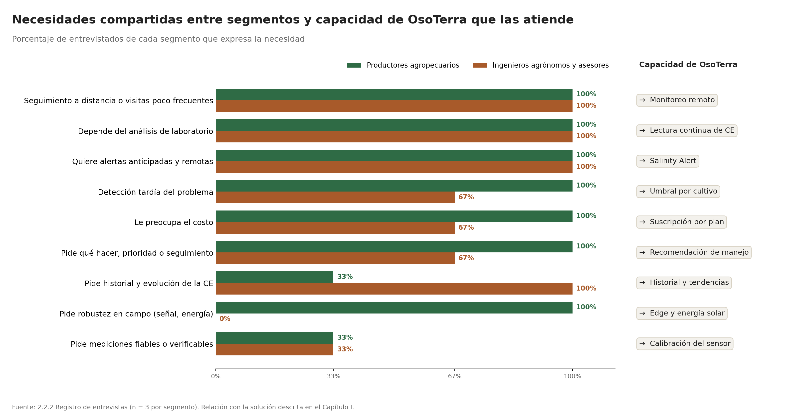

<em>Gráfico 9. Necesidades compartidas entre segmentos y capacidad de OsoTerra que las atiende.</em>

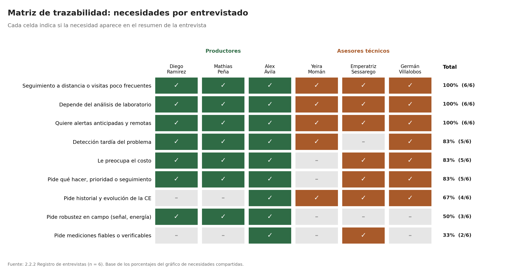

<em>Gráfico 10. Matriz de trazabilidad de necesidades por entrevistado.</em>

Al cruzar ambos segmentos se encuentran tres necesidades presentes en el 100% de los entrevistados: dar seguimiento a la parcela a distancia o con visitas poco frecuentes, depender del análisis de laboratorio para conocer el estado del suelo y querer alertas anticipadas y remotas. La detección tardía del problema aparece en el 83% de los entrevistados, al igual que la preocupación por el costo y la necesidad de saber qué hacer o qué parcela atender primero. Estas coincidencias validan la propuesta central de OsoTerra: la lectura continua de la conductividad eléctrica y las alertas de salinidad según el umbral de cada cultivo.

Las diferencias entre segmentos orientan el diseño para cada tipo de usuario. Para el productor, la robustez en campo (100% frente a 0%) y las indicaciones simples son prioritarias, por lo que la solución debe operar con energía solar, seguir funcionando cuando falle la señal y traducir cada alerta en una acción concreta. Para el asesor, el historial y la evolución de la conductividad eléctrica (100% frente a 33%) son determinantes, junto con la vista de varias parcelas y la prioridad de cada alerta. Estas características son la base de los User Personas de la sección 2.3.1.

## 2.3. Needfinding

### 2.3.1. User Personas

Como parte del análisis del proceso de needfinding, se desarrollaron user personas representativos de los dos segmentos principales de la solución: los pequeños y medianos productores agropecuarios, y los ingenieros agrónomos o asesores técnicos independientes. Estas personas sintetizan las características clave obtenidas a partir del análisis cualitativo de las entrevistas, tales como comportamientos recurrentes, motivaciones, frustraciones y objetivos frente a la gestión de los cultivos.

Estas herramientas ayudan a traducir los datos de campo en perfiles accionables, orientando las decisiones estratégicas sobre las funcionalidades y la priorización técnica del producto. Las personas creadas reflejan las necesidades urgentes de detección temprana, accesibilidad tecnológica y monitoreo continuo, facilitando un diseño más empático, comprensible y efectivo para OsoSense.

**Persona 1:** Familiar joven involucrado en la gestión agrícola
- **Nombre:** Diego Ramos
- **Edad:** 20 años
- **Ocupación:** Estudiante universitario y apoyo en la gestión de una parcela familiar
- **Ubicación:** Lima, Perú
- **Zona de la parcela:** Huaral, Cañete o Chancay, por confirmar en la entrevista
- **Rol:** Familiar joven que ayuda a coordinar y supervisar actividades agrícolas desde Lima
- **Perfil:** Tiene facilidad para utilizar aplicaciones móviles, pero sus conocimientos sobre salinidad, conductividad eléctrica y análisis de suelo son básicos. Aunque no permanece diariamente en el campo, mantiene comunicación con sus familiares y participa en la coordinación de actividades, compra de insumos y seguimiento de la parcela.
- **Background:** Diego vive en Lima y mantiene relación con una parcela familiar ubicada en una zona agrícola cercana. Visita el campo de manera ocasional y depende principalmente de llamadas y mensajes para conocer el estado del cultivo. Cuando aparece un problema, consulta a un familiar con más experiencia o a un asesor agrícola. Su interés es utilizar la tecnología para informarse a distancia y ayudar a su familia a actuar antes de que un problema del suelo afecte el cultivo.

**Tecnologías:**
* Teléfono celular Android.
* WhatsApp y llamadas telefónicas.
* YouTube y Google para buscar información.
* Google Maps y cámara del celular.
* Internet móvil, sujeto a la conectividad disponible en la zona agrícola.

**Skills:**
* Manejo básico de aplicaciones móviles.
* Comunicación mediante WhatsApp y llamadas.
* Búsqueda de información en internet.
* Registro de información mediante fotografías y mensajes.
* Coordinación de actividades con familiares.
* Aprendizaje rápido de herramientas digitales.
* Conocimientos básicos sobre las actividades de la parcela.
* Capacidad para comunicar problemas al asesor o familiar encargado.

**Motivaciones:**
* Apoyar a su familia en la gestión de la parcela.
* Evitar pérdidas en el cultivo.
* Aprovechar la tecnología para resolver problemas reales.
* Aprender más sobre agricultura.
* Tener mayor control sobre lo que ocurre en la parcela aunque se encuentre en Lima.

**Frustraciones:**
* No poder estar presente en la parcela todos los días.
* Recibir información tarde o incompleta.
* No comprender fácilmente los términos técnicos del suelo.
* Depender de otras personas para conocer el estado del cultivo.
* No saber si un problema se debe a salinidad, falta de nutrientes o exceso de agua.
* Encontrar poca conectividad en la zona agrícola.

**Objetivos:**
* Conocer el estado de la parcela sin visitarla diariamente.
* Detectar problemas antes de que afecten el cultivo.
* Recibir información clara y fácil de entender.
* Compartir las alertas con su familia o un asesor técnico.
* Coordinar rápidamente una acción cuando se detecte un problema.

**Necesidades:**
* Alertas accesibles desde el celular.
* Explicaciones visuales y sencillas.
* Historial de mediciones por parcela.
* Ubicación, fecha y hora de cada medición.
* Recomendaciones sobre qué hacer después de una alerta.
* Posibilidad de compartir la información por WhatsApp.

**Problema principal:**
> Diego no puede supervisar constantemente la parcela porque vive en Lima. Cuando recibe información sobre un problema del suelo, puede ser demasiado tarde para actuar.

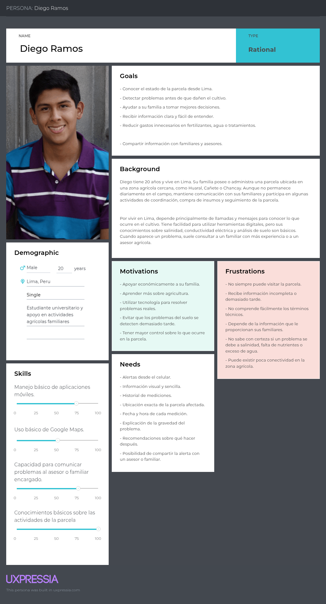

<em>Figura. User Persona 1: Diego Ramos.</em>

**Persona 2:** Asesora técnica agrícola independiente
- **Nombre:** María Fernanda Salazar
- **Edad:** 32 años
- **Ocupación:** Ingeniera agrónoma y asesora técnica independiente
- **Ubicación:** Costa norte del Perú
- **Rol:** Asesora a pequeños y medianos productores agrícolas y supervisa sus parcelas
- **Perfil:** Es una profesional técnica que atiende a varios productores y necesita información confiable para evaluar el suelo, recomendar acciones de manejo y dar seguimiento a los cultivos. Tiene facilidad para interpretar datos agronómicos, pero requiere información organizada y disponible para comparar diferentes parcelas.
- **Background:** María Fernanda trabaja con productores de diferentes zonas agrícolas de la costa norte. Debido a que atiende varias parcelas, debe organizar sus visitas y desplazarse constantemente. Utiliza análisis de laboratorio y medidores portátiles de conductividad eléctrica para revisar el estado del suelo. Los problemas que encuentra con mayor frecuencia son la salinidad, la falta de nutrientes, el riego inadecuado y las dificultades de drenaje. Para comprobar si una recomendación funciona, compara las mediciones con la evolución del cultivo.

**Tecnologías:**
* Smartphone Android.
* WhatsApp y llamadas telefónicas.
* Medidor portátil de conductividad eléctrica.
* Análisis de laboratorio.
* Aplicaciones móviles.
* Internet móvil.
* Hojas de cálculo o registros digitales.
* Plataforma web para consultar reportes e históricos.

**Skills:**
* Interpretación de conductividad eléctrica.
* Identificación de problemas de salinidad.
* Análisis de resultados de laboratorio.
* Diagnóstico de problemas de riego y drenaje.
* Recomendación de acciones agrícolas.
* Seguimiento de cultivos.
* Comparación de datos históricos.
* Comunicación con productores.
* Organización de visitas a parcelas.

**Motivaciones:**
* Ayudar a prevenir pérdidas agrícolas.
* Mejorar la calidad de sus recomendaciones.
* Ahorrar tiempo en desplazamientos.
* Contar con información actualizada de cada parcela.
* Aumentar la confianza de sus clientes.

**Frustraciones:**
* No puede visitar todas las parcelas con la frecuencia necesaria.
* Las mediciones portátiles son puntuales y no muestran una tendencia continua.
* La información de cada productor puede estar dispersa.
* Le cuesta observar tendencias de largo plazo.
* Puede enterarse tarde de un cambio en el suelo.
* Necesita validar la información antes de recomendar una acción.

**Objetivos:**
* Supervisar varias parcelas con menos desplazamientos.
* Detectar aumentos de salinidad oportunamente.
* Sustentar sus recomendaciones con datos.
* Comparar el estado de diferentes parcelas.
* Atender a más productores de manera eficiente.

**Necesidades:**
* Alertas tempranas sobre aumentos de salinidad.
* Historial y tendencia de las mediciones.
* Ubicación y fecha de cada lectura.
* Comparación entre parcelas.
* Reportes exportables para compartir con productores.
* Información validada y confiable.
* Acceso desde celular y computadora.
* Datos técnicos acompañados de una explicación resumida.

**Problema principal:**
> María Fernanda atiende varias parcelas y no puede visitarlas con la frecuencia necesaria. Sin monitoreo continuo, puede detectar un problema de salinidad cuando ya está afectando al cultivo.

**Quote representativa:**
> "Necesito ver cómo está evolucionando cada parcela para decidir dónde debo intervenir primero."

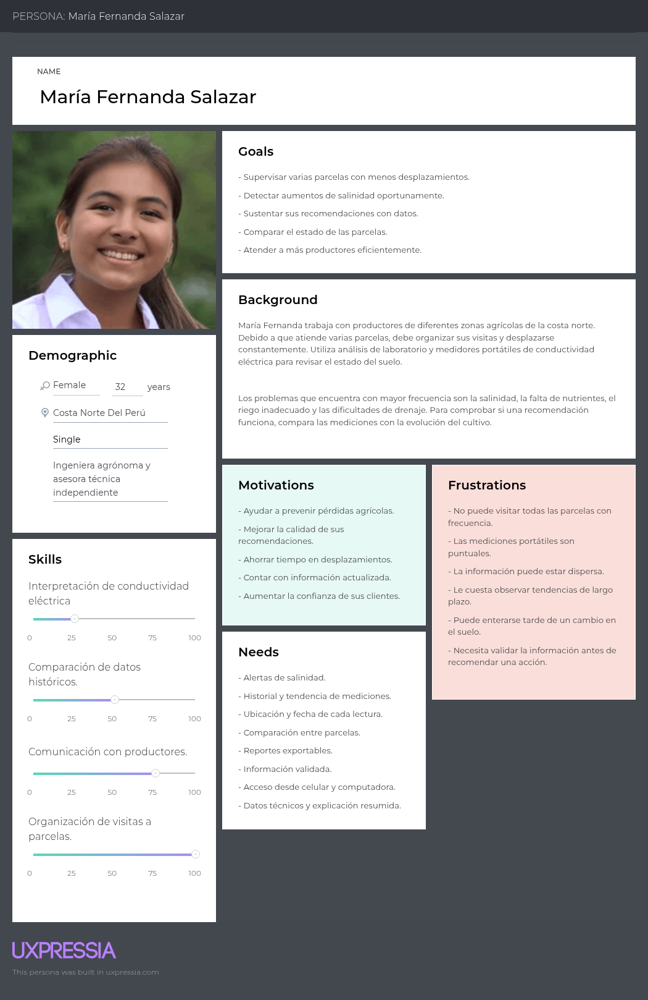

<em>Figura. User Persona 2: María Fernanda Salazar.</em>

### 2.3.2. User Task Matrix

### 2.3.3. User Journey Mapping

Con el objetivo de comprender en profundidad las necesidades y puntos de fricción de los usuarios, se desarrollaron los User Journey Maps utilizando la herramienta UXPressia. Este proceso visualiza de manera empática el recorrido "As-Is" (situación actual) que cada segmento realiza hoy en día, enfrentando la falta de monitoreo continuo y la desorganización de los datos agrícolas sin contar con una solución tecnológica centralizada. 

Cada User Journey Map se encuentra directamente vinculado con su respectivo User Persona, ilustrando paso a paso las acciones, emociones y problemas que experimentan antes de la introducción de OsoSense.

**Segmento Objetivo #1: Familiar joven involucrado en la gestión agrícola (Diego Ramos)**
Se evidencia un flujo de supervisión fragmentado y reactivo. Diego experimenta alta ansiedad e impotencia al intentar gestionar la parcela familiar a distancia desde la ciudad. Su recorrido actual depende de llamadas telefónicas intermitentes y fotos borrosas. La falta de visibilidad en tiempo real provoca que se entere de los problemas de salinidad cuando el cultivo ya presenta daños visibles, sufriendo una profunda frustración al verse obligado a realizar gastos a ciegas en fertilizantes o riego sin un diagnóstico preciso.

Figura. *As-Is User Journey Map - Persona 1: Diego Ramos*

**Segmento Objetivo #2: Asesora técnica agrícola independiente (María Fernanda Salazar)**
María Fernanda enfrenta un ciclo operativo ineficiente y limitante para su crecimiento profesional. Su recorrido ilustra un desgaste progresivo que inicia con la planificación a ciegas de sus visitas y cae drásticamente debido a la fricción de los viajes físicos para tomar lecturas manuales. El punto más crítico de su experiencia ocurre durante la espera prolongada por los resultados de laboratorio, lo cual genera un cuello de botella que culmina en la entrega de recomendaciones tardías al agricultor, afectando tanto el cultivo como su propia reputación profesional.

Figura. *As-Is User Journey Map - Persona 2: María Fernanda Salazar*

### 2.3.4. Empathy Mapping

<em>Figura. Empathy Map 1: Diego Ramos.</em>

<em>Figura. Empathy Map 2: María Fernanda Salazar.</em>

## 2.4. Big Picture EventStorming

El equipo realizó un Big Picture EventStorming para comprender el dominio completo de OsoTerra IoT antes de especificar requisitos y diseñar la solución. El objetivo fue construir una visión compartida del negocio de monitoreo de salinidad del suelo: qué ocurre desde que un productor o un asesor técnico llega a la plataforma hasta que se toma una acción correctiva en la parcela, qué personas y sistemas participan, dónde están los principales problemas y qué oportunidades puede aprovechar la solución.

La sesión se trabajó de forma colaborativa en FigJam y se apoyó en la información ya obtenida en capítulos anteriores: el problema y los segmentos objetivo del Capítulo I, las hipótesis del Lean UX Process, el análisis de competidores, las guías y el registro de entrevistas, y los términos del dominio agronómico. Se siguió la guía paso a paso de Big Picture EventStorming indicada en el enunciado (https://bit.ly/bpes-guide) y la notación del *EventStorming Glossary & Cheat Sheet* de ddd-crew.

**Notación utilizada**

| Elemento | Color | Uso en la sesión |
|---|---|---|
| Domain Event | Naranja | Hecho relevante para el negocio, redactado en pasado (por ejemplo, *Soil Reading Stored*). |
| Actor | Amarillo | Persona o rol que ejecuta una acción o se ve afectado por un evento. |
| External System | Rosado | Sistema de software, interno o de terceros, que interviene en el proceso. |
| HotSpot | Rojo | Duda, conflicto, fricción o riesgo detectado. |
| Opportunity | Verde | Mejora que la solución puede aprovechar. |
| Pivotal Event | Naranja con barra roja | Evento que marca un cambio de etapa en el negocio. |

El proceso se desarrolló en cinco etapas. Cada etapa se construyó sobre la anterior, por lo que las figuras muestran la evolución progresiva del mismo tablero.

**Etapa 1: Chaotic Exploration**

En la primera etapa cada integrante escribió, sin ordenar ni discutir, todos los eventos de dominio que conocía del negocio. Se aceptaron duplicados, sinónimos y términos imprecisos, ya que el propósito era obtener la mayor cantidad posible de hechos relevantes en poco tiempo.

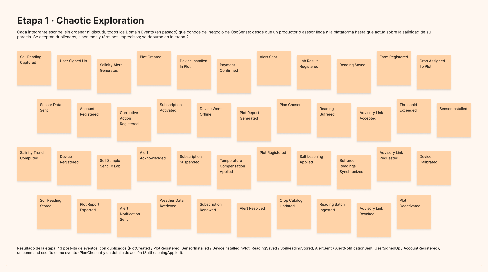

<em>Figura 11. Big Picture EventStorming, etapa 1: Chaotic Exploration.</em>

El resultado fueron 43 post-its de eventos. Entre ellos aparecieron duplicados como *PlotCreated* y *PlotRegistered*, *SensorInstalled* y *DeviceInstalledInPlot*, *ReadingSaved* y *SoilReadingStored*, *AlertSent* y *AlertNotificationSent*, y *UserSignedUp* y *AccountRegistered*. También apareció una acción escrita como evento (*PlanChosen*) y un detalle de una acción (*SaltLeachingApplied*), que se revisaron en la etapa siguiente.

**Etapa 2: Enforce the Timeline**

En la segunda etapa el equipo ordenó los eventos de izquierda a derecha según el momento en que ocurren, eliminó duplicados y unificó los nombres con el Ubiquitous Language de la sección 2.5. Luego agrupó los eventos en once fases del negocio. La línea de tiempo continúa de la primera fila a la segunda.

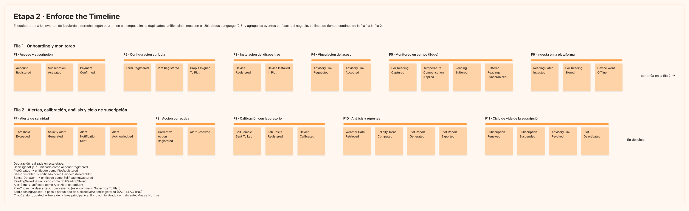

<em>Figura 12. Big Picture EventStorming, etapa 2: Enforce the Timeline.</em>

Las fases identificadas y sus eventos son las siguientes:

| Fase | Eventos |
|---|---|
| F1. Acceso y suscripción | Account Registered, Subscription Activated, Payment Confirmed |
| F2. Configuración agrícola | Farm Registered, Plot Registered, Crop Assigned To Plot |
| F3. Instalación del dispositivo | Device Registered, Device Installed In Plot |
| F4. Vinculación del asesor | Advisory Link Requested, Advisory Link Accepted |
| F5. Monitoreo en campo (Edge) | Soil Reading Captured, Temperature Compensation Applied, Reading Buffered, Buffered Readings Synchronized |
| F6. Ingesta en la plataforma | Reading Batch Ingested, Soil Reading Stored, Device Went Offline |
| F7. Alerta de salinidad | Threshold Exceeded, Salinity Alert Generated, Alert Notification Sent, Alert Acknowledged |
| F8. Acción correctiva | Corrective Action Registered, Alert Resolved |
| F9. Calibración con laboratorio | Soil Sample Sent To Lab, Lab Result Registered, Device Calibrated |
| F10. Análisis y reportes | Weather Data Retrieved, Salinity Trend Computed, Plot Report Generated, Plot Report Exported |
| F11. Ciclo de vida de la suscripción | Subscription Renewed, Subscription Suspended, Advisory Link Revoked, Plot Deactivated |

La depuración dejó 35 eventos. Los duplicados se unificaron con el nombre del glosario; *PlanChosen* se descartó como evento porque corresponde a la acción de suscribirse a un plan; *SaltLeachingApplied* pasó a ser un tipo de *Corrective Action Registered*; y *CropCatalogUpdated* quedó fuera de la línea principal, porque el catálogo de cultivos y sus umbrales de Maas y Hoffman se administran de forma centralizada.

**Etapa 3: People and External Systems**

En la tercera etapa se ubicaron, encima de cada fase, las personas que ejecutan o se ven afectadas por los eventos y los sistemas que intervienen en ellos.

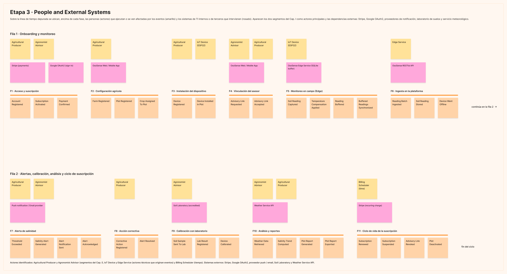

<em>Figura 13. Big Picture EventStorming, etapa 3: People and External Systems.</em>

Los actores principales son los dos segmentos objetivo del Capítulo I, el **Agricultural Producer** y el **Agronomist Advisor**. También participan actores técnicos que originan eventos, como el **IoT Device (ESP32)** y el **Edge Service**, y el **Billing Scheduler**, que representa el paso del tiempo en la renovación de suscripciones. Entre los sistemas aparecen los componentes propios de la solución (OsoSense Web / Mobile App, OsoSense Edge Service y OsoSense RESTful API) y los sistemas de terceros: **Stripe** para los pagos, **Google OAuth2** para el inicio de sesión, un proveedor de notificaciones push y correo, el **Soil Laboratory** acreditado y un **Weather Service API**. Esta etapa hizo visibles las dependencias externas que la solución debe integrar.

**Etapa 4: Problems and Opportunities**

En la cuarta etapa el equipo marcó debajo de cada fase los HotSpots y las Opportunities. Los HotSpots se basaron en los hallazgos de las entrevistas, en las estadísticas de los segmentos y en el análisis de competidores.

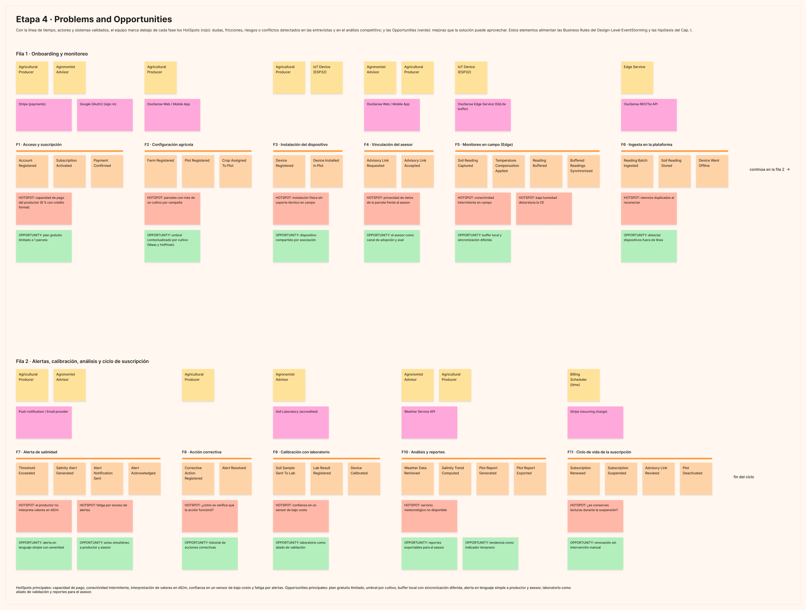

<em>Figura 14. Big Picture EventStorming, etapa 4: Problems and Opportunities.</em>

| Fase | HotSpots | Opportunities |
|---|---|---|
| F1. Acceso y suscripción | Baja capacidad de pago del productor (8 % con acceso a crédito formal). | Plan gratuito limitado a una parcela. |
| F2. Configuración agrícola | Parcelas con más de un cultivo en la misma campaña. | Umbral contextualizado por cultivo (Maas y Hoffman). |
| F3. Instalación del dispositivo | Instalación física sin soporte técnico en campo. | Dispositivo compartido por asociación de productores. |
| F4. Vinculación del asesor | Privacidad de los datos de la parcela frente al asesor. | El asesor como canal de adopción y aval de confianza. |
| F5. Monitoreo en campo | Conectividad intermitente; baja humedad que distorsiona la conductividad eléctrica. | Buffer local y sincronización diferida. |
| F6. Ingesta en la plataforma | Reenvíos duplicados al restablecerse la conectividad. | Detección de dispositivos fuera de línea. |
| F7. Alerta de salinidad | El productor no interpreta valores en dS/m; fatiga por exceso de alertas. | Alerta en lenguaje simple con severidad; aviso simultáneo a productor y asesor. |
| F8. Acción correctiva | Dificultad para verificar si la acción funcionó. | Historial de acciones correctivas. |
| F9. Calibración con laboratorio | Desconfianza en un sensor de bajo costo. | Laboratorio como aliado de validación. |
| F10. Análisis y reportes | Indisponibilidad del servicio meteorológico. | Reportes exportables para el asesor; tendencia como indicador temprano. |
| F11. Ciclo de vida de la suscripción | Tratamiento de las lecturas generadas durante una suspensión. | Renovación sin intervención manual. |

**Etapa 5: Pivotal Events and Emerging Boundaries**

En la quinta etapa se identificaron los eventos pivote, es decir, los pocos eventos de mayor interés para el negocio que marcan un cambio de etapa. Cada evento pivote se señaló con una barra roja. A partir de ellos y de las fases se trazaron las fronteras emergentes, representadas con bandas en la parte inferior de cada fila.

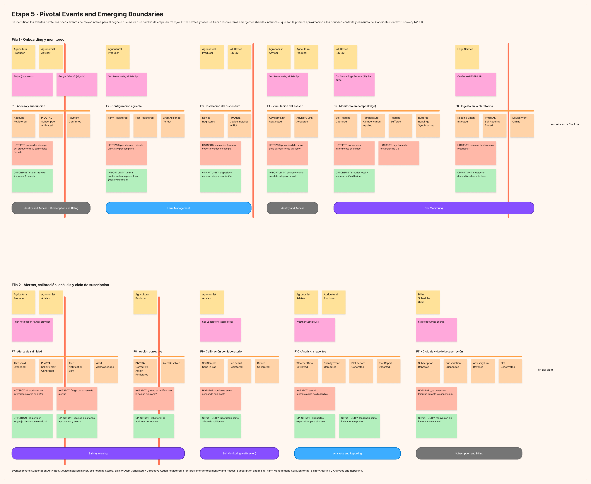

<em>Figura 15. Big Picture EventStorming, etapa 5: Pivotal Events and Emerging Boundaries.</em>

| Evento pivote | Cambio de etapa que representa |
|---|---|
| Subscription Activated | El visitante pasa a ser un usuario con un plan y un cupo de parcelas. |
| Device Installed In Plot | La parcela queda descrita (cultivo y umbral) y lista para ser monitoreada. |
| Soil Reading Stored | El suelo produce datos confiables y continuos en la plataforma. |
| Salinity Alert Generated | El dato se interpreta según el cultivo y se convierte en un riesgo que llega a las personas. |
| Corrective Action Registered | El ciclo de atención se cierra y la información pasa al historial y a los reportes. |

Las fronteras emergentes identificadas fueron: **Identity and Access** y **Subscription and Billing** (F1, F4 y F11), **Farm Management** (F2 y F3), **Soil Monitoring** (F5, F6 y la calibración de F9), **Salinity Alerting** (F7 y F8) y **Analytics and Reporting** (F10).

**Resultados del Big Picture EventStorming**

- Se obtuvo una línea de tiempo única de 35 eventos de dominio en once fases, con nombres alineados al Ubiquitous Language.
- Se confirmó que el **Agricultural Producer** y el **Agronomist Advisor** son los actores centrales del negocio, y que la solución depende de cinco sistemas de terceros.
- Los principales riesgos son la conectividad en campo, la interpretación de lecturas técnicas por parte del productor, la confianza en un dispositivo de bajo costo y la capacidad de pago del segmento principal.
- Las principales oportunidades son las alertas en lenguaje simple contextualizadas por cultivo, el buffer local con sincronización diferida, el historial y la tendencia de salinidad, los reportes para asesores y la validación con laboratorio.
- Los cinco eventos pivote y las seis fronteras emergentes son el insumo del Candidate Context Discovery de la sección 4.1.1.1.

**URL del board en FigJam:** [OsoSense - Strategic DDD (Persona 3)](https://www.figma.com/board/IKkiZBJVEPP7dJKERzuDQJ/OsoSense---Strategic-DDD--Persona-3-?node-id=0-1&t=JmLMs0KXFXlRHfkK-1)

## 2.5. Ubiquitous Language

El siguiente glosario recoge los términos y conceptos del dominio del negocio empleados de manera consistente por todos los miembros del equipo y los stakeholders. Los términos se expresan en inglés, con su equivalente en español entre paréntesis cuando corresponde. Se incluyen únicamente términos del dominio agronómico y del negocio; no se incluyen términos técnicos del área de ingeniería de software.

| Término (inglés) | Equivalente en español | Definición |
|---|---|---|
| **Electrical Conductivity (EC)** | Conductividad eléctrica | Capacidad de un medio para conducir corriente eléctrica. En el suelo es proporcional a la concentración de sales disueltas, por lo que constituye el indicador estándar de salinidad. Se expresa en decisiemens por metro (dS/m). |
| **Saturated Paste Extract EC (ECe)** | Conductividad eléctrica del extracto de saturación | Medición de la conductividad eléctrica realizada sobre el extracto de una pasta de suelo saturada con agua destilada. Es el método de referencia de laboratorio y la base sobre la que se definen los umbrales de tolerancia de los cultivos. |
| **Saline Soil** | Suelo salino | Suelo cuya conductividad eléctrica del extracto de saturación es igual o superior a 4 dS/m, condición a partir de la cual las sales disueltas dificultan la absorción de agua y nutrientes por la raíz. |
| **Soil Salinization** | Salinización del suelo | Proceso de acumulación progresiva de sales solubles en el perfil del suelo, que reduce su productividad agrícola y puede llegar a inutilizarlo. |
| **Salinity Threshold** | Umbral de salinidad | Valor de conductividad eléctrica a partir del cual un cultivo determinado comienza a experimentar reducción de rendimiento. Varía por especie según el modelo de Maas y Hoffman. |
| **Salt Tolerance** | Tolerancia a la sal | Capacidad de un cultivo para mantener su rendimiento bajo condiciones de salinidad creciente. Los cultivos se clasifican como sensibles, moderadamente sensibles, moderadamente tolerantes o tolerantes. |
| **Salt Leaching** | Lavado de sales | Práctica de manejo consistente en aplicar una lámina de riego superior a la demanda del cultivo con el fin de desplazar las sales acumuladas por debajo de la zona radicular. |
| **Leaching Requirement** | Requerimiento de lavado | Fracción adicional de la lámina de riego necesaria para mantener la salinidad de la zona radicular por debajo del umbral tolerable del cultivo. |
| **Soil Moisture** | Humedad del suelo | Contenido de agua presente en el suelo. Afecta directamente la lectura de conductividad eléctrica, ya que la corriente circula a través de la solución del suelo. |
| **Soil Temperature** | Temperatura del suelo | Temperatura del perfil edáfico. Influye sobre la conductividad eléctrica medida, por lo que toda lectura requiere compensación térmica para ser comparable. |
| **Temperature Compensation** | Compensación por temperatura | Ajuste matemático aplicado a una lectura de conductividad eléctrica para expresarla en su valor equivalente a una temperatura de referencia, convencionalmente 25 °C. |
| **Total Dissolved Solids (TDS)** | Sólidos disueltos totales | Concentración total de sustancias disueltas en una solución, expresada en mg/L. Para valores de conductividad eléctrica inferiores a 5 dS/m se relaciona aproximadamente como 1 dS/m ≈ 640 mg/L. |
| **Water Table** | Napa freática | Nivel superior del agua subterránea. Cuando asciende hacia la superficie favorece el ascenso capilar de sales y agrava la salinización. |
| **Capillary Rise** | Ascenso capilar | Movimiento ascendente del agua del suelo por capilaridad, que transporta sales disueltas hacia la superficie donde se concentran al evaporarse el agua. |
| **Drainage** | Drenaje | Capacidad del suelo y de la infraestructura asociada para evacuar el exceso de agua. Su deficiencia es una de las causas principales de la salinización en los valles de la costa peruana. |
| **Irrigation Water Quality** | Calidad del agua de riego | Conjunto de características químicas del agua empleada para regar, en particular su contenido de sodio, cloruros, sulfatos y boro, que determinan su potencial salinizante. |
| **Gravity Irrigation** | Riego por gravedad | Sistema de riego en el que el agua se distribuye por escurrimiento superficial. Es el sistema predominante entre los pequeños productores peruanos y el de menor eficiencia en el uso del agua. |
| **Technified Irrigation** | Riego tecnificado | Sistemas de riego presurizado, principalmente goteo y aspersión, que permiten un control preciso de la lámina aplicada. |
| **Farm** | Finca / fundo | Unidad agropecuaria conducida por un productor, que puede comprender una o varias parcelas. |
| **Plot** | Parcela | Superficie delimitada dentro de una finca, con un cultivo y un manejo homogéneos. Es la unidad mínima de monitoreo de la solución. |
| **Crop** | Cultivo | Especie vegetal sembrada en una parcela. Determina el umbral de salinidad aplicable para la generación de alertas. |
| **Growing Season** | Campaña agrícola | Ciclo productivo que abarca desde la siembra hasta la cosecha de un cultivo. En el Perú se contabiliza oficialmente de agosto a julio. |
| **Yield** | Rendimiento | Producción obtenida por unidad de superficie, habitualmente expresada en toneladas por hectárea. |
| **Agricultural Producer** | Productor agropecuario | Persona que conduce una unidad agropecuaria y toma las decisiones sobre su manejo. Es el usuario principal de la solución. |
| **Smallholder** | Pequeño productor | Productor agropecuario que conduce una unidad menor a cinco hectáreas. Representa el 81,9 % de los productores del Perú. |
| **Agronomist Advisor** | Asesor agronómico | Ingeniero agrónomo que presta servicios de asesoría técnica a uno o varios productores. Es el segundo segmento objetivo de la solución. |
| **Technical Assistance** | Asistencia técnica | Servicio de acompañamiento profesional al productor en las decisiones de manejo del cultivo. |
| **Soil Analysis** | Análisis de suelo | Determinación en laboratorio de las propiedades físicas y químicas de una muestra de suelo. Constituye la alternativa vigente y el referente de precisión frente al cual se valida la solución. |
| **Soil Reading** | Lectura de suelo | Conjunto de valores de conductividad eléctrica, humedad y temperatura capturados simultáneamente por el dispositivo en un instante determinado. |
| **Salinity Alert** | Alerta de salinidad | Notificación generada cuando la conductividad eléctrica compensada de una parcela supera el umbral de tolerancia del cultivo que aloja. |
| **Salinity Trend** | Tendencia de salinidad | Dirección y magnitud del cambio de la conductividad eléctrica de una parcela a lo largo de un periodo. Es el indicador relevante para la detección temprana, por encima del valor puntual. |
| **Corrective Action** | Acción correctiva | Intervención de manejo ejecutada en respuesta a una alerta, como un lavado de sales, un ajuste de la lámina de riego o una corrección del drenaje. |
| **Calibration** | Calibración | Proceso de ajuste de las lecturas del dispositivo tomando como referencia un análisis de laboratorio acreditado sobre la misma parcela. |
