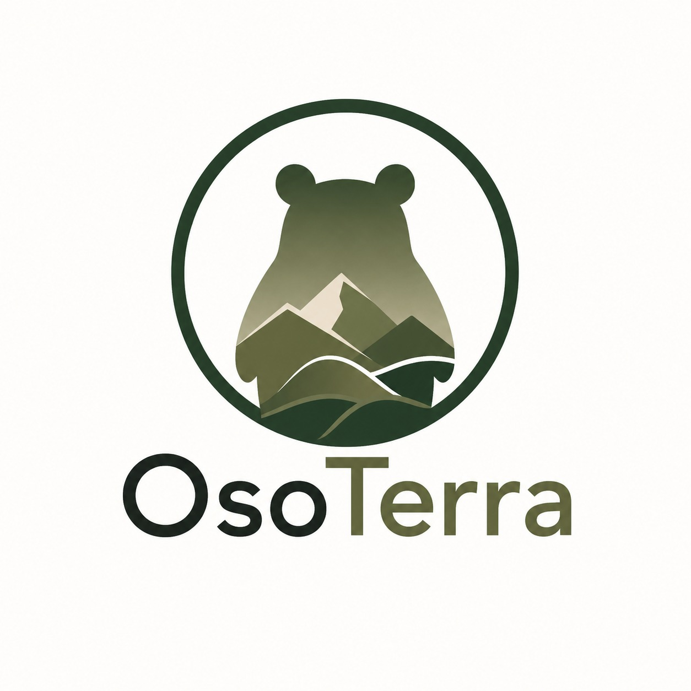
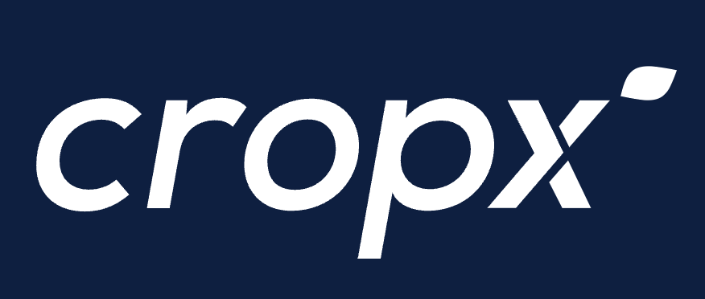
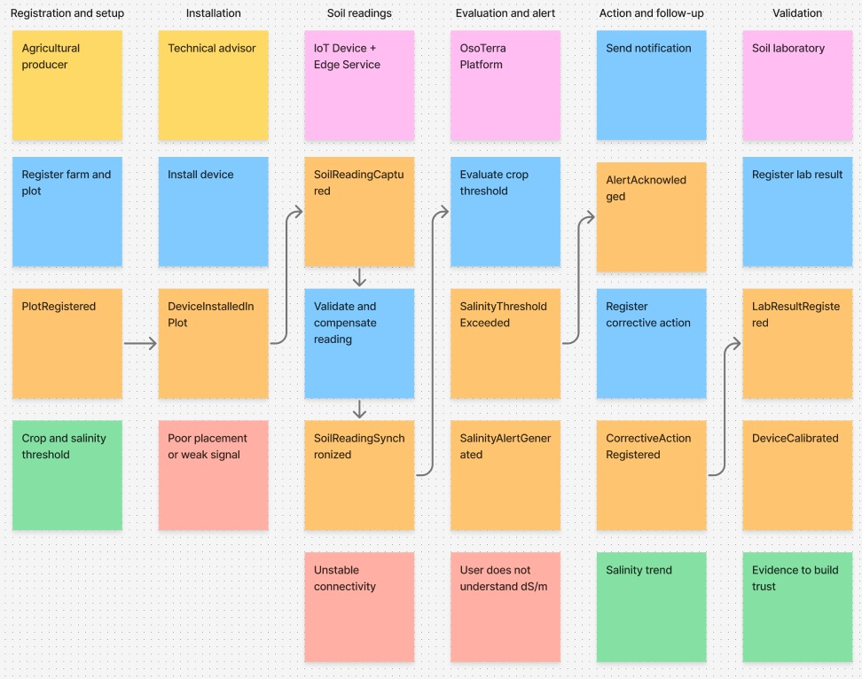

# Capítulo II: Requirements Elicitation & Analysis

## 2.1. Competidores

El mercado de monitoreo de suelo agrícola en el Perú está ocupado por tres tipos de oferta. En primer lugar, las plataformas internacionales de agricultura de precisión, que ofrecen sondas multiparamétricas con conectividad y suscripción, dirigidas a la agroexportación. En segundo lugar, los laboratorios de análisis de suelo, que entregan un diagnóstico preciso pero puntual y diferido. En tercer lugar, los medidores portátiles de conductividad eléctrica, que resuelven el costo pero no el monitoreo continuo. OsoTerra IoT se sitúa deliberadamente en el espacio que ninguno de los tres ocupa.

**Competidores directos identificados:**

- **CropX** (Estados Unidos e Israel, fundada en 2013), líder global en sensores de suelo multiparamétricos con medición de conductividad eléctrica.
- **WiseConn** (Chile, fundada en 2006), con presencia comercial verificada en el Perú, especializada en telemetría de riego y fertirriego con medición de pH y CE.
- **Teralytic** (Estados Unidos, 2019), fabricante de la sonda inalámbrica más completa del mercado, con 26 sensores incluyendo salinidad y NPK.

**Competidores directos complementarios:** Sensoterra (Países Bajos) y Sentek (Australia) en el plano internacional; Kilimo (Argentina) e Instacrops (Chile) en el plano regional; y **Smelpro** en el plano local peruano, con sensores de suelo y riego automatizado.

**Competidores indirectos:** los laboratorios de análisis de suelo —SGS Perú, AGQ Labs Perú, LASPAF-UNALM, INIA-LABSAF— y los medidores portátiles de conductividad eléctrica de marcas como Hanna Instruments, Bluelab, Extech y Milwaukee.

### 2.1.1. Análisis competitivo

#### Competitive Analysis Landscape

<table>
  <tbody>
    <tr>
      <th colspan="2">Competitive Analysis Landscape</th>
    </tr>
    <tr>
      <td><strong>¿Por qué llevar a cabo este análisis?</strong></td>
      <td>Determinar si existe un espacio de mercado no atendido en el monitoreo de salinidad de suelos para el pequeño y mediano productor peruano, e identificar en qué dimensiones —precio, complejidad, especificidad del caso de uso y canal— la oferta actual deja una brecha aprovechable para una solución de bajo costo.</td>
    </tr>
  </tbody>
</table>

<table>
  <thead>
    <tr>
      <th></th>
      <th></th>
      <th>Su startup <strong>OsoTerra</strong> <em>(OsoTerra IoT)</em> </th>
      <th>Competidor 1 <strong>CropX</strong> </th>
      <th>Competidor 2 <strong>WiseConn</strong> <em>(DropControl)</em> </th>
      <th>Competidor 3 <strong>Teralytic</strong> </th>
    </tr>
  </thead>
  <tbody>
    <tr>
      <td rowspan="2"><strong>Perfil</strong></td>
      <td><strong>Overview</strong></td>
      <td>Startup peruana fundada en 2026. Solución IoT de bajo costo para monitoreo continuo y detección temprana de salinización, orientada específicamente a la pequeña y mediana agricultura de la costa peruana.</td>
      <td>Empresa fundada en 2013 con operación global. Plataforma de agricultura de precisión basada en sondas de suelo multiprofundidad integradas a un sistema de recomendación agronómica.</td>
      <td>Empresa chilena fundada en 2006, especializada en automatización y telemetría de riego. Opera con más de 15 000 equipos en más de 2 500 campos en Chile, <strong>Perú</strong>, México, Estados Unidos, España, Italia y Australia, con cerca de 200 000 hectáreas automatizadas.</td>
      <td>Empresa estadounidense que lanzó en 2019 la primera sonda inalámbrica de suelo con medición de NPK. Integra 26 sensores en tres profundidades.</td>
    </tr>
    <tr>
      <td><strong>Ventaja competitiva</strong> ¿Qué valor ofrece a los clientes?</td>
      <td>Precio de acceso al menos un orden de magnitud inferior al de las sondas comerciales, especialización en el caso de uso de salinización, y traducción del dato técnico a lenguaje accionable para un usuario de baja alfabetización digital. Umbrales contextualizados por cultivo.</td>
      <td>Precisión y madurez del algoritmo agronómico. Integración directa con sistemas de riego. Cobertura de un sensor por cada 40 acres aproximadamente, lo que reduce la densidad de dispositivos necesaria.</td>
      <td>Presencia y soporte técnico local en el Perú. Control efectivo del riego, no solo monitoreo. Robustez probada en operaciones agroexportadoras de gran escala.</td>
      <td>Amplitud de variables medidas en un solo dispositivo: humedad, salinidad, temperatura, pH, NPK, aireación y respiración del suelo, en tres profundidades simultáneas.</td>
    </tr>
    <tr>
      <td rowspan="2"><strong>Perfil de Marketing</strong></td>
      <td><strong>Mercado objetivo</strong></td>
      <td>Pequeños y medianos productores de la costa norte peruana con unidades menores a 10 ha, e ingenieros agrónomos y asesores técnicos independientes que los atienden.</td>
      <td>Agricultura comercial de mediana y gran escala a nivel global. Agroexportación.</td>
      <td>Agroexportación y agricultura de gran escala en Latinoamérica, Estados Unidos y Europa. Fundos con riego tecnificado.</td>
      <td>Agricultura comercial de gran escala, principalmente en Estados Unidos. Investigación agronómica.</td>
    </tr>
    <tr>
      <td><strong>Estrategias de marketing</strong></td>
      <td>Marketing de contenido educativo sobre salinización dirigido al productor. Canal B2B2C mediante asesores técnicos y cooperativas. Articulación con programas estatales de asistencia técnica (AGROIDEAS, AGRO RURAL). Demostración de correspondencia con laboratorio acreditado como argumento de confianza.</td>
      <td>Presencia en ferias internacionales de agtech. Alianzas con distribuidores de insumos y con fabricantes de sistemas de riego. Casos de estudio con grandes productores.</td>
      <td>Fuerza de ventas directa con presencia local. Participación en medios especializados del sector, como Redagrícola. Demostraciones en campo con fundos de referencia.</td>
      <td>Comunicación centrada en la innovación tecnológica —primera sonda NPK inalámbrica del mundo—. Prensa especializada en agricultura de precisión.</td>
    </tr>
    <tr>
      <td rowspan="3"><strong>Perfil de Producto</strong></td>
      <td><strong>Productos &amp; Servicios</strong></td>
      <td>Dispositivo IoT de campo basado en ESP32 (CE, humedad, temperatura). Edge Service con sincronización diferida. Plataforma web y aplicación móvil. Motor de alertas por cultivo. Reportes exportables. Landing Page informativo.</td>
      <td>Sondas de suelo Apex y Vertex. Plataforma en la nube con aplicación móvil. Recomendaciones de riego y fertilización. Integración con equipos de riego.</td>
      <td>Nodos de campo, estaciones meteorológicas, sensores de humedad, pH y CE. Plataforma DropControl. Control automatizado de riego y fertirriego. Gestión de pozos.</td>
      <td>Sonda de suelo con 26 sensores. Red LoRa con gateway. Plataforma de análisis. Servicio de reemplazo de componentes incluido en la suscripción.</td>
    </tr>
    <tr>
      <td><strong>Precios &amp; Costos</strong></td>
      <td>Modelo objetivo: dispositivo a precio de acceso significativamente inferior al rango comercial internacional, más suscripción mensual por parcela, con un plan gratuito limitado a una parcela. <em>(Estructura de precios en definición.)</em></td>
      <td>Sensores entre <strong>USD 600 y USD 899</strong> por unidad, más <strong>USD 275 anuales por sensor</strong> de suscripción. El modelo Vertex V4 alcanza aproximadamente <strong>USD 2 398</strong>. El modelo Apex requiere telemetría adquirida por separado.</td>
      <td>Precio bajo cotización. No publica tarifario. Proyecto llave en mano dimensionado por hectárea y por complejidad del sistema de riego.</td>
      <td>Paquete inicial de 10 sondas por <strong>USD 5 000</strong>; <strong>USD 500</strong> por sonda adicional. Modelo de suscripción que incluye el reemplazo de piezas.</td>
    </tr>
    <tr>
      <td><strong>Canales de distribución</strong> (Web y/o Móvil)</td>
      <td>Landing Page con call-to-action diferenciado por segmento, aplicación web responsive y aplicación móvil nativa. Canal indirecto mediante asesores técnicos y organizaciones de productores.</td>
      <td>Tienda en línea propia, aplicación web y móvil. Red de distribuidores e integradores.</td>
      <td>Venta directa con oficinas y soporte en los países donde opera, incluido el Perú. Plataforma web y móvil.</td>
      <td>Venta directa en línea. Plataforma web.</td>
    </tr>
    <tr>
      <td rowspan="4"><strong>Análisis SWOT</strong></td>
      <td><strong>Fortalezas</strong></td>
      <td>
        <ul>
          <li>Especialización en un caso de uso concreto —la salinización— que ningún competidor aborda como propuesta central.</li>
          <li>Estructura de costos que permite un precio de acceso incompatible con el modelo de los competidores internacionales.</li>
          <li>Conocimiento del contexto local: perfil demográfico, restricciones de conectividad y capacidad de pago del productor peruano.</li>
          <li>Diseño explícitamente inclusivo, calibrado para un usuario de 55 años con educación primaria.</li>
          <li>Contextualización de alertas por cultivo, apoyada en umbrales agronómicos reconocidos.</li>
        </ul>
      </td>
      <td>
        <ul>
          <li>Madurez tecnológica y precisión validada del algoritmo agronómico.</li>
          <li>Marca consolidada internacionalmente y ecosistema de integraciones.</li>
          <li>Cobertura amplia por sensor, que reduce la densidad de dispositivos requerida.</li>
          <li>Modelo de negocio recurrente y probado.</li>
        </ul>
      </td>
      <td>
        <ul>
          <li>Presencia comercial y soporte técnico verificados en el Perú.</li>
          <li>Trayectoria desde 2006 y escala probada: más de 15 000 equipos y cerca de 200 000 hectáreas.</li>
          <li>Capacidad de control efectivo del riego, no solo de monitoreo.</li>
          <li>Conocimiento del contexto agrícola latinoamericano.</li>
        </ul>
      </td>
      <td>
        <ul>
          <li>Amplitud de variables medidas sin equivalente en el mercado: 26 sensores en tres profundidades.</li>
          <li>Modelo de suscripción con reemplazo de piezas incluido, que reduce el riesgo del cliente.</li>
          <li>Posicionamiento como referente de innovación en agricultura de precisión.</li>
        </ul>
      </td>
    </tr>
    <tr>
      <td><strong>Debilidades</strong></td>
      <td>
        <ul>
          <li>Marca inexistente y ausencia total de historial comercial o casos de referencia.</li>
          <li>Precisión del sensor de bajo costo inferior a la de las sondas comerciales y a la del laboratorio acreditado.</li>
          <li>Ausencia de red de soporte técnico en campo y de capacidad logística de distribución.</li>
          <li>Equipo sin experiencia previa en manufactura ni en certificación de hardware.</li>
          <li>Dependencia de la validación contra laboratorio para construir confianza, lo que introduce un costo y un plazo.</li>
        </ul>
      </td>
      <td>
        <ul>
          <li>Precio prohibitivo para el pequeño productor: USD 600 a 899 por sensor más USD 275 anuales.</li>
          <li>Ausencia de foco específico en salinización; la CE es una variable más dentro de un conjunto.</li>
          <li>Interfaz y comunicación diseñadas para un usuario técnico, no para un agricultor de baja alfabetización digital.</li>
          <li>Sin presencia comercial ni soporte local dedicado en el Perú.</li>
        </ul>
      </td>
      <td>
        <ul>
          <li>Propuesta dimensionada para fundos con riego tecnificado, del que solo dispone el 14,9 % de los pequeños y medianos productores.</li>
          <li>Precio bajo cotización, sin transparencia, lo que dificulta el acceso del pequeño productor.</li>
          <li>Complejidad de instalación y de operación que exige personal técnico.</li>
          <li>La salinidad es una función secundaria dentro de una plataforma de gestión de riego.</li>
        </ul>
      </td>
      <td>
        <ul>
          <li>Barrera de entrada muy alta: paquete inicial de USD 5 000 por diez sondas.</li>
          <li>Requiere infraestructura de red LoRa con gateway propio.</li>
          <li>Orientación al mercado estadounidense, sin presencia ni soporte en el Perú.</li>
        </ul>
      </td>
    </tr>
    <tr>
      <td><strong>Oportunidades</strong></td>
      <td>
        <ul>
          <li>Brecha de diagnóstico masiva: solo el 2,5 % de los pequeños y medianos productores realiza análisis de suelo.</li>
          <li>Crecimiento acelerado de la conectividad móvil rural: del 41,5 % en 2019 al 85,8 % en 2025.</li>
          <li>Ausencia de un inventario nacional reciente de salinidad, que otorga valor a los datos agregados de la plataforma.</li>
          <li>Existencia de programas estatales que cofinancian asistencia técnica y activos productivos (AGROIDEAS, AGRO RURAL).</li>
          <li>Cobertura insuficiente de los servicios públicos de extensión agraria, reconocida por el propio INIA.</li>
        </ul>
      </td>
      <td>
        <ul>
          <li>Expansión hacia mercados emergentes con líneas de producto de menor costo.</li>
          <li>Integración con sistemas de riego de terceros.</li>
        </ul>
      </td>
      <td>
        <ul>
          <li>Expansión hacia la mediana agricultura peruana mediante productos simplificados.</li>
          <li>Aprovechamiento de proyectos de irrigación estatales en ejecución.</li>
        </ul>
      </td>
      <td>
        <ul>
          <li>Aplicación en investigación agronómica y en agricultura regenerativa.</li>
          <li>Valorización de los datos agregados de suelo.</li>
        </ul>
      </td>
    </tr>
    <tr>
      <td><strong>Amenazas</strong></td>
      <td>
        <ul>
          <li>Baja capacidad de pago del segmento principal: pobreza del 49,3 % en hogares agropecuarios y acceso a crédito formal de solo el 8 %.</li>
          <li>Envejecimiento del productor —edad promedio 54,5 años— y baja alfabetización digital como barreras de adopción.</li>
          <li>Medidores portátiles de conductividad eléctrica importados a bajo precio que compiten por costo, aunque no por continuidad.</li>
          <li>Entrada de un competidor establecido, como WiseConn, con una línea económica dirigida al mismo segmento.</li>
          <li>Conectividad móvil variable en campo, que puede degradar la experiencia de uso.</li>
        </ul>
      </td>
      <td>
        <ul>
          <li>Erosión de su mercado medio por soluciones locales de bajo costo.</li>
          <li>Presión regulatoria y arancelaria sobre hardware importado.</li>
        </ul>
      </td>
      <td>
        <ul>
          <li>Concentración de su cartera en agroexportación, vulnerable a ciclos del mercado externo.</li>
          <li>Entrada de competidores de bajo costo en el segmento medio.</li>
        </ul>
      </td>
      <td>
        <ul>
          <li>Complejidad del dispositivo como factor de fragilidad en campo.</li>
          <li>Competencia de soluciones especializadas y más simples por caso de uso.</li>
        </ul>
      </td>
    </tr>
  </tbody>
</table>

#### Análisis SWOT — competidores indirectos

**Laboratorios y medidores portátiles**

| Fortalezas | Debilidades |
|---|---|
| **Laboratorios:** precisión, trazabilidad y acreditación INACAL, que los hace referencia legal y técnica. | **Laboratorios:** costo de S/ 80 a S/ 600 por muestra y demora de 7 a 15 días hábiles; el resultado es un dato puntual, no una serie. |
| **Medidores portátiles:** bajo costo relativo, lectura instantánea y ausencia de dependencia tecnológica. | **Medidores portátiles:** medición manual y puntual, sin registro histórico, sin alertas, sin conectividad y sin contextualización por cultivo. Exigen que alguien esté físicamente en la parcela. |

| Oportunidades | Amenazas |
|---|---|
| Los laboratorios pueden convertirse en aliados de validación y no solo en competidores. | La percepción de que "el laboratorio es lo confiable" puede frenar la adopción de un sensor de bajo costo. |
| Los medidores portátiles pueden ser complemento de la solución en la fase de calibración. | La disponibilidad de medidores importados muy económicos compite directamente por presupuesto. |

### 2.1.2. Estrategias y tácticas frente a competidores

**Estrategia 1 — Competir por especificidad, no por amplitud.**
Frente a competidores que miden más variables y con mayor precisión, OsoTerra IoT no intenta igualarlos: resuelve un problema que ellos tratan como función secundaria. *Tácticas:* posicionar toda la comunicación en torno a la salinización y no al monitoreo genérico de suelo; construir el motor de umbrales por cultivo como diferenciador funcional visible; producir contenido educativo sobre reconocimiento temprano de sales dirigido al productor.

**Estrategia 2 — Convertir la restricción de precio en la barrera de entrada del competidor.**
El rango de USD 500 a 2 398 por sonda que manejan CropX y Teralytic no puede reducirse sin canibalizar su propio mercado. *Tácticas:* diseñar el dispositivo sobre componentes de bajo costo y disponibilidad local; ofrecer un plan gratuito limitado a una parcela que elimine la barrera de desembolso inicial; estructurar la suscripción por parcela y no por finca, de modo que el costo escale con el beneficio percibido.

**Estrategia 3 — Usar al asesor técnico como canal y como aval.**
La desconfianza hacia un dispositivo económico es la principal amenaza de adopción, y el asesor técnico es quien puede disolverla. *Tácticas:* diseñar funcionalidades específicas para el asesor —tablero multiparcela, reportes exportables— que le den razones propias para adoptar la plataforma; establecer un esquema de referidos por productor incorporado; entregar al asesor el dato crudo además de la interpretación, porque su credibilidad profesional depende de poder auditarlo.

**Estrategia 4 — Neutralizar la ventaja de precisión del laboratorio convirtiéndolo en aliado.**
No se compite contra el laboratorio en exactitud; se compite en frecuencia y en costo. *Tácticas:* publicar la comparación entre las lecturas del dispositivo y las de un laboratorio acreditado como evidencia de confiabilidad; comunicar explícitamente que OsoTerra IoT es un instrumento de detección temprana y seguimiento de tendencia, no un sustituto del análisis certificado; permitir el registro manual de resultados de laboratorio dentro de la plataforma para calibrar el dispositivo.

**Estrategia 5 — Superar a los medidores portátiles en aquello que estructuralmente no pueden ofrecer.**
Un medidor de mano requiere presencia física y produce un dato aislado. *Tácticas:* enfatizar la continuidad del monitoreo y la alerta proactiva como diferencial; mostrar la línea de tendencia como el artefacto que un medidor portátil nunca puede producir; destacar el ahorro en desplazamientos para el asesor.

**Estrategia 6 — Aprovechar el financiamiento público como sustituto del crédito privado.**
Dado que solo el 8 % de los productores accede a crédito formal, la vía de adopción masiva pasa por la compra agregada. *Tácticas:* documentar la solución en el formato exigido por AGROIDEAS para planes de negocio de organizaciones agrarias; desarrollar una modalidad de dispositivo compartido por asociación de productores; establecer contacto con agencias agrarias regionales de Piura y Lambayeque.

## 2.2. Entrevistas

### 2.2.1. Diseño de entrevistas

Las entrevistas buscan conocer, con palabras sencillas, cómo los participantes cuidan el suelo en la actualidad, qué problemas encuentran, qué productos o métodos emplean para prevenirlos y cómo toman sus decisiones. También permiten conocer su relación con la tecnología y evaluar si una herramienta de monitoreo y alertas sería comprensible y útil para ellos.

Se preparó una guía diferente para cada uno de los dos segmentos definidos en el Capítulo I. Primero se pregunta por experiencias y acciones reales. La propuesta de OsoTerra IoT se presenta recién al final para no influir en las respuestas. Las preguntas complementarias solo se utilizarán cuando sea necesario profundizar en alguna respuesta.

#### Guía de entrevista — Segmento 1: Pequeños y medianos productores agropecuarios

**Objetivo.** Conocer cómo el productor cuida su suelo, si ha tenido problemas de salinidad, qué soluciones utiliza actualmente y qué necesitaría para adoptar una herramienta de prevención.

**Preguntas:**

1. ¿Cuál es su nombre y en qué zona tiene su parcela?
2. ¿Qué cultiva actualmente?
3. ¿Qué hace para cuidar su suelo antes de que aparezcan problemas?
4. ¿Usa algún producto, abono o método para mejorar o proteger el suelo? ¿Cuál?
5. ¿Quién le recomendó ese producto o método?
6. ¿Le ha funcionado bien? ¿Por qué?
7. ¿Ha visto tierra blanca, salitrosa o plantas que crecen poco en alguna parte de su terreno?
8. Cuando nota un problema en el suelo, ¿a quién le pide ayuda?
9. ¿Alguna vez ha hecho un análisis de suelo? ¿Fue fácil o difícil?
10. Si un dispositivo le avisara antes de que la sal dañe su cultivo, ¿lo usaría? ¿Qué necesitaría para confiar?

#### Guía de entrevista — Segmento 2: Ingenieros agrónomos y asesores técnicos

**Objetivo.** Conocer cómo el asesor detecta y previene problemas del suelo en las parcelas de sus clientes, qué herramientas recomienda y qué información necesita para tomar decisiones.

**Preguntas:**

1. ¿Cuál es su nombre y desde cuándo asesora agricultores?
2. ¿En qué zonas trabaja normalmente?
3. ¿Qué problemas del suelo ve con más frecuencia?
4. ¿Qué recomienda para prevenir esos problemas?
5. ¿Recomienda productos, abonos o tratamientos para cuidar el suelo? ¿Cuáles?
6. ¿Cómo sabe si esas recomendaciones están funcionando?
7. ¿Ha visto casos de salinidad en suelos? ¿Cómo los identifica?
8. ¿Usa análisis de suelo, sensores o alguna herramienta de medición?
9. ¿Qué dificultad tiene para revisar varias parcelas o atender a varios productores?
10. Si recibiera alertas sobre salinidad en una parcela, ¿le servirían? ¿Qué información deberían mostrar?

### 2.2.2. Registro de entrevistas

Las entrevistas se realizaron para conocer de primera mano cómo los usuarios objetivo abordan actualmente el cuidado del suelo, la detección de problemas de salinidad y el uso de herramientas de medición o seguimiento. A partir de sus respuestas se identifican necesidades, frustraciones, hábitos de trabajo y expectativas frente a una solución IoT para monitoreo de salinidad.

<table>
  <thead>
    <tr>
      <th>Segmento objetivo</th>
      <th>Datos</th>
      <th>Resumen</th>
      <th>Video</th>
    </tr>
  </thead>
  <tbody>
    <tr>
      <td rowspan="3"><strong>Pequeños y medianos productores agropecuarios</strong></td>
      <td><strong>Entrevista 1</strong>  <strong>Entrevistado:</strong> Pendiente <strong>Edad:</strong> Pendiente <strong>Zona / distrito:</strong> Pendiente  <strong>Screenshot:</strong> Pendiente</td>
      <td>Pendiente de registrar resumen de entrevista.</td>
      <td><strong>URL:</strong> Pendiente <strong>Inicio:</strong> Pendiente <strong>Duración:</strong> Pendiente</td>
    </tr>
    <tr>
      <td><strong>Entrevista 2</strong>  <strong>Entrevistado:</strong> Pendiente <strong>Edad:</strong> Pendiente <strong>Zona / distrito:</strong> Pendiente  <strong>Screenshot:</strong> Pendiente</td>
      <td>Pendiente de registrar resumen de entrevista.</td>
      <td><strong>URL:</strong> Pendiente <strong>Inicio:</strong> Pendiente <strong>Duración:</strong> Pendiente</td>
    </tr>
    <tr>
      <td><strong>Entrevista 3</strong>  <strong>Entrevistado:</strong> Pendiente <strong>Edad:</strong> Pendiente <strong>Zona / distrito:</strong> Pendiente  <strong>Screenshot:</strong> Pendiente</td>
      <td>Pendiente de registrar resumen de entrevista.</td>
      <td><strong>URL:</strong> Pendiente <strong>Inicio:</strong> Pendiente <strong>Duración:</strong> Pendiente</td>
    </tr>
    <tr>
      <td rowspan="3"><strong>Ingenieros agrónomos y asesores técnicos agrícolas</strong></td>
      <td><strong>Entrevista 1</strong>  <strong>Entrevistada:</strong> Yeira Momán <strong>Edad:</strong> 30 años <strong>Zona de trabajo:</strong> Zonas agrícolas de la costa  <strong>Screenshot:</strong> </td>
      <td><strong>Datos generales:</strong> Yeira es ingeniera agrónoma y cuenta con varios años de experiencia en el sector agrícola, brindando asesorías a productores. Trabaja principalmente en zonas agrícolas de la costa y visita diferentes parcelas según las necesidades de los agricultores que asesora.  <strong>Trabajo y responsabilidades:</strong> Su labor se centra en evaluar el estado del suelo, identificar problemas que afectan el desarrollo del cultivo y recomendar acciones de manejo. Entre los problemas más frecuentes mencionó la salinidad, la falta de nutrientes y las dificultades relacionadas con el riego y el drenaje.  <strong>Herramientas y tecnología:</strong> Para sustentar sus recomendaciones utiliza análisis de laboratorio y medidores portátiles de conductividad eléctrica, porque permiten obtener una lectura rápida directamente en campo. También realiza seguimiento comparando resultados de análisis y observando la evolución del cultivo para decidir si el manejo aplicado está funcionando o debe modificarse.  <strong>Necesidades y frustraciones:</strong> Su principal dificultad es el tiempo que demanda revisar varias parcelas y desplazarse entre productores ubicados en diferentes lugares. Esto complica realizar visitas frecuentes, mantener actualizada la información de cada parcela y detectar oportunamente cambios en las condiciones del suelo.  <strong>Expectativas:</strong> Considera que recibir alertas sobre salinidad sería útil porque permitiría anticipar el problema. Para que una alerta aporte valor, debería mostrar el nivel de conductividad eléctrica, la ubicación de la parcela, la fecha de medición, la evolución del valor en el tiempo y un historial de mediciones.</td>
      <td><strong>URL:</strong> Pendiente <strong>Inicio:</strong> Pendiente <strong>Duración:</strong> Pendiente</td>
    </tr>
    <tr>
      <td><strong>Entrevista 2</strong>  <strong>Entrevistado:</strong> Pendiente <strong>Edad:</strong> Pendiente <strong>Zona de trabajo:</strong> Pendiente  <strong>Screenshot:</strong> Pendiente</td>
      <td>Pendiente de registrar resumen de entrevista.</td>
      <td><strong>URL:</strong> Pendiente <strong>Inicio:</strong> Pendiente <strong>Duración:</strong> Pendiente</td>
    </tr>
    <tr>
      <td><strong>Entrevista 3</strong>  <strong>Entrevistado:</strong> Pendiente <strong>Edad:</strong> Pendiente <strong>Zona de trabajo:</strong> Pendiente  <strong>Screenshot:</strong> Pendiente</td>
      <td>Pendiente de registrar resumen de entrevista.</td>
      <td><strong>URL:</strong> Pendiente <strong>Inicio:</strong> Pendiente <strong>Duración:</strong> Pendiente</td>
    </tr>
  </tbody>
</table>

### 2.2.3. Análisis de entrevistas

## 2.3. Needfinding

### 2.3.1. User Personas

### 2.3.2. User Task Matrix

### 2.3.3. User Journey Mapping

### 2.3.4. Empathy Mapping

## 2.4. Big Picture EventStorming

El equipo realizó un Big Picture EventStorming para entender el dominio general de OsoTerra IoT y representar visualmente los eventos principales del negocio. La sesión permitió ordenar el flujo desde el registro de la parcela hasta la generación de alertas, el registro de acciones correctivas y la validación del dispositivo con resultados de laboratorio.

Durante la sesión se usaron post-its diferenciados por tipo: usuarios, comandos, eventos, riesgos, información y sistemas de negocio. Los eventos se organizaron de izquierda a derecha siguiendo la secuencia temporal del proceso.

**URL del board:** [Event storming - Copia](https://www.figma.com/board/rOz6aC8xPFPeAZt5nTztdW/Event-storming--Copia-?node-id=0-1&t=jHZC7lXyvDzyzoJK-1)

<em>Figura 11. Big Picture EventStorming de OsoTerra IoT elaborado en FigJam.</em>

La figura muestra los actores principales del dominio, como el productor agropecuario, el asesor técnico, el dispositivo IoT, la plataforma OsoTerra y el laboratorio de suelo. También presenta eventos clave como `PlotRegistered`, `DeviceInstalledInPlot`, `SoilReadingCaptured`, `SalinityAlertGenerated`, `CorrectiveActionRegistered` y `DeviceCalibrated`.

Como resultado del análisis se identificaron puntos de dolor relacionados con la conectividad en campo, la interpretación de lecturas técnicas y la confianza en el dispositivo. Asimismo, se identificaron oportunidades como el uso de alertas simples, el historial de salinidad, los reportes para asesores y la validación con laboratorio.

## 2.5. Ubiquitous Language

El siguiente glosario recoge los términos y conceptos del dominio del negocio empleados de manera consistente por todos los miembros del equipo y los stakeholders. Los términos se expresan en inglés, con su equivalente en español entre paréntesis cuando corresponde. Se incluyen únicamente términos del dominio agronómico y del negocio; no se incluyen términos técnicos del área de ingeniería de software.

| Término (inglés) | Equivalente en español | Definición |
|---|---|---|
| **Electrical Conductivity (EC)** | Conductividad eléctrica | Capacidad de un medio para conducir corriente eléctrica. En el suelo es proporcional a la concentración de sales disueltas, por lo que constituye el indicador estándar de salinidad. Se expresa en decisiemens por metro (dS/m). |
| **Saturated Paste Extract EC (ECe)** | Conductividad eléctrica del extracto de saturación | Medición de la conductividad eléctrica realizada sobre el extracto de una pasta de suelo saturada con agua destilada. Es el método de referencia de laboratorio y la base sobre la que se definen los umbrales de tolerancia de los cultivos. |
| **Saline Soil** | Suelo salino | Suelo cuya conductividad eléctrica del extracto de saturación es igual o superior a 4 dS/m, condición a partir de la cual las sales disueltas dificultan la absorción de agua y nutrientes por la raíz. |
| **Soil Salinization** | Salinización del suelo | Proceso de acumulación progresiva de sales solubles en el perfil del suelo, que reduce su productividad agrícola y puede llegar a inutilizarlo. |
| **Salinity Threshold** | Umbral de salinidad | Valor de conductividad eléctrica a partir del cual un cultivo determinado comienza a experimentar reducción de rendimiento. Varía por especie según el modelo de Maas y Hoffman. |
| **Salt Tolerance** | Tolerancia a la sal | Capacidad de un cultivo para mantener su rendimiento bajo condiciones de salinidad creciente. Los cultivos se clasifican como sensibles, moderadamente sensibles, moderadamente tolerantes o tolerantes. |
| **Salt Leaching** | Lavado de sales | Práctica de manejo consistente en aplicar una lámina de riego superior a la demanda del cultivo con el fin de desplazar las sales acumuladas por debajo de la zona radicular. |
| **Leaching Requirement** | Requerimiento de lavado | Fracción adicional de la lámina de riego necesaria para mantener la salinidad de la zona radicular por debajo del umbral tolerable del cultivo. |
| **Soil Moisture** | Humedad del suelo | Contenido de agua presente en el suelo. Afecta directamente la lectura de conductividad eléctrica, ya que la corriente circula a través de la solución del suelo. |
| **Soil Temperature** | Temperatura del suelo | Temperatura del perfil edáfico. Influye sobre la conductividad eléctrica medida, por lo que toda lectura requiere compensación térmica para ser comparable. |
| **Temperature Compensation** | Compensación por temperatura | Ajuste matemático aplicado a una lectura de conductividad eléctrica para expresarla en su valor equivalente a una temperatura de referencia, convencionalmente 25 °C. |
| **Total Dissolved Solids (TDS)** | Sólidos disueltos totales | Concentración total de sustancias disueltas en una solución, expresada en mg/L. Para valores de conductividad eléctrica inferiores a 5 dS/m se relaciona aproximadamente como 1 dS/m ≈ 640 mg/L. |
| **Water Table** | Napa freática | Nivel superior del agua subterránea. Cuando asciende hacia la superficie favorece el ascenso capilar de sales y agrava la salinización. |
| **Capillary Rise** | Ascenso capilar | Movimiento ascendente del agua del suelo por capilaridad, que transporta sales disueltas hacia la superficie donde se concentran al evaporarse el agua. |
| **Drainage** | Drenaje | Capacidad del suelo y de la infraestructura asociada para evacuar el exceso de agua. Su deficiencia es una de las causas principales de la salinización en los valles de la costa peruana. |
| **Irrigation Water Quality** | Calidad del agua de riego | Conjunto de características químicas del agua empleada para regar, en particular su contenido de sodio, cloruros, sulfatos y boro, que determinan su potencial salinizante. |
| **Gravity Irrigation** | Riego por gravedad | Sistema de riego en el que el agua se distribuye por escurrimiento superficial. Es el sistema predominante entre los pequeños productores peruanos y el de menor eficiencia en el uso del agua. |
| **Technified Irrigation** | Riego tecnificado | Sistemas de riego presurizado, principalmente goteo y aspersión, que permiten un control preciso de la lámina aplicada. |
| **Farm** | Finca / fundo | Unidad agropecuaria conducida por un productor, que puede comprender una o varias parcelas. |
| **Plot** | Parcela | Superficie delimitada dentro de una finca, con un cultivo y un manejo homogéneos. Es la unidad mínima de monitoreo de la solución. |
| **Crop** | Cultivo | Especie vegetal sembrada en una parcela. Determina el umbral de salinidad aplicable para la generación de alertas. |
| **Growing Season** | Campaña agrícola | Ciclo productivo que abarca desde la siembra hasta la cosecha de un cultivo. En el Perú se contabiliza oficialmente de agosto a julio. |
| **Yield** | Rendimiento | Producción obtenida por unidad de superficie, habitualmente expresada en toneladas por hectárea. |
| **Agricultural Producer** | Productor agropecuario | Persona que conduce una unidad agropecuaria y toma las decisiones sobre su manejo. Es el usuario principal de la solución. |
| **Smallholder** | Pequeño productor | Productor agropecuario que conduce una unidad menor a cinco hectáreas. Representa el 81,9 % de los productores del Perú. |
| **Agronomist Advisor** | Asesor agronómico | Ingeniero agrónomo que presta servicios de asesoría técnica a uno o varios productores. Es el segundo segmento objetivo de la solución. |
| **Technical Assistance** | Asistencia técnica | Servicio de acompañamiento profesional al productor en las decisiones de manejo del cultivo. |
| **Soil Analysis** | Análisis de suelo | Determinación en laboratorio de las propiedades físicas y químicas de una muestra de suelo. Constituye la alternativa vigente y el referente de precisión frente al cual se valida la solución. |
| **Soil Reading** | Lectura de suelo | Conjunto de valores de conductividad eléctrica, humedad y temperatura capturados simultáneamente por el dispositivo en un instante determinado. |
| **Salinity Alert** | Alerta de salinidad | Notificación generada cuando la conductividad eléctrica compensada de una parcela supera el umbral de tolerancia del cultivo que aloja. |
| **Salinity Trend** | Tendencia de salinidad | Dirección y magnitud del cambio de la conductividad eléctrica de una parcela a lo largo de un periodo. Es el indicador relevante para la detección temprana, por encima del valor puntual. |
| **Corrective Action** | Acción correctiva | Intervención de manejo ejecutada en respuesta a una alerta, como un lavado de sales, un ajuste de la lámina de riego o una corrección del drenaje. |
| **Calibration** | Calibración | Proceso de ajuste de las lecturas del dispositivo tomando como referencia un análisis de laboratorio acreditado sobre la misma parcela. |
