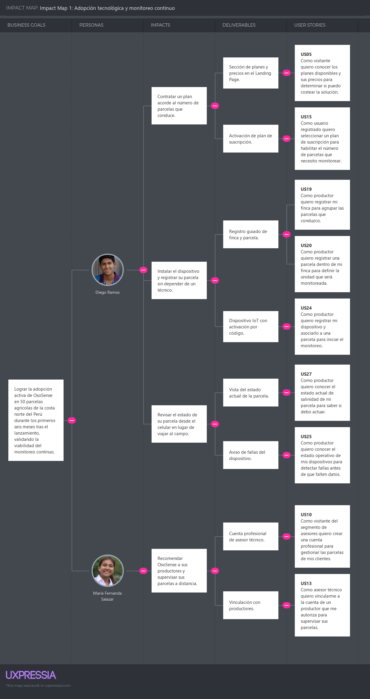
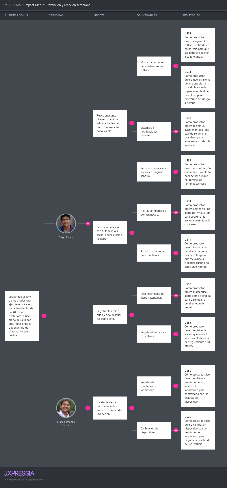
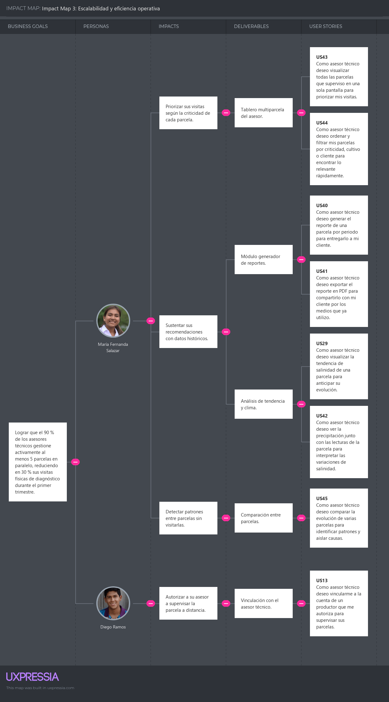
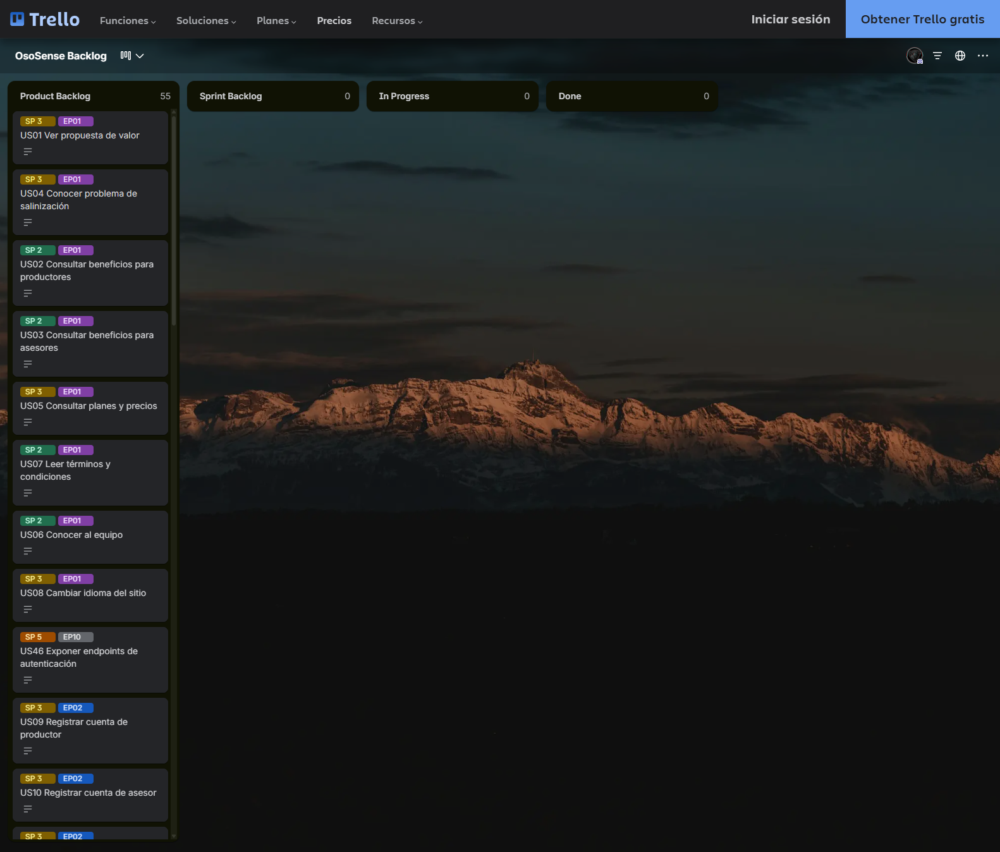

# Capítulo III: Requirements Specification

A partir del análisis de la información obtenida en el Capítulo II, este capítulo especifica los requisitos de los productos digitales que componen OsoSense. Los requisitos se expresan como épicas y User Stories con criterios de aceptación en Gherkin, se vinculan con los objetivos de negocio mediante el Impact Map y se priorizan en el Product Backlog según el valor que aportan al negocio.

## 3.1. User Stories

La siguiente tabla reúne las épicas y las User Stories de OsoSense. Cada épica aparece antes de sus User Stories y agrupa una capacidad general de la solución. Cada User Story sigue la estructura "Como [rol] quiero [acción] para [beneficio]" y tiene al menos dos criterios de aceptación en Gherkin. El primer escenario describe el caso exitoso y el segundo un caso alternativo o de error. Las palabras clave Dado que, Cuando, Entonces y Y van al inicio de cada línea.

Las User Stories del sitio web estático usan el rol de visitante. Las User Stories US46 a US55 son Technical Stories: su rol es el de developer y corresponden al RESTful API, al Edge Service y a la aplicación embebida del dispositivo IoT. Se mantienen en la misma numeración para que su trazabilidad hacia el Impact Map y el Product Backlog sea directa.

| Epic / Story ID | Título | Descripción | Criterios de Aceptación | Relacionado con (Epic ID) |
|---|---|---|---|---|
| **EP01** | **Presentación de la propuesta de valor** | Como visitante quiero conocer la solución desde el Landing Page para decidir si me registro en la plataforma. |  | - |
| US01 | Ver propuesta de valor | Como visitante quiero comprender qué problema resuelve OsoSense para decidir si la solución es pertinente para mi situación. | **Escenario 1: Visualización de la sección principal** **Dado que** el visitante accede a la página principal **Cuando** la página termina de cargar **Entonces** el sistema muestra la propuesta de valor, una imagen del producto y un botón de acción visible sin desplazarse  **Escenario 2: Acceso desde un navegador móvil** **Dado que** el visitante accede desde un navegador móvil **Cuando** la página termina de cargar **Entonces** el sistema adapta el contenido al ancho de la pantalla **Y** conserva el orden de la información | EP01 |
| US02 | Consultar beneficios para productores | Como visitante del segmento de productores quiero conocer los beneficios concretos de la solución para evaluar si responde a mi necesidad. | **Escenario 1: Consulta de la sección de productores** **Dado que** el visitante se encuentra en el Landing Page **Cuando** navega a la sección dirigida a productores agropecuarios **Entonces** el sistema muestra los beneficios en lenguaje no técnico **Y** muestra un botón de acción que dirige al registro como productor  **Escenario 2: Imagen de la sección no disponible** **Dado que** el visitante consulta la sección de productores **Cuando** una imagen de la sección no carga **Entonces** el sistema muestra un texto alternativo **Y** mantiene visibles los beneficios y el botón de acción | EP01 |
| US03 | Consultar beneficios para asesores | Como visitante del segmento de asesores técnicos quiero conocer las capacidades profesionales de la plataforma para evaluar si mejora mi práctica. | **Escenario 1: Consulta de la sección de asesores** **Dado que** el visitante se encuentra en el Landing Page **Cuando** navega a la sección dirigida a asesores técnicos **Entonces** el sistema muestra las capacidades de supervisión multiparcela y de reportes **Y** muestra un botón de acción que dirige al registro como asesor  **Escenario 2: Imagen de la sección no disponible** **Dado que** el visitante consulta la sección de asesores **Cuando** una imagen de la sección no carga **Entonces** el sistema muestra un texto alternativo **Y** mantiene visibles las capacidades y el botón de acción | EP01 |
| US04 | Conocer problema de salinización | Como visitante quiero comprender qué es la salinización y por qué debe preocuparme para reconocer el problema en mi propia parcela. | **Escenario 1: Consulta de la sección educativa** **Dado que** el visitante se encuentra en el Landing Page **Cuando** navega a la sección sobre salinización **Entonces** el sistema muestra una explicación del fenómeno y sus señales de alerta **Y** muestra datos de su magnitud en el Perú con la fuente correspondiente  **Escenario 2: Fuente externa no disponible** **Dado que** el visitante consulta la sección sobre salinización **Cuando** selecciona el enlace de una fuente que no responde **Entonces** el sistema informa que la fuente no está disponible **Y** mantiene al visitante en la sección sin perder su posición | EP01 |
| US05 | Consultar planes y precios | Como visitante quiero conocer los planes disponibles y sus precios para determinar si puedo costear la solución. | **Escenario 1: Selección de un plan** **Dado que** el visitante consulta la sección de planes **Cuando** selecciona un plan **Entonces** el sistema muestra el precio, las parcelas incluidas y las funciones del plan **Y** lo dirige al registro con el plan preseleccionado  **Escenario 2: Precios no disponibles** **Dado que** el visitante navega a la sección de planes **Cuando** la información de precios no se puede cargar **Entonces** el sistema informa que los precios no están disponibles **Y** ofrece un medio de contacto para solicitarlos | EP01 |
| US06 | Conocer al equipo | Como visitante quiero conocer al equipo responsable de la solución para evaluar su credibilidad. | **Escenario 1: Consulta de la sección About the Team** **Dado que** el visitante se encuentra en el Landing Page **Cuando** navega a la sección About the Team **Entonces** el sistema muestra el video del equipo y la relación de integrantes  **Escenario 2: Video no disponible** **Dado que** el visitante consulta la sección About the Team **Cuando** el video no se puede reproducir **Entonces** el sistema informa que el video no está disponible **Y** mantiene visible la relación de integrantes | EP01 |
| US07 | Leer términos y condiciones | Como visitante quiero acceder a los términos y condiciones del servicio para conocer mis derechos y el tratamiento de mis datos. | **Escenario 1: Acceso desde el pie de página** **Dado que** el visitante se encuentra en cualquier sección del Landing Page **Cuando** selecciona el enlace de términos y condiciones del pie de página **Entonces** el sistema muestra el documento completo de términos y condiciones  **Escenario 2: Documento no disponible** **Dado que** el visitante selecciona el enlace de términos y condiciones **Cuando** el documento no se puede cargar **Entonces** el sistema informa que el documento no está disponible **Y** ofrece un medio de contacto para solicitarlo | EP01 |
| US08 | Cambiar idioma del sitio | Como visitante quiero alternar entre español e inglés para consultar el contenido en el idioma que domino. | **Escenario 1: Cambio de idioma** **Dado que** el visitante se encuentra en el Landing Page **Cuando** selecciona español en el selector de idioma **Entonces** el sistema presenta todo el contenido textual en español  **Escenario 2: Idioma del navegador no soportado** **Dado que** el navegador del visitante usa un idioma distinto de español e inglés **Cuando** el visitante accede por primera vez al Landing Page **Entonces** el sistema presenta el contenido en inglés como idioma por defecto | EP01 |
| **EP02** | **Gestión de identidad y acceso** | Como usuario quiero crear mi cuenta y acceder de forma segura para consultar solo la información que me corresponde. |  | - |
| US09 | Registrar cuenta de productor | Como visitante del segmento de productores quiero crear una cuenta en la plataforma para comenzar a monitorear mis parcelas. | **Escenario 1: Registro exitoso** **Dado que** el visitante se encuentra en el formulario de registro **Cuando** envía datos válidos con un correo no registrado **Entonces** el sistema crea la cuenta con rol de productor **Y** confirma el registro  **Escenario 2: Correo ya registrado** **Dado que** el visitante se encuentra en el formulario de registro **Cuando** envía un correo que ya se encuentra registrado **Entonces** el sistema rechaza el registro **Y** informa que la cuenta ya existe | EP02 |
| US10 | Registrar cuenta de asesor | Como visitante del segmento de asesores quiero crear una cuenta profesional para gestionar las parcelas de mis clientes. | **Escenario 1: Registro exitoso con rol de asesor** **Dado que** el visitante selecciona el registro como asesor técnico **Cuando** envía datos válidos con su número de colegiatura **Entonces** el sistema crea la cuenta con rol de asesor **Y** habilita las funciones de supervisión multiparcela  **Escenario 2: Número de colegiatura faltante** **Dado que** el visitante selecciona el registro como asesor técnico **Cuando** envía el formulario sin número de colegiatura **Entonces** el sistema rechaza el registro **Y** indica que el número de colegiatura es obligatorio | EP02 |
| US11 | Iniciar sesión | Como usuario registrado quiero iniciar sesión en la plataforma para acceder a la información de mis parcelas. | **Escenario 1: Autenticación exitosa** **Dado que** el usuario se encuentra en la pantalla de inicio de sesión **Cuando** envía credenciales válidas **Entonces** el sistema le concede acceso **Y** lo dirige al tablero de su rol  **Escenario 2: Credenciales inválidas** **Dado que** el usuario se encuentra en la pantalla de inicio de sesión **Cuando** envía credenciales inválidas **Entonces** el sistema deniega el acceso **Y** informa el error sin revelar cuál dato es incorrecto | EP02 |
| US12 | Recuperar contraseña | Como usuario registrado quiero recuperar el acceso cuando olvido mi contraseña para no perder el control de mi cuenta. | **Escenario 1: Solicitud de recuperación** **Dado que** el usuario no recuerda su contraseña **Cuando** solicita la recuperación con su correo registrado **Entonces** el sistema envía un enlace de restablecimiento con vigencia limitada  **Escenario 2: Enlace vencido** **Dado que** el usuario recibió un enlace de restablecimiento **Cuando** lo usa después de su vigencia **Entonces** el sistema rechaza el restablecimiento **Y** le permite solicitar un enlace nuevo | EP02 |
| US13 | Vincular asesor con productor | Como asesor técnico quiero vincularme a la cuenta de un productor que me autoriza para supervisar sus parcelas. | **Escenario 1: Aceptación de la vinculación** **Dado que** el asesor envía una solicitud de vinculación a un productor **Cuando** el productor acepta la solicitud **Entonces** el sistema otorga al asesor acceso de consulta a las parcelas del productor  **Escenario 2: Revocación del acceso** **Dado que** existe una vinculación activa entre un asesor y un productor **Cuando** el productor revoca la vinculación **Entonces** el sistema retira de inmediato el acceso del asesor a esas parcelas | EP02 |
| US14 | Invitar familiar a parcela | Como productor quiero invitar a un familiar a consultar mis parcelas para que me ayude a vigilarlas cuando no estoy en el campo. | **Escenario 1: Invitación aceptada** **Dado que** el productor envía una invitación al correo de un familiar **Cuando** el familiar acepta la invitación **Entonces** el sistema otorga al familiar acceso de consulta a las parcelas del productor **Y** le permite recibir las alertas de esas parcelas  **Escenario 2: Invitación vencida** **Dado que** el productor envió una invitación hace más de siete días **Cuando** el familiar intenta aceptarla **Entonces** el sistema rechaza la invitación **Y** indica que el productor debe enviar una nueva | EP02 |
| **EP03** | **Gestión de suscripciones y pagos** | Como usuario quiero contratar y administrar mi plan para monitorear las parcelas que necesito. |  | - |
| US15 | Activar plan de suscripción | Como usuario registrado quiero seleccionar un plan de suscripción para habilitar el número de parcelas que necesito monitorear. | **Escenario 1: Activación de plan de pago** **Dado que** el usuario selecciona un plan de pago **Cuando** completa el pago satisfactoriamente **Entonces** el sistema activa la suscripción **Y** habilita el número de parcelas del plan  **Escenario 2: Pago rechazado** **Dado que** el usuario selecciona un plan de pago **Cuando** la pasarela rechaza el pago **Entonces** el sistema no activa la suscripción **Y** informa el motivo del rechazo | EP03 |
| US16 | Consultar estado de suscripción | Como usuario suscrito quiero consultar el estado y la vigencia de mi plan para anticipar su renovación. | **Escenario 1: Consulta de suscripción vigente** **Dado que** el usuario tiene una suscripción activa **Cuando** consulta la sección de suscripción **Entonces** el sistema muestra el plan contratado y la fecha de renovación **Y** muestra las parcelas usadas sobre el total disponible  **Escenario 2: Suscripción vencida** **Dado que** la suscripción del usuario venció **Cuando** consulta la sección de suscripción **Entonces** el sistema informa que la suscripción no está vigente **Y** ofrece la opción de renovarla | EP03 |
| US17 | Controlar límite de parcelas | Como productor quiero conocer el límite de parcelas de mi plan para saber cuándo necesito ampliarlo. | **Escenario 1: Registro dentro del límite** **Dado que** el productor tiene menos parcelas que el máximo de su plan **Cuando** registra una parcela nueva **Entonces** el sistema acepta el registro **Y** actualiza el número de parcelas disponibles  **Escenario 2: Intento de exceder el límite** **Dado que** el productor alcanzó el máximo de parcelas de su plan **Cuando** intenta registrar una parcela adicional **Entonces** el sistema rechaza el registro **Y** informa la necesidad de ampliar el plan | EP03 |
| US18 | Cancelar suscripción | Como usuario suscrito quiero cancelar mi suscripción para dejar de pagar el cobro recurrente. | **Escenario 1: Cancelación efectiva** **Dado que** el usuario tiene una suscripción de pago activa **Cuando** solicita la cancelación y confirma la acción **Entonces** el sistema programa el cese al término del periodo pagado **Y** conserva el acceso hasta esa fecha  **Escenario 2: Cancelación no confirmada** **Dado que** el usuario solicita la cancelación **Cuando** no confirma la acción **Entonces** el sistema mantiene la suscripción activa sin cambios | EP03 |
| **EP04** | **Gestión de fincas y parcelas** | Como productor quiero organizar mis fincas, parcelas y cultivos para dar contexto agronómico a cada medición. |  | - |
| US19 | Registrar finca | Como productor quiero registrar mi finca para agrupar las parcelas que conduzco. | **Escenario 1: Registro exitoso de finca** **Dado que** el productor accede al formulario de registro de finca **Cuando** envía el nombre, el departamento, la provincia y el distrito **Entonces** el sistema registra la finca **Y** la asocia a la cuenta del productor  **Escenario 2: Datos incompletos** **Dado que** el productor accede al formulario de registro de finca **Cuando** envía el formulario sin distrito **Entonces** el sistema rechaza el registro **Y** indica los campos obligatorios faltantes | EP04 |
| US20 | Registrar parcela | Como productor quiero registrar una parcela dentro de mi finca para definir la unidad que será monitoreada. | **Escenario 1: Registro exitoso de parcela** **Dado que** el productor tiene al menos una finca registrada **Cuando** envía el nombre, la superficie en hectáreas y las coordenadas de la parcela **Entonces** el sistema registra la parcela **Y** la asocia a la finca indicada  **Escenario 2: Superficie inválida** **Dado que** el productor completa el formulario de parcela **Cuando** envía una superficie menor o igual a cero **Entonces** el sistema rechaza el registro **Y** informa que la superficie debe ser mayor a cero | EP04 |
| US21 | Asignar cultivo a parcela | Como productor quiero asignar el cultivo sembrado en mi parcela para que las alertas se ajusten a su tolerancia. | **Escenario 1: Asignación de cultivo** **Dado que** el productor tiene una parcela registrada **Cuando** selecciona un cultivo del catálogo y confirma la asignación **Entonces** el sistema asocia el cultivo a la parcela **Y** adopta su umbral de salinidad para las alertas  **Escenario 2: Cambio de cultivo entre campañas** **Dado que** una parcela tiene un cultivo asignado **Cuando** el productor asigna un cultivo distinto **Entonces** el sistema actualiza el umbral aplicable **Y** conserva el histórico de lecturas de la parcela | EP04 |
| US22 | Consultar catálogo de cultivos | Como productor quiero consultar los umbrales de tolerancia de los cultivos para comprender el criterio de las alertas. | **Escenario 1: Consulta del catálogo** **Dado que** el usuario accede al catálogo de cultivos **Cuando** la información termina de cargar **Entonces** el sistema muestra cada cultivo con su umbral de conductividad eléctrica y su clasificación de tolerancia  **Escenario 2: Cultivo no encontrado** **Dado que** el usuario busca un cultivo en el catálogo **Cuando** el cultivo no existe en el catálogo **Entonces** el sistema informa que no hay resultados **Y** sugiere seleccionar el cultivo más parecido | EP04 |
| US23 | Editar o dar de baja parcela | Como productor quiero modificar o dar de baja una parcela para mantener actualizada la información de mi finca. | **Escenario 1: Baja de parcela** **Dado que** el productor tiene una parcela sin dispositivo asociado **Cuando** solicita darla de baja y confirma la acción **Entonces** el sistema desactiva la parcela **Y** libera el cupo correspondiente de su plan  **Escenario 2: Parcela con dispositivo asociado** **Dado que** la parcela tiene un dispositivo vinculado **Cuando** el productor solicita darla de baja **Entonces** el sistema rechaza la baja **Y** indica que primero debe desvincular el dispositivo | EP04 |
| **EP05** | **Gestión de dispositivos IoT** | Como productor quiero instalar y supervisar mis dispositivos para asegurar que las lecturas lleguen sin interrupciones. |  | - |
| US24 | Vincular dispositivo a parcela | Como productor quiero registrar mi dispositivo y asociarlo a una parcela para iniciar el monitoreo. | **Escenario 1: Vinculación exitosa** **Dado que** el productor posee un dispositivo con un código de activación válido y no vinculado **Cuando** registra el código y selecciona una parcela **Entonces** el sistema vincula el dispositivo a la parcela **Y** lo marca como activo  **Escenario 2: Dispositivo ya vinculado** **Dado que** el dispositivo se encuentra vinculado a otra parcela **Cuando** el productor intenta vincularlo nuevamente **Entonces** el sistema rechaza la operación **Y** informa que el dispositivo ya está en uso | EP05 |
| US25 | Monitorear estado del dispositivo | Como productor quiero conocer el estado operativo de mis dispositivos para detectar fallas antes de que falten datos. | **Escenario 1: Dispositivo operativo** **Dado que** un dispositivo reporta lecturas dentro del intervalo esperado **Cuando** el productor consulta sus dispositivos **Entonces** el sistema muestra el dispositivo como en línea con su nivel de batería  **Escenario 2: Dispositivo sin comunicación** **Dado que** un dispositivo no reporta lecturas durante el intervalo límite **Cuando** el sistema evalúa el estado de los dispositivos **Entonces** el sistema marca el dispositivo como fuera de línea **Y** notifica al usuario responsable  **Escenario 3: Batería baja** **Dado que** un dispositivo reporta una batería inferior al umbral crítico **Cuando** el sistema procesa la lectura **Entonces** el sistema notifica al usuario responsable la necesidad de recarga o reemplazo | EP05 |
| US26 | Calibrar dispositivo | Como asesor técnico quiero calibrar un dispositivo con un resultado de laboratorio para mejorar la exactitud de sus lecturas. | **Escenario 1: Registro de calibración** **Dado que** el asesor dispone de un resultado de laboratorio de la parcela **Cuando** registra el valor de referencia y la fecha del muestreo **Entonces** el sistema calcula el factor de corrección **Y** lo aplica a las lecturas posteriores del dispositivo  **Escenario 2: Valor de referencia inválido** **Dado que** el asesor registra una calibración **Cuando** ingresa un valor de referencia negativo **Entonces** el sistema rechaza la calibración **Y** informa que el valor debe ser mayor o igual a cero | EP05 |
| **EP06** | **Monitoreo de salinidad del suelo** | Como productor quiero conocer la salinidad actual e histórica de mis parcelas para decidir cuándo actuar. |  | - |
| US27 | Consultar estado de parcela | Como productor quiero conocer el estado actual de salinidad de mi parcela para saber si debo actuar. | **Escenario 1: Consulta con lecturas disponibles** **Dado que** la parcela tiene un dispositivo activo con lecturas recientes **Cuando** el productor consulta la parcela **Entonces** el sistema muestra el nivel de salinidad como riesgo alto, medio o bajo **Y** muestra la fecha de la última medición y la acción recomendada  **Escenario 2: Consulta sin lecturas recientes** **Dado que** la parcela no registra lecturas dentro del periodo esperado **Cuando** el productor consulta la parcela **Entonces** el sistema informa que la información no está actualizada **Y** indica la fecha de la última medición disponible | EP06 |
| US28 | Consultar histórico de lecturas | Como productor quiero consultar el histórico de mediciones de una parcela para comprender su evolución. | **Escenario 1: Consulta del histórico por periodo** **Dado que** la parcela cuenta con lecturas almacenadas **Cuando** el usuario selecciona un rango de fechas **Entonces** el sistema muestra la serie de conductividad eléctrica, humedad y temperatura de ese rango  **Escenario 2: Periodo sin lecturas** **Dado que** la parcela no tiene lecturas en el rango seleccionado **Cuando** el usuario consulta el histórico **Entonces** el sistema informa que no hay lecturas en ese periodo **Y** sugiere el último periodo con datos | EP06 |
| US29 | Visualizar tendencia de salinidad | Como asesor técnico quiero visualizar la tendencia de salinidad de una parcela para anticipar su evolución. | **Escenario 1: Cálculo de la tendencia** **Dado que** la parcela cuenta con al menos treinta lecturas en el periodo **Cuando** el asesor consulta la tendencia **Entonces** el sistema muestra la línea de tendencia **Y** clasifica su dirección como ascendente, estable o descendente  **Escenario 2: Datos insuficientes** **Dado que** la parcela cuenta con menos de treinta lecturas en el periodo **Cuando** el asesor consulta la tendencia **Entonces** el sistema informa que los datos son insuficientes para calcular una tendencia confiable | EP06 |
| US30 | Registrar resultado de laboratorio | Como asesor técnico quiero registrar el resultado de un análisis de laboratorio para contrastarlo con las lecturas del dispositivo. | **Escenario 1: Registro de resultado** **Dado que** el asesor dispone de un resultado de laboratorio **Cuando** registra la conductividad eléctrica, la fecha de muestreo y el laboratorio emisor **Entonces** el sistema almacena el resultado **Y** lo representa sobre la serie histórica de la parcela  **Escenario 2: Fecha de muestreo futura** **Dado que** el asesor registra un resultado de laboratorio **Cuando** ingresa una fecha de muestreo posterior a la fecha actual **Entonces** el sistema rechaza el registro **Y** indica que la fecha no puede ser futura | EP06 |
| **EP07** | **Control de alertas y notificaciones** | Como productor quiero recibir y gestionar alertas de salinidad para actuar antes de que el cultivo sufra daño. |  | - |
| US31 | Generar alerta por umbral | Como productor quiero que el sistema genere una alerta cuando la salinidad supera el umbral de mi cultivo para enterarme del riesgo a tiempo. | **Escenario 1: Umbral excedido** **Dado que** la parcela tiene un cultivo con un umbral definido **Cuando** el sistema procesa una lectura compensada que supera el umbral **Entonces** el sistema genera una alerta con la severidad correspondiente al exceso  **Escenario 2: Lectura dentro del umbral** **Dado que** la parcela tiene un cultivo con un umbral definido **Cuando** el sistema procesa una lectura compensada que no supera el umbral **Entonces** el sistema no genera ninguna alerta  **Escenario 3: Alerta activa sin reconocer** **Dado que** la parcela tiene una alerta activa no reconocida **Cuando** el sistema procesa otra lectura con la misma severidad **Entonces** el sistema no genera una alerta duplicada | EP07 |
| US32 | Recibir notificación móvil | Como productor quiero recibir un aviso en mi teléfono cuando se genera una alerta para enterarme sin abrir la aplicación. | **Escenario 1: Envío de notificación** **Dado que** se genera una alerta para una parcela del productor **Cuando** el sistema procesa la alerta **Entonces** el sistema envía una notificación al teléfono del productor **Y** la envía también al asesor vinculado, si existe  **Escenario 2: Teléfono sin conexión** **Dado que** el teléfono del productor no tiene conexión **Cuando** el sistema envía la notificación **Entonces** el sistema conserva la alerta en el centro de notificaciones **Y** reintenta el envío cuando el teléfono se conecta | EP07 |
| US33 | Consultar acción recomendada | Como productor quiero ver qué acción tomar ante una alerta para actuar aunque no domine los términos técnicos. | **Escenario 1: Recomendación disponible** **Dado que** se generó una alerta para una parcela con cultivo asignado **Cuando** el productor abre la alerta **Entonces** el sistema muestra en lenguaje sencillo la acción recomendada **Y** explica el motivo con el valor medido y el umbral del cultivo  **Escenario 2: Parcela sin cultivo asignado** **Dado que** la parcela de la alerta no tiene cultivo asignado **Cuando** el productor abre la alerta **Entonces** el sistema muestra una recomendación general **Y** sugiere asignar el cultivo para obtener una recomendación precisa | EP07 |
| US34 | Compartir alerta por WhatsApp | Como productor quiero compartir una alerta por WhatsApp para coordinar la acción con mi familia o mi asesor. | **Escenario 1: Alerta compartida** **Dado que** el productor consulta una alerta **Cuando** selecciona la opción de compartir por WhatsApp **Entonces** el sistema genera un mensaje con la parcela, el nivel de salinidad, la fecha y la acción recomendada **Y** abre WhatsApp con el mensaje listo para enviar  **Escenario 2: WhatsApp no disponible** **Dado que** el teléfono del productor no tiene WhatsApp instalado **Cuando** el productor selecciona la opción de compartir por WhatsApp **Entonces** el sistema informa que la aplicación no está disponible **Y** ofrece copiar el mensaje | EP07 |
| US35 | Consultar centro de notificaciones | Como productor quiero consultar todas mis alertas en un solo lugar para revisar las que no atendí en su momento. | **Escenario 1: Consulta de alertas** **Dado que** el usuario accede al centro de notificaciones **Cuando** la información termina de cargar **Entonces** el sistema muestra las alertas de la más reciente a la más antigua **Y** diferencia las reconocidas de las pendientes  **Escenario 2: Sin alertas registradas** **Dado que** el usuario no tiene alertas registradas **Cuando** accede al centro de notificaciones **Entonces** el sistema informa que no hay alertas | EP07 |
| US36 | Reconocer alerta | Como productor quiero marcar una alerta como atendida para distinguir lo pendiente de lo resuelto. | **Escenario 1: Reconocimiento de alerta** **Dado que** el productor tiene una alerta pendiente **Cuando** la marca como reconocida **Entonces** el sistema registra el reconocimiento con su fecha y el usuario que lo realizó  **Escenario 2: Alerta ya reconocida** **Dado que** la alerta ya fue reconocida por otro usuario **Cuando** el productor intenta reconocerla **Entonces** el sistema informa quién y cuándo la reconoció | EP07 |
| US37 | Registrar acción correctiva | Como productor quiero registrar la acción que ejecuté ante una alerta para dar seguimiento a su efecto. | **Escenario 1: Registro de acción** **Dado que** existe una alerta reconocida **Cuando** el usuario registra el tipo de acción correctiva y su fecha **Entonces** el sistema asocia la acción a la alerta **Y** la representa sobre la serie histórica de la parcela  **Escenario 2: Alerta sin reconocer** **Dado que** la alerta sigue pendiente **Cuando** el usuario intenta registrar una acción correctiva **Entonces** el sistema indica que primero debe reconocer la alerta | EP07 |
| US38 | Configurar preferencias de notificación | Como productor quiero definir qué alertas recibo y por qué medio para no recibir avisos innecesarios. | **Escenario 1: Ajuste de preferencias** **Dado que** el usuario accede a sus preferencias de notificación **Cuando** modifica la severidad mínima y el canal de entrega **Entonces** el sistema aplica la configuración a las notificaciones posteriores  **Escenario 2: Todos los canales desactivados** **Dado que** el usuario edita sus preferencias **Cuando** intenta desactivar todos los canales de entrega **Entonces** el sistema rechaza el cambio **Y** indica que las alertas de severidad alta requieren al menos un canal | EP07 |
| **EP08** | **Generación de reportes y análisis** | Como asesor técnico quiero visualizar y exportar reportes de las parcelas para sustentar mis recomendaciones. |  | - |
| US39 | Ver tablero del productor | Como productor quiero visualizar el estado de todas mis parcelas en una sola pantalla para identificar cuál requiere atención. | **Escenario 1: Consulta del tablero** **Dado que** el productor tiene parcelas con dispositivos activos **Cuando** accede al tablero principal **Entonces** el sistema muestra cada parcela con su categoría de salinidad actual **Y** destaca las parcelas en estado crítico  **Escenario 2: Productor sin parcelas** **Dado que** el productor no tiene parcelas registradas **Cuando** accede al tablero principal **Entonces** el sistema informa que no hay parcelas **Y** ofrece la opción de registrar la primera parcela | EP08 |
| US40 | Generar reporte de parcela | Como asesor técnico quiero generar el reporte de una parcela por periodo para entregarlo a mi cliente. | **Escenario 1: Generación de reporte** **Dado que** el asesor selecciona una parcela y un rango de fechas **Cuando** solicita la generación del reporte **Entonces** el sistema produce un reporte con las lecturas, la tendencia, las alertas y las acciones correctivas del periodo  **Escenario 2: Periodo sin datos** **Dado que** la parcela no tiene lecturas en el rango seleccionado **Cuando** el asesor solicita el reporte **Entonces** el sistema no genera el reporte **Y** informa que no hay datos en ese periodo | EP08 |
| US41 | Exportar reporte en PDF | Como asesor técnico quiero exportar el reporte en PDF para compartirlo con mi cliente por los medios que ya utilizo. | **Escenario 1: Exportación exitosa** **Dado que** el asesor generó un reporte de parcela **Cuando** solicita su exportación **Entonces** el sistema entrega el reporte en PDF con las visualizaciones y los datos de la pantalla  **Escenario 2: Falla en la exportación** **Dado que** el asesor solicita la exportación de un reporte **Cuando** el archivo no se puede generar **Entonces** el sistema informa el error **Y** permite reintentar la exportación | EP08 |
| US42 | Correlacionar datos meteorológicos | Como asesor técnico quiero ver la precipitación junto con las lecturas de la parcela para interpretar las variaciones de salinidad. | **Escenario 1: Consulta con datos meteorológicos** **Dado que** la parcela tiene coordenadas registradas **Cuando** el asesor consulta la serie histórica **Entonces** el sistema superpone la precipitación del servicio meteorológico sobre la serie de conductividad eléctrica  **Escenario 2: Servicio externo no disponible** **Dado que** el servicio meteorológico externo no responde **Cuando** el asesor consulta la serie histórica **Entonces** el sistema presenta las lecturas propias **Y** informa que la información meteorológica no está disponible | EP08 |
| **EP09** | **Supervisión multiparcela del asesor** | Como asesor técnico quiero supervisar varias parcelas a la vez para atender a más productores con menos visitas. |  | - |
| US43 | Ver tablero multiparcela | Como asesor técnico quiero visualizar todas las parcelas que superviso en una sola pantalla para priorizar mis visitas. | **Escenario 1: Consulta del tablero multiparcela** **Dado que** el asesor está vinculado a productores con parcelas activas **Cuando** accede a su tablero **Entonces** el sistema muestra cada parcela supervisada con su productor, su cultivo y su categoría de salinidad  **Escenario 2: Asesor sin vinculaciones** **Dado que** el asesor no tiene productores vinculados **Cuando** accede a su tablero **Entonces** el sistema informa que no supervisa parcelas **Y** ofrece enviar una solicitud de vinculación | EP09 |
| US44 | Filtrar parcelas supervisadas | Como asesor técnico quiero ordenar y filtrar mis parcelas por criticidad, cultivo o cliente para encontrar lo relevante rápidamente. | **Escenario 1: Ordenamiento por criticidad** **Dado que** el asesor visualiza su tablero multiparcela **Cuando** ordena por nivel de salinidad descendente **Entonces** el sistema presenta primero las parcelas en estado crítico  **Escenario 2: Filtro sin resultados** **Dado que** el asesor visualiza su tablero multiparcela **Cuando** aplica un filtro que no coincide con ninguna parcela **Entonces** el sistema informa que no hay resultados **Y** ofrece limpiar los filtros | EP09 |
| US45 | Comparar parcelas | Como asesor técnico quiero comparar la evolución de varias parcelas para identificar patrones y aislar causas. | **Escenario 1: Comparación de series** **Dado que** el asesor selecciona entre dos y cuatro parcelas supervisadas **Cuando** solicita la comparación para un rango de fechas **Entonces** el sistema presenta las series de conductividad eléctrica sobre un mismo eje temporal  **Escenario 2: Selección fuera de rango** **Dado que** el asesor selecciona una sola parcela o más de cuatro **Cuando** solicita la comparación **Entonces** el sistema no realiza la comparación **Y** indica que debe elegir entre dos y cuatro parcelas | EP09 |
| **EP10** | **Gestión de servicios del RESTful API** | Como developer quiero consumir un RESTful API documentado para integrar las aplicaciones web y móvil con una única fuente de datos. |  | - |
| US46 | Exponer endpoints de autenticación | Como developer quiero disponer de endpoints de autenticación para implementar el acceso seguro en las aplicaciones web y móvil. | **Escenario 1: Autenticación válida** **Dado que** el developer envía una petición POST al endpoint de autenticación **Cuando** el cuerpo contiene credenciales válidas **Entonces** el servicio responde con código 200 **Y** devuelve un token de acceso con su tiempo de expiración  **Escenario 2: Credenciales inválidas** **Dado que** el developer envía una petición POST al endpoint de autenticación **Cuando** el cuerpo contiene credenciales inválidas **Entonces** el servicio responde con código 401 **Y** devuelve un mensaje de error sin detalles internos | EP10 |
| US47 | Exponer endpoints de parcelas | Como developer quiero disponer de endpoints para fincas y parcelas para implementar su gestión en las aplicaciones web y móvil. | **Escenario 1: Creación de parcela** **Dado que** el developer envía una petición POST al endpoint de parcelas con un token válido **Cuando** el cuerpo contiene datos válidos **Entonces** el servicio responde con código 201 **Y** devuelve la parcela creada con su identificador  **Escenario 2: Petición sin autorización** **Dado que** el developer envía una petición al endpoint de parcelas **Cuando** la petición no incluye un token válido **Entonces** el servicio responde con código 401 | EP10 |
| US48 | Exponer endpoints de telemetría | Como developer quiero disponer de endpoints para consultar las lecturas de una parcela para implementar el histórico y la tendencia. | **Escenario 1: Consulta por rango de fechas** **Dado que** el developer envía una petición GET al endpoint de lecturas con parcela y rango de fechas **Cuando** existen lecturas en ese rango **Entonces** el servicio responde con código 200 **Y** devuelve la colección paginada de lecturas  **Escenario 2: Parcela inexistente** **Dado que** el developer envía una petición GET con una parcela que no existe **Cuando** el servicio procesa la petición **Entonces** el servicio responde con código 404 | EP10 |
| US49 | Documentar servicios con OpenAPI | Como developer quiero consultar la documentación de los endpoints para integrarme sin depender del equipo de backend. | **Escenario 1: Acceso a la documentación** **Dado que** el developer accede a la ruta de documentación del servicio **Cuando** la página termina de cargar **Entonces** el sistema presenta la especificación OpenAPI con los endpoints, parámetros, códigos de respuesta y ejemplos  **Escenario 2: Versión de documentación inexistente** **Dado que** el developer accede a una versión de documentación que no existe **Cuando** el servicio procesa la petición **Entonces** el servicio responde con código 404 **Y** indica la ruta de la versión vigente | EP10 |
| US50 | Internacionalizar mensajes del API | Como developer quiero recibir los mensajes del servicio en el idioma solicitado para mostrarlos sin traducirlos en el cliente. | **Escenario 1: Idioma soportado** **Dado que** el developer envía una petición con la cabecera de idioma es_419 **Cuando** el servicio genera una respuesta con mensajes para el usuario **Entonces** el servicio devuelve los mensajes en español  **Escenario 2: Idioma no soportado** **Dado que** el developer envía una petición con un idioma no soportado **Cuando** el servicio genera una respuesta con mensajes para el usuario **Entonces** el servicio devuelve los mensajes en inglés como idioma por defecto | EP10 |
| **EP11** | **Control de captura y sincronización en campo** | Como developer quiero capturar, validar y sincronizar las lecturas en el Edge Service para no perder datos cuando la conectividad es intermitente. |  | - |
| US51 | Ingerir telemetría desde Edge | Como developer quiero disponer de un endpoint de ingesta de lecturas para sincronizar las mediciones guardadas en el Edge Service. | **Escenario 1: Ingesta de lote de lecturas** **Dado que** el Edge Service envía un lote de lecturas con credenciales de dispositivo válidas **Cuando** el servicio procesa el lote **Entonces** el servicio responde con código 202 **Y** confirma el número de lecturas aceptadas  **Escenario 2: Lote con lecturas duplicadas** **Dado que** el Edge Service reenvía un lote con lecturas ya registradas **Cuando** el servicio procesa el lote **Entonces** el servicio descarta los duplicados sin error **Y** confirma solo las lecturas nuevas | EP11 |
| US52 | Capturar lecturas del suelo | Como developer quiero capturar periódicamente las tres variables del suelo para alimentar el flujo de telemetría. | **Escenario 1: Ciclo de medición** **Dado que** el dispositivo está energizado y configurado **Cuando** transcurre el intervalo de medición **Entonces** la aplicación embebida captura la conductividad eléctrica, la humedad y la temperatura **Y** las transmite al Edge Service con su marca temporal  **Escenario 2: Sensor sin respuesta** **Dado que** el dispositivo está energizado y configurado **Cuando** un sensor no responde durante el ciclo de medición **Entonces** la aplicación embebida registra el error del sensor **Y** transmite las variables disponibles marcando la faltante | EP11 |
| US53 | Compensar conductividad eléctrica | Como developer quiero compensar la conductividad eléctrica por temperatura para que el valor sea comparable entre lecturas. | **Escenario 1: Compensación aplicada** **Dado que** el Edge Service recibe una lectura cruda con su temperatura **Cuando** procesa la lectura **Entonces** el Edge Service calcula la conductividad eléctrica compensada a 25 °C **Y** almacena el valor compensado junto con el valor crudo  **Escenario 2: Temperatura faltante** **Dado que** el Edge Service recibe una lectura sin temperatura **Cuando** procesa la lectura **Entonces** el Edge Service almacena solo el valor crudo **Y** marca la lectura como no compensada | EP11 |
| US54 | Validar lecturas fuera de rango | Como developer quiero descartar las lecturas físicamente imposibles para evitar que contaminen la serie histórica. | **Escenario 1: Lectura dentro del rango** **Dado que** el Edge Service recibe una lectura dentro del rango físico del sensor **Cuando** procesa la lectura **Entonces** el Edge Service la acepta para su compensación y envío  **Escenario 2: Lectura fuera de rango** **Dado que** el Edge Service recibe una lectura fuera del rango físico del sensor **Cuando** procesa la lectura **Entonces** el Edge Service la descarta y registra el evento **Y** no la transmite a la plataforma | EP11 |
| US55 | Sincronizar lecturas sin conexión | Como developer quiero almacenar localmente las lecturas cuando no hay conectividad para no perder información en campo. | **Escenario 1: Ausencia de conectividad** **Dado que** el Edge Service no logra comunicarse con la plataforma **Cuando** recibe una lectura del dispositivo **Entonces** el Edge Service la almacena en la base de datos local **Y** la marca como pendiente de sincronización  **Escenario 2: Restablecimiento de la conectividad** **Dado que** existen lecturas pendientes de sincronización **Cuando** se restablece la comunicación con la plataforma **Entonces** el Edge Service transmite las lecturas en orden cronológico **Y** las marca como sincronizadas al recibir confirmación | EP11 |

## 3.2. Impact Mapping

En esta sección se presenta el Impact Mapping de OsoSense, elaborado en UXPressia a partir de las User Personas del Capítulo II. Cada Impact Map parte de un Business Goal SMART (por qué) y responde tres preguntas: quiénes ayudarán a lograrlo (User Personas), cómo deben cambiar su comportamiento (Impacts) y qué puede hacer OsoSense como negocio digital para provocar esos cambios (Deliverables). Cada Deliverable se descompone en las User Stories que lo implementan, con el mismo ID y la misma descripción de la sección 3.1, para mantener la trazabilidad con el Product Backlog.

Se desarrollaron tres Impact Maps, uno por cada Business Goal del producto. En cada uno se identificaron varios impactos por User Persona y varios Deliverables por impacto, de modo que el equipo pueda priorizar los caminos con mayor efecto sobre la meta.

### Impact Map 1: Adopción tecnológica y monitoreo continuo

**Business Goal:** Lograr la adopción activa de OsoSense en 50 parcelas agrícolas de la costa norte del Perú durante los primeros seis meses tras el lanzamiento, validando la viabilidad del monitoreo continuo.

| User Persona | Impact | Deliverable | User Stories |
|---|---|---|---|
| Diego Ramos | Contratar un plan acorde al número de parcelas que conduce. | Sección de planes y precios en el Landing Page. | US05: Como visitante quiero conocer los planes disponibles y sus precios para determinar si puedo costear la solución. |
| Diego Ramos | Contratar un plan acorde al número de parcelas que conduce. | Activación de plan de suscripción. | US15: Como usuario registrado quiero seleccionar un plan de suscripción para habilitar el número de parcelas que necesito monitorear. |
| Diego Ramos | Instalar el dispositivo y registrar su parcela sin depender de un técnico. | Registro guiado de finca y parcela. | US19: Como productor quiero registrar mi finca para agrupar las parcelas que conduzco. US20: Como productor quiero registrar una parcela dentro de mi finca para definir la unidad que será monitoreada. |
| Diego Ramos | Instalar el dispositivo y registrar su parcela sin depender de un técnico. | Dispositivo IoT con activación por código. | US24: Como productor quiero registrar mi dispositivo y asociarlo a una parcela para iniciar el monitoreo. |
| Diego Ramos | Revisar el estado de su parcela desde el celular en lugar de viajar al campo. | Vista del estado actual de la parcela. | US27: Como productor quiero conocer el estado actual de salinidad de mi parcela para saber si debo actuar. |
| Diego Ramos | Revisar el estado de su parcela desde el celular en lugar de viajar al campo. | Aviso de fallas del dispositivo. | US25: Como productor quiero conocer el estado operativo de mis dispositivos para detectar fallas antes de que falten datos. |
| María Fernanda Salazar | Recomendar OsoSense a sus productores y supervisar sus parcelas a distancia. | Cuenta profesional de asesor técnico. | US10: Como visitante del segmento de asesores quiero crear una cuenta profesional para gestionar las parcelas de mis clientes. |
| María Fernanda Salazar | Recomendar OsoSense a sus productores y supervisar sus parcelas a distancia. | Vinculación con productores. | US13: Como asesor técnico quiero vincularme a la cuenta de un productor que me autoriza para supervisar sus parcelas. |

<em>Figura. Impact Map 1: Adopción tecnológica y monitoreo continuo.</em>

### Impact Map 2: Prevención y reacción temprana

**Business Goal:** Lograr que el 80 % de los productores ejecute una acción correctiva dentro de las 48 horas posteriores a una alerta de salinidad alta, reduciendo la dependencia de síntomas visuales tardíos.

| User Persona | Impact | Deliverable | User Stories |
|---|---|---|---|
| Diego Ramos | Reaccionar ante niveles críticos de salinidad antes de que el cultivo sufra daño visible. | Motor de umbrales personalizados por cultivo. | US21: Como productor quiero asignar el cultivo sembrado en mi parcela para que las alertas se ajusten a su tolerancia. US31: Como productor quiero que el sistema genere una alerta cuando la salinidad supera el umbral de mi cultivo para enterarme del riesgo a tiempo. |
| Diego Ramos | Reaccionar ante niveles críticos de salinidad antes de que el cultivo sufra daño visible. | Sistema de notificaciones móviles. | US32: Como productor quiero recibir un aviso en mi teléfono cuando se genera una alerta para enterarme sin abrir la aplicación. |
| Diego Ramos | Reaccionar ante niveles críticos de salinidad antes de que el cultivo sufra daño visible. | Recomendaciones de acción en lenguaje sencillo. | US33: Como productor quiero ver qué acción tomar ante una alerta para actuar aunque no domine los términos técnicos. |
| Diego Ramos | Coordinar la acción con su familia o su asesor apenas recibe la alerta. | Alertas compartibles por WhatsApp. | US34: Como productor quiero compartir una alerta por WhatsApp para coordinar la acción con mi familia o mi asesor. |
| Diego Ramos | Coordinar la acción con su familia o su asesor apenas recibe la alerta. | Acceso de consulta para familiares. | US14: Como productor quiero invitar a un familiar a consultar mis parcelas para que me ayude a vigilarlas cuando no estoy en el campo. |
| Diego Ramos | Registrar la acción que ejecuta después de cada alerta. | Reconocimiento de alertas atendidas. | US36: Como productor quiero marcar una alerta como atendida para distinguir lo pendiente de lo resuelto. |
| Diego Ramos | Registrar la acción que ejecuta después de cada alerta. | Registro de acciones correctivas. | US37: Como productor quiero registrar la acción que ejecuté ante una alerta para dar seguimiento a su efecto. |
| María Fernanda Salazar | Validar la alerta con datos confiables antes de recomendar una acción. | Registro de resultados de laboratorio. | US30: Como asesor técnico quiero registrar el resultado de un análisis de laboratorio para contrastarlo con las lecturas del dispositivo. |
| María Fernanda Salazar | Validar la alerta con datos confiables antes de recomendar una acción. | Calibración de dispositivos. | US26: Como asesor técnico quiero calibrar un dispositivo con un resultado de laboratorio para mejorar la exactitud de sus lecturas. |

<em>Figura. Impact Map 2: Prevención y reacción temprana.</em>

### Impact Map 3: Escalabilidad y eficiencia operativa

**Business Goal:** Lograr que el 90 % de los asesores técnicos gestione activamente al menos 5 parcelas en paralelo, reduciendo en 30 % sus visitas físicas de diagnóstico durante el primer trimestre.

| User Persona | Impact | Deliverable | User Stories |
|---|---|---|---|
| María Fernanda Salazar | Priorizar sus visitas según la criticidad de cada parcela. | Tablero multiparcela del asesor. | US43: Como asesor técnico quiero visualizar todas las parcelas que superviso en una sola pantalla para priorizar mis visitas. US44: Como asesor técnico quiero ordenar y filtrar mis parcelas por criticidad, cultivo o cliente para encontrar lo relevante rápidamente. |
| María Fernanda Salazar | Sustentar sus recomendaciones con datos históricos. | Módulo generador de reportes. | US40: Como asesor técnico quiero generar el reporte de una parcela por periodo para entregarlo a mi cliente. US41: Como asesor técnico quiero exportar el reporte en PDF para compartirlo con mi cliente por los medios que ya utilizo. |
| María Fernanda Salazar | Sustentar sus recomendaciones con datos históricos. | Análisis de tendencia y clima. | US29: Como asesor técnico quiero visualizar la tendencia de salinidad de una parcela para anticipar su evolución. US42: Como asesor técnico quiero ver la precipitación junto con las lecturas de la parcela para interpretar las variaciones de salinidad. |
| María Fernanda Salazar | Detectar patrones entre parcelas sin visitarlas. | Comparación entre parcelas. | US45: Como asesor técnico quiero comparar la evolución de varias parcelas para identificar patrones y aislar causas. |
| Diego Ramos | Autorizar a su asesor a supervisar la parcela a distancia. | Vinculación con el asesor técnico. | US13: Como asesor técnico quiero vincularme a la cuenta de un productor que me autoriza para supervisar sus parcelas. |

<em>Figura. Impact Map 3: Escalabilidad y eficiencia operativa.</em>

## 3.3. Product Backlog

El Product Backlog de OsoSense se gestiona en [herramienta] y contiene las 55 User Stories definidas en la sección 3.1, sin incluir las épicas. Las User Stories se ordenaron de mayor a menor prioridad según el valor que aportan al negocio. Las del Landing Page ocupan los primeros lugares porque el sitio web es la puerta de entrada de ambos segmentos y se desarrolla desde el primer sprint. Les siguen las que habilitan el flujo principal de registro, monitoreo y alertas, y al final las que amplían el análisis y la supervisión multiparcela. La estimación se expresa en Story Points con la escala 1, 2, 3, 5, 8 y 13, y ninguna User Story supera los 13 Story Points.

Enlace del Product Backlog en [herramienta]: [enlace]

<em>Figura. Product Backlog de OsoSense en la herramienta de gestión.</em>

| # Orden | User Story ID | Título | Descripción | Story Points |
|---|---|---|---|---|
| 1 | US01 | Ver propuesta de valor | Como visitante quiero comprender qué problema resuelve OsoSense para decidir si la solución es pertinente para mi situación. | 3 |
| 2 | US04 | Conocer problema de salinización | Como visitante quiero comprender qué es la salinización y por qué debe preocuparme para reconocer el problema en mi propia parcela. | 3 |
| 3 | US02 | Consultar beneficios para productores | Como visitante del segmento de productores quiero conocer los beneficios concretos de la solución para evaluar si responde a mi necesidad. | 2 |
| 4 | US03 | Consultar beneficios para asesores | Como visitante del segmento de asesores técnicos quiero conocer las capacidades profesionales de la plataforma para evaluar si mejora mi práctica. | 2 |
| 5 | US05 | Consultar planes y precios | Como visitante quiero conocer los planes disponibles y sus precios para determinar si puedo costear la solución. | 3 |
| 6 | US07 | Leer términos y condiciones | Como visitante quiero acceder a los términos y condiciones del servicio para conocer mis derechos y el tratamiento de mis datos. | 2 |
| 7 | US06 | Conocer al equipo | Como visitante quiero conocer al equipo responsable de la solución para evaluar su credibilidad. | 2 |
| 8 | US08 | Cambiar idioma del sitio | Como visitante quiero alternar entre español e inglés para consultar el contenido en el idioma que domino. | 3 |
| 9 | US46 | Exponer endpoints de autenticación | Como developer quiero disponer de endpoints de autenticación para implementar el acceso seguro en las aplicaciones web y móvil. | 5 |
| 10 | US09 | Registrar cuenta de productor | Como visitante del segmento de productores quiero crear una cuenta en la plataforma para comenzar a monitorear mis parcelas. | 3 |
| 11 | US10 | Registrar cuenta de asesor | Como visitante del segmento de asesores quiero crear una cuenta profesional para gestionar las parcelas de mis clientes. | 3 |
| 12 | US11 | Iniciar sesión | Como usuario registrado quiero iniciar sesión en la plataforma para acceder a la información de mis parcelas. | 3 |
| 13 | US12 | Recuperar contraseña | Como usuario registrado quiero recuperar el acceso cuando olvido mi contraseña para no perder el control de mi cuenta. | 3 |
| 14 | US47 | Exponer endpoints de parcelas | Como developer quiero disponer de endpoints para fincas y parcelas para implementar su gestión en las aplicaciones web y móvil. | 5 |
| 15 | US19 | Registrar finca | Como productor quiero registrar mi finca para agrupar las parcelas que conduzco. | 3 |
| 16 | US20 | Registrar parcela | Como productor quiero registrar una parcela dentro de mi finca para definir la unidad que será monitoreada. | 5 |
| 17 | US22 | Consultar catálogo de cultivos | Como productor quiero consultar los umbrales de tolerancia de los cultivos para comprender el criterio de las alertas. | 3 |
| 18 | US21 | Asignar cultivo a parcela | Como productor quiero asignar el cultivo sembrado en mi parcela para que las alertas se ajusten a su tolerancia. | 5 |
| 19 | US23 | Editar o dar de baja parcela | Como productor quiero modificar o dar de baja una parcela para mantener actualizada la información de mi finca. | 3 |
| 20 | US52 | Capturar lecturas del suelo | Como developer quiero capturar periódicamente las tres variables del suelo para alimentar el flujo de telemetría. | 8 |
| 21 | US54 | Validar lecturas fuera de rango | Como developer quiero descartar las lecturas físicamente imposibles para evitar que contaminen la serie histórica. | 3 |
| 22 | US53 | Compensar conductividad eléctrica | Como developer quiero compensar la conductividad eléctrica por temperatura para que el valor sea comparable entre lecturas. | 8 |
| 23 | US51 | Ingerir telemetría desde Edge | Como developer quiero disponer de un endpoint de ingesta de lecturas para sincronizar las mediciones guardadas en el Edge Service. | 5 |
| 24 | US55 | Sincronizar lecturas sin conexión | Como developer quiero almacenar localmente las lecturas cuando no hay conectividad para no perder información en campo. | 8 |
| 25 | US24 | Vincular dispositivo a parcela | Como productor quiero registrar mi dispositivo y asociarlo a una parcela para iniciar el monitoreo. | 5 |
| 26 | US48 | Exponer endpoints de telemetría | Como developer quiero disponer de endpoints para consultar las lecturas de una parcela para implementar el histórico y la tendencia. | 5 |
| 27 | US27 | Consultar estado de parcela | Como productor quiero conocer el estado actual de salinidad de mi parcela para saber si debo actuar. | 5 |
| 28 | US31 | Generar alerta por umbral | Como productor quiero que el sistema genere una alerta cuando la salinidad supera el umbral de mi cultivo para enterarme del riesgo a tiempo. | 8 |
| 29 | US32 | Recibir notificación móvil | Como productor quiero recibir un aviso en mi teléfono cuando se genera una alerta para enterarme sin abrir la aplicación. | 5 |
| 30 | US33 | Consultar acción recomendada | Como productor quiero ver qué acción tomar ante una alerta para actuar aunque no domine los términos técnicos. | 5 |
| 31 | US34 | Compartir alerta por WhatsApp | Como productor quiero compartir una alerta por WhatsApp para coordinar la acción con mi familia o mi asesor. | 3 |
| 32 | US39 | Ver tablero del productor | Como productor quiero visualizar el estado de todas mis parcelas en una sola pantalla para identificar cuál requiere atención. | 5 |
| 33 | US35 | Consultar centro de notificaciones | Como productor quiero consultar todas mis alertas en un solo lugar para revisar las que no atendí en su momento. | 3 |
| 34 | US36 | Reconocer alerta | Como productor quiero marcar una alerta como atendida para distinguir lo pendiente de lo resuelto. | 2 |
| 35 | US37 | Registrar acción correctiva | Como productor quiero registrar la acción que ejecuté ante una alerta para dar seguimiento a su efecto. | 5 |
| 36 | US28 | Consultar histórico de lecturas | Como productor quiero consultar el histórico de mediciones de una parcela para comprender su evolución. | 5 |
| 37 | US13 | Vincular asesor con productor | Como asesor técnico quiero vincularme a la cuenta de un productor que me autoriza para supervisar sus parcelas. | 5 |
| 38 | US14 | Invitar familiar a parcela | Como productor quiero invitar a un familiar a consultar mis parcelas para que me ayude a vigilarlas cuando no estoy en el campo. | 5 |
| 39 | US43 | Ver tablero multiparcela | Como asesor técnico quiero visualizar todas las parcelas que superviso en una sola pantalla para priorizar mis visitas. | 8 |
| 40 | US44 | Filtrar parcelas supervisadas | Como asesor técnico quiero ordenar y filtrar mis parcelas por criticidad, cultivo o cliente para encontrar lo relevante rápidamente. | 5 |
| 41 | US15 | Activar plan de suscripción | Como usuario registrado quiero seleccionar un plan de suscripción para habilitar el número de parcelas que necesito monitorear. | 8 |
| 42 | US17 | Controlar límite de parcelas | Como productor quiero conocer el límite de parcelas de mi plan para saber cuándo necesito ampliarlo. | 3 |
| 43 | US16 | Consultar estado de suscripción | Como usuario suscrito quiero consultar el estado y la vigencia de mi plan para anticipar su renovación. | 3 |
| 44 | US18 | Cancelar suscripción | Como usuario suscrito quiero cancelar mi suscripción para dejar de pagar el cobro recurrente. | 3 |
| 45 | US29 | Visualizar tendencia de salinidad | Como asesor técnico quiero visualizar la tendencia de salinidad de una parcela para anticipar su evolución. | 8 |
| 46 | US25 | Monitorear estado del dispositivo | Como productor quiero conocer el estado operativo de mis dispositivos para detectar fallas antes de que falten datos. | 5 |
| 47 | US40 | Generar reporte de parcela | Como asesor técnico quiero generar el reporte de una parcela por periodo para entregarlo a mi cliente. | 8 |
| 48 | US41 | Exportar reporte en PDF | Como asesor técnico quiero exportar el reporte en PDF para compartirlo con mi cliente por los medios que ya utilizo. | 5 |
| 49 | US26 | Calibrar dispositivo | Como asesor técnico quiero calibrar un dispositivo con un resultado de laboratorio para mejorar la exactitud de sus lecturas. | 8 |
| 50 | US30 | Registrar resultado de laboratorio | Como asesor técnico quiero registrar el resultado de un análisis de laboratorio para contrastarlo con las lecturas del dispositivo. | 3 |
| 51 | US42 | Correlacionar datos meteorológicos | Como asesor técnico quiero ver la precipitación junto con las lecturas de la parcela para interpretar las variaciones de salinidad. | 8 |
| 52 | US45 | Comparar parcelas | Como asesor técnico quiero comparar la evolución de varias parcelas para identificar patrones y aislar causas. | 5 |
| 53 | US38 | Configurar preferencias de notificación | Como productor quiero definir qué alertas recibo y por qué medio para no recibir avisos innecesarios. | 3 |
| 54 | US49 | Documentar servicios con OpenAPI | Como developer quiero consultar la documentación de los endpoints para integrarme sin depender del equipo de backend. | 3 |
| 55 | US50 | Internacionalizar mensajes del API | Como developer quiero recibir los mensajes del servicio en el idioma solicitado para mostrarlos sin traducirlos en el cliente. | 5 |

**Total de Story Points:** 250
