# Capítulo IV: Solution Software Design

Este capítulo traduce la comprensión del dominio construida en los capítulos anteriores en un diseño de software concreto. El desarrollo se organiza en dos niveles complementarios del Domain-Driven Design. El nivel estratégico (4.1) parte del Design-Level EventStorming para descubrir los límites naturales del dominio, los formaliza como bounded contexts mediante Bounded Context Canvases, establece las relaciones entre ellos con Context Mapping y los proyecta sobre una arquitectura de software descrita con el modelo C4. El nivel táctico (4.2) desciende al interior de cada bounded context y detalla su estructura interna por capas, sus componentes y su modelo de datos.

La secuencia no es arbitraria: cada artefacto alimenta al siguiente. Los eventos de dominio identificados en el EventStorming determinan los contextos candidatos; los contextos candidatos se refinan en canvases; las relaciones entre canvases producen el context map; y el context map condiciona la distribución de contenedores de la arquitectura. Las decisiones de diseño se justifican en cada sección en lugar de presentarse como resultados dados.

## 4.1. Strategic-Level Domain-Driven Design

En esta sección el equipo explica el proceso seguido para tomar las decisiones de nivel estratégico de Domain-Driven Design sobre OsoSense. El punto de partida fue el Big Picture EventStorming de la sección 2.4, con sus 35 eventos de dominio, sus cinco eventos pivote y sus seis fronteras emergentes. A partir de ese material se realizaron, en orden, un Design-Level EventStorming, un Candidate Context Discovery, el modelado de los flujos de mensajes con Domain Storytelling, los Bounded Context Canvases y el Context Mapping. El resultado de este proceso son los seis bounded contexts que se desarrollan de forma táctica en la sección 4.2: Identity and Access Management, Subscription and Billing, Farm Management, Soil Monitoring, Salinity Alerting y Analytics and Reporting.

Todos los artefactos se elaboraron en un mismo board de FigJam, organizado por zonas según la sección del informe a la que corresponde cada captura.

### 4.1.1. Design-Level EventStorming

El equipo realizó una sesión de Design-Level EventStorming de aproximadamente dos horas para pasar de la visión general del negocio a un modelo con el detalle suficiente para identificar bounded contexts. La sesión tomó como insumo la línea de tiempo del Big Picture EventStorming y siguió la guía indicada en el enunciado (https://bit.ly/dles-guide) y la notación del *EventStorming Glossary & Cheat Sheet* de ddd-crew.

El trabajo se organizó en doce carriles, uno por cada proceso de negocio relevante. En cada carril se reconstruyó la cadena completa de un caso de uso: quién inicia la acción, qué información consulta para decidir, qué comando ejecuta, qué aggregate recibe el comando y protege sus reglas, qué eventos se producen y qué policies reaccionan automáticamente ante esos eventos. Debajo de cada cadena se registraron las reglas de negocio y los HotSpots que surgieron en la discusión.

**Notación utilizada**

| Elemento | Color | Uso en la sesión |
|---|---|---|
| Actor | Amarillo | Persona o rol que ejecuta el comando. |
| Read Model | Verde | Información que el actor consulta antes de decidir. |
| Command | Azul | Intención o decisión, redactada en imperativo. |
| Aggregate | Amarillo intenso (forma redondeada) | Entidad que recibe el comando, valida invariantes y emite eventos. |
| Domain Event | Naranja | Hecho relevante para el negocio, redactado en pasado. |
| Policy | Lila | Reacción automática con la forma "whenever X, then Y". |
| External System | Rosado | Sistema de terceros o hardware que interviene en el proceso. |
| Business Rule | Amarillo (nota ancha) | Invariante que el aggregate debe cumplir. |
| HotSpot | Rojo | Duda, riesgo o conflicto abierto. |

La sesión se desarrolló en los siguientes pasos:

1. **Selección de procesos.** A partir de las fases del Big Picture se eligieron doce procesos que cubren el ciclo completo del negocio, desde la suscripción hasta la renovación.
2. **Commands y actores.** Para cada evento se identificó la acción que lo provoca y quién la ejecuta. Los eventos disparados por otros eventos se conectaron mediante policies.
3. **Aggregates.** Se agruparon los comandos que operan sobre la misma información y protegen las mismas reglas, lo que permitió identificar aggregates como *Subscription*, *Farm*, *Device*, *SoilReading*, *ReadingBatch*, *SalinityAlert*, *AdvisoryLink*, *CalibrationRecord*, *PlotReport* y *SalinityTrend*.
4. **Read models y sistemas externos.** Se registró la información que cada actor necesita ver y los sistemas de terceros que participan: Stripe, Google OAuth2, el proveedor de notificaciones push y correo, el laboratorio de suelos, el servicio meteorológico y el hardware del sensor.
5. **Reglas y HotSpots.** Se escribieron las invariantes de cada aggregate y los puntos de duda que deben resolverse en el diseño táctico.

**Carril 1. Suscripción a un plan**

El productor elige un plan (gratuito limitado a una parcela, mensual o anual). El pago se confirma con Stripe y la activación de la suscripción otorga el cupo de parcelas a Farm Management.

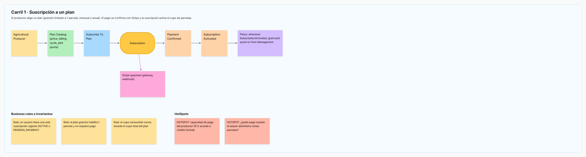

<em>Design-Level EventStorming: suscripción a un plan.</em>

**Carril 2. Registro de finca, parcela y cultivo**

El productor registra su finca y sus parcelas. Antes de crear la parcela se verifica el cupo disponible; al asignar el cultivo se fija el umbral de salinidad que usará Salinity Alerting.

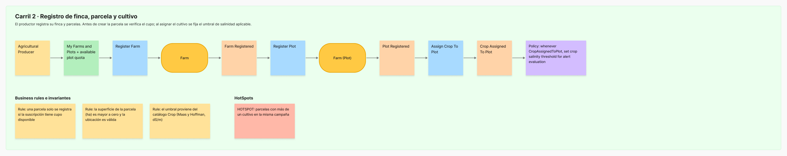

<em>Design-Level EventStorming: registro de finca, parcela y cultivo.</em>

**Carril 3. Instalación del dispositivo**

El productor registra el dispositivo con su código de activación y lo vincula a una parcela. La vinculación habilita la ingesta de lecturas.

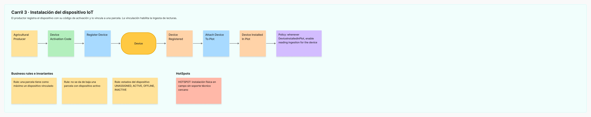

<em>Design-Level EventStorming: instalación del dispositivo IoT.</em>

**Carril 4. Captura, compensación y sincronización en el Edge Service**

El dispositivo entrega cada lectura al Edge Service, que la valida contra el rango del sensor, la compensa a 25 °C y la transmite. Si no hay conectividad, la guarda en un buffer local y la sincroniza en orden cronológico al reconectarse.

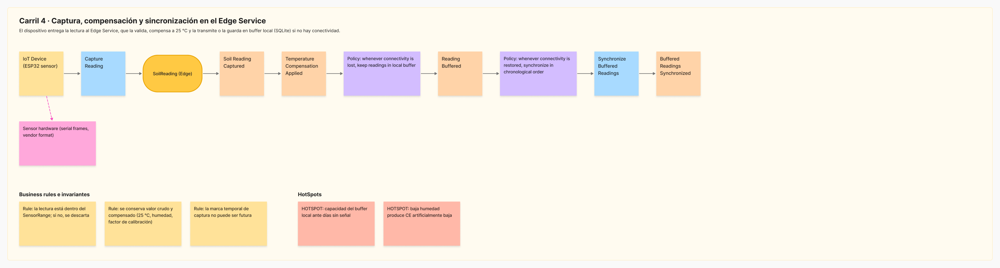

<em>Design-Level EventStorming: captura, compensación y sincronización en el Edge Service.</em>

**Carril 5. Ingesta de lecturas en la plataforma**

El Edge Service remite lotes al RESTful API. La ingesta descarta duplicados y persiste cada lectura; si un dispositivo deja de reportar, se marca fuera de línea.

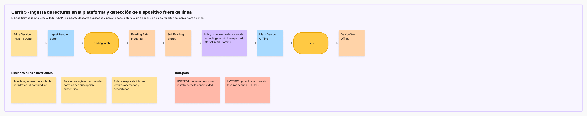

<em>Design-Level EventStorming: ingesta de lecturas y detección de dispositivo fuera de línea.</em>

**Carril 6. Evaluación de umbral y generación de alerta**

Cada lectura almacenada se compara con el umbral del cultivo de la parcela. Si lo supera, se genera una alerta con severidad y se notifica al productor y a sus asesores vinculados.

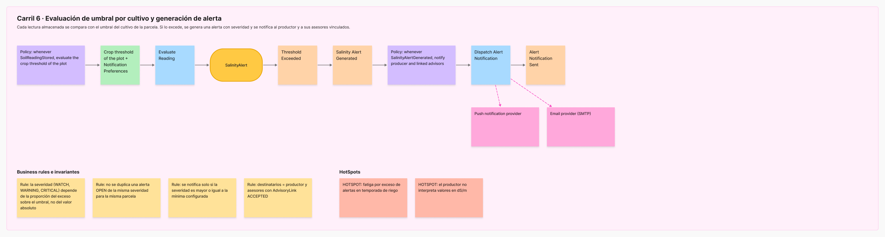

<em>Design-Level EventStorming: evaluación de umbral por cultivo y generación de alerta.</em>

**Carril 7. Reconocimiento de la alerta y acción correctiva**

El productor revisa la alerta, la reconoce y registra la acción ejecutada en campo, lo que cierra el ciclo de atención.

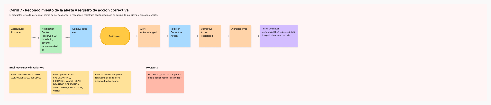

<em>Design-Level EventStorming: reconocimiento de la alerta y registro de acción correctiva.</em>

**Carril 8. Vinculación entre asesor y productor**

El asesor solicita supervisar a un productor, que acepta o revoca el vínculo. Solo los vínculos aceptados reciben alertas y aparecen en el tablero multiparcela.

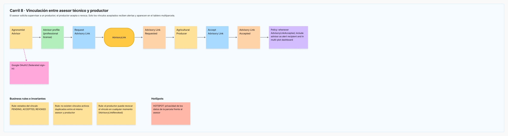

<em>Design-Level EventStorming: vinculación entre asesor técnico y productor.</em>

**Carril 9. Calibración con laboratorio**

El asesor registra un análisis de laboratorio de la parcela; el sistema calcula el factor de corrección del dispositivo y lo aplica en las siguientes compensaciones.

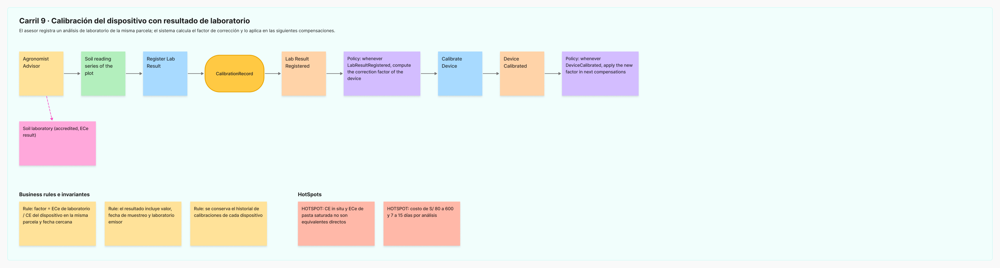

<em>Design-Level EventStorming: calibración del dispositivo con resultado de laboratorio.</em>

**Carril 10. Generación y exportación del reporte de parcela**

El asesor genera un reporte por parcela y periodo con la serie de lecturas, la tendencia, las alertas, las acciones correctivas y los datos de lluvia, y lo exporta en PDF.

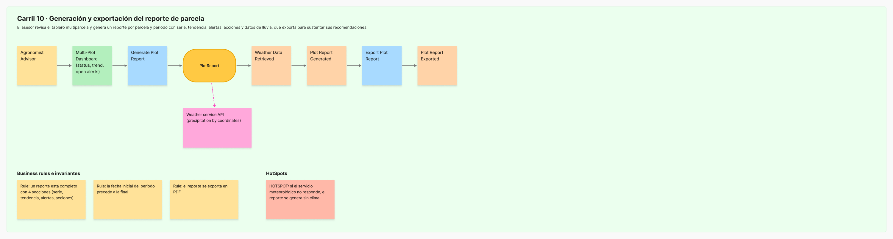

<em>Design-Level EventStorming: generación y exportación del reporte de parcela.</em>

**Carril 11. Cálculo de la tendencia de salinidad**

Cada lectura almacenada actualiza la tendencia de la parcela, que el productor consulta como indicador de detección temprana.

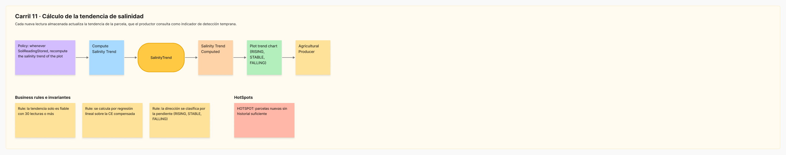

<em>Design-Level EventStorming: cálculo de la tendencia de salinidad.</em>

**Carril 12. Renovación, suspensión y baja de parcela**

Al vencer el periodo se intenta la renovación; si el cobro falla, la suscripción se suspende y se detiene la ingesta. Dar de baja una parcela libera su cupo.

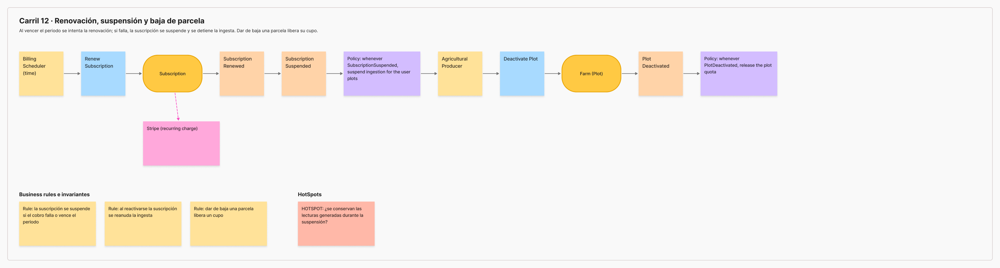

<em>Design-Level EventStorming: renovación, suspensión y baja de parcela.</em>

**Resultados del Design-Level EventStorming**

| Resultado | Detalle |
|---|---|
| Aggregates identificados | Subscription, Farm (Plot), Crop, Device, SoilReading, ReadingBatch, CalibrationRecord, SalinityAlert, NotificationPreference, AdvisoryLink, UserAccount, SalinityTrend, PlotReport. |
| Policies principales | Otorgar cupo al activarse la suscripción; habilitar la ingesta al instalar el dispositivo; evaluar el umbral y recalcular la tendencia al almacenar una lectura; notificar al generar una alerta; aplicar el nuevo factor al calibrar; suspender la ingesta al suspender la suscripción. |
| Reglas de negocio clave | Una suscripción vigente por usuario; como máximo un dispositivo por parcela; toda lectura conserva el valor crudo y el compensado; ingesta idempotente por dispositivo y fecha de captura; severidad por proporción del exceso sobre el umbral del cultivo; tendencia fiable con 30 lecturas o más. |
| HotSpots para el diseño táctico | Conectividad intermitente en campo, reenvíos duplicados, fatiga por exceso de alertas, interpretación de valores en dS/m, equivalencia entre la conductividad medida en campo y la ECe de laboratorio, y tratamiento de lecturas durante una suspensión. |

**URL del board en FigJam:** [OsoSense - Strategic DDD (Persona 3)](https://www.figma.com/board/IKkiZBJVEPP7dJKERzuDQJ/OsoSense---Strategic-DDD--Persona-3-?node-id=0-1&t=JmLMs0KXFXlRHfkK-1)

#### 4.1.1.1. Candidate Context Discovery

A partir del EventStorm modelado en la sección 4.1.1, el equipo realizó una sesión de Candidate Context Discovery de aproximadamente dos horas en FigJam, con el objetivo de identificar los bounded contexts candidatos de OsoSense. Se combinaron las tres técnicas propuestas en el enunciado:

- **Start-with-value:** se empezó por las partes del dominio que generan la ventaja competitiva de OsoSense. La captura y compensación confiable de lecturas y la evaluación de la salinidad según el cultivo se identificaron como el core del negocio, porque sostienen las hipótesis HS-01, HS-02, HS-03, HS-08 y HS-09 y diferencian a la solución de los medidores portátiles y de las plataformas de agricultura de precisión.
- **Look-for-pivotal-events:** se usaron los eventos pivote del Big Picture (*Subscription Activated*, *Device Installed In Plot*, *Soil Reading Stored*, *Salinity Alert Generated* y *Corrective Action Registered*) como fronteras naturales entre partes del proceso.
- **Start-with-simple:** cada proceso se descompuso en pasos secuenciales y se agruparon los comandos, eventos, policies y aggregates que usan el mismo lenguaje, cambian juntos y protegen las mismas reglas.

**Cambios progresivos del EventStorm**

| Iteración | Qué se hizo | Resultado |
|---|---|---|
| 1 | Se partió de las once fases del Big Picture EventStorming. | 11 grupos de eventos ordenados en el tiempo. |
| 2 | Se cortó la línea de tiempo en los cinco eventos pivote. | 6 segmentos candidatos. |
| 3 | Se clasificó cada segmento por su valor para el negocio. | Core: monitoreo y alertas. Supporting: estructura agrícola y analítica. Generic: identidad y suscripciones. |
| 4 | Se fusionaron los segmentos que comparten reglas y se separaron los que tienen responsabilidades distintas. | 6 bounded contexts candidatos. |

Las decisiones de la iteración 4 fueron las siguientes:

- La captura en campo, la ingesta en la plataforma y la calibración (fases F5, F6 y F9) se unieron en **Soil Monitoring**, porque las tres dependen de la lectura compensada y del factor de calibración del dispositivo.
- La evaluación de umbral, la alerta y la acción correctiva (F7 y F8) se unieron en **Salinity Alerting**, porque el ciclo de la alerta solo termina con la acción correctiva.
- La finca, la parcela, el cultivo y el dispositivo (F2 y F3) se unieron en **Farm Management**, porque un dispositivo solo existe vinculado a una parcela.
- La fase de acceso y suscripción (F1) se dividió: la cuenta y el vínculo con el asesor (F4) pasaron a **Identity and Access Management**; el plan, el pago y el ciclo de renovación (F11) pasaron a **Subscription and Billing**.
- Los reportes, tendencias y datos meteorológicos (F10) se agruparon en **Analytics and Reporting**, un contexto predominantemente de lectura.

La figura se organiza con el mismo esquema en todas sus partes. A la izquierda se ubica Identity and Access Management, punto de entrada común a todos los contextos, conectado con cada contexto candidato. Cada contexto se delimita con un recuadro punteado que contiene sus pares de comando y evento, los actores, los read models, los sistemas externos, las policies que ramifican el flujo y, al final de cada fila, en gris, los aggregates.

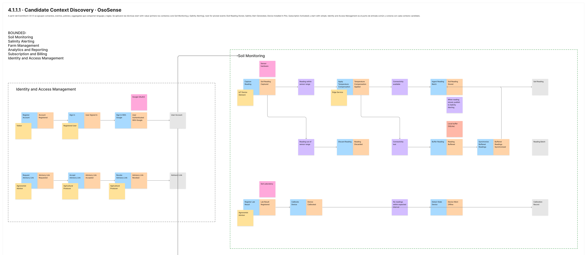

<em>Candidate Context Discovery: lista de bounded contexts, Identity and Access Management y Soil Monitoring.</em>

En **Identity and Access Management** se agrupan el registro, el inicio de sesión local y con Google OAuth2, y el ciclo de solicitud, aceptación y revocación del vínculo entre asesor y productor. Sus aggregates son *User Account* y *Advisory Link*.

En **Soil Monitoring** el flujo se ramifica mediante policies. Si la lectura está dentro del rango del sensor, se compensa por temperatura; si no, se descarta. Luego, si hay conectividad, el lote se ingiere y se publica *Soil Reading Stored*; si no, la lectura se guarda en el buffer local y se sincroniza al reconectarse. En una segunda fila se modela la calibración con laboratorio y en una tercera la detección de dispositivos sin lecturas. Sus aggregates son *Soil Reading*, *Reading Batch* y *Calibration Record*.

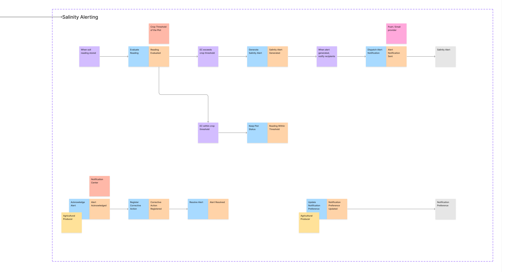

<em>Candidate Context Discovery: Salinity Alerting.</em>

En **Salinity Alerting** la policy *When soil reading stored* dispara la evaluación de la lectura contra el umbral del cultivo. Si la conductividad eléctrica supera el umbral, se genera la alerta y una segunda policy notifica a los destinatarios mediante el proveedor push o de correo; si no lo supera, la lectura se registra dentro del umbral. En la fila inferior se modela la atención de la alerta por parte del productor y la actualización de sus preferencias de notificación. Sus aggregates son *Salinity Alert* y *Notification Preference*.

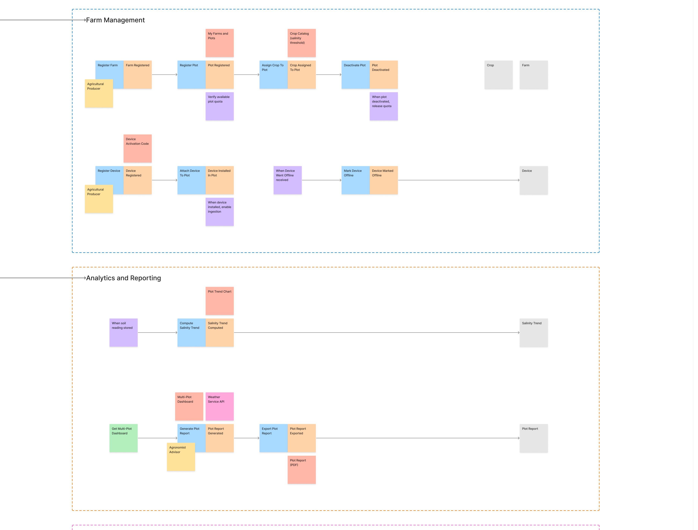

<em>Candidate Context Discovery: Farm Management y Analytics and Reporting.</em>

En **Farm Management** se modela el registro de finca y parcela, con la verificación del cupo disponible, la asignación del cultivo con su umbral y la baja de la parcela. En la segunda fila se registra y vincula el dispositivo, y se reacciona a *Device Went Offline* marcándolo fuera de línea. Sus aggregates son *Farm*, *Crop* y *Device*.

En **Analytics and Reporting** una policy recalcula la tendencia de salinidad ante cada lectura almacenada. El asesor consulta el tablero multiparcela, genera el reporte con datos del Weather Service API y lo exporta en PDF. Sus aggregates son *Salinity Trend* y *Plot Report*.

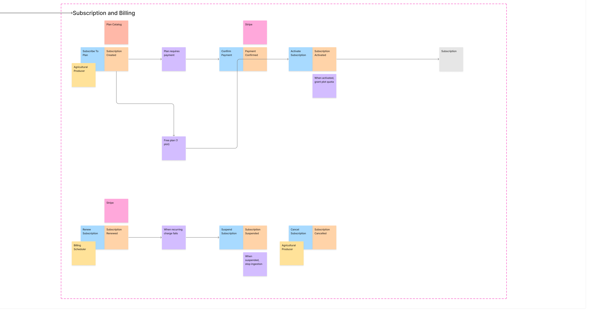

<em>Candidate Context Discovery: Subscription and Billing.</em>

En **Subscription and Billing** la suscripción se ramifica según el plan: si requiere pago, se confirma con Stripe antes de activarse; si es el plan gratuito de una parcela, se activa directamente. La activación otorga el cupo de parcelas. En la fila inferior se modela la renovación periódica, la suspensión cuando el cobro falla y la cancelación por parte del productor. Su aggregate es *Subscription*.

**Bounded contexts candidatos**

| Bounded context | Tipo de sub-dominio | Responsabilidad | Sub-dominio SaaS equivalente |
|---|---|---|---|
| Soil Monitoring | Core | Captura, validación, compensación, sincronización e ingesta de lecturas; calibración con laboratorio. | Service Execution and Monitoring |
| Salinity Alerting | Core | Evaluación de umbral por cultivo, alertas con severidad, notificación y acción correctiva. | Service Execution and Monitoring; Profiles and Preferences |
| Farm Management | Supporting | Fincas, parcelas, catálogo de cultivos y ciclo de vida del dispositivo. | Resource and Asset Management |
| Analytics and Reporting | Supporting | Tendencias, tableros y reportes exportables. | Dashboard and Analytics |
| Identity and Access Management | Generic | Identidad, autenticación, roles y vínculo asesor-productor. | Identity and Access Management |
| Subscription and Billing | Generic | Planes, pagos, cupo de parcelas y renovación. | Subscriptions and Payment Management |

**URL del board en FigJam:** [OsoSense - Strategic DDD (Persona 3)](https://www.figma.com/board/IKkiZBJVEPP7dJKERzuDQJ/OsoSense---Strategic-DDD--Persona-3-?node-id=0-1&t=JmLMs0KXFXlRHfkK-1)

#### 4.1.1.2. Domain Message Flows Modeling

En esta sección el equipo explica cómo colaboran los bounded contexts candidatos para resolver los casos de negocio más importantes de OsoSense. Para ello se aplicó la técnica **Domain Storytelling**: cada escenario se narra como una secuencia numerada de mensajes entre actores, sistemas y bounded contexts, de modo que la historia pueda leerse como oraciones del tipo "actor envía mensaje a contexto".

Se eligieron cuatro escenarios que, en conjunto, recorren los seis bounded contexts y todas las integraciones con sistemas externos:

1. Registro de una parcela monitoreada.
2. Alerta de salinidad a partir de una lectura del suelo (flujo core).
3. Supervisión del asesor y calibración del dispositivo.
4. Suscripción a un plan.

**Notación utilizada**

| Símbolo | Significado |
|---|---|
| Figura de persona | Actor, usuario o persona (Agricultural Producer, Agronomist Advisor). |
| Nube lila | Bounded context. |
| Engranaje | Sistema: aplicaciones de OsoSense, Edge Service, IoT Device o sistemas de terceros. |
| Flecha punteada | Dirección del mensaje, desde el emisor hacia el receptor. |
| Nota azul | Command: intención dirigida a un contexto. |
| Nota naranja | Event: hecho publicado por un contexto. |
| Nota verde | Query: consulta de información a otro contexto. |

El número de cada mensaje indica su orden dentro del escenario. Cuando dos mensajes ocurren al mismo tiempo, comparten número.

**Escenario 1: Monitored Plot Registration Scenario**

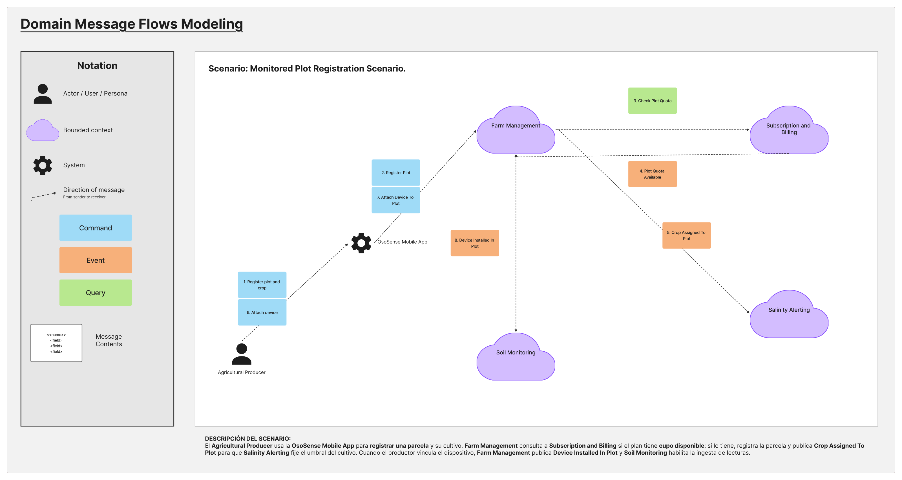

<em>Domain Message Flows Modeling: Monitored Plot Registration Scenario.</em>

| # | Emisor | Receptor | Mensaje | Tipo |
|---|---|---|---|---|
| 1 | Agricultural Producer | OsoSense Mobile App | Register plot and crop | Command |
| 2 | OsoSense Mobile App | Farm Management | Register Plot | Command |
| 3 | Farm Management | Subscription and Billing | Check Plot Quota | Query |
| 4 | Subscription and Billing | Farm Management | Plot Quota Available | Event |
| 5 | Farm Management | Salinity Alerting | Crop Assigned To Plot | Event |
| 6 | Agricultural Producer | OsoSense Mobile App | Attach device | Command |
| 7 | OsoSense Mobile App | Farm Management | Attach Device To Plot | Command |
| 8 | Farm Management | Soil Monitoring | Device Installed In Plot | Event |

Farm Management no crea la parcela sin antes confirmar el cupo con Subscription and Billing. Una vez registrada, informa el cultivo a Salinity Alerting para fijar el umbral y, al vincular el dispositivo, habilita la ingesta en Soil Monitoring.

**Escenario 2: Salinity Alert Scenario**

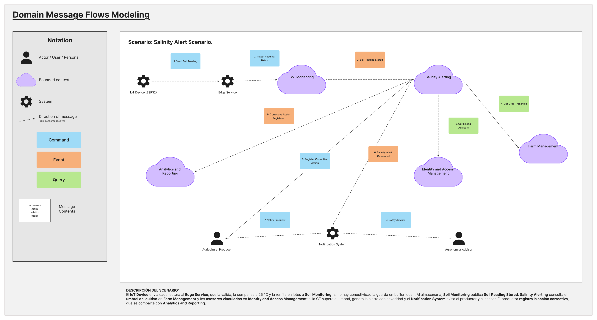

<em>Domain Message Flows Modeling: Salinity Alert Scenario.</em>

| # | Emisor | Receptor | Mensaje | Tipo |
|---|---|---|---|---|
| 1 | IoT Device (ESP32) | Edge Service | Send Soil Reading | Command |
| 2 | Edge Service | Soil Monitoring | Ingest Reading Batch | Command |
| 3 | Soil Monitoring | Salinity Alerting | Soil Reading Stored | Event |
| 4 | Salinity Alerting | Farm Management | Get Crop Threshold | Query |
| 5 | Salinity Alerting | Identity and Access Management | Get Linked Advisors | Query |
| 6 | Salinity Alerting | Notification System | Salinity Alert Generated | Event |
| 7 | Notification System | Agricultural Producer / Agronomist Advisor | Notify Producer / Notify Advisor | Command |
| 8 | Agricultural Producer | Salinity Alerting | Register Corrective Action | Command |
| 9 | Salinity Alerting | Analytics and Reporting | Corrective Action Registered | Event |

Este es el flujo de mayor valor para el negocio. Soil Monitoring y Salinity Alerting se comunican mediante el evento publicado *Soil Reading Stored*, sin llamadas directas. Salinity Alerting consulta información a Farm Management e Identity and Access Management, pero no modifica sus datos.

**Escenario 3: Advisor Supervision and Calibration Scenario**

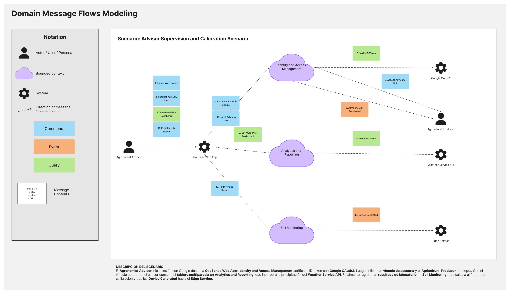

<em>Domain Message Flows Modeling: Advisor Supervision and Calibration Scenario.</em>

| # | Emisor | Receptor | Mensaje | Tipo |
|---|---|---|---|---|
| 1 | Agronomist Advisor | OsoSense Web App | Sign In With Google | Command |
| 2 | OsoSense Web App | Identity and Access Management | Authenticate With Google | Command |
| 3 | Identity and Access Management | Google OAuth2 | Verify ID Token | Query |
| 4 | Agronomist Advisor | OsoSense Web App | Request Advisory Link | Command |
| 5 | OsoSense Web App | Identity and Access Management | Request Advisory Link | Command |
| 6 | Identity and Access Management | Agricultural Producer | Advisory Link Requested | Event |
| 7 | Agricultural Producer | Identity and Access Management | Accept Advisory Link | Command |
| 8 | Agronomist Advisor | OsoSense Web App | View Multi-Plot Dashboard | Query |
| 9 | OsoSense Web App | Analytics and Reporting | Get Multi-Plot Dashboard | Query |
| 10 | Analytics and Reporting | Weather Service API | Get Precipitation | Query |
| 11 | Agronomist Advisor | OsoSense Web App | Register Lab Result | Command |
| 12 | OsoSense Web App | Soil Monitoring | Register Lab Result | Command |
| 13 | Soil Monitoring | Edge Service | Device Calibrated | Event |

El asesor solo accede a las parcelas del productor cuando el vínculo está aceptado. La calibración se registra en Soil Monitoring, que calcula el factor y lo publica hacia el Edge Service para las siguientes compensaciones.

**Escenario 4: Plan Subscription Scenario**

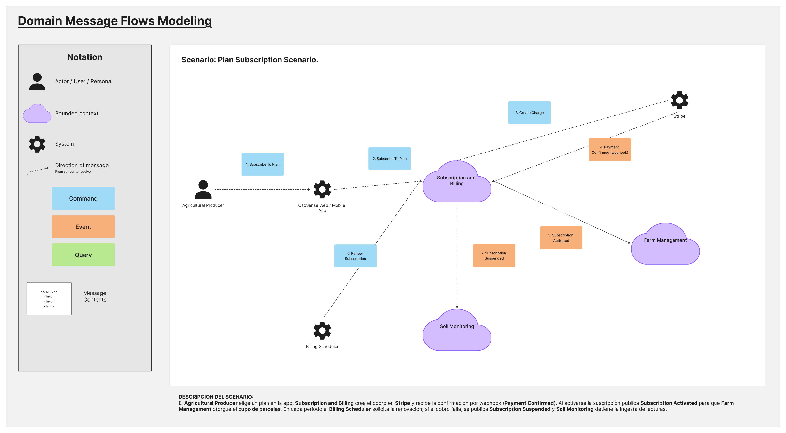

<em>Domain Message Flows Modeling: Plan Subscription Scenario.</em>

| # | Emisor | Receptor | Mensaje | Tipo |
|---|---|---|---|---|
| 1 | Agricultural Producer | OsoSense Web / Mobile App | Subscribe To Plan | Command |
| 2 | OsoSense Web / Mobile App | Subscription and Billing | Subscribe To Plan | Command |
| 3 | Subscription and Billing | Stripe | Create Charge | Command |
| 4 | Stripe | Subscription and Billing | Payment Confirmed (webhook) | Event |
| 5 | Subscription and Billing | Farm Management | Subscription Activated | Event |
| 6 | Billing Scheduler | Subscription and Billing | Renew Subscription | Command |
| 7 | Subscription and Billing | Soil Monitoring | Subscription Suspended | Event |

Subscription and Billing se integra con Stripe para el cobro y comunica los cambios de estado de la suscripción a los contextos afectados: el cupo a Farm Management y la suspensión de la ingesta a Soil Monitoring.

**Conclusiones del modelado de flujos**

- Los contextos core se comunican con eventos publicados, lo que reduce el acoplamiento entre la captura de lecturas y la evaluación de alertas.
- Las consultas entre contextos (Query) no modifican datos del contexto consultado.
- Cada sistema externo tiene un único contexto responsable de integrarlo: Stripe en Subscription and Billing, Google OAuth2 en Identity and Access Management, el Weather Service API en Analytics and Reporting y el proveedor de notificaciones en Salinity Alerting.
- Estos flujos son la base de las relaciones del Context Mapping de la sección 4.1.2.

**URL del board en FigJam:** [OsoSense - Strategic DDD (Persona 3)](https://www.figma.com/board/IKkiZBJVEPP7dJKERzuDQJ/OsoSense---Strategic-DDD--Persona-3-?node-id=0-1&t=JmLMs0KXFXlRHfkK-1)

#### 4.1.1.3. Bounded Context Canvases

En esta sección el equipo diseña cada bounded context candidato con el **Bounded Context Canvas V4** de ddd-crew. Los contextos se trabajaron por orden de importancia: primero los core (Soil Monitoring y Salinity Alerting), luego los supporting (Farm Management y Analytics and Reporting) y al final los generic (Identity and Access Management y Subscription and Billing).

Cada canvas se elaboró de forma iterativa siguiendo los pasos indicados en el enunciado:

1. **Context Overview Definition:** nombre y propósito del contexto.
2. **Business Rules Distillation & Ubiquitous Language Capture:** términos propios del contexto y decisiones de negocio que debe proteger.
3. **Capability Analysis:** mensajes que el contexto recibe (Inbound Communication) y que envía (Outbound Communication).
4. **Capability Layering:** clasificación estratégica según dominio (core, supporting o generic), modelo de negocio (revenue, engagement, compliance o cost reduction) y evolución (genesis, custom built, product o commodity), junto con el rol del contexto (draft, execution, analysis o gateway).
5. **Dependencies Capture:** colaboradores de cada mensaje, diferenciados entre bounded context, sistema externo, frontend y rol.
6. **Design Critique:** revisión cruzada entre canvases para verificar que cada mensaje enviado por un contexto aparezca como recibido en su colaborador.

En los canvases, los mensajes azules son Commands, los amarillos son Events y los verdes son Queries. La leyenda *Collaborator Types* de cada canvas indica el tipo de colaborador.

**Soil Monitoring**

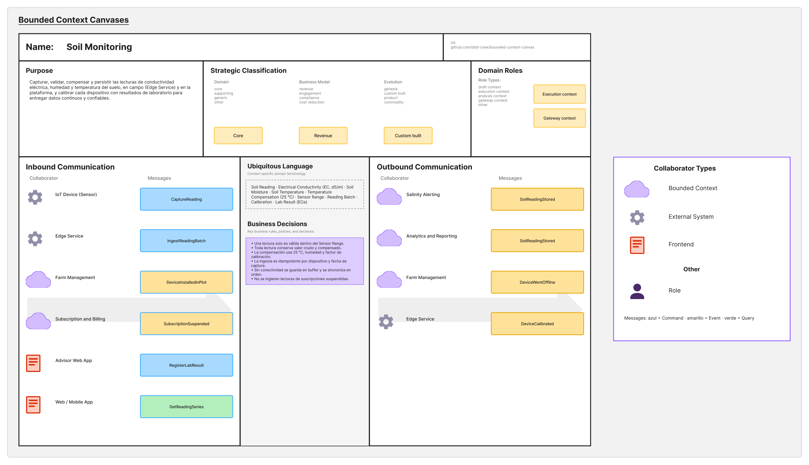

<em>Bounded Context Canvas: Soil Monitoring.</em>

Soil Monitoring es un contexto core, orientado a generar ingresos y construido a medida, porque el dato confiable del suelo es la base de la propuesta de valor. Cumple el rol de execution context y de gateway context, ya que recibe la telemetría del IoT Device y del Edge Service. Sus decisiones de negocio garantizan que ninguna lectura inválida se almacene y que toda lectura conserve su valor crudo y compensado.

**Salinity Alerting**

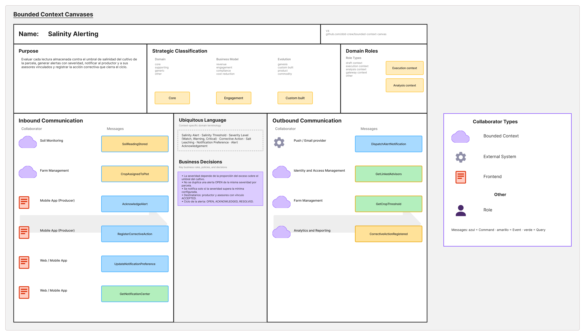

<em>Bounded Context Canvas: Salinity Alerting.</em>

Salinity Alerting es el segundo contexto core. Su modelo de negocio es engagement, porque la alerta oportuna es lo que hace volver al productor a la plataforma. Actúa como execution context y analysis context: interpreta cada lectura según el cultivo y decide la severidad por la proporción del exceso sobre el umbral, no por el valor absoluto.

**Farm Management**

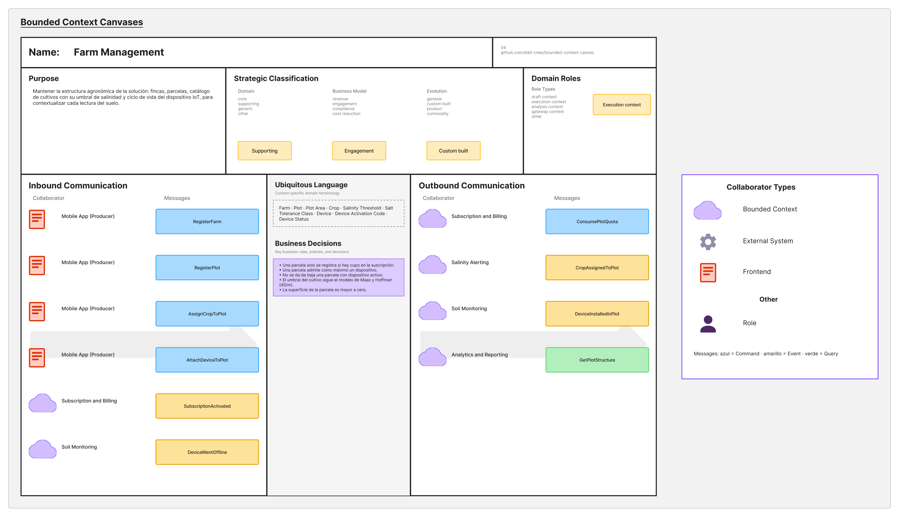

<em>Bounded Context Canvas: Farm Management.</em>

Farm Management es un contexto supporting que da el marco agronómico a cada lectura: parcela, cultivo, umbral y dispositivo. Coordina con Subscription and Billing para validar el cupo y publica los eventos que activan la ingesta y el umbral en los contextos core.

**Analytics and Reporting**

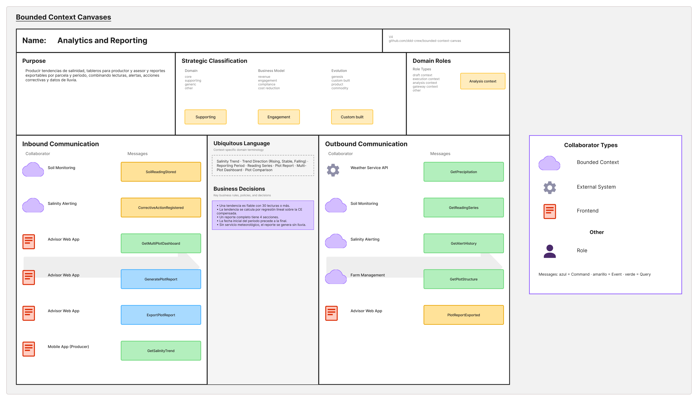

<em>Bounded Context Canvas: Analytics and Reporting.</em>

Analytics and Reporting es un contexto supporting con rol de analysis context. Consume información de Soil Monitoring, Salinity Alerting y Farm Management, y del Weather Service API, sin modificar esos datos. Su valor principal está en el tablero multiparcela y los reportes que sustentan las recomendaciones del asesor.

**Identity and Access Management**

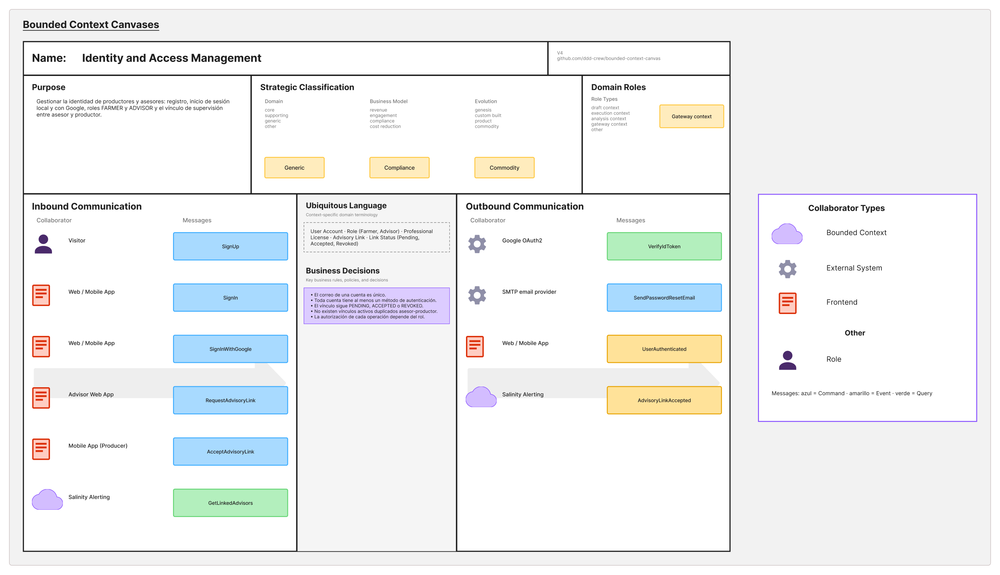

<em>Bounded Context Canvas: Identity and Access Management.</em>

Identity and Access Management es un contexto generic orientado a compliance, que puede resolverse con soluciones estándar como Google OAuth2. Cumple el rol de gateway context para el acceso a la plataforma y controla el vínculo entre asesor y productor, del que dependen las notificaciones de Salinity Alerting.

**Subscription and Billing**

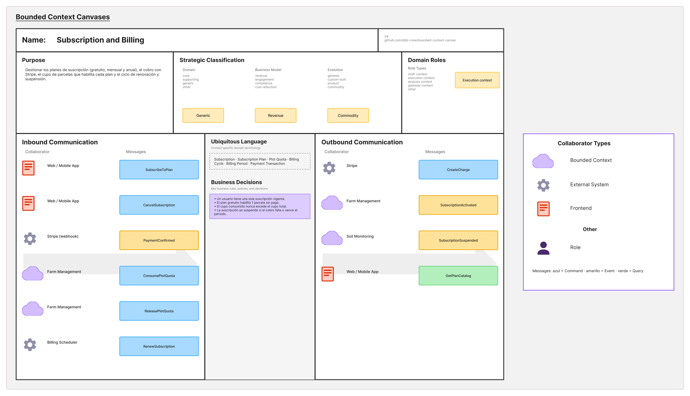

<em>Bounded Context Canvas: Subscription and Billing.</em>

Subscription and Billing es un contexto generic orientado a revenue, apoyado en Stripe como proveedor de pagos. Controla el cupo de parcelas que habilita cada plan y comunica la activación y la suspensión de la suscripción a los contextos afectados.

**Resumen de clasificación estratégica**

| Bounded context | Domain | Business Model | Evolution | Domain Roles |
|---|---|---|---|---|
| Soil Monitoring | Core | Revenue | Custom built | Execution context, Gateway context |
| Salinity Alerting | Core | Engagement | Custom built | Execution context, Analysis context |
| Farm Management | Supporting | Engagement | Custom built | Execution context |
| Analytics and Reporting | Supporting | Engagement | Custom built | Analysis context |
| Identity and Access Management | Generic | Compliance | Commodity | Gateway context |
| Subscription and Billing | Generic | Revenue | Commodity | Execution context |

**Design Critique**

- Cada evento publicado tiene al menos un contexto consumidor. Por ejemplo, *Soil Reading Stored* es consumido por Salinity Alerting y Analytics and Reporting.
- Ningún contexto necesita modificar datos de otro contexto. Las necesidades de información se resuelven con queries o eventos.
- Los sistemas externos quedan aislados en un solo contexto cada uno, lo que permite reemplazarlos sin afectar al resto del dominio.
- Se evaluó separar Device Management y Notifications como contextos propios. Estas alternativas se discuten en la sección 4.1.2.

**URL del board en FigJam:** [OsoSense - Strategic DDD (Persona 3)](https://www.figma.com/board/IKkiZBJVEPP7dJKERzuDQJ/OsoSense---Strategic-DDD--Persona-3-?node-id=0-1&t=JmLMs0KXFXlRHfkK-1)

### 4.1.2. Context Mapping

En esta sección el equipo explica cómo elaboró el context map de OsoSense, es decir, la visualización de las relaciones estructurales entre los seis bounded contexts. El proceso partió de los Bounded Context Canvases (4.1.1.3) y de los flujos de mensajes (4.1.1.2). Con ese material se construyeron varios mapas candidatos, planteando preguntas del tipo "¿qué pasaría si...?" sugeridas en el enunciado:

- ¿Qué pasaría si partimos un bounded context en varios?
- ¿Qué pasaría si fusionamos dos contextos que se comunican mucho?
- ¿Qué pasaría si creamos un shared service para reducir duplicación?
- ¿Qué pasaría si movemos una capacidad a otro contexto?

Cada alternativa se discutió en función de las reglas de negocio, el lenguaje de cada contexto y el acoplamiento que generaba, hasta llegar a la versión final.

**Patrones de relación utilizados**

| Patrón | Significado en OsoSense |
|---|---|
| Customer/Supplier | El contexto upstream (proveedor) atiende las necesidades del downstream (cliente) y publica la información que este requiere. |
| Partnership | Dos contextos que dependen mutuamente y evolucionan de forma coordinada. |
| Open Host Service (OHS) | El contexto upstream expone un contrato público y estable, en este caso un evento publicado, para que otros contextos lo consuman. |
| Conformist | El contexto downstream adopta el modelo del upstream sin traducirlo. |
| Anti-corruption Layer (ACL) | El contexto downstream traduce el modelo del upstream para proteger su propio modelo. |
| Shared Kernel | Modelo compartido entre contextos. No se usó, porque ningún par de contextos necesita compartir código o modelo. |

**Versión 1: Device Management como contexto propio**

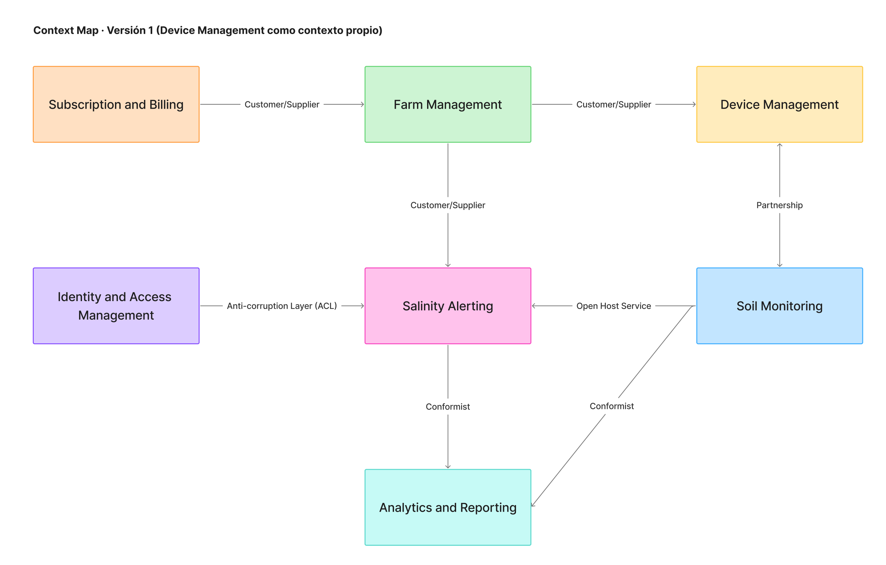

<em>Context Map, versión 1: Device Management como contexto propio.</em>

*Pregunta planteada:* ¿qué pasaría si partimos Farm Management y movemos el ciclo de vida del dispositivo a un contexto Device Management?

- **A favor:** aislaría el registro, el estado y la futura gestión de flota de dispositivos.
- **En contra:** el dispositivo solo tiene sentido vinculado a una parcela (regla: una parcela admite como máximo un dispositivo) y hoy no existe gestión de flota ni actualización remota de firmware. Además, Analytics and Reporting quedaba como conformista de dos contextos, lo que lo acoplaba a cambios internos.
- **Decisión:** se descarta por ahora. Device Management se mantiene dentro de Farm Management y se revisará en el Sprint 3 si aparece la gestión de flota.

**Versión 2: Soil Monitoring y Salinity Alerting fusionados**

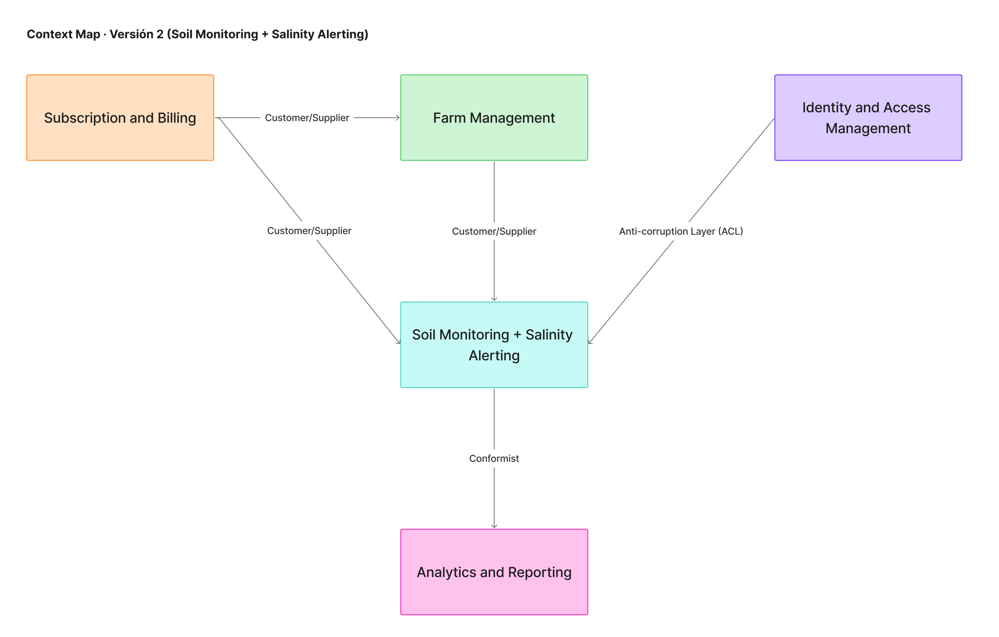

<em>Context Map, versión 2: Soil Monitoring y Salinity Alerting en un solo contexto.</em>

*Pregunta planteada:* ¿qué pasaría si fusionamos los dos contextos core, que se comunican con cada lectura, en un único contexto de monitoreo y alertas?

- **A favor:** menos integración y un solo modelo de lectura.
- **En contra:** la ingesta en campo (Edge, idempotencia y compensación) cambia a un ritmo distinto que las reglas agronómicas de severidad, y ambos usan lenguajes diferentes (sensor frente a cultivo y umbral). La fusión también impediría desplegar la parte de campo de forma independiente.
- **Decisión:** se descarta. Se mantienen dos contextos core unidos por el evento *Soil Reading Stored*.

**Versión 3: Notifications como shared service**

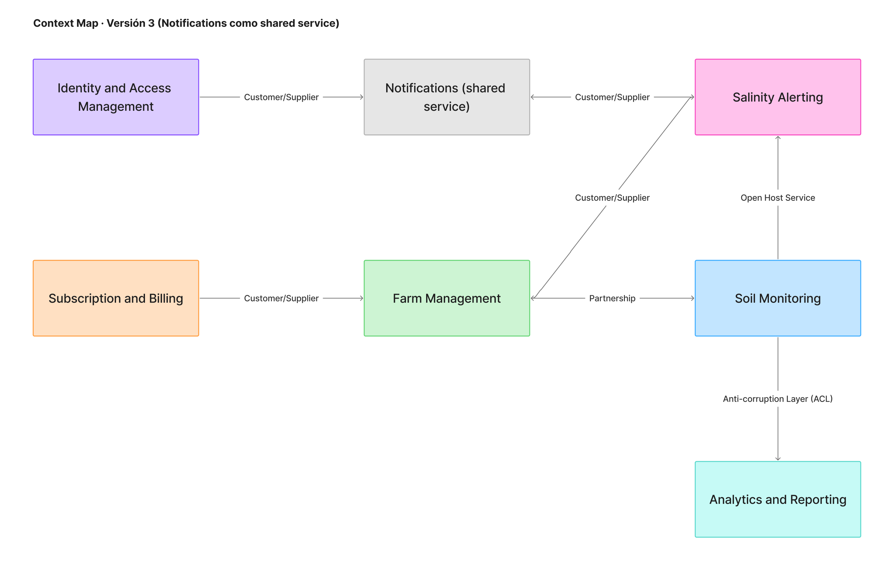

<em>Context Map, versión 3: Notifications como shared service.</em>

*Pregunta planteada:* ¿qué pasaría si creamos un shared service de notificaciones para Identity and Access Management (correos de cuenta) y Salinity Alerting (alertas)?

- **A favor:** reduce la duplicación de los adaptadores de push y correo.
- **En contra:** las preferencias de notificación dependen de la severidad de la alerta, que es una regla de Salinity Alerting. Un servicio compartido obligaría a Identity and Access Management a conocer conceptos de alertas.
- **Decisión:** se descarta. *Notification Preference* queda en Salinity Alerting y cada contexto integra su proveedor mediante un Anti-corruption Layer, aceptando una duplicación menor.

**Versión 4: Context map final**

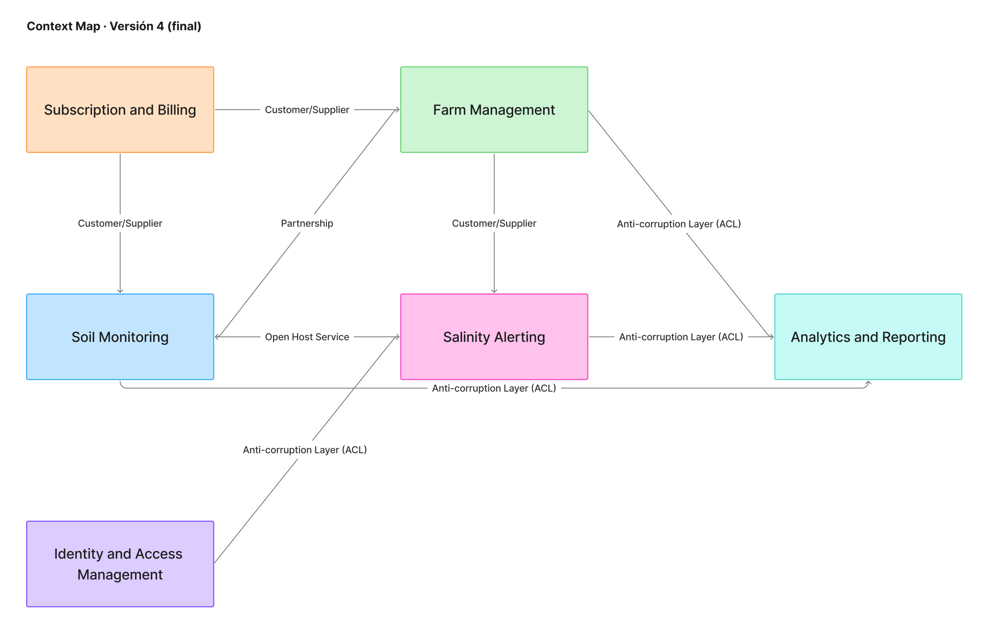

<em>Context Map, versión 4: mapa final de OsoSense.</em>

La versión final conserva los seis bounded contexts y define las siguientes relaciones:

| Upstream | Downstream | Patrón | Mecanismo de integración |
|---|---|---|---|
| Subscription and Billing | Farm Management | Customer/Supplier | Evento *Subscription Activated* y consulta de cupo mediante *Subscription Quota Client* (ACL en Farm Management). |
| Subscription and Billing | Soil Monitoring | Customer/Supplier | Evento *Subscription Suspended*, que detiene la ingesta. |
| Farm Management | Soil Monitoring | Partnership | *Device Installed In Plot* habilita la ingesta y *Device Went Offline* actualiza el estado del dispositivo. |
| Farm Management | Salinity Alerting | Customer/Supplier | Evento *Crop Assigned To Plot* y consulta del umbral mediante *Crop Threshold Client*. |
| Soil Monitoring | Salinity Alerting | Open Host Service | Evento publicado *Soil Reading Stored*, consumido por Salinity Alerting. |
| Identity and Access Management | Salinity Alerting | Anti-corruption Layer | Consulta de asesores vinculados mediante *Advisory Link Client*. |
| Salinity Alerting | Analytics and Reporting | Anti-corruption Layer | Historial de alertas y acciones mediante *Alert History Client*. |
| Soil Monitoring | Analytics and Reporting | Anti-corruption Layer | Series de lecturas mediante *Soil Reading Series Client*. |
| Farm Management | Analytics and Reporting | Anti-corruption Layer | Estructura de parcelas mediante *Plot Structure Client*. |

Además, cada integración con terceros se protege con un Anti-corruption Layer dentro de su contexto: Stripe en Subscription and Billing, Google OAuth2 y el proveedor SMTP en Identity and Access Management, el proveedor de notificaciones push y correo en Salinity Alerting, el Weather Service API en Analytics and Reporting y el hardware del sensor en el Edge Service de Soil Monitoring.

**Justificación de la versión final**

- **Independencia del core:** Soil Monitoring y Salinity Alerting solo se comunican mediante un evento publicado, por lo que cada uno puede evolucionar y desplegarse sin afectar al otro.
- **Protección de modelos:** los contextos que consumen información de varios otros, como Analytics and Reporting y Salinity Alerting, usan Anti-corruption Layer para que los cambios internos de sus proveedores no los rompan.
- **Colaboración real:** Farm Management y Soil Monitoring se relacionan como Partnership, porque la instalación y el estado del dispositivo requieren decisiones coordinadas entre ambos.
- **Coherencia con el diseño táctico:** las relaciones de la tabla corresponden a los clientes, consumidores y eventos definidos en la sección 4.2.

**URL del board en FigJam:** [OsoSense - Strategic DDD (Persona 3)](https://www.figma.com/board/IKkiZBJVEPP7dJKERzuDQJ/OsoSense---Strategic-DDD--Persona-3-?node-id=0-1&t=JmLMs0KXFXlRHfkK-1)

### 4.1.3. Software Architecture

La arquitectura de software de OsoTerra IoT se documenta siguiendo el modelo C4 de Simon Brown, que describe un sistema mediante niveles sucesivos de detalle, de modo que cada audiencia encuentre la vista con el grado de abstracción que necesita sin verse obligada a interpretar diagramas irrelevantes para su rol.

Se presentan cuatro vistas. El **System Landscape Diagram** (4.1.3.1) ubica a OsoTerra IoT dentro del ecosistema de sistemas y actores con los que convive, incluidos los servicios externos de pago, notificación y datos meteorológicos. El **Context Level Diagram** (4.1.3.2) acota el alcance a la solución misma y a sus interacciones directas con usuarios y sistemas externos, sin revelar su estructura interna. El **Container Level Diagram** (4.1.3.3) descompone la solución en sus unidades desplegables —dispositivo de campo, Edge Service, RESTful API, aplicaciones web y móvil, Landing Page y base de datos— y muestra las tecnologías y protocolos que las comunican. El **Deployment Diagram** (4.1.3.4) proyecta esos contenedores sobre la infraestructura física y de nube donde se ejecutan.

Los diagramas de nivel de componente, que corresponden al tercer nivel del C4, no se presentan aquí sino dentro de cada bounded context en la sección 4.2, porque su lectura solo tiene sentido junto al detalle táctico del contexto al que pertenecen.

#### 4.1.3.1. Software Architecture System Landscape Diagram

El System Landscape Diagram es la vista más amplia del C4 Model. Muestra, en una sola imagen, las personas que interactúan con la solución, los sistemas de software que Oso Terra construye y opera, y los sistemas externos con los que esos sistemas se integran. Su propósito es dar contexto antes de bajar al nivel de Context, Container y Component, sin entrar todavía en tecnologías ni despliegue.

**Proceso de elaboración**

1. **Identificación de personas.** Se tomaron los actores del Big Picture EventStorming (2.4) y de los flujos de mensajes (4.1.1.2) que interactúan directamente con la solución: el visitante del Landing Page, el Agricultural Producer y el Agronomist Advisor.
2. **Identificación de sistemas propios.** Los productos digitales exigidos por el enunciado se agruparon en dos sistemas de software dentro del límite de la empresa Oso Terra: *OsoSense Platform*, que reúne el Landing Page, la Web App, la Mobile App y el RESTful API, y *OsoSense Field Monitoring*, que reúne el IoT Device y el Edge Service.
3. **Identificación de sistemas externos.** Se tomaron los sistemas de terceros ya definidos en el Context Mapping (4.1.2): Stripe, Google OAuth2, el proveedor de notificaciones push y correo y el Weather Service API. El laboratorio de suelos se incluyó como sistema externo con el que interactúa el asesor.
4. **Relaciones.** Cada relación se rotuló con la acción principal que realiza el emisor sobre el receptor.
5. **Revisión.** Se verificó que cada persona y cada sistema externo del diagrama aparezca en al menos un escenario de Domain Storytelling.

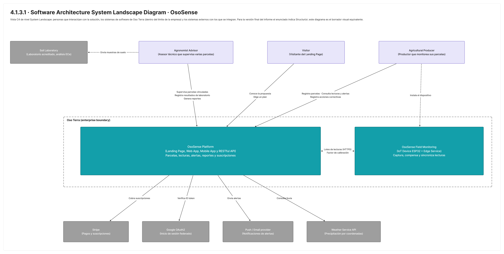

<em>Software Architecture System Landscape Diagram de OsoSense.</em>

**Elementos del diagrama**

| Elemento | Tipo | Descripción |
|---|---|---|
| Visitor | Persona | Visitante del Landing Page que conoce la propuesta y elige un plan. |
| Agricultural Producer | Persona | Productor que registra sus parcelas, consulta lecturas y alertas y registra acciones correctivas. |
| Agronomist Advisor | Persona | Asesor técnico que supervisa varias parcelas vinculadas, registra resultados de laboratorio y genera reportes. |
| OsoSense Platform | Sistema propio | Landing Page, Web App, Mobile App y RESTful API. Gestiona parcelas, lecturas, alertas, reportes y suscripciones. |
| OsoSense Field Monitoring | Sistema propio | IoT Device (ESP32) y Edge Service. Captura, compensa y sincroniza las lecturas del suelo. |
| Stripe | Sistema externo | Procesa los pagos y cobros recurrentes de las suscripciones. |
| Google OAuth2 | Sistema externo | Permite el inicio de sesión federado. |
| Push / Email provider | Sistema externo | Entrega las notificaciones de alertas. |
| Weather Service API | Sistema externo | Provee datos de precipitación por coordenadas para los reportes. |
| Soil Laboratory | Sistema externo | Laboratorio acreditado que entrega el análisis de ECe usado para calibrar el dispositivo. |

**Relaciones principales**

- El **Visitor** conoce la propuesta y elige un plan en OsoSense Platform.
- El **Agricultural Producer** usa OsoSense Platform para gestionar sus parcelas y atender alertas, e instala el dispositivo de OsoSense Field Monitoring en su parcela.
- El **Agronomist Advisor** supervisa parcelas y genera reportes en OsoSense Platform, y envía muestras de suelo al Soil Laboratory.
- **OsoSense Field Monitoring** envía lotes de lecturas a OsoSense Platform por HTTPS y recibe de ella el factor de calibración.
- **OsoSense Platform** cobra las suscripciones con Stripe, verifica el ID token con Google OAuth2, envía alertas mediante el proveedor push y de correo, y consulta la lluvia en el Weather Service API.

**Decisiones reflejadas en el diagrama**

- La solución se separa en dos sistemas porque la parte de campo opera con conectividad intermitente y se despliega en el dispositivo y el Edge Service, mientras que la plataforma se despliega en la nube.
- Todas las integraciones con terceros pasan por OsoSense Platform; el campo no depende directamente de ningún sistema externo.
- Los niveles de Context, Container y Deployment se detallan en las secciones siguientes.

**URL del board en FigJam:** [OsoSense - Strategic DDD (Persona 3)](https://www.figma.com/board/IKkiZBJVEPP7dJKERzuDQJ/OsoSense---Strategic-DDD--Persona-3-?node-id=0-1&t=JmLMs0KXFXlRHfkK-1)

#### 4.1.3.2. Software Architecture Context Level Diagrams

El System Context Diagram enfoca **OsoSense Platform** —el sistema con el que interactúan directamente las personas— y muestra sus dependencias inmediatas: los usuarios, el sistema de campo que le entrega lecturas y los sistemas externos con los que se integra. Todavía no se detallan contenedores ni tecnologías; eso corresponde al nivel de Container.

**Proceso de elaboración**

1. **Sistema en foco.** Se eligió OsoSense Platform como sistema central, por ser el que usan directamente el visitante, el productor y el asesor.
2. **Personas.** Se heredaron del System Landscape (4.1.3.1): Visitor, Agricultural Producer y Agronomist Advisor.
3. **Sistema adyacente.** OsoSense Field Monitoring se modela como sistema vecino que envía lotes de lecturas y recibe el factor de calibración.
4. **Sistemas externos.** Se conservaron los del Context Mapping (4.1.2): Stripe, Google OAuth2, el proveedor de notificaciones push y correo, el Weather Service API y el Soil Laboratory.
5. **Relaciones.** Cada relación se rotuló con la acción principal y el protocolo del emisor sobre el receptor.

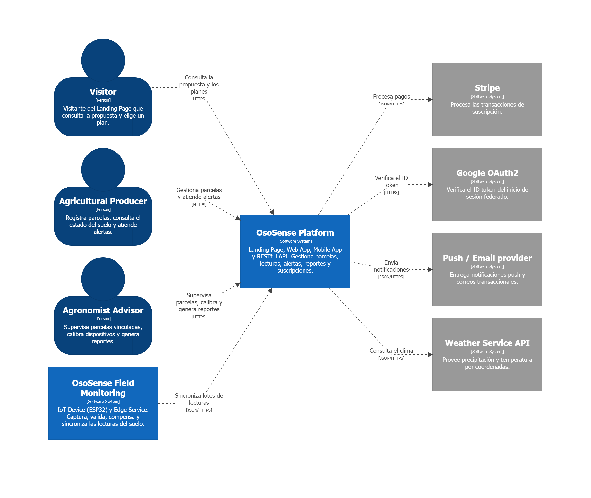

<em>Software Architecture System Context Diagram de OsoSense.</em>

**Elementos del diagrama**

| Elemento | Tipo | Descripción |
|---|---|---|
| Visitor | Persona | Visitante del Landing Page que consulta la propuesta y los planes. |
| Agricultural Producer | Persona | Registra parcelas, consulta el estado del suelo y atiende alertas. |
| Agronomist Advisor | Persona | Supervisa parcelas vinculadas, calibra dispositivos y genera reportes. |
| OsoSense Platform | Sistema en foco | Reúne Landing Page, Web App, Mobile App y RESTful API. |
| OsoSense Field Monitoring | Sistema adyacente | Captura, valida, compensa y sincroniza las lecturas del suelo. |
| Stripe | Sistema externo | Procesa las transacciones de suscripción. |
| Google OAuth2 | Sistema externo | Verifica el ID token del inicio de sesión federado. |
| Push / Email provider | Sistema externo | Entrega notificaciones push y correos transaccionales. |
| Weather Service API | Sistema externo | Provee precipitación y temperatura ambiental por coordenadas. |
| Soil Laboratory | Sistema externo | Emite el análisis de ECe de referencia usado para calibrar el dispositivo. |

**Relaciones principales**

- El **Visitor** consulta la propuesta y los planes en OsoSense Platform (HTTPS).
- El **Producer** gestiona sus parcelas y atiende alertas, y el **Advisor** supervisa parcelas, calibra y genera reportes (HTTPS).
- **OsoSense Field Monitoring** envía lotes de lecturas a la plataforma y recibe de ella el factor de calibración (HTTPS).
- **OsoSense Platform** procesa pagos con Stripe, verifica el ID token con Google OAuth2, envía notificaciones por el proveedor push/correo y consulta el clima en el Weather Service API.
- El **Advisor** solicita análisis al **Soil Laboratory** y registra su resultado en la plataforma, cerrando el ciclo de calibración.

**Decisiones reflejadas en el diagrama**

- El foco en OsoSense Platform evita repetir el Landscape: Field Monitoring se ve aquí como una caja cuyo interior se abre en el nivel de Container.
- La dependencia del **servicio meteorológico** es no crítica: su indisponibilidad degrada la riqueza del diagnóstico pero no impide la operación.
- Todas las integraciones con terceros pasan por la plataforma; el campo no depende directamente de ningún sistema externo.

#### 4.1.3.3. Software Architecture Container Level Diagrams

El Container Level abre los sistemas del nivel anterior en sus unidades de despliegue independiente (aplicaciones, servicios y almacenes de datos), con la tecnología de cada una y sus canales de comunicación. En total son **siete unidades desplegables** repartidas en los dos sistemas propios.

**Proceso de elaboración**

1. **Descomposición de OsoSense Platform.** Landing Page (estático), Web App y Mobile App como clientes, el RESTful API como backend de negocio y la Platform Database como almacén.
2. **Descomposición de OsoSense Field Monitoring.** Embedded Application sobre el ESP32, Edge Service en campo y su base local para la sincronización diferida.
3. **Tecnologías.** Se anotó la pila establecida por el curso para cada contenedor.
4. **Protocolos.** Cada relación se rotuló con su protocolo (JSON/HTTPS, JDBC, SQL local, Serial/WiFi, SMTP).

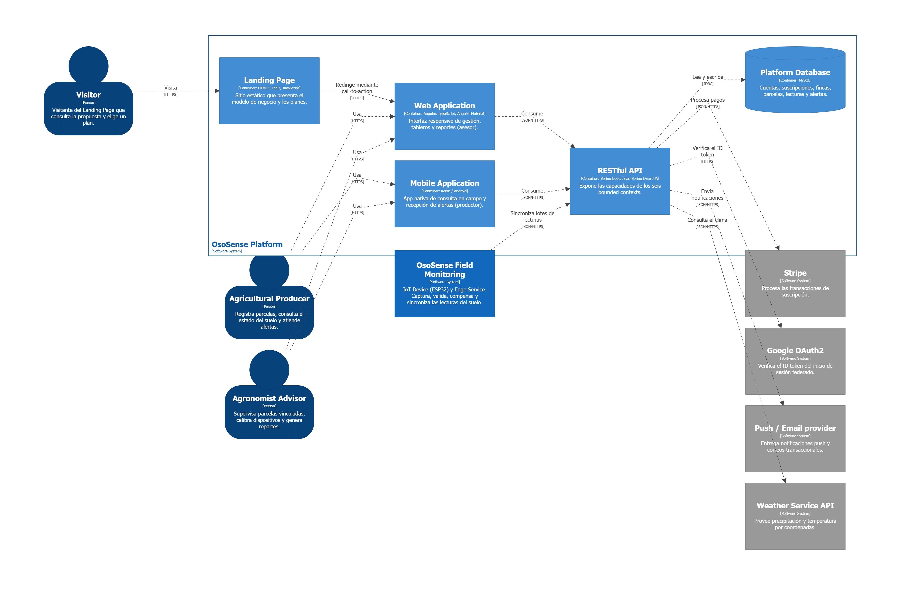

<em>Software Architecture Container Diagram — OsoSense Platform.</em>

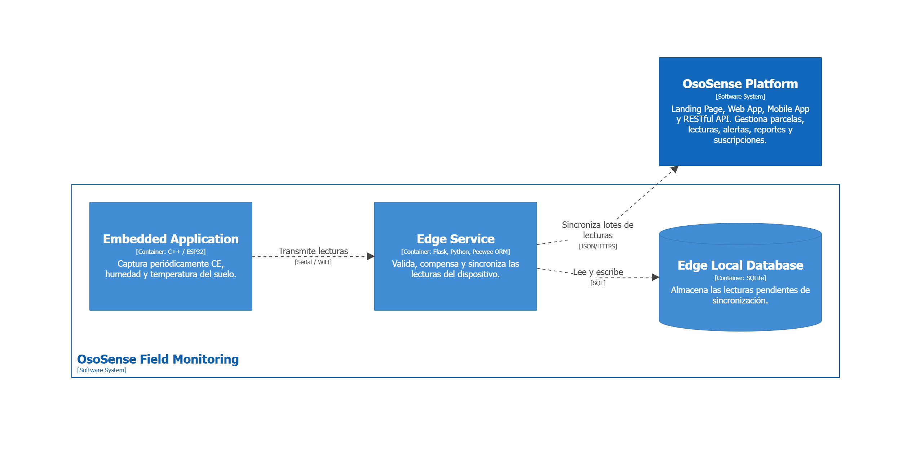

<em>Software Architecture Container Diagram — OsoSense Field Monitoring.</em>

**Elementos del diagrama**

| Contenedor | Sistema | Tecnología | Responsabilidad |
|---|---|---|---|
| Landing Page | OsoSense Platform | HTML5, CSS3, JavaScript | Sitio estático que presenta el modelo de negocio y los planes. |
| Web Application | OsoSense Platform | Angular, TypeScript, Angular Material | Interfaz responsive de gestión, tableros y reportes (asesor). |
| Mobile Application | OsoSense Platform | Kotlin / Android | App nativa de consulta en campo y recepción de alertas (productor). |
| RESTful API | OsoSense Platform | Spring Boot, Java, Spring Data JPA | Expone las capacidades de los seis bounded contexts. |
| Platform Database | OsoSense Platform | MySQL | Persiste cuentas, suscripciones, fincas, parcelas, lecturas y alertas. |
| Embedded Application | OsoSense Field Monitoring | C++ / ESP32 | Captura periódicamente CE, humedad y temperatura del suelo. |
| Edge Service | OsoSense Field Monitoring | Flask, Python, Peewee ORM | Valida, compensa y sincroniza las lecturas del dispositivo. |
| Edge Local Database | OsoSense Field Monitoring | SQLite | Almacena las lecturas pendientes de sincronización. |

**Relaciones principales**

- El **Visitor** visita el Landing Page, que redirige a la Web App mediante un call-to-action (HTTPS).
- **Web App** y **Mobile App** consumen el mismo **RESTful API** (JSON/HTTPS); el API es el único que lee y escribe en la Platform Database (JDBC).
- La **Embedded Application** transmite lecturas al **Edge Service** (Serial/WiFi); el Edge las guarda en su base local (SQL) y sincroniza los lotes al API (JSON/HTTPS).
- El **RESTful API** concentra las integraciones externas: Stripe, Weather Service API y notificaciones push (JSON/HTTPS) y correo (SMTP).

**Decisiones reflejadas en el diagrama**

- La separación entre **Edge Service** y **RESTful API** es la decisión más relevante: el Edge se despliega en campo y asume la validación de rango, la compensación a 25 °C sobre la lectura fresca y el almacenamiento local con sincronización diferida. Sin ella, cada corte de conexión produciría un vacío irrecuperable en el histórico —el activo que sostiene la propuesta de valor.
- La **Web App** (asesor, gabinete, pantalla amplia) y la **Mobile App** (productor, campo, notificaciones push) consumen el mismo API pero atienden contextos de uso distintos.
- El **Landing Page** se mantiene como contenedor independiente, desplegado como sitio estático, para publicarse y evolucionar sin acoplarse al ciclo de despliegue de la Web App.

#### 4.1.3.4. Software Architecture Deployment Diagrams

El Deployment Diagram mapea los contenedores del nivel anterior a la infraestructura donde se ejecutan, evidenciando la naturaleza distribuida de la solución en tres ámbitos físicos: la parcela, los dispositivos del usuario y el proveedor cloud.

**Proceso de elaboración**

1. **Nodos de campo.** La Embedded Application se despliega en el nodo ESP32 y el Edge Service, con su base SQLite, en un gateway local.
2. **Dispositivos del usuario.** El Landing Page y la Web App se ejecutan en el navegador; la Mobile App, en el dispositivo Android.
3. **Nodos cloud.** Se separaron el hosting estático (Landing Page), el hosting de la Web App, el servidor de aplicaciones (RESTful API sobre la JVM) y el servidor de base de datos.
4. **Enlaces.** Cada canal de despliegue se rotuló con su protocolo.

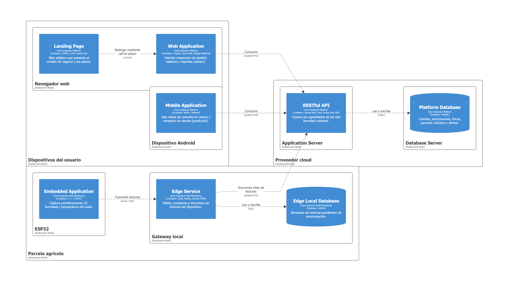

<em>Software Architecture Deployment Diagram de OsoSense.</em>

**Elementos del diagrama**

| Deployment Node | Contenedores desplegados | Notas |
|---|---|---|
| Parcela → ESP32 (microcontrolador) | Embedded Application (C++ / Arduino Framework) | Opera con conectividad intermitente. |
| Parcela → Gateway local (Raspberry Pi / PC) | Edge Service (Flask/Python) + Edge Local Database (SQLite) | Compensa y bufferiza hasta sincronizar. |
| Navegador web | Landing Page (HTML/CSS/JS) + Web Application (Angular SPA) | Descargados desde el hosting cloud. |
| Dispositivo Android | Mobile Application (Kotlin APK) | Cliente de campo del productor. |
| Cloud → Static Hosting | Landing Page (archivos estáticos) | Publicación desacoplada. |
| Cloud → Web Hosting | Web Application (build de producción) | — |
| Cloud → Application Server (JVM) | RESTful API (Spring Boot JAR) | Backend de negocio. |
| Cloud → Database Server | Platform Database (MySQL) | Persistencia canónica. |

**Decisiones reflejadas en el diagrama**

- La parte de campo (ESP32 + gateway local) se despliega **fuera de la nube**, junto a la parcela, para tolerar cortes de conectividad; la plataforma se despliega **en la nube**.
- El Landing Page y la Web App se sirven como contenido estático/compilado desde la nube y se ejecutan en el navegador del usuario, separados del servidor de aplicaciones que ejecuta el API sobre la JVM.
- La base de datos MySQL se despliega en un servidor dedicado, accesible únicamente desde el servidor de aplicaciones.

## 4.2. Tactical-Level Domain-Driven Design

Definidos los límites y las relaciones entre contextos en la sección anterior, esta sección desciende al interior de cada uno de los seis bounded contexts identificados: Identity and Access Management, Subscription and Billing, Farm Management, Soil Monitoring, Salinity Alerting y Analytics and Reporting.

Cada contexto se documenta con la misma estructura, derivada de la arquitectura por capas propuesta por el Domain-Driven Design. La **capa de dominio** concentra las reglas de negocio y el modelo conceptual —aggregate roots, entidades, value objects, enumeraciones y domain services— sin dependencia alguna de infraestructura. La **capa de interfaz** expone las capacidades del contexto hacia el exterior mediante controladores REST y transformadores de recursos. La **capa de aplicación** orquesta los casos de uso coordinando el dominio con los servicios de infraestructura, sin contener reglas de negocio propias. La **capa de infraestructura** implementa la persistencia y la integración con sistemas externos mediante repositorios y adaptadores.

A esa descripción por capas se suman, en cada contexto, el **Component Level Diagram**, que corresponde al tercer nivel del modelo C4 y muestra los componentes internos del contexto y sus dependencias, y los **Code Level Diagrams**, que descienden al cuarto nivel con el diagrama de clases de la capa de dominio y el diseño de la base de datos.

La uniformidad de esta estructura es deliberada: permite comparar contextos entre sí y facilita que distintos integrantes del equipo trabajen en paralelo sobre contextos diferentes manteniendo la coherencia del documento.

### 4.2.1. Bounded Context: Identity and Access Management

Este contexto es responsable de la identidad de los usuarios, su autenticación y las vinculaciones de supervisión entre asesores y productores.

#### 4.2.1.1. Domain Layer

La capa de dominio de IAM contiene las reglas fundamentales de negocio independientes de cualquier infraestructura: garantiza la unicidad del correo, la validez del rol y la integridad de las credenciales, así como el ciclo de consentimiento y revocación de las vinculaciones asesor-productor.

| Clase | Categoría | Propósito |
|---|---|---|
| `UserAccount` | Aggregate Root | Representa la cuenta de un usuario de la plataforma. Es la raíz de consistencia de la identidad. |
| `EmailAddress` | Value Object | Encapsula una dirección de correo electrónico validada. Su construcción falla si el formato es inválido. |
| `PasswordHash` | Value Object | Encapsula el resultado del hasheo de una contraseña junto con su algoritmo. Nunca expone el valor en claro. |
| `PersonName` | Value Object | Agrupa nombres y apellidos como una unidad conceptual. |
| `UserRole` | Enumeration | Define los roles admisibles: `FARMER` y `ADVISOR`. |
| `AdvisoryLink` | Aggregate Root | Representa la vinculación autorizada entre un asesor y un productor. Es raíz independiente porque su ciclo de vida y sus reglas de consentimiento y revocación son autónomos respecto de las cuentas. |
| `LinkStatus` | Enumeration | Define los estados de una vinculación: `PENDING`, `ACCEPTED` y `REVOKED`. |
| `ProfessionalLicense` | Value Object | Encapsula el número de colegiatura del asesor técnico. |
| `GoogleAccountId` | Value Object | Encapsula el identificador (`sub`) de la cuenta de Google vinculada, cuando el usuario opta por el inicio de sesión federado. |
| `UserAccountRepository` | Repository (interfaz) | Abstracción de persistencia del agregado `UserAccount`. |
| `AdvisoryLinkRepository` | Repository (interfaz) | Abstracción de persistencia del agregado `AdvisoryLink`. |
| `PasswordHashingService` | Domain Service (interfaz) | Abstrae la política de hasheo de contraseñas, manteniendo el algoritmo fuera del dominio. |
| `GoogleTokenVerifier` | Domain Service (interfaz) | Abstrae la verificación criptográfica del ID Token emitido por Google, manteniendo el proveedor de identidad fuera del dominio. |
| `UserRegisteredEvent` | Domain Event | Se publica al crearse una cuenta, ya sea por registro local o por primer inicio de sesión con Google. |
| `AdvisoryLinkAcceptedEvent` | Domain Event | Se publica cuando el productor acepta la vinculación. |
| `AdvisoryLinkRevokedEvent` | Domain Event | Se publica cuando el productor revoca la vinculación. |

**Entities y Aggregates:** `UserAccount` actúa como raíz de agregado de la identidad, controlando el registro local (`register()`), el registro o inicio de sesión federado (`registerWithGoogle()`, `linkGoogleAccount()`), la verificación de credenciales (`verifyPassword()`), el cambio de contraseña y la desactivación de la cuenta. Una cuenta puede autenticarse por credencial local, por Google, o por ambos métodos simultáneamente (`hasPassword()` y `hasGoogleAccountLinked()` son mutuamente independientes). `AdvisoryLink` administra el ciclo `PENDING → ACCEPTED/REVOKED` mediante `request()`, `accept()` y `revoke()`, publicando el evento correspondiente en cada transición.

**Value Objects:** `EmailAddress`, `PasswordHash`, `PersonName`, `ProfessionalLicense` y `GoogleAccountId` encapsulan las restricciones estructurales de cada dato, evitando que exista una instancia inválida en el sistema. `PasswordHash` es opcional en `UserAccount`: una cuenta creada exclusivamente vía Google no posee credencial local hasta que el usuario decida establecer una.

**Ports (Interfaces):** `UserAccountRepository`, `AdvisoryLinkRepository`, `PasswordHashingService` y `GoogleTokenVerifier` definen las operaciones lógicas de almacenamiento, hasheo y verificación de identidad federada sin depender de tecnologías específicas como JPA, BCrypt o el SDK de Google.

**Diccionario de clases**

A continuación se documenta cada clase de la capa de dominio a manera de diccionario, con sus atributos, sus métodos y la visibilidad de cada miembro, tal como aparecen en el diagrama de clases de la sección 4.2.1.6.1.

**`UserAccount`** (Aggregate Root)

| Miembro | Tipo | Visibilidad | Descripción |
|---|---|---|---|
| `id` | `UserAccountId` | private | Atributo: Identificador único de la cuenta. |
| `email` | `EmailAddress` | private | Atributo: Correo validado y único de la cuenta. |
| `passwordHash` | `PasswordHash` | private | Atributo: Credencial local hasheada. Es opcional si la cuenta solo usa Google. |
| `googleAccountId` | `GoogleAccountId` | private | Atributo: Identificador de la cuenta de Google vinculada, si existe. |
| `name` | `PersonName` | private | Atributo: Nombres y apellidos del usuario. |
| `role` | `UserRole` | private | Atributo: Rol del usuario en la plataforma. |
| `license` | `ProfessionalLicense` | private | Atributo: Número de colegiatura, solo para asesores. |
| `isActive` | `boolean` | private | Atributo: Indica si la cuenta está habilitada. |
| `createdAt` | `LocalDateTime` | private | Atributo: Fecha y hora de creación. |
| `register(EmailAddress, PasswordHash, PersonName, UserRole)` | `UserAccount` | public static | Método: Crea una cuenta con credencial local. |
| `registerWithGoogle(EmailAddress, PersonName, UserRole, GoogleAccountId)` | `UserAccount` | public static | Método: Crea una cuenta a partir de una identidad de Google. |
| `linkGoogleAccount(GoogleAccountId)` | `void` | public | Método: Vincula una cuenta de Google a la cuenta existente. |
| `verifyPassword(String, PasswordHashingService)` | `boolean` | public | Método: Comprueba una contraseña contra la credencial almacenada. |
| `changePassword(PasswordHash)` | `void` | public | Método: Reemplaza la credencial local. |
| `hasPassword()` | `boolean` | public | Método: Indica si la cuenta tiene credencial local. |
| `hasGoogleAccountLinked()` | `boolean` | public | Método: Indica si la cuenta tiene Google vinculado. |
| `isAdvisor()` | `boolean` | public | Método: Indica si el rol es de asesor. |
| `deactivate()` | `void` | public | Método: Deshabilita la cuenta. |

**`AdvisoryLink`** (Aggregate Root)

| Miembro | Tipo | Visibilidad | Descripción |
|---|---|---|---|
| `id` | `AdvisoryLinkId` | private | Atributo: Identificador de la vinculación. |
| `advisorId` | `UserAccountId` | private | Atributo: Cuenta del asesor. |
| `farmerId` | `UserAccountId` | private | Atributo: Cuenta del productor. |
| `status` | `LinkStatus` | private | Atributo: Estado actual de la vinculación. |
| `requestedAt` | `LocalDateTime` | private | Atributo: Fecha de la solicitud. |
| `respondedAt` | `LocalDateTime` | private | Atributo: Fecha de aceptación o revocación. |
| `request(UserAccountId, UserAccountId)` | `AdvisoryLink` | public static | Método: Crea una solicitud en estado PENDING. |
| `accept()` | `void` | public | Método: Cambia el estado a ACCEPTED y publica AdvisoryLinkAcceptedEvent. |
| `revoke()` | `void` | public | Método: Cambia el estado a REVOKED y publica AdvisoryLinkRevokedEvent. |
| `isActive()` | `boolean` | public | Método: Indica si la vinculación está aceptada. |

**`EmailAddress`** (Value Object)

| Miembro | Tipo | Visibilidad | Descripción |
|---|---|---|---|
| `value` | `String` | private | Atributo: Correo con formato validado. |
| `getValue()` | `String` | public | Método: Devuelve el correo. |

**`PasswordHash`** (Value Object)

| Miembro | Tipo | Visibilidad | Descripción |
|---|---|---|---|
| `value` | `String` | private | Atributo: Resultado del hasheo. |
| `algorithm` | `String` | private | Atributo: Algoritmo usado, por ejemplo BCrypt. |

**`PersonName`** (Value Object)

| Miembro | Tipo | Visibilidad | Descripción |
|---|---|---|---|
| `firstName` | `String` | private | Atributo: Nombres. |
| `lastName` | `String` | private | Atributo: Apellidos. |
| `getFullName()` | `String` | public | Método: Devuelve el nombre completo. |

**`ProfessionalLicense`** (Value Object)

| Miembro | Tipo | Visibilidad | Descripción |
|---|---|---|---|
| `number` | `String` | private | Atributo: Número de colegiatura. |
| `getNumber()` | `String` | public | Método: Devuelve el número. |

**`GoogleAccountId`** (Value Object)

| Miembro | Tipo | Visibilidad | Descripción |
|---|---|---|---|
| `value` | `String` | private | Atributo: Identificador sub de Google. |
| `getValue()` | `String` | public | Método: Devuelve el identificador. |

**`VerifiedGoogleIdentity`** (Value Object)

| Miembro | Tipo | Visibilidad | Descripción |
|---|---|---|---|
| `email` | `EmailAddress` | private | Atributo: Correo verificado por Google. |
| `googleAccountId` | `GoogleAccountId` | private | Atributo: Identificador de la cuenta. |
| `fullName` | `String` | private | Atributo: Nombre informado por Google. |

**`UserRole`** (Enumeration)

| Valor | Descripción |
|---|---|
| `FARMER` | Productor agropecuario. |
| `ADVISOR` | Asesor técnico. |

**`LinkStatus`** (Enumeration)

| Valor | Descripción |
|---|---|
| `PENDING` | Solicitud enviada. |
| `ACCEPTED` | Vinculación activa. |
| `REVOKED` | Vinculación retirada. |

**`UserAccountRepository`** (Repository (interfaz))

| Miembro | Tipo | Visibilidad | Descripción |
|---|---|---|---|
| `save(UserAccount)` | `UserAccount` | public | Método: Guarda la cuenta. |
| `findById(UserAccountId)` | `Optional<UserAccount>` | public | Método: Busca por identificador. |
| `findByEmail(EmailAddress)` | `Optional<UserAccount>` | public | Método: Busca por correo. |
| `existsByEmail(EmailAddress)` | `boolean` | public | Método: Verifica la unicidad del correo. |

**`AdvisoryLinkRepository`** (Repository (interfaz))

| Miembro | Tipo | Visibilidad | Descripción |
|---|---|---|---|
| `save(AdvisoryLink)` | `AdvisoryLink` | public | Método: Guarda la vinculación. |
| `findById(AdvisoryLinkId)` | `Optional<AdvisoryLink>` | public | Método: Busca por identificador. |
| `findActiveByFarmerId(UserAccountId)` | `List<AdvisoryLink>` | public | Método: Lista las vinculaciones activas de un productor. |
| `findActiveByAdvisorId(UserAccountId)` | `List<AdvisoryLink>` | public | Método: Lista las vinculaciones activas de un asesor. |

**`PasswordHashingService`** (Domain Service (interfaz))

| Miembro | Tipo | Visibilidad | Descripción |
|---|---|---|---|
| `hash(String)` | `PasswordHash` | public | Método: Genera el hash de una contraseña. |
| `matches(String, PasswordHash)` | `boolean` | public | Método: Compara una contraseña con su hash. |

**`GoogleTokenVerifier`** (Domain Service (interfaz))

| Miembro | Tipo | Visibilidad | Descripción |
|---|---|---|---|
| `verify(String)` | `VerifiedGoogleIdentity` | public | Método: Valida el ID Token y devuelve la identidad verificada. |

**Relaciones entre clases**

| Origen | Relación | Destino | Multiplicidad | Descripción |
|---|---|---|---|---|
| `UserAccount` | Composición | `EmailAddress, PersonName` | 1 a 1 | Cada cuenta contiene su correo y su nombre. |
| `UserAccount` | Composición | `PasswordHash, ProfessionalLicense, GoogleAccountId` | 1 a 0..1 | Datos opcionales según el método de acceso y el rol. |
| `UserAccount` | Asociación | `UserRole` | 1 a 1 | Cada cuenta tiene un rol. |
| `AdvisoryLink` | Asociación (advisor, farmer) | `UserAccount` | 0..* a 1 | Una cuenta puede participar en varias vinculaciones como asesor o productor. |
| `AdvisoryLink` | Asociación | `LinkStatus` | 1 a 1 | Cada vinculación tiene un estado. |
| `UserAccountRepository / AdvisoryLinkRepository` | Dependencia (persiste) | `UserAccount / AdvisoryLink` | No aplica | Persisten cada agregado. |
| `UserAccount` | Dependencia (usa) | `PasswordHashingService` | No aplica | Verifica la contraseña mediante el servicio. |
| `GoogleTokenVerifier` | Dependencia (produce) | `VerifiedGoogleIdentity` | No aplica | Devuelve la identidad verificada. |

#### 4.2.1.2. Interface Layer

La capa de interfaz expone las API REST del contexto acotado, traduciendo las peticiones JSON HTTP externas en comandos de aplicación fuertemente tipados, y consume los eventos de suscripción publicados por Subscription and Billing.

| Clase | Categoría | Propósito |
|---|---|---|
| `AuthenticationController` | REST Controller | Expone los endpoints de registro, inicio de sesión, recuperación y restablecimiento de contraseña. |
| `GoogleOAuthController` | REST Controller | Expone el inicio de sesión federado: recibe el ID Token emitido por Google y lo verifica para autenticar o registrar al usuario. |
| `UserAccountController` | REST Controller | Expone la consulta y actualización del perfil del usuario autenticado. |
| `AdvisoryLinkController` | REST Controller | Expone la solicitud, aceptación, revocación y listado de vinculaciones. |
| `SignUpResource` / `SignInResource` | Resource (DTO) | Representan la carga de entrada del registro y la autenticación local. |
| `GoogleSignInResource` | Resource (DTO) | Carga de entrada del inicio de sesión federado: el ID Token entregado por el cliente (Web/Mobile) tras autenticarse con Google. |
| `AuthenticatedUserResource` | Resource (DTO) | Representa la respuesta de autenticación, incluyendo el token y su expiración, sin importar el método usado. |
| `UserAccountResource` / `AdvisoryLinkResource` | Resource (DTO) | Representan la cuenta y la vinculación expuestas al cliente, sin datos sensibles. |
| `UserAccountResourceAssembler` | Assembler | Traduce entre el agregado y su representación de salida. |
| `SubscriptionStatusEventConsumer` | Event Consumer | Consume `SubscriptionActivatedEvent` y `SubscriptionSuspendedEvent` publicados por Subscription and Billing. |

*   **AuthenticationController:** Expone `sign-up`, `sign-in`, solicitud y confirmación de restablecimiento de contraseña.
*   **GoogleOAuthController:** Expone `POST /auth/google` para recibir el ID Token que el cliente obtiene directamente del SDK de Google (Web/Mobile), delegando su verificación a la capa de aplicación.
*   **AdvisoryLinkController:** Expone la solicitud, aceptación y revocación de una vinculación, y el listado de vinculaciones activas por productor/asesor.
*   **UserAccountController:** Expone la consulta del perfil del usuario autenticado.

#### 4.2.1.3. Application Layer

Esta capa orquesta los casos de uso del contexto, coordinando el dominio con los repositorios y servicios de infraestructura, sin contener lógica de negocio directa.

| Clase | Categoría | Propósito |
|---|---|---|
| `RegisterUserCommandHandler` | Command Handler | Orquesta el alta de una cuenta: verifica la unicidad del correo, delega el hasheo y persiste el agregado. |
| `AuthenticateUserCommandHandler` | Command Handler | Verifica las credenciales y emite el token de acceso. |
| `AuthenticateWithGoogleCommandHandler` | Command Handler | Verifica el ID Token vía `GoogleTokenVerifier` y resuelve la cuenta: la vincula si ya existe por correo, la crea si es la primera vez, o solo emite el token si ya estaba vinculada. |
| `RequestPasswordResetCommandHandler` | Command Handler | Genera el token de restablecimiento y solicita el envío del correo. |
| `ResetPasswordCommandHandler` | Command Handler | Valida el token y reemplaza la credencial. |
| `RequestAdvisoryLinkCommandHandler` | Command Handler | Crea la solicitud de vinculación. |
| `AcceptAdvisoryLinkCommandHandler` | Command Handler | Registra la aceptación del productor. |
| `RevokeAdvisoryLinkCommandHandler` | Command Handler | Registra la revocación y dispara la propagación del evento. |
| `UserRegisteredEventHandler` | Event Handler | Reacciona a `UserRegisteredEvent` solicitando el envío del correo de bienvenida. |
| `SubscriptionActivatedEventHandler` | Event Handler | Reacciona a `SubscriptionActivatedEvent` habilitando en el token de acceso los permisos del plan contratado. |
| `SubscriptionSuspendedEventHandler` | Event Handler | Reacciona a `SubscriptionSuspendedEvent` restringiendo los permisos de la cuenta a las funciones del plan gratuito. |
| `UserAccountQueryService` | Query Service | Resuelve las consultas de cuentas y de asesores vinculados a un productor. |

#### 4.2.1.4. Infrastructure Layer

La capa de infraestructura implementa las interfaces de dominio (puertos) y provee los adaptadores concretos para persistencia, seguridad y notificación por correo.

| Clase | Categoría | Propósito |
|---|---|---|
| `JpaUserAccountRepository` | Repository Implementation | Implementa `UserAccountRepository` sobre Spring Data JPA. |
| `JpaAdvisoryLinkRepository` | Repository Implementation | Implementa `AdvisoryLinkRepository` sobre Spring Data JPA. |
| `BCryptPasswordHashingService` | Domain Service Implementation | Implementa `PasswordHashingService` mediante el algoritmo BCrypt. |
| `GoogleIdTokenVerifierAdapter` | Anti-corruption Layer | Implementa `GoogleTokenVerifier` mediante la biblioteca cliente de Google, validando la firma, el emisor y la audiencia (Client ID) del ID Token. |
| `JwtTokenService` | Infrastructure Service | Emite y valida los tokens de acceso (JWT). |
| `SmtpEmailNotificationService` | Anti-corruption Layer | Traduce las solicitudes de envío de correo al modelo del proveedor SMTP. |
| `SecurityConfiguration` | Configuration | Configura los filtros de autenticación y la política de autorización por rol. |

#### 4.2.1.5. Bounded Context Software Architecture Component Level Diagrams

Dentro del contenedor **RESTful API**, el contexto acotado de **Identity and Access Management** se organiza siguiendo el patrón de arquitectura hexagonal (Interfaces, Application, Domain e Infrastructure). El diagrama fue modelado en Structurizr DSL y renderizado como imagen para su inclusión en el informe.

<em>Component Diagram del bounded context Identity and Access Management.</em>

*   **Authentication / Google OAuth / Advisory Link Controllers:** Reciben las solicitudes HTTP/HTTPS de la Web Application y la Mobile Application, incluyendo el ID Token del inicio de sesión federado.
*   **User / Advisory Link Command Handlers y User Query Service:** Orquestan los casos de uso de identidad, invocando el modelo de dominio y los repositorios.
*   **Identity Domain Model:** Contiene `UserAccount`, `AdvisoryLink` y sus invariantes, incluyendo la vinculación opcional a una cuenta de Google.
*   **User Account Repository / Advisory Link Repository:** Adaptadores Spring Data JPA hacia la base de datos de la plataforma.
*   **JWT Token Service y Password Hashing Service:** Encapsulan la emisión de tokens y el hasheo de contraseñas.
*   **Google Token Verifier ACL:** Traduce la verificación del ID Token hacia el servicio externo de Google OAuth2.
*   **Email Notification ACL:** Traduce las solicitudes de envío de correo hacia el proveedor SMTP externo.

#### 4.2.1.6. Bounded Context Software Architecture Code Level Diagrams

El cuarto nivel del modelo C4 desciende al detalle del código. Para Identity and Access Management se presentan dos vistas complementarias: el diagrama de clases de la capa de dominio, que refleja la estructura conceptual de la cuenta de usuario y de las vinculaciones asesor-productor, y el diseño de la base de datos, que muestra cómo esa estructura se materializa en tablas relacionales.

##### 4.2.1.6.1. Bounded Context Domain Layer Class Diagrams

A continuación, el diagrama de clases unificado de la capa de dominio del contexto IAM, modelado en PlantUML y renderizado como imagen para su inclusión en el informe.

<em>Class Diagram del Domain Layer de Identity and Access Management.</em>

##### 4.2.1.6.2. Bounded Context Database Design Diagram

<em>Database Diagram del bounded context Identity and Access Management.</em>

Las tablas principales asociadas a este contexto son `USER_ACCOUNTS`, `ADVISORY_LINKS` y `PASSWORD_RESET_TOKENS`. `USER_ACCOUNTS` almacena el correo (único), el nombre, el rol (`FARMER`/`ADVISOR`) y, cuando corresponde, la colegiatura del asesor. `ADVISORY_LINKS` referencia a dos cuentas (asesor y productor) y su estado (`PENDING`, `ACCEPTED`, `REVOKED`). `PASSWORD_RESET_TOKENS` registra los tokens de restablecimiento emitidos y su vigencia.

**Soporte de inicio de sesión federado:** `USER_ACCOUNTS` incorpora las columnas `password_hash`/`hash_algorithm` como **nullables** (una cuenta creada exclusivamente vía Google no posee credencial local) y una columna `google_account_id VARCHAR(255) NULL UNIQUE` que almacena el identificador (`sub`) de la cuenta de Google vinculada, cuando aplica.

**Restricciones adicionales:** índice único compuesto sobre `(advisor_id, farmer_id)` en `ADVISORY_LINKS`, limitado a los registros con estado distinto de `REVOKED`, a fin de impedir vinculaciones activas duplicadas entre el mismo asesor y productor. `CHECK (password_hash IS NOT NULL OR google_account_id IS NOT NULL)` garantiza que toda cuenta tenga al menos un método de autenticación.

---

### 4.2.2. Bounded Context: Subscription and Billing

Este contexto gestiona los planes de suscripción, su ciclo de vida y el cumplimiento de los cupos de parcelas que cada plan habilita.

#### 4.2.2.1. Domain Layer

La capa de dominio de Subscription and Billing garantiza que exista una única suscripción activa por usuario y que el cupo de parcelas consumido nunca exceda el disponible.

| Clase | Categoría | Propósito |
|---|---|---|
| `Subscription` | Aggregate Root | Representa la suscripción de un usuario. Es la raíz que garantiza que exista una única suscripción activa por usuario y que el cupo consumido nunca exceda el disponible. |
| `SubscriptionPlan` | Entity | Representa un plan comercial con su precio, ciclo de facturación y cupo de parcelas. |
| `PlotQuota` | Value Object | Encapsula el par formado por el cupo total y el cupo consumido, junto con la lógica de disponibilidad. |
| `Money` | Value Object | Encapsula un importe monetario con su moneda, evitando operaciones entre monedas distintas. |
| `BillingCycle` | Enumeration | Define los ciclos admisibles: `MONTHLY`, `ANNUAL` y `NONE` para el plan gratuito. |
| `SubscriptionStatus` | Enumeration | Define los estados: `ACTIVE`, `PENDING_PAYMENT`, `SUSPENDED` y `CANCELLED`. |
| `BillingPeriod` | Value Object | Encapsula la fecha de inicio y fin del periodo vigente. |
| `PaymentTransaction` | Entity | Registra un intento de cobro con su resultado y su referencia externa. |
| `SubscriptionRepository` | Repository (interfaz) | Abstracción de persistencia del agregado `Subscription`. |
| `SubscriptionPlanRepository` | Repository (interfaz) | Abstracción de persistencia del catálogo de planes. |
| `PaymentGateway` | Domain Service (interfaz) | Abstrae el procesamiento del cobro, manteniendo el proveedor fuera del dominio. |
| `SubscriptionActivatedEvent` | Domain Event | Se publica al activarse la suscripción; otorga el cupo a Farm Management. |
| `SubscriptionSuspendedEvent` | Domain Event | Se publica al expirar o cancelarse; suspende la ingesta en Soil Monitoring. |

**Entities y Aggregates:** `Subscription` controla el ciclo completo mediante `subscribeToFreePlan()`, `subscribeToPaidPlan()`, `confirmPayment()`, `consumeQuota()`/`releaseQuota()`, `cancel()`, `suspend()` y `renew()`. `SubscriptionPlan` y `PaymentTransaction` son entidades internas que solo cambian a través de la raíz.

**Value Objects:** `PlotQuota` encapsula la disponibilidad de cupo (`hasAvailable()`, `consume()`, `release()`); `Money` evita operar importes de monedas distintas; `BillingPeriod` calcula vencimiento y extensión del periodo.

**Ports (Interfaces):** `SubscriptionRepository`, `SubscriptionPlanRepository` y `PaymentGateway` desacoplan la persistencia y el cobro del proveedor externo.

**Diccionario de clases**

A continuación se documenta cada clase de la capa de dominio a manera de diccionario, con sus atributos, sus métodos y la visibilidad de cada miembro, tal como aparecen en el diagrama de clases de la sección 4.2.2.6.1.

**`Subscription`** (Aggregate Root)

| Miembro | Tipo | Visibilidad | Descripción |
|---|---|---|---|
| `id` | `SubscriptionId` | private | Atributo: Identificador de la suscripción. |
| `userAccountId` | `UserAccountId` | private | Atributo: Usuario titular. |
| `status` | `SubscriptionStatus` | private | Atributo: Estado del ciclo de vida. |
| `quota` | `PlotQuota` | private | Atributo: Cupo total y consumido de parcelas. |
| `currentPeriod` | `BillingPeriod` | private | Atributo: Periodo de facturación vigente. |
| `transactions` | `List<PaymentTransaction>` | private | Atributo: Historial de cobros. |
| `subscribeToFreePlan(UserAccountId, SubscriptionPlan)` | `Subscription` | public static | Método: Crea una suscripción activa al plan gratuito. |
| `subscribeToPaidPlan(UserAccountId, SubscriptionPlan)` | `Subscription` | public static | Método: Crea una suscripción pendiente de pago. |
| `confirmPayment(PaymentTransaction)` | `void` | public | Método: Registra el cobro y activa la suscripción. |
| `consumeQuota()` | `void` | public | Método: Reserva un cupo de parcela. |
| `releaseQuota()` | `void` | public | Método: Libera un cupo de parcela. |
| `hasAvailableQuota()` | `boolean` | public | Método: Indica si queda cupo. |
| `cancel()` | `void` | public | Método: Programa la cancelación al final del periodo. |
| `suspend()` | `void` | public | Método: Suspende la suscripción vencida. |
| `renew(PaymentTransaction)` | `void` | public | Método: Extiende el periodo con un nuevo cobro. |

**`SubscriptionPlan`** (Entity)

| Miembro | Tipo | Visibilidad | Descripción |
|---|---|---|---|
| `id` | `SubscriptionPlanId` | private | Atributo: Identificador del plan. |
| `name` | `String` | private | Atributo: Nombre comercial. |
| `price` | `Money` | private | Atributo: Precio del plan. |
| `billingCycle` | `BillingCycle` | private | Atributo: Frecuencia de cobro. |
| `maxPlots` | `int` | private | Atributo: Cupo máximo de parcelas. |
| `isFree` | `boolean` | private | Atributo: Indica si es el plan gratuito. |
| `allowsPlots(int)` | `boolean` | public | Método: Indica si el plan admite un número de parcelas. |

**`PaymentTransaction`** (Entity)

| Miembro | Tipo | Visibilidad | Descripción |
|---|---|---|---|
| `id` | `PaymentTransactionId` | private | Atributo: Identificador del cobro. |
| `amount` | `Money` | private | Atributo: Importe cobrado. |
| `externalReference` | `String` | private | Atributo: Referencia del cobro en Stripe. |
| `isSuccessful` | `boolean` | private | Atributo: Resultado del cobro. |
| `processedAt` | `LocalDateTime` | private | Atributo: Fecha de procesamiento. |

**`PlotQuota`** (Value Object)

| Miembro | Tipo | Visibilidad | Descripción |
|---|---|---|---|
| `total` | `int` | private | Atributo: Cupo total del plan. |
| `consumed` | `int` | private | Atributo: Cupo usado. |
| `hasAvailable()` | `boolean` | public | Método: Indica si consumed es menor que total. |
| `consume()` | `PlotQuota` | public | Método: Devuelve un nuevo cupo con una parcela más consumida. |
| `release()` | `PlotQuota` | public | Método: Devuelve un nuevo cupo con una parcela liberada. |
| `getAvailable()` | `int` | public | Método: Devuelve el cupo restante. |

**`BillingPeriod`** (Value Object)

| Miembro | Tipo | Visibilidad | Descripción |
|---|---|---|---|
| `startDate` | `LocalDate` | private | Atributo: Inicio del periodo. |
| `endDate` | `LocalDate` | private | Atributo: Fin del periodo. |
| `isExpired(LocalDate)` | `boolean` | public | Método: Indica si el periodo venció en una fecha. |
| `extend(BillingCycle)` | `BillingPeriod` | public | Método: Devuelve el periodo siguiente. |

**`Money`** (Value Object)

| Miembro | Tipo | Visibilidad | Descripción |
|---|---|---|---|
| `amount` | `BigDecimal` | private | Atributo: Importe. |
| `currency` | `String` | private | Atributo: Moneda ISO 4217. |
| `add(Money)` | `Money` | public | Método: Suma importes de la misma moneda. |
| `isZero()` | `boolean` | public | Método: Indica si el importe es cero. |

**`BillingCycle`** (Enumeration)

| Valor | Descripción |
|---|---|
| `MONTHLY` | Cobro mensual. |
| `ANNUAL` | Cobro anual. |
| `NONE` | Sin cobro, plan gratuito. |

**`SubscriptionStatus`** (Enumeration)

| Valor | Descripción |
|---|---|
| `ACTIVE` | Suscripción vigente. |
| `PENDING_PAYMENT` | Esperando confirmación de pago. |
| `SUSPENDED` | Periodo vencido sin renovar. |
| `CANCELLED` | Cancelada por el usuario. |

**`SubscriptionRepository`** (Repository (interfaz))

| Miembro | Tipo | Visibilidad | Descripción |
|---|---|---|---|
| `save(Subscription)` | `Subscription` | public | Método: Guarda la suscripción. |
| `findById(SubscriptionId)` | `Optional<Subscription>` | public | Método: Busca por identificador. |
| `findActiveByUserAccountId(UserAccountId)` | `Optional<Subscription>` | public | Método: Busca la suscripción vigente de un usuario. |
| `findExpired(LocalDate)` | `List<Subscription>` | public | Método: Lista las suscripciones vencidas a una fecha. |

**`PaymentGateway`** (Domain Service (interfaz))

| Miembro | Tipo | Visibilidad | Descripción |
|---|---|---|---|
| `charge(Money, String)` | `PaymentTransaction` | public | Método: Solicita un cobro al proveedor. |
| `verifyCallback(String)` | `boolean` | public | Método: Valida la firma del webhook del proveedor. |

**Relaciones entre clases**

| Origen | Relación | Destino | Multiplicidad | Descripción |
|---|---|---|---|---|
| `Subscription` | Asociación | `SubscriptionPlan` | 1 a 1 | Cada suscripción corresponde a un plan. |
| `Subscription` | Composición | `PlotQuota, BillingPeriod` | 1 a 1 | La suscripción contiene su cupo y su periodo. |
| `Subscription` | Composición | `PaymentTransaction` | 1 a 0..* | La suscripción acumula sus cobros. |
| `Subscription` | Asociación | `SubscriptionStatus` | 1 a 1 | Cada suscripción tiene un estado. |
| `SubscriptionPlan / PaymentTransaction` | Composición | `Money` | 1 a 1 | Precio del plan e importe del cobro. |
| `SubscriptionPlan` | Asociación | `BillingCycle` | 1 a 1 | Cada plan tiene un ciclo de cobro. |
| `SubscriptionRepository` | Dependencia (persiste) | `Subscription` | No aplica | Persiste el agregado. |
| `Subscription` | Dependencia (cobra mediante) | `PaymentGateway` | No aplica | Delega el cobro al proveedor. |

#### 4.2.2.2. Interface Layer

La capa de interfaz expone el catálogo de planes, la gestión de la suscripción del usuario y el webhook de confirmación asíncrona de Stripe.

| Clase | Categoría | Propósito |
|---|---|---|
| `SubscriptionController` | REST Controller | Expone la selección de plan, la consulta del estado, la renovación y la cancelación. |
| `SubscriptionPlanController` | REST Controller | Expone el catálogo público de planes. |
| `PaymentWebhookController` | REST Controller | Recibe las confirmaciones asíncronas de Stripe (webhook). |
| `SubscribeResource` | Resource (DTO) | Carga de entrada de la selección de plan. |
| `SubscriptionResource` | Resource (DTO) | Representación de la suscripción expuesta al cliente. |
| `SubscriptionPlanResource` | Resource (DTO) | Representación de un plan del catálogo. |
| `UserRegisteredEventConsumer` | Event Consumer | Consume `UserRegisteredEvent` publicado por Identity and Access Management. |

*   **SubscriptionController:** Expone la contratación de plan, cancelación y renovación, y la consulta del estado vigente.
*   **SubscriptionPlanController:** Expone el catálogo público de planes (nombre, precio, ciclo y cupo de parcelas).
*   **PaymentWebhookController:** Endpoint de Open Host Service que recibe las notificaciones asíncronas de Stripe (webhook).

#### 4.2.2.3. Application Layer

Esta capa orquesta la contratación, confirmación de pago, renovación, cancelación y consumo/liberación de cupo, distinguiendo el flujo gratuito del de pago.

| Clase | Categoría | Propósito |
|---|---|---|
| `SubscribeToPlanCommandHandler` | Command Handler | Orquesta la contratación de un plan, distinguiendo el flujo gratuito del de pago. |
| `ConfirmPaymentCommandHandler` | Command Handler | Procesa la confirmación de Stripe y activa la suscripción. |
| `CancelSubscriptionCommandHandler` | Command Handler | Registra la cancelación programada. |
| `RenewSubscriptionCommandHandler` | Command Handler | Ejecuta la renovación del periodo. |
| `ConsumeQuotaCommandHandler` | Command Handler | Reserva un cupo de parcela a solicitud de Farm Management. |
| `ReleaseQuotaCommandHandler` | Command Handler | Libera un cupo al darse de baja una parcela. |
| `SubscriptionExpirationEventHandler` | Event Handler | Reacciona al vencimiento del periodo suspendiendo la suscripción. |
| `UserRegisteredEventHandler` | Event Handler | Reacciona a `UserRegisteredEvent` aplicando el plan preseleccionado en el Landing Page o dejando la cuenta lista para elegir un plan. |
| `SubscriptionQueryService` | Query Service | Resuelve las consultas de estado y de catálogo de planes. |

#### 4.2.2.4. Infrastructure Layer

La capa de infraestructura implementa la persistencia del catálogo y las suscripciones, la traducción hacia Stripe y la tarea programada de expiración.

| Clase | Categoría | Propósito |
|---|---|---|
| `JpaSubscriptionRepository` | Repository Implementation | Implementa `SubscriptionRepository` sobre Spring Data JPA. |
| `JpaSubscriptionPlanRepository` | Repository Implementation | Implementa `SubscriptionPlanRepository` sobre Spring Data JPA. |
| `StripePaymentGatewayAdapter` | Anti-corruption Layer | Implementa `PaymentGateway` traduciendo entre el modelo del dominio y el de Stripe. |
| `SubscriptionExpirationScheduler` | Scheduled Job | Evalúa periódicamente las suscripciones vencidas y dispara su suspensión. |

#### 4.2.2.5. Bounded Context Software Architecture Component Level Diagrams

Dentro del contenedor **RESTful API**, el contexto acotado de **Subscription and Billing** organiza sus responsabilidades en las cuatro capas tácticas, comunicándose con Farm Management (verificación y consumo de cupo) y con Soil Monitoring (suspensión de ingesta) mediante eventos de dominio.

<em>Component Diagram del bounded context Subscription and Billing.</em>

*   **Subscription / Subscription Plan / Payment Webhook Controllers:** Reciben las solicitudes de la Web Application y las confirmaciones de Stripe.
*   **Subscription Command Handlers y Quota Command Handlers:** Orquestan la contratación, pago, renovación, cancelación y el consumo/liberación de cupo.
*   **Billing Domain Model:** Contiene `Subscription`, `PlotQuota` y `SubscriptionPlan` con sus invariantes.
*   **Subscription Repository:** Adaptador Spring Data JPA hacia la base de datos de la plataforma.
*   **Stripe Payment Gateway ACL:** Traduce el cobro hacia Stripe.
*   **Expiration Scheduler:** Evalúa periódicamente los periodos vencidos y dispara la suspensión, propagando `SubscriptionSuspendedEvent` hacia Soil Monitoring.

#### 4.2.2.6. Bounded Context Software Architecture Code Level Diagrams

Para Subscription and Billing se presentan dos vistas del nivel de código: el diagrama de clases de la capa de dominio, centrado en la suscripción como raíz de consistencia del cupo de parcelas, y el diseño de la base de datos, que refleja la persistencia de planes, suscripciones y registros de facturación.

##### 4.2.2.6.1. Bounded Context Domain Layer Class Diagrams

A continuación, el diagrama de clases unificado de la capa de dominio del contexto Subscription and Billing.

<em>Class Diagram del Domain Layer de Subscription and Billing.</em>

##### 4.2.2.6.2. Bounded Context Database Design Diagram

<em>Database Diagram del bounded context Subscription and Billing.</em>

Las tablas principales asociadas a este contexto son `SUBSCRIPTION_PLANS` (catálogo de planes con precio, ciclo de facturación y cupo máximo de parcelas), `SUBSCRIPTIONS` (suscripción vigente de cada usuario, con su cupo total/consumido y periodo de facturación) y `PAYMENT_TRANSACTIONS` (historial de cobros asociados a cada suscripción, con su referencia externa).

**Restricciones adicionales:** `CHECK (quota_consumed <= quota_total)` a nivel de tabla en `SUBSCRIPTIONS`, y un índice único parcial sobre `user_account_id` restringido a los registros con estado `ACTIVE` o `PENDING_PAYMENT`, garantizando una única suscripción vigente por usuario.

---

### 4.2.3. Bounded Context: Farm Management

Este contexto mantiene la estructura agronómica de la solución y provee a los demás contextos el marco de referencia que permite contextualizar cada medición.

#### 4.2.3.1. Domain Layer

La capa de dominio de Farm Management modela la jerarquía finca-parcela, el catálogo de cultivos con su umbral de salinidad y el ciclo de vida de los dispositivos IoT.

| Clase | Categoría | Propósito |
|---|---|---|
| `Farm` | Aggregate Root | Representa la finca conducida por un productor. Es raíz de consistencia de las parcelas que agrupa. |
| `Plot` | Entity | Representa una parcela dentro de una finca, con su superficie, ubicación y cultivo asignado. Es la unidad mínima de monitoreo. |
| `Crop` | Aggregate Root | Representa un cultivo del catálogo con su umbral de salinidad y su clase de tolerancia. Es raíz independiente porque el catálogo se administra centralmente. |
| `Device` | Aggregate Root | Representa un dispositivo IoT con su código de activación, su estado operativo y su vinculación a una parcela. |
| `SalinityThreshold` | Value Object | Encapsula el umbral de conductividad eléctrica de un cultivo en dS/m, con la validación de que sea positivo. |
| `SaltToleranceClass` | Enumeration | Clasifica el cultivo como `SENSITIVE`, `MODERATELY_SENSITIVE`, `MODERATELY_TOLERANT` o `TOLERANT`. |
| `PlotArea` | Value Object | Encapsula la superficie en hectáreas, validando que sea mayor a cero. |
| `GeoLocation` | Value Object | Encapsula latitud y longitud, validando sus rangos admisibles. |
| `Address` | Value Object | Agrupa departamento, provincia y distrito. |
| `DeviceActivationCode` | Value Object | Encapsula el código de activación del dispositivo. |
| `DeviceStatus` | Enumeration | Define los estados: `UNASSIGNED`, `ACTIVE`, `OFFLINE` e `INACTIVE`. |
| `FarmRepository` / `CropRepository` / `DeviceRepository` | Repository (interfaz) | Abstracción de persistencia de cada agregado. |
| `PlotRegistrationService` | Domain Service | Coordina el registro de una parcela verificando el cupo de la suscripción, operación que involucra a dos agregados de contextos distintos. |
| `DeviceInstalledInPlotEvent` | Domain Event | Se publica al vincularse un dispositivo; activa el monitoreo en Soil Monitoring. |
| `CropAssignedToPlotEvent` | Domain Event | Se publica al asignarse un cultivo; establece el umbral aplicable en Salinity Alerting. |

**Entities y Aggregates:** `Farm` controla el alta/baja de parcelas (`addPlot()`, `removePlot()`) impidiendo remover una con dispositivo activo. `Plot` administra la asignación de cultivo y la vinculación/desvinculación de dispositivo (`assignCrop()`, `attachDevice()`, `detachDevice()`). `Crop` expone `exceedsThreshold(double)` para evaluar si una conductividad supera su tolerancia. `Device` gestiona su ciclo de vida completo: `register()`, `attachToPlot()`, `detach()`, `markOffline()`, `recordHeartbeat()` y `applyCalibration()`.

**Value Objects:** `SalinityThreshold`, `PlotArea`, `GeoLocation`, `Address` y `DeviceActivationCode` encapsulan validaciones estructurales propias de cada dato agronómico o geográfico.

**Domain Service:** `PlotRegistrationService` es el único punto donde el dominio de Farm Management coordina con el cupo de Subscription and Billing antes de crear una parcela.

**Diccionario de clases**

A continuación se documenta cada clase de la capa de dominio a manera de diccionario, con sus atributos, sus métodos y la visibilidad de cada miembro, tal como aparecen en el diagrama de clases de la sección 4.2.3.6.1.

**`Farm`** (Aggregate Root)

| Miembro | Tipo | Visibilidad | Descripción |
|---|---|---|---|
| `id` | `FarmId` | private | Atributo: Identificador de la finca. |
| `ownerId` | `UserAccountId` | private | Atributo: Productor propietario. |
| `name` | `String` | private | Atributo: Nombre de la finca. |
| `address` | `Address` | private | Atributo: Ubicación administrativa. |
| `plots` | `List<Plot>` | private | Atributo: Parcelas de la finca. |
| `register(UserAccountId, String, Address)` | `Farm` | public static | Método: Crea una finca para un productor. |
| `addPlot(String, PlotArea, GeoLocation)` | `Plot` | public | Método: Agrega una parcela a la finca. |
| `removePlot(PlotId)` | `void` | public | Método: Retira una parcela sin dispositivo activo. |
| `findPlot(PlotId)` | `Optional<Plot>` | public | Método: Busca una parcela de la finca. |
| `getPlotCount()` | `int` | public | Método: Devuelve el número de parcelas. |

**`Plot`** (Entity)

| Miembro | Tipo | Visibilidad | Descripción |
|---|---|---|---|
| `id` | `PlotId` | private | Atributo: Identificador de la parcela. |
| `name` | `String` | private | Atributo: Nombre de la parcela. |
| `area` | `PlotArea` | private | Atributo: Superficie en hectáreas. |
| `location` | `GeoLocation` | private | Atributo: Coordenadas de la parcela. |
| `cropId` | `CropId` | private | Atributo: Cultivo asignado. |
| `deviceId` | `DeviceId` | private | Atributo: Dispositivo vinculado. |
| `isActive` | `boolean` | private | Atributo: Indica si la parcela está activa. |
| `assignCrop(CropId)` | `void` | public | Método: Asigna el cultivo y publica CropAssignedToPlotEvent. |
| `attachDevice(DeviceId)` | `void` | public | Método: Vincula un dispositivo. |
| `detachDevice()` | `void` | public | Método: Desvincula el dispositivo. |
| `hasCropAssigned()` | `boolean` | public | Método: Indica si tiene cultivo. |
| `deactivate()` | `void` | public | Método: Da de baja la parcela. |

**`Crop`** (Aggregate Root)

| Miembro | Tipo | Visibilidad | Descripción |
|---|---|---|---|
| `id` | `CropId` | private | Atributo: Identificador del cultivo. |
| `commonName` | `String` | private | Atributo: Nombre común. |
| `scientificName` | `String` | private | Atributo: Nombre científico. |
| `threshold` | `SalinityThreshold` | private | Atributo: Umbral de salinidad tolerado. |
| `toleranceClass` | `SaltToleranceClass` | private | Atributo: Clase de tolerancia a sales. |
| `exceedsThreshold(double)` | `boolean` | public | Método: Indica si una conductividad supera el umbral. |
| `getThresholdValue()` | `double` | public | Método: Devuelve el umbral en dS/m. |

**`Device`** (Aggregate Root)

| Miembro | Tipo | Visibilidad | Descripción |
|---|---|---|---|
| `id` | `DeviceId` | private | Atributo: Identificador del dispositivo. |
| `activationCode` | `DeviceActivationCode` | private | Atributo: Código de activación. |
| `plotId` | `PlotId` | private | Atributo: Parcela vinculada. |
| `status` | `DeviceStatus` | private | Atributo: Estado operativo. |
| `calibrationFactor` | `double` | private | Atributo: Factor de corrección vigente. |
| `lastSeenAt` | `LocalDateTime` | private | Atributo: Última comunicación recibida. |
| `register(DeviceActivationCode)` | `Device` | public static | Método: Da de alta un dispositivo sin asignar. |
| `attachToPlot(PlotId)` | `void` | public | Método: Vincula el dispositivo y lo activa. |
| `detach()` | `void` | public | Método: Desvincula el dispositivo. |
| `markOffline()` | `void` | public | Método: Marca el dispositivo como fuera de línea. |
| `recordHeartbeat(LocalDateTime)` | `void` | public | Método: Actualiza la última comunicación. |
| `applyCalibration(double)` | `void` | public | Método: Actualiza el factor de corrección. |

**`SalinityThreshold`** (Value Object)

| Miembro | Tipo | Visibilidad | Descripción |
|---|---|---|---|
| `valueInDeciSiemensPerMeter` | `double` | private | Atributo: Umbral en dS/m, mayor a cero. |
| `isExceededBy(double)` | `boolean` | public | Método: Indica si un valor supera el umbral. |
| `getValue()` | `double` | public | Método: Devuelve el umbral. |

**`PlotArea`** (Value Object)

| Miembro | Tipo | Visibilidad | Descripción |
|---|---|---|---|
| `hectares` | `BigDecimal` | private | Atributo: Superficie mayor a cero. |
| `getHectares()` | `BigDecimal` | public | Método: Devuelve la superficie. |

**`GeoLocation`** (Value Object)

| Miembro | Tipo | Visibilidad | Descripción |
|---|---|---|---|
| `latitude` | `double` | private | Atributo: Latitud entre -90 y 90. |
| `longitude` | `double` | private | Atributo: Longitud entre -180 y 180. |
| `getLatitude()` | `double` | public | Método: Devuelve la latitud. |
| `getLongitude()` | `double` | public | Método: Devuelve la longitud. |

**`Address`** (Value Object)

| Miembro | Tipo | Visibilidad | Descripción |
|---|---|---|---|
| `department` | `String` | private | Atributo: Departamento. |
| `province` | `String` | private | Atributo: Provincia. |
| `district` | `String` | private | Atributo: Distrito. |
| `getFullAddress()` | `String` | public | Método: Devuelve la dirección completa. |

**`DeviceActivationCode`** (Value Object)

| Miembro | Tipo | Visibilidad | Descripción |
|---|---|---|---|
| `code` | `String` | private | Atributo: Código impreso en el dispositivo. |
| `getCode()` | `String` | public | Método: Devuelve el código. |

**`SaltToleranceClass`** (Enumeration)

| Valor | Descripción |
|---|---|
| `SENSITIVE` | Cultivo sensible. |
| `MODERATELY_SENSITIVE` | Moderadamente sensible. |
| `MODERATELY_TOLERANT` | Moderadamente tolerante. |
| `TOLERANT` | Tolerante. |

**`DeviceStatus`** (Enumeration)

| Valor | Descripción |
|---|---|
| `UNASSIGNED` | Registrado sin parcela. |
| `ACTIVE` | Enviando lecturas. |
| `OFFLINE` | Sin lecturas recientes. |
| `INACTIVE` | Dado de baja. |

**`FarmRepository`** (Repository (interfaz))

| Miembro | Tipo | Visibilidad | Descripción |
|---|---|---|---|
| `save(Farm)` | `Farm` | public | Método: Guarda la finca. |
| `findById(FarmId)` | `Optional<Farm>` | public | Método: Busca por identificador. |
| `findByOwnerId(UserAccountId)` | `List<Farm>` | public | Método: Lista las fincas de un productor. |

**`CropRepository`** (Repository (interfaz))

| Miembro | Tipo | Visibilidad | Descripción |
|---|---|---|---|
| `findById(CropId)` | `Optional<Crop>` | public | Método: Busca un cultivo. |
| `findAll()` | `List<Crop>` | public | Método: Lista el catálogo. |

**`DeviceRepository`** (Repository (interfaz))

| Miembro | Tipo | Visibilidad | Descripción |
|---|---|---|---|
| `save(Device)` | `Device` | public | Método: Guarda el dispositivo. |
| `findByActivationCode(DeviceActivationCode)` | `Optional<Device>` | public | Método: Busca por código de activación. |
| `findStaleDevices(LocalDateTime)` | `List<Device>` | public | Método: Lista los dispositivos sin comunicación desde una fecha. |

**Relaciones entre clases**

| Origen | Relación | Destino | Multiplicidad | Descripción |
|---|---|---|---|---|
| `Farm` | Composición | `Plot` | 1 a 0..* | La finca contiene sus parcelas. |
| `Farm` | Composición | `Address` | 1 a 1 | La finca tiene una dirección. |
| `Plot` | Composición | `PlotArea, GeoLocation` | 1 a 1 | La parcela tiene superficie y ubicación. |
| `Plot` | Asociación | `Crop` | 0..* a 0..1 | Varias parcelas pueden usar un mismo cultivo. |
| `Plot` | Asociación | `Device` | 1 a 0..1 | Una parcela tiene como máximo un dispositivo. |
| `Crop` | Composición | `SalinityThreshold` | 1 a 1 | Cada cultivo tiene un umbral. |
| `Crop` | Asociación | `SaltToleranceClass` | 1 a 1 | Cada cultivo tiene una clase de tolerancia. |
| `Device` | Composición | `DeviceActivationCode` | 1 a 1 | Cada dispositivo tiene su código. |
| `Device` | Asociación | `DeviceStatus` | 1 a 1 | Cada dispositivo tiene un estado. |
| `FarmRepository / CropRepository / DeviceRepository` | Dependencia (persiste) | `Farm / Crop / Device` | No aplica | Persisten cada agregado. |

#### 4.2.3.2. Interface Layer

La capa de interfaz expone el registro y consulta de fincas, parcelas, catálogo de cultivos y dispositivos.

| Clase | Categoría | Propósito |
|---|---|---|
| `FarmController` | REST Controller | Expone el registro, consulta, actualización y baja de fincas. |
| `PlotController` | REST Controller | Expone la gestión de parcelas y la asignación de cultivo. |
| `CropController` | REST Controller | Expone la consulta del catálogo de cultivos y sus umbrales. |
| `DeviceController` | REST Controller | Expone el registro, vinculación y consulta del estado de los dispositivos. |
| `CreateFarmResource` / `CreatePlotResource` / `AssignCropResource` | Resource (DTO) | Cargas de entrada del registro de finca, parcela y asignación de cultivo. |
| `FarmResource` / `PlotResource` / `CropResource` / `DeviceResource` | Resource (DTO) | Representaciones expuestas al cliente. |
| `SubscriptionActivatedEventConsumer` | Event Consumer | Consume `SubscriptionActivatedEvent` publicado por Subscription and Billing. |
| `DeviceWentOfflineEventConsumer` | Event Consumer | Consume `DeviceWentOfflineEvent` publicado por Soil Monitoring. |

*   **FarmController / PlotController:** Registro y consulta de fincas y parcelas del productor autenticado.
*   **CropController:** Consulta del catálogo de cultivos con su umbral de tolerancia.
*   **DeviceController:** Registro de dispositivos por código de activación y vinculación a una parcela.

#### 4.2.3.3. Application Layer

Esta capa orquesta el alta de fincas, parcelas y dispositivos, verificando previamente el cupo de la suscripción y propagando los eventos de asignación de cultivo e instalación de dispositivo.

| Clase | Categoría | Propósito |
|---|---|---|
| `RegisterFarmCommandHandler` | Command Handler | Orquesta el alta de una finca. |
| `RegisterPlotCommandHandler` | Command Handler | Orquesta el alta de una parcela verificando previamente el cupo de la suscripción. |
| `AssignCropToPlotCommandHandler` | Command Handler | Registra la asignación del cultivo y propaga el evento. |
| `DeactivatePlotCommandHandler` | Command Handler | Da de baja la parcela y libera el cupo consumido. |
| `RegisterDeviceCommandHandler` | Command Handler | Da de alta un dispositivo a partir de su código de activación. |
| `AttachDeviceToPlotCommandHandler` | Command Handler | Vincula el dispositivo a la parcela y publica `DeviceInstalledInPlotEvent`. |
| `MarkDeviceOfflineEventHandler` | Event Handler | Reacciona a la ausencia de lecturas marcando el dispositivo como fuera de línea. |
| `SubscriptionActivatedEventHandler` | Event Handler | Reacciona a `SubscriptionActivatedEvent` actualizando el cupo de parcelas disponible para el productor. |
| `FarmQueryService` | Query Service | Resuelve las consultas de fincas y parcelas de un usuario. |
| `CropQueryService` | Query Service | Resuelve las consultas del catálogo y del umbral aplicable a una parcela. |

#### 4.2.3.4. Infrastructure Layer

La capa de infraestructura implementa la persistencia de fincas, cultivos y dispositivos, la carga inicial del catálogo de cultivos y la verificación de cupo hacia Subscription and Billing.

| Clase | Categoría | Propósito |
|---|---|---|
| `JpaFarmRepository` / `JpaCropRepository` / `JpaDeviceRepository` | Repository Implementation | Implementan los repositorios del dominio sobre Spring Data JPA. |
| `CropCatalogSeeder` | Data Initializer | Carga el catálogo inicial de cultivos con los umbrales de Maas y Hoffman. |
| `SubscriptionQuotaClient` | Anti-corruption Layer | Traduce las verificaciones de cupo hacia el contexto de Subscription and Billing. |

#### 4.2.3.5. Bounded Context Software Architecture Component Level Diagrams

Dentro del contenedor **RESTful API**, el contexto acotado de **Farm Management** coordina con Subscription and Billing (verificación de cupo), Soil Monitoring (activación de monitoreo) y Salinity Alerting (umbral del cultivo).

<em>Component Diagram del bounded context Farm Management.</em>

*   **Farm / Plot / Crop / Device Controllers:** Reciben las solicitudes de la Web Application y la Mobile Application.
*   **Farm Command Handlers y Device Command Handlers:** Orquestan el alta y actualización de fincas, parcelas y dispositivos.
*   **Plot Registration Service:** Domain Service que coordina con Subscription and Billing antes de registrar una parcela.
*   **Farm Domain Model:** Contiene `Farm`, `Plot`, `Crop` y `Device` con sus invariantes.
*   **Farm / Crop / Device Repository:** Adaptadores Spring Data JPA hacia la base de datos de la plataforma.
*   **Subscription Quota ACL:** Traduce la verificación de cupo hacia Subscription and Billing.
*   Los Device Command Handlers publican `DeviceInstalledInPlotEvent` hacia Soil Monitoring, y Crop Query Service provee el umbral del cultivo (`CropAssignedToPlotEvent`) a Salinity Alerting.

#### 4.2.3.6. Bounded Context Software Architecture Code Level Diagrams

Para Farm Management se presentan dos vistas del nivel de código: el diagrama de clases de la capa de dominio, que modela la jerarquía finca-parcela junto con el catálogo de cultivos y los dispositivos, y el diseño de la base de datos, que traduce esa jerarquía a un esquema relacional con sus claves foráneas y restricciones de integridad.

##### 4.2.3.6.1. Bounded Context Domain Layer Class Diagrams

A continuación, el diagrama de clases unificado de la capa de dominio del contexto Farm Management.

<em>Class Diagram del Domain Layer de Farm Management.</em>

##### 4.2.3.6.2. Bounded Context Database Design Diagram

<em>Database Diagram del bounded context Farm Management.</em>

Las tablas principales asociadas a este contexto son `FARMS` (finca y su propietario), `PLOTS` (parcela con su superficie, ubicación, cultivo y finca a la que pertenece), `CROPS` (catálogo de cultivos con su umbral de salinidad en dS/m y su clase de tolerancia) y `DEVICES` (dispositivo IoT con su código de activación y estado).

**Restricciones adicionales:** restricción `UNIQUE` sobre `devices.plot_id` para garantizar que una parcela tenga como máximo un dispositivo vinculado, e índice sobre `plots.farm_id` para optimizar la consulta de parcelas por finca. La tabla `CROPS` se inicializa con los umbrales de tolerancia de Maas y Hoffman para los cultivos predominantes de la costa peruana (arroz, maíz, uva, espárrago, algodón, cebada, trigo, papa, tomate y cebolla).

---

### 4.2.4. Bounded Context: Soil Monitoring

Este es el primero de los dos bounded contexts core. Concentra la captura, validación, compensación y persistencia de las mediciones del suelo, y es donde reside el valor diferencial de la solución. Su modelo se despliega parcialmente en el Edge Service y parcialmente en el RESTful API.

#### 4.2.4.1. Domain Layer

La capa de dominio garantiza que toda lectura persistida conserve simultáneamente su valor crudo y su valor compensado, y que su marca temporal sea coherente.

| Clase | Categoría | Propósito |
|---|---|---|
| `SoilReading` | Aggregate Root | Representa una medición completa del suelo en un instante determinado. Garantiza que toda lectura conserve su valor crudo y su valor compensado. |
| `ElectricalConductivity` | Value Object | Encapsula un valor de conductividad eléctrica en dS/m. Valida que sea no negativo y esté dentro del rango físico admisible del sensor. |
| `SoilMoisture` | Value Object | Encapsula el contenido volumétrico de agua expresado como porcentaje, validando el rango de 0 a 100. |
| `SoilTemperature` | Value Object | Encapsula la temperatura del suelo en grados Celsius, validando el rango físicamente plausible. |
| `ReadingTimestamp` | Value Object | Encapsula la marca temporal de la captura, garantizando que no sea futura. |
| `CompensationResult` | Value Object | Agrupa el valor crudo, el valor compensado y el factor aplicado, preservando la trazabilidad del cálculo. |
| `ReadingBatch` | Aggregate Root | Representa un lote de lecturas transmitido desde el Edge Service. Su ciclo de sincronización e idempotencia son autónomos respecto de cada lectura individual. |
| `SyncStatus` | Enumeration | Define los estados de sincronización: `PENDING`, `SYNCHRONIZED` y `DISCARDED`. |
| `SensorRange` | Value Object | Define los límites físicos admisibles de cada sensor, empleados en la validación. |
| `CalibrationRecord` | Aggregate Root | Registra una calibración del dispositivo contra un resultado de laboratorio, con su valor de referencia y el factor resultante. |
| `LabResult` | Value Object | Encapsula el resultado de un análisis de laboratorio: valor de conductividad, fecha de muestreo y laboratorio emisor. |
| `SoilReadingRepository` / `ReadingBatchRepository` / `CalibrationRecordRepository` | Repository (interfaz) | Abstracción de persistencia y consulta de cada agregado. |
| `ReadingValidationService` | Domain Service | Determina si una lectura se encuentra dentro del rango físico admisible del sensor. |
| `TemperatureCompensationService` | Domain Service | Aplica la compensación de la conductividad eléctrica a la temperatura de referencia de 25 °C, incorporando el efecto de la humedad. |
| `SoilReadingStoredEvent` | Domain Event | Se publica al persistirse una lectura. Es el contrato público que consume Salinity Alerting. |
| `DeviceWentOfflineEvent` | Domain Event | Se publica al detectarse la ausencia prolongada de lecturas de un dispositivo. |

**Entities y Aggregates:** `SoilReading` se crea mediante `capture()` y solo se considera evaluable tras `applyCompensation()`, que fija el valor efectivo (`getEffectiveConductivity()`) usado por Salinity Alerting. `ReadingBatch` agrupa las lecturas transmitidas por un dispositivo y confirma su procesamiento con `markSynchronized(accepted, discarded)`. `CalibrationRecord` calcula el factor de corrección (`computeFactor()`) a partir de un `LabResult`.

**Domain Service central:** `TemperatureCompensationService` implementa la regla técnica más determinante del contexto: ajusta la conductividad a 25 °C incorporando el factor de calibración del dispositivo y el efecto de la humedad, dado que una menor humedad produce lecturas artificialmente bajas.

**Diccionario de clases**

A continuación se documenta cada clase de la capa de dominio a manera de diccionario, con sus atributos, sus métodos y la visibilidad de cada miembro, tal como aparecen en el diagrama de clases de la sección 4.2.4.6.1.

**`SoilReading`** (Aggregate Root)

| Miembro | Tipo | Visibilidad | Descripción |
|---|---|---|---|
| `id` | `SoilReadingId` | private | Atributo: Identificador de la lectura. |
| `deviceId` | `DeviceId` | private | Atributo: Dispositivo que capturó la lectura. |
| `plotId` | `PlotId` | private | Atributo: Parcela medida. |
| `rawConductivity` | `ElectricalConductivity` | private | Atributo: Conductividad sin compensar. |
| `compensatedConductivity` | `ElectricalConductivity` | private | Atributo: Conductividad compensada a 25 °C. |
| `moisture` | `SoilMoisture` | private | Atributo: Humedad volumétrica. |
| `temperature` | `SoilTemperature` | private | Atributo: Temperatura del suelo. |
| `capturedAt` | `ReadingTimestamp` | private | Atributo: Momento de captura. |
| `storedAt` | `LocalDateTime` | private | Atributo: Momento de persistencia. |
| `capture(DeviceId, PlotId, ElectricalConductivity, SoilMoisture, SoilTemperature, ReadingTimestamp)` | `SoilReading` | public static | Método: Crea una lectura cruda. |
| `applyCompensation(CompensationResult)` | `void` | public | Método: Fija el valor compensado. |
| `isCompensated()` | `boolean` | public | Método: Indica si ya tiene valor compensado. |
| `getEffectiveConductivity()` | `ElectricalConductivity` | public | Método: Devuelve el valor usado para evaluar alertas. |
| `belongsToSameCaptureAs(SoilReading)` | `boolean` | public | Método: Detecta duplicados por dispositivo y marca temporal. |

**`ReadingBatch`** (Aggregate Root)

| Miembro | Tipo | Visibilidad | Descripción |
|---|---|---|---|
| `id` | `ReadingBatchId` | private | Atributo: Identificador del lote. |
| `deviceId` | `DeviceId` | private | Atributo: Dispositivo de origen. |
| `readings` | `List<SoilReading>` | private | Atributo: Lecturas del lote. |
| `status` | `SyncStatus` | private | Atributo: Estado de sincronización. |
| `submittedAt` | `LocalDateTime` | private | Atributo: Momento de envío. |
| `acceptedCount` | `int` | private | Atributo: Lecturas aceptadas. |
| `discardedCount` | `int` | private | Atributo: Lecturas descartadas. |
| `submit(DeviceId, List<SoilReading>)` | `ReadingBatch` | public static | Método: Crea un lote pendiente. |
| `markSynchronized(int, int)` | `void` | public | Método: Registra aceptadas y descartadas. |
| `isEmpty()` | `boolean` | public | Método: Indica si el lote no tiene lecturas. |

**`CalibrationRecord`** (Aggregate Root)

| Miembro | Tipo | Visibilidad | Descripción |
|---|---|---|---|
| `id` | `CalibrationRecordId` | private | Atributo: Identificador de la calibración. |
| `deviceId` | `DeviceId` | private | Atributo: Dispositivo calibrado. |
| `referenceResult` | `LabResult` | private | Atributo: Resultado de laboratorio de referencia. |
| `deviceReadingAtSampling` | `double` | private | Atributo: Lectura del dispositivo al momento del muestreo. |
| `resultingFactor` | `double` | private | Atributo: Factor de corrección calculado. |
| `registeredAt` | `LocalDateTime` | private | Atributo: Fecha de registro. |
| `register(DeviceId, LabResult, double)` | `CalibrationRecord` | public static | Método: Crea la calibración. |
| `computeFactor()` | `double` | public | Método: Calcula el factor entre laboratorio y dispositivo. |

**`ElectricalConductivity`** (Value Object)

| Miembro | Tipo | Visibilidad | Descripción |
|---|---|---|---|
| `valueInDeciSiemensPerMeter` | `double` | private | Atributo: Conductividad en dS/m, no negativa. |
| `getValue()` | `double` | public | Método: Devuelve el valor. |
| `isWithin(SensorRange)` | `boolean` | public | Método: Valida el rango del sensor. |
| `toTotalDissolvedSolids()` | `double` | public | Método: Convierte a sólidos disueltos totales. |

**`SoilMoisture`** (Value Object)

| Miembro | Tipo | Visibilidad | Descripción |
|---|---|---|---|
| `volumetricPercentage` | `double` | private | Atributo: Humedad entre 0 y 100. |
| `getValue()` | `double` | public | Método: Devuelve el valor. |
| `isWithin(SensorRange)` | `boolean` | public | Método: Valida el rango del sensor. |

**`SoilTemperature`** (Value Object)

| Miembro | Tipo | Visibilidad | Descripción |
|---|---|---|---|
| `celsius` | `double` | private | Atributo: Temperatura en °C. |
| `getValue()` | `double` | public | Método: Devuelve el valor. |
| `isWithin(SensorRange)` | `boolean` | public | Método: Valida el rango del sensor. |
| `deviationFromReference()` | `double` | public | Método: Diferencia respecto de 25 °C. |

**`ReadingTimestamp`** (Value Object)

| Miembro | Tipo | Visibilidad | Descripción |
|---|---|---|---|
| `value` | `Instant` | private | Atributo: Instante de captura. |
| `getValue()` | `Instant` | public | Método: Devuelve el instante. |
| `isFuture()` | `boolean` | public | Método: Indica si es posterior al momento actual. |

**`CompensationResult`** (Value Object)

| Miembro | Tipo | Visibilidad | Descripción |
|---|---|---|---|
| `rawValue` | `double` | private | Atributo: Valor crudo. |
| `compensatedValue` | `double` | private | Atributo: Valor compensado. |
| `appliedFactor` | `double` | private | Atributo: Factor aplicado. |
| `getCompensatedValue()` | `double` | public | Método: Devuelve el valor compensado. |
| `getAppliedFactor()` | `double` | public | Método: Devuelve el factor. |

**`SensorRange`** (Value Object)

| Miembro | Tipo | Visibilidad | Descripción |
|---|---|---|---|
| `minimum` | `double` | private | Atributo: Límite inferior. |
| `maximum` | `double` | private | Atributo: Límite superior. |
| `contains(double)` | `boolean` | public | Método: Indica si un valor está en el rango. |

**`LabResult`** (Value Object)

| Miembro | Tipo | Visibilidad | Descripción |
|---|---|---|---|
| `conductivityValue` | `double` | private | Atributo: Conductividad medida en laboratorio. |
| `samplingDate` | `LocalDate` | private | Atributo: Fecha del muestreo. |
| `laboratoryName` | `String` | private | Atributo: Laboratorio emisor. |
| `getConductivityValue()` | `double` | public | Método: Devuelve la conductividad. |

**`SyncStatus`** (Enumeration)

| Valor | Descripción |
|---|---|
| `PENDING` | Pendiente de envío. |
| `SYNCHRONIZED` | Confirmado por la plataforma. |
| `DISCARDED` | Descartado por duplicado o rango. |

**`SoilReadingRepository`** (Repository (interfaz))

| Miembro | Tipo | Visibilidad | Descripción |
|---|---|---|---|
| `save(SoilReading)` | `SoilReading` | public | Método: Guarda la lectura. |
| `findLatestByPlotId(PlotId)` | `Optional<SoilReading>` | public | Método: Devuelve la última lectura de una parcela. |
| `findSeriesByPlotIdAndRange(PlotId, Instant, Instant)` | `List<SoilReading>` | public | Método: Devuelve la serie de un rango. |
| `existsByDeviceIdAndTimestamp(DeviceId, ReadingTimestamp)` | `boolean` | public | Método: Detecta lecturas duplicadas. |

**`ReadingValidationService`** (Domain Service)

| Miembro | Tipo | Visibilidad | Descripción |
|---|---|---|---|
| `isValid(SoilReading)` | `boolean` | public | Método: Valida las tres variables contra su rango. |
| `getRangeFor(String)` | `SensorRange` | public | Método: Devuelve el rango de un sensor. |

**`TemperatureCompensationService`** (Domain Service)

| Miembro | Tipo | Visibilidad | Descripción |
|---|---|---|---|
| `REFERENCE_TEMPERATURE` | `double` | public static final | Atributo: Temperatura de referencia, 25 °C. |
| `compensate(ElectricalConductivity, SoilTemperature, SoilMoisture, double)` | `CompensationResult` | public | Método: Compensa la conductividad con temperatura, humedad y factor de calibración. |

**Relaciones entre clases**

| Origen | Relación | Destino | Multiplicidad | Descripción |
|---|---|---|---|---|
| `SoilReading` | Composición (cruda, compensada) | `ElectricalConductivity` | 1 a 1 | Cada lectura guarda ambos valores. |
| `SoilReading` | Composición | `SoilMoisture, SoilTemperature, ReadingTimestamp` | 1 a 1 | Variables y marca temporal de la lectura. |
| `ReadingBatch` | Composición | `SoilReading` | 1 a 1..* | Un lote agrupa una o más lecturas. |
| `ReadingBatch` | Asociación | `SyncStatus` | 1 a 1 | Cada lote tiene un estado. |
| `CalibrationRecord` | Composición | `LabResult` | 1 a 1 | Cada calibración usa un resultado de laboratorio. |
| `ElectricalConductivity` | Dependencia (validada contra) | `SensorRange` | No aplica | Valida el valor contra el rango. |
| `ReadingValidationService` | Dependencia (valida) | `SoilReading` | No aplica | Valida la lectura. |
| `TemperatureCompensationService` | Dependencia (calcula) | `CompensationResult` | No aplica | Produce el resultado de compensación. |
| `SoilReadingRepository` | Dependencia (persiste) | `SoilReading` | No aplica | Persiste el agregado. |

#### 4.2.4.2. Interface Layer

La capa de interfaz expone la ingesta de lotes desde el Edge Service (como Open Host Service) y la consulta de series históricas por parcela.

| Clase | Categoría | Propósito |
|---|---|---|
| `TelemetryIngestionController` | REST Controller | Expone el endpoint de ingesta de lotes de lecturas desde el Edge Service. Actúa como Open Host Service. |
| `SoilReadingController` | REST Controller | Expone la consulta de la lectura más reciente y de series históricas por parcela. |
| `CalibrationController` | REST Controller | Expone el registro y la consulta de calibraciones de un dispositivo. |
| `LabResultController` | REST Controller | Expone el registro manual de resultados de laboratorio. |
| `ReadingBatchResource` | Resource (DTO) | Carga de entrada del lote de lecturas remitido por el Edge Service. |
| `SoilReadingResource` / `ReadingSeriesResource` | Resource (DTO) | Representación de una lectura y de una serie paginada expuestas al cliente. |
| `CalibrationResource` | Resource (DTO) | Representación de una calibración registrada. |
| `IngestionAcknowledgementResource` | Resource (DTO) | Respuesta de la ingesta con el conteo de lecturas aceptadas y descartadas. |
| `TelemetryConsumer` | Message Consumer | Recibe las lecturas transmitidas por el dispositivo, dentro del Edge Service. |
| `DeviceInstalledInPlotEventConsumer` | Event Consumer | Consume `DeviceInstalledInPlotEvent` publicado por Farm Management. |
| `SubscriptionSuspendedEventConsumer` | Event Consumer | Consume `SubscriptionSuspendedEvent` publicado por Subscription and Billing. |

#### 4.2.4.3. Application Layer

Esta capa distingue explícitamente los casos de uso que se ejecutan en el Edge Service (captura y sincronización en campo) de los que se ejecutan en el RESTful API (ingesta y consulta en la nube).

| Clase | Categoría | Propósito |
|---|---|---|
| `IngestReadingBatchCommandHandler` | Command Handler | Orquesta la ingesta del lote: descarta duplicados, persiste las lecturas nuevas y publica el evento por cada una. |
| `CaptureReadingCommandHandler` | Command Handler | Se ejecuta en el Edge Service. Orquesta la validación, compensación y decisión de transmisión o buffer. |
| `SynchronizeBufferedReadingsCommandHandler` | Command Handler | Se ejecuta en el Edge Service. Transmite en orden cronológico las lecturas pendientes al restablecerse la conectividad. |
| `RegisterCalibrationCommandHandler` | Command Handler | Calcula y persiste el factor de corrección a partir del resultado de laboratorio. |
| `RegisterLabResultCommandHandler` | Command Handler | Registra el resultado de laboratorio y lo asocia a la serie de la parcela. |
| `DeviceActivationEventHandler` | Event Handler | Reacciona a `DeviceInstalledInPlotEvent` habilitando la ingesta para el dispositivo. |
| `SubscriptionSuspendedEventHandler` | Event Handler | Reacciona a `SubscriptionSuspendedEvent` suspendiendo la ingesta de las parcelas asociadas. |
| `StaleDeviceDetectionHandler` | Event Handler | Evalúa periódicamente los dispositivos sin lecturas recientes y publica `DeviceWentOfflineEvent`. |
| `SoilReadingQueryService` | Query Service | Resuelve las consultas de última lectura y de series por parcela y rango de fechas. |

#### 4.2.4.4. Infrastructure Layer

La capa de infraestructura se materializa en dos containers: el RESTful API (persistencia en la nube) y el Edge Service (persistencia local y sincronización).

| Clase | Categoría | Propósito |
|---|---|---|
| `JpaSoilReadingRepository` | Repository Implementation | Implementa `SoilReadingRepository` sobre Spring Data JPA en la plataforma cloud. |
| `PeeweeSoilReadingRepository` | Repository Implementation | Implementa la persistencia local de lecturas sobre SQLite mediante Peewee ORM, dentro del Edge Service. |
| `JpaReadingBatchRepository` / `JpaCalibrationRecordRepository` | Repository Implementation | Implementan la persistencia de lotes y calibraciones sobre Spring Data JPA. |
| `SerialSensorAdapter` | Anti-corruption Layer | Traduce las tramas entregadas por el hardware del sensor al modelo de dominio, aislando el formato del fabricante. |
| `PlatformSyncClient` | Infrastructure Service | Cliente HTTP del Edge Service que remite los lotes al endpoint de ingesta de la plataforma. |
| `ConnectivityMonitor` | Infrastructure Service | Determina en el Edge Service si existe conectividad, condicionando la transmisión o el almacenamiento en buffer. |
| `SoilReadingEventPublisher` | Event Publisher | Publica `SoilReadingStoredEvent` hacia el contexto de Salinity Alerting. |

#### 4.2.4.5. Bounded Context Software Architecture Component Level Diagrams

Soil Monitoring se despliega en dos containers, por lo que se presentan dos Component Diagrams: el del **RESTful API** (lado plataforma), que recibe los lotes ya validados y compensados, y el del **Edge Service** (lado campo), que captura, valida, compensa y sincroniza las lecturas.

**Container RESTful API**

<em>Component Diagram del bounded context Soil Monitoring (container RESTful API).</em>

*   **Telemetry Ingestion Controller:** Open Host Service que recibe los lotes del Edge Service.
*   **Ingest Batch Handler:** Descarta duplicados y persiste las lecturas nuevas.
*   **Stale Device Detection Handler:** Tarea programada que evalúa dispositivos sin lecturas recientes.
*   **Soil Reading Query Service:** Resuelve la última lectura y series históricas por parcela.
*   **Monitoring Domain Model:** Contiene `SoilReading`, `ReadingBatch` y `CalibrationRecord`.
*   **Soil Reading Event Publisher:** Publica `SoilReadingStoredEvent` hacia Salinity Alerting, y `DeviceWentOfflineEvent` hacia Farm Management. Provee series históricas a Analytics and Reporting.

**Container Edge Service**

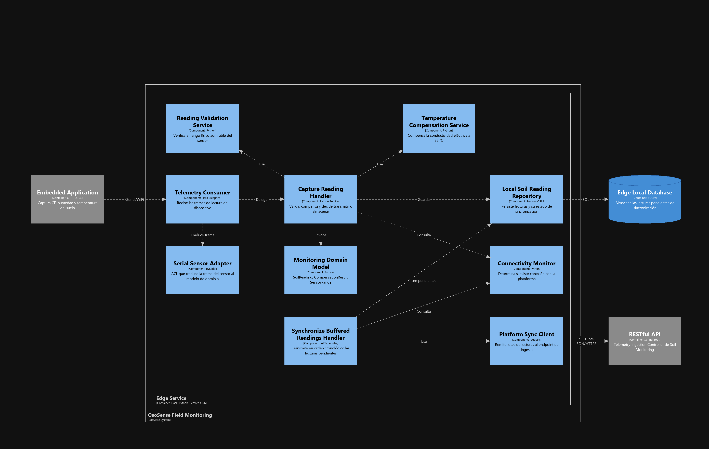

<em>Component Diagram del bounded context Soil Monitoring (container Edge Service).</em>

*   **Telemetry Consumer:** Recibe por Serial/WiFi las tramas de lectura que envía la Embedded Application.
*   **Serial Sensor Adapter:** Anti-corruption Layer que traduce la trama del fabricante del sensor al modelo de dominio.
*   **Capture Reading Handler:** Orquesta la captura: valida el rango, compensa la conductividad, guarda la lectura y decide si se transmite o queda en buffer según la conectividad.
*   **Reading Validation Service y Temperature Compensation Service:** Domain Services que descartan lecturas fuera de rango y compensan la conductividad eléctrica a 25 °C.
*   **Monitoring Domain Model:** Contiene `SoilReading`, `CompensationResult` y `SensorRange` en su versión del Edge Service.
*   **Local Soil Reading Repository:** Adaptador Peewee ORM que persiste las lecturas y su estado de sincronización en la Edge Local Database (SQLite).
*   **Connectivity Monitor:** Determina si existe conexión con la plataforma antes de transmitir.
*   **Synchronize Buffered Readings Handler y Platform Sync Client:** Tarea programada que lee las lecturas pendientes y las remite en orden cronológico al Telemetry Ingestion Controller del RESTful API.

#### 4.2.4.6. Bounded Context Software Architecture Code Level Diagrams

Para Soil Monitoring se presentan dos vistas del nivel de código: el diagrama de clases de la capa de dominio, que modela la lectura de suelo con sus tres variables medidas y su doble valor crudo y compensado, y el diseño de la base de datos, cuyo esquema está optimizado para la escritura intensiva y la consulta por rango temporal que impone una serie de mediciones.

##### 4.2.4.6.1. Bounded Context Domain Layer Class Diagrams

A continuación, el diagrama de clases unificado de la capa de dominio del contexto Soil Monitoring.

<em>Class Diagram del Domain Layer de Soil Monitoring.</em>

##### 4.2.4.6.2. Bounded Context Database Design Diagram

<em>Database Diagram del bounded context Soil Monitoring.</em>

Las tablas principales son `SOIL_READINGS` (valor crudo, compensado y factor aplicado por lectura), `READING_BATCHES` (lotes transmitidos por el Edge Service con su conteo de aceptadas/descartadas) y `CALIBRATION_RECORDS` (calibraciones de dispositivo contra resultados de laboratorio).

**Restricciones adicionales:** índice único compuesto sobre `(device_id, captured_at)` que garantiza la idempotencia de la ingesta ante reenvíos del Edge Service; índice compuesto sobre `(plot_id, captured_at)` para optimizar la consulta de series históricas, la de mayor frecuencia del sistema. Se contempla el particionamiento de `SOIL_READINGS` por rango temporal dado su crecimiento lineal. El Edge Service replica un subconjunto de `SOIL_READINGS` en SQLite con un campo `is_synchronized` adicional.

---

### 4.2.5. Bounded Context: Salinity Alerting

Este es el segundo bounded context core. Evalúa las lecturas persistidas contra el umbral del cultivo de cada parcela, genera alertas con la severidad correspondiente y registra el ciclo de atención hasta la acción correctiva.

#### 4.2.5.1. Domain Layer

La capa de dominio garantiza el ciclo completo de atención de una alerta: generación, notificación, reconocimiento y acción correctiva.

| Clase | Categoría | Propósito |
|---|---|---|
| `SalinityAlert` | Aggregate Root | Representa una alerta generada por el exceso del umbral. Es la raíz de consistencia del ciclo completo de atención. |
| `SeverityLevel` | Enumeration | Define los niveles de severidad: `WATCH`, `WARNING` y `CRITICAL`, determinados por la magnitud del exceso sobre el umbral. |
| `AlertStatus` | Enumeration | Define los estados: `OPEN`, `ACKNOWLEDGED` y `RESOLVED`. |
| `ThresholdEvaluation` | Value Object | Encapsula el resultado de comparar una lectura contra el umbral: valor observado, umbral aplicado, exceso y nivel resultante. |
| `CorrectiveAction` | Entity | Registra la intervención ejecutada en respuesta a la alerta, con su tipo y fecha. |
| `CorrectiveActionType` | Enumeration | Define los tipos admisibles: `SALT_LEACHING`, `IRRIGATION_ADJUSTMENT`, `DRAINAGE_CORRECTION`, `AMENDMENT_APPLICATION` y `OTHER`. |
| `AlertAcknowledgement` | Value Object | Registra quién reconoció la alerta y cuándo. |
| `NotificationPreference` | Aggregate Root | Representa la configuración de notificaciones de un usuario: severidad mínima y canal de entrega. |
| `NotificationChannel` | Enumeration | Define los canales: `PUSH`, `EMAIL` y `BOTH`. |
| `AlertRecipient` | Value Object | Encapsula un destinatario de la notificación con su rol respecto de la parcela. |
| `SalinityAlertRepository` / `NotificationPreferenceRepository` | Repository (interfaz) | Abstracción de persistencia y consulta de cada agregado. |
| `ThresholdEvaluationService` | Domain Service | Compara la conductividad compensada contra el umbral del cultivo y determina el nivel de severidad. |
| `NotificationDispatcher` | Domain Service (interfaz) | Abstrae el envío de notificaciones, manteniendo el proveedor fuera del dominio. |
| `AlertGeneratedEvent` | Domain Event | Se publica al generarse una alerta; desencadena la notificación. |
| `CorrectiveActionRegisteredEvent` | Domain Event | Se publica al registrarse la acción; cierra el ciclo y alimenta la analítica. |

**Entities y Aggregates:** `SalinityAlert` transita `OPEN → ACKNOWLEDGED → RESOLVED` mediante `generate()`, `acknowledge()` y `registerCorrectiveAction()`, y expone `wasResolvedWithin(hours)` para la métrica de tiempo de respuesta. `NotificationPreference` decide si notificar mediante `shouldNotify(severity)` según la severidad mínima configurada por el usuario.

**Domain Service central:** `ThresholdEvaluationService` implementa la regla de negocio central: la severidad se determina por la **proporción del exceso** sobre el umbral del cultivo, no por el valor absoluto de conductividad, ya que un mismo valor puede ser inocuo para un cultivo tolerante y destructivo para uno sensible.

**Diccionario de clases**

A continuación se documenta cada clase de la capa de dominio a manera de diccionario, con sus atributos, sus métodos y la visibilidad de cada miembro, tal como aparecen en el diagrama de clases de la sección 4.2.5.6.1.

**`SalinityAlert`** (Aggregate Root)

| Miembro | Tipo | Visibilidad | Descripción |
|---|---|---|---|
| `id` | `SalinityAlertId` | private | Atributo: Identificador de la alerta. |
| `plotId` | `PlotId` | private | Atributo: Parcela afectada. |
| `soilReadingId` | `SoilReadingId` | private | Atributo: Lectura que originó la alerta. |
| `evaluation` | `ThresholdEvaluation` | private | Atributo: Resultado de la evaluación de umbral. |
| `severity` | `SeverityLevel` | private | Atributo: Nivel de severidad. |
| `status` | `AlertStatus` | private | Atributo: Estado del ciclo de atención. |
| `acknowledgement` | `AlertAcknowledgement` | private | Atributo: Datos del reconocimiento. |
| `correctiveAction` | `CorrectiveAction` | private | Atributo: Acción que resolvió la alerta. |
| `generatedAt` | `LocalDateTime` | private | Atributo: Momento de generación. |
| `generate(PlotId, SoilReadingId, ThresholdEvaluation)` | `SalinityAlert` | public static | Método: Crea una alerta abierta y publica AlertGeneratedEvent. |
| `acknowledge(UserAccountId)` | `void` | public | Método: Registra el reconocimiento. |
| `registerCorrectiveAction(CorrectiveActionType, LocalDate, String)` | `void` | public | Método: Registra la acción y resuelve la alerta. |
| `isOpen()` | `boolean` | public | Método: Indica si sigue abierta. |
| `hasSameSeverityAs(SalinityAlert)` | `boolean` | public | Método: Compara severidades para evitar duplicados. |
| `wasResolvedWithin(int)` | `boolean` | public | Método: Indica si se resolvió dentro de un número de horas. |

**`CorrectiveAction`** (Entity)

| Miembro | Tipo | Visibilidad | Descripción |
|---|---|---|---|
| `id` | `CorrectiveActionId` | private | Atributo: Identificador de la acción. |
| `type` | `CorrectiveActionType` | private | Atributo: Tipo de intervención. |
| `executedAt` | `LocalDate` | private | Atributo: Fecha de ejecución. |
| `notes` | `String` | private | Atributo: Observaciones. |
| `registeredBy` | `UserAccountId` | private | Atributo: Usuario que la registró. |

**`NotificationPreference`** (Aggregate Root)

| Miembro | Tipo | Visibilidad | Descripción |
|---|---|---|---|
| `id` | `NotificationPreferenceId` | private | Atributo: Identificador de la preferencia. |
| `userAccountId` | `UserAccountId` | private | Atributo: Usuario dueño. |
| `minimumSeverity` | `SeverityLevel` | private | Atributo: Severidad mínima a notificar. |
| `channel` | `NotificationChannel` | private | Atributo: Canal de entrega. |
| `shouldNotify(SeverityLevel)` | `boolean` | public | Método: Indica si una severidad debe notificarse. |
| `updateChannel(NotificationChannel)` | `void` | public | Método: Cambia el canal. |

**`ThresholdEvaluation`** (Value Object)

| Miembro | Tipo | Visibilidad | Descripción |
|---|---|---|---|
| `observedConductivity` | `double` | private | Atributo: Valor observado. |
| `appliedThreshold` | `double` | private | Atributo: Umbral aplicado. |
| `excessRatio` | `double` | private | Atributo: Proporción del exceso. |
| `resultingLevel` | `SeverityLevel` | private | Atributo: Nivel resultante. |
| `isExceeded()` | `boolean` | public | Método: Indica si hubo exceso. |
| `getExcessRatio()` | `double` | public | Método: Devuelve la proporción del exceso. |

**`AlertAcknowledgement`** (Value Object)

| Miembro | Tipo | Visibilidad | Descripción |
|---|---|---|---|
| `acknowledgedBy` | `UserAccountId` | private | Atributo: Usuario que reconoció. |
| `acknowledgedAt` | `LocalDateTime` | private | Atributo: Momento del reconocimiento. |
| `getAcknowledgedAt()` | `LocalDateTime` | public | Método: Devuelve el momento. |

**`AlertRecipient`** (Value Object)

| Miembro | Tipo | Visibilidad | Descripción |
|---|---|---|---|
| `userAccountId` | `UserAccountId` | private | Atributo: Destinatario. |
| `relationToPlot` | `String` | private | Atributo: Relación con la parcela: propietario o asesor. |
| `isOwner()` | `boolean` | public | Método: Indica si es el propietario. |

**`SeverityLevel`** (Enumeration)

| Valor | Descripción |
|---|---|
| `WATCH` | Exceso leve. |
| `WARNING` | Exceso moderado. |
| `CRITICAL` | Exceso grave. |

**`AlertStatus`** (Enumeration)

| Valor | Descripción |
|---|---|
| `OPEN` | Generada. |
| `ACKNOWLEDGED` | Reconocida. |
| `RESOLVED` | Resuelta con acción. |

**`CorrectiveActionType`** (Enumeration)

| Valor | Descripción |
|---|---|
| `SALT_LEACHING` | Lavado de sales. |
| `IRRIGATION_ADJUSTMENT` | Ajuste de riego. |
| `DRAINAGE_CORRECTION` | Corrección de drenaje. |
| `AMENDMENT_APPLICATION` | Aplicación de enmienda. |
| `OTHER` | Otra intervención. |

**`NotificationChannel`** (Enumeration)

| Valor | Descripción |
|---|---|
| `PUSH` | Notificación push. |
| `EMAIL` | Correo. |
| `BOTH` | Ambos canales. |

**`SalinityAlertRepository`** (Repository (interfaz))

| Miembro | Tipo | Visibilidad | Descripción |
|---|---|---|---|
| `save(SalinityAlert)` | `SalinityAlert` | public | Método: Guarda la alerta. |
| `findById(SalinityAlertId)` | `Optional<SalinityAlert>` | public | Método: Busca por identificador. |
| `findOpenByPlotIdAndSeverity(PlotId, SeverityLevel)` | `Optional<SalinityAlert>` | public | Método: Busca una alerta abierta de la misma severidad. |
| `findByPlotIdAndRange(PlotId, LocalDate, LocalDate)` | `List<SalinityAlert>` | public | Método: Lista el histórico de alertas. |

**`ThresholdEvaluationService`** (Domain Service)

| Miembro | Tipo | Visibilidad | Descripción |
|---|---|---|---|
| `evaluate(double, double)` | `ThresholdEvaluation` | public | Método: Compara conductividad y umbral y determina la severidad. |

**`NotificationDispatcher`** (Domain Service (interfaz))

| Miembro | Tipo | Visibilidad | Descripción |
|---|---|---|---|
| `dispatch(SalinityAlert, AlertRecipient, NotificationChannel)` | `void` | public | Método: Envía la notificación por el canal indicado. |

**Relaciones entre clases**

| Origen | Relación | Destino | Multiplicidad | Descripción |
|---|---|---|---|---|
| `SalinityAlert` | Composición | `ThresholdEvaluation` | 1 a 1 | Cada alerta guarda su evaluación. |
| `SalinityAlert` | Composición | `CorrectiveAction, AlertAcknowledgement` | 1 a 0..1 | Se completan durante el ciclo de atención. |
| `SalinityAlert` | Asociación | `SeverityLevel, AlertStatus` | 1 a 1 | Cada alerta tiene severidad y estado. |
| `CorrectiveAction` | Asociación | `CorrectiveActionType` | 1 a 1 | Cada acción tiene un tipo. |
| `NotificationPreference` | Asociación | `SeverityLevel, NotificationChannel` | 1 a 1 | Severidad mínima y canal. |
| `ThresholdEvaluation` | Asociación | `SeverityLevel` | 1 a 1 | Nivel resultante de la evaluación. |
| `ThresholdEvaluationService` | Dependencia (produce) | `ThresholdEvaluation` | No aplica | Genera la evaluación. |
| `NotificationDispatcher` | Dependencia (notifica a) | `AlertRecipient` | No aplica | Entrega la alerta al destinatario. |
| `SalinityAlertRepository` | Dependencia (persiste) | `SalinityAlert` | No aplica | Persiste el agregado. |

#### 4.2.5.2. Interface Layer

La capa de interfaz expone el centro de notificaciones, el reconocimiento de alertas y consume el evento publicado por Soil Monitoring.

| Clase | Categoría | Propósito |
|---|---|---|
| `SalinityAlertController` | REST Controller | Expone la consulta del centro de notificaciones, el reconocimiento de alertas y el registro de acciones correctivas. |
| `NotificationPreferenceController` | REST Controller | Expone la consulta y actualización de las preferencias de notificación. |
| `AcknowledgeAlertResource` / `RegisterCorrectiveActionResource` | Resource (DTO) | Cargas de entrada del reconocimiento y del registro de la acción. |
| `SalinityAlertResource` | Resource (DTO) | Representación de la alerta expuesta al cliente, incluyendo el valor observado, el umbral y la recomendación. |
| `NotificationPreferenceResource` | Resource (DTO) | Representación de las preferencias del usuario. |
| `SoilReadingStoredEventConsumer` | Event Consumer | Consume el evento publicado por Soil Monitoring y desencadena la evaluación. |
| `CropAssignedToPlotEventConsumer` | Event Consumer | Consume `CropAssignedToPlotEvent` publicado por Farm Management. |
| `AdvisoryLinkRevokedEventConsumer` | Event Consumer | Consume `AdvisoryLinkRevokedEvent` publicado por Identity and Access Management. |

#### 4.2.5.3. Application Layer

Esta capa orquesta la evaluación de cada lectura contra el umbral del cultivo, la generación y despacho de alertas, y el ciclo de reconocimiento y resolución.

| Clase | Categoría | Propósito |
|---|---|---|
| `EvaluateReadingCommandHandler` | Command Handler | Orquesta la evaluación de una lectura: obtiene el umbral del cultivo desde Farm Management, invoca el servicio de evaluación y genera la alerta si corresponde. |
| `AcknowledgeAlertCommandHandler` | Command Handler | Registra el reconocimiento de la alerta. |
| `RegisterCorrectiveActionCommandHandler` | Command Handler | Registra la acción correctiva y resuelve la alerta. |
| `UpdateNotificationPreferenceCommandHandler` | Command Handler | Actualiza la configuración de notificaciones del usuario. |
| `AlertGeneratedEventHandler` | Event Handler | Reacciona a la generación de una alerta determinando los destinatarios y despachando la notificación. |
| `SoilReadingStoredEventHandler` | Event Handler | Reacciona al evento de Soil Monitoring invocando la evaluación del umbral. |
| `CropAssignedToPlotEventHandler` | Event Handler | Reacciona a `CropAssignedToPlotEvent` registrando el umbral vigente de la parcela para las siguientes evaluaciones. |
| `AdvisoryLinkRevokedEventHandler` | Event Handler | Reacciona a `AdvisoryLinkRevokedEvent` retirando al asesor de los destinatarios de las alertas de esas parcelas. |
| `SalinityAlertQueryService` | Query Service | Resuelve las consultas del centro de notificaciones y del histórico de alertas por parcela. |

#### 4.2.5.4. Infrastructure Layer

La capa de infraestructura implementa la persistencia de alertas y preferencias, y las capas de anticorrupción hacia los contextos y proveedores externos de los que depende.

| Clase | Categoría | Propósito |
|---|---|---|
| `JpaSalinityAlertRepository` / `JpaNotificationPreferenceRepository` | Repository Implementation | Implementan los repositorios del dominio sobre Spring Data JPA. |
| `PushNotificationDispatcher` / `EmailNotificationDispatcher` | Anti-corruption Layer | Implementaciones alternativas de `NotificationDispatcher` sobre el canal push y el canal de correo. |
| `CropThresholdClient` | Anti-corruption Layer | Traduce las consultas de umbral hacia el contexto de Farm Management. |
| `AdvisoryLinkClient` | Anti-corruption Layer | Traduce las consultas de asesores vinculados hacia el contexto de Identity and Access Management. |

#### 4.2.5.5. Bounded Context Software Architecture Component Level Diagrams

Dentro del contenedor **RESTful API**, el contexto acotado de **Salinity Alerting** consume el evento de Soil Monitoring, consulta el umbral en Farm Management y los asesores vinculados en Identity and Access Management, y provee el histórico a Analytics and Reporting.

<em>Component Diagram del bounded context Salinity Alerting.</em>

*   **Soil Reading Event Consumer y Evaluate Reading Handler:** Reaccionan a `SoilReadingStoredEvent`, obtienen el umbral vía Crop Threshold ACL y ejecutan el Threshold Evaluation Service.
*   **Alerting Domain Model:** Contiene `SalinityAlert` y `CorrectiveAction` con sus invariantes.
*   **Alert Generated Event Handler:** Determina destinatarios vía Advisory Link ACL y despacha la notificación mediante Push Notification ACL.
*   **Alert Command Handlers y Alert Query Service:** Gestionan el reconocimiento, la acción correctiva y el histórico de alertas, proveyendo este último a Analytics and Reporting.

#### 4.2.5.6. Bounded Context Software Architecture Code Level Diagrams

Para Salinity Alerting se presentan dos vistas del nivel de código: el diagrama de clases de la capa de dominio, que modela el ciclo completo de la alerta desde su generación hasta su resolución, y el diseño de la base de datos, que persiste tanto la alerta como la evaluación de umbral que la originó y la acción correctiva que la cerró.

##### 4.2.5.6.1. Bounded Context Domain Layer Class Diagrams

A continuación, el diagrama de clases unificado de la capa de dominio del contexto Salinity Alerting.

<em>Class Diagram del Domain Layer de Salinity Alerting.</em>

##### 4.2.5.6.2. Bounded Context Database Design Diagram

<em>Database Diagram del bounded context Salinity Alerting.</em>

Las tablas principales son `SALINITY_ALERTS` (alerta con el valor observado, el umbral aplicado, la severidad y el estado del ciclo de atención), `CORRECTIVE_ACTIONS` (acción ejecutada en respuesta a una alerta resuelta) y `NOTIFICATION_PREFERENCES` (severidad mínima y canal configurados por cada usuario).

**Restricciones adicionales:** índice único parcial sobre `(plot_id, severity)` restringido a los registros con estado `OPEN`, que impide generar una alerta duplicada mientras exista una activa del mismo nivel para la misma parcela; índice sobre `(plot_id, generated_at)` para optimizar la consulta del histórico de alertas por parcela.

---

### 4.2.6. Bounded Context: Analytics and Reporting

Este contexto produce las visualizaciones, agregaciones y reportes que permiten a ambos segmentos comprender la evolución de la salinidad y sustentar decisiones con evidencia documentada. Su naturaleza es predominantemente de lectura, por lo que su modelo se organiza en torno a modelos de lectura y no a agregados transaccionales.

#### 4.2.6.1. Domain Layer

La capa de dominio calcula tendencias, compone reportes y agrega vistas consolidadas para el asesor y el productor.

| Clase | Categoría | Propósito |
|---|---|---|
| `SalinityTrend` | Aggregate Root | Representa la tendencia calculada de la salinidad de una parcela en un periodo. Garantiza que solo se produzca una tendencia cuando los datos son suficientes. |
| `TrendDirection` | Enumeration | Clasifica la dirección de la tendencia: `RISING`, `STABLE` y `FALLING`. |
| `ReportingPeriod` | Value Object | Encapsula el rango de fechas de un análisis, validando que la fecha inicial preceda a la final. |
| `ReadingSeries` | Value Object | Encapsula una serie ordenada de lecturas con sus estadísticos descriptivos: mínimo, máximo, promedio y desviación. |
| `PlotReport` | Aggregate Root | Representa un reporte de parcela con su composición completa. Su generación, exportación y trazabilidad son autónomas. |
| `ReportSection` | Entity | Representa una sección del reporte: serie de lecturas, tendencia, alertas o acciones correctivas. |
| `MultiPlotDashboard` | Read Model | Representa la vista consolidada de las parcelas supervisadas por un asesor. |
| `PlotSummary` | Value Object | Encapsula el estado resumido de una parcela para su presentación en el tablero. |
| `PlotComparison` | Value Object | Encapsula la comparación de series de entre dos y cuatro parcelas sobre un mismo eje temporal. |
| `WeatherCorrelation` / `PrecipitationSeries` | Value Object | Encapsulan la serie de precipitación asociada a un periodo y a unas coordenadas. |
| `SalinityTrendRepository` / `PlotReportRepository` | Repository (interfaz) | Abstracción de persistencia de las tendencias calculadas y los reportes generados. |
| `TrendComputationService` | Domain Service | Calcula la tendencia mediante regresión lineal sobre la serie y determina su dirección. |
| `WeatherDataProvider` | Domain Service (interfaz) | Abstrae la obtención de datos meteorológicos, manteniendo el proveedor fuera del dominio. |
| `ReportExporter` | Domain Service (interfaz) | Abstrae la exportación del reporte a un formato de archivo. |

**Entities y Aggregates:** `SalinityTrend.compute()` falla si la serie contiene menos de treinta lecturas (`isReliable()`), y `projectValueAt(date)` proyecta el valor esperado según la pendiente calculada. `PlotReport` se compone incrementalmente mediante `addSection()` y solo se considera completo (`isComplete()`) cuando reúne las cuatro secciones obligatorias.

**Domain Service central:** `TrendComputationService` aplica regresión lineal sobre la serie de lecturas compensadas y clasifica la pendiente resultante en `RISING`, `STABLE` o `FALLING`.

**Diccionario de clases**

A continuación se documenta cada clase de la capa de dominio a manera de diccionario, con sus atributos, sus métodos y la visibilidad de cada miembro, tal como aparecen en el diagrama de clases de la sección 4.2.6.6.1.

**`SalinityTrend`** (Aggregate Root)

| Miembro | Tipo | Visibilidad | Descripción |
|---|---|---|---|
| `id` | `SalinityTrendId` | private | Atributo: Identificador de la tendencia. |
| `plotId` | `PlotId` | private | Atributo: Parcela analizada. |
| `period` | `ReportingPeriod` | private | Atributo: Periodo analizado. |
| `slope` | `double` | private | Atributo: Pendiente de la regresión. |
| `direction` | `TrendDirection` | private | Atributo: Dirección de la tendencia. |
| `readingCount` | `int` | private | Atributo: Número de lecturas usadas. |
| `computedAt` | `LocalDateTime` | private | Atributo: Momento del cálculo. |
| `compute(PlotId, ReportingPeriod, ReadingSeries)` | `SalinityTrend` | public static | Método: Calcula la tendencia si hay al menos treinta lecturas. |
| `isReliable()` | `boolean` | public | Método: Indica si la serie es suficiente. |
| `projectValueAt(LocalDate)` | `double` | public | Método: Proyecta el valor esperado en una fecha. |

**`PlotReport`** (Aggregate Root)

| Miembro | Tipo | Visibilidad | Descripción |
|---|---|---|---|
| `id` | `PlotReportId` | private | Atributo: Identificador del reporte. |
| `plotId` | `PlotId` | private | Atributo: Parcela reportada. |
| `period` | `ReportingPeriod` | private | Atributo: Periodo del reporte. |
| `sections` | `List<ReportSection>` | private | Atributo: Secciones del reporte. |
| `generatedBy` | `UserAccountId` | private | Atributo: Usuario que lo generó. |
| `generatedAt` | `LocalDateTime` | private | Atributo: Momento de generación. |
| `generate(PlotId, ReportingPeriod, UserAccountId)` | `PlotReport` | public static | Método: Crea un reporte vacío. |
| `addSection(ReportSection)` | `void` | public | Método: Agrega una sección. |
| `isComplete()` | `boolean` | public | Método: Indica si tiene las cuatro secciones obligatorias. |

**`ReportSection`** (Entity)

| Miembro | Tipo | Visibilidad | Descripción |
|---|---|---|---|
| `id` | `ReportSectionId` | private | Atributo: Identificador de la sección. |
| `title` | `String` | private | Atributo: Título. |
| `type` | `SectionType` | private | Atributo: Tipo: lecturas, tendencia, alertas o acciones. |
| `content` | `String` | private | Atributo: Contenido serializado. |

**`MultiPlotDashboard`** (Read Model)

| Miembro | Tipo | Visibilidad | Descripción |
|---|---|---|---|
| `advisorId` | `UserAccountId` | private | Atributo: Asesor dueño del tablero. |
| `summaries` | `List<PlotSummary>` | private | Atributo: Resumen por parcela. |
| `sortBySeverity()` | `void` | public | Método: Ordena por criticidad. |
| `filterByFarmer(UserAccountId)` | `MultiPlotDashboard` | public | Método: Filtra por productor. |
| `getCriticalCount()` | `int` | public | Método: Cuenta parcelas críticas. |

**`ReportingPeriod`** (Value Object)

| Miembro | Tipo | Visibilidad | Descripción |
|---|---|---|---|
| `startDate` | `LocalDate` | private | Atributo: Fecha inicial. |
| `endDate` | `LocalDate` | private | Atributo: Fecha final, posterior a la inicial. |
| `getDayCount()` | `int` | public | Método: Devuelve el número de días. |
| `contains(LocalDate)` | `boolean` | public | Método: Indica si una fecha está en el periodo. |

**`ReadingSeries`** (Value Object)

| Miembro | Tipo | Visibilidad | Descripción |
|---|---|---|---|
| `values` | `List<Double>` | private | Atributo: Valores compensados. |
| `timestamps` | `List<Instant>` | private | Atributo: Marcas temporales. |
| `getSize()` | `int` | public | Método: Número de lecturas. |
| `getAverage()` | `double` | public | Método: Promedio. |
| `getMinimum()` | `double` | public | Método: Mínimo. |
| `getMaximum()` | `double` | public | Método: Máximo. |
| `getStandardDeviation()` | `double` | public | Método: Desviación estándar. |

**`PlotSummary`** (Value Object)

| Miembro | Tipo | Visibilidad | Descripción |
|---|---|---|---|
| `plotId` | `PlotId` | private | Atributo: Parcela. |
| `plotName` | `String` | private | Atributo: Nombre de la parcela. |
| `farmerName` | `String` | private | Atributo: Productor. |
| `cropName` | `String` | private | Atributo: Cultivo. |
| `latestConductivity` | `double` | private | Atributo: Última conductividad. |
| `salinityCategory` | `String` | private | Atributo: Categoría de salinidad. |
| `lastReadingAt` | `Instant` | private | Atributo: Última lectura. |
| `isCritical()` | `boolean` | public | Método: Indica si está en estado crítico. |

**`PlotComparison`** (Value Object)

| Miembro | Tipo | Visibilidad | Descripción |
|---|---|---|---|
| `plotIds` | `List<PlotId>` | private | Atributo: Parcelas comparadas. |
| `period` | `ReportingPeriod` | private | Atributo: Periodo común. |
| `series` | `Map<PlotId, ReadingSeries>` | private | Atributo: Serie por parcela. |
| `getPlotCount()` | `int` | public | Método: Número de parcelas, entre dos y cuatro. |

**`WeatherCorrelation`** (Value Object)

| Miembro | Tipo | Visibilidad | Descripción |
|---|---|---|---|
| `location` | `GeoLocation` | private | Atributo: Coordenadas consultadas. |
| `period` | `ReportingPeriod` | private | Atributo: Periodo consultado. |
| `precipitation` | `PrecipitationSeries` | private | Atributo: Serie de precipitación. |
| `isAvailable()` | `boolean` | public | Método: Indica si el servicio respondió. |

**`PrecipitationSeries`** (Value Object)

| Miembro | Tipo | Visibilidad | Descripción |
|---|---|---|---|
| `millimeters` | `List<Double>` | private | Atributo: Precipitación diaria en mm. |
| `dates` | `List<LocalDate>` | private | Atributo: Fechas. |
| `getTotalPrecipitation()` | `double` | public | Método: Total del periodo. |

**`TrendDirection`** (Enumeration)

| Valor | Descripción |
|---|---|
| `RISING` | Salinidad en aumento. |
| `STABLE` | Sin cambio relevante. |
| `FALLING` | Salinidad en descenso. |

**`TrendComputationService`** (Domain Service)

| Miembro | Tipo | Visibilidad | Descripción |
|---|---|---|---|
| `MINIMUM_READINGS` | `int` | public static final | Atributo: Mínimo de lecturas, treinta. |
| `computeSlope(ReadingSeries)` | `double` | public | Método: Calcula la pendiente por regresión lineal. |
| `classifyDirection(double)` | `TrendDirection` | public | Método: Clasifica la pendiente. |

**`WeatherDataProvider`** (Domain Service (interfaz))

| Miembro | Tipo | Visibilidad | Descripción |
|---|---|---|---|
| `fetchPrecipitation(GeoLocation, ReportingPeriod)` | `WeatherCorrelation` | public | Método: Obtiene la precipitación del servicio externo. |

**`ReportExporter`** (Domain Service (interfaz))

| Miembro | Tipo | Visibilidad | Descripción |
|---|---|---|---|
| `export(PlotReport)` | `byte[]` | public | Método: Exporta el reporte a un archivo. |

**Relaciones entre clases**

| Origen | Relación | Destino | Multiplicidad | Descripción |
|---|---|---|---|---|
| `PlotReport` | Composición | `ReportSection` | 1 a 1..* | El reporte contiene sus secciones. |
| `PlotReport / SalinityTrend` | Composición | `ReportingPeriod` | 1 a 1 | Periodo del análisis. |
| `SalinityTrend` | Asociación | `TrendDirection` | 1 a 1 | Dirección calculada. |
| `SalinityTrend` | Dependencia (calculada desde) | `ReadingSeries` | No aplica | Se calcula a partir de la serie. |
| `MultiPlotDashboard` | Composición | `PlotSummary` | 1 a 0..* | El tablero agrupa resúmenes. |
| `PlotComparison` | Composición | `ReadingSeries` | 1 a 2..4 | Compara entre dos y cuatro series. |
| `WeatherCorrelation` | Composición | `PrecipitationSeries` | 1 a 1 | Serie de precipitación asociada. |
| `TrendComputationService` | Dependencia (produce) | `SalinityTrend` | No aplica | Calcula la tendencia. |
| `WeatherDataProvider` | Dependencia (obtiene) | `WeatherCorrelation` | No aplica | Obtiene los datos meteorológicos. |
| `ReportExporter` | Dependencia (exporta) | `PlotReport` | No aplica | Exporta el reporte. |

#### 4.2.6.2. Interface Layer

La capa de interfaz expone los tableros del productor y del asesor, la tendencia por parcela, y la generación/exportación de reportes.

| Clase | Categoría | Propósito |
|---|---|---|
| `DashboardController` | REST Controller | Expone el tablero resumen del productor y el tablero multiparcela del asesor. |
| `SalinityTrendController` | REST Controller | Expone la consulta de tendencia por parcela y periodo. |
| `PlotReportController` | REST Controller | Expone la generación y exportación de reportes. |
| `PlotComparisonController` | REST Controller | Expone la comparación entre parcelas. |
| `DashboardResource` / `PlotSummaryResource` | Resource (DTO) | Representación del tablero y del resumen de una parcela. |
| `SalinityTrendResource` | Resource (DTO) | Representación de la tendencia con su pendiente y dirección. |
| `PlotReportResource` | Resource (DTO) | Representación del reporte generado. |
| `PlotComparisonResource` | Resource (DTO) | Representación de la comparación entre parcelas. |
| `SoilReadingStoredEventConsumer` | Event Consumer | Consume `SoilReadingStoredEvent` publicado por Soil Monitoring. |
| `AlertGeneratedEventConsumer` | Event Consumer | Consume `AlertGeneratedEvent` publicado por Salinity Alerting. |
| `CorrectiveActionRegisteredEventConsumer` | Event Consumer | Consume `CorrectiveActionRegisteredEvent` publicado por Salinity Alerting. |

#### 4.2.6.3. Application Layer

Esta capa orquesta el cálculo de tendencias, la composición de reportes reuniendo información de tres contextos, y la resolución de los tableros.

| Clase | Categoría | Propósito |
|---|---|---|
| `ComputeSalinityTrendCommandHandler` | Command Handler | Orquesta el cálculo de la tendencia obteniendo la serie desde Soil Monitoring. |
| `GeneratePlotReportCommandHandler` | Command Handler | Orquesta la composición del reporte reuniendo series, tendencia, alertas, acciones y datos meteorológicos. |
| `ExportPlotReportCommandHandler` | Command Handler | Delega la exportación del reporte al formato solicitado. |
| `SoilReadingStoredEventHandler` | Event Handler | Reacciona a la persistencia de una lectura actualizando el cálculo de tendencia de la parcela. |
| `AlertGeneratedEventHandler` | Event Handler | Reacciona a `AlertGeneratedEvent` actualizando la categoría de salinidad de la parcela en los tableros. |
| `CorrectiveActionRegisteredEventHandler` | Event Handler | Reacciona a `CorrectiveActionRegisteredEvent` registrando la acción para la métrica de tiempo de respuesta y la sección de acciones del reporte. |
| `MultiPlotDashboardQueryService` | Query Service | Resuelve el tablero multiparcela del asesor, agregando información de tres contextos. |
| `FarmerDashboardQueryService` | Query Service | Resuelve el tablero resumen del productor. |
| `PlotComparisonQueryService` | Query Service | Resuelve la comparación de series entre parcelas. |

#### 4.2.6.4. Infrastructure Layer

La capa de infraestructura implementa la persistencia de tendencias y reportes, la exportación a PDF, y las capas de anticorrupción hacia los contextos y el servicio meteorológico externo.

| Clase | Categoría | Propósito |
|---|---|---|
| `JpaSalinityTrendRepository` / `JpaPlotReportRepository` | Repository Implementation | Implementan los repositorios del dominio sobre Spring Data JPA. |
| `ExternalWeatherServiceAdapter` | Anti-corruption Layer | Implementa `WeatherDataProvider` traduciendo la respuesta del servicio meteorológico externo. Degrada de forma controlada ante su indisponibilidad. |
| `PdfReportExporter` | Domain Service Implementation | Implementa `ReportExporter` produciendo el documento en formato PDF. |
| `SoilReadingSeriesClient` | Anti-corruption Layer | Traduce las consultas de series hacia el contexto de Soil Monitoring. |
| `AlertHistoryClient` | Anti-corruption Layer | Traduce las consultas de histórico de alertas hacia el contexto de Salinity Alerting. |
| `PlotStructureClient` | Anti-corruption Layer | Traduce las consultas de estructura de parcelas hacia el contexto de Farm Management. |

#### 4.2.6.5. Bounded Context Software Architecture Component Level Diagrams

Dentro del contenedor **RESTful API**, el contexto acotado de **Analytics and Reporting** agrega información de Soil Monitoring, Salinity Alerting y Farm Management, además de un servicio meteorológico externo.

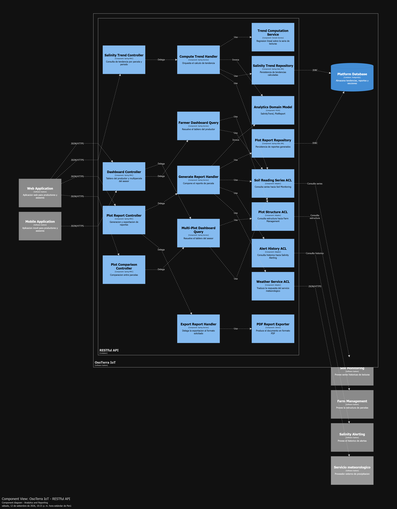

<em>Component Diagram del bounded context Analytics and Reporting.</em>

*   **Dashboard / Salinity Trend / Plot Report / Plot Comparison Controllers:** Reciben las solicitudes de la Web Application y la Mobile Application.
*   **Compute Trend Handler:** Aplica el Trend Computation Service sobre la serie obtenida vía Soil Reading Series ACL.
*   **Generate Report Handler:** Compone el reporte reuniendo series, histórico de alertas (Alert History ACL), estructura de parcelas (Plot Structure ACL) y datos meteorológicos (Weather Service ACL).
*   **Analytics Domain Model:** Contiene `SalinityTrend` y `PlotReport` con sus invariantes.
*   **Multi-Plot Dashboard Query y Farmer Dashboard Query:** Resuelven los tableros agregando información de Soil Monitoring y Farm Management.
*   **PDF Report Exporter:** Produce el documento exportable del reporte.

#### 4.2.6.6. Bounded Context Software Architecture Code Level Diagrams

Para Analytics and Reporting se presentan dos vistas del nivel de código: el diagrama de clases de la capa de dominio, que modela el cálculo de tendencias y la composición de reportes, y el diseño de la base de datos, orientada a la consulta analítica sobre series históricas más que a la escritura transaccional.

##### 4.2.6.6.1. Bounded Context Domain Layer Class Diagrams

A continuación, el diagrama de clases unificado de la capa de dominio del contexto Analytics and Reporting.

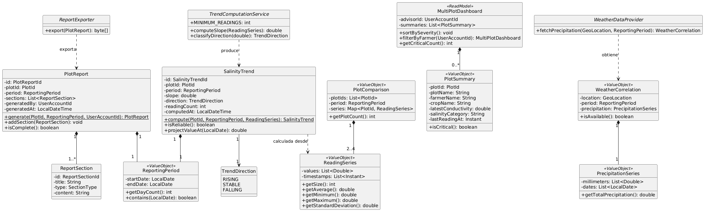

<em>Class Diagram del Domain Layer de Analytics and Reporting.</em>

##### 4.2.6.6.2. Bounded Context Database Design Diagram

<em>Database Diagram del bounded context Analytics and Reporting.</em>

Las tablas principales son `SALINITY_TRENDS` (pendiente y dirección de la tendencia calculada por parcela y periodo), `PLOT_REPORTS` (reporte generado por un usuario para una parcela y periodo) y `REPORT_SECTIONS` (secciones ordenadas que componen cada reporte).

**Restricciones adicionales:** índice único compuesto sobre `(plot_id, period_start_date, period_end_date)` en `SALINITY_TRENDS` para evitar recalcular y duplicar tendencias del mismo periodo; `CHECK (period_start_date < period_end_date)` en ambas tablas; el campo `reading_count` incorpora `CHECK >= 30`, materializando en el esquema la misma invariante de fiabilidad del agregado (`isReliable()`).
