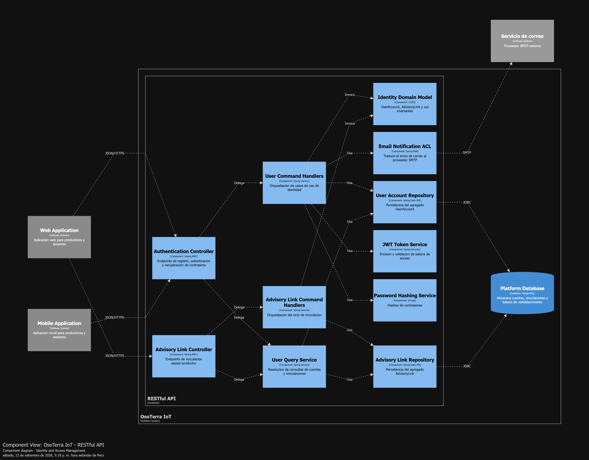
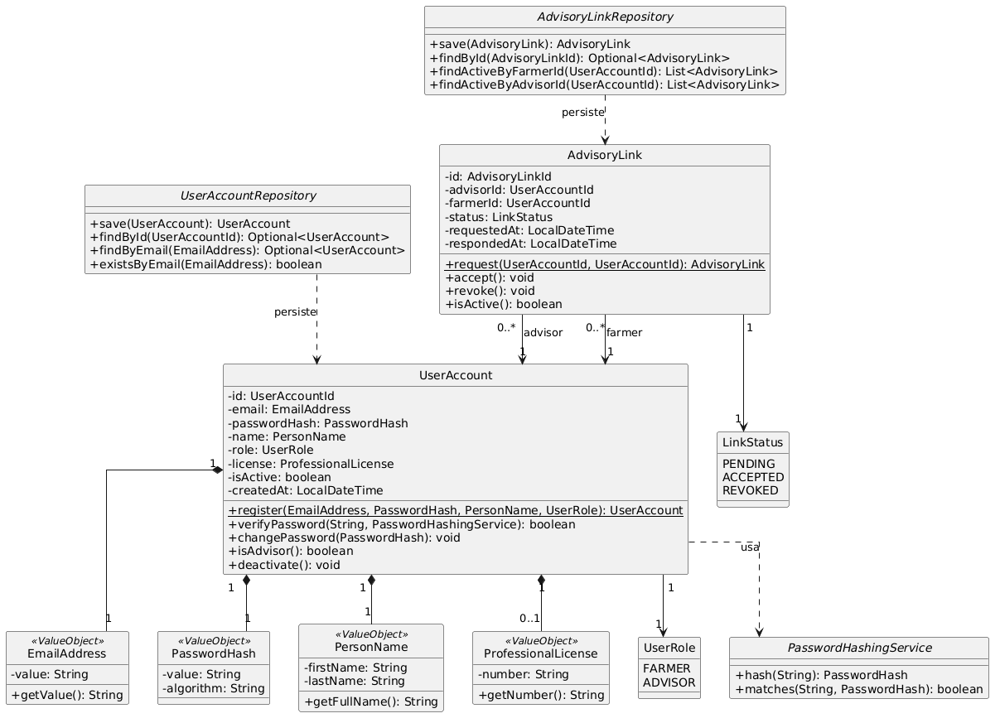
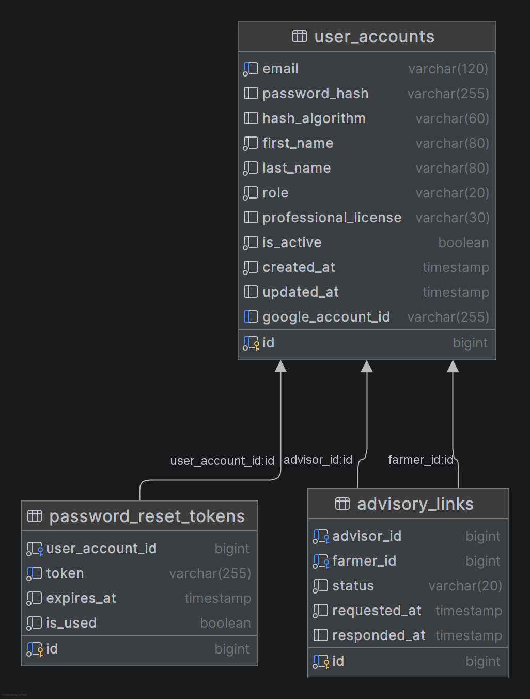
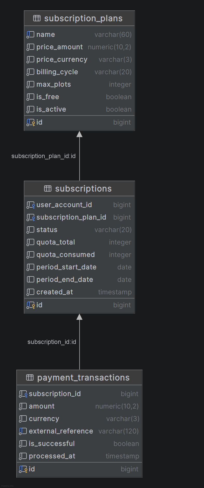
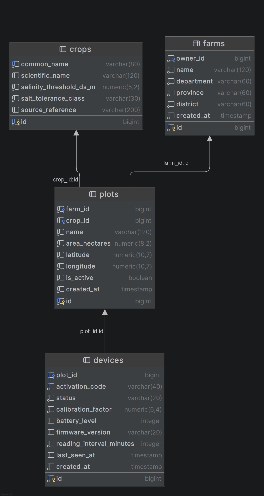
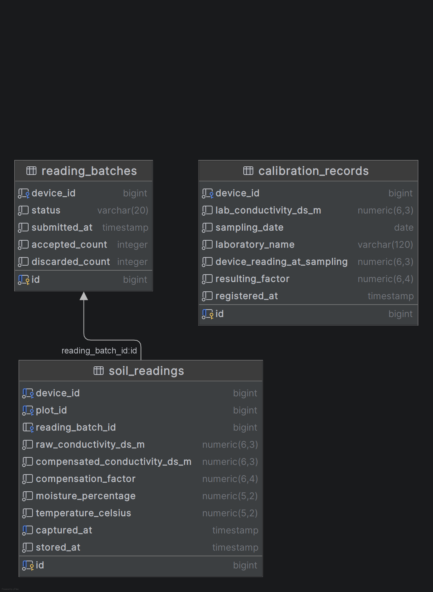
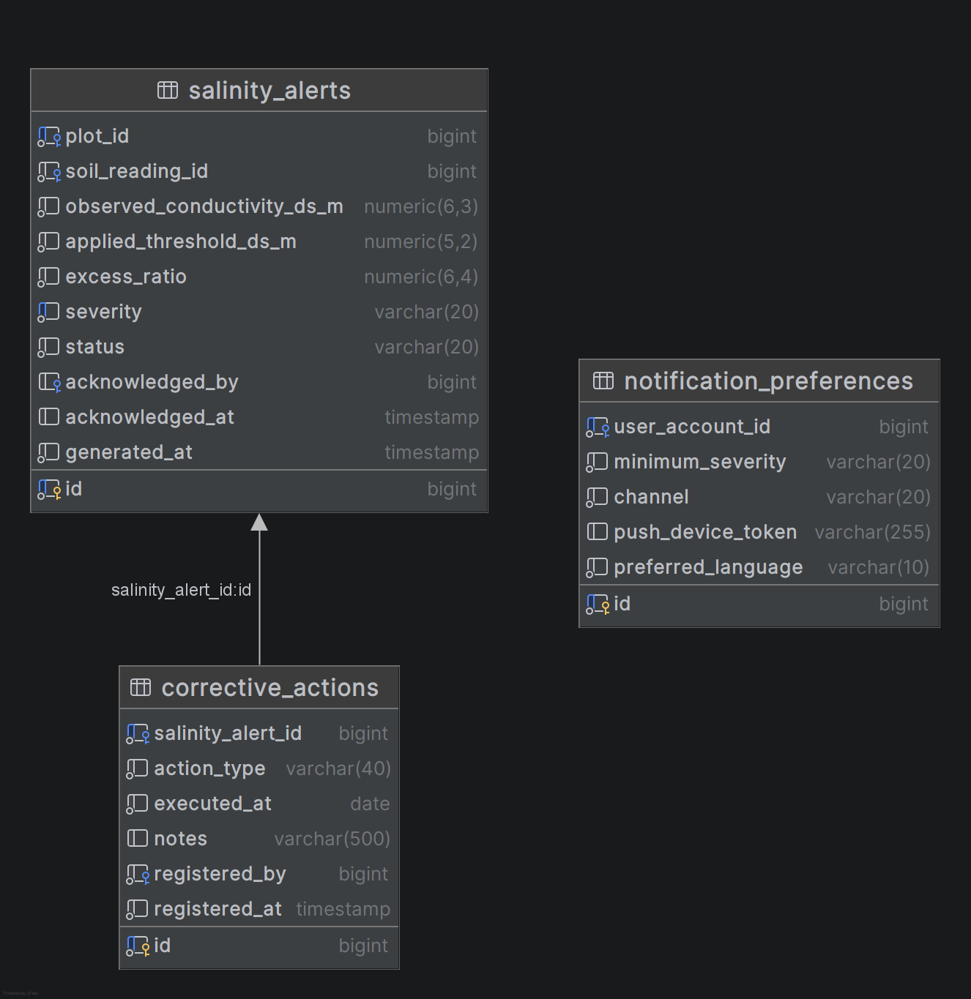
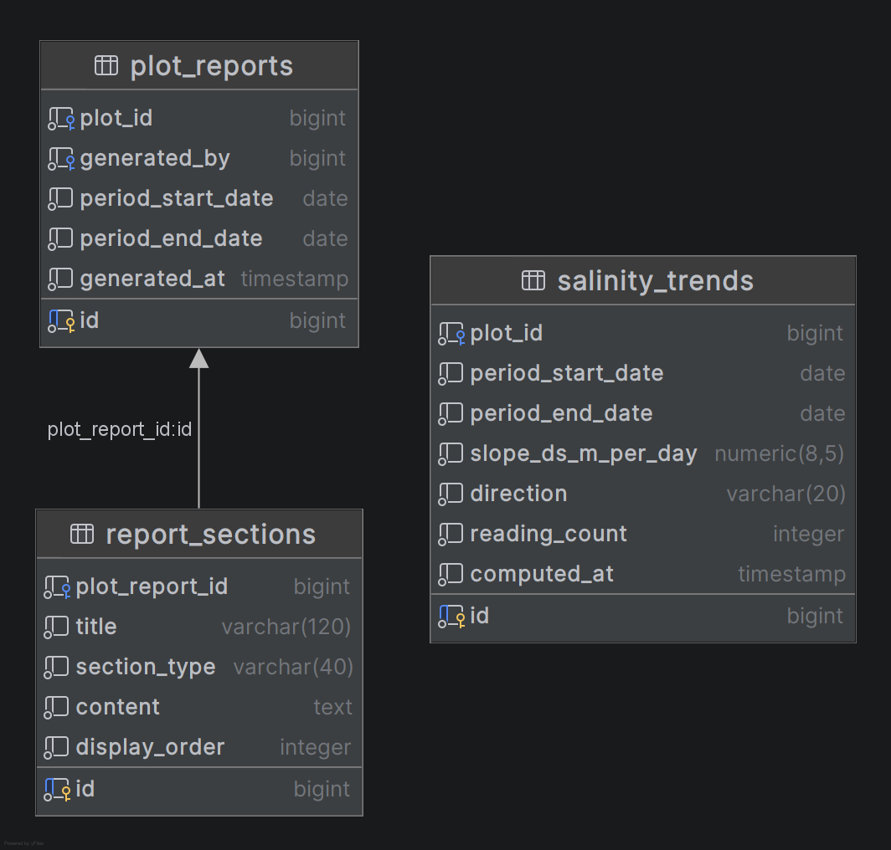

# Capítulo IV: Solution Software Design

## 4.1. Strategic-Level Domain-Driven Design

### 4.1.1. Design-Level EventStorming

#### 4.1.1.1. Candidate Context Discovery

#### 4.1.1.2. Domain Message Flows Modeling

#### 4.1.1.3. Bounded Context Canvases

### 4.1.2. Context Mapping

### 4.1.3. Software Architecture

#### 4.1.3.1. Software Architecture System Landscape Diagram

#### 4.1.3.2. Software Architecture Context Level Diagrams

#### 4.1.3.2. Software Architecture Container Level Diagrams

#### 4.1.3.3. Software Architecture Deployment Diagrams

## 4.2. Tactical-Level Domain-Driven Design

### 4.2.1. Bounded Context: Identity and Access Management

Este contexto es responsable de la identidad de los usuarios, su autenticación y las vinculaciones de supervisión entre asesores y productores.

#### 4.2.1.1. Domain Layer

La capa de dominio de IAM contiene las reglas fundamentales de negocio independientes de cualquier infraestructura: garantiza la unicidad del correo, la validez del rol y la integridad de las credenciales, así como el ciclo de consentimiento y revocación de las vinculaciones asesor-productor.

| Clase | Categoría | Propósito |
|---|---|---|
| `UserAccount` | Aggregate Root | Representa la cuenta de un usuario de la plataforma. Es la raíz de consistencia de la identidad. |
| `EmailAddress` | Value Object | Encapsula una dirección de correo electrónico validada. Su construcción falla si el formato es inválido. |
| `PasswordHash` | Value Object | Encapsula el resultado del hasheo de una contraseña junto con su algoritmo. Nunca expone el valor en claro. |
| `PersonName` | Value Object | Agrupa nombres y apellidos como una unidad conceptual. |
| `UserRole` | Enumeration | Define los roles admisibles: `FARMER` y `ADVISOR`. |
| `AdvisoryLink` | Aggregate Root | Representa la vinculación autorizada entre un asesor y un productor. Es raíz independiente porque su ciclo de vida y sus reglas de consentimiento y revocación son autónomos respecto de las cuentas. |
| `LinkStatus` | Enumeration | Define los estados de una vinculación: `PENDING`, `ACCEPTED` y `REVOKED`. |
| `ProfessionalLicense` | Value Object | Encapsula el número de colegiatura del asesor técnico. |
| `UserAccountRepository` | Repository (interfaz) | Abstracción de persistencia del agregado `UserAccount`. |
| `AdvisoryLinkRepository` | Repository (interfaz) | Abstracción de persistencia del agregado `AdvisoryLink`. |
| `PasswordHashingService` | Domain Service (interfaz) | Abstrae la política de hasheo de contraseñas, manteniendo el algoritmo fuera del dominio. |
| `UserRegisteredEvent` | Domain Event | Se publica al crearse una cuenta. |
| `AdvisoryLinkAcceptedEvent` | Domain Event | Se publica cuando el productor acepta la vinculación. |
| `AdvisoryLinkRevokedEvent` | Domain Event | Se publica cuando el productor revoca la vinculación. |

**Entities y Aggregates:** `UserAccount` actúa como raíz de agregado de la identidad, controlando el registro (`register()`), la verificación de credenciales (`verifyPassword()`), el cambio de contraseña y la desactivación de la cuenta. `AdvisoryLink` administra el ciclo `PENDING → ACCEPTED/REVOKED` mediante `request()`, `accept()` y `revoke()`, publicando el evento correspondiente en cada transición.

**Value Objects:** `EmailAddress`, `PasswordHash`, `PersonName` y `ProfessionalLicense` encapsulan las restricciones estructurales de cada dato, evitando que exista una instancia inválida en el sistema.

**Ports (Interfaces):** `UserAccountRepository`, `AdvisoryLinkRepository` y `PasswordHashingService` definen las operaciones lógicas de almacenamiento y hasheo sin depender de tecnologías específicas como JPA o BCrypt.

#### 4.2.1.2. Interface Layer

La capa de interfaz expone las API REST del contexto acotado, traduciendo las peticiones JSON HTTP externas en comandos de aplicación fuertemente tipados.

| Clase | Categoría | Propósito |
|---|---|---|
| `AuthenticationController` | REST Controller | Expone los endpoints de registro, inicio de sesión, recuperación y restablecimiento de contraseña. |
| `UserAccountController` | REST Controller | Expone la consulta y actualización del perfil del usuario autenticado. |
| `AdvisoryLinkController` | REST Controller | Expone la solicitud, aceptación, revocación y listado de vinculaciones. |
| `SignUpResource` / `SignInResource` | Resource (DTO) | Representan la carga de entrada del registro y la autenticación. |
| `AuthenticatedUserResource` | Resource (DTO) | Representa la respuesta de autenticación, incluyendo el token y su expiración. |
| `UserAccountResource` / `AdvisoryLinkResource` | Resource (DTO) | Representan la cuenta y la vinculación expuestas al cliente, sin datos sensibles. |
| `UserAccountResourceAssembler` | Assembler | Traduce entre el agregado y su representación de salida. |

*   **AuthenticationController:** Expone `sign-up`, `sign-in`, solicitud y confirmación de restablecimiento de contraseña.
*   **AdvisoryLinkController:** Expone la solicitud, aceptación y revocación de una vinculación, y el listado de vinculaciones activas por productor/asesor.
*   **UserAccountController:** Expone la consulta del perfil del usuario autenticado.

#### 4.2.1.3. Application Layer

Esta capa orquesta los casos de uso del contexto, coordinando el dominio con los repositorios y servicios de infraestructura, sin contener lógica de negocio directa.

| Clase | Categoría | Propósito |
|---|---|---|
| `RegisterUserCommandHandler` | Command Handler | Orquesta el alta de una cuenta: verifica la unicidad del correo, delega el hasheo y persiste el agregado. |
| `AuthenticateUserCommandHandler` | Command Handler | Verifica las credenciales y emite el token de acceso. |
| `RequestPasswordResetCommandHandler` | Command Handler | Genera el token de restablecimiento y solicita el envío del correo. |
| `ResetPasswordCommandHandler` | Command Handler | Valida el token y reemplaza la credencial. |
| `RequestAdvisoryLinkCommandHandler` | Command Handler | Crea la solicitud de vinculación. |
| `AcceptAdvisoryLinkCommandHandler` | Command Handler | Registra la aceptación del productor. |
| `RevokeAdvisoryLinkCommandHandler` | Command Handler | Registra la revocación y dispara la propagación del evento. |
| `UserAccountQueryService` | Query Service | Resuelve las consultas de cuentas y de asesores vinculados a un productor. |

#### 4.2.1.4. Infrastructure Layer

La capa de infraestructura implementa las interfaces de dominio (puertos) y provee los adaptadores concretos para persistencia, seguridad y notificación por correo.

| Clase | Categoría | Propósito |
|---|---|---|
| `JpaUserAccountRepository` | Repository Implementation | Implementa `UserAccountRepository` sobre Spring Data JPA. |
| `JpaAdvisoryLinkRepository` | Repository Implementation | Implementa `AdvisoryLinkRepository` sobre Spring Data JPA. |
| `BCryptPasswordHashingService` | Domain Service Implementation | Implementa `PasswordHashingService` mediante el algoritmo BCrypt. |
| `JwtTokenService` | Infrastructure Service | Emite y valida los tokens de acceso (JWT). |
| `SmtpEmailNotificationService` | Anti-corruption Layer | Traduce las solicitudes de envío de correo al modelo del proveedor SMTP. |
| `SecurityConfiguration` | Configuration | Configura los filtros de autenticación y la política de autorización por rol. |

#### 4.2.1.5. Bounded Context Software Architecture Component Level Diagrams

Dentro del contenedor **RESTful API**, el contexto acotado de **Identity and Access Management** se organiza siguiendo el patrón de arquitectura hexagonal (Interfaces, Application, Domain e Infrastructure). El diagrama fue modelado en Structurizr DSL (ver código fuente en `assets/plant/component-iam.dsl`) y renderizado como imagen para su inclusión en el informe.

<em>Component Diagram del bounded context Identity and Access Management.</em>

*   **Authentication / Advisory Link Controllers:** Reciben las solicitudes HTTP/HTTPS de la Web Application y la Mobile Application.
*   **User / Advisory Link Command Handlers y User Query Service:** Orquestan los casos de uso de identidad, invocando el modelo de dominio y los repositorios.
*   **Identity Domain Model:** Contiene `UserAccount`, `AdvisoryLink` y sus invariantes.
*   **User Account Repository / Advisory Link Repository:** Adaptadores Spring Data JPA hacia la base de datos de la plataforma.
*   **JWT Token Service y Password Hashing Service:** Encapsulan la emisión de tokens y el hasheo de contraseñas.
*   **Email Notification ACL:** Traduce las solicitudes de envío de correo hacia el proveedor SMTP externo.

#### 4.2.1.6. Bounded Context Software Architecture Code Level Diagrams

##### 4.2.1.6.1. Bounded Context Domain Layer Class Diagrams

A continuación, el diagrama de clases unificado de la capa de dominio del contexto IAM, modelado en PlantUML (ver código fuente en `assets/plant/class-iam.puml`) y renderizado como imagen para su inclusión en el informe.

<em>Class Diagram del Domain Layer de Identity and Access Management.</em>

##### 4.2.1.6.2. Bounded Context Database Design Diagram

<em>Database Diagram del bounded context Identity and Access Management.</em>

Las tablas principales asociadas a este contexto son `USER_ACCOUNTS`, `ADVISORY_LINKS` y `PASSWORD_RESET_TOKENS`. `USER_ACCOUNTS` almacena el correo (único), la credencial hasheada, el nombre, el rol (`FARMER`/`ADVISOR`) y, cuando corresponde, la colegiatura del asesor. `ADVISORY_LINKS` referencia a dos cuentas (asesor y productor) y su estado (`PENDING`, `ACCEPTED`, `REVOKED`). `PASSWORD_RESET_TOKENS` registra los tokens de restablecimiento emitidos y su vigencia.

**Restricciones adicionales:** índice único compuesto sobre `(advisor_id, farmer_id)` en `ADVISORY_LINKS`, limitado a los registros con estado distinto de `REVOKED`, a fin de impedir vinculaciones activas duplicadas entre el mismo asesor y productor.

---

### 4.2.2. Bounded Context: Subscription and Billing

#### 4.2.2.1. Domain Layer

#### 4.2.2.2. Interface Layer

#### 4.2.2.3. Application Layer

#### 4.2.2.4. Infrastructure Layer

#### 4.2.2.5. Bounded Context Software Architecture Component Level Diagrams

#### 4.2.2.6. Bounded Context Software Architecture Code Level Diagrams

##### 4.2.2.6.1. Bounded Context Domain Layer Class Diagrams

##### 4.2.2.6.2. Bounded Context Database Design Diagram

<em>Database Diagram del bounded context Subscription and Billing.</em>

<!-- TODO: descripción de entidades, atributos, llaves primarias/foráneas, índices y restricciones CHECK del modelo relacional. -->

---

### 4.2.3. Bounded Context: Farm Management

#### 4.2.3.1. Domain Layer

#### 4.2.3.2. Interface Layer

#### 4.2.3.3. Application Layer

#### 4.2.3.4. Infrastructure Layer

#### 4.2.3.5. Bounded Context Software Architecture Component Level Diagrams

#### 4.2.3.6. Bounded Context Software Architecture Code Level Diagrams

##### 4.2.3.6.1. Bounded Context Domain Layer Class Diagrams

##### 4.2.3.6.2. Bounded Context Database Design Diagram

<em>Database Diagram del bounded context Farm Management.</em>

<!-- TODO: descripción de entidades, atributos, llaves primarias/foráneas, índices y restricciones CHECK del modelo relacional. -->

---

### 4.2.4. Bounded Context: Soil Monitoring

#### 4.2.4.1. Domain Layer

#### 4.2.4.2. Interface Layer

#### 4.2.4.3. Application Layer

#### 4.2.4.4. Infrastructure Layer

#### 4.2.4.5. Bounded Context Software Architecture Component Level Diagrams

#### 4.2.4.6. Bounded Context Software Architecture Code Level Diagrams

##### 4.2.4.6.1. Bounded Context Domain Layer Class Diagrams

##### 4.2.4.6.2. Bounded Context Database Design Diagram

<em>Database Diagram del bounded context Soil Monitoring.</em>

<!-- TODO: descripción de entidades, atributos, llaves primarias/foráneas, índices y restricciones CHECK del modelo relacional. -->

---

### 4.2.5. Bounded Context: Salinity Alerting

#### 4.2.5.1. Domain Layer

#### 4.2.5.2. Interface Layer

#### 4.2.5.3. Application Layer

#### 4.2.5.4. Infrastructure Layer

#### 4.2.5.5. Bounded Context Software Architecture Component Level Diagrams

#### 4.2.5.6. Bounded Context Software Architecture Code Level Diagrams

##### 4.2.5.6.1. Bounded Context Domain Layer Class Diagrams

##### 4.2.5.6.2. Bounded Context Database Design Diagram

<em>Database Diagram del bounded context Salinity Alerting.</em>

<!-- TODO: descripción de entidades, atributos, llaves primarias/foráneas, índices y restricciones CHECK del modelo relacional. -->

---

### 4.2.6. Bounded Context: Analytics and Reporting

#### 4.2.6.1. Domain Layer

#### 4.2.6.2. Interface Layer

#### 4.2.6.3. Application Layer

#### 4.2.6.4. Infrastructure Layer

#### 4.2.6.5. Bounded Context Software Architecture Component Level Diagrams

#### 4.2.6.6. Bounded Context Software Architecture Code Level Diagrams

##### 4.2.6.6.1. Bounded Context Domain Layer Class Diagrams

##### 4.2.6.6.2. Bounded Context Database Design Diagram

<em>Database Diagram del bounded context Analytics and Reporting.</em>

<!-- TODO: descripción de entidades, atributos, llaves primarias/foráneas, índices y restricciones CHECK del modelo relacional. -->
