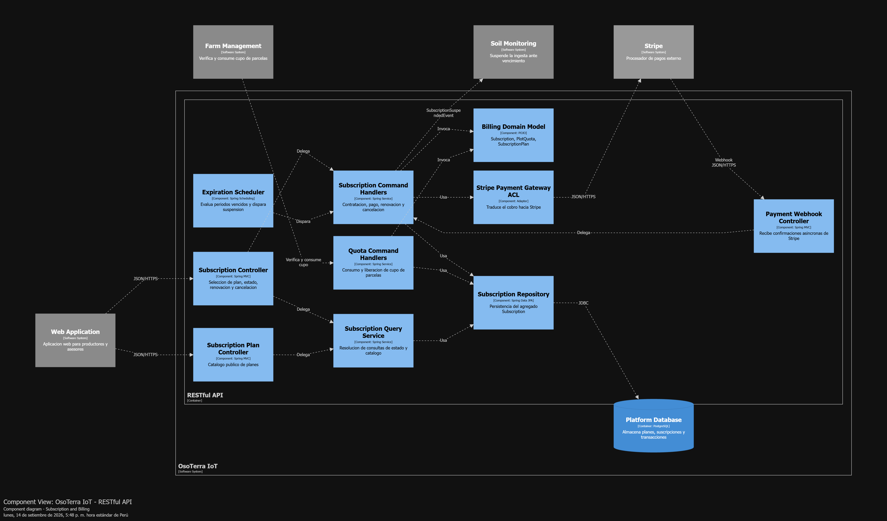
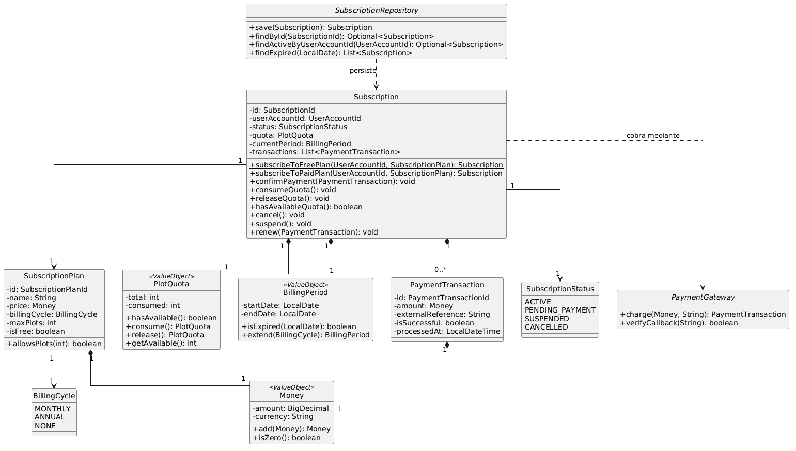
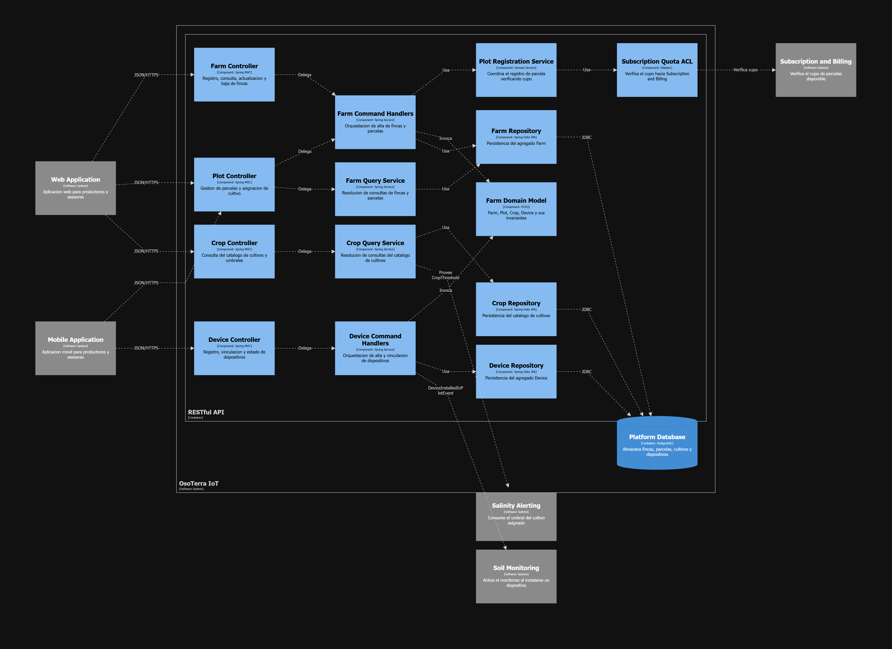
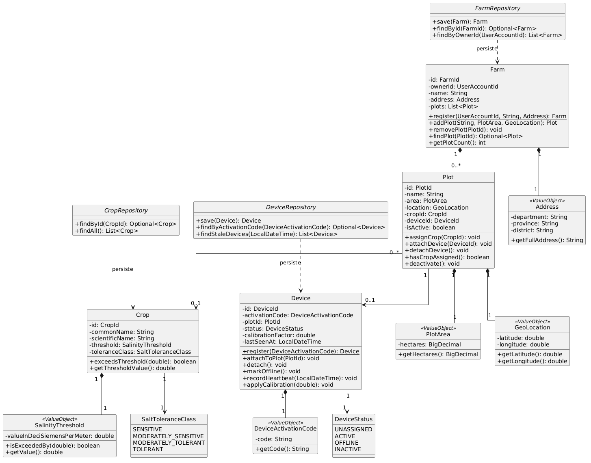
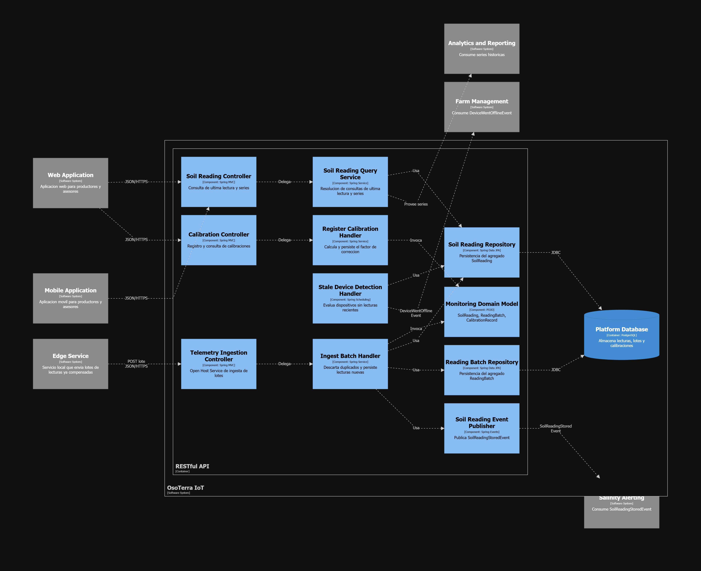
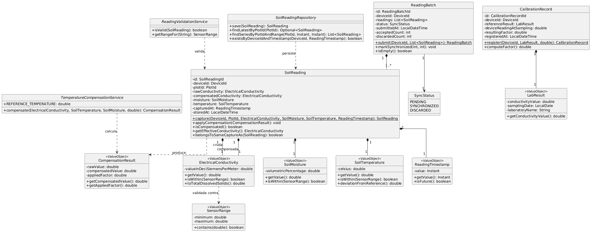
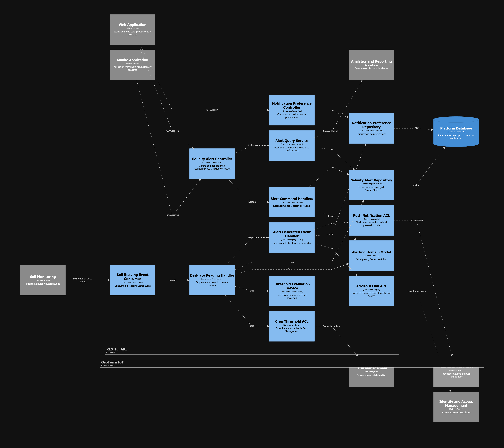
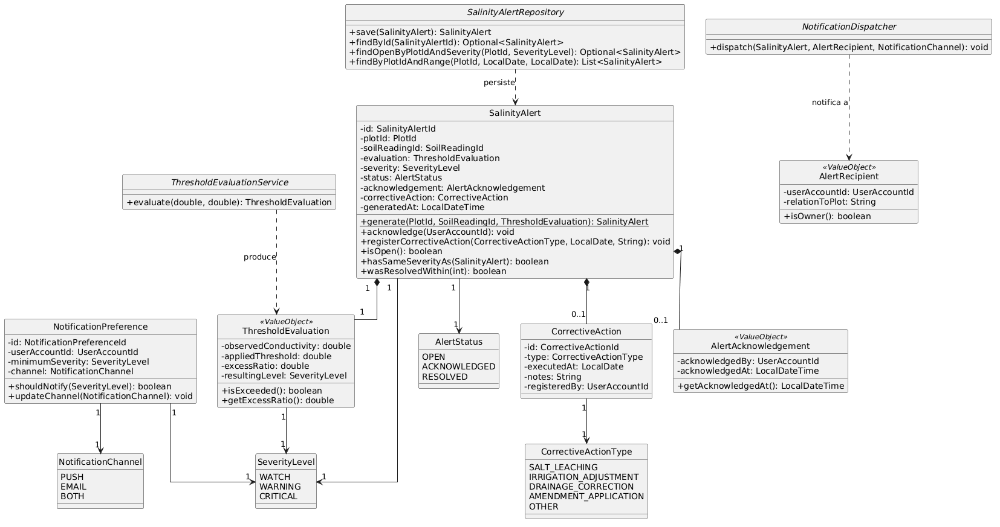

# Capítulo IV: Solution Software Design

## 4.1. Strategic-Level Domain-Driven Design

### 4.1.1. Design-Level EventStorming

#### 4.1.1.1. Candidate Context Discovery

#### 4.1.1.2. Domain Message Flows Modeling

#### 4.1.1.3. Bounded Context Canvases

### 4.1.2. Context Mapping

### 4.1.3. Software Architecture

#### 4.1.3.1. Software Architecture System Landscape Diagram

#### 4.1.3.2. Software Architecture Context Level Diagrams

#### 4.1.3.2. Software Architecture Container Level Diagrams

#### 4.1.3.3. Software Architecture Deployment Diagrams

## 4.2. Tactical-Level Domain-Driven Design

### 4.2.1. Bounded Context: Identity and Access Management

Este contexto es responsable de la identidad de los usuarios, su autenticación y las vinculaciones de supervisión entre asesores y productores.

#### 4.2.1.1. Domain Layer

La capa de dominio de IAM contiene las reglas fundamentales de negocio independientes de cualquier infraestructura: garantiza la unicidad del correo, la validez del rol y la integridad de las credenciales, así como el ciclo de consentimiento y revocación de las vinculaciones asesor-productor.

| Clase | Categoría | Propósito |
|---|---|---|
| `UserAccount` | Aggregate Root | Representa la cuenta de un usuario de la plataforma. Es la raíz de consistencia de la identidad. |
| `EmailAddress` | Value Object | Encapsula una dirección de correo electrónico validada. Su construcción falla si el formato es inválido. |
| `PasswordHash` | Value Object | Encapsula el resultado del hasheo de una contraseña junto con su algoritmo. Nunca expone el valor en claro. |
| `PersonName` | Value Object | Agrupa nombres y apellidos como una unidad conceptual. |
| `UserRole` | Enumeration | Define los roles admisibles: `FARMER` y `ADVISOR`. |
| `AdvisoryLink` | Aggregate Root | Representa la vinculación autorizada entre un asesor y un productor. Es raíz independiente porque su ciclo de vida y sus reglas de consentimiento y revocación son autónomos respecto de las cuentas. |
| `LinkStatus` | Enumeration | Define los estados de una vinculación: `PENDING`, `ACCEPTED` y `REVOKED`. |
| `ProfessionalLicense` | Value Object | Encapsula el número de colegiatura del asesor técnico. |
| `UserAccountRepository` | Repository (interfaz) | Abstracción de persistencia del agregado `UserAccount`. |
| `AdvisoryLinkRepository` | Repository (interfaz) | Abstracción de persistencia del agregado `AdvisoryLink`. |
| `PasswordHashingService` | Domain Service (interfaz) | Abstrae la política de hasheo de contraseñas, manteniendo el algoritmo fuera del dominio. |
| `UserRegisteredEvent` | Domain Event | Se publica al crearse una cuenta. |
| `AdvisoryLinkAcceptedEvent` | Domain Event | Se publica cuando el productor acepta la vinculación. |
| `AdvisoryLinkRevokedEvent` | Domain Event | Se publica cuando el productor revoca la vinculación. |

**Entities y Aggregates:** `UserAccount` actúa como raíz de agregado de la identidad, controlando el registro (`register()`), la verificación de credenciales (`verifyPassword()`), el cambio de contraseña y la desactivación de la cuenta. `AdvisoryLink` administra el ciclo `PENDING → ACCEPTED/REVOKED` mediante `request()`, `accept()` y `revoke()`, publicando el evento correspondiente en cada transición.

**Value Objects:** `EmailAddress`, `PasswordHash`, `PersonName` y `ProfessionalLicense` encapsulan las restricciones estructurales de cada dato, evitando que exista una instancia inválida en el sistema.

**Ports (Interfaces):** `UserAccountRepository`, `AdvisoryLinkRepository` y `PasswordHashingService` definen las operaciones lógicas de almacenamiento y hasheo sin depender de tecnologías específicas como JPA o BCrypt.

#### 4.2.1.2. Interface Layer

La capa de interfaz expone las API REST del contexto acotado, traduciendo las peticiones JSON HTTP externas en comandos de aplicación fuertemente tipados.

| Clase | Categoría | Propósito |
|---|---|---|
| `AuthenticationController` | REST Controller | Expone los endpoints de registro, inicio de sesión, recuperación y restablecimiento de contraseña. |
| `UserAccountController` | REST Controller | Expone la consulta y actualización del perfil del usuario autenticado. |
| `AdvisoryLinkController` | REST Controller | Expone la solicitud, aceptación, revocación y listado de vinculaciones. |
| `SignUpResource` / `SignInResource` | Resource (DTO) | Representan la carga de entrada del registro y la autenticación. |
| `AuthenticatedUserResource` | Resource (DTO) | Representa la respuesta de autenticación, incluyendo el token y su expiración. |
| `UserAccountResource` / `AdvisoryLinkResource` | Resource (DTO) | Representan la cuenta y la vinculación expuestas al cliente, sin datos sensibles. |
| `UserAccountResourceAssembler` | Assembler | Traduce entre el agregado y su representación de salida. |

*   **AuthenticationController:** Expone `sign-up`, `sign-in`, solicitud y confirmación de restablecimiento de contraseña.
*   **AdvisoryLinkController:** Expone la solicitud, aceptación y revocación de una vinculación, y el listado de vinculaciones activas por productor/asesor.
*   **UserAccountController:** Expone la consulta del perfil del usuario autenticado.

#### 4.2.1.3. Application Layer

Esta capa orquesta los casos de uso del contexto, coordinando el dominio con los repositorios y servicios de infraestructura, sin contener lógica de negocio directa.

| Clase | Categoría | Propósito |
|---|---|---|
| `RegisterUserCommandHandler` | Command Handler | Orquesta el alta de una cuenta: verifica la unicidad del correo, delega el hasheo y persiste el agregado. |
| `AuthenticateUserCommandHandler` | Command Handler | Verifica las credenciales y emite el token de acceso. |
| `RequestPasswordResetCommandHandler` | Command Handler | Genera el token de restablecimiento y solicita el envío del correo. |
| `ResetPasswordCommandHandler` | Command Handler | Valida el token y reemplaza la credencial. |
| `RequestAdvisoryLinkCommandHandler` | Command Handler | Crea la solicitud de vinculación. |
| `AcceptAdvisoryLinkCommandHandler` | Command Handler | Registra la aceptación del productor. |
| `RevokeAdvisoryLinkCommandHandler` | Command Handler | Registra la revocación y dispara la propagación del evento. |
| `UserAccountQueryService` | Query Service | Resuelve las consultas de cuentas y de asesores vinculados a un productor. |

#### 4.2.1.4. Infrastructure Layer

La capa de infraestructura implementa las interfaces de dominio (puertos) y provee los adaptadores concretos para persistencia, seguridad y notificación por correo.

| Clase | Categoría | Propósito |
|---|---|---|
| `JpaUserAccountRepository` | Repository Implementation | Implementa `UserAccountRepository` sobre Spring Data JPA. |
| `JpaAdvisoryLinkRepository` | Repository Implementation | Implementa `AdvisoryLinkRepository` sobre Spring Data JPA. |
| `BCryptPasswordHashingService` | Domain Service Implementation | Implementa `PasswordHashingService` mediante el algoritmo BCrypt. |
| `JwtTokenService` | Infrastructure Service | Emite y valida los tokens de acceso (JWT). |
| `SmtpEmailNotificationService` | Anti-corruption Layer | Traduce las solicitudes de envío de correo al modelo del proveedor SMTP. |
| `SecurityConfiguration` | Configuration | Configura los filtros de autenticación y la política de autorización por rol. |

#### 4.2.1.5. Bounded Context Software Architecture Component Level Diagrams

Dentro del contenedor **RESTful API**, el contexto acotado de **Identity and Access Management** se organiza siguiendo el patrón de arquitectura hexagonal (Interfaces, Application, Domain e Infrastructure). El diagrama fue modelado en Structurizr DSL (ver código fuente en `assets/plant/component-iam.dsl`) y renderizado como imagen para su inclusión en el informe.

<em>Component Diagram del bounded context Identity and Access Management.</em>

*   **Authentication / Advisory Link Controllers:** Reciben las solicitudes HTTP/HTTPS de la Web Application y la Mobile Application.
*   **User / Advisory Link Command Handlers y User Query Service:** Orquestan los casos de uso de identidad, invocando el modelo de dominio y los repositorios.
*   **Identity Domain Model:** Contiene `UserAccount`, `AdvisoryLink` y sus invariantes.
*   **User Account Repository / Advisory Link Repository:** Adaptadores Spring Data JPA hacia la base de datos de la plataforma.
*   **JWT Token Service y Password Hashing Service:** Encapsulan la emisión de tokens y el hasheo de contraseñas.
*   **Email Notification ACL:** Traduce las solicitudes de envío de correo hacia el proveedor SMTP externo.

#### 4.2.1.6. Bounded Context Software Architecture Code Level Diagrams

##### 4.2.1.6.1. Bounded Context Domain Layer Class Diagrams

A continuación, el diagrama de clases unificado de la capa de dominio del contexto IAM, modelado en PlantUML (ver código fuente en `assets/plant/class-iam.puml`) y renderizado como imagen para su inclusión en el informe.

<em>Class Diagram del Domain Layer de Identity and Access Management.</em>

##### 4.2.1.6.2. Bounded Context Database Design Diagram

<em>Database Diagram del bounded context Identity and Access Management.</em>

Las tablas principales asociadas a este contexto son `USER_ACCOUNTS`, `ADVISORY_LINKS` y `PASSWORD_RESET_TOKENS`. `USER_ACCOUNTS` almacena el correo (único), la credencial hasheada, el nombre, el rol (`FARMER`/`ADVISOR`) y, cuando corresponde, la colegiatura del asesor. `ADVISORY_LINKS` referencia a dos cuentas (asesor y productor) y su estado (`PENDING`, `ACCEPTED`, `REVOKED`). `PASSWORD_RESET_TOKENS` registra los tokens de restablecimiento emitidos y su vigencia.

**Restricciones adicionales:** índice único compuesto sobre `(advisor_id, farmer_id)` en `ADVISORY_LINKS`, limitado a los registros con estado distinto de `REVOKED`, a fin de impedir vinculaciones activas duplicadas entre el mismo asesor y productor.

---

### 4.2.2. Bounded Context: Subscription and Billing

Este contexto gestiona los planes de suscripción, su ciclo de vida y el cumplimiento de los cupos de parcelas que cada plan habilita.

#### 4.2.2.1. Domain Layer

La capa de dominio de Subscription and Billing garantiza que exista una única suscripción activa por usuario y que el cupo de parcelas consumido nunca exceda el disponible.

| Clase | Categoría | Propósito |
|---|---|---|
| `Subscription` | Aggregate Root | Representa la suscripción de un usuario. Es la raíz que garantiza que exista una única suscripción activa por usuario y que el cupo consumido nunca exceda el disponible. |
| `SubscriptionPlan` | Entity | Representa un plan comercial con su precio, ciclo de facturación y cupo de parcelas. |
| `PlotQuota` | Value Object | Encapsula el par formado por el cupo total y el cupo consumido, junto con la lógica de disponibilidad. |
| `Money` | Value Object | Encapsula un importe monetario con su moneda, evitando operaciones entre monedas distintas. |
| `BillingCycle` | Enumeration | Define los ciclos admisibles: `MONTHLY`, `ANNUAL` y `NONE` para el plan gratuito. |
| `SubscriptionStatus` | Enumeration | Define los estados: `ACTIVE`, `PENDING_PAYMENT`, `SUSPENDED` y `CANCELLED`. |
| `BillingPeriod` | Value Object | Encapsula la fecha de inicio y fin del periodo vigente. |
| `PaymentTransaction` | Entity | Registra un intento de cobro con su resultado y su referencia externa. |
| `SubscriptionRepository` | Repository (interfaz) | Abstracción de persistencia del agregado `Subscription`. |
| `SubscriptionPlanRepository` | Repository (interfaz) | Abstracción de persistencia del catálogo de planes. |
| `PaymentGateway` | Domain Service (interfaz) | Abstrae el procesamiento del cobro, manteniendo el proveedor fuera del dominio. |
| `SubscriptionActivatedEvent` | Domain Event | Se publica al activarse la suscripción; otorga el cupo a Farm Management. |
| `SubscriptionSuspendedEvent` | Domain Event | Se publica al expirar o cancelarse; suspende la ingesta en Soil Monitoring. |

**Entities y Aggregates:** `Subscription` controla el ciclo completo mediante `subscribeToFreePlan()`, `subscribeToPaidPlan()`, `confirmPayment()`, `consumeQuota()`/`releaseQuota()`, `cancel()`, `suspend()` y `renew()`. `SubscriptionPlan` y `PaymentTransaction` son entidades internas que solo cambian a través de la raíz.

**Value Objects:** `PlotQuota` encapsula la disponibilidad de cupo (`hasAvailable()`, `consume()`, `release()`); `Money` evita operar importes de monedas distintas; `BillingPeriod` calcula vencimiento y extensión del periodo.

**Ports (Interfaces):** `SubscriptionRepository`, `SubscriptionPlanRepository` y `PaymentGateway` desacoplan la persistencia y el cobro del proveedor externo.

#### 4.2.2.2. Interface Layer

La capa de interfaz expone el catálogo de planes, la gestión de la suscripción del usuario y el webhook de confirmación asíncrona de la pasarela de pago.

| Clase | Categoría | Propósito |
|---|---|---|
| `SubscriptionController` | REST Controller | Expone la selección de plan, la consulta del estado, la renovación y la cancelación. |
| `SubscriptionPlanController` | REST Controller | Expone el catálogo público de planes. |
| `PaymentWebhookController` | REST Controller | Recibe las confirmaciones asíncronas de la pasarela de pago. |
| `SubscribeResource` | Resource (DTO) | Carga de entrada de la selección de plan. |
| `SubscriptionResource` | Resource (DTO) | Representación de la suscripción expuesta al cliente. |
| `SubscriptionPlanResource` | Resource (DTO) | Representación de un plan del catálogo. |

*   **SubscriptionController:** Expone la contratación de plan, cancelación y renovación, y la consulta del estado vigente.
*   **SubscriptionPlanController:** Expone el catálogo público de planes (nombre, precio, ciclo y cupo de parcelas).
*   **PaymentWebhookController:** Endpoint de Open Host Service que recibe las notificaciones asíncronas de la pasarela de pago.

#### 4.2.2.3. Application Layer

Esta capa orquesta la contratación, confirmación de pago, renovación, cancelación y consumo/liberación de cupo, distinguiendo el flujo gratuito del de pago.

| Clase | Categoría | Propósito |
|---|---|---|
| `SubscribeToPlanCommandHandler` | Command Handler | Orquesta la contratación de un plan, distinguiendo el flujo gratuito del de pago. |
| `ConfirmPaymentCommandHandler` | Command Handler | Procesa la confirmación de la pasarela y activa la suscripción. |
| `CancelSubscriptionCommandHandler` | Command Handler | Registra la cancelación programada. |
| `RenewSubscriptionCommandHandler` | Command Handler | Ejecuta la renovación del periodo. |
| `ConsumeQuotaCommandHandler` | Command Handler | Reserva un cupo de parcela a solicitud de Farm Management. |
| `ReleaseQuotaCommandHandler` | Command Handler | Libera un cupo al darse de baja una parcela. |
| `SubscriptionExpirationEventHandler` | Event Handler | Reacciona al vencimiento del periodo suspendiendo la suscripción. |
| `SubscriptionQueryService` | Query Service | Resuelve las consultas de estado y de catálogo de planes. |

#### 4.2.2.4. Infrastructure Layer

La capa de infraestructura implementa la persistencia del catálogo y las suscripciones, la traducción hacia la pasarela de pago externa y la tarea programada de expiración.

| Clase | Categoría | Propósito |
|---|---|---|
| `JpaSubscriptionRepository` | Repository Implementation | Implementa `SubscriptionRepository` sobre Spring Data JPA. |
| `JpaSubscriptionPlanRepository` | Repository Implementation | Implementa `SubscriptionPlanRepository` sobre Spring Data JPA. |
| `ExternalPaymentGatewayAdapter` | Anti-corruption Layer | Implementa `PaymentGateway` traduciendo entre el modelo del dominio y el de la pasarela externa. |
| `SubscriptionExpirationScheduler` | Scheduled Job | Evalúa periódicamente las suscripciones vencidas y dispara su suspensión. |

#### 4.2.2.5. Bounded Context Software Architecture Component Level Diagrams

Dentro del contenedor **RESTful API**, el contexto acotado de **Subscription and Billing** organiza sus responsabilidades en las cuatro capas tácticas, comunicándose con Farm Management (verificación y consumo de cupo) y con Soil Monitoring (suspensión de ingesta) mediante eventos de dominio.

<em>Component Diagram del bounded context Subscription and Billing.</em>

*   **Subscription / Subscription Plan / Payment Webhook Controllers:** Reciben las solicitudes de la Web Application y las confirmaciones de la pasarela de pago externa.
*   **Subscription Command Handlers y Quota Command Handlers:** Orquestan la contratación, pago, renovación, cancelación y el consumo/liberación de cupo.
*   **Billing Domain Model:** Contiene `Subscription`, `PlotQuota` y `SubscriptionPlan` con sus invariantes.
*   **Subscription Repository:** Adaptador Spring Data JPA hacia la base de datos de la plataforma.
*   **Payment Gateway ACL:** Traduce el cobro hacia la pasarela de pago externa.
*   **Expiration Scheduler:** Evalúa periódicamente los periodos vencidos y dispara la suspensión, propagando `SubscriptionSuspendedEvent` hacia Soil Monitoring.

#### 4.2.2.6. Bounded Context Software Architecture Code Level Diagrams

##### 4.2.2.6.1. Bounded Context Domain Layer Class Diagrams

A continuación, el diagrama de clases unificado de la capa de dominio del contexto Subscription and Billing.

<em>Class Diagram del Domain Layer de Subscription and Billing.</em>

##### 4.2.2.6.2. Bounded Context Database Design Diagram

<em>Database Diagram del bounded context Subscription and Billing.</em>

Las tablas principales asociadas a este contexto son `SUBSCRIPTION_PLANS` (catálogo de planes con precio, ciclo de facturación y cupo máximo de parcelas), `SUBSCRIPTIONS` (suscripción vigente de cada usuario, con su cupo total/consumido y periodo de facturación) y `PAYMENT_TRANSACTIONS` (historial de cobros asociados a cada suscripción, con su referencia externa).

**Restricciones adicionales:** `CHECK (quota_consumed <= quota_total)` a nivel de tabla en `SUBSCRIPTIONS`, y un índice único parcial sobre `user_account_id` restringido a los registros con estado `ACTIVE` o `PENDING_PAYMENT`, garantizando una única suscripción vigente por usuario.

---

### 4.2.3. Bounded Context: Farm Management

Este contexto mantiene la estructura agronómica de la solución y provee a los demás contextos el marco de referencia que permite contextualizar cada medición.

#### 4.2.3.1. Domain Layer

La capa de dominio de Farm Management modela la jerarquía finca-parcela, el catálogo de cultivos con su umbral de salinidad y el ciclo de vida de los dispositivos IoT.

| Clase | Categoría | Propósito |
|---|---|---|
| `Farm` | Aggregate Root | Representa la finca conducida por un productor. Es raíz de consistencia de las parcelas que agrupa. |
| `Plot` | Entity | Representa una parcela dentro de una finca, con su superficie, ubicación y cultivo asignado. Es la unidad mínima de monitoreo. |
| `Crop` | Aggregate Root | Representa un cultivo del catálogo con su umbral de salinidad y su clase de tolerancia. Es raíz independiente porque el catálogo se administra centralmente. |
| `Device` | Aggregate Root | Representa un dispositivo IoT con su código de activación, su estado operativo y su vinculación a una parcela. |
| `SalinityThreshold` | Value Object | Encapsula el umbral de conductividad eléctrica de un cultivo en dS/m, con la validación de que sea positivo. |
| `SaltToleranceClass` | Enumeration | Clasifica el cultivo como `SENSITIVE`, `MODERATELY_SENSITIVE`, `MODERATELY_TOLERANT` o `TOLERANT`. |
| `PlotArea` | Value Object | Encapsula la superficie en hectáreas, validando que sea mayor a cero. |
| `GeoLocation` | Value Object | Encapsula latitud y longitud, validando sus rangos admisibles. |
| `Address` | Value Object | Agrupa departamento, provincia y distrito. |
| `DeviceActivationCode` | Value Object | Encapsula el código de activación del dispositivo. |
| `DeviceStatus` | Enumeration | Define los estados: `UNASSIGNED`, `ACTIVE`, `OFFLINE` e `INACTIVE`. |
| `FarmRepository` / `CropRepository` / `DeviceRepository` | Repository (interfaz) | Abstracción de persistencia de cada agregado. |
| `PlotRegistrationService` | Domain Service | Coordina el registro de una parcela verificando el cupo de la suscripción, operación que involucra a dos agregados de contextos distintos. |
| `DeviceInstalledInPlotEvent` | Domain Event | Se publica al vincularse un dispositivo; activa el monitoreo en Soil Monitoring. |
| `CropAssignedToPlotEvent` | Domain Event | Se publica al asignarse un cultivo; establece el umbral aplicable en Salinity Alerting. |

**Entities y Aggregates:** `Farm` controla el alta/baja de parcelas (`addPlot()`, `removePlot()`) impidiendo remover una con dispositivo activo. `Plot` administra la asignación de cultivo y la vinculación/desvinculación de dispositivo (`assignCrop()`, `attachDevice()`, `detachDevice()`). `Crop` expone `exceedsThreshold(double)` para evaluar si una conductividad supera su tolerancia. `Device` gestiona su ciclo de vida completo: `register()`, `attachToPlot()`, `detach()`, `markOffline()`, `recordHeartbeat()` y `applyCalibration()`.

**Value Objects:** `SalinityThreshold`, `PlotArea`, `GeoLocation`, `Address` y `DeviceActivationCode` encapsulan validaciones estructurales propias de cada dato agronómico o geográfico.

**Domain Service:** `PlotRegistrationService` es el único punto donde el dominio de Farm Management coordina con el cupo de Subscription and Billing antes de crear una parcela.

#### 4.2.3.2. Interface Layer

La capa de interfaz expone el registro y consulta de fincas, parcelas, catálogo de cultivos y dispositivos.

| Clase | Categoría | Propósito |
|---|---|---|
| `FarmController` | REST Controller | Expone el registro, consulta, actualización y baja de fincas. |
| `PlotController` | REST Controller | Expone la gestión de parcelas y la asignación de cultivo. |
| `CropController` | REST Controller | Expone la consulta del catálogo de cultivos y sus umbrales. |
| `DeviceController` | REST Controller | Expone el registro, vinculación y consulta del estado de los dispositivos. |
| `CreateFarmResource` / `CreatePlotResource` / `AssignCropResource` | Resource (DTO) | Cargas de entrada del registro de finca, parcela y asignación de cultivo. |
| `FarmResource` / `PlotResource` / `CropResource` / `DeviceResource` | Resource (DTO) | Representaciones expuestas al cliente. |

*   **FarmController / PlotController:** Registro y consulta de fincas y parcelas del productor autenticado.
*   **CropController:** Consulta del catálogo de cultivos con su umbral de tolerancia.
*   **DeviceController:** Registro de dispositivos por código de activación y vinculación a una parcela.

#### 4.2.3.3. Application Layer

Esta capa orquesta el alta de fincas, parcelas y dispositivos, verificando previamente el cupo de la suscripción y propagando los eventos de asignación de cultivo e instalación de dispositivo.

| Clase | Categoría | Propósito |
|---|---|---|
| `RegisterFarmCommandHandler` | Command Handler | Orquesta el alta de una finca. |
| `RegisterPlotCommandHandler` | Command Handler | Orquesta el alta de una parcela verificando previamente el cupo de la suscripción. |
| `AssignCropToPlotCommandHandler` | Command Handler | Registra la asignación del cultivo y propaga el evento. |
| `DeactivatePlotCommandHandler` | Command Handler | Da de baja la parcela y libera el cupo consumido. |
| `RegisterDeviceCommandHandler` | Command Handler | Da de alta un dispositivo a partir de su código de activación. |
| `AttachDeviceToPlotCommandHandler` | Command Handler | Vincula el dispositivo a la parcela y publica `DeviceInstalledInPlotEvent`. |
| `MarkDeviceOfflineEventHandler` | Event Handler | Reacciona a la ausencia de lecturas marcando el dispositivo como fuera de línea. |
| `FarmQueryService` | Query Service | Resuelve las consultas de fincas y parcelas de un usuario. |
| `CropQueryService` | Query Service | Resuelve las consultas del catálogo y del umbral aplicable a una parcela. |

#### 4.2.3.4. Infrastructure Layer

La capa de infraestructura implementa la persistencia de fincas, cultivos y dispositivos, la carga inicial del catálogo de cultivos y la verificación de cupo hacia Subscription and Billing.

| Clase | Categoría | Propósito |
|---|---|---|
| `JpaFarmRepository` / `JpaCropRepository` / `JpaDeviceRepository` | Repository Implementation | Implementan los repositorios del dominio sobre Spring Data JPA. |
| `CropCatalogSeeder` | Data Initializer | Carga el catálogo inicial de cultivos con los umbrales de Maas y Hoffman. |
| `SubscriptionQuotaClient` | Anti-corruption Layer | Traduce las verificaciones de cupo hacia el contexto de Subscription and Billing. |

#### 4.2.3.5. Bounded Context Software Architecture Component Level Diagrams

Dentro del contenedor **RESTful API**, el contexto acotado de **Farm Management** coordina con Subscription and Billing (verificación de cupo), Soil Monitoring (activación de monitoreo) y Salinity Alerting (umbral del cultivo).

<em>Component Diagram del bounded context Farm Management.</em>

*   **Farm / Plot / Crop / Device Controllers:** Reciben las solicitudes de la Web Application y la Mobile Application.
*   **Farm Command Handlers y Device Command Handlers:** Orquestan el alta y actualización de fincas, parcelas y dispositivos.
*   **Plot Registration Service:** Domain Service que coordina con Subscription and Billing antes de registrar una parcela.
*   **Farm Domain Model:** Contiene `Farm`, `Plot`, `Crop` y `Device` con sus invariantes.
*   **Farm / Crop / Device Repository:** Adaptadores Spring Data JPA hacia la base de datos de la plataforma.
*   **Subscription Quota ACL:** Traduce la verificación de cupo hacia Subscription and Billing.
*   Los Device Command Handlers publican `DeviceInstalledInPlotEvent` hacia Soil Monitoring, y Crop Query Service provee el umbral del cultivo (`CropAssignedToPlotEvent`) a Salinity Alerting.

#### 4.2.3.6. Bounded Context Software Architecture Code Level Diagrams

##### 4.2.3.6.1. Bounded Context Domain Layer Class Diagrams

A continuación, el diagrama de clases unificado de la capa de dominio del contexto Farm Management.

<em>Class Diagram del Domain Layer de Farm Management.</em>

##### 4.2.3.6.2. Bounded Context Database Design Diagram

<em>Database Diagram del bounded context Farm Management.</em>

Las tablas principales asociadas a este contexto son `FARMS` (finca y su propietario), `PLOTS` (parcela con su superficie, ubicación, cultivo y finca a la que pertenece), `CROPS` (catálogo de cultivos con su umbral de salinidad en dS/m y su clase de tolerancia) y `DEVICES` (dispositivo IoT con su código de activación y estado).

**Restricciones adicionales:** restricción `UNIQUE` sobre `devices.plot_id` para garantizar que una parcela tenga como máximo un dispositivo vinculado, e índice sobre `plots.farm_id` para optimizar la consulta de parcelas por finca. La tabla `CROPS` se inicializa con los umbrales de tolerancia de Maas y Hoffman para los cultivos predominantes de la costa peruana (arroz, maíz, uva, espárrago, algodón, cebada, trigo, papa, tomate y cebolla).

---

### 4.2.4. Bounded Context: Soil Monitoring

Este es el primero de los dos bounded contexts core. Concentra la captura, validación, compensación y persistencia de las mediciones del suelo, y es donde reside el valor diferencial de la solución. Su modelo se despliega parcialmente en el Edge Service y parcialmente en el RESTful API.

#### 4.2.4.1. Domain Layer

La capa de dominio garantiza que toda lectura persistida conserve simultáneamente su valor crudo y su valor compensado, y que su marca temporal sea coherente.

| Clase | Categoría | Propósito |
|---|---|---|
| `SoilReading` | Aggregate Root | Representa una medición completa del suelo en un instante determinado. Garantiza que toda lectura conserve su valor crudo y su valor compensado. |
| `ElectricalConductivity` | Value Object | Encapsula un valor de conductividad eléctrica en dS/m. Valida que sea no negativo y esté dentro del rango físico admisible del sensor. |
| `SoilMoisture` | Value Object | Encapsula el contenido volumétrico de agua expresado como porcentaje, validando el rango de 0 a 100. |
| `SoilTemperature` | Value Object | Encapsula la temperatura del suelo en grados Celsius, validando el rango físicamente plausible. |
| `ReadingTimestamp` | Value Object | Encapsula la marca temporal de la captura, garantizando que no sea futura. |
| `CompensationResult` | Value Object | Agrupa el valor crudo, el valor compensado y el factor aplicado, preservando la trazabilidad del cálculo. |
| `ReadingBatch` | Aggregate Root | Representa un lote de lecturas transmitido desde el Edge Service. Su ciclo de sincronización e idempotencia son autónomos respecto de cada lectura individual. |
| `SyncStatus` | Enumeration | Define los estados de sincronización: `PENDING`, `SYNCHRONIZED` y `DISCARDED`. |
| `SensorRange` | Value Object | Define los límites físicos admisibles de cada sensor, empleados en la validación. |
| `CalibrationRecord` | Aggregate Root | Registra una calibración del dispositivo contra un resultado de laboratorio, con su valor de referencia y el factor resultante. |
| `LabResult` | Value Object | Encapsula el resultado de un análisis de laboratorio: valor de conductividad, fecha de muestreo y laboratorio emisor. |
| `SoilReadingRepository` / `ReadingBatchRepository` / `CalibrationRecordRepository` | Repository (interfaz) | Abstracción de persistencia y consulta de cada agregado. |
| `ReadingValidationService` | Domain Service | Determina si una lectura se encuentra dentro del rango físico admisible del sensor. |
| `TemperatureCompensationService` | Domain Service | Aplica la compensación de la conductividad eléctrica a la temperatura de referencia de 25 °C, incorporando el efecto de la humedad. |
| `SoilReadingStoredEvent` | Domain Event | Se publica al persistirse una lectura. Es el contrato público que consume Salinity Alerting. |
| `DeviceWentOfflineEvent` | Domain Event | Se publica al detectarse la ausencia prolongada de lecturas de un dispositivo. |

**Entities y Aggregates:** `SoilReading` se crea mediante `capture()` y solo se considera evaluable tras `applyCompensation()`, que fija el valor efectivo (`getEffectiveConductivity()`) usado por Salinity Alerting. `ReadingBatch` agrupa las lecturas transmitidas por un dispositivo y confirma su procesamiento con `markSynchronized(accepted, discarded)`. `CalibrationRecord` calcula el factor de corrección (`computeFactor()`) a partir de un `LabResult`.

**Domain Service central:** `TemperatureCompensationService` implementa la regla técnica más determinante del contexto: ajusta la conductividad a 25 °C incorporando el factor de calibración del dispositivo y el efecto de la humedad, dado que una menor humedad produce lecturas artificialmente bajas.

#### 4.2.4.2. Interface Layer

La capa de interfaz expone la ingesta de lotes desde el Edge Service (como Open Host Service) y la consulta de series históricas por parcela.

| Clase | Categoría | Propósito |
|---|---|---|
| `TelemetryIngestionController` | REST Controller | Expone el endpoint de ingesta de lotes de lecturas desde el Edge Service. Actúa como Open Host Service. |
| `SoilReadingController` | REST Controller | Expone la consulta de la lectura más reciente y de series históricas por parcela. |
| `CalibrationController` | REST Controller | Expone el registro y la consulta de calibraciones de un dispositivo. |
| `LabResultController` | REST Controller | Expone el registro manual de resultados de laboratorio. |
| `ReadingBatchResource` | Resource (DTO) | Carga de entrada del lote de lecturas remitido por el Edge Service. |
| `SoilReadingResource` / `ReadingSeriesResource` | Resource (DTO) | Representación de una lectura y de una serie paginada expuestas al cliente. |
| `CalibrationResource` | Resource (DTO) | Representación de una calibración registrada. |
| `IngestionAcknowledgementResource` | Resource (DTO) | Respuesta de la ingesta con el conteo de lecturas aceptadas y descartadas. |
| `TelemetryConsumer` | Message Consumer | Recibe las lecturas transmitidas por el dispositivo, dentro del Edge Service. |

#### 4.2.4.3. Application Layer

Esta capa distingue explícitamente los casos de uso que se ejecutan en el Edge Service (captura y sincronización en campo) de los que se ejecutan en el RESTful API (ingesta y consulta en la nube).

| Clase | Categoría | Propósito |
|---|---|---|
| `IngestReadingBatchCommandHandler` | Command Handler | Orquesta la ingesta del lote: descarta duplicados, persiste las lecturas nuevas y publica el evento por cada una. |
| `CaptureReadingCommandHandler` | Command Handler | Se ejecuta en el Edge Service. Orquesta la validación, compensación y decisión de transmisión o buffer. |
| `SynchronizeBufferedReadingsCommandHandler` | Command Handler | Se ejecuta en el Edge Service. Transmite en orden cronológico las lecturas pendientes al restablecerse la conectividad. |
| `RegisterCalibrationCommandHandler` | Command Handler | Calcula y persiste el factor de corrección a partir del resultado de laboratorio. |
| `RegisterLabResultCommandHandler` | Command Handler | Registra el resultado de laboratorio y lo asocia a la serie de la parcela. |
| `DeviceActivationEventHandler` | Event Handler | Reacciona a `DeviceInstalledInPlotEvent` habilitando la ingesta para el dispositivo. |
| `SubscriptionSuspendedEventHandler` | Event Handler | Reacciona a `SubscriptionSuspendedEvent` suspendiendo la ingesta de las parcelas asociadas. |
| `StaleDeviceDetectionHandler` | Event Handler | Evalúa periódicamente los dispositivos sin lecturas recientes y publica `DeviceWentOfflineEvent`. |
| `SoilReadingQueryService` | Query Service | Resuelve las consultas de última lectura y de series por parcela y rango de fechas. |

#### 4.2.4.4. Infrastructure Layer

La capa de infraestructura se materializa en dos containers: el RESTful API (persistencia en la nube) y el Edge Service (persistencia local y sincronización).

| Clase | Categoría | Propósito |
|---|---|---|
| `JpaSoilReadingRepository` | Repository Implementation | Implementa `SoilReadingRepository` sobre Spring Data JPA en la plataforma cloud. |
| `PeeweeSoilReadingRepository` | Repository Implementation | Implementa la persistencia local de lecturas sobre SQLite mediante Peewee ORM, dentro del Edge Service. |
| `JpaReadingBatchRepository` / `JpaCalibrationRecordRepository` | Repository Implementation | Implementan la persistencia de lotes y calibraciones sobre Spring Data JPA. |
| `SerialSensorAdapter` | Anti-corruption Layer | Traduce las tramas entregadas por el hardware del sensor al modelo de dominio, aislando el formato del fabricante. |
| `PlatformSyncClient` | Infrastructure Service | Cliente HTTP del Edge Service que remite los lotes al endpoint de ingesta de la plataforma. |
| `ConnectivityMonitor` | Infrastructure Service | Determina en el Edge Service si existe conectividad, condicionando la transmisión o el almacenamiento en buffer. |
| `SoilReadingEventPublisher` | Event Publisher | Publica `SoilReadingStoredEvent` hacia el contexto de Salinity Alerting. |

#### 4.2.4.5. Bounded Context Software Architecture Component Level Diagrams

El diagrama siguiente corresponde al container **RESTful API** (lado plataforma), que recibe los lotes ya validados y compensados desde el Edge Service.

<em>Component Diagram del bounded context Soil Monitoring (container RESTful API).</em>

*   **Telemetry Ingestion Controller:** Open Host Service que recibe los lotes del Edge Service.
*   **Ingest Batch Handler:** Descarta duplicados y persiste las lecturas nuevas.
*   **Stale Device Detection Handler:** Tarea programada que evalúa dispositivos sin lecturas recientes.
*   **Soil Reading Query Service:** Resuelve la última lectura y series históricas por parcela.
*   **Monitoring Domain Model:** Contiene `SoilReading`, `ReadingBatch` y `CalibrationRecord`.
*   **Soil Reading Event Publisher:** Publica `SoilReadingStoredEvent` hacia Salinity Alerting, y `DeviceWentOfflineEvent` hacia Farm Management. Provee series históricas a Analytics and Reporting.

#### 4.2.4.6. Bounded Context Software Architecture Code Level Diagrams

##### 4.2.4.6.1. Bounded Context Domain Layer Class Diagrams

A continuación, el diagrama de clases unificado de la capa de dominio del contexto Soil Monitoring.

<em>Class Diagram del Domain Layer de Soil Monitoring.</em>

##### 4.2.4.6.2. Bounded Context Database Design Diagram

<em>Database Diagram del bounded context Soil Monitoring.</em>

Las tablas principales son `SOIL_READINGS` (valor crudo, compensado y factor aplicado por lectura), `READING_BATCHES` (lotes transmitidos por el Edge Service con su conteo de aceptadas/descartadas) y `CALIBRATION_RECORDS` (calibraciones de dispositivo contra resultados de laboratorio).

**Restricciones adicionales:** índice único compuesto sobre `(device_id, captured_at)` que garantiza la idempotencia de la ingesta ante reenvíos del Edge Service; índice compuesto sobre `(plot_id, captured_at)` para optimizar la consulta de series históricas, la de mayor frecuencia del sistema. Se contempla el particionamiento de `SOIL_READINGS` por rango temporal dado su crecimiento lineal. El Edge Service replica un subconjunto de `SOIL_READINGS` en SQLite con un campo `is_synchronized` adicional.

---

### 4.2.5. Bounded Context: Salinity Alerting

Este es el segundo bounded context core. Evalúa las lecturas persistidas contra el umbral del cultivo de cada parcela, genera alertas con la severidad correspondiente y registra el ciclo de atención hasta la acción correctiva.

#### 4.2.5.1. Domain Layer

La capa de dominio garantiza el ciclo completo de atención de una alerta: generación, notificación, reconocimiento y acción correctiva.

| Clase | Categoría | Propósito |
|---|---|---|
| `SalinityAlert` | Aggregate Root | Representa una alerta generada por el exceso del umbral. Es la raíz de consistencia del ciclo completo de atención. |
| `SeverityLevel` | Enumeration | Define los niveles de severidad: `WATCH`, `WARNING` y `CRITICAL`, determinados por la magnitud del exceso sobre el umbral. |
| `AlertStatus` | Enumeration | Define los estados: `OPEN`, `ACKNOWLEDGED` y `RESOLVED`. |
| `ThresholdEvaluation` | Value Object | Encapsula el resultado de comparar una lectura contra el umbral: valor observado, umbral aplicado, exceso y nivel resultante. |
| `CorrectiveAction` | Entity | Registra la intervención ejecutada en respuesta a la alerta, con su tipo y fecha. |
| `CorrectiveActionType` | Enumeration | Define los tipos admisibles: `SALT_LEACHING`, `IRRIGATION_ADJUSTMENT`, `DRAINAGE_CORRECTION`, `AMENDMENT_APPLICATION` y `OTHER`. |
| `AlertAcknowledgement` | Value Object | Registra quién reconoció la alerta y cuándo. |
| `NotificationPreference` | Aggregate Root | Representa la configuración de notificaciones de un usuario: severidad mínima y canal de entrega. |
| `NotificationChannel` | Enumeration | Define los canales: `PUSH`, `EMAIL` y `BOTH`. |
| `AlertRecipient` | Value Object | Encapsula un destinatario de la notificación con su rol respecto de la parcela. |
| `SalinityAlertRepository` / `NotificationPreferenceRepository` | Repository (interfaz) | Abstracción de persistencia y consulta de cada agregado. |
| `ThresholdEvaluationService` | Domain Service | Compara la conductividad compensada contra el umbral del cultivo y determina el nivel de severidad. |
| `NotificationDispatcher` | Domain Service (interfaz) | Abstrae el envío de notificaciones, manteniendo el proveedor fuera del dominio. |
| `AlertGeneratedEvent` | Domain Event | Se publica al generarse una alerta; desencadena la notificación. |
| `CorrectiveActionRegisteredEvent` | Domain Event | Se publica al registrarse la acción; cierra el ciclo y alimenta la analítica. |

**Entities y Aggregates:** `SalinityAlert` transita `OPEN → ACKNOWLEDGED → RESOLVED` mediante `generate()`, `acknowledge()` y `registerCorrectiveAction()`, y expone `wasResolvedWithin(hours)` para la métrica de tiempo de respuesta. `NotificationPreference` decide si notificar mediante `shouldNotify(severity)` según la severidad mínima configurada por el usuario.

**Domain Service central:** `ThresholdEvaluationService` implementa la regla de negocio central: la severidad se determina por la **proporción del exceso** sobre el umbral del cultivo, no por el valor absoluto de conductividad, ya que un mismo valor puede ser inocuo para un cultivo tolerante y destructivo para uno sensible.

#### 4.2.5.2. Interface Layer

La capa de interfaz expone el centro de notificaciones, el reconocimiento de alertas y consume el evento publicado por Soil Monitoring.

| Clase | Categoría | Propósito |
|---|---|---|
| `SalinityAlertController` | REST Controller | Expone la consulta del centro de notificaciones, el reconocimiento de alertas y el registro de acciones correctivas. |
| `NotificationPreferenceController` | REST Controller | Expone la consulta y actualización de las preferencias de notificación. |
| `AcknowledgeAlertResource` / `RegisterCorrectiveActionResource` | Resource (DTO) | Cargas de entrada del reconocimiento y del registro de la acción. |
| `SalinityAlertResource` | Resource (DTO) | Representación de la alerta expuesta al cliente, incluyendo el valor observado, el umbral y la recomendación. |
| `NotificationPreferenceResource` | Resource (DTO) | Representación de las preferencias del usuario. |
| `SoilReadingStoredEventConsumer` | Event Consumer | Consume el evento publicado por Soil Monitoring y desencadena la evaluación. |

#### 4.2.5.3. Application Layer

Esta capa orquesta la evaluación de cada lectura contra el umbral del cultivo, la generación y despacho de alertas, y el ciclo de reconocimiento y resolución.

| Clase | Categoría | Propósito |
|---|---|---|
| `EvaluateReadingCommandHandler` | Command Handler | Orquesta la evaluación de una lectura: obtiene el umbral del cultivo desde Farm Management, invoca el servicio de evaluación y genera la alerta si corresponde. |
| `AcknowledgeAlertCommandHandler` | Command Handler | Registra el reconocimiento de la alerta. |
| `RegisterCorrectiveActionCommandHandler` | Command Handler | Registra la acción correctiva y resuelve la alerta. |
| `UpdateNotificationPreferenceCommandHandler` | Command Handler | Actualiza la configuración de notificaciones del usuario. |
| `AlertGeneratedEventHandler` | Event Handler | Reacciona a la generación de una alerta determinando los destinatarios y despachando la notificación. |
| `SoilReadingStoredEventHandler` | Event Handler | Reacciona al evento de Soil Monitoring invocando la evaluación del umbral. |
| `SalinityAlertQueryService` | Query Service | Resuelve las consultas del centro de notificaciones y del histórico de alertas por parcela. |

#### 4.2.5.4. Infrastructure Layer

La capa de infraestructura implementa la persistencia de alertas y preferencias, y las capas de anticorrupción hacia los contextos y proveedores externos de los que depende.

| Clase | Categoría | Propósito |
|---|---|---|
| `JpaSalinityAlertRepository` / `JpaNotificationPreferenceRepository` | Repository Implementation | Implementan los repositorios del dominio sobre Spring Data JPA. |
| `PushNotificationDispatcher` / `EmailNotificationDispatcher` | Anti-corruption Layer | Implementaciones alternativas de `NotificationDispatcher` sobre el canal push y el canal de correo. |
| `CropThresholdClient` | Anti-corruption Layer | Traduce las consultas de umbral hacia el contexto de Farm Management. |
| `AdvisoryLinkClient` | Anti-corruption Layer | Traduce las consultas de asesores vinculados hacia el contexto de Identity and Access Management. |

#### 4.2.5.5. Bounded Context Software Architecture Component Level Diagrams

Dentro del contenedor **RESTful API**, el contexto acotado de **Salinity Alerting** consume el evento de Soil Monitoring, consulta el umbral en Farm Management y los asesores vinculados en Identity and Access Management, y provee el histórico a Analytics and Reporting.

<em>Component Diagram del bounded context Salinity Alerting.</em>

*   **Soil Reading Event Consumer y Evaluate Reading Handler:** Reaccionan a `SoilReadingStoredEvent`, obtienen el umbral vía Crop Threshold ACL y ejecutan el Threshold Evaluation Service.
*   **Alerting Domain Model:** Contiene `SalinityAlert` y `CorrectiveAction` con sus invariantes.
*   **Alert Generated Event Handler:** Determina destinatarios vía Advisory Link ACL y despacha la notificación mediante Push Notification ACL.
*   **Alert Command Handlers y Alert Query Service:** Gestionan el reconocimiento, la acción correctiva y el histórico de alertas, proveyendo este último a Analytics and Reporting.

#### 4.2.5.6. Bounded Context Software Architecture Code Level Diagrams

##### 4.2.5.6.1. Bounded Context Domain Layer Class Diagrams

A continuación, el diagrama de clases unificado de la capa de dominio del contexto Salinity Alerting.

<em>Class Diagram del Domain Layer de Salinity Alerting.</em>

##### 4.2.5.6.2. Bounded Context Database Design Diagram

<em>Database Diagram del bounded context Salinity Alerting.</em>

Las tablas principales son `SALINITY_ALERTS` (alerta con el valor observado, el umbral aplicado, la severidad y el estado del ciclo de atención), `CORRECTIVE_ACTIONS` (acción ejecutada en respuesta a una alerta resuelta) y `NOTIFICATION_PREFERENCES` (severidad mínima y canal configurados por cada usuario).

**Restricciones adicionales:** índice único parcial sobre `(plot_id, severity)` restringido a los registros con estado `OPEN`, que impide generar una alerta duplicada mientras exista una activa del mismo nivel para la misma parcela; índice sobre `(plot_id, generated_at)` para optimizar la consulta del histórico de alertas por parcela.

---

### 4.2.6. Bounded Context: Analytics and Reporting

#### 4.2.6.1. Domain Layer

#### 4.2.6.2. Interface Layer

#### 4.2.6.3. Application Layer

#### 4.2.6.4. Infrastructure Layer

#### 4.2.6.5. Bounded Context Software Architecture Component Level Diagrams

#### 4.2.6.6. Bounded Context Software Architecture Code Level Diagrams

##### 4.2.6.6.1. Bounded Context Domain Layer Class Diagrams

##### 4.2.6.6.2. Bounded Context Database Design Diagram

<em>Database Diagram del bounded context Analytics and Reporting.</em>

<!-- TODO: descripción de entidades, atributos, llaves primarias/foráneas, índices y restricciones CHECK del modelo relacional. -->
