# Capítulo V: Solution UI/UX Design

Este capítulo traduce el análisis de los usuarios (Capítulo II) y el diseño de software (Capítulo IV) en la experiencia visual y de interacción de OsoSense. Se parte de una guía de estilo única, que fija la identidad, los tokens de diseño y las reglas de interacción para todos los productos, y sobre esa base se desarrollan la arquitectura de información, el Landing Page, las aplicaciones web y móvil, su prototipo y el diseño del dispositivo IoT.

## 5.1. Style Guidelines

Las guías de estilo de Oso Terra responden a una decisión de fondo: que el Landing Page, la Web App, la Mobile App y el dispositivo de campo se perciban como un solo producto. Para lograrlo, todas las decisiones visuales se expresan como **tokens de diseño** (colores, tipografía, espaciado, formas y movimiento) que se declaran una sola vez y se consumen desde cada plataforma: como variables de tema de Angular Material en la Web App, como `ColorScheme` y `Typography` de Material 3 en Jetpack Compose y como colores y patrones de destello del LED en el dispositivo.

La guía se elaboró a partir de tres fuentes: el logo oficial de Oso Terra, del que se midieron los colores; el prototipo actual de la Web App, del que se tomaron los valores reales de niveles de salinidad, puntos de quiebre y tamaños de objetivos táctiles; y los hallazgos de las entrevistas de la sección 2.2.3 y del perfil de usuarios de la sección 1.3. Cuando una regla describe algo que el prototipo ya implementa, así se indica; cuando es una decisión de diseño que se incorporará en los siguientes sprints, se marca como *a adoptar*.

Las figuras de esta sección son tableros de referencia elaborados por el equipo; los datos numéricos que aparecen en los gráficos son ilustrativos.

### 5.1.1. General Style Guidelines

Esta sección define lo que es común a todos los productos: la marca, los colores, la tipografía, el espaciado y la forma, la iconografía y el tono de comunicación, junto con los principios de diseño que justifican cada decisión.

#### Principios de diseño

Los usuarios principales de OsoSense son productores agrícolas de 54,5 años de edad promedio (sección 1.3) que revisan su información sobre todo desde el celular, muchas veces en campo, y asesores técnicos que necesitan datos precisos para sustentar recomendaciones. Cinco principios ordenan la guía a partir de esa realidad.

| Principio | Qué significa en OsoSense | Decisión que lo aplica |
|---|---|---|
| **Claridad antes que densidad** | El productor debe entender en segundos si su parcela está bien y qué hacer. | Texto base de 16 px, estados con etiqueta cualitativa («Nivel muy alto») y la cifra en dS/m bajo demanda. |
| **El color nunca es el único mensaje** | La salinidad se comunica con color, ícono y texto a la vez. | Píldoras de estado con ícono; patrón de destellos además del color en el LED. |
| **Consistencia entre productos** | Una misma acción se ve y se llama igual en Web, Mobile y Landing Page. | Tokens únicos y vocabulario oficial del producto. |
| **Accesible por defecto** | Contraste, foco visible y objetivos táctiles amplios desde el diseño. | Contraste mínimo AA (4.5 : 1), objetivos de 44 px en web y 48 dp en Android. |
| **Sereno y accionable** | Una alerta informa el hecho y la acción; no alarma. | Tono sereno y colores de estado sobrios, con el rojo reservado al nivel más alto. |

#### Branding

El logo de Oso Terra combina la silueta de un oso dentro de un círculo, con montañas y colinas en su interior. El oso expresa vigilancia y resistencia; el paisaje, la tierra que se protege. El wordmark usa dos tonos: «Oso» en un casi negro verdoso y «Terra» en verde oliva. La identidad cromática que definió el equipo es de **dos verdes y blanco**, y de ella parte toda la paleta.

Se definen cuatro versiones del logo (positiva, invertida, monocromática y símbolo invertido) para cubrir fondos claros, oscuros, de un solo color y de marca. El símbolo se usa solo cuando el espacio es reducido (favicon, avatar, ícono de la aplicación) y el wordmark, en encabezados horizontales.

| Uso | Regla |
|---|---|
| Zona de seguridad | Margen libre alrededor del logo igual a la altura de la letra «O» del wordmark (*x*). |
| Tamaño mínimo del símbolo | 32 px en pantalla; 10 mm en impresión. |
| Tamaño mínimo del logo completo | 96 px de ancho en pantalla. |
| Favicon | 32 × 32 y 192 × 192 px, solo el símbolo. |
| Usos incorrectos | No deformar, no recolorear fuera de la paleta, no aplicar efectos ni sombras, no cambiar la tipografía del wordmark, no colocarlo sobre fondos ruidosos o de bajo contraste. |

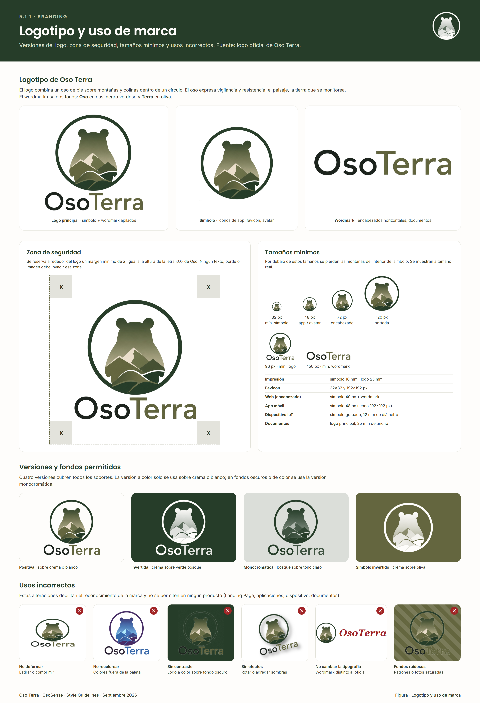

<em>Figura 5.1. Logotipo de Oso Terra: versiones, zona de seguridad, tamaños mínimos y usos incorrectos.</em>

#### Colors

La paleta se midió directamente del logo y se organiza en tres capas: cinco colores de marca, una escala tonal derivada de cada verde y un conjunto de colores semánticos para los niveles de salinidad. La escala tonal permite mapear los tokens a los roles de Material 3 (primario, contenedores, superficies, contornos) sin salirse de la identidad.

| Token | Hex | Rol |
|---|---|---|
| Verde bosque (`forest`) | `#263D29` | Color primario: barra lateral, botones principales, encabezados. |
| Verde oliva (`olive`) | `#64663F` | Color secundario: acentos, enlaces, «Terra» del wordmark. |
| Oliva claro (`olive-light`) | `#797A58` | Decorativo y texto grande; nunca texto de tamaño normal. |
| Casi negro verdoso (`ink`) | `#1D241E` | Texto principal. |
| Crema (`cream`) | `#FEFDFB` | Fondo y superficies (el «blanco» de la identidad, en versión cálida). |
| Azul de foco (`focus`) | `#175CAA` | Anillo de foco de teclado; el único azul de la interfaz de software. |

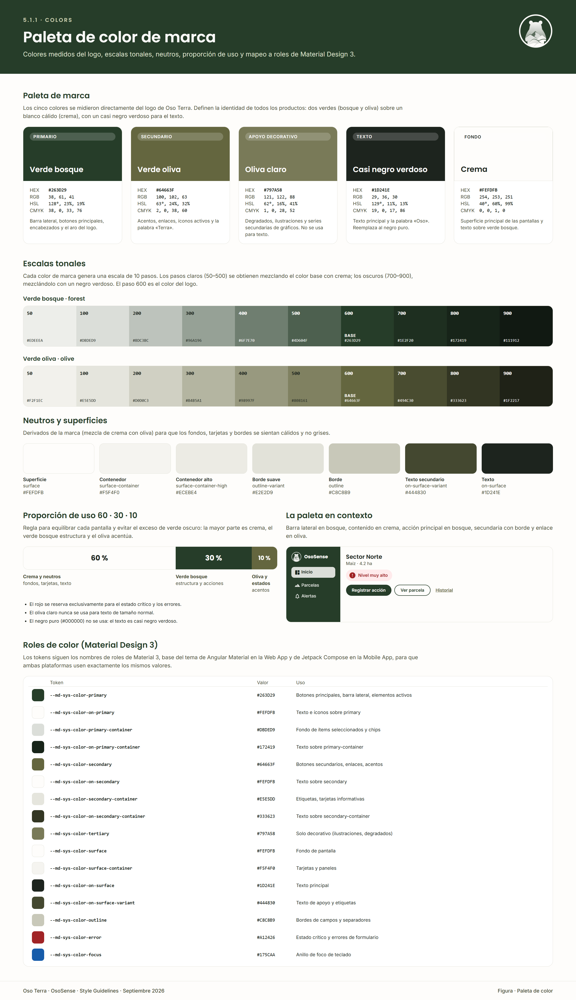

<em>Figura 5.2. Paleta de marca, escalas tonales de los dos verdes y mapeo a roles de Material 3.</em>

**Contraste.** Todas las combinaciones de texto se calcularon con la fórmula de luminancia relativa de WCAG 2.1. El criterio es de 4.5 : 1 como mínimo para texto normal y de 3 : 1 para texto grande y componentes de interfaz.

| Combinación | Ratio | Resultado |
|---|---|---|
| Texto `ink` sobre `cream` | 15.61 : 1 | AA y AAA |
| `cream` sobre verde bosque | 11.59 : 1 | AA y AAA |
| Verde oliva sobre `cream` | 5.88 : 1 | AA |
| Anillo de foco `focus` sobre `cream` | 6.56 : 1 | AA (componentes ≥ 3 : 1) |
| Oliva claro sobre `cream` | 4.36 : 1 | Solo texto grande (≥ 3 : 1) |

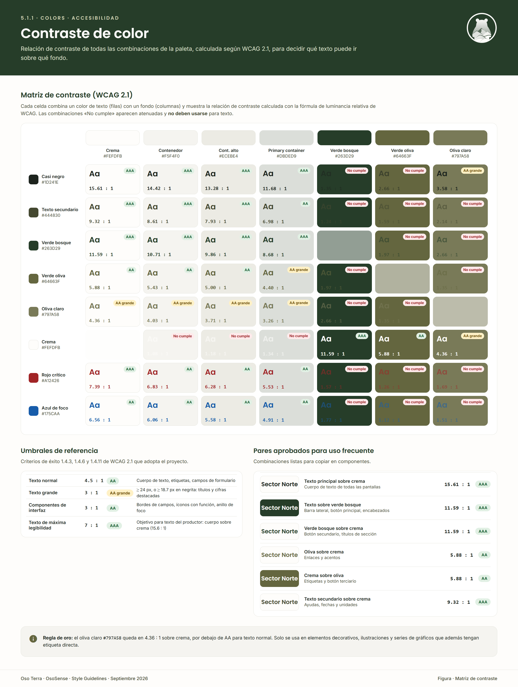

<em>Figura 5.3. Matriz de contraste WCAG 2.1 entre los colores de marca y las superficies.</em>

**Colores de estado.** Los niveles de salinidad necesitan colores propios que no dependan de la marca, porque comunican riesgo. Los cuatro niveles se calculan como la relación entre la conductividad eléctrica del extracto de saturación (ECe) y el umbral de tolerancia del cultivo, según Maas y Hoffman (1977): **normal** por debajo de 0,8 veces el umbral, **en vigilancia** entre 0,8 y 1,0, **alto** entre 1,0 y 1,25 y **muy alto** por encima de 1,25. La Web App ya aplica esta regla.

| Nivel | Ícono | Texto | Fondo | Cuándo |
|---|---|---|---|---|
| Normal | `check_circle` | `#1B6234` | `#E1F0E4` | ECe < 0,8 × umbral |
| En vigilancia | `visibility` | `#70510B` | `#FFF1C6` | 0,8 × umbral ≤ ECe ≤ 1,0 × umbral |
| Alto | `warning` | `#85440D` | `#FFF0DD` | 1,0 × umbral < ECe ≤ 1,25 × umbral |
| Muy alto (crítico) | `error` | `#A12426` | `#FFEAEB` | ECe > 1,25 × umbral |
| Sin lectura | `help_outline` | `#3E5150` | `#E6EBEA` | El dispositivo aún no reporta |

Como los estados se distinguen también por ícono y por texto, la lectura no depende de percibir el color. Para comprobarlo, el tablero incluye una simulación de deficiencias de visión del color (protanopia, deuteranopia y tritanopia, con el modelo de Machado et al., 2009).

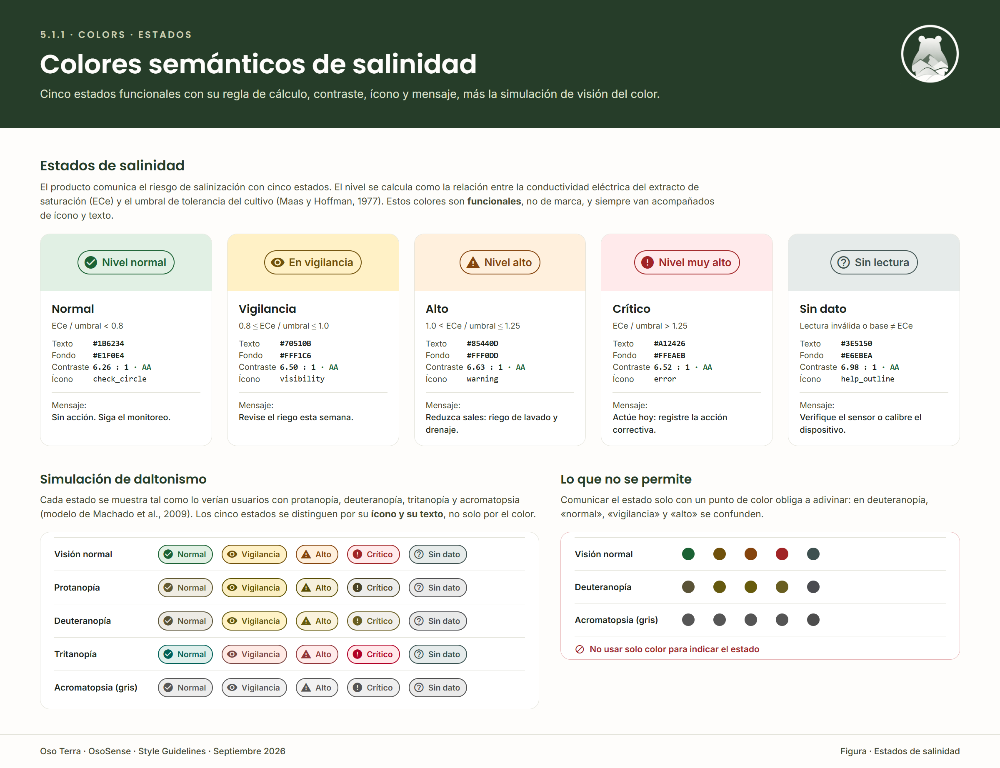

<em>Figura 5.4. Colores de estado de salinidad, regla de cálculo y simulación de deficiencias de visión del color.</em>

#### Typography

Se combinan dos familias sans-serif autoalojadas con `@fontsource`, sin depender de un CDN: en zonas de conectividad intermitente una fuente que no carga degrada toda la interfaz. **Poppins**, geométrica y de trazo redondeado, se acerca al wordmark y da carácter a títulos y cifras. **Inter**, diseñada para pantallas, mantiene la legibilidad en textos densos, tablas y formularios. Ambas cubren los caracteres del español latinoamericano y del inglés.

El prototipo actual declara `Segoe UI, Arial, sans-serif`; como Segoe UI solo existe en Windows, en Android, iOS y macOS se vería con una fuente de reemplazo, por lo que la adopción de Poppins e Inter es *a adoptar* en el tema de la Web App.

| Estilo | Familia y peso | Tamaño / interlínea | Uso |
|---|---|---|---|
| Display | Poppins 600 | 40 / 48 px | Titular de portada del Landing Page. |
| Heading 1 | Poppins 600 | 32 / 40 px | Título de pantalla. |
| Heading 2 | Poppins 600 | 24 / 32 px | Título de sección. |
| Heading 3 | Poppins 600 | 20 / 28 px | Título de tarjeta o panel. |
| Body Large | Inter 400 | 18 / 28 px | Mensajes de alerta y ayudas al productor. |
| Body | Inter 400 | 16 / 24 px | Texto base de toda la interfaz. |
| Body Small | Inter 400 | 14 / 20 px | Texto secundario y tablas densas. |
| Label | Inter 600 | 14 / 20 px | Botones, pestañas y campos. |
| Caption | Inter 500 | 12 / 16 px | Unidades, fechas y notas al pie. |
| Data | Poppins 600 | 40 / 44 px | Cifra de salinidad y métricas grandes, con números tabulares. |

Reglas complementarias: entre 45 y 75 caracteres por línea en texto corrido; el cuerpo no baja de 16 px, en consideración a la edad promedio del segmento 1; las cifras usan números tabulares para alinear columnas; el español ocupa hasta un tercio más de ancho que el inglés, por lo que se reserva un 30 % de espacio adicional en botones y etiquetas.

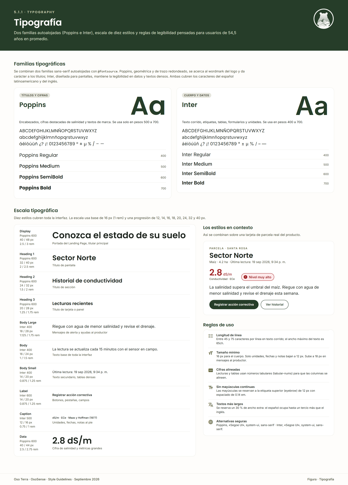

<em>Figura 5.5. Familias tipográficas, escala tipográfica de diez estilos y ejemplo en contexto.</em>

#### Spacing

El espaciado sigue una **base de 8 px**, con 4 px como unidad mínima. Usar solo estos valores mantiene el ritmo visual y hace que la Web App, la Mobile App y el Landing Page coincidan. El prototipo ya usa múltiplos de 0,25 rem, de modo que la adopción es directa.

| Token | Valor | Uso |
|---|---|---|
| `space-1` | 4 px | Separación entre ícono y texto. |
| `space-2` | 8 px | Entre elementos relacionados (píldora, etiqueta). |
| `space-3` | 12 px | Relleno de chips y campos compactos. |
| `space-4` | 16 px | Relleno base de tarjetas y separación de columnas. |
| `space-5` | 24 px | Relleno de paneles y separación entre tarjetas. |
| `space-6` | 32 px | Separación entre secciones de una pantalla. |
| `space-7` | 48 px | Márgenes grandes y controles cómodos. |
| `space-8` / `space-9` | 64 / 96 px | Bloques y secciones del Landing Page. |

**Forma y elevación.** Los radios se reducen de las cinco variantes actuales del prototipo (6, 8, 12, 14 y 16 px) a `radius-sm` de 8 px (campos y botones cuadrados), `radius-md` de 12 px, `radius-lg` de 16 px (tarjetas y diálogos), `radius-pill` para botones y píldoras de estado, y el círculo para avatares. La elevación tiene cuatro niveles, del borde plano a la sombra de diálogo modal, con sombras teñidas del casi negro verdoso y nunca negro puro.

**Grilla.** Los puntos de quiebre coinciden con los que ya implementa la Web App (700, 900 y 1100 px). El ancho máximo del contenido es de 1500 px.

| Rango | Columnas | Gutter | Margen |
|---|---|---|---|
| ≤ 700 px (móvil) | 4 | 16 px | 16 px |
| 701–900 px (tablet) | 8 | 16 px | 24 px |
| ≥ 901 px (escritorio) | 12 | 24 px | 40 px |

**Objetivos táctiles.** 44 × 44 px como mínimo en web (WCAG 2.5.5) y 48 × 48 dp en Android, con al menos 8 px entre objetivos y filas de tabla de 56 px, para que el toque no caiga en el elemento vecino.

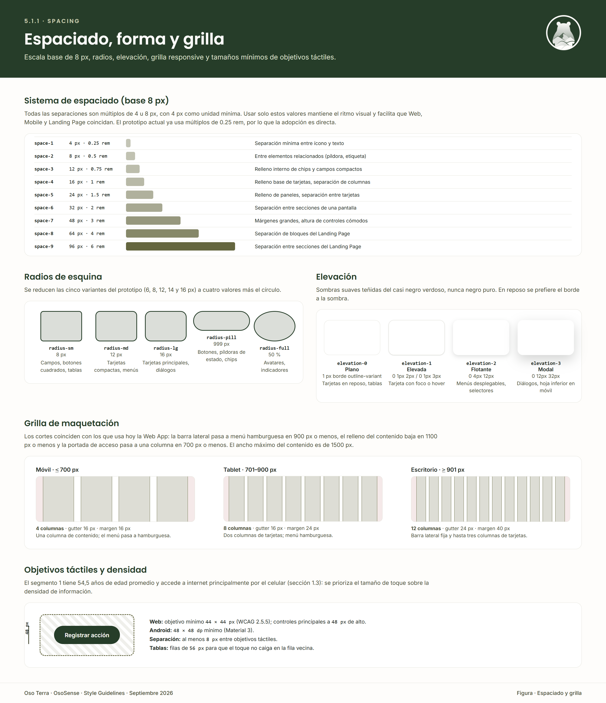

<em>Figura 5.6. Escala de espaciado de 8 px, radios, elevación, grilla responsive y objetivos táctiles.</em>

#### Iconography

Se usa una sola familia, **Material Icons** en versión rellena, autoalojada con `@fontsource/material-icons`. Los íconos son ligaduras de texto que heredan el color del contexto, por lo que no requieren imágenes. El tamaño base es de 24 px, con 18 px dentro de píldoras, 32 px en tarjetas y estados y 48 px en estados vacíos.

Cuatro reglas gobiernan su uso: todo ícono con función lleva texto visible o una etiqueta accesible (`aria-label`); no se recolorean fuera de la paleta, sino que heredan el color del texto o del estado; no se mezclan íconos rellenos con íconos de contorno ni con ilustraciones de otra familia; y los íconos de estado de salinidad (`check_circle`, `visibility`, `warning`, `error`, `help_outline`) siempre acompañan al texto del estado. El catálogo del tablero agrupa los íconos por función: navegación, estados, medición y acciones.

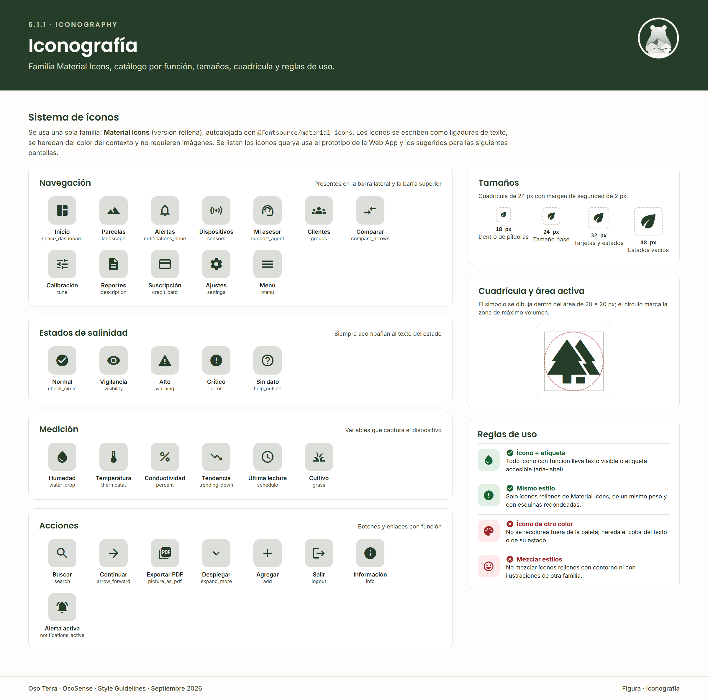

<em>Figura 5.7. Sistema de íconos: catálogo por función, tamaños, cuadrícula y reglas de uso.</em>

#### Tone of voice

Las cuatro dimensiones de tono que exige el enunciado se fijaron a partir de las entrevistas de la sección 2.2.3 y del perfil de usuarios de la sección 1.3.

| Dimensión | Posición | Sustento |
|---|---|---|
| Divertido / Serio | **Serio** | Se comunican riesgos de pérdida de cosecha, y el asesor sustenta recomendaciones profesionales. Sin bromas ni exclamaciones. |
| Formal / Casual | **Casual cercano** | Lenguaje cotidiano y frases cortas, sin jerga técnica: los productores entrevistados piden indicaciones claras y mediciones explicadas de forma simple. Trato de «usted». |
| Respetuoso / Irreverente | **Respetuoso** | Usuarios de mayor edad con desconfianza inicial hacia un sensor de bajo costo; nunca se culpa al usuario. |
| Entusiasta / Sereno | **Sereno** | Una alerta crítica no debe alarmar, sino informar el hecho y la acción a tomar. El entusiasmo se reserva para logros, como una salinidad que baja. |

La personalidad es única, pero el nivel de detalle cambia según quién lee: al **productor** se le habla con frases de hasta 20 palabras y valores cualitativos, con la medida en dS/m disponible bajo demanda; al **asesor técnico**, con lenguaje profesional y dato crudo (ECe, umbral del cultivo, tendencia); y al **visitante del Landing Page**, con titulares breves centrados en el beneficio y una llamada a la acción por segmento.

| Contexto | Así sí | Así no |
|---|---|---|
| Alerta crítica | «Salinidad muy alta en Sector Norte. Riegue con agua de menor salinidad y revise el drenaje hoy.» | «¡¡ALERTA!! EC 6.2 dS/m excede el umbral ECe del cultivo!!!» |
| Estado vacío | «Aún no hay lecturas. Conecte su dispositivo para empezar a ver la salinidad de esta parcela.» | «Error 404: no se encontraron datos de telemetría.» |
| Error de formulario | «La contraseña necesita al menos 12 caracteres. Agregue unos más y vuelva a intentar.» | «Contraseña inválida. Corrija el campo.» |
| Logro | «La salinidad de La Quebrada bajó a nivel normal. El lavado de sales funcionó.» | «¡¡Felicidades!! ¡Lo lograste, campeón!» |

Además, el producto usa **una sola palabra por concepto**: *parcela* (no lote ni terreno), *lectura* (no muestra ni telemetría), *dispositivo* (no nodo ni gateway), *acción correctiva* (no remediación) y los estados cualitativos *normal, en vigilancia, alto y muy alto*. Los botones llevan un verbo en infinitivo y un objeto («Registrar acción»), los títulos tienen como máximo cinco palabras y sin punto final, las fechas siguen el formato local y la unidad se separa de la cifra por un espacio (2.8 dS/m).

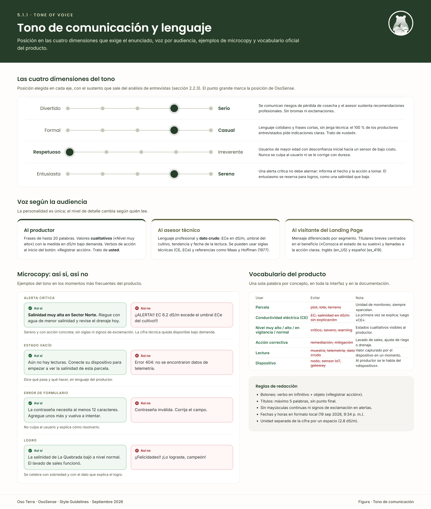

<em>Figura 5.8. Tono de comunicación: las cuatro dimensiones, voz por audiencia, microcopy y vocabulario oficial.</em>

### 5.1.2. Web, Mobile and IoT Style Guidelines

Sobre la base común de la sección 5.1.1, esta sección fija los estándares visuales y de interacción propios de cada plataforma: la biblioteca de componentes web, las interfaces responsive y el Landing Page, la aplicación móvil Android, la interfaz física del dispositivo IoT, la visualización de datos y las reglas de accesibilidad, idioma y movimiento que atraviesan a todas.

#### Web: componentes

La Web App está construida con Angular Material, por lo que los componentes se personalizan con los tokens de la guía en lugar de crear componentes desde cero. Cada componente define sus estados (normal, hover, presionado, foco y deshabilitado) y todos comparten el mismo anillo de foco.

| Componente | Reglas principales |
|---|---|
| Botones | Un solo botón principal (relleno verde bosque) por pantalla o diálogo; acciones secundarias con contorno; acciones destructivas en el rojo de estado, con confirmación. Altura de 48 px. |
| Campos de formulario | Etiqueta visible siempre (no solo *placeholder*), texto de ayuda, error en `#A12426` con ícono y mensaje que explica cómo corregir. |
| Tarjetas y píldoras | Radio de 16 px, borde de 1 px en reposo; la píldora de estado combina ícono, texto y color. |
| Alertas y mensajes | Cuatro tipos (información, vigilancia, alto y muy alto) con ícono, título y una acción; nunca solo color. |
| Navegación | Barra lateral verde bosque en escritorio, con ítem activo resaltado; menú hamburguesa en 900 px o menos. |
| Tablas | Filas de 56 px, encabezado fijo, estado con píldora y acción al final de la fila. |
| Diálogos | Un título, un mensaje y como máximo dos acciones; el botón principal a la derecha. |
| Estados vacíos y de carga | Ícono, explicación de qué falta y una acción; esqueletos (*skeletons*) en lugar de rueda de espera. |

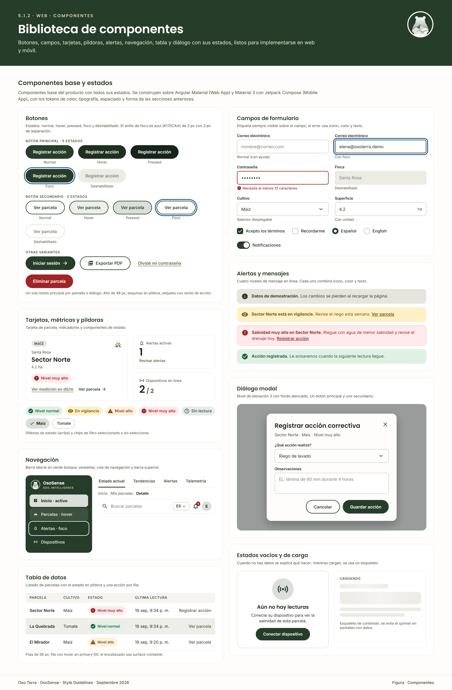

<em>Figura 5.9. Biblioteca de componentes web: botones, campos, tarjetas, alertas, navegación, tabla, diálogo y estados vacíos.</em>

#### Web: interfaces responsive y Landing Page

Un solo diseño se adapta a tres anchos, con los cortes que ya implementa la Web App, de modo que la guía describe lo que existe y no obliga a reescribir el prototipo.

| Rango | Comportamiento |
|---|---|
| ≤ 700 px | Una columna; la portada de acceso oculta el texto de marca y deja solo el formulario. Relleno de 16 px (*a adoptar*). |
| 701–900 px | Menú hamburguesa; la barra lateral pasa a un cajón deslizable. Relleno de 24 px y dos columnas de tarjetas. |
| 901–1100 px | Barra lateral permanente; dos o tres columnas de tarjetas. |
| ≥ 1101 px | Barra lateral permanente y relleno de 32 px arriba y 40 px a los lados; contenido de hasta 1500 px. |

Los componentes conservan su función al reducir el ancho: las tablas pasan a lista de tarjetas con la píldora de estado visible, las pestañas se desplazan en horizontal, los diálogos ocupan la pantalla completa en móvil, los gráficos mantienen la relación 16:9 y muestran una serie a la vez, y el selector de idioma EN / ES permanece en la barra superior.

El **Landing Page** sigue la misma identidad: encabezado fijo con el logo invertido y cuatro destinos como máximo; portada en verde bosque con titular Display y **una llamada a la acción por segmento** (productores y asesores); secciones separadas por 96 px sobre fondo crema, alternadas con paneles de crema oscuro; y botones que llevan a la vista correspondiente de la Web App o a la tienda de la aplicación móvil.

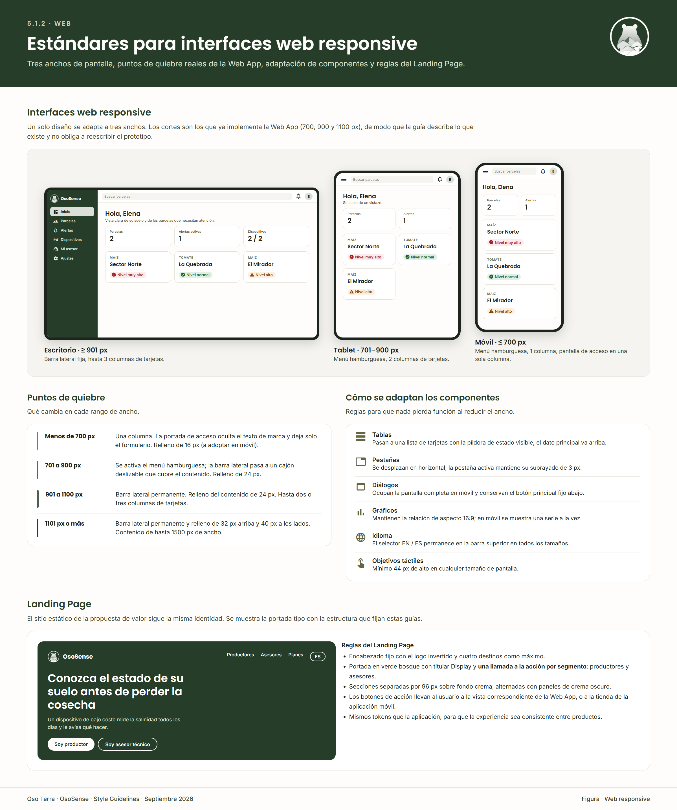

<em>Figura 5.10. Interfaces web responsive: tres anchos, puntos de quiebre, adaptación de componentes y Landing Page.</em>

#### Mobile: aplicación Android

La Mobile App se construye de forma nativa con Kotlin y Jetpack Compose (Material 3, `minSdk` 24) y usa los mismos tokens que la Web App: los colores, la tipografía y las formas se declaran una vez en el tema de Compose. Se prioriza la pantalla de teléfono (clase de tamaño compacta, menos de 600 dp).

| Aspecto | Estándar |
|---|---|
| Tema | Los colores de marca se convierten en un `ColorScheme` claro de Material 3 (`primary` = verde bosque, `tertiary` = oliva claro, `error` = `#A12426`). |
| Tipografía | Escala de Material 3 con Poppins (Display, Headline y Title) e Inter (Body, Label), con tamaños en `sp`. |
| Medidas | Márgenes laterales de 16 dp; barra superior de 52 dp; navegación inferior de 66 dp con tres a cinco destinos; objetivo táctil de 48 dp. |
| Notificaciones | Un canal de Android por severidad, con importancia y sonido propios: «Nivel muy alto» con vibración y aviso emergente (*heads-up*); «En vigilancia» con sonido discreto; «Sin lectura» como resumen. |
| Sin conexión | Banner superior «Sin conexión» con la hora de la última lectura; se muestran los últimos datos guardados. |

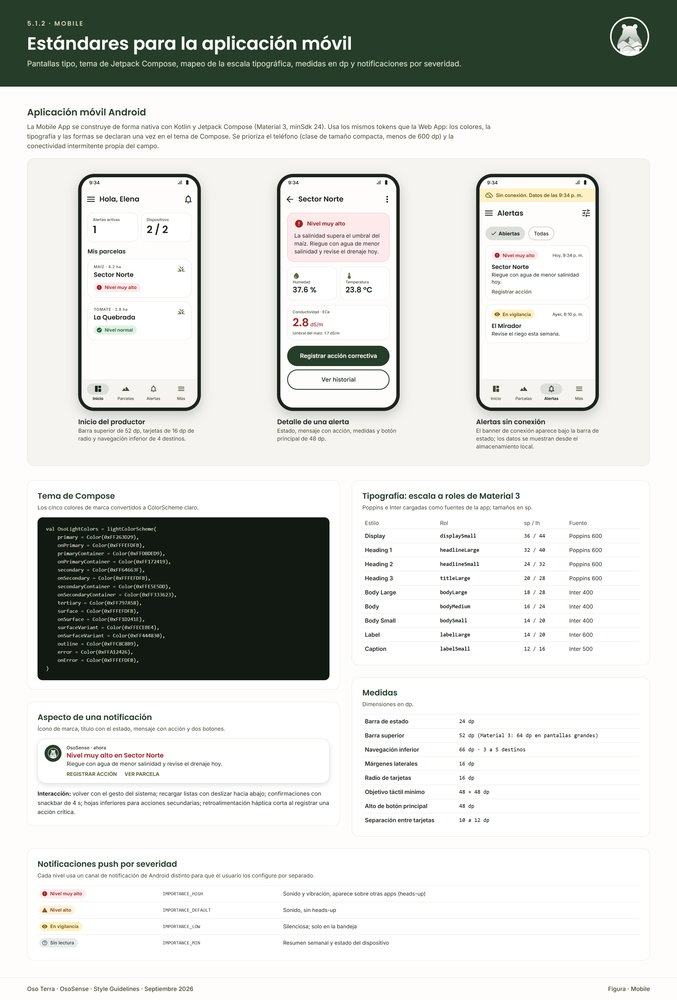

<em>Figura 5.11. Estándares para la aplicación móvil Android: pantallas, tema de Compose, tipografía, medidas y notificaciones por severidad.</em>

#### IoT: interfaz física del dispositivo

El dispositivo de campo (ESP32 con sonda de conductividad eléctrica, humedad y temperatura) no tiene pantalla en el alcance actual: comunica su estado con **un LED RGB, un botón y la carcasa**. Las dimensiones y el aspecto son una propuesta de diseño que se validará con el prototipo físico.

**Carcasa.** Caja de 90 × 60 mm con sonda de 150 mm, en plástico ABS/ASA estabilizado contra rayos UV, verde bosque mate (`#263D29`), con el símbolo de Oso Terra grabado en crema, panel solar en la tapa, difusor del LED en policarbonato translúcido, sellado IP65 y esquinas redondeadas de 12 mm.

**LED de estado.** Cada nivel se distingue por **color y por número de destellos**, de modo que sigue siendo reconocible con daltonismo o con luz solar intensa.

| Estado | Color | Patrón | Significado |
|---|---|---|---|
| Normal | Verde | Un destello corto cada 10 s | El dispositivo está bien; ahorra batería. |
| En vigilancia | Ámbar | Un destello cada 5 s | Conviene revisar el riego esta semana. |
| Alto | Naranja | Dos destellos cada 5 s | Reducir sales: riego de lavado y drenaje. |
| Muy alto | Rojo | Tres destellos rápidos cada 3 s | Requiere acción hoy; el aviso llega también a la app. |
| Sin conexión | Blanco | Un destello largo cada 5 s | Guarda lecturas en memoria local y las sincroniza después. |
| Emparejamiento | Azul | Parpadeo continuo de 1 s | Modo de vinculación con la app; dura 2 minutos. |

**Botón único.** Un solo control evita errores en campo. La duración de la pulsación define la acción y el LED siempre confirma lo que ocurrió: la pulsación corta (menos de 1 s) toma una lectura y la envía; la larga (3 s) activa el emparejamiento; la muy larga (10 s) restablece la configuración de fábrica, con tres destellos rojos de aviso antes de reiniciar.

**Puesta en marcha.** Cinco pasos sin herramientas, cada uno con respuesta visible del LED: ubicar un punto representativo de la parcela, clavar la sonda hasta la línea de suelo, encender con el botón (luz blanca), emparejar con la app (parpadeo azul) y verificar (LED verde con lectura válida).

> [!NOTE]
> Las dimensiones, materiales y patrones del dispositivo son una propuesta del equipo y se ajustarán cuando exista el prototipo físico (sección 5.6).

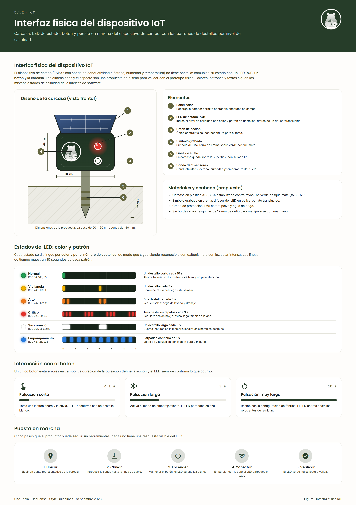

<em>Figura 5.12. Interfaz física del dispositivo IoT: carcasa, estados del LED, interacción con el botón y puesta en marcha.</em>

#### Visualización de datos

Como el producto existe para mostrar cómo evoluciona la salinidad, la guía define cómo se dibuja la conductividad eléctrica frente al umbral de cada cultivo, con la misma paleta y los mismos estados. Las reglas son:

- **Línea para series de tiempo** y barras para comparar parcelas en un instante; sin gráficos circulares ni en 3D.
- **Eje Y desde cero**, con la unidad visible en el eje (ECe, dS/m), para que la altura sea proporcional al valor.
- **Umbral del cultivo siempre visible**, como línea discontinua etiquetada, y bandas de fondo con los cuatro niveles de salinidad.
- **Etiqueta directa** en cada serie y leyenda aparte solo con más de dos series.
- **Color, trazo y marca**: cada serie se distingue por color y por tipo de línea; los puntos de estado usan el color del nivel con borde blanco.
- **Alternativa en tabla** (fecha, ECe y nivel) y un resumen en texto para lector de pantalla en cada gráfico.
- **Máximo cuatro series**; más series se resuelven con filtros o con el comparador de parcelas del asesor.

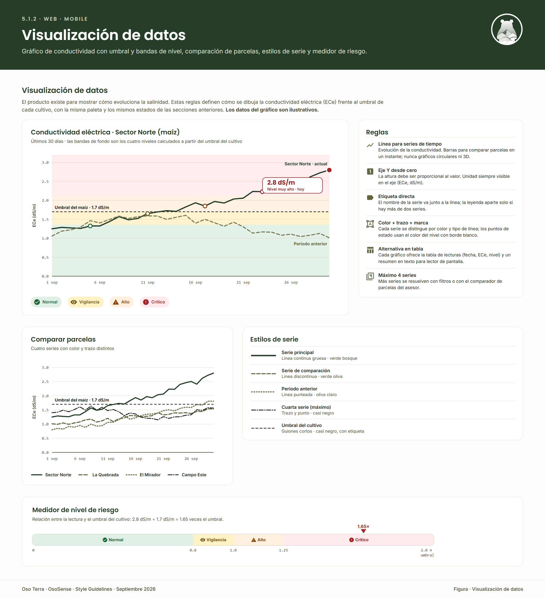

<em>Figura 5.13. Visualización de datos: gráfico con umbral y bandas de nivel, comparación de parcelas, estilos de serie y medidor de riesgo. Datos ilustrativos.</em>

#### Accesibilidad, idioma y movimiento

**Accesibilidad (WCAG 2.1, nivel AA).** El enunciado exige atributos ARIA en el Landing Page y en las aplicaciones web. Las reglas agrupan los cuatro principios de WCAG:

| Principio | Reglas |
|---|---|
| Perceptible | Contraste de 4.5 : 1 en texto y 3 : 1 en componentes; el estado nunca se comunica solo con color; texto redimensionable hasta 200 % sin perder contenido; alternativa en tabla para cada gráfico. |
| Operable | Todo se maneja con teclado, en orden lógico; anillo de foco azul de 3 px siempre visible; objetivos táctiles de 44 px; sin animaciones que parpadeen más de tres veces por segundo. |
| Comprensible | Idioma de la página declarado; mensajes de error que explican cómo corregir; etiquetas visibles en todos los campos; navegación consistente. |
| Robusto | HTML semántico y roles ARIA solo donde hacen falta; nombres accesibles en botones con ícono; cambios de estado anunciados con `aria-live`; verificación con NVDA y TalkBack en cada sprint (*a adoptar*). |

La Web App ya incorpora `aria-label` en la navegación, la búsqueda, el botón de menú y la campana de alertas, `aria-current="page"` en el ítem activo, `aria-controls` en el menú lateral, un enlace «Saltar al contenido» que apunta a `<main id="main-content">`, `role="alert"` en los errores de formulario y una regla `prefers-reduced-motion`. Los anuncios con `aria-live` para los cambios de estado son *a adoptar*.

**Internacionalización.** La interfaz está disponible en inglés (en_US, idioma predeterminado, como pide el enunciado) y en español latinoamericano (es_419), con un selector EN / ES en la barra superior. Todos los textos viven en archivos de traducción y un script valida que ambos idiomas tengan las mismas claves. Las fechas y horas usan el formato de cada idioma y las unidades se mantienen (2.8 dS/m, 4.2 ha, 23.8 °C). Por la expansión del texto en español, los botones reservan un 30 % de ancho adicional.

**Movimiento.** El movimiento explica cambios de estado y nunca es decorativo: 150 ms para interacciones mínimas (hover, foco, pestañas), 250 ms para transiciones (cajón de navegación, menús) y 400 ms para diálogos y hojas inferiores, con la curva `cubic-bezier(.2, 0, 0, 1)` de Material 3. Con la preferencia del sistema «reducir movimiento» todas las transiciones pasan a 0 ms y no hay animaciones automáticas.

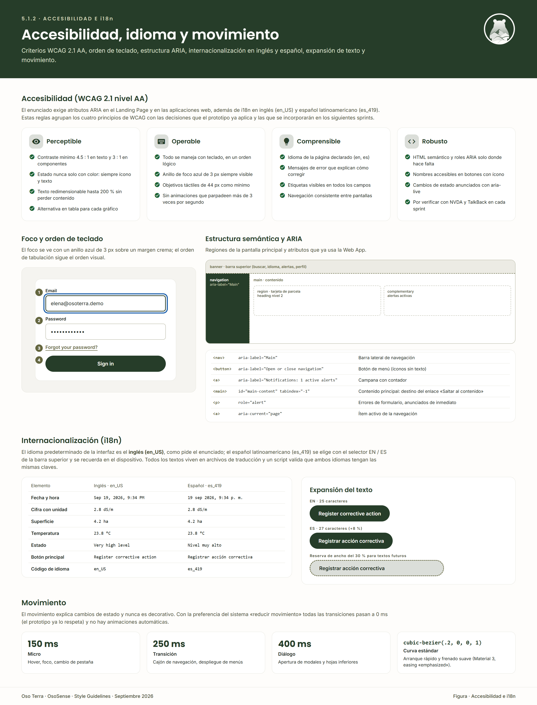

<em>Figura 5.14. Accesibilidad e i18n: principios WCAG, orden de teclado, estructura ARIA, expansión de texto y movimiento.</em>

## 5.2. Information Architecture

### 5.2.1. Organization Systems

### 5.2.2. Labeling Systems

### 5.2.3. SEO Tags and Meta Tags

### 5.2.4. Searching Systems

### 5.2.5. Navigation Systems

## 5.3. Landing Page UI Design

El Landing Page es el primer contacto de productores y asesores técnicos con OsoSense, por lo que su propuesta de UI se pensó como un recorrido de persuasión: primero el problema (la salinidad), después la respuesta (el sensor y la plataforma), luego la forma de adoptarla (proceso y planes) y, al final, la confianza (preguntas frecuentes y equipo) antes del llamado a la acción. Las decisiones de diseño y de arquitectura de información se tradujeron en tres reglas:

- **Una sola página con anclas.** Cada destino del menú (Ecosistema, Capacidades, Planes, FAQ, Equipo y Contacto) es una sección de la misma página; así el visitante nunca pierde el contexto y el menú funciona como índice.
- **Un bloque, una idea.** Cada sección responde una pregunta del visitante con un título H2, una bajada corta y un único patrón de contenido (datos, tarjetas, pasos, planes o acordeón).
- **La acción siempre a la vista.** El botón *Probar Gratis* permanece en el encabezado fijo y cada tramo del recorrido termina en un botón de avance (*Conocer solución*, *Conocer Más*, *Elegir plan*, *Comenzar ahora*).

El diseño se elaboró en Figma en tres páginas: **Design System** (estilos de color y de texto, y componentes), **Wireframes** y **Mock-ups**, cada una con la versión Desktop Web Browser (1440 px) y Mobile Web Browser (390 px). El contenido es el mismo que muestra el Landing Page implementado en su versión en español (es_419).

### 5.3.1. Landing Page Wireframe

Los wireframes fijan la estructura, la jerarquía y el orden de lectura sin distraer con color ni fotografía: todo está en escala de grises, las imágenes se representan con cajas punteadas y se retiraron sombras y degradados. La página se organiza en once bloques, siempre en el mismo orden en ambos anchos:

| # | Bloque | Pregunta del visitante que responde | Patrón de contenido |
|---|---|---|---|
| 0 | Encabezado | ¿Dónde estoy y a dónde puedo ir? | Logo, menú de anclas, selector EN / ES y botón *Probar Gratis* |
| 1 | Hero | ¿Qué es OsoSense? | Carrusel de fotos con eyebrow, titular H1, bajada y botón principal |
| 2 | El impacto de la salinidad | ¿Por qué me debería importar? | Tres datos con ícono y una tarjeta de historia con foto |
| 3 | Protege tu inversión agrícola | ¿Qué gano? | Tres beneficios en un bloque dividido: alertas, ahorro y respaldo sin conexión |
| 4 | Nuestras capacidades | ¿Qué hace la solución? | Foto del sensor con el indicador de CEe y cuatro capacidades en grilla 2 × 2 |
| 5 | Proceso de implementación | ¿Cómo empiezo? | Cuatro pasos numerados alrededor de una foto de campo |
| 6 | Planes a tu medida | ¿Cuánto cuesta? | Tres tarjetas de plan con el plan recomendado destacado |
| 7 | Preguntas frecuentes | ¿Y si…? | Acordeón de cuatro preguntas |
| 8 | Equipo | ¿Quién está detrás? | Tarjetas con los siete integrantes |
| 9 | Llamado a la acción | ¿Qué hago ahora? | Banner con titular y botón *Comenzar ahora* |
| 10 | Pie de página | ¿Dónde encuentro lo demás? | Marca, descripción y tres columnas de enlaces |

<em>Figura 5.15. Wireframe Desktop Web Browser (1/4): encabezado, hero y bloque de impacto de la salinidad.</em>

<em>Figura 5.16. Wireframe Desktop Web Browser (2/4): beneficios, capacidades y proceso de implementación.</em>

<em>Figura 5.17. Wireframe Desktop Web Browser (3/4): planes y preguntas frecuentes.</em>

<em>Figura 5.18. Wireframe Desktop Web Browser (4/4): equipo, llamado a la acción y pie de página.</em>

**Principios y elementos de diseño aplicados**

- **Jerarquía:** un único H1 en el hero; cada sección abre con un H2 centrado y una bajada en gris, y dentro de las tarjetas el título pesa más que la descripción. El ojo encuentra primero el titular, luego el dato y al final el detalle.
- **Proximidad y agrupación:** los elementos relacionados comparten tarjeta (ícono, título y texto de cada dato; precio y lista de cada plan) y las secciones se separan con 96 px de aire vertical, de modo que el cambio de tema se percibe sin necesidad de líneas.
- **Alineación y grilla:** contenedor de 1296 px con márgenes de 72 px y columnas que se reparten en 2, 3 o 4 tarjetas según el bloque. El proceso usa una composición simétrica (pasos 01 y 03 a la izquierda, 02 y 04 a la derecha) para que la lectura siga el orden numérico.
- **Contraste y énfasis:** solo un botón por bloque tiene relleno; los secundarios van con contorno. En los planes, el plan *Productor* se destaca con fondo, sombra y la etiqueta *Más Popular*.
- **Repetición:** el mismo botón en píldora con círculo de flecha, las mismas tarjetas redondeadas y el mismo encabezado de sección se repiten en toda la página, lo que reduce la carga de aprendizaje.

**Diseño inclusivo**

- Texto base de 16 px y bajadas de 14 px como mínimo, pensando en la edad del segmento de productores (sección 1.3).
- Objetivos táctiles de al menos 40 px (botones, flechas del carrusel y menú) y separación suficiente entre enlaces del menú móvil.
- Los íconos siempre van acompañados de texto; ningún dato depende solo del color o de una imagen.
- El selector de idioma EN / ES está en el encabezado desde la primera vista, porque el producto se ofrece en en_US y es_419.
- En la implementación, la navegación usa `aria-label`, `aria-labelledby` por sección, `aria-expanded` y `aria-controls` en el menú móvil, `aria-pressed` en el selector de idioma, texto alternativo en las fotos informativas y `alt=""` en las decorativas, y respeta `prefers-reduced-motion`.

**Arquitectura de información**

- **Organización:** esquema por tópicos en secuencia narrativa (problema → beneficio → solución → proceso → precio → dudas → confianza → acción).
- **Etiquetado:** etiquetas de una palabra en el menú, iguales al título de la sección a la que llevan, y verbos de acción en los botones (*Conocer*, *Elegir*, *Comenzar*, *Probar*).
- **Navegación:** menú global de anclas en un encabezado fijo, botón de llamada a la acción siempre visible y un pie de página con navegación secundaria agrupada en Empresa, Soluciones y Ayuda.

**Versión Mobile Web Browser**

En 390 px la estructura se conserva y solo cambia la disposición: el menú se convierte en un botón de hamburguesa junto a *Probar Gratis*, el selector de idioma pasa al menú desplegable, todas las grillas se apilan en una columna, el titular baja de 58 a 30 px, los pasos del proceso se leen en lista vertical debajo de la foto y los planes, el equipo y el pie de página se muestran uno debajo de otro. Los márgenes laterales se reducen a 16 px para ganar ancho útil.

<em>Figura 5.19. Wireframe Mobile Web Browser (390 px), leído de izquierda a derecha en tres tramos.</em>

### 5.3.2. Landing Page Mock-up

Los mock-ups llevan los wireframes a alta fidelidad con el **Design System** del Landing Page, construido en Figma como estilos reutilizables a partir de los valores de la página implementada:

| Categoría | Tokens |
|---|---|
| Color de acción | Primary/600 `#059669` (botones, íconos, números del proceso), Primary/700 `#047857` (etiquetas y estados *hover*), Primary/800 `#065F46` |
| Superficies verdes | Primary/50 `#F0FDF4` (tarjetas destacadas y plan recomendado), Primary/100 `#DCFCE7` (etiquetas) |
| Neutros | Neutral/900 `#111827` (títulos), Neutral/600 `#4B5563` y Neutral/500 `#6B7280` (texto secundario), Neutral/200 `#E5E7EB` (bordes), Neutral/50 `#F9FAFB` (pie de página), blanco |
| Marca | Brand/Forest `#263D29` y Brand/Olive `#64663F`, presentes en el logo |
| Tipografía | Plus Jakarta Sans: Display 58 px ExtraBold, H2 36 px Bold, H3 20 px Bold, H4 18 px Bold, cuerpo 18 / 16 / 14 px Regular, botón 14 px SemiBold, eyebrow 12 px Bold en mayúsculas, precio 36 px ExtraBold |
| Forma | Botones en píldora con círculo de flecha, tarjetas con radio de 20 a 28 px y borde de 1 px, hero y banner con radio de 32 px |
| Fotografía | Paisajes de valles costeros, sensor en campo y trabajo de agrónomos, con una capa verde oscura sobre la foto para asegurar la lectura del texto blanco |

<em>Figura 5.20. Design System del Landing Page: estilos de color, escala tipográfica y componentes.</em>

<em>Figura 5.21. Mock-up Desktop Web Browser (1/4): encabezado con el logo de Oso Terra, hero con fotografía del valle y bloque de impacto.</em>

<em>Figura 5.22. Mock-up Desktop Web Browser (2/4): beneficios, capacidades con el indicador de CEe y proceso de implementación.</em>

<em>Figura 5.23. Mock-up Desktop Web Browser (3/4): planes con el plan recomendado destacado y preguntas frecuentes.</em>

<em>Figura 5.24. Mock-up Desktop Web Browser (4/4): equipo, banner de llamado a la acción y pie de página.</em>

**Cómo se aplican los principios en el mock-up**

- **El color guía la acción.** El verde esmeralda se reserva para lo que se puede pulsar o lo que conviene notar (botones, íconos, números de paso, plan recomendado); el resto de la página es blanco y gris, por lo que la mirada va directo a las acciones.
- **La fotografía cuenta la historia.** El hero muestra el valle costero con el sensor instalado; el bloque de impacto contrapone suelo salinizado y cultivo sano; el proceso muestra a agrónomos en campo. Son escenas que el productor reconoce como propias.
- **El dato técnico se vuelve legible.** El indicador *CEe 4.0 dS/m — Nivel de Salinidad* sobre la foto del sensor anticipa lo que el usuario verá en la aplicación, con el número grande y la explicación corta.
- **La marca da confianza.** El logo de Oso Terra aparece en el encabezado fijo y en el pie de página, y la sección de equipo presenta a los siete integrantes.

**Diseño inclusivo en el mock-up**

Los contrastes medidos (WCAG 2.1) son: títulos `#111827` sobre blanco 17,74:1; texto secundario `#4B5563` 7,56:1 y `#6B7280` 4,83:1 sobre blanco; etiquetas `#047857` sobre `#F0FDF4` 5,24:1, todos por encima de AA. El texto blanco sobre el botón `#059669` alcanza 3,77:1, que cumple AA solo para texto grande; por eso, en la siguiente iteración los botones con texto de 14 px pasarán a Primary/700 `#047857` (5,48:1). Sobre las fotografías, el texto blanco se apoya en una capa verde oscura semitransparente.

**Versión Mobile Web Browser**

El mock-up móvil aplica los mismos estilos con los ajustes de la sección anterior: encabezado compacto con logo, *Probar Gratis* y menú de hamburguesa; hero con titular de 30 px; tarjetas a ancho completo; y planes apilados, con el plan *Productor* igualmente destacado.

<em>Figura 5.25. Mock-up Mobile Web Browser (390 px), leído de izquierda a derecha en tres tramos.</em>

Diseño en Figma: [OsoSense — Landing Page UI Design](https://www.figma.com/design/w8ggl2291TtYEPmhJ70zrq).

## 5.4. Applications UX/UI Design

### 5.4.1. Applications Wireframes

### 5.4.2. Applications Wireflow Diagrams

### 5.4.2. Applications Mock-ups

### 5.4.3. Applications User Flow Diagrams

## 5.5. Applications Prototyping

## 5.6. IoT Device Design
