# Capítulo V: Solution UI/UX Design

Este capítulo traduce el análisis de los usuarios (Capítulo II) y el diseño de software (Capítulo IV) en la experiencia visual y de interacción de OsoSense. Se parte de una guía de estilo única, que fija la identidad, los tokens de diseño y las reglas de interacción para todos los productos, y sobre esa base se desarrollan la arquitectura de información, el Landing Page, las aplicaciones web y móvil, su prototipo y el diseño del dispositivo IoT.

## 5.1. Style Guidelines

Las guías de estilo de Oso Terra buscan que el Landing Page, la Web App, la Mobile App y el dispositivo de campo se perciban como un solo producto. Por eso todas las decisiones visuales se expresan como **tokens de diseño** (colores, tipografía, espaciado, formas y movimiento) que se declaran una sola vez y se usan en cada plataforma: como variables CSS en el Landing Page, como tema de Angular Material en la Web App, como `ColorScheme` y `Typography` de Material 3 en Jetpack Compose y como colores y patrones de destello del LED en el dispositivo.

La guía parte del **Landing Page ya implementado**, que es el primer producto publicado de OsoSense: de su hoja de estilos se midieron los colores, la tipografía, los radios y los espaciados. A eso se suman el logo oficial de Oso Terra, los niveles de salinidad que ya calcula la Web App y los hallazgos de las entrevistas (sección 2.2.3) y del perfil de usuarios (sección 1.3). Para validar las decisiones se usó una base de conocimiento de diseño de interfaces (paletas, combinaciones tipográficas y reglas de UX por tipo de producto), que para productos de tecnología agrícola recomienda un verde de acción con texto blanco solo cuando el contraste es suficiente y, para productos SaaS cercanos, una sola familia tipográfica versátil. Cuando una regla describe algo que un producto todavía no implementa, se marca como *a adoptar*.

Las imágenes de esta sección muestran solo el elemento (logo, color, componente o pantalla), sin rótulos; cada una se explica en el texto que la acompaña, de izquierda a derecha.

### 5.1.1. General Style Guidelines

Esta sección define lo que es común a todos los productos: los principios de diseño, la marca, los colores, la tipografía, el espaciado y la forma, la iconografía y el tono de comunicación.

#### Principios de diseño

Los usuarios principales de OsoSense son productores agrícolas de 54,5 años de edad promedio (sección 1.3) que revisan su información sobre todo desde el celular, muchas veces en campo, y asesores técnicos que necesitan datos precisos para sustentar recomendaciones. Cinco principios ordenan la guía a partir de esa realidad.

| Principio | Qué significa en OsoSense | Decisión que lo aplica |
|---|---|---|
| **Claridad antes que densidad** | El productor debe entender en segundos si su parcela está bien y qué hacer. | Texto base de 16 px, estados con etiqueta cualitativa («Muy alto») y la cifra en dS/m bajo demanda. |
| **El color nunca es el único mensaje** | La salinidad se comunica con color, ícono y texto a la vez. | Píldoras de estado con ícono; número de destellos además del color en el LED. |
| **Consistencia entre productos** | Una misma acción se ve y se llama igual en Landing Page, Web y Mobile. | Tokens únicos y vocabulario oficial del producto. |
| **Accesible por defecto** | Contraste, foco visible y objetivos táctiles amplios desde el diseño. | Contraste mínimo AA (4,5 : 1), objetivos de 44 px en web y 48 dp en Android. |
| **Sereno y accionable** | Una alerta informa el hecho y la acción; no alarma. | Tono sereno y colores de estado sobrios, con el rojo reservado al nivel más alto. |

#### Branding

El logo de Oso Terra combina la silueta de un oso dentro de un círculo, con montañas y colinas en su interior. El oso expresa vigilancia y resistencia; el paisaje, la tierra que se protege. El wordmark usa dos tonos: «Oso» en casi negro y «Terra» en verde oliva.

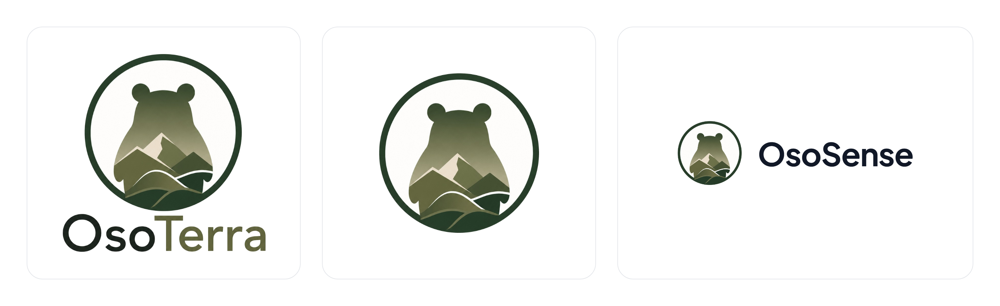

<em>Figura 5.1. Versiones del logo.</em>

La Figura 5.1 muestra, de izquierda a derecha, las tres versiones del logo:

| Versión | Composición | Dónde se usa |
|---|---|---|
| Logo principal | Símbolo sobre el wordmark «OsoTerra», apilados | Documentos, carátula del informe, presentaciones y todo lo que habla de la startup. |
| Símbolo | Solo el círculo con el oso | Favicon, ícono de la aplicación, avatar, grabado del dispositivo y espacios cuadrados pequeños. |
| Lockup de producto | Símbolo a la izquierda y «OsoSense» en Plus Jakarta Sans Bold | Encabezado y pie de página del Landing Page, barra superior de la Web App y de la Mobile App. |

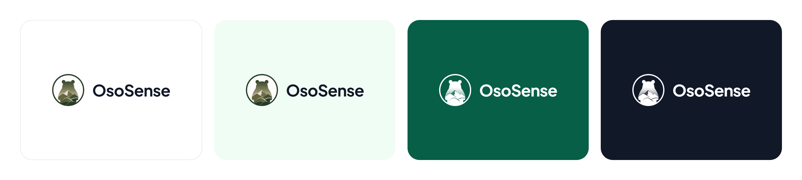

<em>Figura 5.2. Fondos permitidos.</em>

La Figura 5.2 fija los cuatro fondos admitidos. Sobre **blanco** y sobre **verde claro** (`#F0FDF4`) se usa el logo a color con el nombre en casi negro. Sobre **verde oscuro** (`#065F46`) y sobre **casi negro** (`#111827`) se usa la versión monocromática en blanco, porque el logo a color pierde contraste en fondos oscuros.

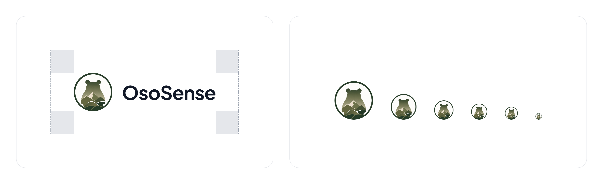

<em>Figura 5.3. Zona de seguridad y tamaños del símbolo.</em>

En la Figura 5.3, a la izquierda, el recuadro punteado marca la **zona de seguridad**: alrededor del logo se deja libre un margen igual a la mitad del diámetro del símbolo (los cuadros grises de las esquinas); ningún texto, borde ni imagen entra en esa zona. A la derecha, el símbolo en sus tamaños de uso:

| Tamaño | Uso |
|---|---|
| 96 px | Portadas, pantallas de bienvenida y estados vacíos. |
| 64 px | Ícono de la aplicación en tiendas y avatar de notificación. |
| 48 px | Pie de página del Landing Page. |
| 40 px | Encabezado del Landing Page y barras superiores. |
| 32 px | Mínimo recomendado en pantalla; por debajo se pierden las montañas interiores. |
| 16 px | Solo favicon (en el Landing Page se entrega también en 64 y 180 px para pantallas de alta densidad). |

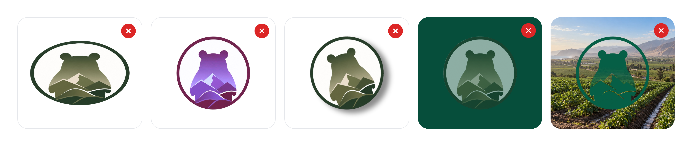

<em>Figura 5.4. Usos incorrectos.</em>

La Figura 5.4 reúne, de izquierda a derecha, los cinco usos que **no** se permiten: deformar el símbolo (estirarlo o achatarlo); recolorearlo fuera de la paleta; rotarlo o agregarle sombras y efectos; usar la versión a color sobre un fondo oscuro, donde se pierde; y colocarlo sobre una fotografía o un fondo con textura que compite con él.

#### Colors

La paleta tiene tres capas: el **verde esmeralda** de la interfaz, que es el color de acción de todos los productos; los **neutros**, que ocupan la mayor parte de cada pantalla; y los **colores de marca** del logo, que no se usan en la interfaz fuera del propio logo. A esto se suman los colores semánticos de los niveles de salinidad.

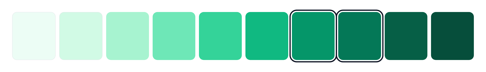

<em>Figura 5.5. Escala del color primario.</em>

La Figura 5.5 muestra la escala de diez tonos del verde esmeralda, del más claro al más oscuro. Los dos tonos recuadrados son los de uso principal.

| Token | Hex | Uso |
|---|---|---|
| `primary-50` | `#ECFDF5` | Fondos muy suaves. |
| `primary-100` | `#D1FAE5` | Etiquetas y chips (en el Landing Page se usa `#DCFCE7`). |
| `primary-200` a `primary-500` | `#A7F3D0` · `#6EE7B7` · `#34D399` · `#10B981` | Ilustraciones, bandas de gráficos y estados *hover* de superficies. |
| `primary-600` | `#059669` | Íconos, números de paso, viñetas y elementos gráficos grandes. |
| `primary-700` | `#047857` | **Botones con texto blanco**, enlaces y etiquetas destacadas. |
| `primary-800` | `#065F46` | Estado presionado y fondos oscuros de marca. |
| `primary-900` | `#064E3B` | Texto sobre superficies verdes claras cuando se necesita más contraste. |

El Landing Page usa hoy `#059669` en sus botones; como el texto blanco sobre ese tono no llega a 4,5 : 1 (ver contraste más abajo), los botones con texto pasan a `#047857` (*a adoptar*) y `#059669` queda para íconos y elementos gráficos.

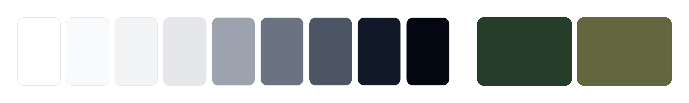

<em>Figura 5.6. Neutros y colores de marca.</em>

La Figura 5.6 muestra a la izquierda los nueve neutros y, separados, los dos colores de marca.

| Token | Hex | Uso |
|---|---|---|
| `white` | `#FFFFFF` | Fondo principal y tarjetas. |
| `neutral-50` | `#F9FAFB` | Pie de página y fondos alternos. |
| `neutral-100` | `#F3F4F6` | Botones secundarios, campos deshabilitados. |
| `neutral-200` | `#E5E7EB` | Bordes de tarjetas, divisores y campos. |
| `neutral-400` | `#9CA3AF` | Texto de ejemplo (*placeholder*) y elementos deshabilitados. |
| `neutral-500` | `#6B7280` | Texto secundario y bajadas. |
| `neutral-600` | `#4B5563` | Texto de apoyo en párrafos largos. |
| `neutral-900` | `#111827` | Títulos y texto principal. |
| `neutral-950` | `#030712` | Nombre del producto en el lockup. |
| `brand-forest` | `#263D29` | Aro y sombras del logo. |
| `brand-olive` | `#64663F` | «Terra» del wordmark y relleno del oso. |

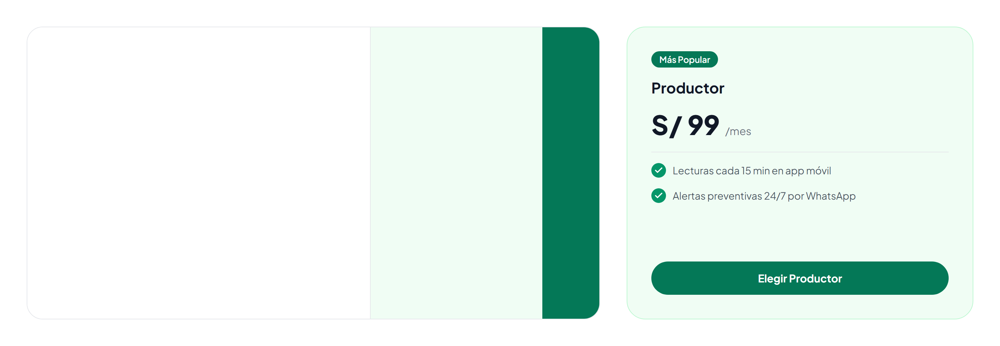

<em>Figura 5.7. Proporción de uso y aplicación.</em>

La Figura 5.7 muestra a la izquierda la **regla 60 · 30 · 10**: alrededor del 60 % de cada pantalla es blanco o neutro, un 30 % son superficies verdes claras (`#F0FDF4`) que agrupan contenido destacado, y solo un 10 % es verde de acción. A la derecha, la tarjeta del plan recomendado del Landing Page aplica esa proporción: fondo verde claro, texto neutro y un único botón verde.

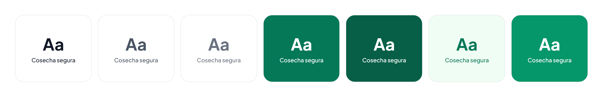

<em>Figura 5.8. Combinaciones de texto y fondo.</em>

Los contrastes se calcularon con la fórmula de luminancia relativa de WCAG 2.1; el criterio es 4,5 : 1 para texto normal y 3 : 1 para texto grande y componentes. La tabla sigue el orden de la Figura 5.8, de izquierda a derecha:

| Texto sobre fondo | Ratio | Resultado |
|---|---|---|
| `#111827` sobre blanco | 17,74 : 1 | AA y AAA |
| `#4B5563` sobre blanco | 7,56 : 1 | AA y AAA |
| `#6B7280` sobre blanco | 4,83 : 1 | AA |
| Blanco sobre `#047857` | 5,48 : 1 | AA — color de los botones |
| Blanco sobre `#065F46` | 7,68 : 1 | AA y AAA |
| `#047857` sobre `#F0FDF4` | 5,24 : 1 | AA — etiquetas sobre superficie verde |
| Blanco sobre `#059669` | 3,77 : 1 | Solo texto grande (≥ 24 px o 18,5 px en negrita) |

<em>Figura 5.9. Colores de estado de salinidad.</em>

**Colores de estado.** Los niveles de salinidad tienen colores propios, independientes del verde de marca, porque comunican riesgo. Se calculan como la relación entre la conductividad eléctrica del extracto de saturación (ECe) y el umbral de tolerancia del cultivo, según Maas y Hoffman (1977), y la Web App ya aplica esta regla. La Figura 5.9 muestra las cinco píldoras en orden:

| Nivel | Ícono | Texto | Fondo | Cuándo |
|---|---|---|---|---|
| Normal | círculo con check | `#1B6234` | `#E1F0E4` | ECe < 0,8 × umbral |
| En vigilancia | ojo | `#70510B` | `#FFF1C6` | 0,8 × umbral ≤ ECe ≤ 1,0 × umbral |
| Alto | triángulo de advertencia | `#85440D` | `#FFF0DD` | 1,0 × umbral < ECe ≤ 1,25 × umbral |
| Muy alto | círculo con aspa | `#A12426` | `#FFEAEB` | ECe > 1,25 × umbral |
| Sin lectura | signo de pregunta | `#3E5150` | `#E6EBEA` | El dispositivo aún no reporta |

Como cada estado combina color, ícono y palabra, la lectura no depende de percibir el color.

#### Typography

Se usa una sola familia: **Plus Jakarta Sans**, la misma del Landing Page. Es una sans-serif geométrica de trazo abierto, diseñada para pantallas, con pesos de 200 a 800 y cobertura completa del español y del inglés. Usar una sola familia simplifica la carga (una fuente en lugar de dos, algo importante con conexiones rurales lentas) y da una voz uniforme entre productos; la jerarquía se construye con tamaño y peso. El Landing Page la carga desde Google Fonts; en la Web App y la Mobile App se autoalojará (*a adoptar*) para no depender de la red.

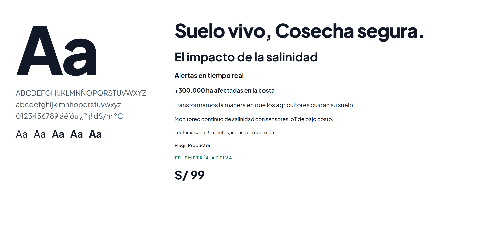

<em>Figura 5.10. Plus Jakarta Sans y escala tipográfica.</em>

A la izquierda de la Figura 5.10 está la muestra de la familia (alfabeto, cifras, tildes, signos de apertura y los pesos Regular, Medium, SemiBold, Bold y ExtraBold). A la derecha, la escala, de arriba abajo:

| Estilo | Peso | Tamaño / interlínea | Uso |
|---|---|---|---|
| Display | ExtraBold 800, espaciado −2,5 % | 58 / 64 px (30 px en móvil) | Titular del hero. |
| Heading 2 | Bold 700 | 36 / 44 px (28 px en móvil) | Título de sección. |
| Heading 3 | Bold 700 | 20 / 28 px | Título de tarjeta o beneficio. |
| Heading 4 | Bold 700 | 18 / 27 px | Título de dato, de capacidad o de pregunta. |
| Body Large | Regular 400 | 18 / 29 px | Texto destacado en tarjetas. |
| Body | Regular 400 | 16 / 26 px | Texto base de toda la interfaz. |
| Body Small | Regular 400 | 14 / 22 px | Bajadas, descripciones y pie de página. |
| Label | SemiBold 600 | 14 / 20 px | Botones, enlaces del menú y etiquetas. |
| Eyebrow | Bold 700, mayúsculas, espaciado +5 % | 12 / 17 px | Rótulo sobre el título de un beneficio. |
| Price / Data | ExtraBold 800 | 36 / 40 px | Precios y cifras de salinidad. |

Reglas complementarias: el cuerpo no baja de 16 px, por la edad promedio del segmento 1; entre 45 y 75 caracteres por línea en texto corrido; el español ocupa hasta un tercio más que el inglés, por lo que se reserva un 30 % de ancho adicional en botones y etiquetas.

#### Spacing

El espaciado sigue una base de 4 px con múltiplos de 8, que es la escala que ya usa el Landing Page.

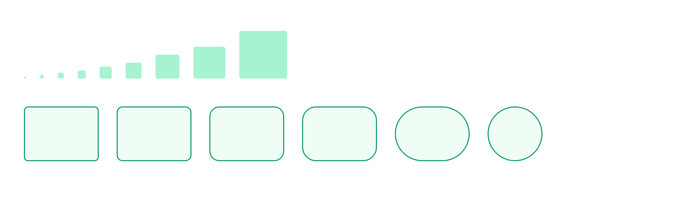

<em>Figura 5.11. Espaciado y forma.</em>

La fila superior de la Figura 5.11 muestra la escala de espaciado y la inferior, los radios de borde.

| Token | Valor | Uso |
|---|---|---|
| `space-1` | 4 px | Entre ícono y texto muy juntos. |
| `space-2` | 8 px | Entre elementos relacionados (título y bajada). |
| `space-3` | 12 px | Entre botón y su ícono circular; relleno de chips. |
| `space-4` | 16 px | Margen lateral en móvil y separación de columnas. |
| `space-5` | 24 px | Relleno interno de tarjetas. |
| `space-6` | 32 px | Entre tarjetas y relleno de tarjetas grandes. |
| `space-7` | 48 px | Entre el encabezado de sección y su contenido. |
| `space-8` | 64 px | Separación de secciones en móvil. |
| `space-9` | 96 px | Separación de secciones en escritorio. |

| Radio | Valor | Uso |
|---|---|---|
| `radius-sm` | 8 px | Campos compactos e imágenes pequeñas. |
| `radius-md` | 12 px | Campos de formulario. |
| `radius-lg` | 20 px | Tarjetas de datos y preguntas frecuentes. |
| `radius-xl` | 28 px | Tarjetas grandes, planes, hero y banners (32 px en el hero de escritorio). |
| `radius-pill` | 999 px | Botones, etiquetas y píldoras de estado. |
| Círculo | 50 % | Íconos de fondo, avatar y símbolo del logo. |

La elevación es mínima: las tarjetas se separan con borde de 1 px `#E5E7EB` y solo el elemento destacado (plan recomendado, indicador sobre una foto) lleva una sombra suave.

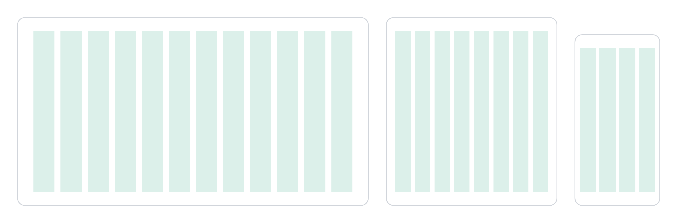

<em>Figura 5.12. Grilla en escritorio, tablet y móvil.</em>

La Figura 5.12 muestra, de izquierda a derecha, la grilla de escritorio, tablet y móvil:

| Ancho | Columnas | Gutter | Margen lateral | Contenedor |
|---|---|---|---|---|
| ≥ 1024 px | 12 | 24–32 px | 72 px | Hasta 1440 px (96 % del ancho). |
| 640–1023 px | 8 | 24 px | 32 px | Grillas de 2 columnas pasan a 1. |
| < 640 px | 4 | 16 px | 16 px | Todo en una columna. |

**Objetivos táctiles.** 44 × 44 px como mínimo en web (WCAG 2.5.5) y 48 × 48 dp en Android, con al menos 8 px entre objetivos.

#### Iconography

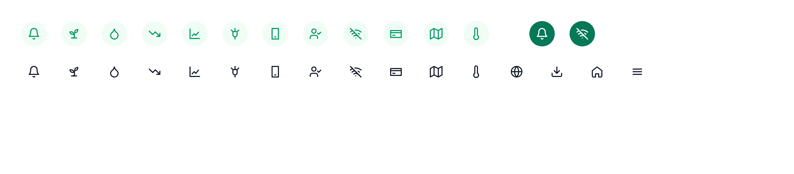

<em>Figura 5.13. Sistema de íconos.</em>

Se usan **íconos de línea** de 24 × 24 px con trazo de 2 px y extremos redondeados, el mismo estilo del Landing Page, que en las aplicaciones se tomarán del conjunto Material Symbols en su variante *Outlined* para mantener la misma línea (*a adoptar*: la Web App usa hoy Material Icons rellenos). La Figura 5.13 muestra en la fila superior el ícono dentro de un círculo verde claro (uso en tarjetas de datos y capacidades) y, al final, dentro de un círculo verde oscuro (beneficios destacados); en la fila inferior, el ícono suelto en casi negro (menús y acciones). Los íconos del catálogo representan, en orden: alertas, cultivo, agua, tendencia, gráfico, sensor, celular, asesor, sin conexión, costos, parcela, temperatura, idioma, descarga, inicio y menú.

Reglas: todo ícono con función lleva texto visible o `aria-label`; los decorativos llevan `aria-hidden="true"`; no se mezclan íconos rellenos con íconos de línea; y los íconos de estado de salinidad siempre acompañan a la palabra del estado.

#### Tone of voice

Las cuatro dimensiones de tono que exige el enunciado se fijaron a partir de las entrevistas de la sección 2.2.3 y del perfil de usuarios de la sección 1.3.

| Dimensión | Posición | Sustento |
|---|---|---|
| Divertido / Serio | **Serio** | Se comunican riesgos de pérdida de cosecha, y el asesor sustenta recomendaciones profesionales. Sin bromas ni exclamaciones. |
| Formal / Casual | **Casual cercano** | Lenguaje cotidiano y frases cortas, sin jerga técnica: los productores entrevistados piden indicaciones claras y mediciones explicadas de forma simple. Trato de «tú» en el Landing Page, igual que su texto actual. |
| Respetuoso / Irreverente | **Respetuoso** | Usuarios de mayor edad con desconfianza inicial hacia un sensor de bajo costo; nunca se culpa al usuario. |
| Entusiasta / Sereno | **Sereno** | Una alerta crítica no debe alarmar, sino informar el hecho y la acción a tomar. El entusiasmo se reserva para logros, como una salinidad que baja. |

El nivel de detalle cambia según quién lee: al **productor** se le habla con frases de hasta 20 palabras y valores cualitativos, con la medida en dS/m disponible bajo demanda; al **asesor técnico**, con lenguaje profesional y dato crudo (ECe, umbral del cultivo, tendencia); y al **visitante del Landing Page**, con titulares breves centrados en el beneficio («Suelo vivo, Cosecha segura.») y verbos de acción en los botones.

| Contexto | Así sí | Así no |
|---|---|---|
| Alerta crítica | «Salinidad muy alta en Lote Sur. Riega con agua de menor salinidad y revisa el drenaje hoy.» | «¡¡ALERTA!! EC 6.2 dS/m excede el umbral ECe del cultivo!!!» |
| Estado vacío | «Aún no hay lecturas. Conecta tu dispositivo para ver la salinidad de esta parcela.» | «Error 404: no se encontraron datos de telemetría.» |
| Error de formulario | «Usa al menos 12 caracteres.» | «Contraseña inválida.» |
| Logro | «La salinidad de La Quebrada bajó a nivel normal. El lavado de sales funcionó.» | «¡¡Felicidades, campeón!!» |

El producto usa **una sola palabra por concepto**: *parcela* (no lote ni terreno), *lectura* (no muestra ni telemetría en la app), *dispositivo* (no nodo ni gateway), *acción correctiva* y los estados *normal, en vigilancia, alto y muy alto*. Los botones llevan un verbo y, si hace falta, un objeto («Elegir Productor», «Registrar acción»); la unidad se separa de la cifra con un espacio (3.5 dS/m).

### 5.1.2. Web, Mobile and IoT Style Guidelines

Sobre la base común de la sección 5.1.1, esta sección fija los estándares visuales y de interacción de cada plataforma: los componentes web, las interfaces responsive, la aplicación Android, la interfaz física del dispositivo, la visualización de datos y las reglas de accesibilidad, idioma y movimiento.

#### Web: componentes

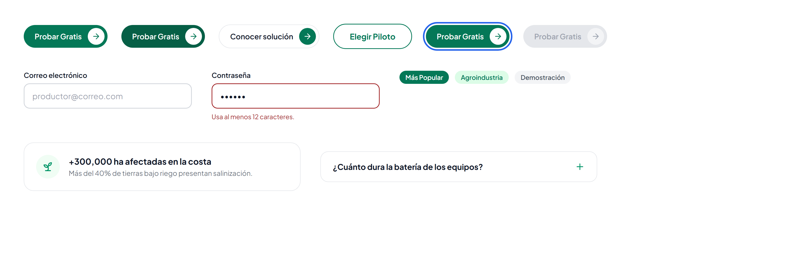

<em>Figura 5.14. Componentes web.</em>

La Figura 5.14 muestra los componentes base en tres filas.

**Fila 1, botones.** De izquierda a derecha: botón principal en reposo (píldora `#047857` con círculo blanco y flecha), el mismo presionado (`#065F46`), botón claro sobre fotografía (blanco con borde y círculo verde), botón secundario con contorno (usado en planes no recomendados), botón con foco de teclado (anillo azul `#2563EB` de 3 px separado 3 px) y botón deshabilitado (gris, sin sombra). La altura es de 46 a 52 px y solo un botón con relleno por bloque.

**Fila 2, formularios y etiquetas.** Campo con etiqueta visible siempre arriba (nunca solo el texto de ejemplo), radio de 12 px y borde `#D1D5DB`; campo con error, que cambia el borde a `#A12426` y muestra debajo un mensaje que explica cómo corregir; y las tres etiquetas del Landing Page: destacada (verde lleno), de categoría (verde claro) y neutra (gris).

**Fila 3, tarjetas.** Tarjeta de dato con ícono en círculo, título y descripción; y elemento de preguntas frecuentes, que se abre al pulsar el signo «+» (cambia a «−»).

#### Web: interfaces responsive

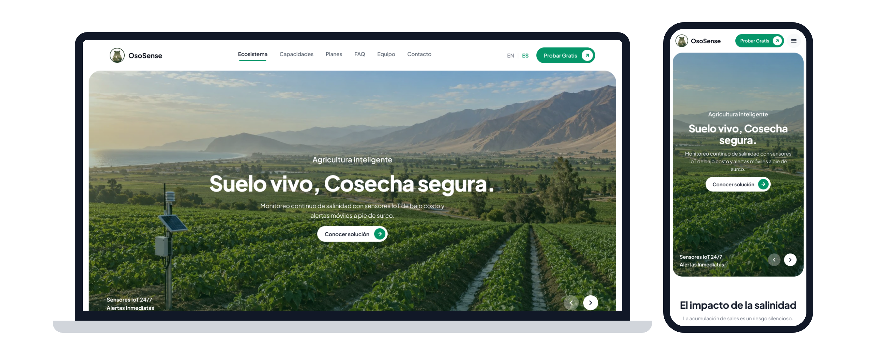

<em>Figura 5.15. El mismo diseño en escritorio y en móvil.</em>

La Figura 5.15 muestra el Landing Page en una laptop (izquierda) y en un teléfono (derecha). Un solo diseño se adapta con estos cortes, que son los del Landing Page:

| Ancho | Comportamiento |
|---|---|
| ≥ 1200 px | Menú horizontal completo con selector EN / ES y botón *Probar Gratis*; grillas de 2, 3 y 4 columnas. |
| 640–1199 px | El menú pasa a un botón de hamburguesa que despliega un panel; las grillas de 3 columnas pasan a 1 o 2. |
| < 640 px | Una columna; titular de 30 px; secciones a 64 px de distancia; selector de idioma dentro del menú. |

En la Web App, cuyo prototipo ya usa cortes de 700, 900 y 1100 px, la barra lateral pasa a un cajón deslizable por debajo de 900 px y las tablas se convierten en listas de tarjetas con la píldora de estado visible.

#### Mobile: aplicación Android

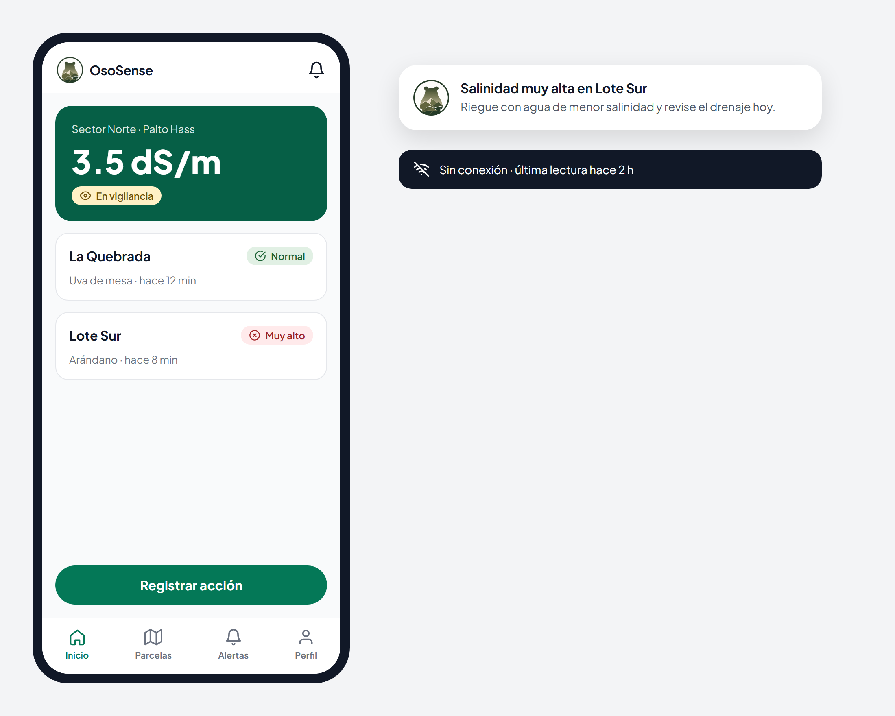

<em>Figura 5.16. Estándares de la aplicación Android.</em>

La Mobile App se construye con Kotlin y Jetpack Compose (Material 3, `minSdk` 24) y usa los mismos tokens: `primary` = `#047857`, `primaryContainer` = `#D1FAE5`, `surface` = blanco, `surfaceVariant` = `#F9FAFB`, `outline` = `#E5E7EB` y `error` = `#A12426`, con Plus Jakarta Sans en toda la escala tipográfica en `sp`. La Figura 5.16 muestra a la izquierda la pantalla de inicio de ejemplo:

- **Barra superior** de 56 dp con el lockup y la campana de alertas.
- **Tarjeta principal** en verde oscuro con la parcela, el cultivo, la cifra de salinidad en Data 40 sp y la píldora de estado.
- **Lista de parcelas** en tarjetas blancas con borde, cada una con su píldora de estado y la antigüedad de la lectura.
- **Botón principal** a ancho completo sobre la navegación inferior.
- **Navegación inferior** de cuatro destinos (Inicio, Parcelas, Alertas, Perfil) con el destino activo en verde.

A la derecha, arriba, una **notificación** de nivel muy alto: símbolo del logo, título con el hecho y texto con la acción. Cada severidad tiene su canal de Android: «Muy alto» con vibración y aviso emergente, «En vigilancia» con sonido discreto y «Sin lectura» como resumen. Debajo, el **aviso sin conexión**, una barra oscura con la hora de la última lectura; mientras tanto se muestran los últimos datos guardados. Márgenes laterales de 16 dp y objetivos táctiles de 48 dp.

#### IoT: interfaz física del dispositivo

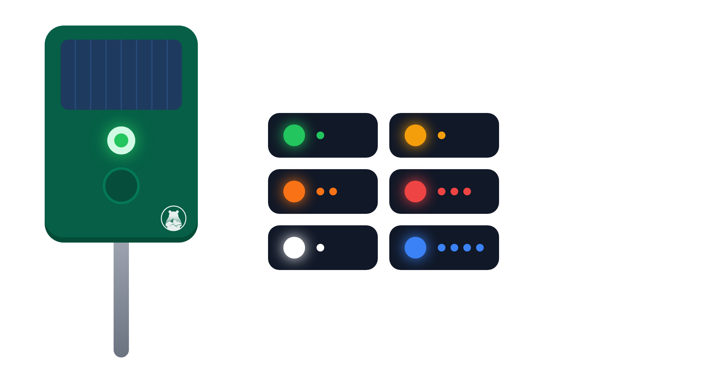

<em>Figura 5.17. Dispositivo de campo y estados del LED.</em>

El dispositivo (ESP32 con sonda de conductividad eléctrica, humedad y temperatura) no tiene pantalla: se comunica con **un LED RGB, un botón y la carcasa**. A la izquierda de la Figura 5.17 está la propuesta de carcasa, de arriba abajo: panel solar en la tapa, LED de estado bajo un difusor translúcido, botón único y, en la esquina, el símbolo de Oso Terra grabado en blanco; debajo sale la sonda. La carcasa mide 90 × 60 mm, en plástico ABS/ASA estabilizado contra rayos UV color `#065F46`, con sellado IP65 y esquinas de 12 mm.

A la derecha, los seis estados del LED, leídos por filas de izquierda a derecha. Cada estado se distingue por **color y número de destellos**, para que se reconozca con daltonismo o con sol intenso:

| Estado | Color | Patrón | Significado |
|---|---|---|---|
| Normal | Verde | 1 destello cada 10 s | Todo bien; ahorra batería. |
| En vigilancia | Ámbar | 1 destello cada 5 s | Conviene revisar el riego esta semana. |
| Alto | Naranja | 2 destellos cada 5 s | Reducir sales: riego de lavado y drenaje. |
| Muy alto | Rojo | 3 destellos rápidos cada 3 s | Requiere acción hoy; el aviso llega también a la app. |
| Sin conexión | Blanco | 1 destello largo cada 5 s | Guarda lecturas y las sincroniza después. |
| Emparejamiento | Azul | Parpadeo continuo | Vinculación con la app durante 2 minutos. |

**Botón único.** Pulsación corta (menos de 1 s): toma una lectura y la envía. Pulsación de 3 s: emparejamiento. Pulsación de 10 s: restablecer a fábrica, con tres destellos rojos de aviso. El LED siempre confirma la acción.

> [!NOTE]
> Las dimensiones, materiales y patrones del dispositivo son una propuesta del equipo y se ajustarán con el prototipo físico (sección 5.6).

#### Visualización de datos

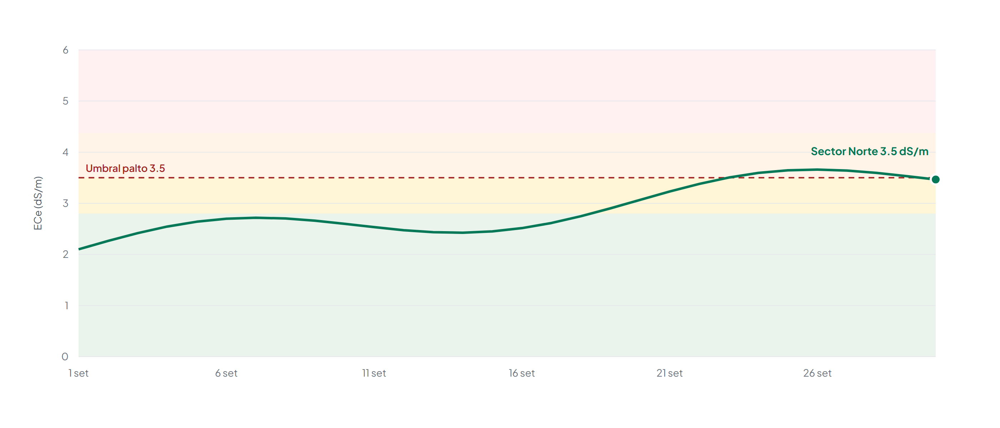

<em>Figura 5.18. Gráfico de salinidad con umbral. Datos ilustrativos.</em>

La Figura 5.18 es el gráfico tipo de la plataforma: la ECe de una parcela a lo largo de un mes. Lo que se ve y por qué:

- **Línea** verde `#047857` de 3 px para la serie de tiempo; barras solo para comparar parcelas en un instante; nunca gráficos circulares ni en 3D.
- **Bandas de fondo** con los colores de fondo de los cuatro niveles (verde, amarillo, naranja y rojo claros), para leer el nivel sin mirar la leyenda.
- **Umbral del cultivo** como línea discontinua roja con su etiqueta a la izquierda (en el ejemplo, palto con 3,5 dS/m).
- **Etiqueta directa** del valor actual junto al último punto, en lugar de una leyenda aparte.
- **Eje Y desde cero** con la unidad escrita (ECe en dS/m) y eje X con fechas cortas.
- Máximo cuatro series por gráfico, cada una con color y tipo de trazo distintos, y una **tabla alternativa** (fecha, ECe y nivel) con resumen en texto para lector de pantalla.

#### Accesibilidad, idioma y movimiento

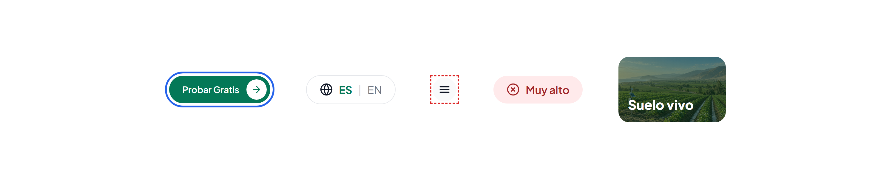

<em>Figura 5.19. Patrones de accesibilidad.</em>

La Figura 5.19 reúne, de izquierda a derecha, cinco patrones: el **anillo de foco** azul visible en todo elemento interactivo al navegar con teclado; el **selector de idioma** ES / EN, siempre en el encabezado, con el idioma activo en verde y negrita y `aria-pressed`; el **objetivo táctil** mínimo de 44 × 44 px (recuadro punteado) aunque el ícono sea más pequeño; el **estado con ícono y palabra**, nunca solo color; y el **texto sobre fotografía**, que se apoya en una capa verde oscura semitransparente para mantener el contraste.

| Principio WCAG 2.1 (nivel AA) | Reglas |
|---|---|
| Perceptible | Contraste de 4,5 : 1 en texto y 3 : 1 en componentes; el estado nunca se comunica solo con color; texto redimensionable al 200 %; texto alternativo en fotos informativas y `alt=""` en decorativas. |
| Operable | Todo se maneja con teclado en orden lógico; foco siempre visible; objetivos táctiles de 44 px; nada parpadea más de tres veces por segundo. |
| Comprensible | Idioma de la página declarado en `lang`; mensajes de error que explican cómo corregir; etiquetas visibles en todos los campos; navegación igual en todas las páginas. |
| Robusto | HTML semántico; `aria-label`, `aria-labelledby`, `aria-expanded`, `aria-controls` y `aria-pressed` donde hacen falta; cambios de estado anunciados con `aria-live` (*a adoptar*). |

El Landing Page ya aplica `aria-label` en la navegación y el menú, `aria-labelledby` en cada sección, `aria-expanded` y `aria-controls` en el menú móvil, `aria-pressed` en el selector de idioma, textos alternativos y `prefers-reduced-motion`. La Web App incorpora además un enlace «Saltar al contenido», `aria-current="page"` y `role="alert"` en los errores.

**Internacionalización.** Todos los productos se ofrecen en inglés (en_US) y español latinoamericano (es_419) con el selector EN / ES. Los textos viven en archivos de traducción, las fechas siguen el formato de cada idioma y las unidades se mantienen (3.5 dS/m, 4.2 ha, 23.8 °C).

**Movimiento.** El movimiento explica cambios y nunca es decorativo. En el Landing Page, los cambios de color de *hover* y foco duran 150 ms con la curva `cubic-bezier(0.4, 0, 0.2, 1)`, el acordeón de preguntas frecuentes se abre en 360 ms y las tarjetas aparecen al hacer scroll en 750 a 900 ms con un leve desplazamiento vertical. En las aplicaciones se usan 150 ms para interacciones mínimas, 250 ms para menús y 400 ms para diálogos. Con la preferencia «reducir movimiento» del sistema, las animaciones se desactivan y el contenido aparece directamente.

## 5.2. Information Architecture

### 5.2.1. Organization Systems

### 5.2.2. Labeling Systems

### 5.2.3. SEO Tags and Meta Tags

### 5.2.4. Searching Systems

### 5.2.5. Navigation Systems

## 5.3. Landing Page UI Design

El Landing Page es el primer contacto de productores y asesores técnicos con OsoSense, por lo que su propuesta de UI se pensó como un recorrido de persuasión: primero el problema (la salinidad), después la respuesta (el sensor y la plataforma), luego la forma de adoptarla (proceso y planes) y, al final, la confianza (preguntas frecuentes y equipo) antes del llamado a la acción. Las decisiones de diseño y de arquitectura de información se tradujeron en tres reglas:

- **Una sola página con anclas.** Cada destino del menú (Ecosistema, Capacidades, Planes, FAQ, Equipo y Contacto) es una sección de la misma página; así el visitante nunca pierde el contexto y el menú funciona como índice.
- **Un bloque, una idea.** Cada sección responde una pregunta del visitante con un título H2, una bajada corta y un único patrón de contenido (datos, tarjetas, pasos, planes o acordeón).
- **La acción siempre a la vista.** El botón *Probar Gratis* permanece en el encabezado fijo y cada tramo del recorrido termina en un botón de avance (*Conocer solución*, *Conocer Más*, *Elegir plan*, *Comenzar ahora*).

El diseño se elaboró en Figma en tres páginas: **Design System** (estilos de color y de texto, y componentes), **Wireframes** y **Mock-ups**, cada una con la versión Desktop Web Browser (1440 px) y Mobile Web Browser (390 px). El contenido es el mismo que muestra el Landing Page implementado en su versión en español (es_419).

### 5.3.1. Landing Page Wireframe

Los wireframes fijan la estructura, la jerarquía y el orden de lectura sin distraer con color ni fotografía: todo está en escala de grises, las imágenes se representan con cajas punteadas y se retiraron sombras y degradados. La página se organiza en once bloques, siempre en el mismo orden en ambos anchos:

| # | Bloque | Pregunta del visitante que responde | Patrón de contenido |
|---|---|---|---|
| 0 | Encabezado | ¿Dónde estoy y a dónde puedo ir? | Logo, menú de anclas, selector EN / ES y botón *Probar Gratis* |
| 1 | Hero | ¿Qué es OsoSense? | Carrusel de fotos con eyebrow, titular H1, bajada y botón principal |
| 2 | El impacto de la salinidad | ¿Por qué me debería importar? | Tres datos con ícono y una tarjeta de historia con foto |
| 3 | Protege tu inversión agrícola | ¿Qué gano? | Tres beneficios en un bloque dividido: alertas, ahorro y respaldo sin conexión |
| 4 | Nuestras capacidades | ¿Qué hace la solución? | Foto del sensor con el indicador de CEe y cuatro capacidades en grilla 2 × 2 |
| 5 | Proceso de implementación | ¿Cómo empiezo? | Cuatro pasos numerados alrededor de una foto de campo |
| 6 | Planes a tu medida | ¿Cuánto cuesta? | Tres tarjetas de plan con el plan recomendado destacado |
| 7 | Preguntas frecuentes | ¿Y si…? | Acordeón de cuatro preguntas |
| 8 | Equipo | ¿Quién está detrás? | Tarjetas con los siete integrantes |
| 9 | Llamado a la acción | ¿Qué hago ahora? | Banner con titular y botón *Comenzar ahora* |
| 10 | Pie de página | ¿Dónde encuentro lo demás? | Marca, descripción y tres columnas de enlaces |

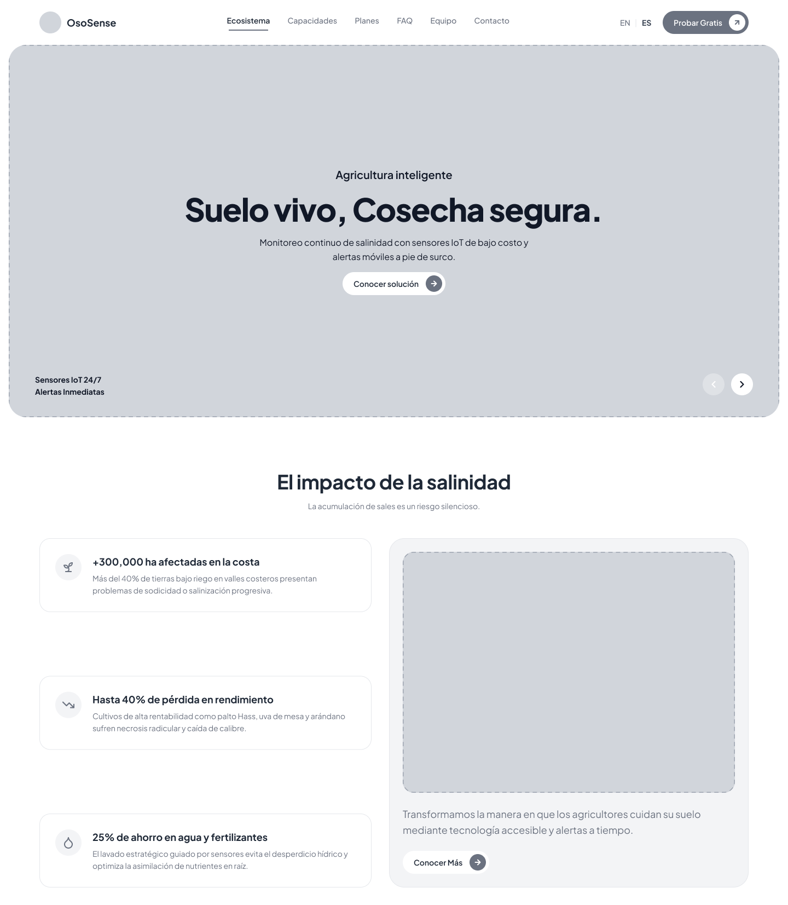

<em>Figura 5.20. Wireframe Desktop Web Browser (1/4): encabezado, hero y bloque de impacto de la salinidad.</em>

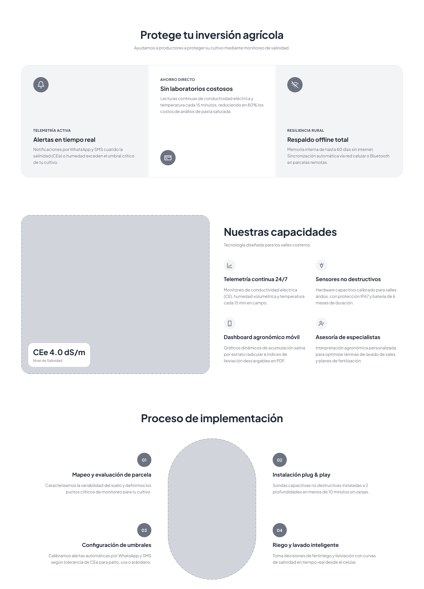

<em>Figura 5.21. Wireframe Desktop Web Browser (2/4): beneficios, capacidades y proceso de implementación.</em>

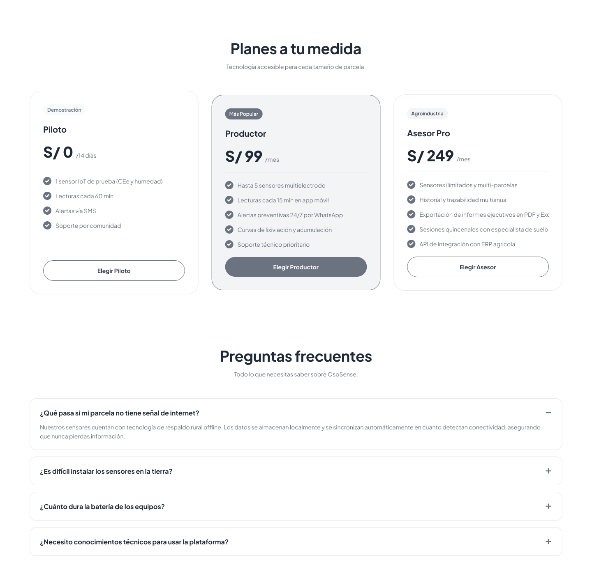

<em>Figura 5.22. Wireframe Desktop Web Browser (3/4): planes y preguntas frecuentes.</em>

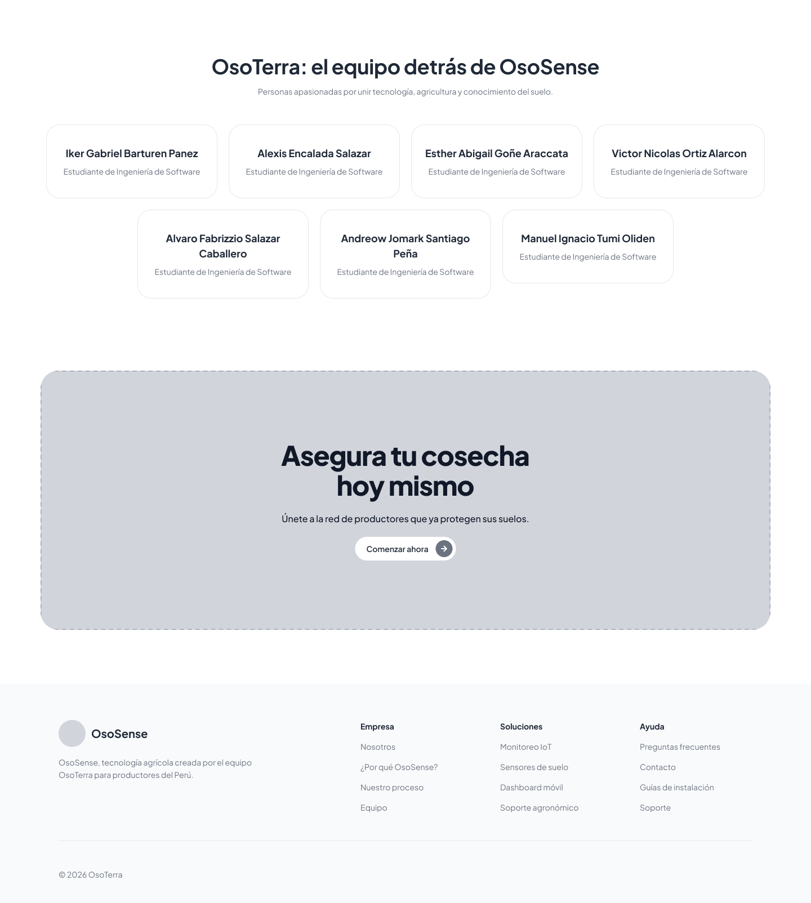

<em>Figura 5.23. Wireframe Desktop Web Browser (4/4): equipo, llamado a la acción y pie de página.</em>

**Principios y elementos de diseño aplicados**

- **Jerarquía:** un único H1 en el hero; cada sección abre con un H2 centrado y una bajada en gris, y dentro de las tarjetas el título pesa más que la descripción. El ojo encuentra primero el titular, luego el dato y al final el detalle.
- **Proximidad y agrupación:** los elementos relacionados comparten tarjeta (ícono, título y texto de cada dato; precio y lista de cada plan) y las secciones se separan con 96 px de aire vertical, de modo que el cambio de tema se percibe sin necesidad de líneas.
- **Alineación y grilla:** contenedor de 1296 px con márgenes de 72 px y columnas que se reparten en 2, 3 o 4 tarjetas según el bloque. El proceso usa una composición simétrica (pasos 01 y 03 a la izquierda, 02 y 04 a la derecha) para que la lectura siga el orden numérico.
- **Contraste y énfasis:** solo un botón por bloque tiene relleno; los secundarios van con contorno. En los planes, el plan *Productor* se destaca con fondo, sombra y la etiqueta *Más Popular*.
- **Repetición:** el mismo botón en píldora con círculo de flecha, las mismas tarjetas redondeadas y el mismo encabezado de sección se repiten en toda la página, lo que reduce la carga de aprendizaje.

**Diseño inclusivo**

- Texto base de 16 px y bajadas de 14 px como mínimo, pensando en la edad del segmento de productores (sección 1.3).
- Objetivos táctiles de al menos 40 px (botones, flechas del carrusel y menú) y separación suficiente entre enlaces del menú móvil.
- Los íconos siempre van acompañados de texto; ningún dato depende solo del color o de una imagen.
- El selector de idioma EN / ES está en el encabezado desde la primera vista, porque el producto se ofrece en en_US y es_419.
- En la implementación, la navegación usa `aria-label`, `aria-labelledby` por sección, `aria-expanded` y `aria-controls` en el menú móvil, `aria-pressed` en el selector de idioma, texto alternativo en las fotos informativas y `alt=""` en las decorativas, y respeta `prefers-reduced-motion`.

**Arquitectura de información**

- **Organización:** esquema por tópicos en secuencia narrativa (problema → beneficio → solución → proceso → precio → dudas → confianza → acción).
- **Etiquetado:** etiquetas de una palabra en el menú, iguales al título de la sección a la que llevan, y verbos de acción en los botones (*Conocer*, *Elegir*, *Comenzar*, *Probar*).
- **Navegación:** menú global de anclas en un encabezado fijo, botón de llamada a la acción siempre visible y un pie de página con navegación secundaria agrupada en Empresa, Soluciones y Ayuda.

**Versión Mobile Web Browser**

En 390 px la estructura se conserva y solo cambia la disposición: el menú se convierte en un botón de hamburguesa junto a *Probar Gratis*, el selector de idioma pasa al menú desplegable, todas las grillas se apilan en una columna, el titular baja de 58 a 30 px, los pasos del proceso se leen en lista vertical debajo de la foto y los planes, el equipo y el pie de página se muestran uno debajo de otro. Los márgenes laterales se reducen a 16 px para ganar ancho útil.

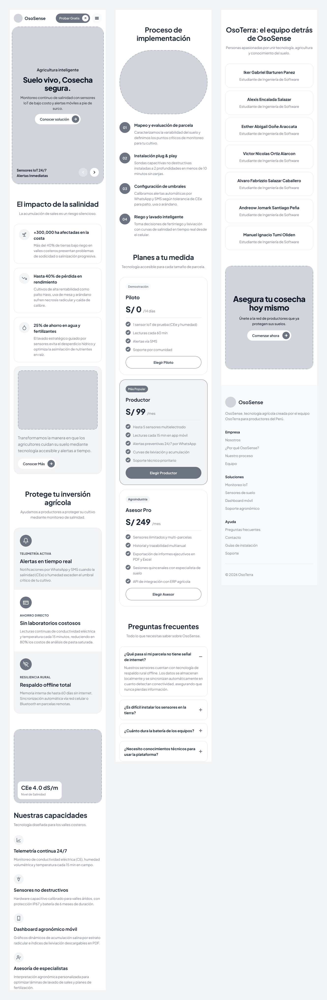

<em>Figura 5.24. Wireframe Mobile Web Browser (390 px), leído de izquierda a derecha en tres tramos.</em>

### 5.3.2. Landing Page Mock-up

Los mock-ups llevan los wireframes a alta fidelidad con el **Design System** del Landing Page, construido en Figma como estilos reutilizables a partir de los valores de la página implementada:

| Categoría | Tokens |
|---|---|
| Color de acción | Primary/600 `#059669` (botones, íconos, números del proceso), Primary/700 `#047857` (etiquetas y estados *hover*), Primary/800 `#065F46` |
| Superficies verdes | Primary/50 `#F0FDF4` (tarjetas destacadas y plan recomendado), Primary/100 `#DCFCE7` (etiquetas) |
| Neutros | Neutral/900 `#111827` (títulos), Neutral/600 `#4B5563` y Neutral/500 `#6B7280` (texto secundario), Neutral/200 `#E5E7EB` (bordes), Neutral/50 `#F9FAFB` (pie de página), blanco |
| Marca | Brand/Forest `#263D29` y Brand/Olive `#64663F`, presentes en el logo |
| Tipografía | Plus Jakarta Sans: Display 58 px ExtraBold, H2 36 px Bold, H3 20 px Bold, H4 18 px Bold, cuerpo 18 / 16 / 14 px Regular, botón 14 px SemiBold, eyebrow 12 px Bold en mayúsculas, precio 36 px ExtraBold |
| Forma | Botones en píldora con círculo de flecha, tarjetas con radio de 20 a 28 px y borde de 1 px, hero y banner con radio de 32 px |
| Fotografía | Paisajes de valles costeros, sensor en campo y trabajo de agrónomos, con una capa verde oscura sobre la foto para asegurar la lectura del texto blanco |

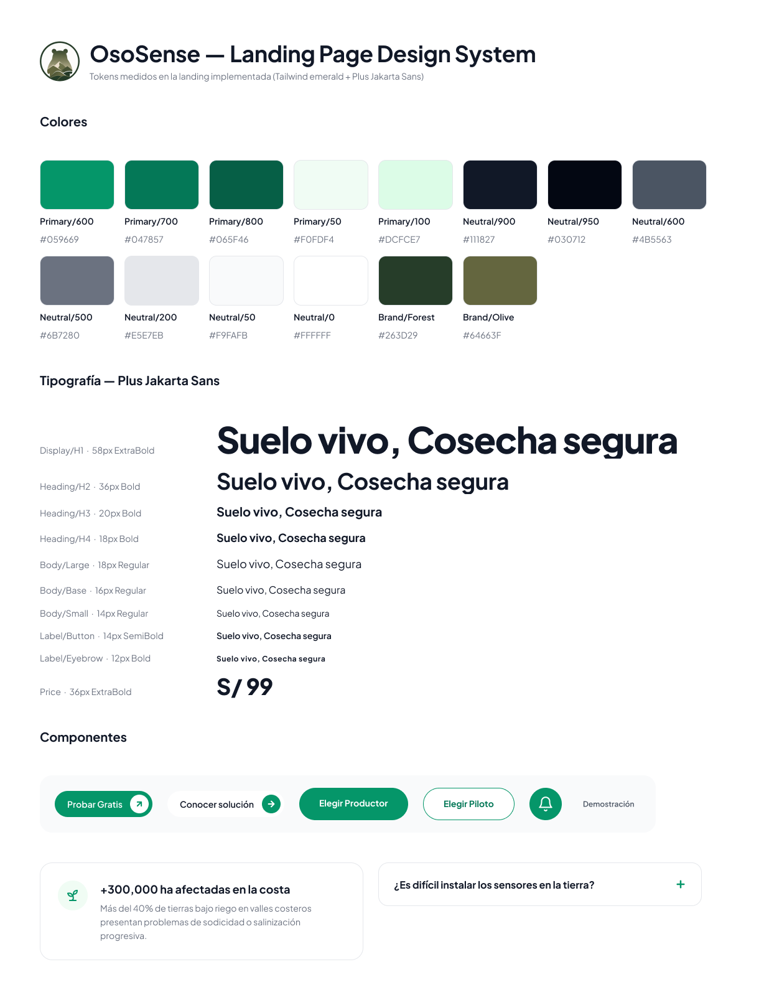

<em>Figura 5.25. Design System del Landing Page: estilos de color, escala tipográfica y componentes.</em>

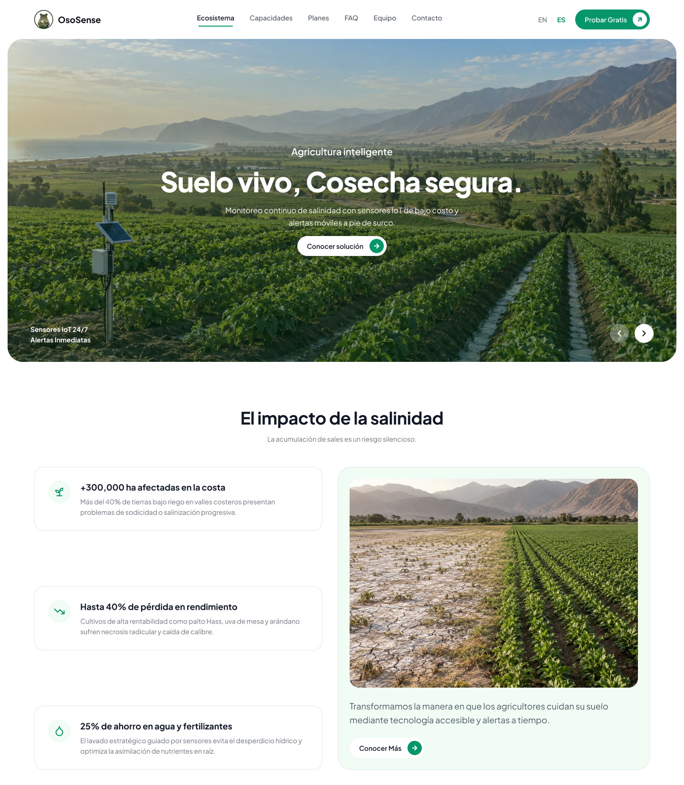

<em>Figura 5.26. Mock-up Desktop Web Browser (1/4): encabezado con el logo de Oso Terra, hero con fotografía del valle y bloque de impacto.</em>

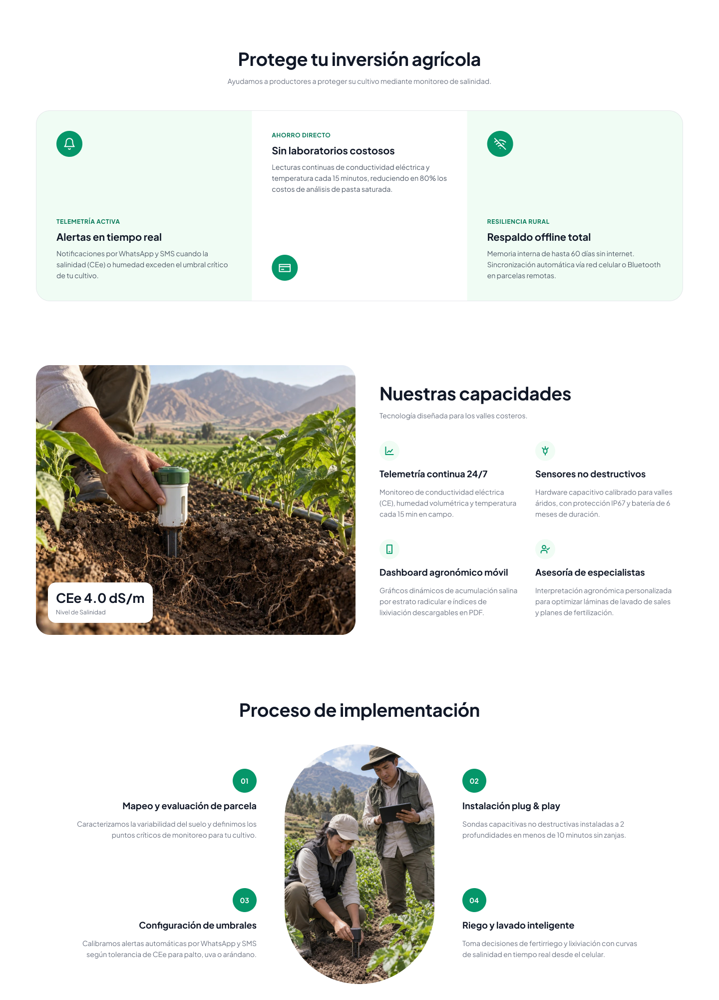

<em>Figura 5.27. Mock-up Desktop Web Browser (2/4): beneficios, capacidades con el indicador de CEe y proceso de implementación.</em>

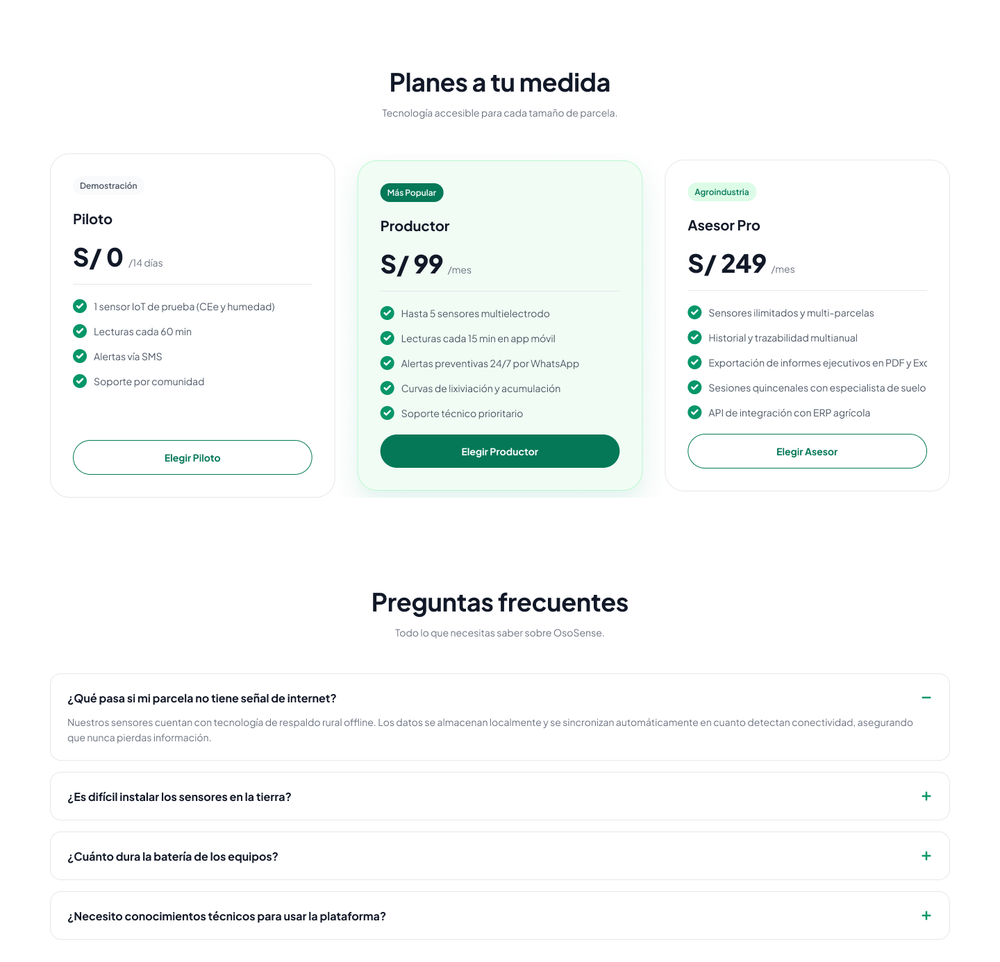

<em>Figura 5.28. Mock-up Desktop Web Browser (3/4): planes con el plan recomendado destacado y preguntas frecuentes.</em>

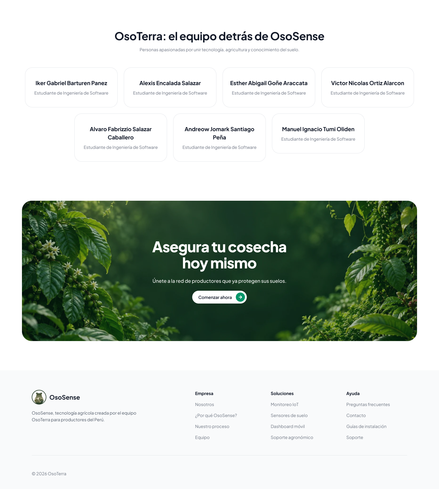

<em>Figura 5.29. Mock-up Desktop Web Browser (4/4): equipo, banner de llamado a la acción y pie de página.</em>

**Cómo se aplican los principios en el mock-up**

- **El color guía la acción.** El verde esmeralda se reserva para lo que se puede pulsar o lo que conviene notar (botones, íconos, números de paso, plan recomendado); el resto de la página es blanco y gris, por lo que la mirada va directo a las acciones.
- **La fotografía cuenta la historia.** El hero muestra el valle costero con el sensor instalado; el bloque de impacto contrapone suelo salinizado y cultivo sano; el proceso muestra a agrónomos en campo. Son escenas que el productor reconoce como propias.
- **El dato técnico se vuelve legible.** El indicador *CEe 4.0 dS/m — Nivel de Salinidad* sobre la foto del sensor anticipa lo que el usuario verá en la aplicación, con el número grande y la explicación corta.
- **La marca da confianza.** El logo de Oso Terra aparece en el encabezado fijo y en el pie de página, y la sección de equipo presenta a los siete integrantes.

**Diseño inclusivo en el mock-up**

Los contrastes medidos (WCAG 2.1) son: títulos `#111827` sobre blanco 17,74:1; texto secundario `#4B5563` 7,56:1 y `#6B7280` 4,83:1 sobre blanco; etiquetas `#047857` sobre `#F0FDF4` 5,24:1, todos por encima de AA. El texto blanco sobre el botón `#059669` alcanza 3,77:1, que cumple AA solo para texto grande; por eso, en la siguiente iteración los botones con texto de 14 px pasarán a Primary/700 `#047857` (5,48:1). Sobre las fotografías, el texto blanco se apoya en una capa verde oscura semitransparente.

**Versión Mobile Web Browser**

El mock-up móvil aplica los mismos estilos con los ajustes de la sección anterior: encabezado compacto con logo, *Probar Gratis* y menú de hamburguesa; hero con titular de 30 px; tarjetas a ancho completo; y planes apilados, con el plan *Productor* igualmente destacado.

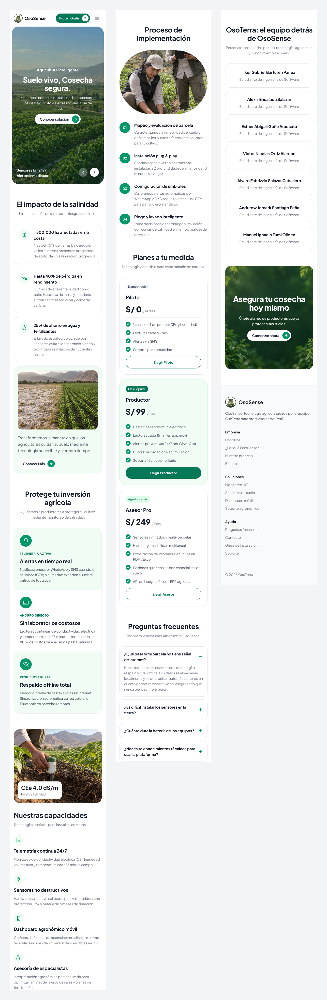

<em>Figura 5.30. Mock-up Mobile Web Browser (390 px), leído de izquierda a derecha en tres tramos.</em>

Diseño en Figma: [OsoSense — Landing Page UI Design](https://www.figma.com/design/w8ggl2291TtYEPmhJ70zrq).

## 5.4. Applications UX/UI Design

### 5.4.1. Applications Wireframes

### 5.4.2. Applications Wireflow Diagrams

### 5.4.2. Applications Mock-ups

### 5.4.3. Applications User Flow Diagrams

## 5.5. Applications Prototyping

## 5.6. IoT Device Design
