

# Capítulo V: Solution UI/UX Design

Este capítulo traduce el análisis de los usuarios (Capítulo II) y el diseño de software (Capítulo IV) en la experiencia visual y de interacción de OsoSense. Se parte de una guía de estilo única, que fija la identidad, los tokens de diseño y las reglas de interacción para todos los productos, y sobre esa base se desarrollan la arquitectura de información, el Landing Page, las aplicaciones web y móvil, su prototipo y el diseño del dispositivo IoT.

## 5.1. Style Guidelines

Las guías de estilo de Oso Terra buscan que el Landing Page, la Web App, la Mobile App y el dispositivo de campo se perciban como un solo producto. Por eso todas las decisiones visuales se expresan como **tokens de diseño** (colores, tipografía, espaciado, formas y movimiento) que se declaran una sola vez y se usan en cada plataforma: como variables CSS en el Landing Page, como tema de Angular Material en la Web App, como `ColorScheme` y `Typography` de Material 3 en Jetpack Compose y como colores y patrones de destello del LED en el dispositivo.

La guía toma como fuente el **Landing Page implementado**, que es el primer producto publicado de OsoSense: sus colores, su tipografía, sus radios y sus espaciados son los valores fijos de la marca. A eso se suman el logo oficial de Oso Terra, los niveles de salinidad que ya calcula la Web App y los hallazgos de las entrevistas (sección 2.2.3) y del perfil de usuarios (sección 1.3). Las decisiones se contrastaron con una base de conocimiento de diseño de interfaces (paletas, combinaciones tipográficas y reglas de UX por tipo de producto), que para productos de tecnología agrícola recomienda un verde de acción con texto blanco solo cuando el contraste es suficiente y, para productos SaaS cercanos, una sola familia tipográfica. Siguiendo esa revisión, el Landing Page pasó sus botones con texto al tono `#047857` de su propia paleta.

Todas las figuras de esta sección se diseñaron en Figma, en seis páginas de Style Guidelines (Marca, Color, Tipografía y espacio, Íconos y componentes, Mobile e IoT, y Datos y accesibilidad). Cada figura muestra un solo tema, con los valores anotados debajo de cada muestra, y se explica en el texto que la acompaña.

### 5.1.1. General Style Guidelines

Esta sección define lo que es común a todos los productos: los principios de diseño, la marca, los colores, la tipografía, el espaciado y la forma, la iconografía y el tono de comunicación.

#### Principios de diseño

Los usuarios principales de OsoSense son productores agrícolas de 54,5 años de edad promedio (sección 1.3) que revisan su información sobre todo desde el celular, muchas veces en campo, y asesores técnicos que necesitan datos precisos para sustentar recomendaciones. Cinco principios ordenan la guía a partir de esa realidad.

| Principio | Qué significa en OsoSense | Decisión que lo aplica |
|---|---|---|
| **Claridad antes que densidad** | El productor debe entender en segundos si su parcela está bien y qué hacer. | Texto base de 16 px, estados con etiqueta cualitativa («Muy alto») y la cifra en dS/m bajo demanda. |
| **El color nunca es el único mensaje** | La salinidad se comunica con color, ícono y texto a la vez. | Píldoras de estado con ícono; número de destellos además del color en el LED. |
| **Consistencia entre productos** | Una misma acción se ve y se llama igual en Landing Page, Web y Mobile. | Tokens únicos y vocabulario oficial del producto. |
| **Accesible por defecto** | Contraste, foco visible y objetivos táctiles amplios desde el diseño. | Contraste mínimo AA (4,5 : 1), objetivos de 44 px en web y 48 dp en Android. |
| **Sereno y accionable** | Una alerta informa el hecho y la acción; no alarma. | Tono sereno y colores de estado sobrios, con el rojo reservado al nivel más alto. |

#### Branding

El logo de Oso Terra combina la silueta de un oso dentro de un círculo, con montañas y colinas en su interior. El oso expresa vigilancia y resistencia; el paisaje, la tierra que se protege. El wordmark usa dos tonos: «Oso» en casi negro y «Terra» en verde oliva. Hay tres versiones del logo.

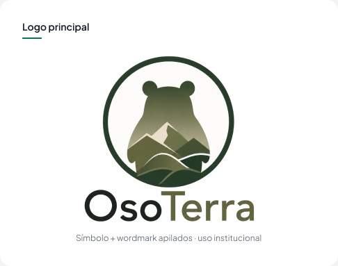

<em>Figura 5.1. Logo principal.</em>

El **logo principal** apila el símbolo sobre el wordmark «OsoTerra». Es la firma de la startup: se usa en documentos, en la carátula de este informe, en presentaciones y en todo lo que habla de la empresa y no de un producto.

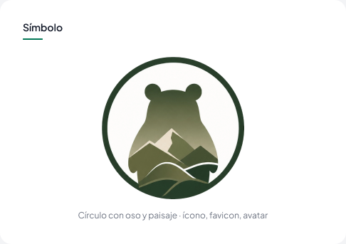

<em>Figura 5.2. Símbolo.</em>

El **símbolo** es solo el círculo con el oso. Se usa donde el espacio es cuadrado o pequeño: favicon, ícono de la aplicación, avatar de notificaciones y grabado del dispositivo.

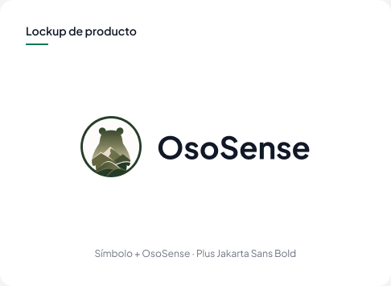

<em>Figura 5.3. Lockup de producto.</em>

El **lockup de producto** pone el símbolo a la izquierda y el nombre «OsoSense» en Plus Jakarta Sans Bold, con una separación de un cuarto del diámetro del símbolo. Es la versión del encabezado y del pie de página del Landing Page y de la barra superior de las aplicaciones.

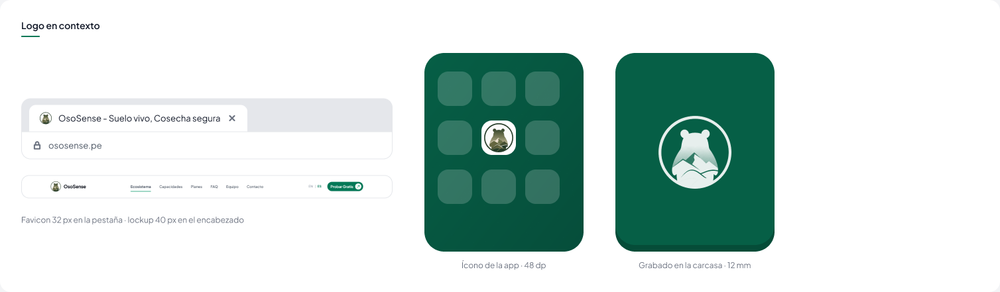

<em>Figura 5.4. Logo en contexto.</em>

La figura anterior muestra el logo en sus cuatro soportes reales, de izquierda a derecha: el favicon de 32 px en la pestaña del navegador junto al título de la página; el lockup de 40 px en el encabezado del Landing Page (captura real); el ícono de la aplicación en la pantalla de inicio de un teléfono, sobre fondo blanco y con esquinas de 16 px; y el símbolo en versión blanca grabado en la carcasa del dispositivo, de 12 mm.

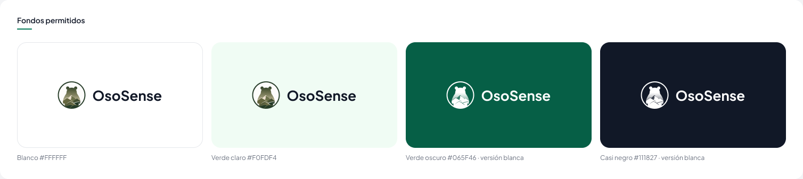

<em>Figura 5.5. Fondos permitidos.</em>

Solo se admiten cuatro fondos: **blanco** `#FFFFFF` y **verde claro** `#F0FDF4`, con el logo a color y el nombre en casi negro; y **verde oscuro** `#065F46` y **casi negro** `#111827`, con la versión monocromática blanca, porque el logo a color pierde contraste sobre fondos oscuros.

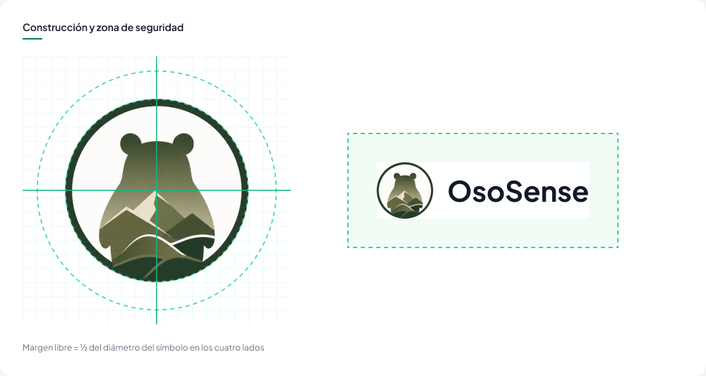

<em>Figura 5.6. Construcción y zona de seguridad.</em>

A la izquierda, la **construcción** del símbolo sobre una cuadrícula de 20 px: el círculo exterior, los ejes que lo centran y dos circunferencias guía que marcan hasta dónde llega el oso. A la derecha, la **zona de seguridad** del lockup: un margen libre igual a la mitad del diámetro del símbolo en los cuatro lados (el recuadro punteado); ningún texto, borde ni imagen entra en esa zona.

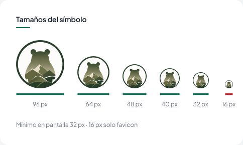

<em>Figura 5.7. Tamaños del símbolo.</em>

| Tamaño | Uso |
|---|---|
| 96 px | Portadas, pantallas de bienvenida y estados vacíos. |
| 64 px | Ícono de la aplicación en la tienda y avatar de notificación. |
| 48 px | Pie de página del Landing Page. |
| 40 px | Encabezado del Landing Page y barras superiores. |
| 32 px | Mínimo en pantalla; por debajo se pierden las montañas interiores. |
| 16 px | Solo favicon (marcado en rojo en la figura); el Landing Page entrega además 64 y 180 px para pantallas de alta densidad. |

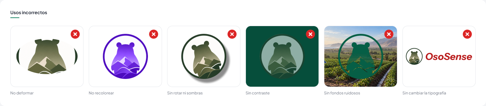

<em>Figura 5.8. Usos incorrectos.</em>

Los seis usos no permitidos, de izquierda a derecha: deformar el símbolo; recolorearlo fuera de la paleta; rotarlo o agregarle sombras; usar la versión a color sobre un fondo oscuro, donde se pierde; colocarlo sobre una fotografía que compite con él; y escribir el nombre con otra tipografía, otro color o en cursiva.

#### Colors

La paleta es la del Landing Page y tiene tres capas: el **verde esmeralda**, que es el color de acción de todos los productos; los **neutros**, que ocupan la mayor parte de cada pantalla; y los **colores del logo**, que solo viven dentro del logo. Se suman los colores de los niveles de salinidad. Las escalas se presentan como estratos de una muestra de suelo, del tono más claro al más oscuro.

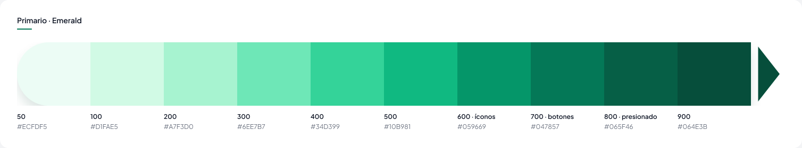

<em>Figura 5.9. Escala del color primario.</em>

| Token | Hex | Uso en el Landing Page y las apps |
|---|---|---|
| `primary-50` | `#ECFDF5` | Fondos muy suaves. |
| `primary-100` | `#D1FAE5` | Contenedores y el indicador de la navegación inferior en Android. |
| `primary-200` a `primary-500` | `#A7F3D0` · `#6EE7B7` · `#34D399` · `#10B981` | Ilustraciones, bandas de gráficos y marcas de medida. |
| `primary-600` | `#059669` | Íconos, números de paso, viñetas, subrayado del menú y círculos de flecha. |
| `primary-700` | `#047857` | Botones con texto blanco, botones de contorno, idioma activo y etiqueta «Más Popular». |
| `primary-800` | `#065F46` | *Hover* y estado presionado de los botones; fondos oscuros de marca. |
| `primary-900` | `#064E3B` | Sombra del verde oscuro y texto sobre superficies verdes cuando se necesita más contraste. |

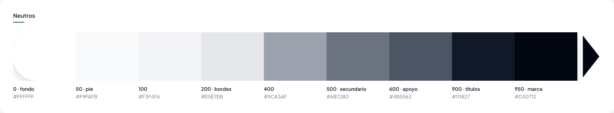

<em>Figura 5.10. Escala de neutros.</em>

| Token | Hex | Uso |
|---|---|---|
| `neutral-0` | `#FFFFFF` | Fondo principal y tarjetas. |
| `neutral-50` | `#F9FAFB` | Pie de página y fondos alternos. |
| `neutral-100` | `#F3F4F6` | Botón del menú, botones secundarios y deshabilitados. |
| `neutral-200` | `#E5E7EB` | Bordes de tarjetas, divisores y campos. |
| `neutral-400` | `#9CA3AF` | Texto de ejemplo y elementos deshabilitados. |
| `neutral-500` | `#6B7280` | Texto secundario y bajadas. |
| `neutral-600` | `#4B5563` | Texto de apoyo en párrafos largos. |
| `neutral-900` | `#111827` | Títulos y texto principal. |
| `neutral-950` | `#030712` | Nombre del producto en el lockup. |

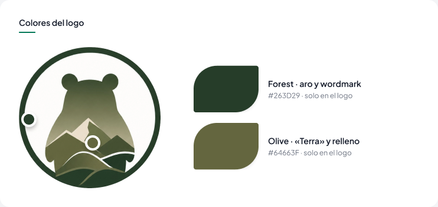

<em>Figura 5.11. Colores del logo.</em>

Los dos colores del logo se muestrearon del propio símbolo (los puntos sobre la imagen): **Forest** `#263D29`, del aro y del wordmark, y **Olive** `#64663F`, de «Terra» y del relleno del oso. Solo se usan dentro del logo, para no competir con el verde de acción de la interfaz.

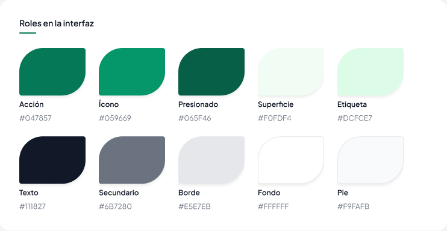

<em>Figura 5.12. Roles de color.</em>

La figura resume qué color cumple cada rol, en dos filas: **acción** `#047857`, **ícono** `#059669`, **presionado** `#065F46`, **superficie** `#F0FDF4` (tarjetas destacadas y plan recomendado) y **etiqueta** `#DCFCE7`; y **texto** `#111827`, **secundario** `#6B7280`, **borde** `#E5E7EB`, **fondo** `#FFFFFF` y **pie** `#F9FAFB`. Las muestras tienen forma de hoja, el motivo que acompaña a la paleta.

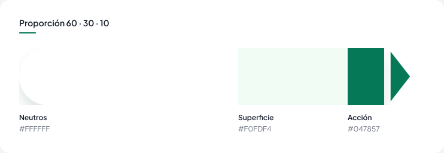

<em>Figura 5.13. Proporción de uso.</em>

La **regla 60 · 30 · 10** equilibra cada pantalla: alrededor del 60 % es blanco o neutro, un 30 % son superficies verdes claras que agrupan contenido destacado y solo un 10 % es verde de acción. Así la mirada va directo a los botones.

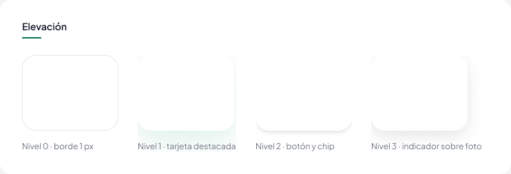

<em>Figura 5.14. Elevación.</em>

La elevación es mínima y tiene cuatro niveles, de izquierda a derecha: **nivel 0**, borde de 1 px `#E5E7EB` sin sombra (tarjetas de datos, preguntas frecuentes); **nivel 1**, sombra verde suave de 40 px de desenfoque (plan recomendado); **nivel 2**, sombra corta de 4 a 6 px (botones y chips); y **nivel 3**, sombra de 24 px (indicador de salinidad sobre fotografía).

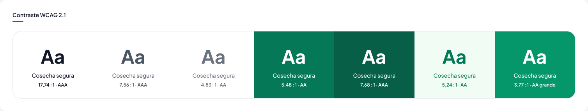

<em>Figura 5.15. Contraste WCAG 2.1.</em>

Los contrastes se calcularon con la fórmula de luminancia relativa de WCAG 2.1 (4,5 : 1 para texto normal y 3 : 1 para texto grande y componentes). La tabla sigue el orden de la figura:

| Texto sobre fondo | Ratio | Resultado | Uso |
|---|---|---|---|
| `#111827` sobre blanco | 17,74 : 1 | AAA | Títulos y texto principal. |
| `#4B5563` sobre blanco | 7,56 : 1 | AAA | Párrafos de apoyo. |
| `#6B7280` sobre blanco | 4,83 : 1 | AA | Bajadas y texto secundario. |
| Blanco sobre `#047857` | 5,48 : 1 | AA | Botones con texto. |
| Blanco sobre `#065F46` | 7,68 : 1 | AAA | Botón presionado y fondos oscuros. |
| `#047857` sobre `#F0FDF4` | 5,24 : 1 | AA | Etiquetas sobre superficie verde. |
| Blanco sobre `#059669` | 3,77 : 1 | AA texto grande | Solo íconos y flechas dentro de círculos, nunca texto normal. |

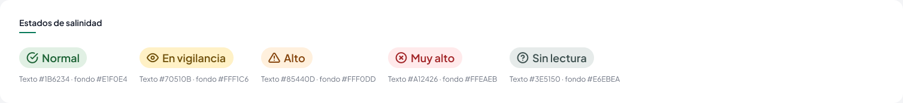

<em>Figura 5.16. Colores de estado de salinidad.</em>

Los niveles de salinidad tienen colores propios, independientes del verde de marca, porque comunican riesgo. Se calculan como la relación entre la conductividad eléctrica del extracto de saturación (ECe) y el umbral de tolerancia del cultivo, según Maas y Hoffman (1977), y la Web App ya aplica esta regla.

| Nivel | Ícono | Texto | Fondo | Cuándo |
|---|---|---|---|---|
| Normal | círculo con check | `#1B6234` | `#E1F0E4` | ECe < 0,8 × umbral |
| En vigilancia | ojo | `#70510B` | `#FFF1C6` | 0,8 × umbral ≤ ECe ≤ 1,0 × umbral |
| Alto | triángulo | `#85440D` | `#FFF0DD` | 1,0 × umbral < ECe ≤ 1,25 × umbral |
| Muy alto | círculo con aspa | `#A12426` | `#FFEAEB` | ECe > 1,25 × umbral |
| Sin lectura | signo de pregunta | `#3E5150` | `#E6EBEA` | El dispositivo aún no reporta |

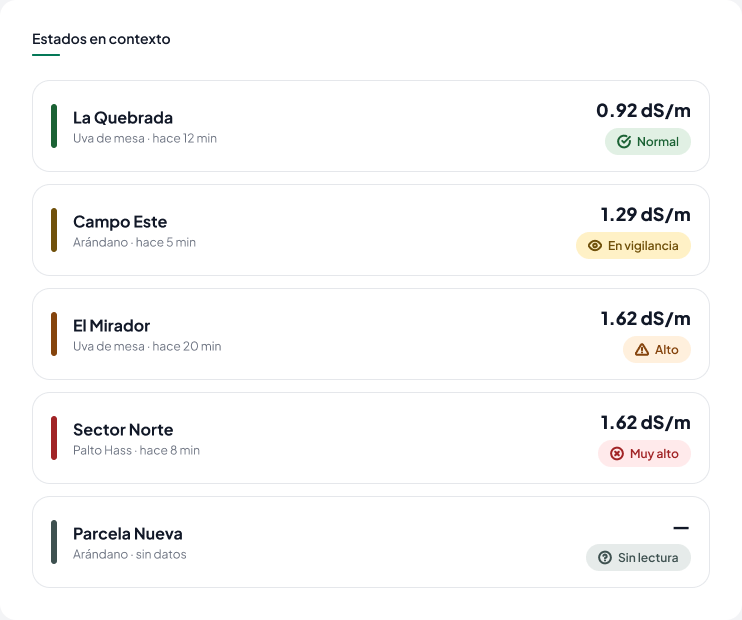

<em>Figura 5.17. Estados en contexto.</em>

En contexto, cada parcela de la lista lleva una barra lateral con el color de su nivel, el valor de ECe en grande y la píldora con ícono y palabra. Los valores son los de las parcelas de demostración de la Web App y muestran que el nivel depende del cultivo: la misma lectura de 1,62 dS/m es *muy alto* en el palto de Sector Norte y solo *alto* en la uva de mesa de El Mirador.

| Cultivo | Umbral ECe | Pérdida por dS/m sobre el umbral | Fuente |
|---|---|---|---|
| Uva de mesa | 1,5 dS/m | 9,6 % | Maas y Hoffman (1977), recogido por Ayers y Westcot (1985). |
| Palto | 1,1 dS/m (referencial) | Sin dato publicado | Umbral de agua de riego de 0,75 dS/m citado por Acosta-Rangel et al. (2019), convertido a ECe con la relación ECe ≈ 1,5 × ECw de Ayers y Westcot (1985). |
| Arándano | 1,5 dS/m (referencial) | Sin dato publicado | Machado et al. (2014): el crecimiento de raíces y hojas se reduce por encima de 1,5 dS/m. |

El palto figura como cultivo sensible en las tablas de FAO, pero sin un umbral de ECe propio; por eso su valor se marca como referencial y, al igual que en el arándano, la plataforma no estima pérdida de rendimiento sin una pendiente publicada.

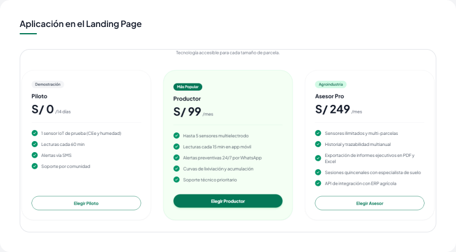

<em>Figura 5.18. Aplicación en el Landing Page.</em>

La sección de planes del Landing Page (captura real) aplica la paleta: fondo blanco, tarjetas con borde neutro, el plan recomendado sobre superficie verde clara y un único botón lleno en `#047857`.

#### Typography

Se usa una sola familia: **Plus Jakarta Sans**, la del Landing Page, que la carga desde Google Fonts; la Web App la incluye dentro de la propia aplicación (con `@fontsource`), para no depender de la red en zonas con señal intermitente. Es una sans-serif geométrica de trazo abierto, pensada para pantallas, con pesos de 200 a 800 y cobertura completa del español y del inglés. Una sola familia simplifica la carga, algo importante con conexiones rurales lentas, y la jerarquía se construye con tamaño y peso.

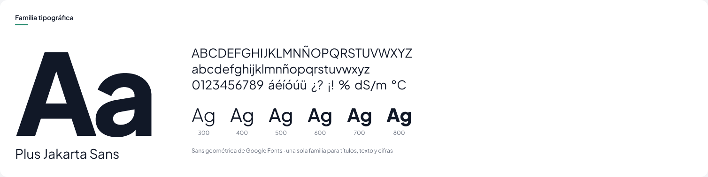

<em>Figura 5.19. Familia tipográfica.</em>

A la izquierda, el nombre de la familia; a la derecha, el alfabeto con la eñe, las cifras, las tildes, los signos de apertura del español y las unidades del producto (dS/m y °C), y debajo los seis pesos disponibles, de Light 300 a ExtraBold 800.

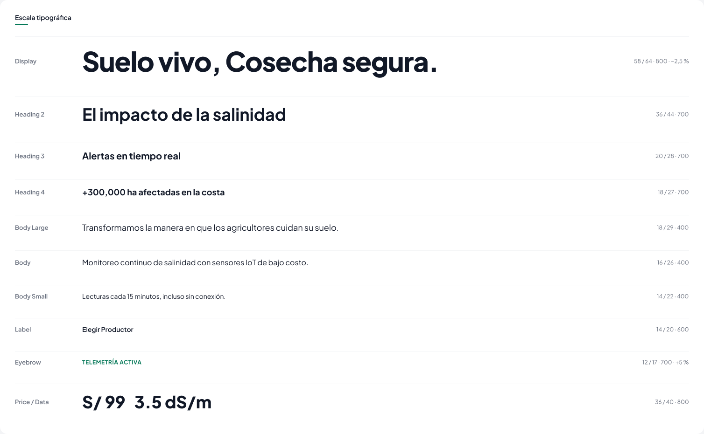

<em>Figura 5.20. Escala tipográfica.</em>

| Estilo | Peso | Tamaño / interlínea | Uso |
|---|---|---|---|
| Display | ExtraBold 800, −2,5 % | 58 / 64 px (30 px en móvil) | Titular del hero. |
| Heading 2 | Bold 700 | 36 / 44 px (28 px en móvil) | Título de sección. |
| Heading 3 | Bold 700 | 20 / 28 px | Título de beneficio o de plan. |
| Heading 4 | Bold 700 | 18 / 27 px | Título de dato, capacidad o pregunta. |
| Body Large | Regular 400 | 18 / 29 px | Texto destacado en tarjetas. |
| Body | Regular 400 | 16 / 26 px | Texto base. |
| Body Small | Regular 400 | 14 / 22 px | Bajadas, descripciones y pie de página. |
| Label | SemiBold 600 | 14 / 20 px | Botones, menú y etiquetas. |
| Eyebrow | Bold 700, mayúsculas, +5 % | 12 / 17 px | Rótulo sobre el título de un beneficio. |
| Price / Data | ExtraBold 800 | 36 / 40 px | Precios y cifras de salinidad. |

El cuerpo no baja de 16 px por la edad promedio del segmento 1; las líneas de texto corrido tienen entre 45 y 75 caracteres; y se reserva un 30 % de ancho extra en botones y etiquetas porque el español ocupa hasta un tercio más que el inglés.

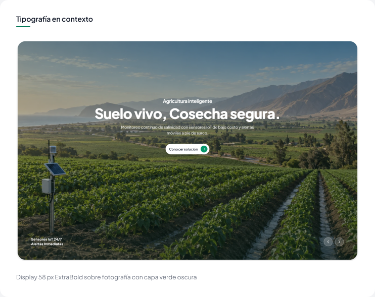

<em>Figura 5.21. Tipografía en contexto.</em>

En el hero del Landing Page (captura real), el Display blanco de 58 px se apoya en una capa verde oscura semitransparente sobre la fotografía; encima va el rótulo «Agricultura inteligente» en Heading 3 y debajo la bajada en Body.

#### Spacing

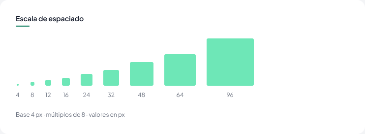

<em>Figura 5.22. Escala de espaciado.</em>

| Token | Valor | Uso |
|---|---|---|
| `space-1` | 4 px | Entre ícono y texto muy juntos. |
| `space-2` | 8 px | Entre título y bajada. |
| `space-3` | 12 px | Entre el texto del botón y su círculo; relleno de chips. |
| `space-4` | 16 px | Margen lateral en móvil y separación de columnas. |
| `space-5` | 24 px | Relleno interno de tarjetas. |
| `space-6` | 32 px | Entre tarjetas y relleno de tarjetas grandes. |
| `space-7` | 48 px | Entre el encabezado de sección y su contenido. |
| `space-8` | 64 px | Separación de secciones en móvil. |
| `space-9` | 96 px | Separación de secciones en escritorio. |

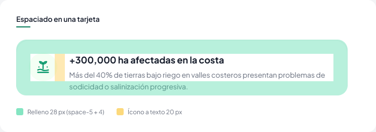

<em>Figura 5.23. Espaciado en una tarjeta.</em>

Sobre una tarjeta real del Landing Page, las bandas verdes marcan el relleno de 28 px en los cuatro lados y la banda amarilla, los 20 px entre el ícono y el texto.

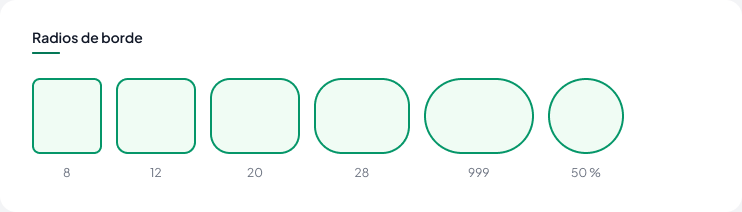

<em>Figura 5.24. Radios de borde.</em>

| Radio | Valor | Uso |
|---|---|---|
| `radius-sm` | 8 px | Campos compactos e imágenes pequeñas. |
| `radius-md` | 12 px | Campos de formulario. |
| `radius-lg` | 20 px | Tarjetas de datos. |
| `radius-xl` | 28 px | Planes, hero y banners (32 px en el hero de escritorio). |
| `radius-pill` | 999 px | Botones, etiquetas y píldoras. |
| Círculo | 50 % | Íconos de fondo, avatar y símbolo. |

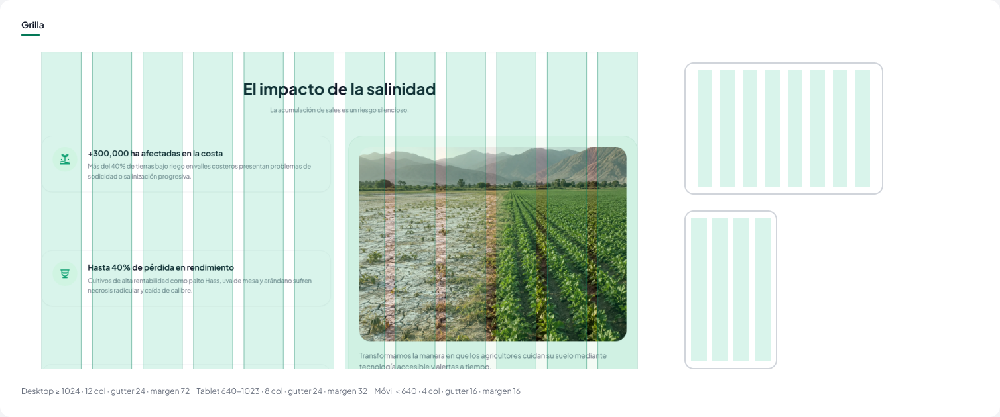

<em>Figura 5.25. Grilla.</em>

A la izquierda, la grilla de 12 columnas superpuesta a la sección de impacto del Landing Page; a la derecha, las grillas de tablet (8 columnas) y móvil (4 columnas).

| Ancho | Columnas | Gutter | Margen lateral |
|---|---|---|---|
| ≥ 1024 px | 12 | 24 px | 72 px (contenedor hasta 1440 px) |
| 640–1023 px | 8 | 24 px | 32 px |
| < 640 px | 4 | 16 px | 16 px |

Objetivos táctiles de 44 × 44 px como mínimo en web y 48 × 48 dp en Android, con al menos 8 px entre ellos.

#### Iconography

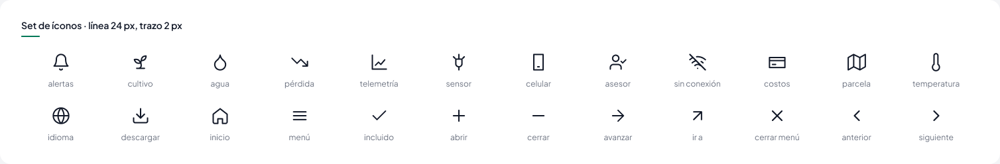

<em>Figura 5.26. Set de íconos.</em>

Se usan **íconos de línea** de 24 × 24 px con trazo de 2 px y extremos redondeados, el estilo del Landing Page. La figura reúne los 24 íconos del producto con su significado: alertas, cultivo, agua, pérdida, telemetría, sensor, celular, asesor, sin conexión, costos, parcela, temperatura, idioma, descargar, inicio, menú, incluido, abrir, cerrar, avanzar, ir a, cerrar menú, anterior y siguiente.

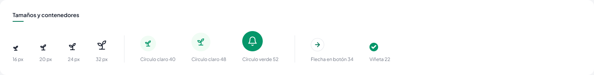

<em>Figura 5.27. Tamaños y contenedores.</em>

De izquierda a derecha: el ícono suelto en 16, 20, 24 y 32 px; dentro de un círculo verde claro de 40 y 48 px (datos y capacidades); dentro de un círculo verde de 52 px (beneficios destacados); la flecha en el círculo blanco de 34 px de los botones; y la viñeta de 22 px de las listas de planes.

Todo ícono con función lleva texto visible o `aria-label`; los decorativos llevan `aria-hidden="true"`; no se mezclan íconos rellenos con íconos de línea (la Web App usa Material Icons en su variante *Outlined*, con los mismos nombres de ícono); y los íconos de estado siempre acompañan a la palabra del estado.

#### Tone of voice

Las cuatro dimensiones de tono que exige el enunciado se fijaron a partir de las entrevistas de la sección 2.2.3 y del perfil de usuarios de la sección 1.3.

| Dimensión | Posición | Sustento |
|---|---|---|
| Divertido / Serio | **Serio** | Se comunican riesgos de pérdida de cosecha, y el asesor sustenta recomendaciones profesionales. Sin bromas ni exclamaciones. |
| Formal / Casual | **Casual cercano** | Lenguaje cotidiano y frases cortas, sin jerga técnica; trato de «tú», como el Landing Page. Los productores entrevistados piden indicaciones claras y mediciones explicadas de forma simple. |
| Respetuoso / Irreverente | **Respetuoso** | Usuarios de mayor edad con desconfianza inicial hacia un sensor de bajo costo; nunca se culpa al usuario. |
| Entusiasta / Sereno | **Sereno** | Una alerta crítica no debe alarmar, sino informar el hecho y la acción a tomar. El entusiasmo se reserva para logros, como una salinidad que baja. |

El nivel de detalle cambia según quién lee: al **productor**, frases de hasta 20 palabras y valores cualitativos, con la medida en dS/m bajo demanda; al **asesor técnico**, lenguaje profesional y dato crudo (ECe, umbral, tendencia); y al **visitante del Landing Page**, titulares breves centrados en el beneficio («Suelo vivo, Cosecha segura.») y verbos de acción en los botones.

| Contexto | Así sí | Así no |
|---|---|---|
| Alerta crítica | «Salinidad muy alta en Sector Norte. Riega con agua de menor salinidad y revisa el drenaje hoy.» | «¡¡ALERTA!! EC 6.2 dS/m excede el umbral ECe del cultivo!!!» |
| Estado vacío | «Aún no hay lecturas. Conecta tu dispositivo para ver la salinidad de esta parcela.» | «Error 404: no se encontraron datos de telemetría.» |
| Error de formulario | «Usa al menos 12 caracteres.» | «Contraseña inválida.» |
| Logro | «La salinidad de La Quebrada bajó a nivel normal. El lavado de sales funcionó.» | «¡¡Felicidades, campeón!!» |

El producto usa **una sola palabra por concepto**: *parcela* (no lote ni terreno), *lectura* (no muestra), *dispositivo* (no nodo), *acción correctiva* y los estados *normal, en vigilancia, alto y muy alto*. Los botones llevan un verbo y, si hace falta, un objeto («Elegir Productor», «Registrar acción»), y la unidad se separa de la cifra con un espacio (3.5 dS/m).

### 5.1.2. Web, Mobile and IoT Style Guidelines

Sobre la base común de la sección 5.1.1, esta sección fija los estándares visuales y de interacción de cada plataforma.

#### Web: componentes

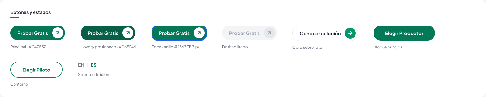

<em>Figura 5.28. Botones y estados.</em>

En la fila superior, el botón principal en sus cuatro estados: **reposo** (píldora `#047857` con círculo blanco y flecha), **hover y presionado** (`#065F46`), **foco** (anillo azul `#2563EB` de 3 px por fuera) y **deshabilitado** (gris). En la fila inferior: el botón **claro sobre fotografía** (blanco con círculo `#059669`), el **botón de bloque** de los planes, el **botón de contorno** de los planes no recomendados y el **selector de idioma** con el idioma activo en `#047857`. Solo hay un botón con relleno por bloque.

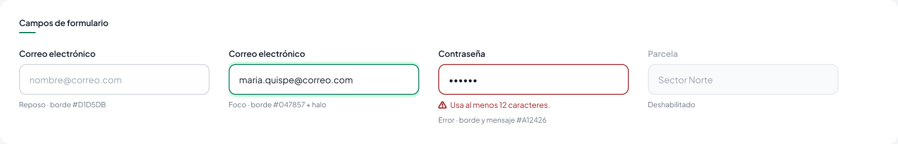

<em>Figura 5.29. Campos de formulario.</em>

De izquierda a derecha: campo en **reposo** con borde `#D1D5DB` y texto de ejemplo gris; en **foco**, con borde `#047857` y halo verde claro de 4 px; con **error**, borde `#A12426`, ícono y un mensaje que explica cómo corregir; y **deshabilitado**, con fondo gris claro. La etiqueta siempre está visible arriba del campo, nunca solo como texto de ejemplo.

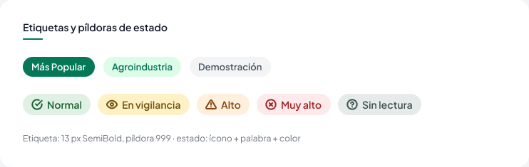

<em>Figura 5.30. Etiquetas y píldoras.</em>

Arriba, las tres etiquetas del Landing Page: destacada (verde lleno), de categoría (verde claro) y neutra (gris). Abajo, las cinco píldoras de estado, que combinan ícono, palabra y color.

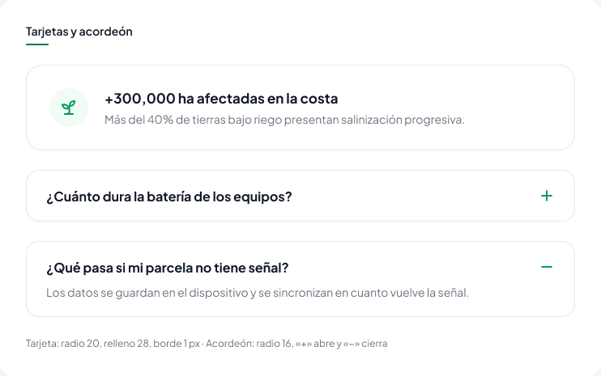

<em>Figura 5.31. Tarjetas y acordeón.</em>

Arriba, la tarjeta de dato: ícono en círculo claro, título Heading 4 y descripción, con radio de 20 px, relleno de 28 px y borde de 1 px. Abajo, el acordeón de preguntas frecuentes cerrado (signo «+») y abierto (signo «−» y respuesta en texto secundario).

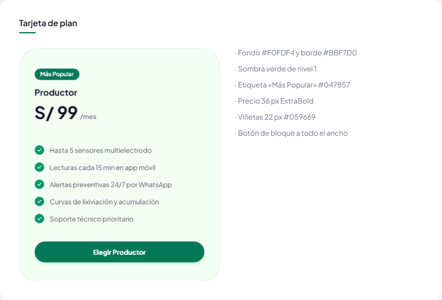

<em>Figura 5.32. Tarjeta de plan.</em>

La tarjeta del plan recomendado (captura real) combina los tokens: superficie `#F0FDF4` con borde `#BBF7D0` y sombra de nivel 1, etiqueta «Más Popular», precio en 36 px ExtraBold, viñetas de 22 px y botón de bloque a todo el ancho.

#### Web: navegación e interfaces responsive

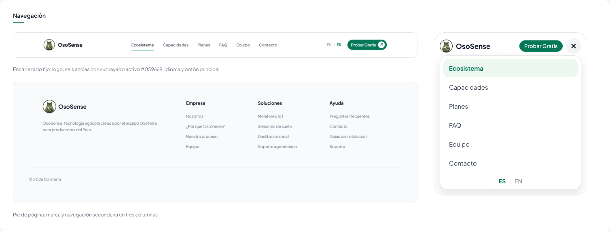

<em>Figura 5.33. Navegación.</em>

A la izquierda, el **encabezado fijo** del Landing Page (logo, seis anclas con el subrayado activo en `#059669`, selector de idioma y botón principal) y el **pie de página** con la marca y tres columnas de navegación secundaria. A la derecha, el **menú móvil abierto**: el botón de hamburguesa se convierte en una «×» y despliega un panel con las seis anclas, la activa resaltada en verde claro, y el selector de idioma al final.

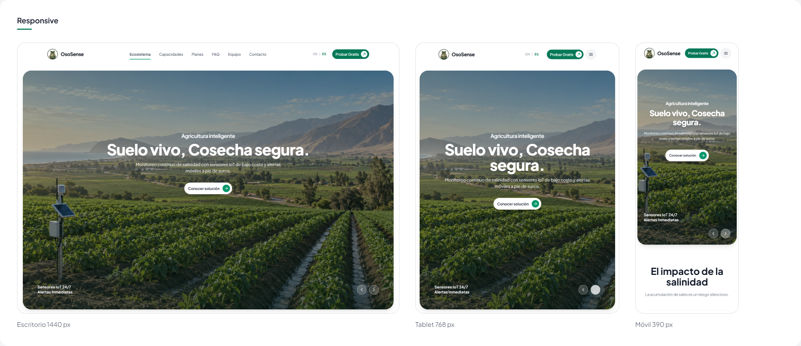

<em>Figura 5.34. Responsive.</em>

El mismo diseño en tres anchos reales, de izquierda a derecha: escritorio (1440 px), tablet (768 px) y móvil (390 px).

| Ancho | Comportamiento |
|---|---|
| ≥ 1200 px | Menú horizontal completo con selector de idioma y botón *Probar Gratis*; grillas de 2, 3 y 4 columnas. |
| 640–1199 px | El menú pasa a un botón de hamburguesa que despliega un panel; las grillas de 3 columnas pasan a 1 o 2. |
| < 640 px | Una columna; titular de 30 px; secciones a 64 px; selector de idioma dentro del menú. |

En la Web App, cuyo prototipo usa cortes de 700, 900 y 1100 px, la barra lateral pasa a un cajón deslizable por debajo de 900 px y las tablas se convierten en listas de tarjetas con la píldora de estado visible.

#### Mobile: aplicación Android

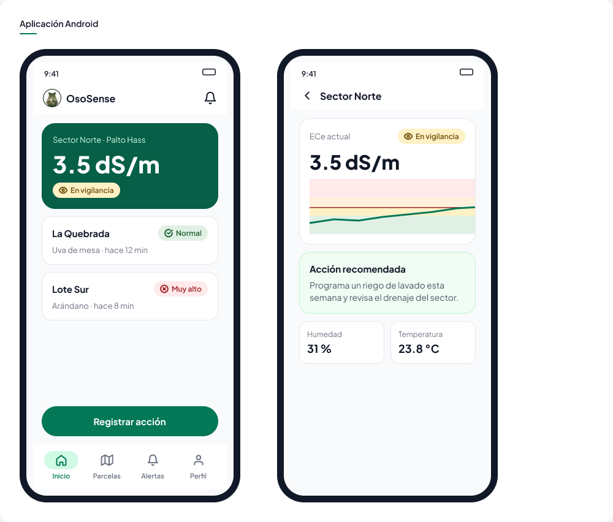

<em>Figura 5.35. Aplicación Android.</em>

La Mobile App (Kotlin y Jetpack Compose con Material 3) usa los mismos tokens. A la izquierda, la **pantalla de inicio**: barra superior con el lockup y la campana; tarjeta principal verde oscuro con la parcela, la cifra en Data y la píldora de estado; lista de parcelas; botón principal a todo el ancho; y navegación inferior con cuatro destinos (Inicio, Parcelas, Alertas y Perfil), con el activo resaltado en `#D1FAE5`. A la derecha, el **detalle de parcela**: cifra actual con su píldora, mini gráfico con las bandas de nivel y el umbral, la acción recomendada sobre superficie verde clara y las lecturas de humedad y temperatura.

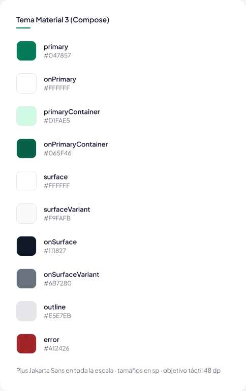

<em>Figura 5.36. Tema Material 3.</em>

El tema de Compose asigna los tokens a los roles de Material 3: `primary` `#047857`, `onPrimary` blanco, `primaryContainer` `#D1FAE5`, `onPrimaryContainer` `#065F46`, `surface` blanco, `surfaceVariant` `#F9FAFB`, `onSurface` `#111827`, `onSurfaceVariant` `#6B7280`, `outline` `#E5E7EB` y `error` `#A12426`. Toda la escala tipográfica usa Plus Jakarta Sans en `sp` y el objetivo táctil es de 48 dp.

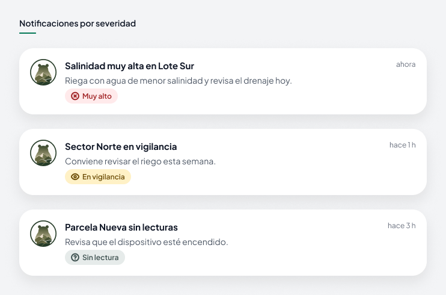

<em>Figura 5.37. Notificaciones por severidad.</em>

Cada notificación muestra el símbolo, un título con el hecho, un texto con la acción y la píldora del nivel. Cada severidad tiene su canal de Android: «Muy alto» con vibración y aviso emergente, «En vigilancia» con sonido discreto y «Sin lectura» como resumen.

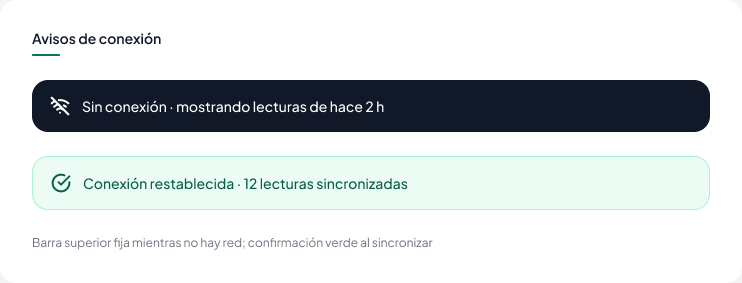

<em>Figura 5.38. Avisos de conexión.</em>

Sin red, una barra oscura fija indica desde cuándo son los datos que se muestran; al volver la conexión, una barra verde clara confirma cuántas lecturas se sincronizaron.

#### IoT: interfaz física del dispositivo

El dispositivo de campo (ESP32 con sonda de conductividad eléctrica, humedad y temperatura) no tiene pantalla: se comunica con un LED RGB, un botón y la carcasa.

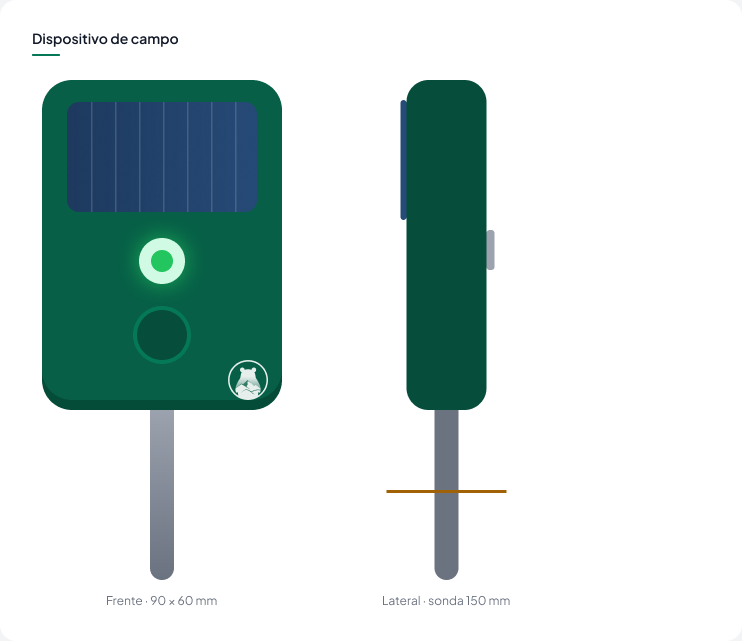

<em>Figura 5.39. Dispositivo de campo.</em>

En la **vista frontal**, de arriba abajo: panel solar en la tapa, LED de estado bajo un difusor translúcido, botón único y el símbolo de Oso Terra grabado en blanco; debajo sale la sonda. La carcasa mide 90 × 60 mm, en plástico ABS/ASA estabilizado contra rayos UV color `#065F46`, con sellado IP65 y esquinas de 12 mm. En la **vista lateral** se ven el panel, el botón y la sonda de 150 mm; la línea discontinua marca el nivel del suelo.

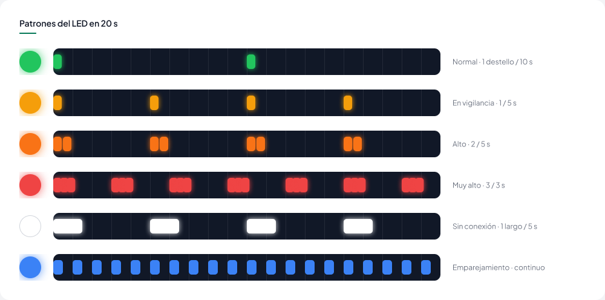

<em>Figura 5.40. Patrones del LED.</em>

Cada fila muestra 20 segundos de un estado: el color del LED a la izquierda y, en la franja oscura, los momentos en que se enciende. Cada estado se distingue por **color y número de destellos**, para reconocerlo con daltonismo o con sol intenso.

| Estado | Color | Patrón | Significado |
|---|---|---|---|
| Normal | Verde | 1 destello cada 10 s | Todo bien; ahorra batería. |
| En vigilancia | Ámbar | 1 destello cada 5 s | Conviene revisar el riego esta semana. |
| Alto | Naranja | 2 destellos cada 5 s | Reducir sales: riego de lavado y drenaje. |
| Muy alto | Rojo | 3 destellos rápidos cada 3 s | Requiere acción hoy; el aviso llega también a la app. |
| Sin conexión | Blanco | 1 destello largo cada 5 s | Guarda lecturas y las sincroniza después. |
| Emparejamiento | Azul | Parpadeo continuo | Vinculación con la app durante 2 minutos. |

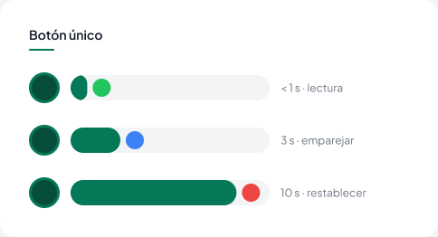

<em>Figura 5.41. Botón único.</em>

La barra verde representa cuánto se mantiene pulsado el botón y el punto de color, la respuesta del LED: menos de 1 s toma una lectura y la envía (verde); 3 s activa el emparejamiento (azul); 10 s restablece la configuración de fábrica (rojo, con tres destellos de aviso).

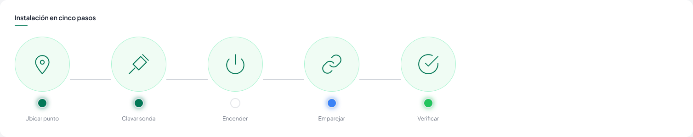

<em>Figura 5.42. Instalación en cinco pasos.</em>

La puesta en marcha se hace sin herramientas y cada paso tiene una respuesta visible del LED (el punto bajo cada ícono): ubicar un punto representativo de la parcela, clavar la sonda hasta la línea de suelo, encender con el botón (blanco), emparejar con la app (azul) y verificar la primera lectura (verde).

#### Visualización de datos

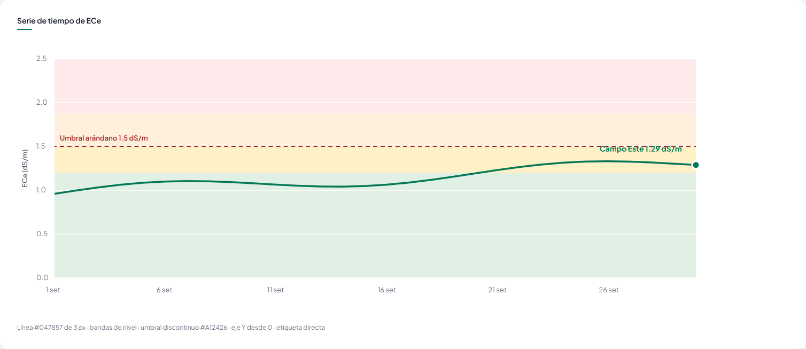

<em>Figura 5.43. Serie de tiempo de ECe. Datos ilustrativos.</em>

El gráfico tipo de la plataforma muestra la ECe de una parcela durante un mes (en la figura, el arándano de Campo Este frente a su umbral de 1,5 dS/m): línea `#047857` de 3 px; bandas de fondo con los colores de los cuatro niveles, para leer el nivel sin leyenda; umbral del cultivo como línea discontinua `#A12426` con su etiqueta; eje Y desde cero con la unidad; fechas cortas en el eje X; y la etiqueta directa del valor actual junto al último punto.

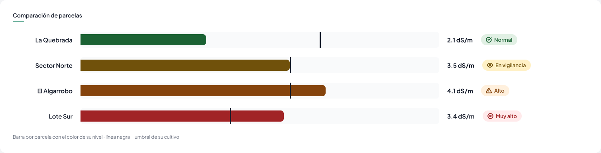

<em>Figura 5.44. Comparación de parcelas. Datos ilustrativos.</em>

Para comparar parcelas en un instante se usan barras horizontales con el color del nivel de cada una y una línea negra que marca el umbral de su cultivo; a la derecha van el valor y la píldora. Nunca se usan gráficos circulares ni en 3D, se muestran como máximo cuatro series por gráfico y cada gráfico tiene una tabla alternativa (fecha, ECe y nivel) con un resumen en texto para lectores de pantalla.

#### Accesibilidad, idioma y movimiento

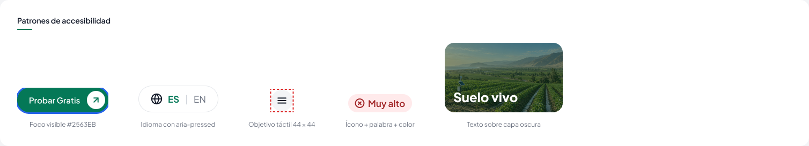

<em>Figura 5.45. Patrones de accesibilidad.</em>

De izquierda a derecha: el **foco visible**, un anillo azul `#2563EB` en todo elemento interactivo al navegar con teclado; el **selector de idioma** en el encabezado, con `aria-pressed`; el **objetivo táctil** mínimo de 44 × 44 px (recuadro rojo) aunque el ícono sea más pequeño; el **estado con ícono y palabra**, nunca solo color; y el **texto sobre fotografía**, apoyado en una capa verde oscura.

| Principio WCAG 2.1 (AA) | Reglas |
|---|---|
| Perceptible | Contraste de 4,5 : 1 en texto y 3 : 1 en componentes; el estado nunca se comunica solo con color; texto ampliable al 200 %; texto alternativo en fotos informativas y `alt=""` en decorativas. |
| Operable | Todo se maneja con teclado; foco siempre visible; objetivos táctiles de 44 px; nada parpadea más de tres veces por segundo. |
| Comprensible | Idioma declarado en `lang`; mensajes de error que explican cómo corregir; etiquetas visibles; navegación igual en todas las páginas. |
| Robusto | HTML semántico con `aria-label`, `aria-labelledby`, `aria-expanded`, `aria-controls` y `aria-pressed`; cambios de estado anunciados con `aria-live` en las aplicaciones. |

El Landing Page ya aplica `aria-label` en la navegación y el menú, `aria-labelledby` en cada sección, `aria-expanded` y `aria-controls` en el menú móvil, `aria-pressed` en el selector de idioma, textos alternativos y `prefers-reduced-motion`. La Web App incorpora además un enlace «Saltar al contenido», `aria-current="page"`, `role="alert"` en los errores, avisos con `role="status"` y `aria-live` cuando se reconoce una alerta o se registra una acción, y conserva en la dirección web los filtros de Alertas y la pestaña abierta del detalle de parcela, para poder compartir o recuperar la vista.

**Internacionalización.** Todos los productos se ofrecen en inglés (en_US) y español latinoamericano (es_419) con el selector EN / ES; los textos viven en archivos de traducción, las fechas siguen el formato de cada idioma y las unidades se mantienen (3.5 dS/m, 4.2 ha, 23.8 °C).

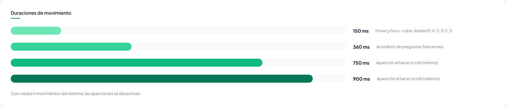

<em>Figura 5.46. Duraciones de movimiento.</em>

El movimiento explica cambios y nunca es decorativo. En el Landing Page, los cambios de color de *hover* y foco duran 150 ms con la curva `cubic-bezier(0.4, 0, 0.2, 1)`; el acordeón se abre en 360 ms; y las tarjetas aparecen al hacer scroll entre 750 y 900 ms con un leve desplazamiento vertical. Con la preferencia «reducir movimiento» del sistema, las apariciones se desactivan y el contenido se muestra directamente.

Diseño en Figma: [Marca](https://www.figma.com/design/w8ggl2291TtYEPmhJ70zrq/OsoSense-%E2%80%94-Landing-Page-UI-Design?node-id=13-17&t=zv0k9BZ0KNZ8WH8D-1), [Color](https://www.figma.com/design/w8ggl2291TtYEPmhJ70zrq/OsoSense-%E2%80%94-Landing-Page-UI-Design?node-id=13-18&t=zv0k9BZ0KNZ8WH8D-1), [Tipografía y espacio](https://www.figma.com/design/w8ggl2291TtYEPmhJ70zrq/OsoSense-%E2%80%94-Landing-Page-UI-Design?node-id=13-19&t=zv0k9BZ0KNZ8WH8D-1), [Íconos y componentes](https://www.figma.com/design/w8ggl2291TtYEPmhJ70zrq/OsoSense-%E2%80%94-Landing-Page-UI-Design?node-id=13-20&t=zv0k9BZ0KNZ8WH8D-1), [Mobile e IoT](https://www.figma.com/design/w8ggl2291TtYEPmhJ70zrq/OsoSense-%E2%80%94-Landing-Page-UI-Design?node-id=13-21&t=zv0k9BZ0KNZ8WH8D-1) y [Datos y accesibilidad](https://www.figma.com/design/w8ggl2291TtYEPmhJ70zrq/OsoSense-%E2%80%94-Landing-Page-UI-Design?node-id=13-22&t=zv0k9BZ0KNZ8WH8D-1).

## 5.2. Information Architecture

La arquitectura de información del Landing Page responde a una pregunta: ¿qué necesita saber un productor o un asesor técnico, y en qué orden, para decidir probar OsoSense? Las entrevistas (sección 2.2.3) mostraron que el productor desconfía de un sensor de bajo costo, no conoce la salinidad como un problema medible y quiere indicaciones claras; el asesor busca datos que sustenten sus recomendaciones. Por eso el contenido se ordena como un recorrido que primero hace visible el problema, luego muestra la solución y cómo se adopta, y al final da confianza antes de pedir una acción.

El Landing Page es una **sola página** de once bloques con anclas (`#id`). Esta decisión reduce la carga de navegación (no hay páginas internas que recordar), funciona bien con conexiones rurales lentas porque todo se carga una sola vez y permite enlazar directamente a cualquier bloque desde WhatsApp o desde la Web App. Los diagramas de esta sección se elaboraron en Figma, en la página «IA · Landing Page».

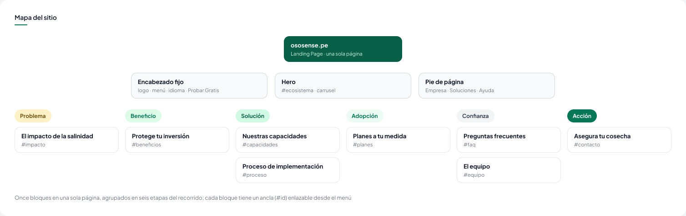

<em>Figura 5.47. Mapa del sitio del Landing Page.</em>

El mapa del sitio muestra la raíz (`ososense.pe`), los tres elementos que acompañan a toda la página (encabezado fijo, hero y pie de página) y los ocho bloques de contenido agrupados en seis etapas del recorrido: **Problema**, **Beneficio**, **Solución**, **Adopción**, **Confianza** y **Acción**. Cada bloque tiene un ancla propia (por ejemplo `#planes`), que es el destino de los enlaces del menú.

### 5.2.1. Organization Systems

Se usan los tres sistemas de organización visual, cada uno en el grupo de información donde ayuda más.

**Organización secuencial (paso a paso).** Es el sistema principal de la página: los bloques siguen un orden fijo, de modo que cada uno responde la pregunta que deja el anterior.

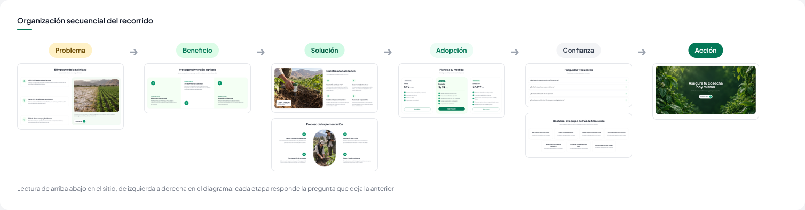

<em>Figura 5.48. Organización secuencial del recorrido.</em>

| Etapa | Bloque | Pregunta del visitante que responde |
|---|---|---|
| Problema | El impacto de la salinidad | ¿Por qué debería preocuparme la sal en mi suelo? |
| Beneficio | Protege tu inversión agrícola | ¿Qué gano con medirla? |
| Solución | Nuestras capacidades · Proceso de implementación | ¿Qué hace OsoSense y cómo se instala? |
| Adopción | Planes a tu medida | ¿Cuánto cuesta y cuál me conviene? |
| Confianza | Preguntas frecuentes · El equipo | ¿Funciona sin señal? ¿Quién está detrás? |
| Acción | Asegura tu cosecha | ¿Qué hago ahora? |

Dentro del bloque de proceso se repite el patrón secuencial: los cuatro pasos numerados (mapeo, instalación, umbrales y riego) se leen en orden, en zigzag alrededor de la foto en escritorio y en lista vertical en móvil.

**Organización jerárquica (jerarquía visual).** Dentro de cada bloque, el contenido se ordena por importancia con tamaño, peso y posición.

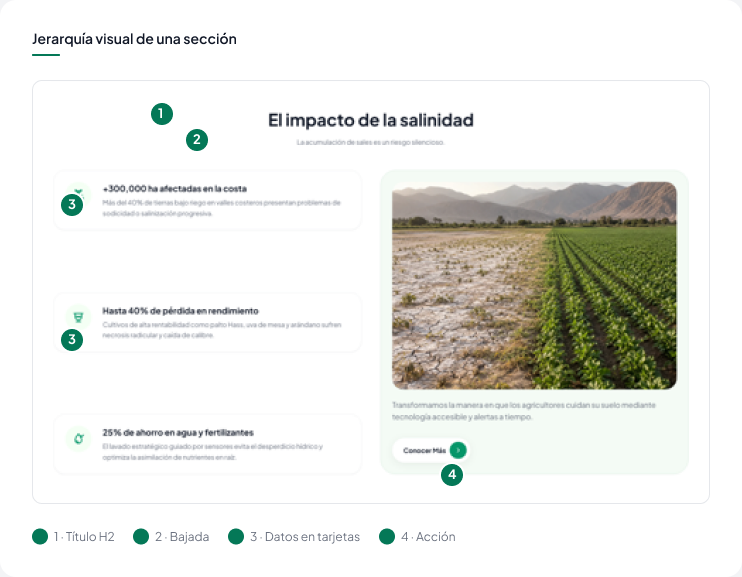

<em>Figura 5.49. Jerarquía visual de una sección.</em>

En el bloque de impacto, los marcadores indican el orden en que el ojo recorre el contenido: **(1)** el título H2 centrado de 36 px, **(2)** la bajada gris de 14 px, **(3)** los datos en tarjetas, con la cifra en negrita como primer elemento de cada una, y **(4)** la acción, un botón claro al final de la tarjeta de historia. Todos los bloques repiten esta estructura, lo que permite recorrer la página leyendo solo los títulos.

**Organización matricial.** Se usa donde el visitante compara opciones en varias dimensiones: los planes.

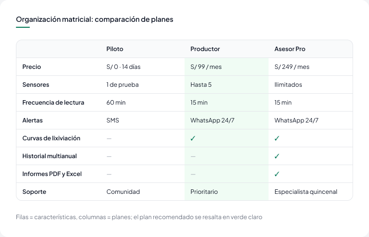

<em>Figura 5.50. Organización matricial de los planes.</em>

Los tres planes se presentan como columnas paralelas con las mismas filas (precio, sensores, frecuencia de lectura, alertas, curvas, historial, informes y soporte), de modo que la comparación se hace de un vistazo. El plan recomendado se destaca con fondo verde claro, sombra y la etiqueta «Más Popular».

**Esquemas de categorización.** Además de la organización visual, el contenido se clasifica con estos esquemas:

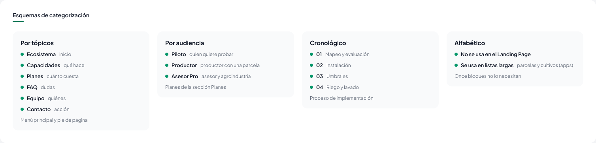

<em>Figura 5.51. Esquemas de categorización.</em>

| Esquema | Dónde se aplica | Por qué |
|---|---|---|
| **Por tópicos** | Menú principal (Ecosistema, Capacidades, Planes, FAQ, Equipo, Contacto) y columnas del pie de página. | El visitante busca por tema; cada tema es un bloque. |
| **Por audiencia** | Planes: Piloto para quien quiere probar, Productor para el productor con una parcela y Asesor Pro para asesores técnicos y agroindustria. | Los dos segmentos del Capítulo I tienen necesidades y presupuestos distintos. |
| **Cronológico** | Proceso de implementación (pasos 01 a 04). | La adopción ocurre en un orden temporal real. |
| **Alfabético** | No se usa en el Landing Page. | Con once bloques no aporta; se reserva para listas largas de las aplicaciones, como parcelas y cultivos. |

**Aplicaciones.** La Web App y la Mobile App se organizan primero **por audiencia**: el productor y la asesora técnica entran al mismo producto, pero cada uno ve solo los destinos de su rol. Los dos mapas siguientes muestran todas las vistas y su nivel.

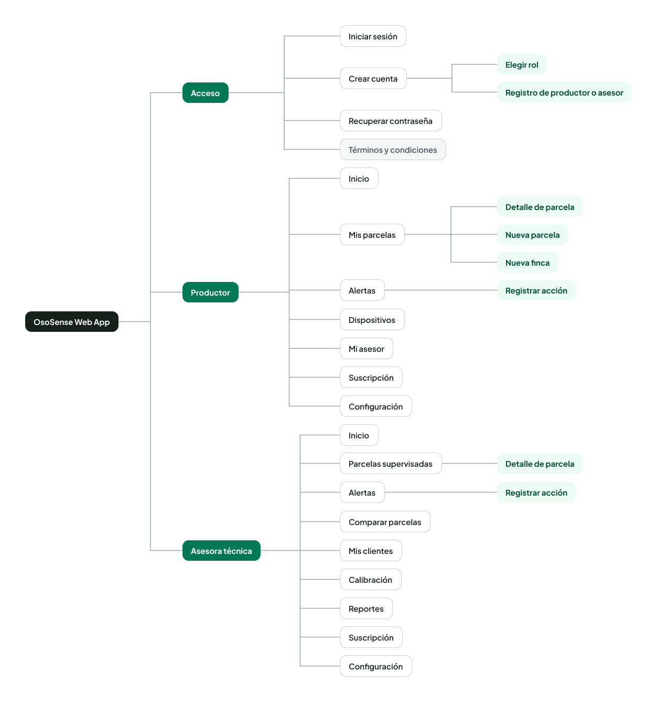

<em>Figura 5.52. Mapa de navegación de la Web App.</em>

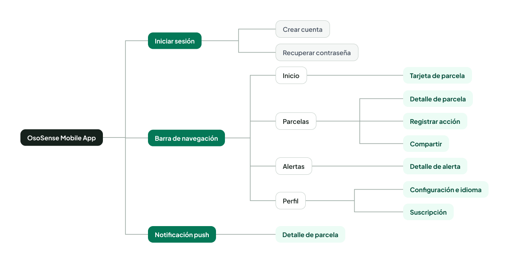

<em>Figura 5.53. Mapa de navegación de la Mobile App.</em>

| Sistema | Dónde se aplica en las aplicaciones |
|---|---|
| **Jerárquico** | Cada vista tiene un solo elemento dominante: la frase de estado en el inicio, la lectura actual en el detalle de parcela y el título de la tarea en formularios. |
| **Secuencial** | Tareas con pasos: registrar parcela, calibrar un sensor (elegir sensor, revisar lectura, ingresar laboratorio) y armar un reporte (parcela, periodo, contenido, vista previa). |
| **Matricial** | Comparar parcelas y la tabla de la asesora: filas por parcela y columnas por cliente, cultivo, CE, porcentaje del umbral y cambio en 30 días. |

| Esquema | Dónde se aplica en las aplicaciones |
|---|---|
| **Por audiencia** | Menú lateral distinto para el productor y la asesora; accesos de demostración separados en el inicio de sesión. |
| **Por riesgo (tópico)** | Parcelas ordenadas por porcentaje del umbral, de mayor a menor, en ambos inicios. |
| **Cronológico** | Alertas, acciones correctivas y tendencias, de la más reciente a la más antigua. |
| **Alfabético** | Listas de selección largas: clientes, fincas, cultivos y sensores. |

### 5.2.2. Labeling Systems

Las etiquetas usan el menor número de palabras posible y el vocabulario de los usuarios, no el técnico: «Planes» y no «Suscripciones», «Probar Gratis» y no «Registro». Cada etiqueta del menú coincide con el título del bloque al que lleva, para que el visitante confirme que llegó al lugar correcto.

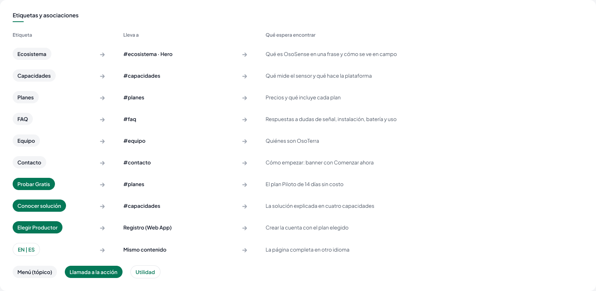

<em>Figura 5.54. Etiquetas y asociaciones.</em>

La figura relaciona cada etiqueta con su destino y con lo que el visitante espera encontrar. Las etiquetas se agrupan en tres tipos: de **menú** (tópicos, en gris), de **llamada a la acción** (verbos, en verde lleno) y de **utilidad** (idioma, con contorno).

| Etiqueta | Tipo | Destino | Asociación que genera |
|---|---|---|---|
| Ecosistema | Menú | `#ecosistema` (hero) | Qué es OsoSense y cómo se ve en campo. |
| Capacidades | Menú | `#capacidades` | Qué mide el sensor y qué hace la plataforma. |
| Planes | Menú | `#planes` | Precios y qué incluye cada plan. |
| FAQ | Menú | `#faq` | Respuestas a dudas de señal, instalación, batería y uso. |
| Equipo | Menú | `#equipo` | Quiénes son OsoTerra. |
| Contacto | Menú | `#contacto` | Cómo empezar, sin llenar el encabezado de teléfonos y correos. |
| Probar Gratis | Acción | `#planes` | El plan Piloto de 14 días sin costo. |
| Conocer solución | Acción | `#capacidades` | La solución explicada en cuatro capacidades. |
| Elegir Piloto · Elegir Productor · Elegir Asesor | Acción | Registro en la Web App desplegada (productor o asesor) | Crear la cuenta con ese plan. |
| Conocer Más | Acción | `#capacidades` | Cómo la tecnología resuelve el problema recién mostrado. |
| Comenzar ahora | Acción | Registro en la Web App | Empezar a usar OsoSense. |
| EN \| ES | Utilidad | La misma página en el otro idioma | El contenido completo cambia de idioma sin recargar. |

Dentro de los bloques, los datos se etiquetan con la cifra primero y la explicación después («+300,000 ha afectadas en la costa», «Hasta 40% de pérdida en rendimiento»), y los niveles de salinidad siempre con palabra, color e ícono («Muy alto»), nunca solo con la medida en dS/m.

**Aplicaciones.** Las etiquetas del menú coinciden con el título de la vista a la que llevan y usan el vocabulario de cada rol: el productor ve «Mis parcelas» y «Mi asesor»; la asesora, «Parcelas supervisadas» y «Mis clientes». Los niveles de salinidad siempre se nombran con palabra, color y porcentaje del umbral.

| Etiqueta | Rol | Asociación que genera |
|---|---|---|
| Inicio | Ambos | El estado de todas mis parcelas en una frase. |
| Mis parcelas · Parcelas supervisadas | Productor · Asesora | La lista de parcelas y su detalle. |
| Alertas | Ambos | Lo que requiere una acción y lo que ya se hizo. |
| Registrar acción | Ambos | Dejar constancia de lo que se hizo en campo. |
| Comparar parcelas | Asesora | Ver varias parcelas en la misma escala. |
| Calibración | Asesora | Ajustar un sensor con el análisis de laboratorio. |
| Reportes | Asesora | Preparar el PDF para el productor. |
| Nivel normal · en vigilancia · alto · muy alto | Ambos | Menos de 80 %, 80 a 100 %, 100 a 125 % y más de 125 % del umbral del cultivo. |

### 5.2.3. SEO Tags and Meta Tags

El Landing Page incluye en su `<head>` las etiquetas que piden los buscadores y las redes sociales. Se agregaron en la rama `feature/seo-meta-tags` del repositorio del Landing Page.

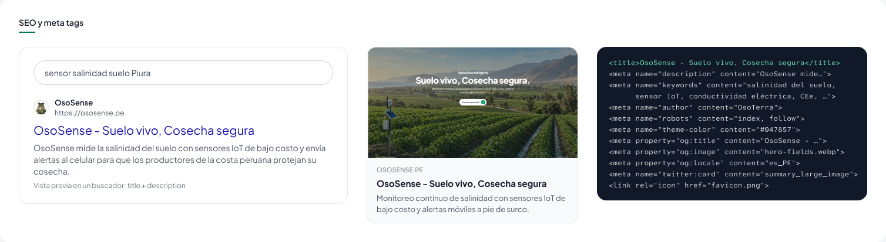

<em>Figura 5.55. SEO y meta tags del Landing Page.</em>

A la izquierda, cómo aparece la página en un buscador: el título y la descripción son exactamente los valores de `title` y `description`. Al centro, la tarjeta que se genera al compartir el enlace por WhatsApp o redes sociales, a partir de las etiquetas Open Graph. A la derecha, el código.

| Etiqueta | Valor |
|---|---|
| `title` | OsoSense - Suelo vivo, Cosecha segura |
| `meta description` | OsoSense mide la salinidad del suelo con sensores IoT de bajo costo y envía alertas al celular para que los productores de la costa peruana protejan su cosecha. |
| `meta keywords` | salinidad del suelo, sensor IoT, conductividad eléctrica, CEe, agricultura inteligente, alertas de riego, palto, uva, arándano, Piura, Lambayeque, OsoSense |
| `meta author` | OsoTerra |
| `meta robots` | index, follow |
| `meta theme-color` | #047857 |
| `og:title` · `og:description` | Título de la página · «Monitoreo continuo de salinidad con sensores IoT de bajo costo y alertas móviles a pie de surco.» |
| `og:image` | Fotografía del hero (`hero-fields.webp`) |
| `og:locale` | es_PE, con `og:locale:alternate` en_US |
| `twitter:card` | summary_large_image |
| `link rel="icon"` | Favicon con el símbolo de Oso Terra (64 y 180 px) |

Criterios de los valores: el título tiene 37 caracteres, por debajo de los 60 que muestran los buscadores, y combina la marca con la promesa; la descripción tiene 160 caracteres, justo en el límite que muestran los buscadores, y nombra el problema (salinidad), la tecnología (sensores IoT), el beneficio (alertas al celular) y el público (productores de la costa); las palabras clave mezclan el problema, la tecnología, los cultivos del segmento y las regiones donde está.

**Web Application.** La Web App es una aplicación de una sola página; el `index.html` define las etiquetas base y cada vista actualiza el `title` al navegar. Las vistas internas requieren sesión, por lo que solo el inicio de sesión y el registro se indexan.

| Vista | `title` | `meta description` |
|---|---|---|
| Base (`index.html`) | OsoSense | OsoSense web app: monitor soil salinity by plot, receive alerts and record corrective actions with your technical advisor. |
| Iniciar sesión | Iniciar sesión · OsoSense | Entra a tu espacio de monitoreo de salinidad del suelo. |
| Crear cuenta | Crear cuenta · OsoSense | Regístrate como productor o asesor técnico y empieza a monitorear tus parcelas. |
| Inicio | Inicio · OsoSense | (vista privada, `robots: noindex`) |
| Detalle de parcela | Sector Norte · OsoSense | (vista privada, `robots: noindex`) |

| Etiqueta | Valor |
|---|---|
| `meta keywords` | OsoSense, soil salinity, electrical conductivity, ECe, IoT, alerts, technical advisor, agriculture |
| `meta author` | OsoTerra |
| `meta theme-color` | #047857 |
| `link rel="icon"` | Símbolo de Oso Terra (`favicon.png` y `apple-touch-icon.png`) |

**Mobile Application (ASO).** La app se publicará en Google Play con estos elementos:

| Elemento | Valor |
|---|---|
| App Title | OsoSense: salinidad del suelo |
| App Subtitle (descripción corta) | Alertas de salinidad por parcela y qué hacer en campo. |
| App Keywords | salinidad, suelo, conductividad eléctrica, riego, palto, uva, arándano, alertas agrícolas, sensor IoT |
| App Description | OsoSense mide la conductividad eléctrica, la humedad y la temperatura del suelo con un sensor instalado en tu parcela y te avisa en el celular cuando la salinidad se acerca al límite de tu cultivo. Ves cada parcela como una franja fácil de leer, recibes qué hacer en cada alerta, registras las acciones de tu familia o tu asesor y compartes el resumen por WhatsApp. Funciona aunque la parcela se quede sin señal: las lecturas se guardan y se envían al volver la conexión. |
| Categoría | Productividad (subcategoría agricultura) |

### 5.2.4. Searching Systems

Con once bloques en una sola página, un buscador interno no aporta: el visitante encuentra lo que busca más rápido con las ayudas de la página que escribiendo una consulta.

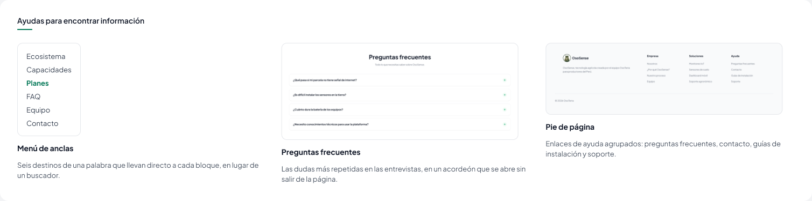

<em>Figura 5.56. Ayudas para encontrar información.</em>

| Ayuda | Cómo ayuda a encontrar | Cómo se ve el resultado |
|---|---|---|
| **Menú de anclas** | Seis destinos de una palabra, visibles siempre en el encabezado. | La página se desplaza hasta el bloque y el ancla activa queda subrayada. |
| **Preguntas frecuentes** | Reúne las dudas más repetidas en las entrevistas: señal, instalación, batería y conocimientos técnicos. | La pregunta se abre en el lugar y muestra la respuesta, sin salir de la página. |
| **Pie de página** | Agrupa los enlaces de ayuda: preguntas frecuentes, contacto, guías de instalación y soporte. | Enlaces directos a cada tema. |

El navegador conserva además su búsqueda de texto (Ctrl + F), que funciona sobre todo el contenido porque está en una sola página y en texto real, no en imágenes.

**Aplicaciones.** Las aplicaciones sí tienen búsqueda y filtros, porque la asesora puede supervisar decenas de parcelas y el historial de alertas crece cada semana.

| Herramienta | Dónde | Filtros | Cómo se ven los resultados |
|---|---|---|---|
| **Búsqueda de parcelas** | Barra superior de la Web App, siempre visible | Nombre de parcela, finca o cliente | La lista de parcelas se reduce mientras se escribe, conservando el orden por riesgo. |
| **Filtros de alertas** | Bandeja de alertas | Estado (abiertas, reconocidas, cerradas), nivel y parcela | Chips arriba de la lista; el filtro queda en la URL para compartirlo o volver con *Atrás*. |
| **Parcelas supervisadas** | Vista de la asesora | Criticidad, cultivo y cliente, con orden por riesgo o por cliente | Franjas o filas con el nivel y el porcentaje del umbral. |
| **Selector de comparación** | Comparar parcelas | Hasta tres parcelas y el periodo | Líneas del mismo color que el chip de cada parcela y tabla debajo. |
| **Periodo del reporte** | Reportes | Parcela y rango de fechas | Vista previa del PDF o un mensaje claro si el periodo no tiene lecturas. |

En la Mobile App, la búsqueda vive dentro de *Parcelas* para no recargar la barra superior del celular.

### 5.2.5. Navigation Systems

La navegación combina siete sistemas, cada uno con un propósito distinto. La figura los ubica sobre la página completa: cada punto de color marca dónde aparece cada tipo.

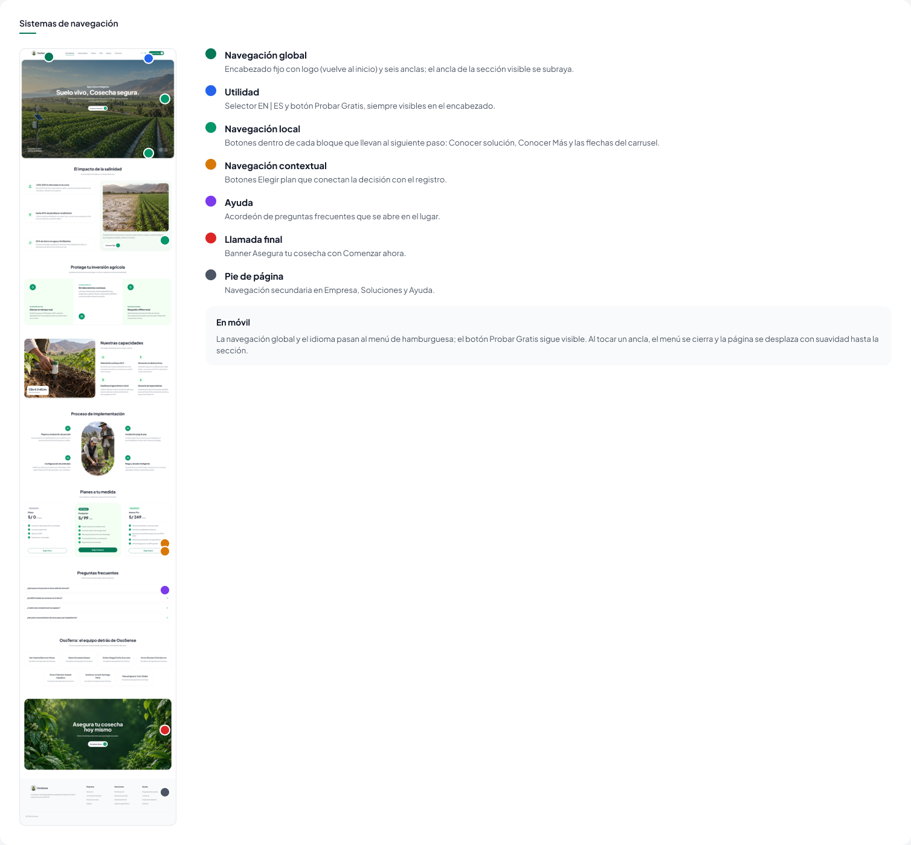

<em>Figura 5.57. Sistemas de navegación.</em>

| Sistema | Dónde está | Cómo guía al visitante |
|---|---|---|
| **Global** (verde) | Encabezado fijo | El logo vuelve al inicio y las seis anclas llevan a cada bloque; el ancla del bloque visible se subraya en `#059669` (y se marca con `aria-current`), así el visitante sabe dónde está. |
| **Utilidad** (azul) | Encabezado | El selector de idioma y el botón *Probar Gratis* siguen visibles durante todo el recorrido. |
| **Local** (verde claro) | Dentro de los bloques | *Conocer solución* en el hero y *Conocer Más* en el impacto llevan a las capacidades; las flechas del carrusel cambian la foto del hero. |
| **Contextual** (naranja) | Planes | Los botones *Elegir* conectan la decisión con el registro. |
| **Ayuda** (morado) | Preguntas frecuentes | El acordeón resuelve dudas sin salir de la página. |
| **Llamada final** (rojo) | Banner de contacto | *Comenzar ahora* cierra el recorrido y devuelve a los planes. |
| **Pie de página** (gris) | Final de la página | Navegación secundaria en Empresa, Soluciones y Ayuda. |

El recorrido principal va de arriba abajo con el scroll; los atajos del menú permiten saltar a cualquier bloque; y el desplazamiento entre anclas es suave para que el visitante vea que se movió dentro de la misma página. En móvil, las anclas y el idioma pasan al menú de hamburguesa, el botón *Probar Gratis* sigue visible junto a él y, al tocar un ancla, el menú se cierra y la página se desplaza hasta el bloque (ver la figura de navegación de la sección 5.1.2).

**Aplicaciones.**

| Sistema | Web App | Mobile App |
|---|---|---|
| **Global** | Menú lateral con los destinos del rol; una marca verde se desliza hasta la sección activa y el menú se contrae a una columna de íconos. | Barra inferior con cuatro destinos: Inicio, Parcelas, Alertas y Perfil. |
| **Utilidad** | Barra superior con búsqueda, idioma y campana con el número de alertas activas; cuenta y cierre de sesión al pie del menú. | Barra superior con el título de la vista y las acciones de compartir y más opciones. |
| **Local** | Migas de pan en las vistas de segundo nivel (por ejemplo, Mis parcelas / Sector Norte). | Flecha de retroceso en la barra superior. |
| **Contextual** | Botones de acción en cada franja, alerta y formulario (*Registrar acción*, *Comparar parcelas*, *Exportar PDF*). | Hojas inferiores para registrar acciones y compartir. |
| **Entrada directa** | Enlace de la campana a la bandeja de alertas; enlaces desde el correo al detalle de parcela. | La notificación abre el detalle de la parcela con la alerta. |

Diagramas en Figma: [arquitectura de información del Landing Page](https://www.figma.com/design/w8ggl2291TtYEPmhJ70zrq/OsoSense-%E2%80%94-Landing-Page-UI-Design?node-id=29-2&t=zv0k9BZ0KNZ8WH8D-1) y [de las aplicaciones](https://www.figma.com/design/w8ggl2291TtYEPmhJ70zrq/OsoSense-%E2%80%94-Landing-Page-UI-Design?node-id=59-2).

## 5.3. Landing Page UI Design

El Landing Page es el primer contacto de productores y asesores técnicos con OsoSense, por lo que su propuesta de UI se pensó como un recorrido de persuasión: primero el problema (la salinidad), después la respuesta (el sensor y la plataforma), luego la forma de adoptarla (proceso y planes) y, al final, la confianza (preguntas frecuentes y equipo) antes del llamado a la acción. Las decisiones de diseño y de arquitectura de información se tradujeron en tres reglas:

- **Una sola página con anclas.** Cada destino del menú (Ecosistema, Capacidades, Planes, FAQ, Equipo y Contacto) es una sección de la misma página; así el visitante nunca pierde el contexto y el menú funciona como índice.
- **Un bloque, una idea.** Cada sección responde una pregunta del visitante con un título H2, una bajada corta y un único patrón de contenido (datos, tarjetas, pasos, planes o acordeón).
- **La acción siempre a la vista.** El botón *Probar Gratis* permanece en el encabezado fijo y cada tramo del recorrido termina en un botón de avance (*Conocer solución*, *Conocer Más*, *Elegir plan*, *Comenzar ahora*).

El diseño se elaboró en Figma en tres páginas: **Design System** (estilos de color y de texto, y componentes), **Wireframes** y **Mock-ups**, cada una con la versión Desktop Web Browser (1440 px) y Mobile Web Browser (390 px). El contenido es el mismo que muestra el Landing Page implementado en su versión en español (es_419).

### 5.3.1. Landing Page Wireframe

Los wireframes fijan la estructura, la jerarquía y el orden de lectura sin distraer con color ni fotografía: todo está en escala de grises, las imágenes se representan con cajas punteadas y se retiraron sombras y degradados. La página se organiza en once bloques, siempre en el mismo orden en ambos anchos:

| # | Bloque | Pregunta del visitante que responde | Patrón de contenido |
|---|---|---|---|
| 0 | Encabezado | ¿Dónde estoy y a dónde puedo ir? | Logo, menú de anclas, selector EN / ES y botón *Probar Gratis* |
| 1 | Hero | ¿Qué es OsoSense? | Carrusel de fotos con eyebrow, titular H1, bajada y botón principal |
| 2 | El impacto de la salinidad | ¿Por qué me debería importar? | Tres datos con ícono y una tarjeta de historia con foto |
| 3 | Protege tu inversión agrícola | ¿Qué gano? | Tres beneficios en un bloque dividido: alertas, ahorro y respaldo sin conexión |
| 4 | Nuestras capacidades | ¿Qué hace la solución? | Foto del sensor con el indicador de CEe y cuatro capacidades en grilla 2 × 2 |
| 5 | Proceso de implementación | ¿Cómo empiezo? | Cuatro pasos numerados alrededor de una foto de campo |
| 6 | Planes a tu medida | ¿Cuánto cuesta? | Tres tarjetas de plan con el plan recomendado destacado |
| 7 | Preguntas frecuentes | ¿Y si…? | Acordeón de cuatro preguntas |
| 8 | Equipo | ¿Quién está detrás? | Tarjetas con los siete integrantes |
| 9 | Llamado a la acción | ¿Qué hago ahora? | Banner con titular y botón *Comenzar ahora* |
| 10 | Pie de página | ¿Dónde encuentro lo demás? | Marca, descripción y tres columnas de enlaces |

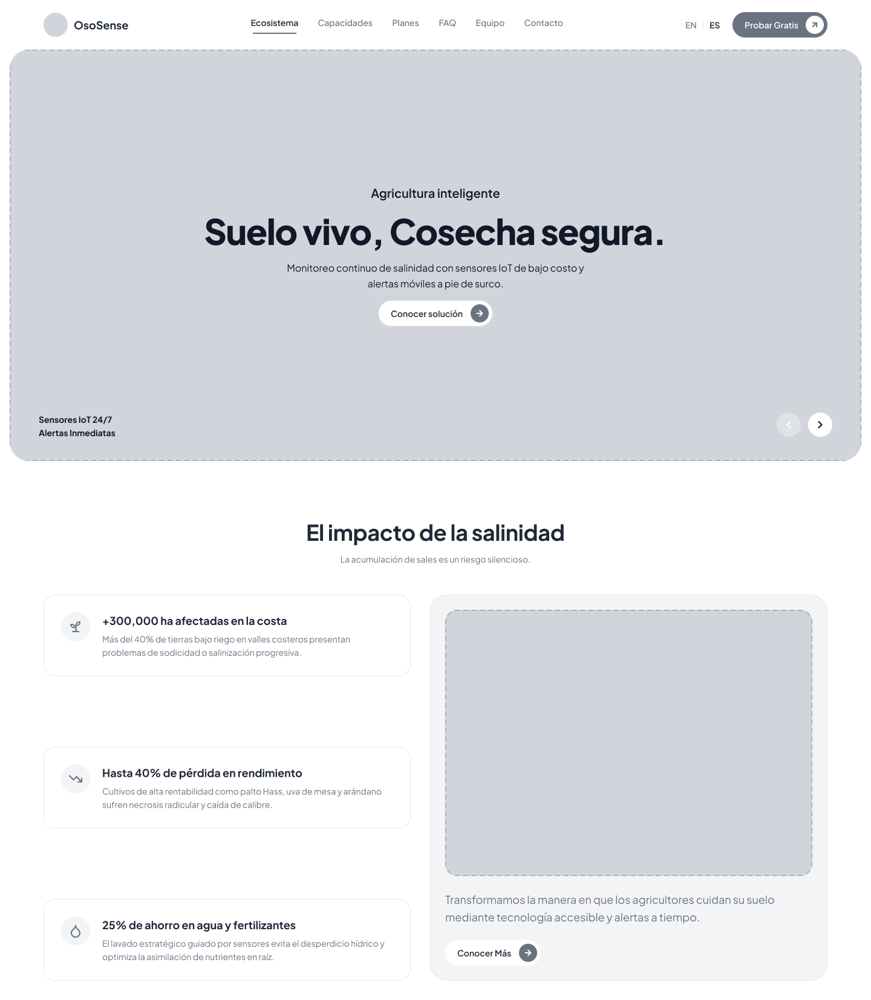

<em>Figura 5.58. Wireframe Desktop Web Browser (1/4): encabezado, hero y bloque de impacto de la salinidad.</em>

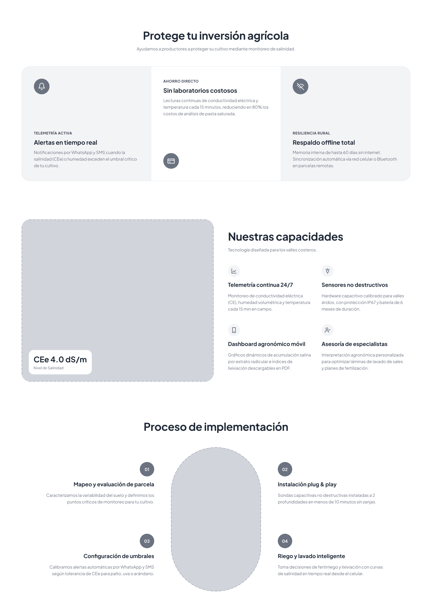

<em>Figura 5.59. Wireframe Desktop Web Browser (2/4): beneficios, capacidades y proceso de implementación.</em>

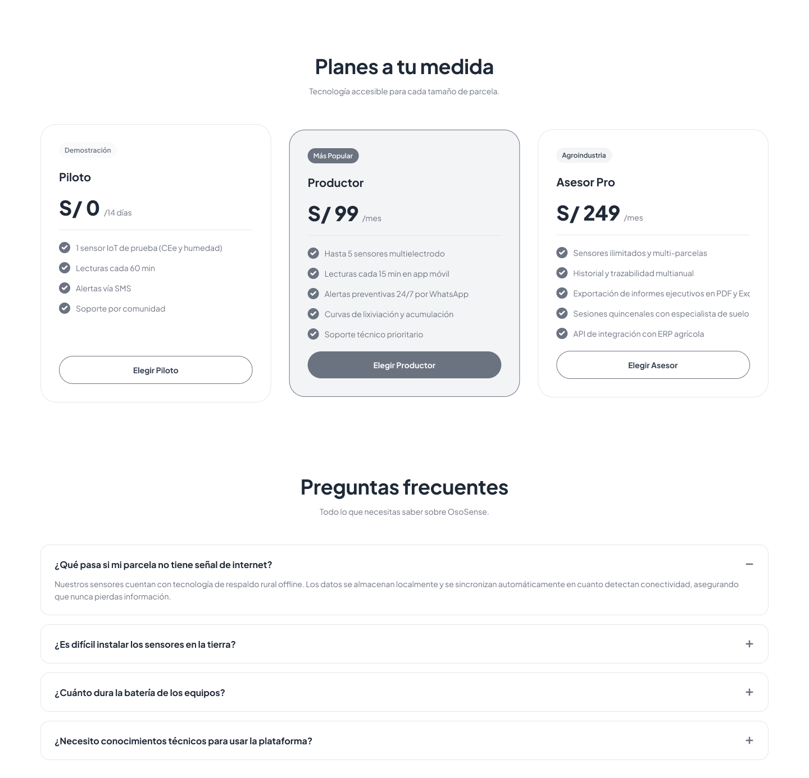

<em>Figura 5.60. Wireframe Desktop Web Browser (3/4): planes y preguntas frecuentes.</em>

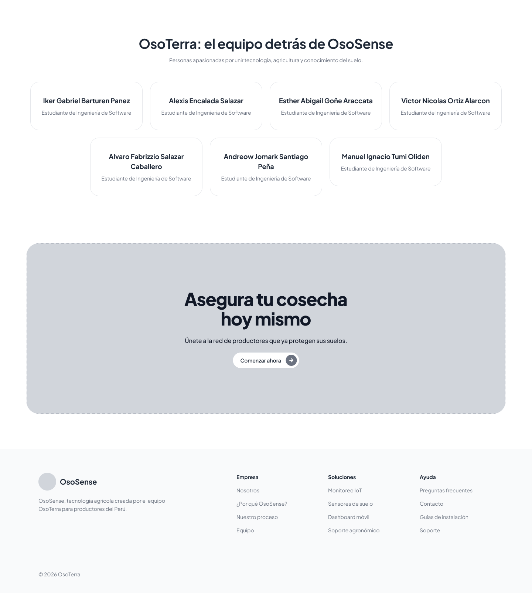

<em>Figura 5.61. Wireframe Desktop Web Browser (4/4): equipo, llamado a la acción y pie de página.</em>

**Principios y elementos de diseño aplicados**

- **Jerarquía:** un único H1 en el hero; cada sección abre con un H2 centrado y una bajada en gris, y dentro de las tarjetas el título pesa más que la descripción. El ojo encuentra primero el titular, luego el dato y al final el detalle.
- **Proximidad y agrupación:** los elementos relacionados comparten tarjeta (ícono, título y texto de cada dato; precio y lista de cada plan) y las secciones se separan con 96 px de aire vertical, de modo que el cambio de tema se percibe sin necesidad de líneas.
- **Alineación y grilla:** contenedor de 1296 px con márgenes de 72 px y columnas que se reparten en 2, 3 o 4 tarjetas según el bloque. El proceso usa una composición simétrica (pasos 01 y 03 a la izquierda, 02 y 04 a la derecha) para que la lectura siga el orden numérico.
- **Contraste y énfasis:** solo un botón por bloque tiene relleno; los secundarios van con contorno. En los planes, el plan *Productor* se destaca con fondo, sombra y la etiqueta *Más Popular*.
- **Repetición:** el mismo botón en píldora con círculo de flecha, las mismas tarjetas redondeadas y el mismo encabezado de sección se repiten en toda la página, lo que reduce la carga de aprendizaje.

**Diseño inclusivo**

- Texto base de 16 px y bajadas de 14 px como mínimo, pensando en la edad del segmento de productores (sección 1.3).
- Objetivos táctiles de al menos 40 px (botones, flechas del carrusel y menú) y separación suficiente entre enlaces del menú móvil.
- Los íconos siempre van acompañados de texto; ningún dato depende solo del color o de una imagen.
- El selector de idioma EN / ES está en el encabezado desde la primera vista, porque el producto se ofrece en en_US y es_419.
- En la implementación, la navegación usa `aria-label`, `aria-labelledby` por sección, `aria-expanded` y `aria-controls` en el menú móvil, `aria-pressed` en el selector de idioma, texto alternativo en las fotos informativas y `alt=""` en las decorativas, y respeta `prefers-reduced-motion`.

**Arquitectura de información**

- **Organización:** esquema por tópicos en secuencia narrativa (problema → beneficio → solución → proceso → precio → dudas → confianza → acción).
- **Etiquetado:** etiquetas de una palabra en el menú, iguales al título de la sección a la que llevan, y verbos de acción en los botones (*Conocer*, *Elegir*, *Comenzar*, *Probar*).
- **Navegación:** menú global de anclas en un encabezado fijo, botón de llamada a la acción siempre visible y un pie de página con navegación secundaria agrupada en Empresa, Soluciones y Ayuda.

**Versión Mobile Web Browser**

En 390 px la estructura se conserva y solo cambia la disposición: el menú se convierte en un botón de hamburguesa junto a *Probar Gratis*, el selector de idioma pasa al menú desplegable, todas las grillas se apilan en una columna, el titular baja de 58 a 30 px, los pasos del proceso se leen en lista vertical debajo de la foto y los planes, el equipo y el pie de página se muestran uno debajo de otro. Los márgenes laterales se reducen a 16 px para ganar ancho útil.

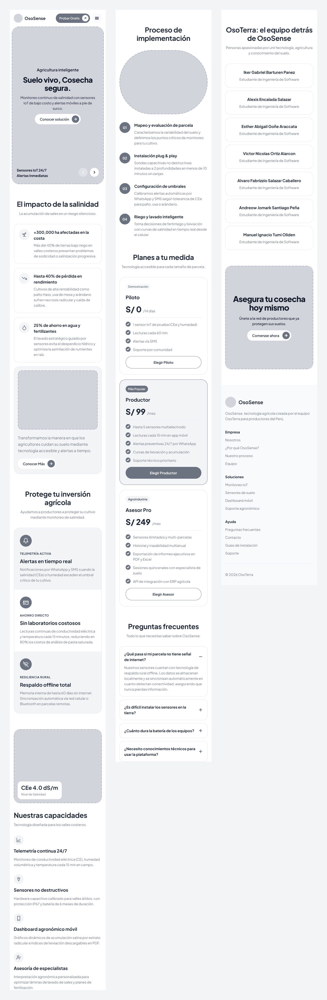

<em>Figura 5.62. Wireframe Mobile Web Browser (390 px), leído de izquierda a derecha en tres tramos.</em>

### 5.3.2. Landing Page Mock-up

Los mock-ups llevan los wireframes a alta fidelidad con el **Design System** del Landing Page, construido en Figma como estilos reutilizables a partir de los valores de la página implementada:

| Categoría | Tokens |
|---|---|
| Color de acción | Primary/700 `#047857` (botones con texto y etiqueta destacada), Primary/600 `#059669` (íconos, números del proceso y círculos de flecha), Primary/800 `#065F46` (*hover* y presionado) |
| Superficies verdes | Primary/50 `#F0FDF4` (tarjetas destacadas y plan recomendado), Primary/100 `#DCFCE7` (etiquetas) |
| Neutros | Neutral/900 `#111827` (títulos), Neutral/600 `#4B5563` y Neutral/500 `#6B7280` (texto secundario), Neutral/200 `#E5E7EB` (bordes), Neutral/50 `#F9FAFB` (pie de página), blanco |
| Marca | Brand/Forest `#263D29` y Brand/Olive `#64663F`, presentes en el logo |
| Tipografía | Plus Jakarta Sans: Display 58 px ExtraBold, H2 36 px Bold, H3 20 px Bold, H4 18 px Bold, cuerpo 18 / 16 / 14 px Regular, botón 14 px SemiBold, eyebrow 12 px Bold en mayúsculas, precio 36 px ExtraBold |
| Forma | Botones en píldora con círculo de flecha, tarjetas con radio de 20 a 28 px y borde de 1 px, hero y banner con radio de 32 px |
| Fotografía | Paisajes de valles costeros, sensor en campo y trabajo de agrónomos, con una capa verde oscura sobre la foto para asegurar la lectura del texto blanco |

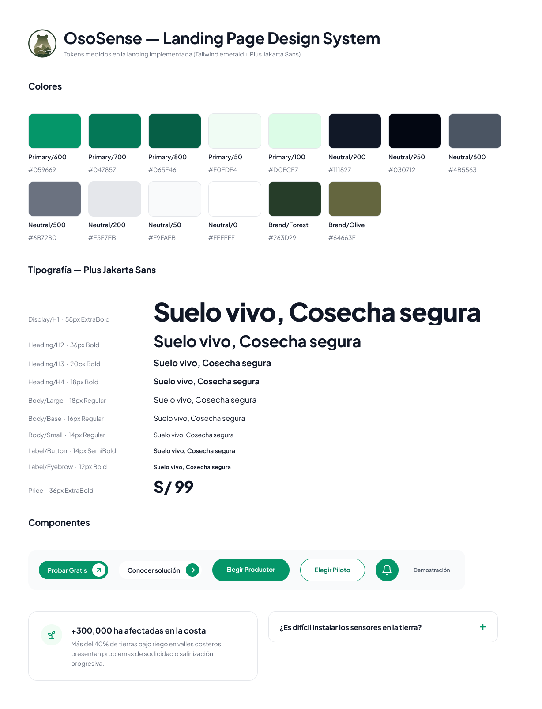

<em>Figura 5.63. Design System del Landing Page: estilos de color, escala tipográfica y componentes.</em>

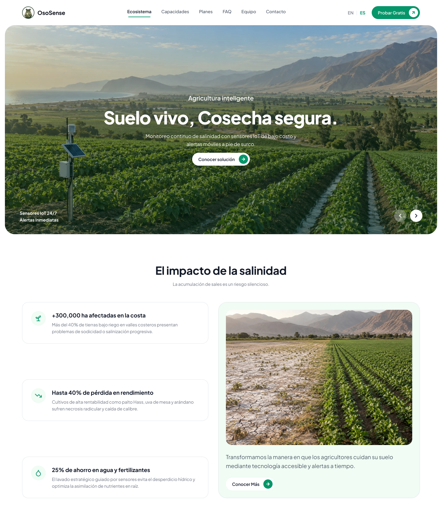

<em>Figura 5.64. Mock-up Desktop Web Browser (1/4): encabezado con el logo de Oso Terra, hero con fotografía del valle y bloque de impacto.</em>

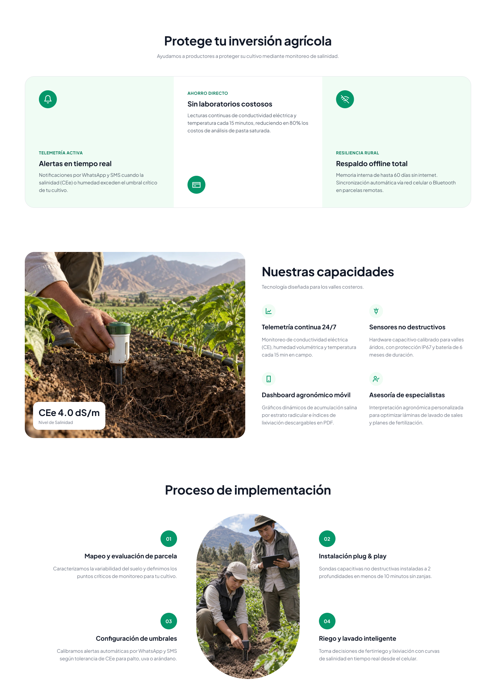

<em>Figura 5.65. Mock-up Desktop Web Browser (2/4): beneficios, capacidades con el indicador de CEe y proceso de implementación.</em>

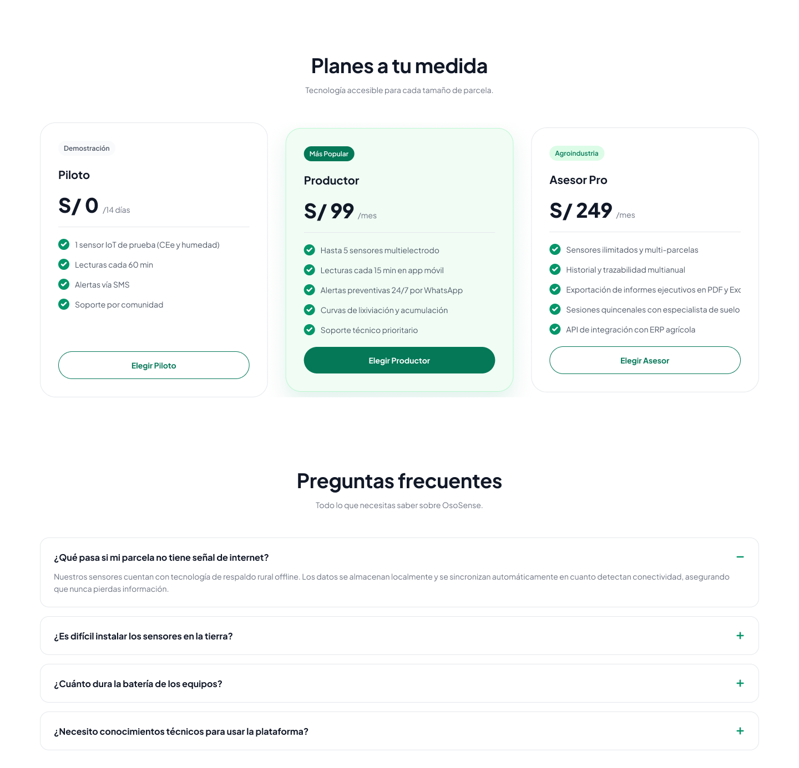

<em>Figura 5.66. Mock-up Desktop Web Browser (3/4): planes con el plan recomendado destacado y preguntas frecuentes.</em>

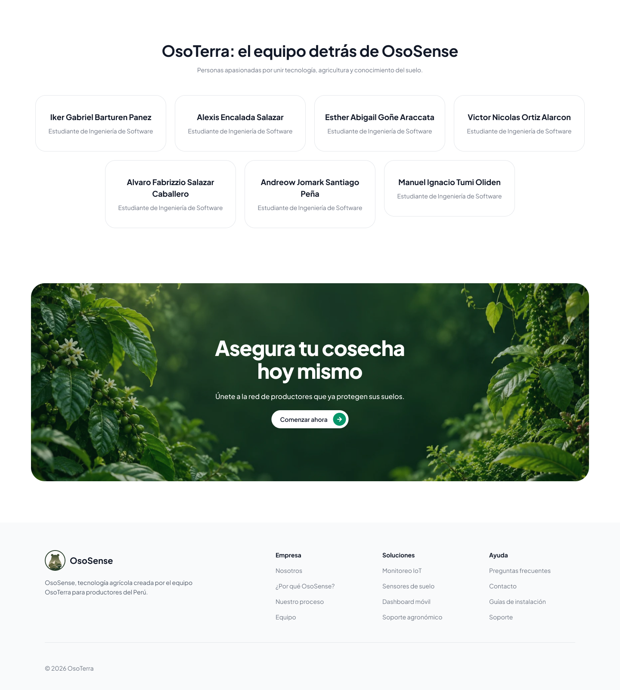

<em>Figura 5.67. Mock-up Desktop Web Browser (4/4): equipo, banner de llamado a la acción y pie de página.</em>

**Cómo se aplican los principios en el mock-up**

- **El color guía la acción.** El verde esmeralda se reserva para lo que se puede pulsar o lo que conviene notar (botones, íconos, números de paso, plan recomendado); el resto de la página es blanco y gris, por lo que la mirada va directo a las acciones.
- **La fotografía cuenta la historia.** El hero muestra el valle costero con el sensor instalado; el bloque de impacto contrapone suelo salinizado y cultivo sano; el proceso muestra a agrónomos en campo. Son escenas que el productor reconoce como propias.
- **El dato técnico se vuelve legible.** El indicador *CEe 4.0 dS/m — Nivel de Salinidad* sobre la foto del sensor anticipa lo que el usuario verá en la aplicación, con el número grande y la explicación corta.
- **La marca da confianza.** El logo de Oso Terra aparece en el encabezado fijo y en el pie de página, y la sección de equipo presenta a los siete integrantes.

**Diseño inclusivo en el mock-up**

Los contrastes medidos (WCAG 2.1) son: títulos `#111827` sobre blanco 17,74:1; texto secundario `#4B5563` 7,56:1 y `#6B7280` 4,83:1 sobre blanco; etiquetas `#047857` sobre `#F0FDF4` 5,24:1, todos por encima de AA. Los botones con texto usan Primary/700 `#047857`, con 5,48:1 para el texto blanco; Primary/600 `#059669` (3,77:1) queda solo para íconos y flechas dentro de círculos. Sobre las fotografías, el texto blanco se apoya en una capa verde oscura semitransparente.

**Versión Mobile Web Browser**

El mock-up móvil aplica los mismos estilos con los ajustes de la sección anterior: encabezado compacto con logo, *Probar Gratis* y menú de hamburguesa; hero con titular de 30 px; tarjetas a ancho completo; y planes apilados, con el plan *Productor* igualmente destacado.

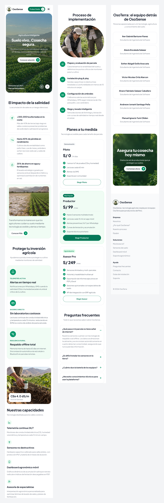

<em>Figura 5.68. Mock-up Mobile Web Browser (390 px), leído de izquierda a derecha en tres tramos.</em>

Diseño en Figma: [wireframes](https://www.figma.com/design/w8ggl2291TtYEPmhJ70zrq/OsoSense-%E2%80%94-Landing-Page-UI-Design?node-id=1-2&t=zv0k9BZ0KNZ8WH8D-1), [mock-ups](https://www.figma.com/design/w8ggl2291TtYEPmhJ70zrq/OsoSense-%E2%80%94-Landing-Page-UI-Design?node-id=1-3&t=zv0k9BZ0KNZ8WH8D-1) y [Design System](https://www.figma.com/design/w8ggl2291TtYEPmhJ70zrq/OsoSense-%E2%80%94-Landing-Page-UI-Design?node-id=0-1&t=zv0k9BZ0KNZ8WH8D-1) del Landing Page.

## 5.4. Applications UX/UI Design

Esta sección presenta la propuesta visual y de interacción de las dos aplicaciones de OsoSense: la **Web Application**, que usan el productor y la asesora técnica desde la computadora, y la **Mobile Application** para Android, pensada para el productor que recibe las alertas en el celular. Ambas comparten el mismo Design System y la misma idea central: el estado del suelo se lee de un vistazo como una **franja de salinidad** que compara la conductividad eléctrica actual con el umbral del cultivo.

El diseño parte de los dos User Personas de la sección 2.3.1 y de sus objetivos. De cada ficha se tomaron los objetivos que la aplicación debe resolver y se redactaron como *user goals*:

| # | User Persona | User goal | Aplicación |
|---|---|---|---|
| UG1 | Diego Ramos, productor que supervisa la parcela familiar desde Lima | Saber cómo está mi parcela sin ir a verla. | Web y Mobile |
| UG2 | Diego Ramos | Atender una alerta y coordinar la acción con mi familia. | Web y Mobile |
| UG3 | Diego Ramos | Registrar mi parcela con su cultivo. | Web |
| UG4 | María Fernanda Salazar, asesora técnica | Decidir qué parcela visitar primero. | Web |
| UG5 | María Fernanda Salazar | Calibrar un sensor con el análisis de laboratorio. | Web |
| UG6 | María Fernanda Salazar | Entregar al productor un reporte de su parcela. | Web |

Los wireframes y los mock-ups se elaboraron en Figma, en las páginas **Apps · Wireframes** y **Apps · Mock-ups** del archivo de diseño del proyecto; los wireflows y los user flows, en el tablero de FigJam **OsoSense — Wireflows y User Flows**. Las pantallas de la Web App se diseñaron a 1440 px de ancho y las de la Mobile App a 390 px.

### 5.4.1. Applications Wireframes

Los wireframes fijan la estructura, la jerarquía y el orden de lectura de cada pantalla en escala de grises, sin color de marca ni imágenes: el logo se reemplaza por un círculo gris y los gráficos conservan solo su forma. Se diseñaron 14 pantallas de la Web App y 8 de la Mobile App, incluidos los estados de error y sin conexión que se usan después en los user flows.

**Estructura común de la Web App.** Todas las vistas internas comparten tres zonas: un **menú lateral** claro a la izquierda con los destinos del rol, una **barra superior** delgada con la búsqueda de parcelas, el idioma y las alertas, y el **contenido** a la derecha con un ancho máximo de 1180 px. La cuenta y el cierre de sesión se ubican al pie del menú lateral, lejos de las acciones frecuentes.

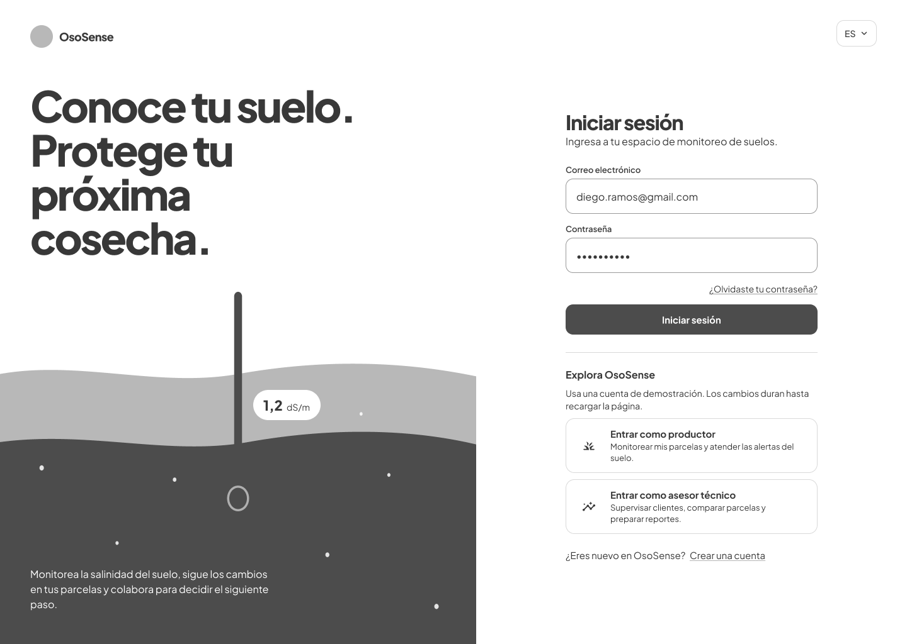

<em>Figura 5.69. Wireframe de inicio de sesión (Web App).</em>

La pantalla de acceso se divide en dos: a la izquierda, el mensaje de la marca con la ilustración de los horizontes del suelo; a la derecha, el formulario con solo dos campos, el enlace de recuperación y dos accesos de demostración grandes, uno por rol.

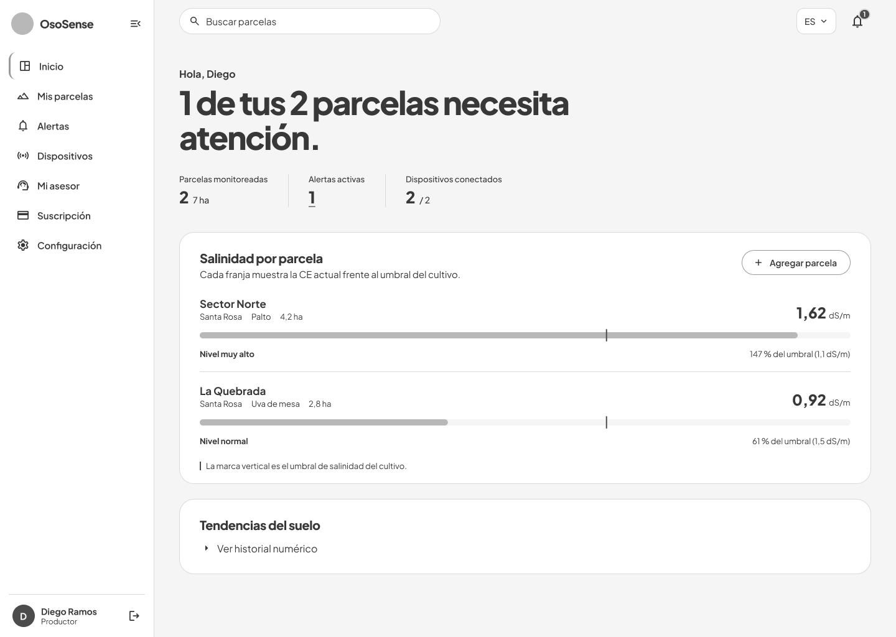

<em>Figura 5.70. Wireframe del inicio del productor.</em>

El inicio responde primero la pregunta de Diego con una frase construida con los datos («1 de tus 2 parcelas necesita atención.»). Debajo, tres cifras en una sola línea (parcelas, alertas y sensores conectados) y la lista de parcelas, cada una como una franja con su lectura y la marca del umbral.

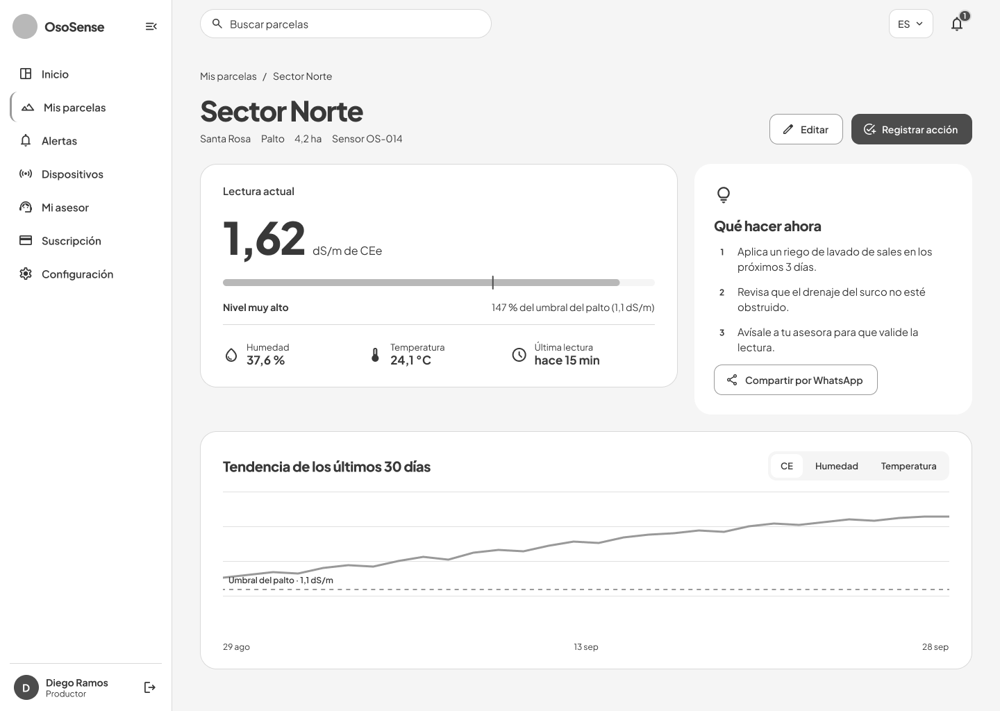

<em>Figura 5.71. Wireframe del detalle de parcela.</em>

El detalle de parcela ordena la información por importancia: la lectura actual en grande con su nivel, la recomendación «Qué hacer ahora» a la derecha y, abajo, la tendencia de 30 días con la línea del umbral del cultivo.

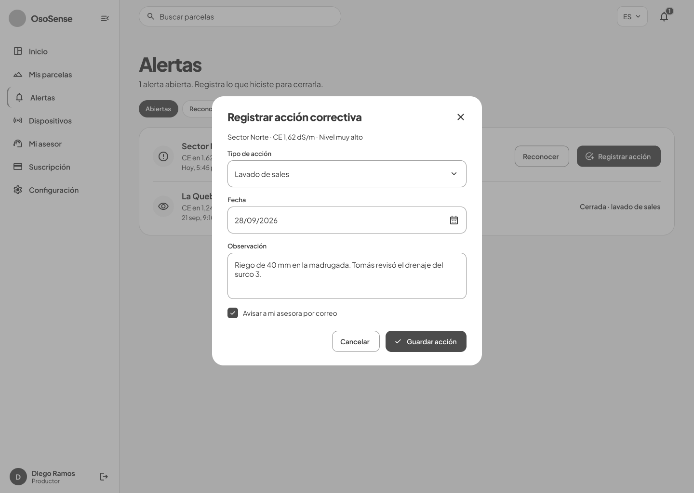

<em>Figura 5.72. Wireframe de alertas con el diálogo de registrar acción correctiva.</em>

La bandeja de alertas se filtra por estado con chips y cada alerta ofrece dos acciones: reconocerla o registrar lo que se hizo. El registro se abre en un diálogo con tres campos y una casilla para avisar a la asesora, sin sacar al usuario de la bandeja.

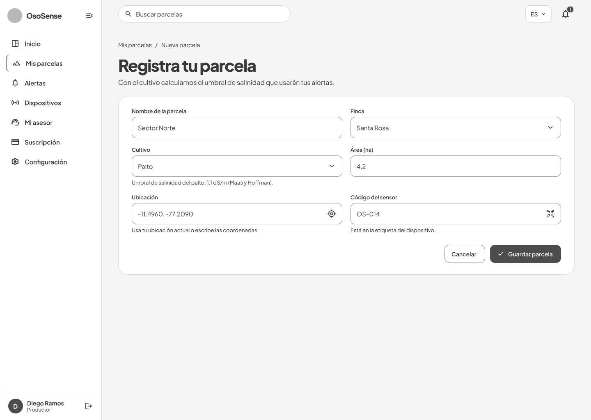

<em>Figura 5.73. Wireframe del formulario de nueva parcela.</em>

El formulario agrupa seis campos en dos columnas y explica, bajo el cultivo, el umbral de salinidad que se usará en las alertas. La ubicación y el código del sensor tienen ayudas para evitar errores de digitación.

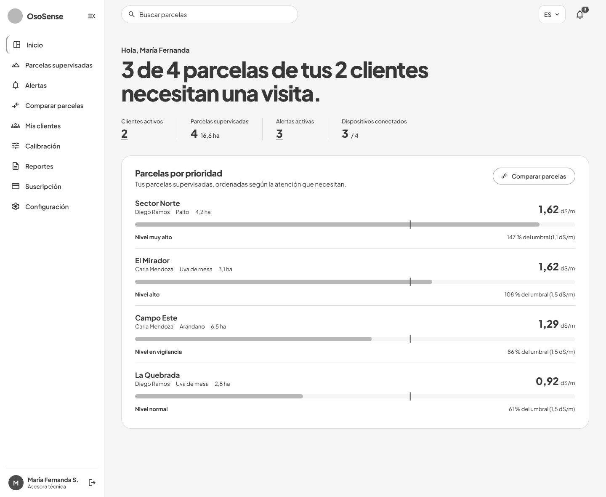

<em>Figura 5.74. Wireframe del inicio de la asesora técnica.</em>

El inicio de María Fernanda repite la estructura del productor con otra frase («3 de 4 parcelas de tus 2 clientes necesitan una visita.»), cuatro cifras y las franjas ordenadas por riesgo, con el nombre del productor en cada una.

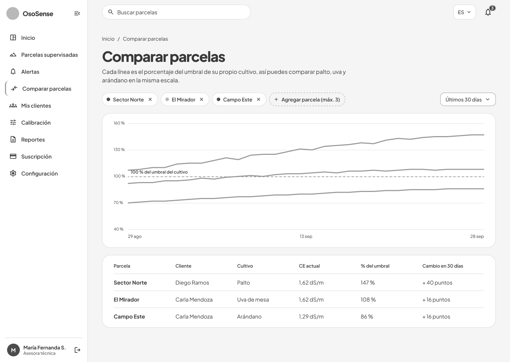

<em>Figura 5.75. Wireframe de comparar parcelas.</em>

Para comparar parcelas con cultivos distintos, el gráfico muestra el porcentaje del umbral de cada cultivo, no la CE en dS/m: así palto, uva y arándano quedan en la misma escala y la línea de 100 % marca el límite para todos. Se comparan hasta tres parcelas a la vez.

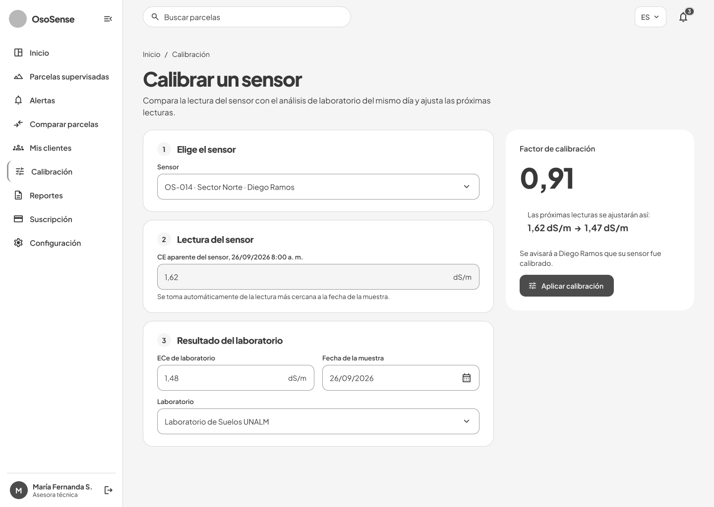

<em>Figura 5.76. Wireframe de calibración de un sensor.</em>

La calibración es un proceso paso a paso (elegir el sensor, revisar la lectura del sensor e ingresar el resultado del laboratorio) y el resultado se muestra a la derecha antes de aplicarlo, con el efecto que tendrá sobre la lectura.

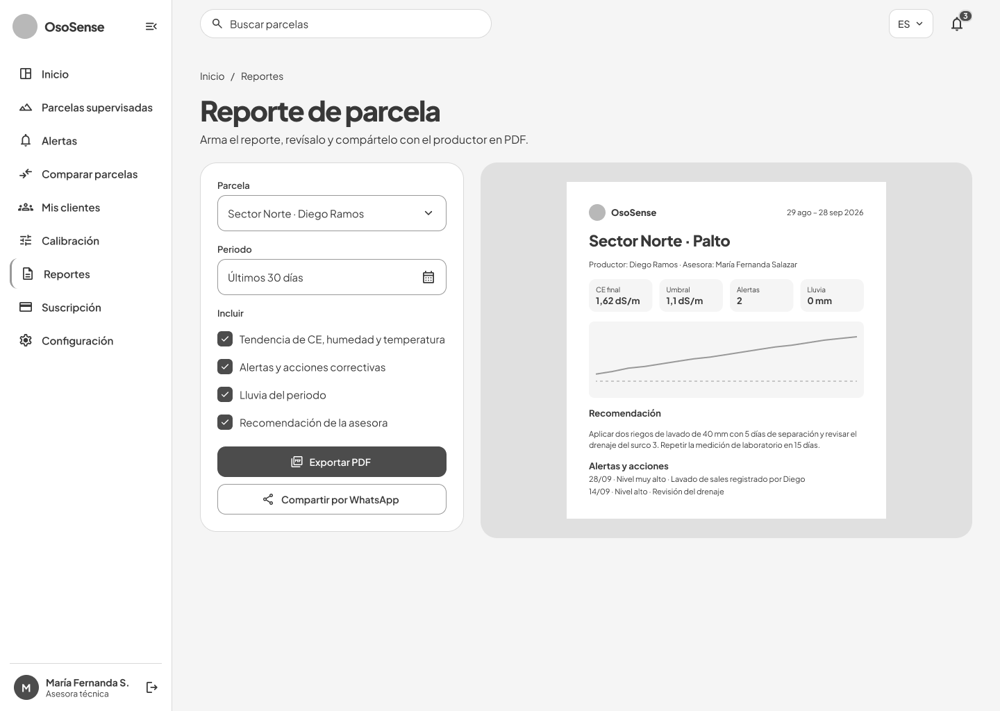

<em>Figura 5.77. Wireframe del reporte de parcela.</em>

El reporte se arma a la izquierda (parcela, periodo y contenido) y se revisa a la derecha como una hoja, antes de exportarlo en PDF o compartirlo.

**Mobile App.** La app para Android usa la navegación de Material 3: barra superior con el título de la vista y barra inferior con cuatro destinos (Inicio, Parcelas, Alertas y Perfil). Las acciones de una parcela se abren como hojas inferiores, al alcance del pulgar.

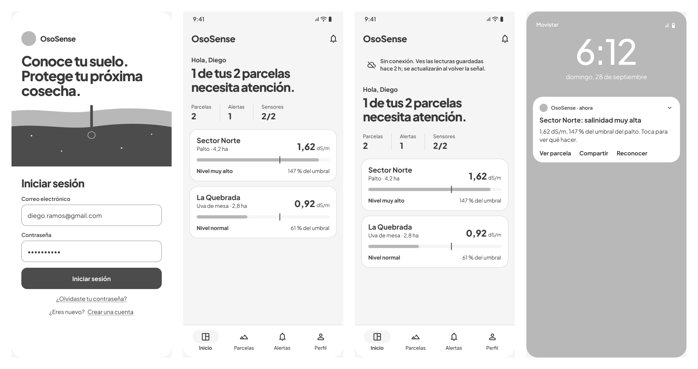

<em>Figura 5.78. Wireframes de la Mobile App (1/2): inicio de sesión, inicio, inicio sin conexión y notificación de alerta.</em>

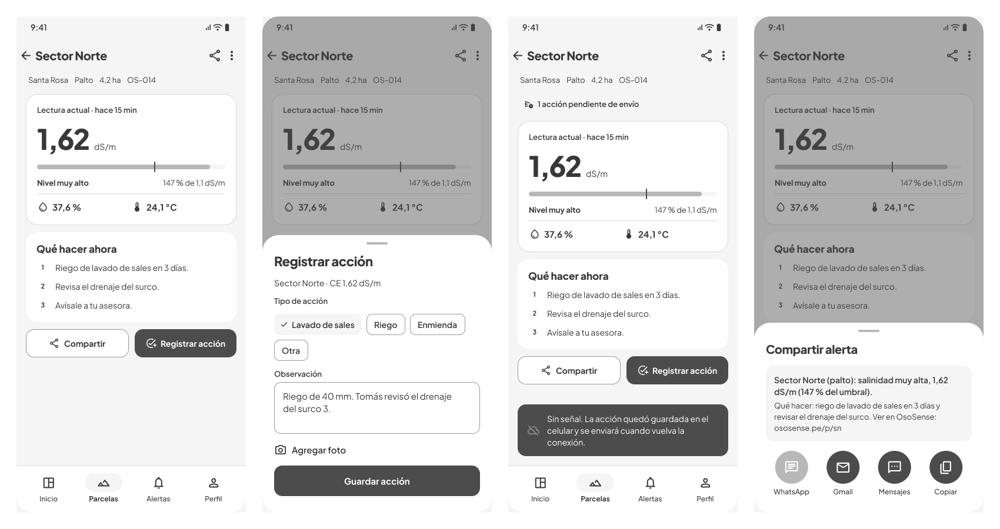

<em>Figura 5.79. Wireframes de la Mobile App (2/2): detalle de parcela, registrar acción, acción guardada sin señal y compartir.</em>

**Principios y elementos de diseño aplicados**

- **Jerarquía:** en cada vista hay un solo elemento dominante (la frase de estado, la lectura actual o el título de la tarea) y el resto baja de tamaño y peso según su importancia.
- **Proximidad:** la lectura, su franja y su nivel forman un solo bloque; las acciones de una alerta están en la misma fila que la alerta.
- **Repetición:** la franja de salinidad es la misma en el inicio, en el detalle, en la app móvil y en el reporte, así que se aprende una vez.
- **Contraste:** solo hay un botón con relleno por vista; las acciones secundarias van con contorno.
- **Alineación:** contenido a la izquierda sobre una columna de 1180 px en la Web App y márgenes de 16 px en la Mobile App.

**Diseño inclusivo**

- El nivel de salinidad nunca depende solo del color: siempre va con palabra («Nivel muy alto») y con el porcentaje del umbral.
- Objetivos táctiles de 44 px o más en la Web App y de 48 px en la Mobile App.
- Texto base de 15 a 16 px, etiquetas visibles sobre cada campo y mensajes de error junto al campo que los causa.
- Estados sin conexión explícitos: la app dice qué datos está mostrando y cuándo se actualizarán.
- Las animaciones se desactivan cuando el sistema pide reducir el movimiento.

**Arquitectura de información**

Los wireframes aplican las decisiones de la sección 5.2: organización por rol en el menú lateral, orden por riesgo en las listas, etiquetas cortas iguales al título de cada vista y migas de pan en las vistas de segundo nivel.

### 5.4.2. Applications Wireflow Diagrams

Cada wireflow muestra, con los wireframes de la sección anterior, la ruta típica para cumplir un *user goal*. La flecha indica la acción del usuario que lleva de una pantalla a la siguiente; cuando la acción cambia el estado de la misma pantalla (por ejemplo, abrir un diálogo), se agrega el wireframe con el nuevo estado.

**WF1 · Diego Ramos · Web App.** *User goal:* saber cómo está mi parcela sin ir a verla.

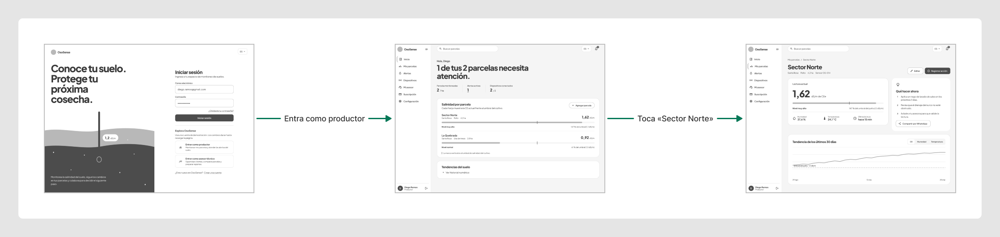

<em>Figura 5.80. Wireflow 1: saber cómo está mi parcela (Web App).</em>

Diego entra con su cuenta de productor y el inicio le dice en una frase cuántas parcelas necesitan atención. Toca la parcela marcada en rojo y en el detalle ve la lectura, la tendencia y qué hacer. Son dos acciones desde el inicio de sesión.

**WF2 · Diego Ramos · Web App.** *User goal:* atender una alerta y coordinar la acción con mi familia.

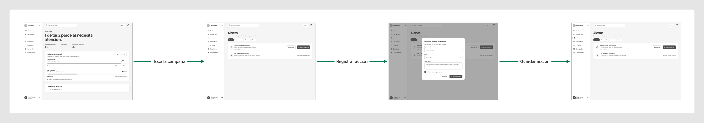

<em>Figura 5.81. Wireflow 2: atender una alerta (Web App).</em>

Desde el contador de la campana, Diego llega a la bandeja de alertas, registra la acción que hizo su familia (lavado de sales) y, al guardarla, la alerta pasa a cerrada y la asesora recibe el aviso.

**WF3 · Diego Ramos · Web App.** *User goal:* registrar mi parcela con su cultivo.

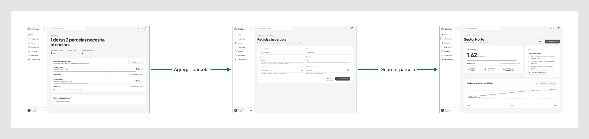

<em>Figura 5.82. Wireflow 3: registrar mi parcela (Web App).</em>

Con *Agregar parcela* abre el formulario, elige el cultivo (que fija el umbral), escribe el código del sensor y al guardar llega al detalle de la parcela nueva, donde aparecerá la primera lectura.

**WF4 · María Fernanda Salazar · Web App.** *User goal:* decidir qué parcela visitar primero.

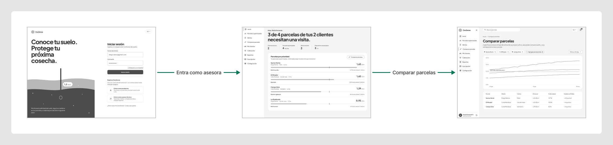

<em>Figura 5.83. Wireflow 4: decidir qué parcela visitar primero (Web App).</em>

María Fernanda entra con su cuenta de asesora; el inicio ya ordena las parcelas por riesgo. Para confirmar la prioridad compara las tres primeras en la misma escala y ve cuál sube más rápido.

**WF5 · María Fernanda Salazar · Web App.** *User goal:* calibrar un sensor con el análisis de laboratorio.

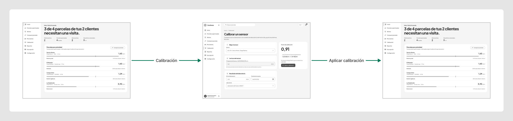

<em>Figura 5.84. Wireflow 5: calibrar un sensor (Web App).</em>

Desde el menú lateral abre *Calibración*, elige el sensor, ingresa la ECe del laboratorio y revisa el factor antes de aplicarlo. Al aplicar vuelve a su inicio, donde las franjas ya usan la lectura ajustada.

**WF6 · María Fernanda Salazar · Web App.** *User goal:* entregar al productor un reporte de su parcela.

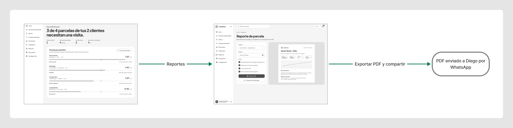

<em>Figura 5.85. Wireflow 6: entregar un reporte (Web App).</em>

En *Reportes* elige la parcela y el periodo, revisa la vista previa y exporta el PDF, que comparte con Diego por WhatsApp.

**WF7 · Diego Ramos · Mobile App.** *User goal:* saber cómo está mi parcela sin ir a verla.

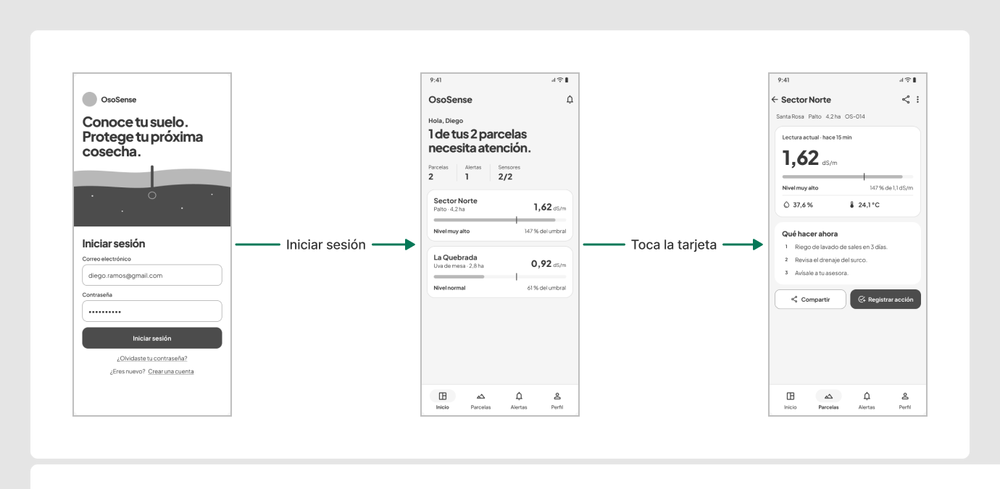

<em>Figura 5.86. Wireflow 7: saber cómo está mi parcela (Mobile App).</em>

El recorrido es el mismo que en la Web App, adaptado al celular: la sesión queda abierta y el inicio muestra las parcelas como tarjetas con su franja.

**WF8 · Diego Ramos · Mobile App.** *User goal:* atender una alerta y coordinar la acción con mi familia.

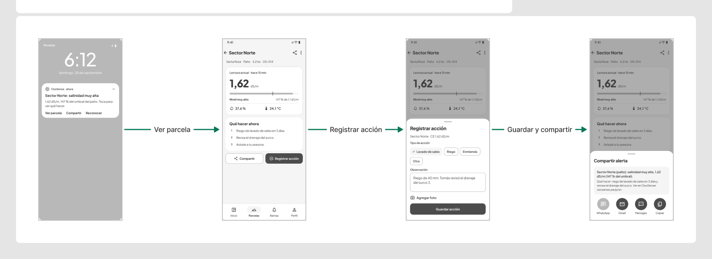

<em>Figura 5.87. Wireflow 8: atender una alerta y avisar a la familia (Mobile App).</em>

La alerta llega como notificación; *Ver parcela* abre directamente el detalle. Diego registra la acción en una hoja inferior y comparte el resumen por WhatsApp con la persona que está en la parcela, que era la tarea más frecuente de su matriz de tareas (sección 2.3.2).

### 5.4.2. Applications Mock-ups

Los mock-ups llevan los wireframes a alta fidelidad con el Design System de las aplicaciones. Parten de los tokens de la guía de estilo (5.1) y agregan cuatro colores para el fondo, el texto y los niveles de salinidad.

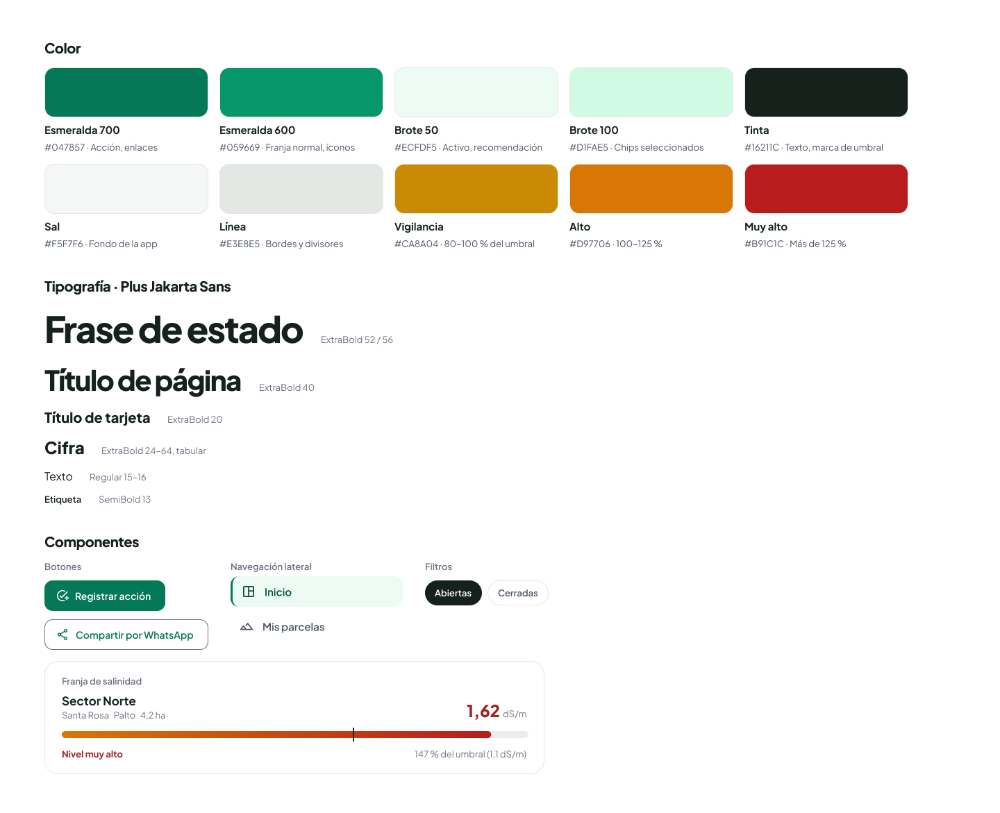

<em>Figura 5.88. Design System de las aplicaciones.</em>

| Categoría | Tokens |
|---|---|
| Acción | Esmeralda 700 `#047857` (botones, enlaces y marca del menú activo), Esmeralda 600 `#059669` (franja en nivel normal) |
| Superficies | Sal `#F5F7F6` (fondo), blanco (tarjetas), Brote 50 `#ECFDF5` (ítem activo y recomendación), Línea `#E3E8E5` (bordes) |
| Texto | Tinta `#16211C` (títulos, cifras y marca del umbral), Neutral 600 `#4B5563` y 500 `#6B7280` (texto secundario) |
| Niveles | Vigilancia `#CA8A04`, Alto `#D97706`, Muy alto `#B91C1C` (con texto `#A12426`) |
| Tipografía | Plus Jakarta Sans: frase de estado 52 px ExtraBold, título de vista 40 px, título de tarjeta 20 px, cifras con números tabulares, texto 15–16 px |
| Componentes | Franja de salinidad, menú lateral con indicador deslizante, botones de relleno y contorno de 12 px de radio, chips de filtro, tarjetas de 24 px de radio |

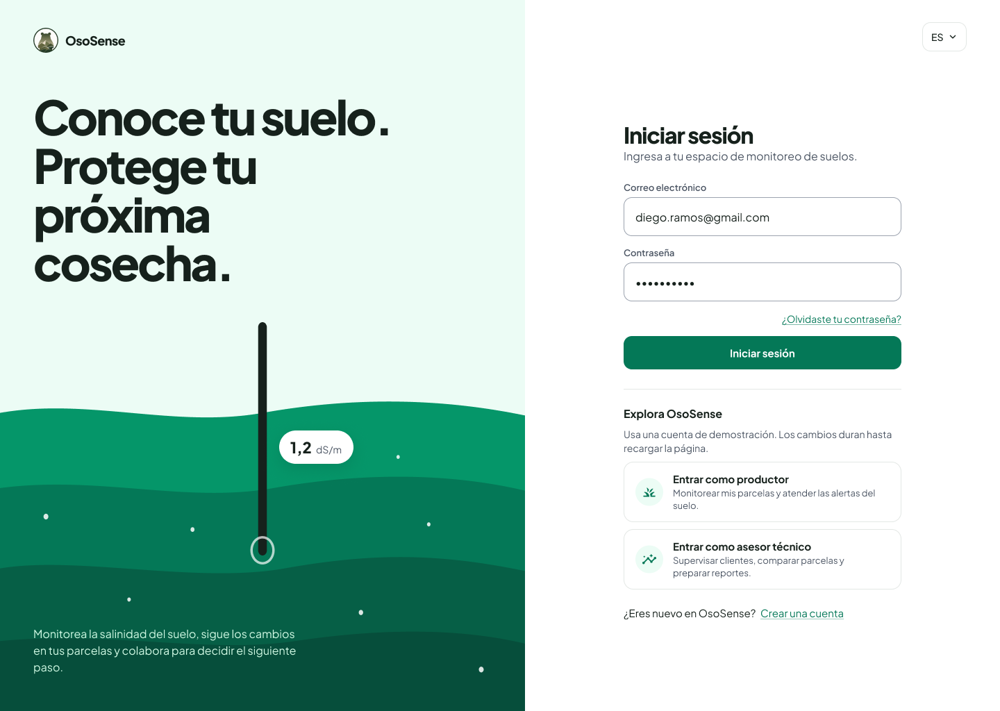

<em>Figura 5.89. Mock-up de inicio de sesión (Web App).</em>

La escena de la izquierda cuenta lo que hace el producto sin palabras: una sonda entra en las capas del suelo, aparecen los cristales de sal y se muestra una lectura. En la aplicación, esta secuencia se anima una sola vez al cargar la página.

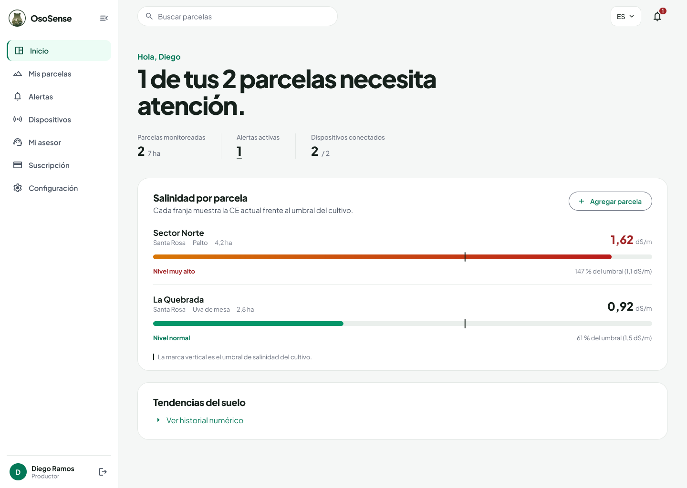

<em>Figura 5.90. Mock-up del inicio del productor.</em>

El color se reserva para el estado del suelo: la franja de Sector Norte pasa de naranja a rojo porque supera en 47 % el umbral del palto, mientras La Quebrada queda en verde. Al abrir el inicio, las franjas se llenan de izquierda a derecha, una tras otra; es la única animación de la vista.

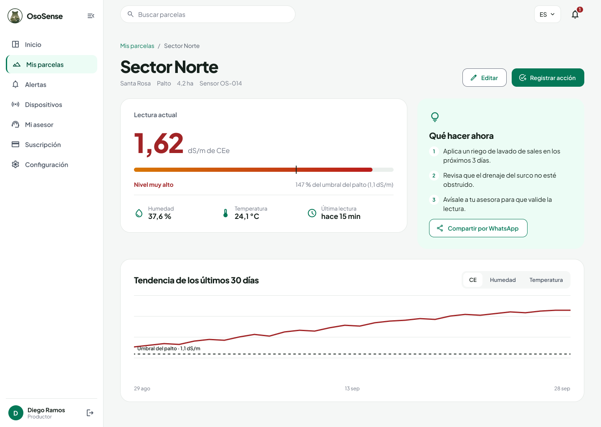

<em>Figura 5.91. Mock-up del detalle de parcela.</em>

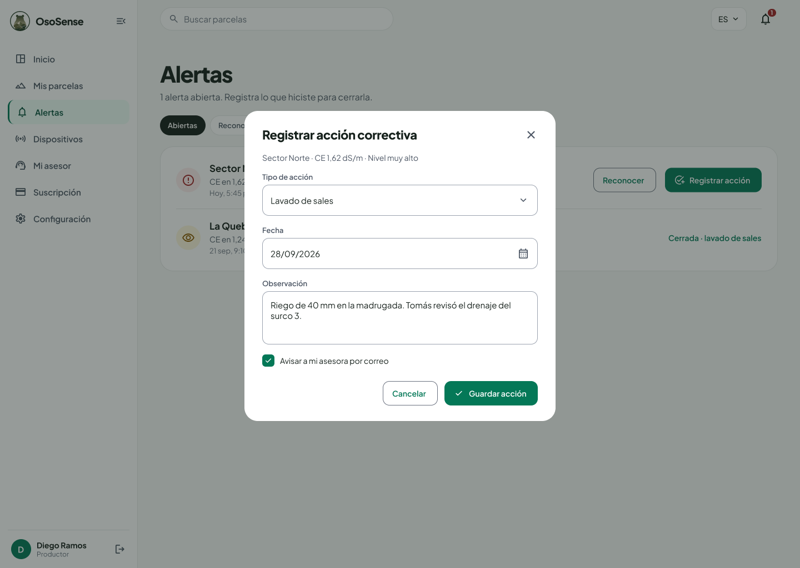

<em>Figura 5.92. Mock-up del diálogo de registrar acción correctiva.</em>

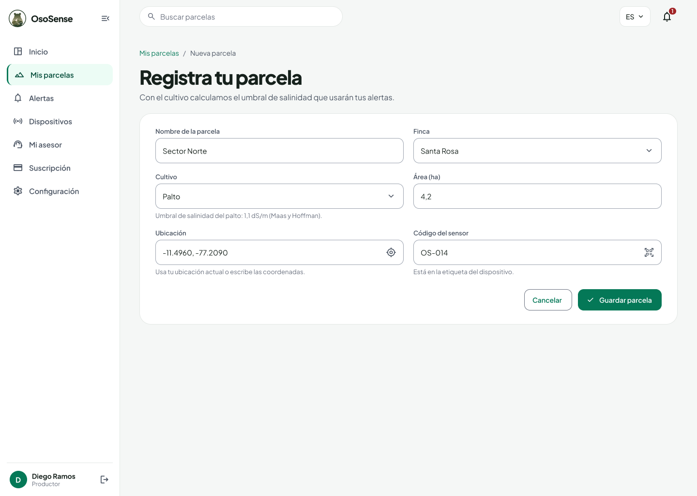

<em>Figura 5.93. Mock-up del formulario de nueva parcela.</em>

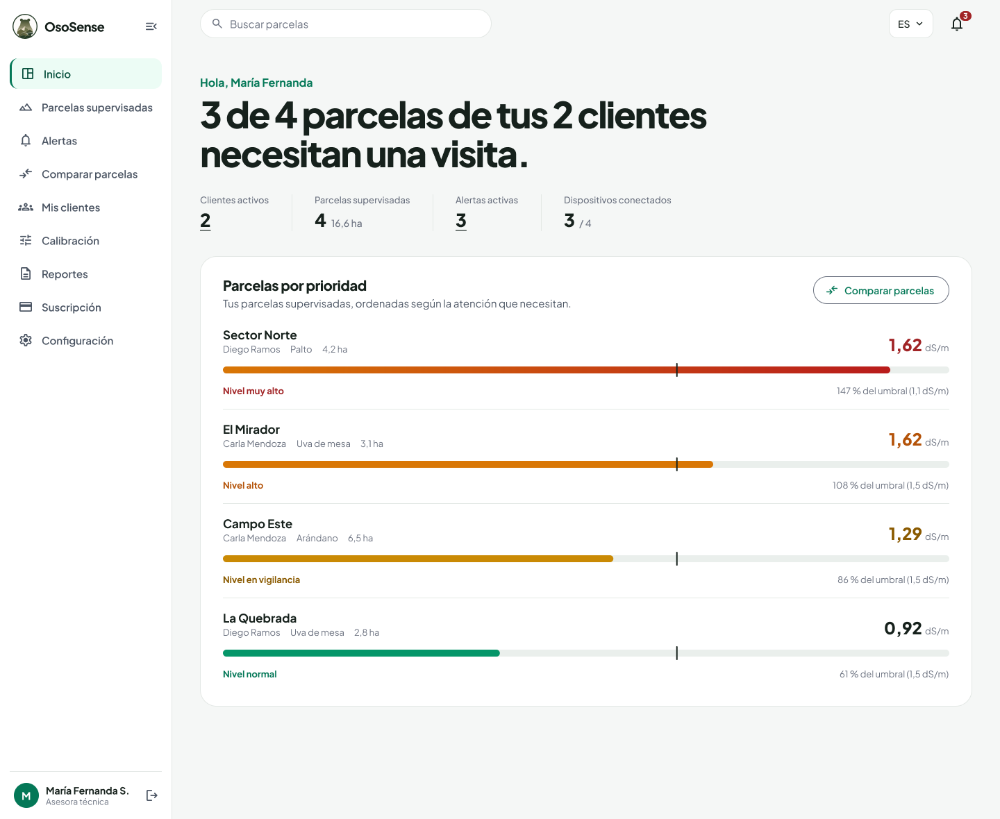

<em>Figura 5.94. Mock-up del inicio de la asesora técnica.</em>

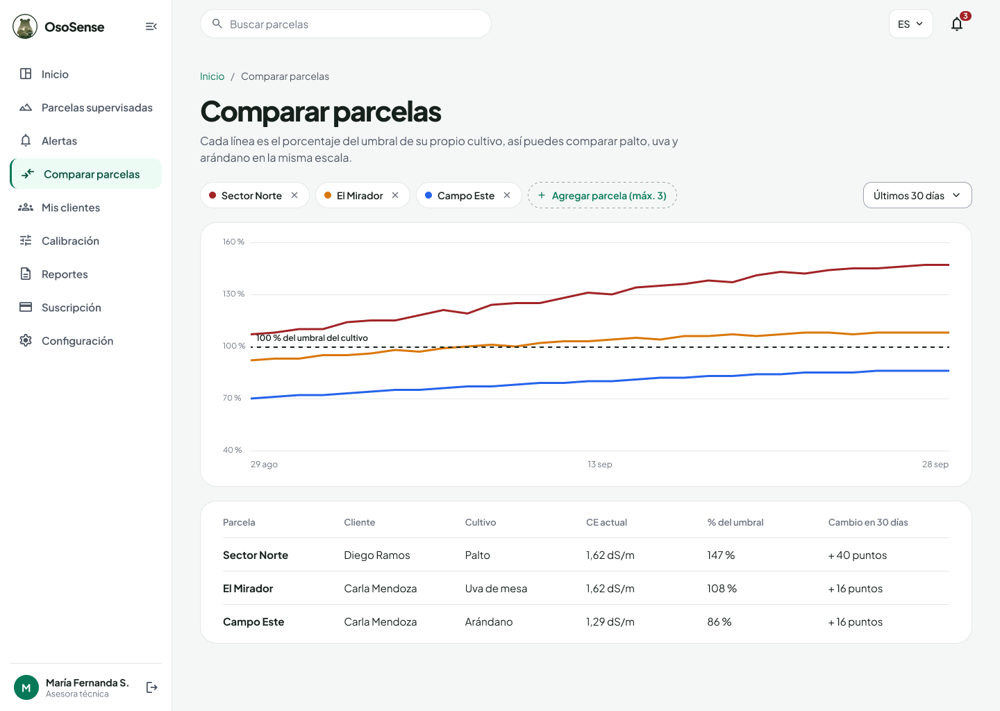

<em>Figura 5.95. Mock-up de comparar parcelas.</em>

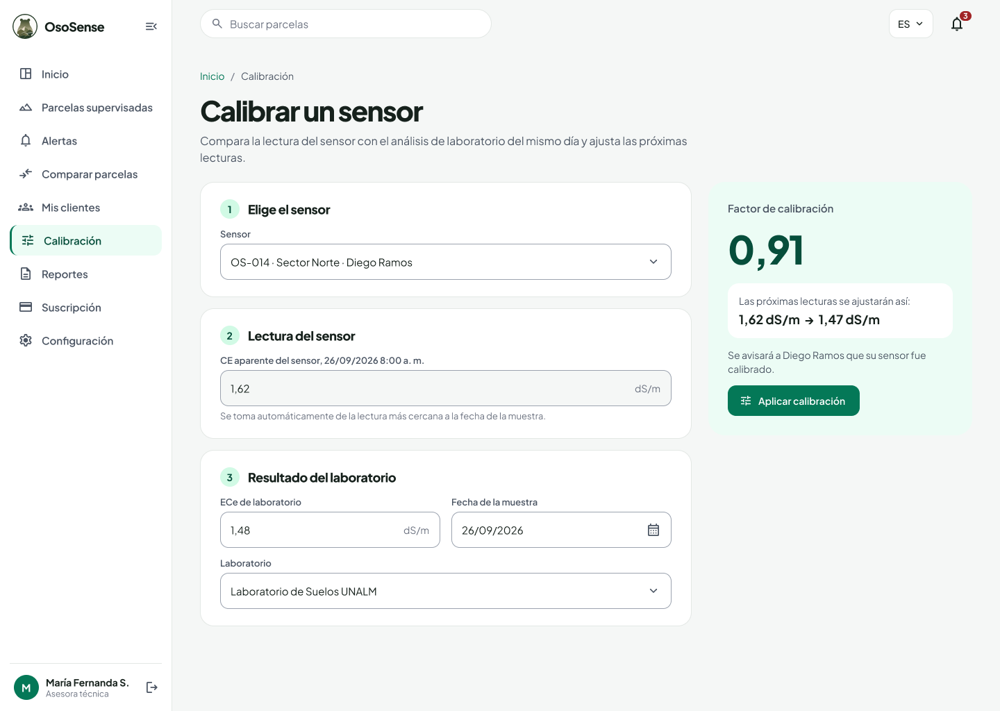

<em>Figura 5.96. Mock-up de calibración de un sensor.</em>

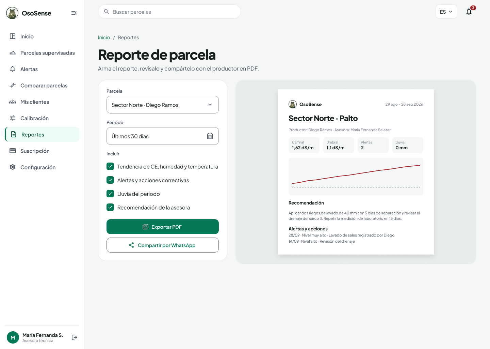

<em>Figura 5.97. Mock-up del reporte de parcela.</em>

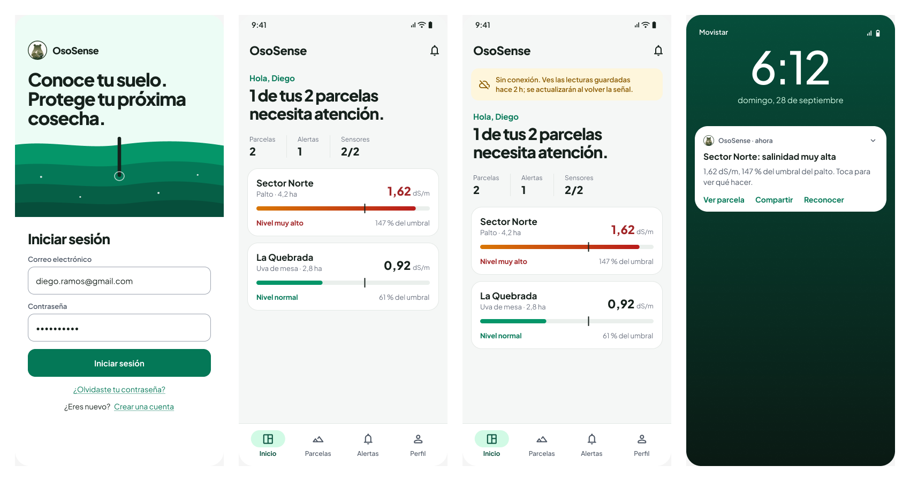

<em>Figura 5.98. Mock-ups de la Mobile App (1/2).</em>

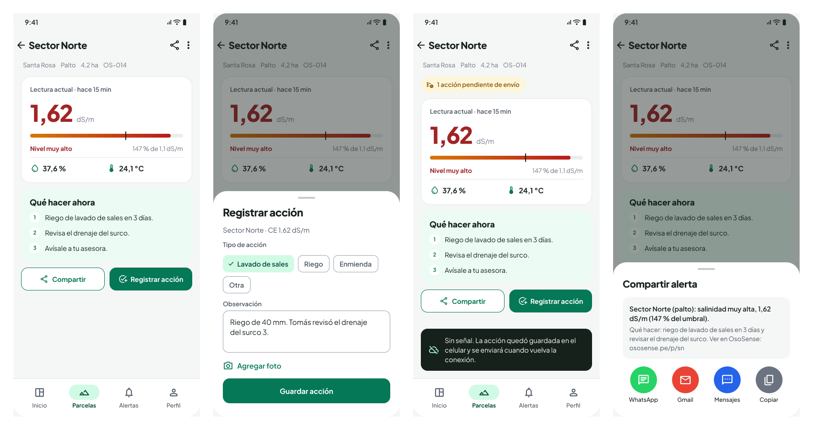

<em>Figura 5.99. Mock-ups de la Mobile App (2/2).</em>

**Cómo se aplican los principios en los mock-ups**

- **Minimalismo con un solo protagonista por vista.** La frase de estado, la lectura de 64 px o el título de la tarea dominan; todo lo demás es blanco, gris y una línea de borde.
- **El color comunica estado, no decora.** El verde esmeralda marca lo que se puede pulsar; el ámbar, el naranja y el rojo solo aparecen en lecturas y alertas.
- **Movimiento con propósito.** Solo tres animaciones en toda la aplicación: la escena del inicio de sesión, el llenado de las franjas al abrir el inicio y el desplazamiento del indicador del menú al cambiar de sección, que confirma a dónde se fue.
- **Marca de Oso Terra** en el menú lateral, la notificación y la hoja del reporte.

**Diseño inclusivo en los mock-ups**

Contrastes medidos (WCAG 2.1): tinta `#16211C` sobre el fondo `#F5F7F6`, 15,9:1; texto secundario `#4B5563` sobre blanco, 7,56:1; esmeralda `#047857` con texto blanco, 5,48:1; rojo de texto `#A12426` sobre blanco, 7,9:1. La marca del umbral es una línea de 2 px en tinta, visible sobre cualquier color de franja. En la Mobile App, la notificación usa el mismo texto que la alerta de la Web App para que el mensaje sea reconocible en ambos canales.

Diseño en Figma: [wireframes](https://www.figma.com/design/w8ggl2291TtYEPmhJ70zrq/OsoSense-%E2%80%94-Landing-Page-UI-Design?node-id=37-3) y [mock-ups y Design System](https://www.figma.com/design/w8ggl2291TtYEPmhJ70zrq/OsoSense-%E2%80%94-Landing-Page-UI-Design?node-id=37-2).

### 5.4.3. Applications User Flow Diagrams

Los user flows derivan de los wireflows y usan los mock-ups. Además de la ruta esperada (*happy path*, flechas verdes continuas), muestran las rutas alternativas (*unhappy paths*, flechas rojas discontinuas) y las condiciones que las separan (rombos amarillos). Los óvalos verdes marcan el inicio y el resultado de cada flujo.

**UF1 · Diego Ramos · Web App.** *User goal:* saber cómo está mi parcela sin ir a verla.

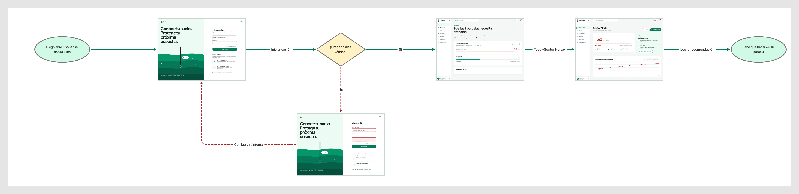

<em>Figura 5.100. User flow 1: saber cómo está mi parcela (Web App).</em>

*Happy path:* Diego inicia sesión, llega a su inicio, toca Sector Norte y lee la recomendación. *Unhappy path:* si el correo o la contraseña no coinciden, los dos campos se marcan en rojo y un mensaje explica qué revisar (por ejemplo, las mayúsculas); al corregir vuelve al inicio de sesión.

**UF2 · Diego Ramos · Web App.** *User goal:* atender una alerta y coordinar la acción con mi familia.

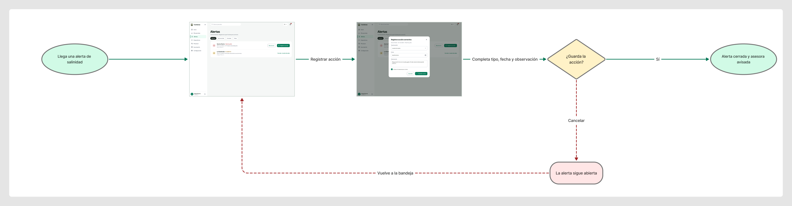

<em>Figura 5.101. User flow 2: atender una alerta (Web App).</em>

*Happy path:* desde la bandeja abre *Registrar acción*, completa el tipo, la fecha y la observación, y guarda; la alerta se cierra y la asesora recibe un correo. *Unhappy path:* si cancela, vuelve a la bandeja y la alerta sigue abierta, para que no se pierda.

**UF3 · Diego Ramos · Web App.** *User goal:* registrar mi parcela con su cultivo.

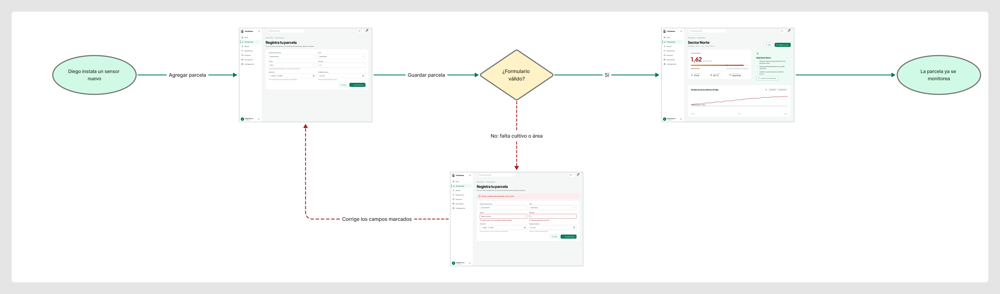

<em>Figura 5.102. User flow 3: registrar mi parcela (Web App).</em>

*Happy path:* completa el formulario y llega al detalle de la parcela nueva. *Unhappy path:* si falta el cultivo o el área es 0, un resumen arriba indica cuántos campos revisar y cada campo explica el problema («Elige el cultivo; sin él no podemos calcular el umbral.»); al corregir, se guarda.

**UF4 · María Fernanda Salazar · Web App.** *User goal:* decidir qué parcela visitar primero.

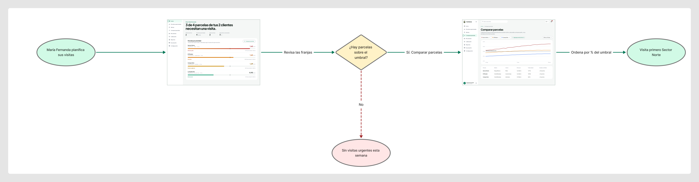

<em>Figura 5.103. User flow 4: decidir qué parcela visitar primero (Web App).</em>

*Happy path:* si hay parcelas sobre el umbral, compara las prioritarias y decide visitar primero la que más supera el umbral. *Ruta alternativa:* si ninguna está sobre el umbral, la frase del inicio lo dice y no hace falta seguir; la revisión queda para la semana siguiente.

**UF5 · María Fernanda Salazar · Web App.** *User goal:* calibrar un sensor con el análisis de laboratorio.

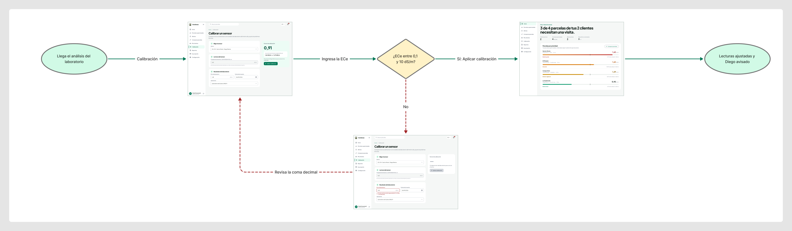

<em>Figura 5.104. User flow 5: calibrar un sensor (Web App).</em>

*Happy path:* ingresa la ECe del laboratorio, revisa el factor (0,91) y lo aplica; las lecturas se ajustan y Diego recibe el aviso. *Unhappy path:* si el valor está fuera del rango posible (por ejemplo, 14,8 en lugar de 1,48 por una coma mal puesta), el campo se marca, el factor no se calcula y el botón queda desactivado hasta corregirlo.

**UF6 · María Fernanda Salazar · Web App.** *User goal:* entregar al productor un reporte de su parcela.

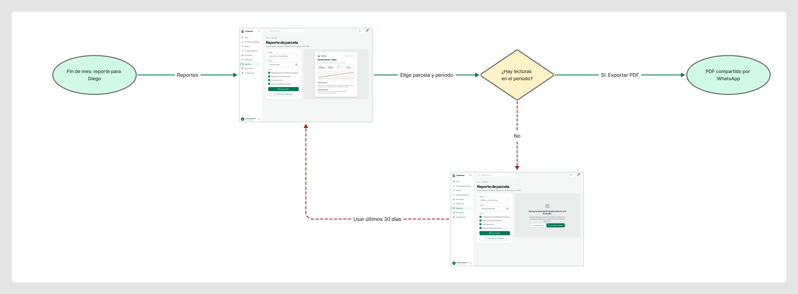

<em>Figura 5.105. User flow 6: entregar un reporte (Web App).</em>

*Happy path:* elige parcela y periodo, revisa la vista previa y exporta el PDF para compartirlo. *Unhappy path:* si el periodo no tiene lecturas (el sensor estuvo sin conexión), la vista previa lo explica y ofrece dos salidas: revisar el dispositivo o usar los últimos 30 días.

**UF7 · Diego Ramos · Mobile App.** *User goal:* saber cómo está mi parcela sin ir a verla.

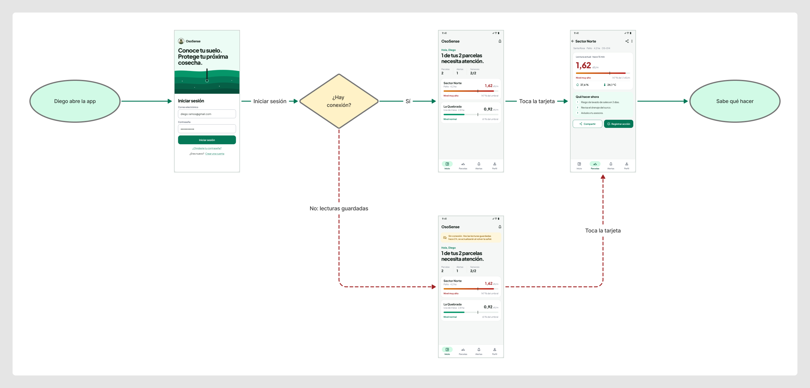

<em>Figura 5.106. User flow 7: saber cómo está mi parcela (Mobile App).</em>

*Happy path:* con conexión, el inicio muestra las lecturas del momento. *Unhappy path:* sin conexión, un aviso ámbar indica que las lecturas son de hace 2 horas y que se actualizarán al volver la señal; Diego igual puede abrir el detalle.

**UF8 · Diego Ramos · Mobile App.** *User goal:* atender una alerta y coordinar la acción con mi familia.

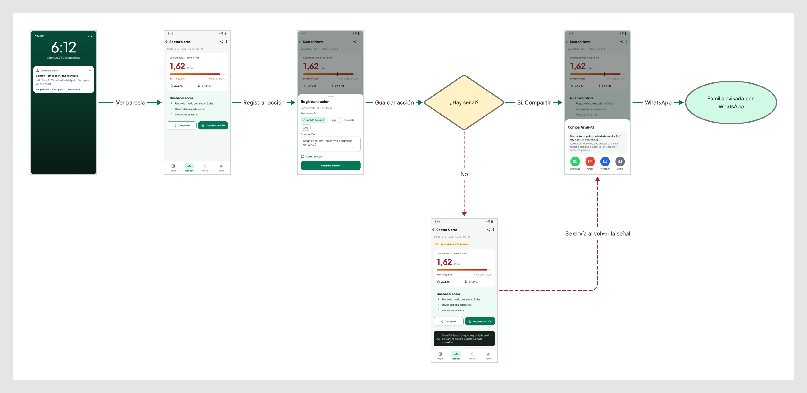

<em>Figura 5.107. User flow 8: atender una alerta y avisar a la familia (Mobile App).</em>

*Happy path:* desde la notificación abre la parcela, registra la acción y la comparte por WhatsApp. *Unhappy path:* si no hay señal al guardar, la acción queda en el celular con la etiqueta «1 acción pendiente de envío» y se envía sola cuando vuelve la conexión; el mensaje lo explica sin culpar al usuario.

Tablero en FigJam: [OsoSense — Wireflows y User Flows](https://www.figma.com/board/QhrU4aUPvxBQeR1hSyJ3Jn).

## 5.5. Applications Prototyping

Los prototipos se construyeron en Figma sobre los mock-ups de la sección 5.4.2, conectando botones, enlaces y elementos del menú con transiciones. Siguen las rutas de los user flows, incluidos los caminos alternativos: por ejemplo, *Iniciar sesión* sin datos lleva al estado de error, *Guardar parcela* con el formulario incompleto muestra la validación y *Guardar acción* en la Mobile App muestra el aviso sin señal.

**Criterios de interacción**

- **La navegación sigue la arquitectura de información (5.2.5).** En la Web App, el menú lateral lleva a cada vista del rol y la marca de la sección activa se desliza al nuevo destino; en la Mobile App, la barra inferior cambia de sección y las acciones de una parcela se abren como hojas desde abajo, sin perder el contexto.
- **Transiciones que explican el cambio.** Entre vistas se usa *smart animate* de 300 ms con salida suave; los diálogos, las hojas y los estados de error aparecen con un fundido de 250 ms, porque cambian la misma pantalla y no llevan a otra.
- **Una acción, un resultado visible.** Cada botón del prototipo lleva a una pantalla que confirma lo ocurrido: alerta cerrada, factor aplicado, PDF listo o acción pendiente de envío.
- **Accesos directos desde el contexto.** La notificación del celular abre el detalle de la parcela sin pasar por el inicio; la campana de la Web App lleva directo a la bandeja de alertas.

| Prototipo | Punto de inicio | Rutas cubiertas |
|---|---|---|
| Web App (Desktop Web Browser) | Inicio de sesión | UG1 a UG6, con los estados de error de credenciales, validación de parcela, valor de laboratorio fuera de rango y reporte sin datos |
| Mobile App (Mobile) | Notificación de alerta e inicio de sesión | UG1 y UG2, con los estados sin conexión y sin señal |

Prototipos en Figma: [Web App](https://www.figma.com/proto/w8ggl2291TtYEPmhJ70zrq/OsoSense-%E2%80%94-Landing-Page-UI-Design?node-id=51-2&starting-point-node-id=51%3A2) y [Mobile App](https://www.figma.com/proto/w8ggl2291TtYEPmhJ70zrq/OsoSense-%E2%80%94-Landing-Page-UI-Design?node-id=52-61&starting-point-node-id=52%3A61).

**Videos de demostración**

<!-- TODO(equipo): grabar un video por aplicación recorriendo el prototipo (guion en el wiki: cap5-apps-plan), subirlo a Microsoft Stream o Clipchamp, y reemplazar estas dos líneas por la captura del video y su enlace. -->
- Web App: captura y enlace del video en Microsoft Stream (por agregar).
- Mobile App: captura y enlace del video en Microsoft Stream (por agregar).

## 5.6. IoT Device Design

El dispositivo de campo de OsoSense es una estaca con una carcasa sellada que se clava junto al cultivo. Sus decisiones de diseño responden a tres condiciones de la costa norte observadas en las entrevistas: la parcela no siempre tiene señal, nadie la revisa todos los días y quien la instala no es técnico. Por eso el dispositivo funciona con energía solar, guarda y reenvía sus lecturas a través del Edge Service y se comunica sin pantalla, con un LED y un botón.

**Relación con la arquitectura de información y la guía de estilo.** El dispositivo usa la misma escala de niveles que las aplicaciones (normal, en vigilancia, alto y muy alto): el color y el número de destellos del LED (sección 5.1.2) repiten el color de la franja que Diego ve en el celular, así que lo que ve en la parcela coincide con lo que ve en la app. El botón único cubre las tres acciones que la app necesita del dispositivo: tomar una lectura ahora, emparejar y restablecer.

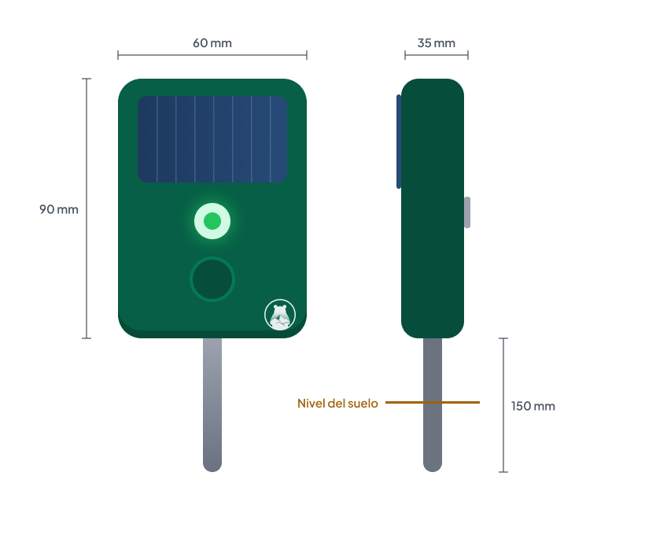

<em>Figura 5.108. Vistas frontal y lateral del dispositivo, con medidas.</em>

La carcasa mide 90 × 60 × 35 mm, en plástico ABS/ASA estabilizado contra rayos UV color `#065F46`, con esquinas de 12 mm y sellado IP65. En la cara frontal, de arriba abajo: el panel solar, el LED de estado bajo un difusor translúcido, el botón y el símbolo de Oso Terra. La sonda de 150 mm se clava hasta la línea de suelo, de modo que los electrodos quedan en la zona de las raíces.

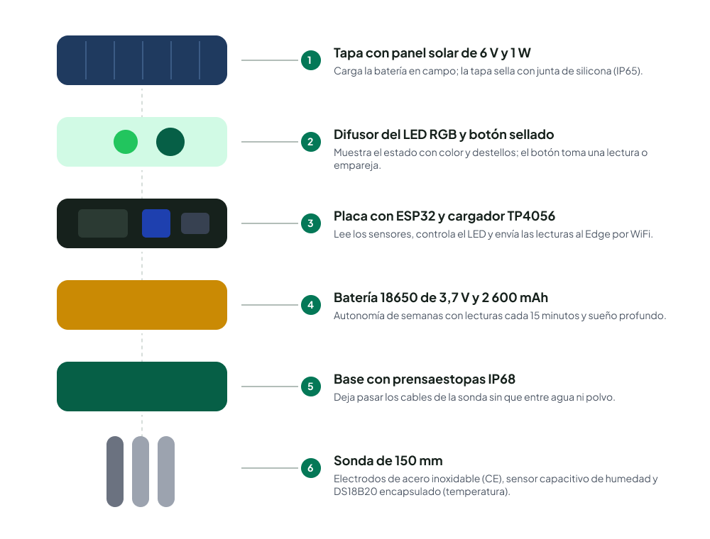

<em>Figura 5.109. Componentes del dispositivo, de la tapa a la sonda.</em>

| # | Componente | Decisión |
|---|---|---|
| 1 | Tapa con panel solar de 6 V y 1 W | Evita cambiar baterías en campo. |
| 2 | Difusor del LED RGB y botón sellado | Interfaz física sin pantalla, legible a pleno sol. |
| 3 | Placa con ESP32 y cargador TP4056 | WiFi integrado para hablar con el Edge Service y sueño profundo entre lecturas. |
| 4 | Batería 18650 de 3,7 V y 2 600 mAh | Autonomía de semanas con lecturas cada 15 minutos. |
| 5 | Base con prensaestopas IP68 | Paso de cables sin filtraciones de agua de riego. |
| 6 | Sonda de 150 mm | Electrodos de acero inoxidable para la CE, sensor capacitivo de humedad y DS18B20 encapsulado para la temperatura, que el Edge usa para compensar la CE a 25 °C. |

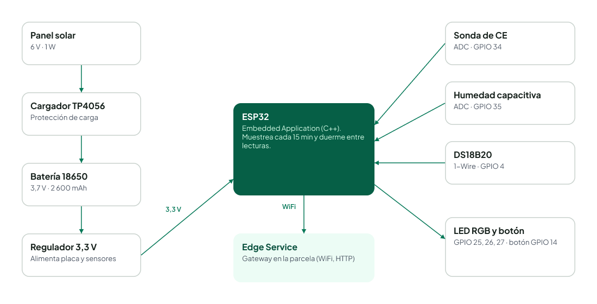

<em>Figura 5.110. Diagrama de bloques del hardware.</em>

El diagrama de bloques muestra los tres caminos del dispositivo: la **energía** (panel, cargador, batería y regulador de 3,3 V), la **medición** (tres sensores que entran al ESP32 por dos entradas analógicas y un bus 1-Wire) y la **comunicación** (LED y botón hacia el usuario, WiFi hacia el Edge Service de la parcela).

**Diseño del circuito**

El circuito se elaboró en **Wokwi** con un ESP32 DevKit C. Como Wokwi no tiene sonda de conductividad ni sensor capacitivo de humedad, ambos se simulan con potenciómetros que entregan la misma señal analógica; la temperatura usa el DS18B20 real del simulador.

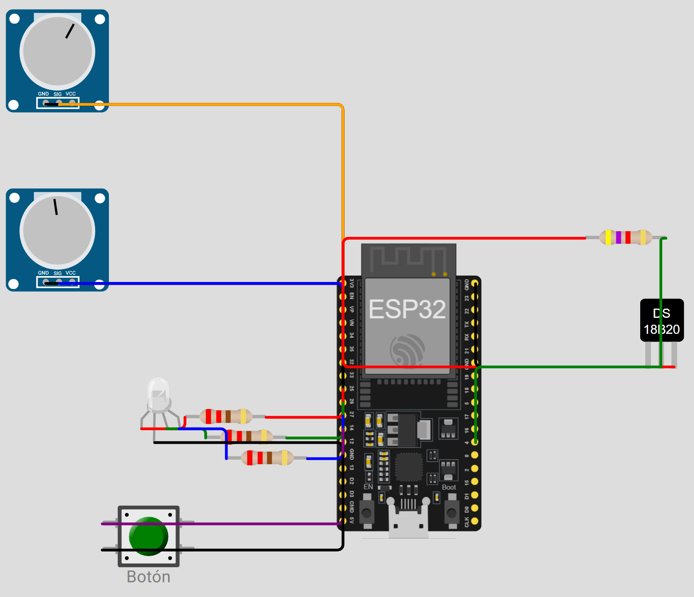

<em>Figura 5.111. Circuito del dispositivo en Wokwi.</em>

| Elemento | Pin del ESP32 | Conexión |
|---|---|---|
| Sonda de CE (potenciómetro en la simulación) | GPIO 34 (ADC) | Salida analógica 0–3,3 V |
| Humedad capacitiva (potenciómetro en la simulación) | GPIO 35 (ADC) | Salida analógica 0–3,3 V |
| DS18B20 | GPIO 4 | Bus 1-Wire con resistencia de 4,7 kΩ a 3,3 V |
| LED RGB de cátodo común | GPIO 25, 26 y 27 | Una resistencia de 220 Ω por color |
| Botón | GPIO 14 | Entrada con *pull-up* interno, a GND al pulsar |
| Alimentación | 3V3 y GND | Desde el regulador de 3,3 V |

**Flujos de interacción que cubre el prototipo**

1. **Encendido:** destello blanco y conexión a la red WiFi del Edge.
2. **Lectura periódica:** cada 15 minutos (10 s en la simulación) mide los tres valores, los envía al Edge en JSON y muestra el nivel con el LED según la tabla de la sección 5.1.2.
3. **Sin conexión:** destello blanco; el Edge Service conserva las lecturas y las reenvía al recuperar la señal.
4. **Pulsación corta:** toma y envía una lectura en el momento, útil durante la instalación.
5. **Pulsación de 3 s:** parpadeo azul de emparejamiento con la app.

Los archivos del circuito (`diagram.json`, `sketch.ino` y `libraries.txt`) se versionan en `assets/iot-device/wokwi/` del repositorio del informe y se pueden importar en Wokwi para ejecutar la simulación.

Diseño físico en Figma: [IoT · Dispositivo](https://www.figma.com/design/w8ggl2291TtYEPmhJ70zrq/OsoSense-%E2%80%94-Landing-Page-UI-Design?node-id=37-4).
