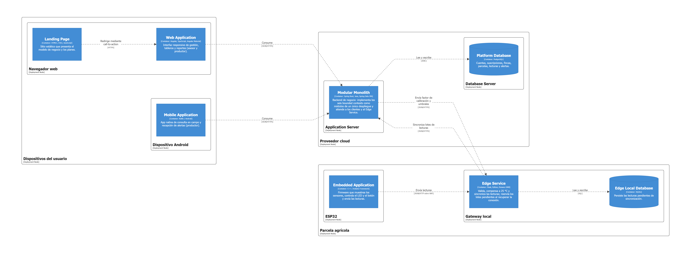

# Capítulo VI: Product Implementation, Validation & Deployment

## 6.1. Software Configuration Management

Esta sección fija las decisiones y convenciones que mantienen la consistencia de los productos de OsoSense durante todo su ciclo de vida: con qué herramientas trabaja el equipo, cómo se organiza el código en GitHub, cómo se escribe en cada lenguaje y cómo se despliega cada producto. Todo lo que se describe aquí se aplica desde el Sprint 1 y se puede verificar en los repositorios de la organización [OsoTerra-IoT](https://github.com/OsoTerra-IoT).

### 6.1.1. Software Development Environment Configuration

El equipo usa solo las herramientas indicadas en el enunciado. La tabla agrupa cada producto por la actividad del ciclo de vida en la que se usa, con su propósito en el proyecto y la ruta de acceso (SaaS) o de descarga (software que se instala en la computadora de cada integrante).

**Project Management y Requirements Management**

| Producto | Propósito en el proyecto | Ruta |
|---|---|---|
| Trello | Product Backlog, Sprint Backlog y tablero de tareas del sprint. | https://trello.com/b/adykOjs5/ososense-backlog |
| GitHub (organización y pull requests) | Revisión de cambios, historial y *insights* de colaboración de cada repositorio. | https://github.com/OsoTerra-IoT |
| UXPressia | User Personas, Empathy Maps, Journey Maps e Impact Maps. | https://uxpressia.com |

**Product UX/UI Design**

| Producto | Propósito en el proyecto | Ruta |
|---|---|---|
| Figma | Guía de estilo, wireframes, mock-ups, prototipos, arquitectura de información y diseño físico del dispositivo. | https://www.figma.com |
| FigJam | EventStorming, wireflows y user flows. | https://www.figma.com/figjam |
| Structurizr | Diagramas C4 (Landscape, Context, Container y Deployment) a partir de Structurizr DSL. | https://structurizr.com |
| Wokwi | Diseño y simulación del circuito del dispositivo IoT. | https://wokwi.com |

**Software Development**

| Producto | Propósito en el proyecto | Ruta |
|---|---|---|
| Git | Control de versiones local. | https://git-scm.com/downloads |
| Visual Studio Code | Edición del Landing Page, del informe en Markdown y del Edge Service. | https://code.visualstudio.com/download |
| WebStorm | Desarrollo de la Web App en Angular y TypeScript. | https://www.jetbrains.com/webstorm/download |
| IntelliJ IDEA | Desarrollo del RESTful API con Java y Spring Boot. | https://www.jetbrains.com/idea/download |
| Android Studio | Desarrollo de la Mobile App con Kotlin y Jetpack Compose. | https://developer.android.com/studio |
| Node.js 24 y npm | Ejecución y construcción de la Web App (Angular CLI). | https://nodejs.org/en/download |
| JDK 25 y Maven | Compilación y ejecución del RESTful API. | https://adoptium.net · https://maven.apache.org/download.cgi |
| PostgreSQL | Base de datos del RESTful API en el entorno local. | https://www.postgresql.org/download |
| Python 3 con Flask, Peewee y SQLite | Edge Service (desde el Sprint 2). | https://www.python.org/downloads |
| Arduino IDE (núcleo ESP32) | Compilación y carga de la Embedded Application en el ESP32 (desde el Sprint 2). | https://www.arduino.cc/en/software |

**Software Testing**

| Producto | Propósito en el proyecto | Ruta |
|---|---|---|
| Vitest (vía Angular CLI) | Pruebas unitarias y de navegación de la Web App (`ng test`). | https://vitest.dev |
| JUnit 5 y Spring Boot Test | Pruebas unitarias y de integración del RESTful API. | https://junit.org/junit5 |
| Postman | Pruebas manuales de los endpoints del RESTful API. | https://www.postman.com/downloads |
| Wokwi | Simulación del firmware antes de cargarlo en el dispositivo. | https://wokwi.com |

**Software Deployment**

| Producto | Propósito en el proyecto | Ruta |
|---|---|---|
| GitHub Pages | Publicación del Landing Page y de la Web App. | https://pages.github.com |
| GitHub Actions | Construcción y publicación automática de la Web App al integrar cambios en `develop`. | https://github.com/features/actions |
| Firebase App Distribution | Distribución de la Mobile App a dispositivos físicos de prueba. | https://firebase.google.com/products/app-distribution |

**Software Documentation**

| Producto | Propósito en el proyecto | Ruta |
|---|---|---|
| GitHub (Markdown) | Informe del proyecto; `README.md` es el archivo principal. | https://github.com/OsoTerra-IoT/OsoTerra---Project-Report |
| OpenAPI Specification vía Swagger | Documentación de los endpoints del RESTful API. | https://swagger.io/specification |
| Microsoft Stream / Clipchamp | Videos de exposición, del producto y de los prototipos. | https://clipchamp.com |

### 6.1.2. Source Code Management

El código de cada producto vive en su propio repositorio de GitHub, dentro de la organización OsoTerra-IoT. Los repositorios del Edge Service y de la Embedded Application se crean en el Sprint 2, cuando empieza su implementación.

| Producto | Repositorio | Contenido |
|---|---|---|
| Landing Page | https://github.com/OsoTerra-IoT/OsoTerra---Landing-Page | Sitio estático en HTML5, CSS3 y JavaScript. |
| Web Services (RESTful API) | https://github.com/OsoTerra-IoT/OsoTerra---Backend | Proyecto Spring Boot con sus pruebas unitarias y de integración en `src/test`. |
| Frontend Web Application | https://github.com/OsoTerra-IoT/OsoTerra---Web-Application | Proyecto Angular con sus pruebas (`*.spec.ts`) y el flujo de despliegue en `.github/workflows`. |
| Mobile Application | https://github.com/OsoTerra-IoT/OsoTerra---Mobile-Application | Proyecto Android en Kotlin y Jetpack Compose. |
| Informe del proyecto | https://github.com/OsoTerra-IoT/OsoTerra---Project-Report | Capítulos en Markdown, imágenes y archivos fuente de los diagramas (Structurizr DSL y Wokwi). |

**GitFlow.** Todos los repositorios siguen el modelo *A successful Git branching model* de Vincent Driessen:

| Rama | Se crea desde | Se integra en | Uso |
|---|---|---|---|
| `main` | — | — | Versión publicada. Solo recibe *releases* y *hotfixes*. |
| `develop` | `main` | — | Integración del trabajo terminado; es la rama por defecto y la que se despliega en los entornos de prueba. |
| `feature/<descripcion-en-kebab-case>` | `develop` | `develop` | Una rama por feature o user story, por ejemplo `feature/webapp-cta-links` o `feature/github-pages-deploy`. |
| `release/<MAJOR.MINOR.PATCH>` | `develop` | `main` y `develop` | Preparación de una versión, por ejemplo `release/0.1.0`. Al cerrarla se etiqueta `v0.1.0` en `main`. |
| `hotfix/<descripcion-en-kebab-case>` | `main` | `main` y `develop` | Corrección urgente sobre la versión publicada. |

Reglas de trabajo:

- Las ramas de feature y de corrección se integran con *merge* sin *fast-forward* (`--no-ff`) o mediante pull request, para conservar en el historial qué commits pertenecen a cada feature.
- En el repositorio del informe, cada capítulo tiene su rama `feature/chapter-N` y cada sección se trabaja en una sub-rama que se integra en su capítulo; los capítulos se integran en `develop` al preparar una entrega.
- Los nombres de rama van en inglés y en *kebab-case*. Las ramas antiguas de la Mobile App con prefijo `feat/` se renombran a `feature/` a partir del Sprint 2.

**Semantic Versioning 2.0.0.** Cada *release* se nombra `MAJOR.MINOR.PATCH`: `PATCH` para correcciones compatibles, `MINOR` para funcionalidades nuevas compatibles y `MAJOR` para cambios incompatibles. Mientras los productos estén en construcción, las versiones se mantienen en `0.y.z`; la primera versión para usuarios reales será `1.0.0`. El informe sigue la misma regla: `release/0.1.0` corresponde a la entrega AV1.

**Conventional Commits.** Los mensajes de commit siguen la forma `tipo(alcance): descripción`, en inglés, en modo imperativo y en una sola línea de hasta 72 caracteres.

| Tipo | Cuándo se usa | Ejemplo real del proyecto |
|---|---|---|
| `feat` | Nueva funcionalidad. | `feat(cta): link plan and call-to-action buttons to web app sign-up` |
| `fix` | Corrección de un error. | `fix(layout): fit mobile top bar and cite each crop source in reports` |
| `docs` | Documentación e informe. | `docs(chapter-4): merge C4 views into a single OsoSense system` |
| `style` | Formato o estilos sin cambiar la lógica. | `style(a11y): raise contrast of primary and outline buttons` |
| `refactor` | Cambio de estructura sin cambiar el comportamiento. | `refactor: move password reset REST resources to iam package` |
| `test` | Pruebas nuevas o corregidas. | `test: move iam domain and application tests to iam package` |
| `ci` / `build` / `chore` | Integración continua, construcción y tareas de mantenimiento. | `ci(deploy): publish develop to GitHub Pages with SPA fallback` |

### 6.1.3. Source Code Style Guide & Conventions

Todos los nombres de variables, funciones, clases, archivos, ramas y commits se escriben en **inglés**. Los textos que ve el usuario no se escriben en el código: van en archivos de traducción (en_US y es_419), con el inglés como idioma por defecto.

| Lenguaje | Guía adoptada | Convenciones del proyecto |
|---|---|---|
| HTML5 | *Google HTML/CSS Style Guide* y *W3Schools HTML Style Guide and Coding Conventions* | Etiquetas y atributos en minúsculas, comillas dobles, sangría de 2 espacios, HTML semántico (`header`, `nav`, `main`, `section`, `footer`), `alt` en toda imagen y atributos ARIA en controles interactivos. |
| CSS3 | *Google HTML/CSS Style Guide* | Clases en *kebab-case*, colores y medidas como variables (`--os-primary-700`), sin estilos en línea salvo excepciones documentadas y respetando `prefers-reduced-motion`. |
| JavaScript | *Google JavaScript Style Guide* | `const` y `let` en lugar de `var`, funciones y variables en *camelCase*, un módulo por archivo en el Landing Page. |
| TypeScript | *Google TypeScript Style Guide* y *Angular Coding Style Guide* | Componentes *standalone*, archivos en *kebab-case* (`salinity-strip.ts`), clases en *PascalCase*, estado con *signals*, formato con Prettier y validación de traducciones con `npm run check:i18n`. |
| Java | *Google Java Style Guide* y documentación de *Spring Boot Features* | Paquetes por bounded context (`com.osoterra.ososense.iam`) con las capas `domain`, `application`, `infrastructure` e `interfaces`; clases en *PascalCase*, métodos en *camelCase*, constantes en *UPPER_SNAKE_CASE*; recursos REST en plural y en *kebab-case* (`/api/v1/soil-readings`). |
| Kotlin | *Kotlin Coding Conventions* y guías de Jetpack Compose | Funciones `@Composable` en *PascalCase*, un paquete por capa (`data`, `domain`, `ui`) y textos en `strings.xml` con versión en español. |
| C++ | *Google C++ Style Guide* | Constantes de pines en *UPPER_SNAKE_CASE* (`PIN_EC`), funciones en *camelCase* y un comentario por bloque de hardware. |
| Python | *PEP 8* | Módulos y funciones en *snake_case*, clases en *PascalCase*, modelos Peewee en singular. |
| Gherkin | *Gherkin Conventions for Readable Specifications* | Un archivo `.feature` por user story (`us-01-view-value-proposition.feature`), escenarios con *Given / When / Then* en inglés, un comportamiento por escenario y datos en tablas *Examples*. |

### 6.1.4. Software Deployment Configuration

Cada producto se construye y publica a partir de su repositorio. Para el TB1 están desplegados el Landing Page y la Web App; los demás productos tienen su configuración definida y se despliegan en los sprints siguientes.

**Landing Page** — publicado en https://osoterra-iot.github.io/OsoTerra---Landing-Page/

1. Integrar las ramas de feature en `develop` con `--no-ff`.
2. En el repositorio, *Settings → Pages*, usar como origen la rama `develop` y la carpeta raíz (`/`).
3. GitHub Pages publica el sitio en cada push a `develop`; el cambio se ve en uno o dos minutos.
4. Los botones de planes y el llamado final apuntan al registro de la Web App desplegada.

**Frontend Web Application** — publicada en https://osoterra-iot.github.io/OsoTerra---Web-Application/

1. El flujo `.github/workflows/deploy-pages.yml` se ejecuta en cada push a `develop` (o manualmente).
2. El trabajo *build* instala dependencias con `npm ci`, valida las traducciones con `npm run check:i18n` y construye con `ng build --base-href /OsoTerra---Web-Application/`.
3. Copia `index.html` como `404.html` para que las rutas internas de Angular funcionen al recargar la página, y sube la carpeta `dist/osoterra-web-app/browser` como artefacto.
4. El trabajo *deploy* publica el artefacto en el entorno `github-pages`, que solo acepta despliegues desde `main` y `develop`.

**Web Services (RESTful API)** — despliegue en la nube en el Sprint 2

1. Configurar las variables de entorno de la base de datos PostgreSQL, del correo y de la clave JWT.
2. Construir con `mvn clean package`, que ejecuta las pruebas y genera el `.jar`.
3. Las migraciones de Flyway crean o actualizan el esquema al iniciar la aplicación.
4. Publicar el `.jar` en el servidor de aplicaciones del proveedor cloud y exponer la documentación OpenAPI en `/swagger-ui`.

**Mobile Application** — distribución de prueba en el Sprint 2

1. Generar el APK de *release* firmado desde Android Studio (*Build → Generate Signed App Bundle / APK*).
2. Subirlo a Firebase App Distribution y agregar a los integrantes y usuarios de prueba.
3. Los usuarios de prueba instalan la app desde el enlace de invitación en su celular Android.

**Edge Service y Embedded Application** — Sprint 2

1. El Edge Service se instala en el gateway de la parcela con Python 3, sus dependencias (`flask`, `peewee`) y la base SQLite, y se inicia como servicio del sistema.
2. La Embedded Application se compila en Arduino IDE con el núcleo ESP32 y se carga por USB; antes se valida en la simulación de Wokwi (`assets/iot-device/wokwi`).

El Deployment Diagram de la sección 4.1.3.4 muestra cómo se distribuyen estos contenedores entre la parcela, los dispositivos del usuario y el proveedor cloud.

<div align="center">

<p><em>Figura 6.1. Software Architecture Deployment Diagram de OsoSense.</em></p>
</div>

## 6.2. Landing Page, Services & Applications Implementation

### 6.2.1. Sprint 1

#### 6.2.1.1. Sprint Planning 1

En el Sprint 1 el equipo construyó la primera versión de los productos que el TB1 exige desplegados: el Landing Page y la Web App. En paralelo avanzó el RESTful API con el bounded context de Identity and Access Management y un primer prototipo de la Mobile App. El sprint duró cuatro semanas, del 7 de septiembre al 4 de octubre de 2026, e incluyó la integración de las correcciones del AV1.

El Sprint Planning se hizo al inicio del sprint, con el Product Backlog de la sección 3.3 como base. Como es el primer sprint de implementación, no hay revisión ni retrospectiva de un sprint anterior; en su lugar se tomó como punto de partida lo entregado en el AV1.

| Sprint # | Sprint 1 |
|---|---|
| **Sprint Planning Background** | |
| Date | 2026-09-07 |
| Time | 08:00 PM |
| Location | Reunión virtual en Google Meet |
| Prepared By | Encalada Salazar, Alexis |
| Attendees (to planning meeting) | Barturen Panez, Iker Gabriel / Encalada Salazar, Alexis / Goñe Araccata, Esther Abigail / Ortiz Alarcon, Victor Nicolas / Salazar Caballero, Alvaro Fabrizzio / Santiago Peña, Andreow Jomark / Tumi Oliden, Manuel Ignacio |
| Sprint 0 Review Summary | No hubo un sprint de implementación previo. El punto de partida es el AV1: investigación de usuarios, User Stories con criterios de aceptación, Product Backlog priorizado y diseño estratégico y táctico del software. |
| Sprint 0 Retrospective Summary | En el AV1 el trabajo del informe se concentró en pocas personas. Para este sprint el equipo acordó un líder por producto, commits con Conventional Commits y revisión cruzada antes de integrar en `develop`. |
| **Sprint Goal & User Stories** | |
| Sprint 1 Goal | *Our focus is on* presentar OsoSense a los visitantes con un Landing Page claro y bilingüe; dar a productores y asesores técnicos una primera Web App para registrarse, iniciar sesión, ver el estado de salinidad de sus parcelas y registrar acciones correctivas; y dar a los developers los endpoints de autenticación del RESTful API. *We believe it delivers* confianza para decidir probar OsoSense a los visitantes, una forma rápida de saber qué parcela necesita atención a productores y asesores, y una base segura para construir las siguientes funcionalidades al equipo de desarrollo. *This will be confirmed when* el Landing Page y la Web App están publicados y un visitante llega desde un botón de planes hasta el registro en no más de dos clics, un productor identifica su parcela en riesgo desde el inicio sin abrir otra vista, y la Web App y la Mobile App pueden autenticar usuarios contra los endpoints de `/api/v1/auth`. |
| Sprint 1 Velocity | 60 Story Points |
| Sum of Story Points | 60 Story Points |

#### 6.2.1.2. Aspect Leaders and Collaborators

Los aspectos del Sprint 1 corresponden a los productos que se trabajaron: el Landing Page, la Web App (con una vista para cada rol), el RESTful API con Identity and Access Management, el prototipo de la Mobile App, y un aspecto transversal de diseño UX/UI y despliegue. Cada aspecto tiene un líder, que coordina las tareas y revisa lo que se integra, y colaboradores que toman tareas del mismo aspecto en el Sprint Backlog.

| Team Member (Last Name, First Name) | GitHub Username | Landing Page | Web App · Productor | Web App · Asesor | Web Services · IAM | Mobile App | UX/UI y despliegue |
|---|---|---|---|---|---|---|---|
| Barturen Panez, Iker Gabriel | krxxg04 | C | | | L | | C |
| Encalada Salazar, Alexis | Alexiz248 | | C | L | C | C | |
| Goñe Araccata, Esther Abigail | abigoe02 | L | | | | | C |
| Ortiz Alarcon, Victor Nicolas | Nico1234556 | C | | C | C | | |
| Salazar Caballero, Alvaro Fabrizzio | DymianUPC | | L | C | | | |
| Santiago Peña, Andreow Jomark | andrew65411 | C | C | C | | | L |
| Tumi Oliden, Manuel Ignacio | ManuelTumi2224 | | | | | L | C |

L: líder del aspecto. C: colaborador.

#### 6.2.1.3. Sprint Backlog 1

El objetivo del Sprint 1 es publicar la primera versión del Landing Page y de la Web App, con los endpoints de autenticación del RESTful API como base. Las User Stories se tomaron del inicio del Product Backlog (sección 3.3), respetando su orden por valor, hasta completar la velocidad acordada de 60 Story Points.

<!-- TODO(equipo): agregar la captura del tablero del Sprint 1 en Trello y su URL pública. -->
Tablero del Product Backlog en Trello: https://trello.com/b/adykOjs5/ososense-backlog

<table>
  <tr><th>Sprint #</th><th colspan="7">Sprint 1</th></tr>
  <tr><th colspan="2">User Story</th><th colspan="6">Work-Item / Task</th></tr>
  <tr><th>Story Id</th><th>Story Title</th><th>Task Id</th><th>Task Title</th><th>Task Description</th><th>Estimation (Hours)</th><th>Assigned To</th><th>Status (To-do / In-Process / To-Review / Done)</th></tr>
  <tr><td>US01</td><td>Ver propuesta de valor</td><td>T01</td><td>Hero del Landing Page</td><td>Maquetar el hero con carrusel, titular, bajada y botón principal.</td><td>4</td><td>Goñe Araccata, Esther Abigail</td><td>Done</td></tr>
  <tr><td>US04</td><td>Conocer problema de salinización</td><td>T02</td><td>Bloque de impacto</td><td>Implementar los tres datos de impacto y la tarjeta de historia.</td><td>3</td><td>Goñe Araccata, Esther Abigail</td><td>Done</td></tr>
  <tr><td>US02</td><td>Consultar beneficios para productores</td><td>T03</td><td>Bloque de beneficios</td><td>Implementar los beneficios para el productor en el bloque dividido.</td><td>2</td><td>Ortiz Alarcon, Victor Nicolas</td><td>Done</td></tr>
  <tr><td>US03</td><td>Consultar beneficios para asesores</td><td>T04</td><td>Bloque de capacidades</td><td>Implementar las cuatro capacidades con la foto del sensor.</td><td>2</td><td>Ortiz Alarcon, Victor Nicolas</td><td>Done</td></tr>
  <tr><td>US05</td><td>Consultar planes y precios</td><td>T05</td><td>Bloque de planes</td><td>Maquetar los tres planes con el plan recomendado destacado.</td><td>3</td><td>Goñe Araccata, Esther Abigail</td><td>Done</td></tr>
  <tr><td>US05</td><td>Consultar planes y precios</td><td>T06</td><td>Enlazar planes a la Web App</td><td>Llevar cada botón de plan al registro de la Web App desplegada.</td><td>1</td><td>Santiago Peña, Andreow Jomark</td><td>Done</td></tr>
  <tr><td>US07</td><td>Leer términos y condiciones</td><td>T07</td><td>Enlace a términos</td><td>Agregar el enlace a términos y condiciones en el pie de página.</td><td>1</td><td>Barturen Panez, Iker Gabriel</td><td>Done</td></tr>
  <tr><td>US06</td><td>Conocer al equipo</td><td>T08</td><td>Bloque del equipo</td><td>Implementar las tarjetas de los siete integrantes.</td><td>2</td><td>Goñe Araccata, Esther Abigail</td><td>Done</td></tr>
  <tr><td>US08</td><td>Cambiar idioma del sitio</td><td>T09</td><td>Traducción EN / ES</td><td>Implementar el cambio de idioma con los textos en en_US y es_419.</td><td>4</td><td>Goñe Araccata, Esther Abigail</td><td>Done</td></tr>
  <tr><td>US08</td><td>Cambiar idioma del sitio</td><td>T10</td><td>SEO, contraste y marca</td><td>Agregar meta tags, logo, favicon y contraste accesible en los botones.</td><td>3</td><td>Santiago Peña, Andreow Jomark</td><td>Done</td></tr>
  <tr><td>TS01</td><td>Exponer endpoints de autenticación</td><td>T11</td><td>Modelo de dominio IAM</td><td>Implementar UserAccount, EmailAddress y AdvisoryLink con sus eventos.</td><td>6</td><td>Barturen Panez, Iker Gabriel</td><td>Done</td></tr>
  <tr><td>TS01</td><td>Exponer endpoints de autenticación</td><td>T12</td><td>Endpoints de autenticación</td><td>Exponer registro, inicio de sesión y restablecimiento de contraseña con JWT.</td><td>6</td><td>Barturen Panez, Iker Gabriel</td><td>Done</td></tr>
  <tr><td>TS01</td><td>Exponer endpoints de autenticación</td><td>T13</td><td>Pruebas del dominio IAM</td><td>Escribir las pruebas unitarias de UserAccount, EmailAddress y AdvisoryLink.</td><td>3</td><td>Ortiz Alarcon, Victor Nicolas</td><td>Done</td></tr>
  <tr><td>US09</td><td>Registrar cuenta de productor</td><td>T14</td><td>Registro por rol</td><td>Implementar la elección de rol y el formulario de registro de productor.</td><td>3</td><td>Encalada Salazar, Alexis</td><td>Done</td></tr>
  <tr><td>US10</td><td>Registrar cuenta de asesor</td><td>T15</td><td>Registro de asesor</td><td>Agregar el número de colegiatura CIP y su validación al registro.</td><td>2</td><td>Encalada Salazar, Alexis</td><td>Done</td></tr>
  <tr><td>US11</td><td>Iniciar sesión</td><td>T16</td><td>Inicio de sesión</td><td>Implementar el inicio de sesión, las cuentas de demostración y la protección de rutas.</td><td>4</td><td>Encalada Salazar, Alexis</td><td>Done</td></tr>
  <tr><td>US12</td><td>Recuperar contraseña</td><td>T17</td><td>Recuperación de contraseña</td><td>Implementar la solicitud y el restablecimiento con token de un solo uso.</td><td>3</td><td>Encalada Salazar, Alexis</td><td>Done</td></tr>
  <tr><td>US39</td><td>Ver tablero del productor</td><td>T18</td><td>Inicio del productor</td><td>Implementar el tablero con parcelas, alertas activas y dispositivos.</td><td>5</td><td>Salazar Caballero, Alvaro Fabrizzio</td><td>Done</td></tr>
  <tr><td>US27</td><td>Consultar estado de parcela</td><td>T19</td><td>Detalle de parcela</td><td>Mostrar la lectura actual, el nivel frente al umbral del cultivo y la tendencia.</td><td>5</td><td>Salazar Caballero, Alvaro Fabrizzio</td><td>Done</td></tr>
  <tr><td>US27</td><td>Consultar estado de parcela</td><td>T20</td><td>Cultivos con umbral</td><td>Cargar palto, uva de mesa y arándano con sus umbrales y fuentes.</td><td>2</td><td>Santiago Peña, Andreow Jomark</td><td>Done</td></tr>
  <tr><td>US37</td><td>Registrar acción correctiva</td><td>T21</td><td>Acciones correctivas</td><td>Registrar la acción de una alerta y actualizar el contador de alertas.</td><td>4</td><td>Encalada Salazar, Alexis</td><td>Done</td></tr>
  <tr><td>US43</td><td>Ver tablero multiparcela</td><td>T22</td><td>Inicio del asesor</td><td>Implementar el tablero que ordena las parcelas supervisadas por riesgo.</td><td>6</td><td>Encalada Salazar, Alexis</td><td>Done</td></tr>
  <tr><td>US43</td><td>Ver tablero multiparcela</td><td>T23</td><td>Guía de estilo y accesibilidad</td><td>Aplicar los tokens de la guía de estilo, íconos de línea y atributos ARIA.</td><td>4</td><td>Santiago Peña, Andreow Jomark</td><td>Done</td></tr>
  <tr><td>—</td><td>Tarea técnica</td><td>T24</td><td>Despliegue continuo de la Web App</td><td>Configurar GitHub Actions y GitHub Pages para publicar <code>develop</code>.</td><td>2</td><td>Santiago Peña, Andreow Jomark</td><td>Done</td></tr>
  <tr><td>—</td><td>Tarea técnica</td><td>T25</td><td>Prototipo de la Mobile App</td><td>Crear el proyecto Android con Jetpack Compose y las primeras vistas.</td><td>8</td><td>Tumi Oliden, Manuel Ignacio</td><td>Done</td></tr>
</table>

La suma de Story Points de las User Stories del sprint es 60: US01 (3), US04 (3), US02 (2), US03 (2), US05 (3), US07 (2), US06 (2), US08 (3), TS01 (5), US09 (3), US10 (3), US11 (3), US12 (3), US39 (5), US27 (5), US37 (5) y US43 (8).

#### 6.2.1.4. Development Evidence for Sprint Review

En el Sprint 1 se implementaron el Landing Page completo, la Web App con las vistas del productor y del asesor sobre datos de demostración, el bounded context de Identity and Access Management del RESTful API y un primer prototipo de la Mobile App. La Web App todavía no consume el RESTful API: usa un servicio con datos de demostración que tiene el mismo contrato que tendrán los endpoints, para integrarlos en el Sprint 2 sin cambiar las vistas.

La tabla reúne los commits de implementación de cada repositorio entre el 7 y el 28 de septiembre de 2026, sin contar los commits de *merge*. El repositorio del RESTful API es privado; sus commits se listan desde la copia local del equipo.

| Repository | Branch | Commit Id | Commit Message | Commit Message Body | Committed on (Date) |
|---|---|---|---|---|---|
| OsoTerra-IoT/OsoTerra---Landing-Page | feature/webapp-cta-links | b7426d5 | feat(cta): link plan and call-to-action buttons to web app sign-up | — | 28/09/2026 |
| OsoTerra-IoT/OsoTerra---Landing-Page | feature/seo-meta-tags | cdd3022 | feat(seo): add description, keywords, author and social meta tags | — | 23/09/2026 |
| OsoTerra-IoT/OsoTerra---Landing-Page | feature/accessible-button-contrast | 7e7680e | style(a11y): raise contrast of primary and outline buttons | — | 23/09/2026 |
| OsoTerra-IoT/OsoTerra---Landing-Page | feature/brand-logo | 45ec869 | feat(branding): add brand logo to header, footer and favicon | — | 23/09/2026 |
| OsoTerra-IoT/OsoTerra---Landing-Page | main | c6ca34a | Delete CNAME | — | 20/09/2026 |
| OsoTerra-IoT/OsoTerra---Landing-Page | main | 4ddfad8 | Create CNAME | — | 20/09/2026 |
| OsoTerra-IoT/OsoTerra---Landing-Page | main | e345926 | feat: add landing page | — | 20/09/2026 |
| OsoTerra-IoT/OsoTerra---Web-Application | feature/minimal-redesign | a2d1aa8 | feat(ui): redesign sign-in, sidebar and home with salinity strips | — | 28/09/2026 |
| OsoTerra-IoT/OsoTerra---Web-Application | feature/github-pages-deploy | 70ea60a | ci(deploy): publish develop to GitHub Pages with SPA fallback | — | 28/09/2026 |
| OsoTerra-IoT/OsoTerra---Web-Application | fix/mobile-topbar-and-sources | d140ca1 | fix(layout): fit mobile top bar and cite each crop source in reports | — | 24/09/2026 |
| OsoTerra-IoT/OsoTerra---Web-Application | feature/demo-crops | a0622bc | feat(demo-data): use avocado, table grape and blueberry with sourced thresholds | — | 24/09/2026 |
| OsoTerra-IoT/OsoTerra---Web-Application | feature/accessibility-forms | 0b2f463 | fix(a11y): sync filters and tabs with url and tune form fields | — | 24/09/2026 |
| OsoTerra-IoT/OsoTerra---Web-Application | feature/ui-components | 5ce55da | feat(ui): switch to outlined icons and announce alert actions | — | 24/09/2026 |
| OsoTerra-IoT/OsoTerra---Web-Application | feature/brand-identity | eaa8ed8 | feat(branding): replace placeholder mark with OsoSense logo and favicon | — | 24/09/2026 |
| OsoTerra-IoT/OsoTerra---Web-Application | feature/style-guidelines-theme | 0b8c72a | style(theme): apply style guidelines tokens, typography and palette | — | 24/09/2026 |
| OsoTerra-IoT/OsoTerra---Web-Application | fix/material-icons-and-demo-advisor | 9774f8a | fix(auth): add material icons class and resolve demo login by role | The @fontsource stylesheet only ships the @font-face; without the .material-icons utility class every icon rendered as literal text. The Technical advisor demo … | 19/09/2026 |
| OsoTerra-IoT/OsoTerra---Web-Application | feature/advisor-reports | ed3c57b | feat: add advisor settings page | — | 12/09/2026 |
| OsoTerra-IoT/OsoTerra---Web-Application | feature/advisor-reports | 444f3a5 | feat: add advisor subscription page | — | 11/09/2026 |
| OsoTerra-IoT/OsoTerra---Web-Application | feature/advisor-reports | 6eff504 | feat: add reports with PDF export | — | 11/09/2026 |
| OsoTerra-IoT/OsoTerra---Web-Application | feature/advisor-reports | 5e02e5f | feat: add calibration form and records | — | 11/09/2026 |
| OsoTerra-IoT/OsoTerra---Web-Application | main | d2db928 | feat: add clients directory | — | 11/09/2026 |
| OsoTerra-IoT/OsoTerra---Web-Application | main | 3c2c434 | feat: add plot comparison screen | — | 11/09/2026 |
| OsoTerra-IoT/OsoTerra---Web-Application | main | cddc39e | feat: add advisor alerts with corrective actions | — | 11/09/2026 |
| OsoTerra-IoT/OsoTerra---Web-Application | main | 5527db0 | feat: add advisor plot detail view | — | 09/09/2026 |
| OsoTerra-IoT/OsoTerra---Web-Application | main | e972a6e | feat: add supervised plots list with filters | — | 09/09/2026 |
| OsoTerra-IoT/OsoTerra---Web-Application | main | 6314e63 | Turn the empty advisor landing page into a portfolio view: four indicators (clients, supervised plots and area, active alerts, devices online) and a dense table that ranks every supervised plot by how close its latest reading sits to the crop threshold. | The table shows the client, crop, measured conductivity, the ECe threshold and the share of that threshold, so the advisor can triage without opening each plot.… | 09/09/2026 |
| OsoTerra-IoT/OsoTerra---Web-Application | main | f2e26d6 | feat(core): add second demo farmer and advisor client roster | The advisor supervises plots from two farms, but only one of the owners existed as a demo account, so client-facing screens could show an owner ID and nothing e… | 09/09/2026 |
| OsoTerra-IoT/OsoTerra---Web-Application | main | bea3ab9 | add workspace sidebar and navigation shell | Replace the minimal advisor toolbar with a full workspace shell: an advisor-only sidebar, quick plot search, active alert badge, breadcrumbs and sign out. The s… | 09/09/2026 |
| OsoTerra-IoT/OsoTerra---Backend | develop | b2a9ef7 | refactor: move password reset REST resources and interfaces layer documentation to iam package | — | 12/09/2026 |
| OsoTerra-IoT/OsoTerra---Backend | develop | ce592fe | refactor: move user account and advisory link REST resources to iam package | — | 12/09/2026 |
| OsoTerra-IoT/OsoTerra---Backend | develop | 2c36ac3 | refactor: move authentication REST resources to iam package | — | 12/09/2026 |
| OsoTerra-IoT/OsoTerra---Backend | develop | 853d2cd | refactor: move advisory link controller and REST cross-cutting support to iam package | — | 12/09/2026 |
| OsoTerra-IoT/OsoTerra---Backend | develop | 77c0669 | refactor: move authentication and user account controllers to iam package | — | 12/09/2026 |
| OsoTerra-IoT/OsoTerra---Backend | develop | 29f8ea2 | refactor: remove obsolete identityaccess package after iam rename | — | 12/09/2026 |
| OsoTerra-IoT/OsoTerra---Backend | develop | 84ef4f3 | refactor: move SMTP password reset notifier to iam package | — | 12/09/2026 |
| OsoTerra-IoT/OsoTerra---Backend | develop | f26b477 | refactor: move password hashing security to iam package | — | 12/09/2026 |
| OsoTerra-IoT/OsoTerra---Backend | develop | a8785e1 | refactor: move JWT authentication security to iam package | — | 12/09/2026 |
| OsoTerra-IoT/OsoTerra---Backend | develop | e3c187a | refactor: move password reset token JPA persistence to iam package | — | 12/09/2026 |
| OsoTerra-IoT/OsoTerra---Backend | develop | 7270e2b | refactor: move advisory link JPA persistence to iam package | — | 12/09/2026 |
| OsoTerra-IoT/OsoTerra---Backend | develop | f7a72f0 | refactor: move user account JPA persistence to iam package | — | 12/09/2026 |
| OsoTerra-IoT/OsoTerra---Backend | develop | eab22c1 | refactor: move iam application layer package documentation | — | 12/09/2026 |
| OsoTerra-IoT/OsoTerra---Backend | develop | 77ffb7a | refactor: move user account query service to iam package | — | 12/09/2026 |
| OsoTerra-IoT/OsoTerra---Backend | develop | 92f353d | refactor: move revoke advisory link command service to iam package | — | 12/09/2026 |
| OsoTerra-IoT/OsoTerra---Backend | develop | c70c1df | refactor: move accept advisory link command service to iam package | — | 12/09/2026 |
| OsoTerra-IoT/OsoTerra---Backend | develop | 95ea7a9 | refactor: move request advisory link command service to iam package | — | 12/09/2026 |
| OsoTerra-IoT/OsoTerra---Backend | develop | 0bdb96c | refactor: move reset password command service to iam package | — | 12/09/2026 |
| OsoTerra-IoT/OsoTerra---Backend | develop | 1c6a7e0 | refactor: move request password reset command service to iam package | — | 12/09/2026 |
| OsoTerra-IoT/OsoTerra---Backend | develop | 2b7a3b3 | refactor: move authenticate user command service to iam package | — | 12/09/2026 |
| OsoTerra-IoT/OsoTerra---Backend | develop | ed67af8 | refactor: move register user command service to iam package | — | 12/09/2026 |
| OsoTerra-IoT/OsoTerra---Backend | develop | b7e0c15 | refactor: move query service contract to iam package | — | 12/09/2026 |
| OsoTerra-IoT/OsoTerra---Backend | develop | d5ea762 | refactor: move authentication and password domain contracts to iam package | — | 12/09/2026 |
| OsoTerra-IoT/OsoTerra---Backend | develop | 9790fd2 | refactor: move advisory link domain contracts to iam package | — | 12/09/2026 |
| OsoTerra-IoT/OsoTerra---Backend | develop | 05b647b | refactor: move iam repository interfaces to iam package | — | 12/09/2026 |
| OsoTerra-IoT/OsoTerra---Backend | develop | c05a0da | refactor: move iam domain exceptions and gateways to iam package | — | 12/09/2026 |
| OsoTerra-IoT/OsoTerra---Backend | develop | 6968393 | refactor: move iam domain events to iam package | — | 12/09/2026 |
| OsoTerra-IoT/OsoTerra---Backend | develop | 85419b4 | refactor: move iam domain model to iam package | — | 12/09/2026 |
| OsoTerra-IoT/OsoTerra---Backend | develop | 90f7482 | feat: add database migrations and application configuration | — | 11/09/2026 |
| OsoTerra-IoT/OsoTerra---Backend | develop | 6d10546 | feat: add identity access REST resources and assemblers | — | 11/09/2026 |
| OsoTerra-IoT/OsoTerra---Backend | develop | cb9f229 | feat: add identity access REST controllers | — | 11/09/2026 |
| OsoTerra-IoT/OsoTerra---Backend | develop | 82c170c | feat: add SMTP password reset notifier | — | 11/09/2026 |
| OsoTerra-IoT/OsoTerra---Backend | develop | 4508919 | feat: add JWT authentication and password hashing security | — | 11/09/2026 |
| OsoTerra-IoT/OsoTerra---Backend | develop | b4acce4 | feat: add JPA persistence adapters for identity access | — | 11/09/2026 |
| OsoTerra-IoT/OsoTerra---Backend | develop | 9c86b0d | feat: implement identity access query service | — | 11/09/2026 |
| OsoTerra-IoT/OsoTerra---Backend | develop | 67ccb41 | feat: implement identity access command services | — | 11/09/2026 |
| OsoTerra-IoT/OsoTerra---Backend | develop | 1583444 | feat: add identity access domain service contracts | — | 11/09/2026 |
| OsoTerra-IoT/OsoTerra---Backend | develop | 24e235c | feat: add identity access repository interfaces | — | 11/09/2026 |
| OsoTerra-IoT/OsoTerra---Backend | develop | d7ee512 | feat: add identity access domain exceptions and gateways | — | 11/09/2026 |
| OsoTerra-IoT/OsoTerra---Backend | develop | 25c9fc4 | feat: add identity access domain events | — | 11/09/2026 |
| OsoTerra-IoT/OsoTerra---Backend | develop | a2254c4 | feat: add identity access domain model | — | 11/09/2026 |
| OsoTerra-IoT/OsoTerra---Backend | develop | fac5a6c | chore: scaffold salinity alerting, soil monitoring and subscription billing bounded contexts | — | 11/09/2026 |
| OsoTerra-IoT/OsoTerra---Backend | develop | 3adee3a | chore: scaffold analytics reporting and farm management bounded contexts | — | 11/09/2026 |
| OsoTerra-IoT/OsoTerra---Backend | develop | 7c9ad66 | feat: add shared kernel DDD base classes | — | 11/09/2026 |
| OsoTerra-IoT/OsoTerra---Backend | develop | 91d7294 | feat: add Spring Boot application entry point | — | 11/09/2026 |
| OsoTerra-IoT/OsoTerra---Backend | develop | 33f6771 | chore: add gitignore and gitattributes | — | 11/09/2026 |
| OsoTerra-IoT/OsoTerra---Backend | develop | 8c25bdd | chore: add Maven wrapper and build configuration | — | 11/09/2026 |
| OsoTerra-IoT/OsoTerra---Backend | main | ae2f504 | Initial commit | — | 11/09/2026 |
| OsoTerra-IoT/OsoTerra---Mobile-Application | develop | 176aa29 | refactor: encabezado de perfil compacto para ver todo sin scroll | El encabezado pasa de un bloque centrado grande (avatar 96dp y tres líneas apiladas) a una fila compacta (avatar 64dp a la izquierda con nombre, correo y rol al | 11/09/2026 |
| OsoTerra-IoT/OsoTerra---Mobile-Application | develop | 3cf07df | fix: perfil desplazable para que no se corte el botón de cerrar sesión | La pantalla de perfil no tenía scroll y, al crecer la lista de opciones, el Spacer con weight empujaba el botón de cerrar sesión contra el borde inferior y lo d | 11/09/2026 |
| OsoTerra-IoT/OsoTerra---Mobile-Application | develop | a79676d | chore: usar el logo de OsoTerra como ícono de la app | Reemplaza el ícono adaptativo vectorial por el escudo del logo (oso y montañas) recortado del logotipo, con set completo de densidades (mdpi a xxxhdpi) e íconos | 11/09/2026 |
| OsoTerra-IoT/OsoTerra---Mobile-Application | develop | 44fbb71 | feat: tablero multiparcela del asesor (EP09) | US40: tablero con todas las parcelas supervisadas (productor, cultivo y categoría de salinidad). US41: ordenamiento por criticidad y filtros por productor y cul | 10/09/2026 |
| OsoTerra-IoT/OsoTerra---Mobile-Application | develop | b3360bb | feat: preferencias de notificación y estado de suscripción | US35: pantalla de preferencias de notificación (nivel mínimo de severidad y canales push/correo) persistida en DataStore. US15: pantalla de estado de suscripció | 10/09/2026 |
| OsoTerra-IoT/OsoTerra---Mobile-Application | develop | f43f26f | feat: gestión de dispositivos y calibración (EP05) | Implementa US23 (registro y vinculación de dispositivo a parcela), US24 (estado del dispositivo: en línea, batería baja, fuera de línea) y US25 (registro de cal | 10/09/2026 |
| OsoTerra-IoT/OsoTerra---Mobile-Application | develop | 1ca2f92 | Initial app design with mockups | — | 07/09/2026 |

#### 6.2.1.5. Testing Suite Evidence for Sprint Review

Las pruebas del Sprint 1 cubren el dominio de Identity and Access Management en el RESTful API y la autenticación, la protección de rutas y los datos de la Web App.

**RESTful API · pruebas unitarias (JUnit 5)** — repositorio https://github.com/OsoTerra-IoT/OsoTerra---Backend, carpeta `src/test`.

| Clase de prueba | Clase probada | Comportamientos verificados |
|---|---|---|
| `UserAccountTest` | `UserAccount` | Registro de un productor activo con el evento `UserRegistered`; rechazo de un asesor sin colegiatura y de un productor con colegiatura; verificación y cambio de contraseña; desactivación de la cuenta; limpieza de eventos pendientes. |
| `EmailAddressTest` | `EmailAddress` | Acepta un correo bien formado y lo normaliza a minúsculas; rechaza correos sin arroba o sin dominio. |
| `AdvisoryLinkTest` | `AdvisoryLink` | Solicitud pendiente sin eventos; rechazo de un asesor que se vincula consigo mismo; aceptación y revocación con sus eventos; errores al aceptar o revocar un vínculo que no está pendiente. |
| `OsosenseBackendApplicationTests` | Contexto de Spring | La aplicación inicia con su configuración. |

**Web App · pruebas unitarias y de navegación (Vitest vía Angular CLI)** — repositorio https://github.com/OsoTerra-IoT/OsoTerra---Web-Application, 32 pruebas que pasan con `ng test`.

| Archivo | Relación | Comportamientos verificados |
|---|---|---|
| `auth.service.spec.ts` | US09, US10, US11, US12 | Rechazo de credenciales inválidas; normalización del correo; colegiatura CIP obligatoria para asesores; correos duplicados; tokens de recuperación de un solo uso y vencidos. |
| `monitoring.service.spec.ts` | US27, US37, US43 | Aislamiento de los datos de cada productor; parcelas asignadas al asesor; validación de parcelas; registro de acciones correctivas y del contador de alertas. |
| `salinity-status.spec.ts` | US27 | Nivel de salinidad con texto; umbral del cultivo visible sin lectura; no comparar conductividad aparente con umbrales de ECe. |
| `app.spec.ts` | US11, US39, US43 | Redirección al inicio de sesión con la ruta de retorno; separación de rutas y menú por rol; cierre de sesión y cambio de idioma sin perder la sesión. |

**Pruebas de aceptación (BDD).** Los criterios de aceptación en Gherkin de la sección 3.1 son la base de los archivos `.feature`. Este es el archivo de la Technical Story del sprint:

```gherkin
Feature: TS01 Authentication endpoints
  As a developer
  I want authentication endpoints
  So that the web and mobile apps can sign users in securely

  Scenario: Valid sign-in
    Given a farmer account registered with "diego.ramos@example.com"
    When the developer sends POST "/api/v1/auth/signin" with valid credentials
    Then the response status is 200
    And the body contains a token and its expiration time

  Scenario: Invalid credentials
    Given a farmer account registered with "diego.ramos@example.com"
    When the developer sends POST "/api/v1/auth/signin" with a wrong password
    Then the response status is 401
    And the body contains an error message without internal details
```

<!-- TODO(equipo): automatizar los .feature con Cucumber y sus Steps en Java en el Sprint 2 y agregar aquí los commits. -->

Commits relacionados con pruebas en el Sprint 1:

| Repository | Branch | Commit Id | Commit Message | Commit Message Body | Committed on (Date) |
|---|---|---|---|---|---|
| OsoTerra-IoT/OsoTerra---Web-Application | feature/advisor-reports | dbc04bd | test: update route tests and advisor docs | — | 12/09/2026 |
| OsoTerra-IoT/OsoTerra---Backend | develop | 35dfd38 | test: move iam domain and application tests to iam package | — | 12/09/2026 |
| OsoTerra-IoT/OsoTerra---Backend | develop | c5065cd | test: add identity access domain and application tests | — | 11/09/2026 |

#### 6.2.1.6. Execution Evidence for Sprint Review

#### 6.2.1.7. Services Documentation Evidence for Sprint Review

#### 6.2.1.8. Software Deployment Evidence for Sprint Review

#### 6.2.1.9. Team Collaboration Insights during Sprint

## 6.3. Validation Interviews

### 6.3.1. Diseño de Entrevistas

### 6.3.2. Registro de Entrevistas

### 6.3.3. Evaluaciones según heurísticas

## 6.4. Video About-the-Product
