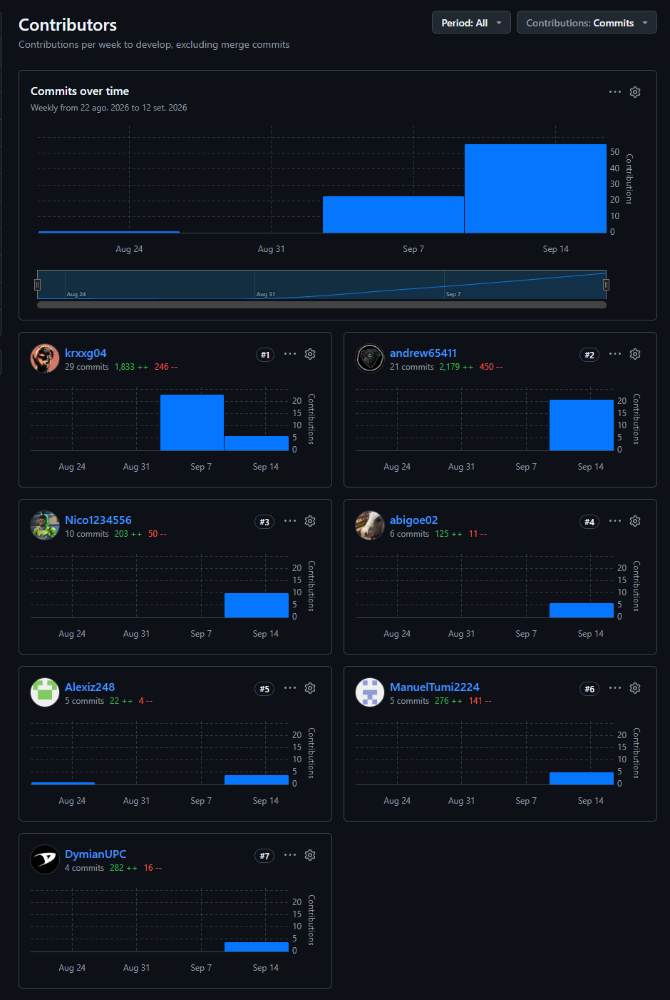
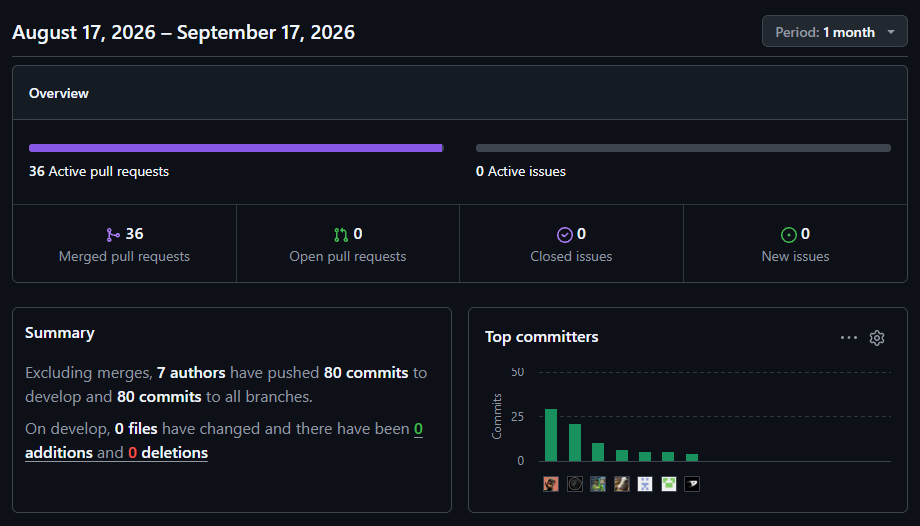
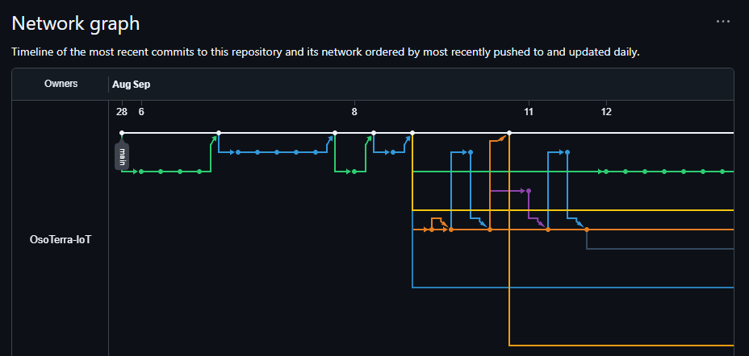
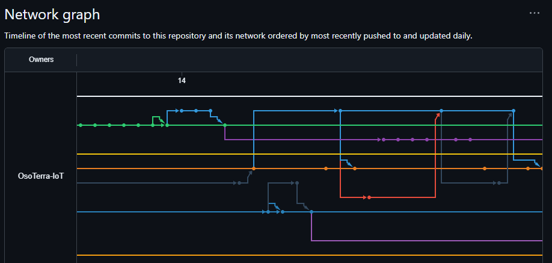
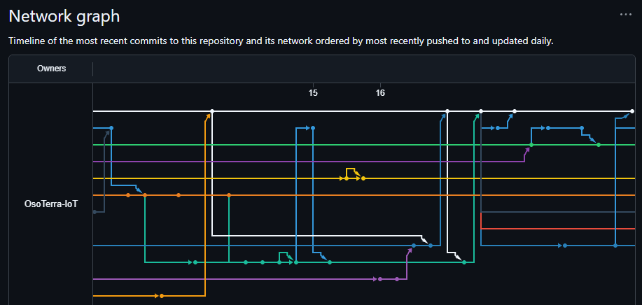
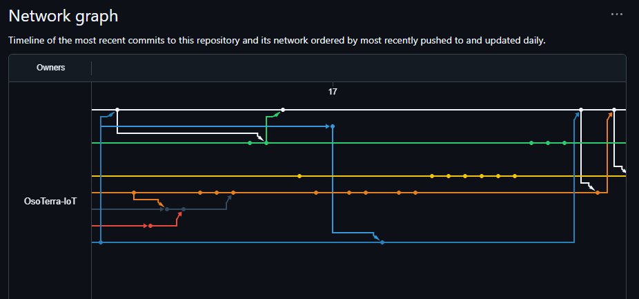
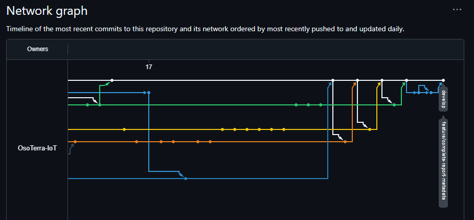

# Registro de Versiones del Informe

| Versión | Fecha | Autor | Descripción de modificación |
|---|---|---|---|
| 0.0.1 | 28/08/2026 | Encalada Salazar, Alexis | Creación inicial del repositorio del informe en GitHub. |
| 0.0.2 | 06/09/2026 | Iker Gabriel Barturen Panez | Estructuración inicial del informe de proyecto, incluyendo carátula, capítulos, conclusiones, bibliografía y anexos. |
| 0.0.3 | 06/09/2026 | Iker Gabriel Barturen Panez | Configuración de la carátula del informe con datos del curso, startup, producto e integrantes del equipo. |
| 0.0.4 | 06/09/2026 | Iker Gabriel Barturen Panez | Desarrollo de la descripción de la startup Oso Terra y actualización de los perfiles de integrantes en el Capítulo I. |
| 0.0.5 | 06/09/2026 | Iker Gabriel Barturen Panez | Desarrollo del perfil de la solución OsoSense y de los antecedentes de la problemática de salinización del suelo agrícola. |
| 0.0.6 | 06/09/2026 | Iker Gabriel Barturen Panez | Desarrollo del proceso Lean UX y del Problem Statement del proyecto OsoSense según el template Brand new initiative. |
| 0.0.7 | 06/09/2026 | Iker Gabriel Barturen Panez | Desarrollo de los Lean UX Assumptions y Hypothesis Statements del proyecto OsoSense. |
| 0.0.8 | 06/09/2026 | Iker Gabriel Barturen Panez | Consolidación del Lean UX Canvas del proyecto OsoSense. |
| 0.0.9 | 06/09/2026 | Iker Gabriel Barturen Panez | Redacción de los Segmentos objetivo con sustento estadístico (INEI, MIDAGRI, OSIPTEL, CIP, INIA). |
| 0.0.10 | 06/09/2026 | Iker Gabriel Barturen Panez | Incorporación de la figura del Lean UX Canvas del proyecto OsoSense en el Capítulo I. |
| 0.0.11 | 08/09/2026 | Iker Gabriel Barturen Panez | Desarrollo de la sección de competidores, análisis competitivo y estrategias frente a competidores en el Capítulo II. |
| 0.0.12 | 08/09/2026 | Iker Gabriel Barturen Panez | Desarrollo del Big Picture EventStorming del Capítulo II, incluyendo actores, eventos de dominio, eventos pivotales, puntos de dolor y oportunidades. |
| 0.0.13 | 08/09/2026 | Iker Gabriel Barturen Panez | Incorporación de la evidencia visual y enlace del board de FigJam para el Big Picture EventStorming del Capítulo II. |
| 0.0.14 | 08/09/2026 | Iker Gabriel Barturen Panez | Desarrollo del Ubiquitous Language del Capítulo II con términos del dominio agronómico y del negocio de OsoTerra IoT. |
| 0.0.15 | 08/09/2026 | Iker Gabriel Barturen Panez | Restauración del diseño de entrevistas para los dos segmentos objetivo en el Capítulo II. |
| 0.0.16 | 11/09/2026 | Iker Gabriel Barturen Panez | Incorporación de la estructura del registro de entrevistas para ambos segmentos y registro de la primera entrevista del segmento de ingenieros agrónomos y asesores técnicos agrícolas. |
| 0.0.17 | 12/09/2026 | Iker Gabriel Barturen Panez | Estructuración de la sección 4.2 del Capítulo IV para los 6 bounded contexts e incorporación de los Database Design Diagrams (ERD) en cada uno. |
| 0.0.18 | 13/09/2026 | Iker Gabriel Barturen Panez | Desarrollo completo del bounded context Identity and Access Management (4.2.1): capas de dominio, interfaz, aplicación e infraestructura, y Component/Class Diagrams. |
| 0.0.19 | 13/09/2026 | Iker Gabriel Barturen Panez | Desarrollo completo del bounded context Subscription and Billing (4.2.2): capas de dominio, interfaz, aplicación e infraestructura, y Component/Class Diagrams. |
| 0.0.20 | 13/09/2026 | Iker Gabriel Barturen Panez | Desarrollo completo del bounded context Farm Management (4.2.3): capas de dominio, interfaz, aplicación e infraestructura, y Component/Class Diagrams. |
| 0.0.21 | 13/09/2026 | Iker Gabriel Barturen Panez | Desarrollo completo del bounded context Soil Monitoring (4.2.4): capas de dominio, interfaz, aplicación e infraestructura, y Component/Class Diagrams. |
| 0.0.22 | 13/09/2026 | Iker Gabriel Barturen Panez | Desarrollo completo del bounded context Salinity Alerting (4.2.5): capas de dominio, interfaz, aplicación e infraestructura, y Component/Class Diagrams. |
| 0.0.23 | 13/09/2026 | Iker Gabriel Barturen Panez | Desarrollo completo del bounded context Analytics and Reporting (4.2.6): capas de dominio, interfaz, aplicación e infraestructura, y Component/Class Diagrams. Cierre de la sección 4.2 del Capítulo IV para los 6 bounded contexts. |
| 0.0.24 | 14/09/2026 | Andreow Jomark Santiago Peña | Desarrollo detallado del Big Picture EventStorming del Capítulo II en cinco etapas (Chaotic Exploration, Enforce the Timeline, People and External Systems, Problems and Opportunities, Pivotal Events and Emerging Boundaries), con figuras por etapa y enlace al board de FigJam. |
| 0.0.25 | 14/09/2026 | Iker Gabriel Barturen Panez | Incorporación de Google OAuth2 como método de inicio de sesión federado en Identity and Access Management, y renombramiento de la pasarela de pago genérica a Stripe en Subscription and Billing. |
| 0.0.26 | 14/09/2026 | Andreow Jomark Santiago Peña | Desarrollo de la introducción de la sección 4.1 y del Design-Level EventStorming (4.1.1) en doce carriles, con notación, pasos de la sesión, figuras por carril y resultados. |
| 0.0.27 | 14/09/2026 | Andreow Jomark Santiago Peña | Desarrollo del Candidate Context Discovery (4.1.1.1) con las técnicas start-with-value, look-for-pivotal-events y start-with-simple, iteraciones del EventStorm, figuras por contexto y tabla de bounded contexts candidatos. |
| 0.0.28 | 14/09/2026 | Andreow Jomark Santiago Peña | Desarrollo del Domain Message Flows Modeling (4.1.1.2) con Domain Storytelling en cuatro escenarios, notación, figuras y tablas de mensajes numerados. |
| 0.0.29 | 14/09/2026 | Andreow Jomark Santiago Peña | Desarrollo de los Bounded Context Canvases (4.1.1.3) para los seis bounded contexts, con el proceso iterativo, clasificación estratégica y design critique. |
| 0.0.30 | 14/09/2026 | Andreow Jomark Santiago Peña | Desarrollo del Context Mapping (4.1.2) con patrones de relación, tres alternativas evaluadas, mapa final, tabla de relaciones y justificación. |
| 0.0.31 | 14/09/2026 | Andreow Jomark Santiago Peña | Desarrollo del Software Architecture System Landscape Diagram (4.1.3.1) con proceso de elaboración, figura, elementos, relaciones y decisiones. |
| 0.0.32 | 14/09/2026 | Goñe Araccata, Esther Abigail | Corrección y ampliación de la información personal del perfil de integrante en el Capítulo I. |
| 0.0.33 | 14/09/2026 | Goñe Araccata, Esther Abigail | Incorporación de las fotografías de los integrantes del equipo en el Capítulo I. |
| 0.0.34 | 14/09/2026 | Goñe Araccata, Esther Abigail | Elaboración de los User Personas del Capítulo II en UXPressia. |
| 0.0.35 | 14/09/2026 | Tumi Oliden, Manuel Ignacio | Elaboración de los diagramas UML de bounded context del Capítulo IV. |
| 0.0.36 | 14/09/2026 | Encalada Salazar, Alexis | Subida de archivos de evidencia para el registro de entrevistas del Capítulo II. |
| 0.0.37 | 14/09/2026 | Encalada Salazar, Alexis | Registro de la segunda entrevista del segmento de ingenieros agrónomos y asesores técnicos en el Capítulo II. |
| 0.0.38 | 14/09/2026 | Encalada Salazar, Alexis | Corrección del nombre del archivo de captura de la segunda entrevista. |
| 0.0.39 | 14/09/2026 | Encalada Salazar, Alexis | Corrección de la extensión de un archivo de imagen en el Capítulo II. |
| 0.0.40 | 15/09/2026 | Goñe Araccata, Esther Abigail | Elaboración de los User Journey Maps del Capítulo II en UXPressia. |
| 0.0.41 | 15/09/2026 | Goñe Araccata, Esther Abigail | Elaboración del Impact Mapping del Capítulo III. |
| 0.0.42 | 16/09/2026 | Victor Nicolas Ortiz Alarcon | Actualización de las imágenes de perfiles de integrantes en el Capítulo I, incluyendo el ajuste de tamaño uniforme para las fotografías. |
| 0.0.43 | 16/09/2026 | Victor Nicolas Ortiz Alarcon | Corrección de los Lean UX Hypothesis Statements del Capítulo I según la estructura solicitada en el statement del proyecto. |
| 0.0.44 | 16/09/2026 | Alvaro Fabrizzio Salazar Caballero | Actualización de la figura del Lean UX Canvas e incorporación de la fotografía de perfil en el Capítulo I. |
| 0.0.45 | 16/09/2026 | Alvaro Fabrizzio Salazar Caballero | Aplicación de la técnica 5W + 2H en la sección 1.2.1 y ampliación de los segmentos objetivo de la sección 1.3 con sustento estadístico. |
| 0.0.46 | 16/09/2026 | Tumi Oliden, Manuel Ignacio | Reversión de los diagramas UML de bounded context tras detectar inconsistencias, para su posterior corrección. |
| 0.0.47 | 16/09/2026 | Tumi Oliden, Manuel Ignacio | Incorporación de los diagramas C4 de contexto, contenedores y despliegue en el Capítulo IV. |
| 0.0.48 | 16/09/2026 | Tumi Oliden, Manuel Ignacio | Limpieza de comentarios innecesarios en la documentación de arquitectura del Capítulo IV. |
| 0.0.49 | 16/09/2026 | Tumi Oliden, Manuel Ignacio | Registro de la tercera entrevista del segmento de ingenieros agrónomos y asesores técnicos en el Capítulo II. |
| 0.0.50 | 17/09/2026 | Andreow Jomark Santiago Peña | Registro de la segunda entrevista del segmento de pequeños y medianos productores agropecuarios (Mathias Peña, Ferreñafe, Lambayeque) en el Capítulo II, con screenshot y resumen. |
| 0.0.51 | 17/09/2026 | Andreow Jomark Santiago Peña | Registro de la tercera entrevista del segmento de pequeños y medianos productores agropecuarios (Alex Ávila, Salas Guadalupe, Ica) en el Capítulo II, con screenshot y resumen. |
| 0.0.52 | 17/09/2026 | Andreow Jomark Santiago Peña | Desarrollo del análisis de entrevistas del Capítulo II por segmento, con porcentajes de características objetivas y subjetivas, diez gráficos, tablas resumen y comparación entre segmentos. |
| 0.0.53 | 17/09/2026 | Andreow Jomark Santiago Peña | Actualización de las imágenes de los tres Impact Maps del Capítulo III en UXPressia, con User Stories trazables por ID, nombres completos de las User Personas y porcentajes con formato uniforme. |
| 0.0.54 | 17/09/2026 | Andreow Jomark Santiago Peña | Reestructuración del Capítulo III según las reglas de redacción: épicas y User Stories en una sola tabla, títulos en infinitivo, descripciones con quiero, al menos dos escenarios Gherkin por User Story, Impact Mapping con trazabilidad por ID y Product Backlog con introducción, enlace y escala de Story Points. |
| 0.0.55 | 17/09/2026 | Andreow Jomark Santiago Peña | Ampliación de los tres Impact Maps del Capítulo III con más impactos y Deliverables por User Persona, e incorporación de tres User Stories derivadas de las entrevistas (invitar a un familiar, consultar la acción recomendada y compartir alertas por WhatsApp), con renumeración y actualización del Product Backlog. |
| 0.0.56 | 17/09/2026 | Andreow Jomark Santiago Peña | Ajuste de las descripciones de épicas y User Stories del Capítulo III al formato "Como... deseo... para..." del enunciado, en la tabla, el Impact Mapping y el Product Backlog. |
| 0.0.57 | 17/09/2026 | Andreow Jomark Santiago Peña | Registro del Product Backlog de OsoSense en Trello con las 55 User Stories, captura del tablero y enlace público en el Capítulo III. |
| 0.0.58 | 17/09/2026 | Andreow Jomark Santiago Peña | Incorporación del Component Level Diagram del container Edge Service para el bounded context Soil Monitoring en el Capítulo IV, con la descripción de sus componentes. |
| 0.0.59 | 17/09/2026 | Andreow Jomark Santiago Peña | Documentación de la capa de dominio de los seis bounded contexts del Capítulo IV a manera de diccionario, con atributos, métodos, visibilidad y relaciones entre clases. |
| 0.0.60 | 17/09/2026 | Andreow Jomark Santiago Peña | Incorporación de Event Consumers en Interface Layer y Event Handlers en Application Layer para los bounded contexts del Capítulo IV, alineados con los eventos del Context Mapping. |
| 0.0.61 | 17/09/2026 | Iker Gabriel Barturen Panez | Completar la Tabla de Contenidos, la sección Student Outcome, Project Report Collaboration Insights, y el avance de Conclusiones, Bibliografía y Anexos requeridos para la entrega AV1. |
| 0.0.62 | 18/09/2026 | Andreow Jomark Santiago Peña | Corrección de términos y referencias del Capítulo IV: carácter extraño en la introducción del C4 Model, término "librería", rutas a código fuente inexistentes y nota obsoleta sobre el ERD de IAM. |
| 0.0.63 | 18/09/2026 | Andreow Jomark Santiago Peña | Capítulo I: incorporación del enunciado del problema, puntos clave, objetivos y restricciones en Antecedentes y problemática; códigos HS-01 a HS-12 en los Hypothesis Statements; Lean UX Canvas con los siete Business Outcomes; imágenes de integrantes alojadas en el repositorio. |

# Project Report Collaboration Insights

**URL del repositorio del informe:** https://github.com/OsoTerra-IoT/OsoTerra---Project-Report

**Organización de GitHub del equipo:** https://github.com/OsoTerra-IoT

## Actividades de elaboración del informe — AV1

El informe se elabora de forma colaborativa en Markdown sobre el repositorio anterior, organizado en un archivo por capítulo dentro de `chapters/` y una carpeta `assets/` con una subcarpeta por tipo de artefacto (entrevistas, user personas, diagramas, etc.).

Para la gestión de versiones el equipo aplica **GitFlow**: `develop` integra el trabajo en curso y cada sección del informe se desarrolla en su propia rama `feature/*`, que se fusiona a `develop` mediante pull request tras su revisión. Los mensajes de commit siguen **Conventional Commits**, principalmente con el tipo `docs:` por tratarse de documentación.

## Pull Requests fusionados a develop — AV1

A la fecha de esta entrega se han abierto 39 pull requests. El resumen Pulse de GitHub confirma 36 pull requests fusionados a `develop` (ver Figura 2); los 3 restantes (#15, #18 y #33) se cerraron sin fusionar y por eso no aparecen en la tabla:

| PR | Rama | Autor de la fusión | Fecha |
|---|---|---|---|
| #1 | `feature/create-report-structure` | Barturen Panez, Iker Gabriel | 06/09/2026 |
| #2 | `feature/add-chapter-1-introduction` | Barturen Panez, Iker Gabriel | 06/09/2026 |
| #3 | `feature/interview-design` | Barturen Panez, Iker Gabriel | 08/09/2026 |
| #4 | `feature/competitor-analysis` | Barturen Panez, Iker Gabriel | 08/09/2026 |
| #5 | `feature/big-picture-eventstorming` | Barturen Panez, Iker Gabriel | 08/09/2026 |
| #6 | `feature/ubiquitous-language` | Barturen Panez, Iker Gabriel | 08/09/2026 |
| #7 | `feature/chapter-2` | Barturen Panez, Iker Gabriel | 08/09/2026 |
| #8 | `feature/interview-1-transcription` | Barturen Panez, Iker Gabriel | 11/09/2026 |
| #9 | `feature/competitor-logos` | Barturen Panez, Iker Gabriel | 11/09/2026 |
| #10 | `feature/database-design-erd` | Barturen Panez, Iker Gabriel | 12/09/2026 |
| #11 | `feature/external-services-integration` | Barturen Panez, Iker Gabriel | 14/09/2026 |
| #12 | `feature/chapter-2-user-persona` | Goñe Araccata, Esther Abigail | 14/09/2026 |
| #13 | `feature/chapter-1-abiinfo` | Goñe Araccata, Esther Abigail | 14/09/2026 |
| #14 | `feature/chapter-1-photos` | Goñe Araccata, Esther Abigail | 14/09/2026 |
| #16 | `feature/chapter-2-persona-1` | Barturen Panez, Iker Gabriel | 14/09/2026 |
| #17 | `feature/chapter-2-persona-1-image` | Ortiz Alarcon, Victor Nicolas | 14/09/2026 |
| #19 | `feature/UML_Diagrams` | Tumi Oliden, Manuel Ignacio | 14/09/2026 |
| #20 | `feature/Interview` | Encalada Salazar, Alexis | 14/09/2026 |
| #21 | `feature/chapter-2-user-journey-mapping` | Goñe Araccata, Esther Abigail | 15/09/2026 |
| #22 | `feature/chapter-3-impact-mapping` | Goñe Araccata, Esther Abigail | 15/09/2026 |
| #23 | `feature/chapter-1-member-profile` | Barturen Panez, Iker Gabriel | 16/09/2026 |
| #24 | `feature/chapter-1` | Barturen Panez, Iker Gabriel | 16/09/2026 |
| #25 | `feature/chapter-2` | Barturen Panez, Iker Gabriel | 16/09/2026 |
| #26 | `revert-19-feature/UML_Diagrams` | Tumi Oliden, Manuel Ignacio | 16/09/2026 |
| #27 | `feature/software-architecture-views` | Tumi Oliden, Manuel Ignacio | 16/09/2026 |
| #28 | `feature/chapter-1` | Salazar Caballero, Alvaro Fabrizzio | 16/09/2026 |
| #29 | `feature/chapter-2` | Ortiz Alarcon, Victor Nicolas | 16/09/2026 |
| #30 | `feature/chapter-2-entrevista-3-seg2` | Tumi Oliden, Manuel Ignacio | 16/09/2026 |
| #31 | `feature/chapter-4` | Salazar Caballero, Alvaro Fabrizzio | 16/09/2026 |
| #32 | `feature/chapter-1-fix-content` | Goñe Araccata, Esther Abigail | 17/09/2026 |
| #34 | `feature/chapter-1` | Barturen Panez, Iker Gabriel | 17/09/2026 |
| #35 | `feature/chapter-2` | Barturen Panez, Iker Gabriel | 17/09/2026 |
| #36 | `feature/chapter-3` | Barturen Panez, Iker Gabriel | 17/09/2026 |
| #37 | `feature/chapter-4` | Barturen Panez, Iker Gabriel | 17/09/2026 |
| #38 | `feature/user-task-matrix` | Barturen Panez, Iker Gabriel | 17/09/2026 |
| #39 | `feature/chapter-2` | Barturen Panez, Iker Gabriel | 17/09/2026 |

## Analíticos de colaboración — AV1

Según el gráfico de Contributors de GitHub (que excluye commits de merge y mide solo lo integrado a `develop`), el repositorio registra 80 commits de los siete integrantes del equipo:

| Integrante | Usuario de GitHub | Commits a develop | Líneas añadidas | Líneas eliminadas |
|---|---|---|---|---|
| Barturen Panez, Iker Gabriel | krxxg04 | 29 | 1 833 | 246 |
| Santiago Peña, Andreow Jomark | andrew65411 | 21 | 2 179 | 450 |
| Ortiz Alarcon, Victor Nicolas | Nico1234556 | 10 | 203 | 50 |
| Goñe Araccata, Esther Abigail | abigoe02 | 6 | 125 | 11 |
| Tumi Oliden, Manuel Ignacio | ManuelTumi2224 | 5 | 276 | 141 |
| Encalada Salazar, Alexis | Alexiz248 | 5 | 22 | 4 |
| Salazar Caballero, Alvaro Fabrizzio | DymianUPC | 4 | 282 | 16 |

La distribución confirma que los siete integrantes contribuyeron directamente a `develop`. Barturen Panez y Santiago Peña concentran el mayor número de commits porque, además de redactar sus propias secciones (Capítulo I y el Tactical-Level DDD del Capítulo IV el primero; el Big Picture y Design-Level EventStorming y el Capítulo III el segundo), fusionaron e integraron el trabajo de otros integrantes antes de cada pull request. El volumen alto de líneas añadidas de Tumi Oliden y Salazar Caballero, pese a tener pocos commits, corresponde a la incorporación puntual de diagramas y figuras de gran tamaño (UML, arquitectura de software, Lean UX Canvas) en un solo commit.

<em>Figura 1. Commits por integrante a lo largo del tiempo — AV1 (GitHub Insights &gt; Contributors).</em>

<em>Figura 2. Resumen de actividad del repositorio (Pulse) — AV1: 36 pull requests fusionados, 80 commits a develop entre los siete integrantes.</em>

<em>Figura 3. Network graph del repositorio, en cinco tramos — AV1: ramas `feature/*` abiertas desde `develop` y fusionadas de vuelta mediante pull request.</em>

