

# Registro de Versiones del Informe

| Versión | Fecha | Autor | Descripción de modificación |
|---|---|---|---|
| 0.0.1 | 28/08/2026 | Encalada Salazar, Alexis | Creación inicial del repositorio del informe en GitHub. |
| 0.0.2 | 06/09/2026 | Iker Gabriel Barturen Panez | Estructuración inicial del informe de proyecto, incluyendo carátula, capítulos, conclusiones, bibliografía y anexos. |
| 0.0.3 | 06/09/2026 | Iker Gabriel Barturen Panez | Configuración de la carátula del informe con datos del curso, startup, producto e integrantes del equipo. |
| 0.0.4 | 06/09/2026 | Iker Gabriel Barturen Panez | Desarrollo de la descripción de la startup Oso Terra y actualización de los perfiles de integrantes en el Capítulo I. |
| 0.0.5 | 06/09/2026 | Iker Gabriel Barturen Panez | Desarrollo del perfil de la solución OsoSense y de los antecedentes de la problemática de salinización del suelo agrícola. |
| 0.0.6 | 06/09/2026 | Iker Gabriel Barturen Panez | Desarrollo del proceso Lean UX y del Problem Statement del proyecto OsoSense según el template Brand new initiative. |
| 0.0.7 | 06/09/2026 | Iker Gabriel Barturen Panez | Desarrollo de los Lean UX Assumptions y Hypothesis Statements del proyecto OsoSense. |
| 0.0.8 | 06/09/2026 | Iker Gabriel Barturen Panez | Consolidación del Lean UX Canvas del proyecto OsoSense. |
| 0.0.9 | 06/09/2026 | Iker Gabriel Barturen Panez | Redacción de los Segmentos objetivo con sustento estadístico (INEI, MIDAGRI, OSIPTEL, CIP, INIA). |
| 0.0.10 | 06/09/2026 | Iker Gabriel Barturen Panez | Incorporación de la figura del Lean UX Canvas del proyecto OsoSense en el Capítulo I. |
| 0.0.11 | 08/09/2026 | Iker Gabriel Barturen Panez | Desarrollo de la sección de competidores, análisis competitivo y estrategias frente a competidores en el Capítulo II. |
| 0.0.12 | 08/09/2026 | Iker Gabriel Barturen Panez | Desarrollo del Big Picture EventStorming del Capítulo II, incluyendo actores, eventos de dominio, eventos pivotales, puntos de dolor y oportunidades. |
| 0.0.13 | 08/09/2026 | Iker Gabriel Barturen Panez | Incorporación de la evidencia visual y enlace del board de FigJam para el Big Picture EventStorming del Capítulo II. |
| 0.0.14 | 08/09/2026 | Iker Gabriel Barturen Panez | Desarrollo del Ubiquitous Language del Capítulo II con términos del dominio agronómico y del negocio de OsoTerra IoT. |
| 0.0.15 | 08/09/2026 | Iker Gabriel Barturen Panez | Restauración del diseño de entrevistas para los dos segmentos objetivo en el Capítulo II. |
| 0.0.16 | 11/09/2026 | Iker Gabriel Barturen Panez | Incorporación de la estructura del registro de entrevistas para ambos segmentos y registro de la primera entrevista del segmento de ingenieros agrónomos y asesores técnicos agrícolas. |
| 0.0.17 | 12/09/2026 | Iker Gabriel Barturen Panez | Estructuración de la sección 4.2 del Capítulo IV para los 6 bounded contexts e incorporación de los Database Design Diagrams (ERD) en cada uno. |
| 0.0.18 | 13/09/2026 | Iker Gabriel Barturen Panez | Desarrollo completo del bounded context Identity and Access Management (4.2.1): capas de dominio, interfaz, aplicación e infraestructura, y Component/Class Diagrams. |
| 0.0.19 | 13/09/2026 | Iker Gabriel Barturen Panez | Desarrollo completo del bounded context Subscription and Billing (4.2.2): capas de dominio, interfaz, aplicación e infraestructura, y Component/Class Diagrams. |
| 0.0.20 | 13/09/2026 | Iker Gabriel Barturen Panez | Desarrollo completo del bounded context Farm Management (4.2.3): capas de dominio, interfaz, aplicación e infraestructura, y Component/Class Diagrams. |
| 0.0.21 | 13/09/2026 | Iker Gabriel Barturen Panez | Desarrollo completo del bounded context Soil Monitoring (4.2.4): capas de dominio, interfaz, aplicación e infraestructura, y Component/Class Diagrams. |
| 0.0.22 | 13/09/2026 | Iker Gabriel Barturen Panez | Desarrollo completo del bounded context Salinity Alerting (4.2.5): capas de dominio, interfaz, aplicación e infraestructura, y Component/Class Diagrams. |
| 0.0.23 | 13/09/2026 | Iker Gabriel Barturen Panez | Desarrollo completo del bounded context Analytics and Reporting (4.2.6): capas de dominio, interfaz, aplicación e infraestructura, y Component/Class Diagrams. Cierre de la sección 4.2 del Capítulo IV para los 6 bounded contexts. |
| 0.0.24 | 14/09/2026 | Andreow Jomark Santiago Peña | Desarrollo detallado del Big Picture EventStorming del Capítulo II en cinco etapas (Chaotic Exploration, Enforce the Timeline, People and External Systems, Problems and Opportunities, Pivotal Events and Emerging Boundaries), con figuras por etapa y enlace al board de FigJam. |
| 0.0.25 | 14/09/2026 | Iker Gabriel Barturen Panez | Incorporación de Google OAuth2 como método de inicio de sesión federado en Identity and Access Management, y renombramiento de la pasarela de pago genérica a Stripe en Subscription and Billing. |
| 0.0.26 | 14/09/2026 | Andreow Jomark Santiago Peña | Desarrollo de la introducción de la sección 4.1 y del Design-Level EventStorming (4.1.1) en doce carriles, con notación, pasos de la sesión, figuras por carril y resultados. |
| 0.0.27 | 14/09/2026 | Andreow Jomark Santiago Peña | Desarrollo del Candidate Context Discovery (4.1.1.1) con las técnicas start-with-value, look-for-pivotal-events y start-with-simple, iteraciones del EventStorm, figuras por contexto y tabla de bounded contexts candidatos. |
| 0.0.28 | 14/09/2026 | Andreow Jomark Santiago Peña | Desarrollo del Domain Message Flows Modeling (4.1.1.2) con Domain Storytelling en cuatro escenarios, notación, figuras y tablas de mensajes numerados. |
| 0.0.29 | 14/09/2026 | Andreow Jomark Santiago Peña | Desarrollo de los Bounded Context Canvases (4.1.1.3) para los seis bounded contexts, con el proceso iterativo, clasificación estratégica y design critique. |
| 0.0.30 | 14/09/2026 | Andreow Jomark Santiago Peña | Desarrollo del Context Mapping (4.1.2) con patrones de relación, tres alternativas evaluadas, mapa final, tabla de relaciones y justificación. |
| 0.0.31 | 14/09/2026 | Andreow Jomark Santiago Peña | Desarrollo del Software Architecture System Landscape Diagram (4.1.3.1) con proceso de elaboración, figura, elementos, relaciones y decisiones. |
| 0.0.32 | 14/09/2026 | Goñe Araccata, Esther Abigail | Corrección y ampliación de la información personal del perfil de integrante en el Capítulo I. |
| 0.0.33 | 14/09/2026 | Goñe Araccata, Esther Abigail | Incorporación de las fotografías de los integrantes del equipo en el Capítulo I. |
| 0.0.34 | 14/09/2026 | Goñe Araccata, Esther Abigail | Elaboración de los User Personas del Capítulo II en UXPressia. |
| 0.0.35 | 14/09/2026 | Tumi Oliden, Manuel Ignacio | Elaboración de los diagramas UML de bounded context del Capítulo IV. |
| 0.0.36 | 14/09/2026 | Encalada Salazar, Alexis | Subida de archivos de evidencia para el registro de entrevistas del Capítulo II. |
| 0.0.37 | 14/09/2026 | Encalada Salazar, Alexis | Registro de la segunda entrevista del segmento de ingenieros agrónomos y asesores técnicos en el Capítulo II. |
| 0.0.38 | 14/09/2026 | Encalada Salazar, Alexis | Corrección del nombre del archivo de captura de la segunda entrevista. |
| 0.0.39 | 14/09/2026 | Encalada Salazar, Alexis | Corrección de la extensión de un archivo de imagen en el Capítulo II. |
| 0.0.40 | 15/09/2026 | Goñe Araccata, Esther Abigail | Elaboración de los User Journey Maps del Capítulo II en UXPressia. |
| 0.0.41 | 15/09/2026 | Goñe Araccata, Esther Abigail | Elaboración del Impact Mapping del Capítulo III. |
| 0.0.42 | 16/09/2026 | Victor Nicolas Ortiz Alarcon | Actualización de las imágenes de perfiles de integrantes en el Capítulo I, incluyendo el ajuste de tamaño uniforme para las fotografías. |
| 0.0.43 | 16/09/2026 | Victor Nicolas Ortiz Alarcon | Corrección de los Lean UX Hypothesis Statements del Capítulo I según la estructura solicitada en el statement del proyecto. |
| 0.0.44 | 16/09/2026 | Alvaro Fabrizzio Salazar Caballero | Actualización de la figura del Lean UX Canvas e incorporación de la fotografía de perfil en el Capítulo I. |
| 0.0.45 | 16/09/2026 | Alvaro Fabrizzio Salazar Caballero | Aplicación de la técnica 5W + 2H en la sección 1.2.1 y ampliación de los segmentos objetivo de la sección 1.3 con sustento estadístico. |
| 0.0.46 | 16/09/2026 | Tumi Oliden, Manuel Ignacio | Reversión de los diagramas UML de bounded context tras detectar inconsistencias, para su posterior corrección. |
| 0.0.47 | 16/09/2026 | Tumi Oliden, Manuel Ignacio | Incorporación de los diagramas C4 de contexto, contenedores y despliegue en el Capítulo IV. |
| 0.0.48 | 16/09/2026 | Tumi Oliden, Manuel Ignacio | Limpieza de comentarios innecesarios en la documentación de arquitectura del Capítulo IV. |
| 0.0.49 | 16/09/2026 | Tumi Oliden, Manuel Ignacio | Registro de la tercera entrevista del segmento de ingenieros agrónomos y asesores técnicos en el Capítulo II. |
| 0.0.50 | 17/09/2026 | Andreow Jomark Santiago Peña | Registro de la segunda entrevista del segmento de pequeños y medianos productores agropecuarios (Mathias Peña, Ferreñafe, Lambayeque) en el Capítulo II, con screenshot y resumen. |
| 0.0.51 | 17/09/2026 | Andreow Jomark Santiago Peña | Registro de la tercera entrevista del segmento de pequeños y medianos productores agropecuarios (Alex Ávila, Salas Guadalupe, Ica) en el Capítulo II, con screenshot y resumen. |
| 0.0.52 | 17/09/2026 | Andreow Jomark Santiago Peña | Desarrollo del análisis de entrevistas del Capítulo II por segmento, con porcentajes de características objetivas y subjetivas, diez gráficos, tablas resumen y comparación entre segmentos. |
| 0.0.53 | 17/09/2026 | Andreow Jomark Santiago Peña | Actualización de las imágenes de los tres Impact Maps del Capítulo III en UXPressia, con User Stories trazables por ID, nombres completos de las User Personas y porcentajes con formato uniforme. |
| 0.0.54 | 17/09/2026 | Andreow Jomark Santiago Peña | Reestructuración del Capítulo III según las reglas de redacción: épicas y User Stories en una sola tabla, títulos en infinitivo, descripciones con quiero, al menos dos escenarios Gherkin por User Story, Impact Mapping con trazabilidad por ID y Product Backlog con introducción, enlace y escala de Story Points. |
| 0.0.55 | 17/09/2026 | Andreow Jomark Santiago Peña | Ampliación de los tres Impact Maps del Capítulo III con más impactos y Deliverables por User Persona, e incorporación de tres User Stories derivadas de las entrevistas (invitar a un familiar, consultar la acción recomendada y compartir alertas por WhatsApp), con renumeración y actualización del Product Backlog. |
| 0.0.56 | 17/09/2026 | Andreow Jomark Santiago Peña | Ajuste de las descripciones de épicas y User Stories del Capítulo III al formato "Como... deseo... para..." del enunciado, en la tabla, el Impact Mapping y el Product Backlog. |
| 0.0.57 | 17/09/2026 | Andreow Jomark Santiago Peña | Registro del Product Backlog de OsoSense en Trello con las 55 User Stories, captura del tablero y enlace público en el Capítulo III. |
| 0.0.58 | 17/09/2026 | Andreow Jomark Santiago Peña | Incorporación del Component Level Diagram del container Edge Service para el bounded context Soil Monitoring en el Capítulo IV, con la descripción de sus componentes. |
| 0.0.59 | 17/09/2026 | Andreow Jomark Santiago Peña | Documentación de la capa de dominio de los seis bounded contexts del Capítulo IV a manera de diccionario, con atributos, métodos, visibilidad y relaciones entre clases. |
| 0.0.60 | 17/09/2026 | Andreow Jomark Santiago Peña | Incorporación de Event Consumers en Interface Layer y Event Handlers en Application Layer para los bounded contexts del Capítulo IV, alineados con los eventos del Context Mapping. |
| 0.0.61 | 17/09/2026 | Iker Gabriel Barturen Panez | Completar la Tabla de Contenidos, la sección Student Outcome, Project Report Collaboration Insights, y el avance de Conclusiones, Bibliografía y Anexos requeridos para la entrega AV1. |
| 0.0.62 | 18/09/2026 | Andreow Jomark Santiago Peña | Corrección de términos y referencias del Capítulo IV: carácter extraño en la introducción del C4 Model, término "librería", rutas a código fuente inexistentes y nota obsoleta sobre el ERD de IAM. |
| 0.0.63 | 18/09/2026 | Andreow Jomark Santiago Peña | Capítulo I: incorporación del enunciado del problema, puntos clave, objetivos y restricciones en Antecedentes y problemática; códigos HS-01 a HS-12 en los Hypothesis Statements; Lean UX Canvas con los siete Business Outcomes; imágenes de integrantes alojadas en el repositorio. |
| 0.0.64 | 18/09/2026 | Andreow Jomark Santiago Peña | Carátula: logo de la universidad alojado en el repositorio en lugar de un enlace a un repositorio externo. |
| 0.0.65 | 18/09/2026 | Andreow Jomark Santiago Peña | Capítulo II: preguntas complementarias en la guía de entrevistas; distrito de la entrevista 2 del segmento 2; género y ubicación en el análisis de entrevistas y contraste con el perfil del Capítulo I; relación de los User Personas con el análisis de competidores; etapas nombradas en los User Journey Maps alojados en el repositorio; proceso de elaboración de los Empathy Maps; corrección de fichas de User Persona y del glosario; nombre del producto unificado como OsoSense. |
| 0.0.66 | 18/09/2026 | Andreow Jomark Santiago Peña | Conclusiones: cifras alineadas con el análisis de entrevistas, referencia correcta a las Feature Assumptions y corrección del género de los asesores entrevistados. |
| 0.0.67 | 18/09/2026 | Andreow Jomark Santiago Peña | Student Outcome: párrafo introductorio idéntico al del enunciado. |
| 0.0.68 | 18/09/2026 | Andreow Jomark Santiago Peña | Capítulo IV: nombre del producto unificado como OsoSense. |
| 0.0.69 | 18/09/2026 | Andreow Jomark Santiago Peña | Capítulo I: citas de fuente para las cifras de 5W+2H y de segmentos objetivo; corrección de cifras no verificables (unidades de hasta 5 ha, pobreza rural, acceso a internet rural, precios de sondas y laboratorios); Lean UX Canvas actualizado con las cifras corregidas. |
| 0.0.70 | 18/09/2026 | Andreow Jomark Santiago Peña | Bibliografía: referencias en formato APA 7 ordenadas alfabéticamente, con URL o DOI, para todas las fuentes citadas en los Capítulos I y II. |
| 0.0.71 | 18/09/2026 | Andreow Jomark Santiago Peña | Capítulo II: precios referenciales de OsoSense en validación en el Competitive Analysis Landscape; precios de competidores con fuente; distritos de residencia de los asesores entrevistados y su análisis; cifras alineadas con el Capítulo I. |
| 0.0.72 | 18/09/2026 | Andreow Jomark Santiago Peña | Capítulo I: descripciones de los integrantes con los conocimientos técnicos y habilidades que cada uno aporta al equipo. |
| 0.0.73 | 18/09/2026 | Andreow Jomark Santiago Peña | Capítulo II: títulos descriptivos en los User Journey Maps y Empathy Maps exportados de UXPressia. |
| 0.0.74 | 18/09/2026 | Alexis Encalada Salazar | Capítulo II: enlace único del video de entrevistas de needfinding con el timing de inicio y la duración de cada una de las seis entrevistas. |
| 0.0.75 | 18/09/2026 | Alexis Encalada Salazar | Anexos: enlace del video de exposición de AV1 en el Anexo C. |
| 0.0.76 | 20/09/2026 | Andreow Jomark Santiago Peña | Capítulo V: sección 5.1.1 General Style Guidelines (principios de diseño, branding, colores, tipografía, espaciado, iconografía y tono de comunicación) con ocho tableros de referencia. |
| 0.0.77 | 20/09/2026 | Andreow Jomark Santiago Peña | Capítulo V: sección 5.1.2 Web, Mobile and IoT Style Guidelines (componentes web, responsive y Landing Page, Android, interfaz física del dispositivo, visualización de datos, accesibilidad, i18n y movimiento) con seis tableros de referencia. |
| 0.0.78 | 23/09/2026 | Andreow Jomark Santiago Peña | Capítulo V: sección 5.3.1 Landing Page Wireframe (wireframes Desktop y Mobile Web Browser con principios, diseño inclusivo y arquitectura de información). |
| 0.0.79 | 23/09/2026 | Andreow Jomark Santiago Peña | Capítulo V: sección 5.3.2 Landing Page Mock-up (Design System, mock-ups Desktop y Mobile Web Browser y contraste WCAG). |
| 0.0.80 | 23/09/2026 | Andreow Jomark Santiago Peña | Capítulo V: sección 5.1 Style Guidelines actualizada a los tokens del Landing Page (verde esmeralda, neutros y Plus Jakarta Sans), con 19 figuras sin rótulos explicadas en el texto; renumeración de figuras de la 5.3. |
| 0.0.81 | 23/09/2026 | Andreow Jomark Santiago Peña | Capítulo V: sección 5.1 Style Guidelines rehecha en Figma con 46 figuras por tema (marca, color, tipografía y espacio, íconos y componentes, mobile e IoT, datos y accesibilidad), valores anotados y explicación en el texto. |
| 0.0.82 | 23/09/2026 | Andreow Jomark Santiago Peña | Capítulo V: sección 5.3 Landing Page Mock-up actualizada con los botones en `#047857` y renumeración de figuras. |
| 0.0.83 | 23/09/2026 | Andreow Jomark Santiago Peña | Capítulo V: sección 5.2 Information Architecture del Landing Page (organization, labeling, SEO y meta tags, searching y navigation systems) con nueve diagramas en Figma; enlaces de Figma por página en 5.1 y 5.3. |
| 0.0.84 | 25/09/2026 | Andreow Jomark Santiago Peña | Capítulo V: sección 5.1 con umbrales reales de palto, uva de mesa y arándano (tabla con fuentes), figuras de estados, app Android, notificaciones y gráficos actualizadas, y estado real de la Web App; bibliografía con tres fuentes nuevas. |
| 0.0.85 | 28/09/2026 | Andreow Jomark Santiago Peña | Capítulo IV: C4 Model corregido según la retroalimentación del AV1. OsoSense como un único sistema (Edge Service y Embedded Application dentro), el Soil Sensing Hardware como único elemento externo, un solo Container Diagram con el flujo API, Edge, Embedded y hardware, justificación del monolito modular y fuente en Structurizr DSL. |
| 0.0.86 | 28/09/2026 | Andreow Jomark Santiago Peña | Capítulo III: Technical Stories separadas de las User Stories en una tabla propia, renombradas de US46–US55 a TS01–TS10, y Product Backlog actualizado con los nuevos identificadores. |
| 0.0.87 | 28/09/2026 | Andreow Jomark Santiago Peña | Maquetación según la retroalimentación del AV1: carátula compactada en una sola página, y salto de página antes del Registro de Versiones, Collaboration Insights, Student Outcome, contenido, cada capítulo, bibliografía y anexos. |
| 0.0.88 | 28/09/2026 | Andreow Jomark Santiago Peña | Capítulo V: sección 5.2 Information Architecture completada para la Web App y la Mobile App (mapas de navegación por rol, organización, etiquetado, SEO por vista, ASO para Google Play, búsqueda con filtros y navegación) y enlaces del Landing Page actualizados a la Web App desplegada. |
| 0.0.89 | 28/09/2026 | Andreow Jomark Santiago Peña | Capítulo V: sección 5.4 Applications UX/UI Design con user goals de Diego Ramos y María Fernanda Salazar, 22 wireframes, 8 wireflows, Design System de las aplicaciones, mock-ups de la Web App y la Mobile App basados en el rediseño, y 8 user flows con happy y unhappy paths (Figma y FigJam). |
| 0.0.90 | 28/09/2026 | Andreow Jomark Santiago Peña | Capítulo V: secciones 5.5 Applications Prototyping (prototipos navegables en Figma para Web y Mobile) y 5.6 IoT Device Design (vistas acotadas, componentes, diagrama de bloques y circuito en Wokwi con sus archivos). |
| 0.0.91 | 28/09/2026 | Andreow Jomark Santiago Peña | Capítulo II: tablas del análisis competitivo con anchos de columna fijos y filas que no se parten entre páginas, para que se conserven al convertir el informe a PDF (retroalimentación del AV1). |
| 0.0.92 | 28/09/2026 | Andreow Jomark Santiago Peña | Capítulo VI: sección 6.1 Software Configuration Management (herramientas por actividad, repositorios, GitFlow, Semantic Versioning, Conventional Commits, guías de estilo por lenguaje y configuración de despliegue de cada producto). |
| 0.0.93 | 28/09/2026 | Andreow Jomark Santiago Peña | Capítulo VI: sección 6.2.1.1 Sprint Planning 1 (fecha, asistentes, Sprint Goal con el template de Scrum.org, velocidad y Story Points). |
| 0.0.94 | 28/09/2026 | Andreow Jomark Santiago Peña | Capítulo VI: sección 6.2.1.2 Aspect Leaders and Collaborators con la matriz de líderes y colaboradores del Sprint 1. |
| 0.0.95 | 28/09/2026 | Andreow Jomark Santiago Peña | Capítulo VI: sección 6.2.1.3 Sprint Backlog 1 con las User Stories del sprint y sus tareas. |
| 0.0.96 | 28/09/2026 | Andreow Jomark Santiago Peña | Capítulo VI: sección 6.2.1.4 Development Evidence con los commits de implementación de cada repositorio. |
| 0.0.97 | 28/09/2026 | Andreow Jomark Santiago Peña | Capítulo VI: sección 6.2.1.5 Testing Suite Evidence con las pruebas del RESTful API y de la Web App y el .feature de TS01. |
| 0.0.98 | 28/09/2026 | Andreow Jomark Santiago Peña | Capítulo VI: sección 6.2.1.6 Execution Evidence con capturas del Landing Page y de la Web App publicados. |
| 0.0.99 | 28/09/2026 | Andreow Jomark Santiago Peña | Capítulo VI: sección 6.2.1.7 Services Documentation Evidence con los endpoints de Identity and Access Management. |
| 0.0.100 | 28/09/2026 | Andreow Jomark Santiago Peña | Capítulo VI: sección 6.2.1.8 Software Deployment Evidence con el despliegue del Landing Page y de la Web App en GitHub Pages. |
| 0.0.101 | 28/09/2026 | Andreow Jomark Santiago Peña | Capítulo VI: sección 6.2.1.9 Team Collaboration Insights con los analíticos de GitHub y la interpretación del equipo. |
| 0.0.102 | 29/09/2026 | Andreow Jomark Santiago Peña | Capítulo IV: base de datos de la plataforma corregida a PostgreSQL (la que usa el RESTful API) en el texto de 4.1.3, el Structurizr DSL y los diagramas de contenedores y de despliegue. |
| 0.0.103 | 29/09/2026 | Andreow Jomark Santiago Peña | Contenido: índice actualizado con el Capítulo VI (6.1 y Sprint 1) y los títulos vigentes de la guía de estilo web. |
| 0.0.104 | 04/10/2026 | Iker Gabriel Barturen Panez | Actualización del informe para el TB1: Student Outcome con las acciones del TB1 de cada integrante y sus conclusiones; Conclusiones con el contraste de los Hypothesis Statements frente a lo desplegado en el Sprint 1 y recomendaciones para el AV2; sección 6.2.1.7 con la documentación OpenAPI en Swagger UI de los seis bounded contexts (tablas de endpoints, capturas por módulo y commits de documentación); y Project Report Collaboration Insights del TB1 con actividades, integraciones, analíticos y capturas de GitHub Insights. |
| 0.0.105 | 06/10/2026 | Iker Gabriel Barturen Panez | Evidencias pendientes del TB1: enlace del video de navegación en las secciones 5.5 Applications Prototyping y 6.2.1.6 Execution Evidence, captura del tablero del Sprint 1 en Trello en la sección 6.2.1.3 (con la renumeración de las figuras del Capítulo VI) y enlace del Participant Performance Report del TB1 en el Anexo B. |
| 0.0.106 | 06/10/2026 | Andreow Jomark Santiago Peña | Capítulo IV: el contenedor de backend se presenta como Modular Monolith (no como RESTful API) en el Structurizr DSL, los diagramas de contenedores y de despliegue y el texto del capítulo. |
| 0.0.107 | 06/10/2026 | Andreow Jomark Santiago Peña | Capítulo IV: Component Diagrams con el contenedor renombrado a Modular Monolith y el sistema a OsoSense; los demás bounded contexts se identifican como módulos y Web App, Mobile App y Edge Service como contenedores, conservando su diseño original. |
| 0.0.108 | 07/10/2026 | Andreow Jomark Santiago Peña | Capítulo V: enlaces de los videos de navegación del prototipo de la Web App y del prototipo de la Mobile App en la sección 5.5 Applications Prototyping. |
| 0.0.109 | 07/10/2026 | Andreow Jomark Santiago Peña | Capítulo V: capturas de los videos de navegación de los prototipos Web y Mobile en la sección 5.5, enlazadas a cada video (figuras 5.108 y 5.109), con la renumeración de las figuras de la sección 5.6. |
| 0.0.110 | 07/10/2026 | Andreow Jomark Santiago Peña | README.md como archivo principal del informe, con los datos del curso y del equipo y los enlaces a cada sección en orden de lectura. |
| 0.0.111 | 07/10/2026 | Andreow Jomark Santiago Peña | Anexos: enlace del video de exposición del TB1 en el Anexo C. Carátula: fecha actualizada a octubre de 2026. |

# Project Report Collaboration Insights

**URL del repositorio del informe:** https://github.com/OsoTerra-IoT/OsoTerra---Project-Report

**Organización de GitHub del equipo:** https://github.com/OsoTerra-IoT

## Actividades de elaboración del informe — AV1

El informe se elabora de forma colaborativa en Markdown sobre el repositorio anterior, organizado en un archivo por capítulo dentro de `chapters/` y una carpeta `assets/` con una subcarpeta por tipo de artefacto (entrevistas, user personas, diagramas, etc.).

Para la gestión de versiones el equipo aplica **GitFlow**: `develop` integra el trabajo en curso y cada sección del informe se desarrolla en su propia rama `feature/*`, que se fusiona a `develop` mediante pull request tras su revisión. Los mensajes de commit siguen **Conventional Commits**, principalmente con el tipo `docs:` por tratarse de documentación.

## Pull Requests fusionados a develop — AV1

A la fecha de esta entrega se han abierto 39 pull requests. El resumen Pulse de GitHub confirma 36 pull requests fusionados a `develop` (ver Figura 2); los 3 restantes (#15, #18 y #33) se cerraron sin fusionar y por eso no aparecen en la tabla:

| PR | Rama | Autor de la fusión | Fecha |
|---|---|---|---|
| #1 | `feature/create-report-structure` | Barturen Panez, Iker Gabriel | 06/09/2026 |
| #2 | `feature/add-chapter-1-introduction` | Barturen Panez, Iker Gabriel | 06/09/2026 |
| #3 | `feature/interview-design` | Barturen Panez, Iker Gabriel | 08/09/2026 |
| #4 | `feature/competitor-analysis` | Barturen Panez, Iker Gabriel | 08/09/2026 |
| #5 | `feature/big-picture-eventstorming` | Barturen Panez, Iker Gabriel | 08/09/2026 |
| #6 | `feature/ubiquitous-language` | Barturen Panez, Iker Gabriel | 08/09/2026 |
| #7 | `feature/chapter-2` | Barturen Panez, Iker Gabriel | 08/09/2026 |
| #8 | `feature/interview-1-transcription` | Barturen Panez, Iker Gabriel | 11/09/2026 |
| #9 | `feature/competitor-logos` | Barturen Panez, Iker Gabriel | 11/09/2026 |
| #10 | `feature/database-design-erd` | Barturen Panez, Iker Gabriel | 12/09/2026 |
| #11 | `feature/external-services-integration` | Barturen Panez, Iker Gabriel | 14/09/2026 |
| #12 | `feature/chapter-2-user-persona` | Goñe Araccata, Esther Abigail | 14/09/2026 |
| #13 | `feature/chapter-1-abiinfo` | Goñe Araccata, Esther Abigail | 14/09/2026 |
| #14 | `feature/chapter-1-photos` | Goñe Araccata, Esther Abigail | 14/09/2026 |
| #16 | `feature/chapter-2-persona-1` | Barturen Panez, Iker Gabriel | 14/09/2026 |
| #17 | `feature/chapter-2-persona-1-image` | Ortiz Alarcon, Victor Nicolas | 14/09/2026 |
| #19 | `feature/UML_Diagrams` | Tumi Oliden, Manuel Ignacio | 14/09/2026 |
| #20 | `feature/Interview` | Encalada Salazar, Alexis | 14/09/2026 |
| #21 | `feature/chapter-2-user-journey-mapping` | Goñe Araccata, Esther Abigail | 15/09/2026 |
| #22 | `feature/chapter-3-impact-mapping` | Goñe Araccata, Esther Abigail | 15/09/2026 |
| #23 | `feature/chapter-1-member-profile` | Barturen Panez, Iker Gabriel | 16/09/2026 |
| #24 | `feature/chapter-1` | Barturen Panez, Iker Gabriel | 16/09/2026 |
| #25 | `feature/chapter-2` | Barturen Panez, Iker Gabriel | 16/09/2026 |
| #26 | `revert-19-feature/UML_Diagrams` | Tumi Oliden, Manuel Ignacio | 16/09/2026 |
| #27 | `feature/software-architecture-views` | Tumi Oliden, Manuel Ignacio | 16/09/2026 |
| #28 | `feature/chapter-1` | Salazar Caballero, Alvaro Fabrizzio | 16/09/2026 |
| #29 | `feature/chapter-2` | Ortiz Alarcon, Victor Nicolas | 16/09/2026 |
| #30 | `feature/chapter-2-entrevista-3-seg2` | Tumi Oliden, Manuel Ignacio | 16/09/2026 |
| #31 | `feature/chapter-4` | Salazar Caballero, Alvaro Fabrizzio | 16/09/2026 |
| #32 | `feature/chapter-1-fix-content` | Goñe Araccata, Esther Abigail | 17/09/2026 |
| #34 | `feature/chapter-1` | Barturen Panez, Iker Gabriel | 17/09/2026 |
| #35 | `feature/chapter-2` | Barturen Panez, Iker Gabriel | 17/09/2026 |
| #36 | `feature/chapter-3` | Barturen Panez, Iker Gabriel | 17/09/2026 |
| #37 | `feature/chapter-4` | Barturen Panez, Iker Gabriel | 17/09/2026 |
| #38 | `feature/user-task-matrix` | Barturen Panez, Iker Gabriel | 17/09/2026 |
| #39 | `feature/chapter-2` | Barturen Panez, Iker Gabriel | 17/09/2026 |

## Analíticos de colaboración — AV1

Según el gráfico de Contributors de GitHub (que excluye commits de merge y mide solo lo integrado a `develop`), el repositorio registra 80 commits de los siete integrantes del equipo:

| Integrante | Usuario de GitHub | Commits a develop | Líneas añadidas | Líneas eliminadas |
|---|---|---|---|---|
| Barturen Panez, Iker Gabriel | krxxg04 | 29 | 1 833 | 246 |
| Santiago Peña, Andreow Jomark | andrew65411 | 21 | 2 179 | 450 |
| Ortiz Alarcon, Victor Nicolas | Nico1234556 | 10 | 203 | 50 |
| Goñe Araccata, Esther Abigail | abigoe02 | 6 | 125 | 11 |
| Tumi Oliden, Manuel Ignacio | ManuelTumi2224 | 5 | 276 | 141 |
| Encalada Salazar, Alexis | Alexiz248 | 5 | 22 | 4 |
| Salazar Caballero, Alvaro Fabrizzio | DymianUPC | 4 | 282 | 16 |

La distribución confirma que los siete integrantes contribuyeron directamente a `develop`. Barturen Panez y Santiago Peña concentran el mayor número de commits porque, además de redactar sus propias secciones (Capítulo I y el Tactical-Level DDD del Capítulo IV el primero; el Big Picture y Design-Level EventStorming y el Capítulo III el segundo), fusionaron e integraron el trabajo de otros integrantes antes de cada pull request. El volumen alto de líneas añadidas de Tumi Oliden y Salazar Caballero, pese a tener pocos commits, corresponde a la incorporación puntual de diagramas y figuras de gran tamaño (UML, arquitectura de software, Lean UX Canvas) en un solo commit.

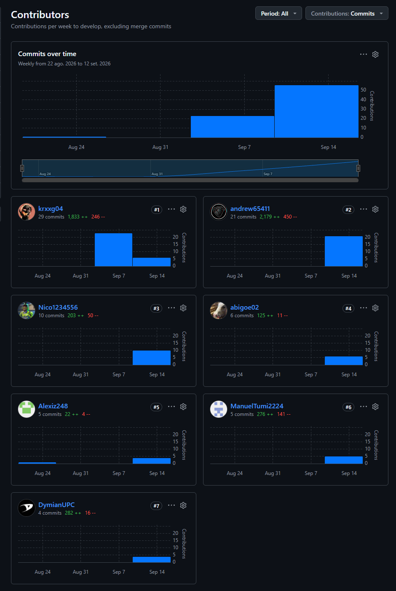

<em>Figura 1. Commits por integrante a lo largo del tiempo — AV1 (GitHub Insights &gt; Contributors).</em>

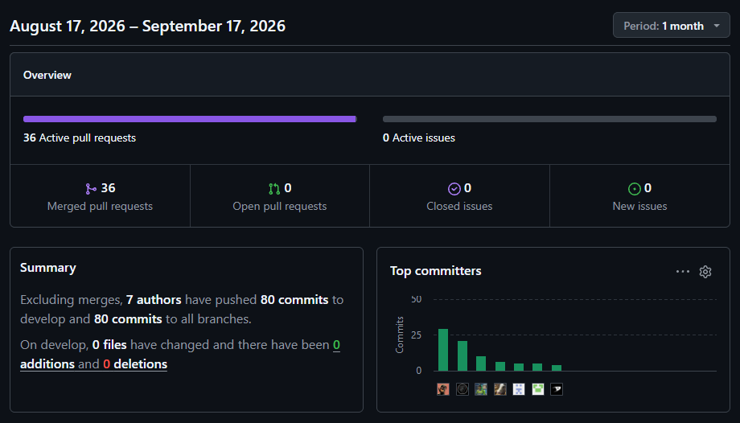

<em>Figura 2. Resumen de actividad del repositorio (Pulse) — AV1: 36 pull requests fusionados, 80 commits a develop entre los siete integrantes.</em>

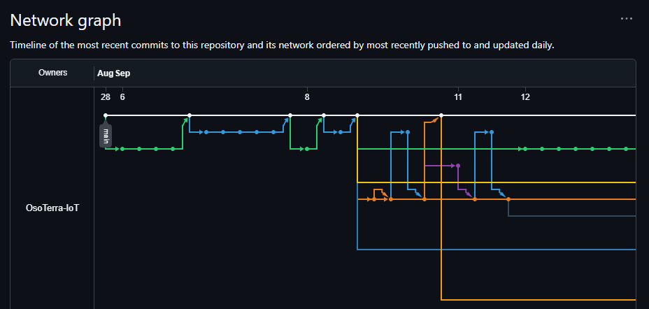
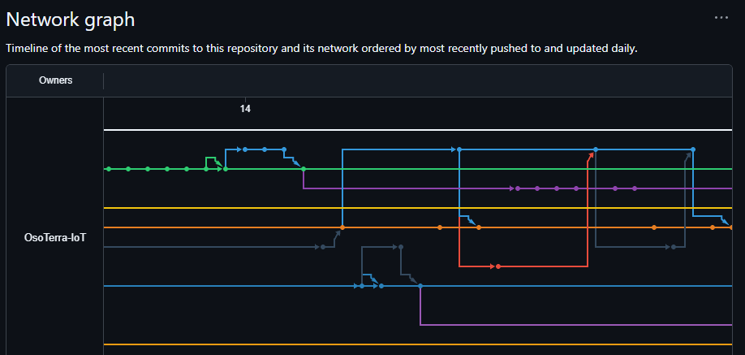
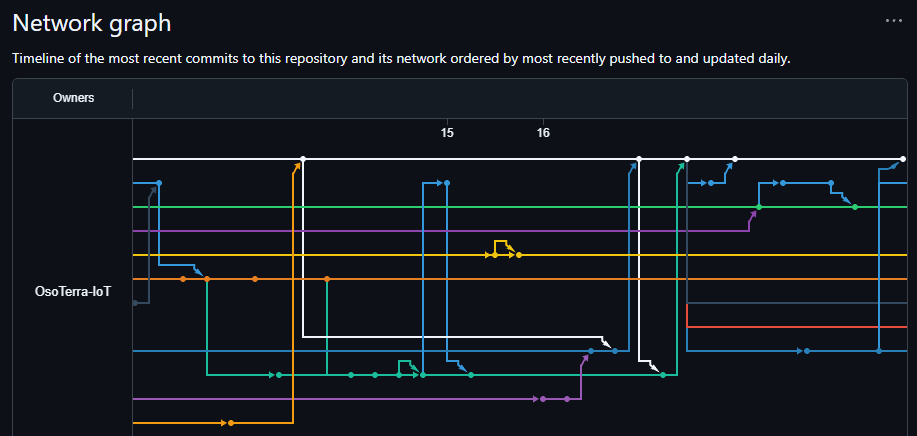
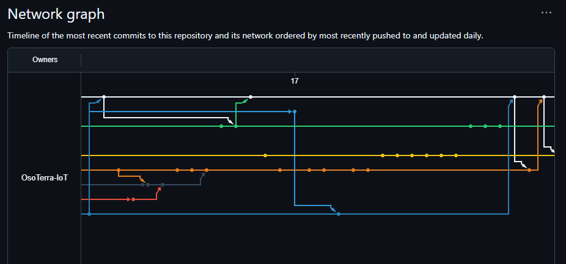
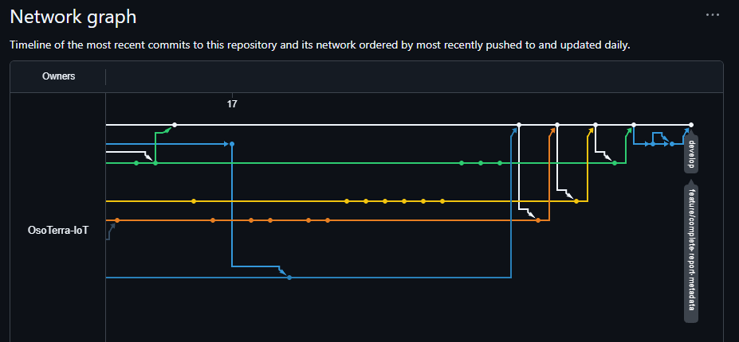

<em>Figura 3. Network graph del repositorio, en cinco tramos — AV1: ramas `feature/*` abiertas desde `develop` y fusionadas de vuelta mediante pull request.</em>

## Actividades de elaboración del informe — TB1

Para el TB1 el informe incorporó el Capítulo V (Solution UI/UX Design) y el Capítulo VI (Software Configuration Management y Sprint 1), y corrigió los artefactos observados en el AV1. El trabajo siguió el mismo esquema de GitFlow, con un nivel más de ramas: cada capítulo tiene su rama `feature/chapter-N`, y cada sección se desarrolla en una sub-rama que se integra primero en la rama de su capítulo y luego en `develop`.

- **Contenido nuevo:** `feature/landing-page-design`, `feature/style-guidelines-landing`, `feature/style-guidelines-figma`, `feature/information-architecture` y `feature/applications-ux-ui-design` para el Capítulo V; `feature/software-configuration-management` y `feature/sprint-1` para el Capítulo VI.
- **Correcciones del AV1:** ramas `fix/*` para el C4 Model como un único sistema (`fix/c4-single-system`), la separación de Technical Stories (`fix/technical-stories`), la tabla del análisis competitivo (`fix/competitive-table-layout`), la base de datos PostgreSQL (`fix/postgresql-database`), la maquetación con saltos de página (`fix/page-layout`) y el índice (`fix/table-of-contents`).
- **Releases:** la rama `release/0.1.0` cerró la entrega AV1 y se integró de vuelta en `develop` el 19/09/2026. Las secciones Registro de Versiones, Project Report Collaboration Insights, Student Outcome y Conclusiones se actualizaron para el TB1 en la rama `feature/tb1-report-update`, y la rama `release/0.2.0` prepara la entrega TB1.

## Integraciones a develop — TB1

En el TB1 las ramas se integraron con *merge* sin *fast-forward* (`--no-ff`), una de las dos formas que admite el flujo definido en la sección 6.1.2, de modo que el historial conserva qué commits pertenecen a cada rama:

| Rama | Integrada en | Autor de la integración | Fecha |
|---|---|---|---|
| `release/0.1.0` | `develop` | Santiago Peña, Andreow Jomark | 19/09/2026 |
| `feature/landing-page-design` | `feature/chapter-5` | Santiago Peña, Andreow Jomark | 23/09/2026 |
| `feature/style-guidelines-landing` | `feature/chapter-5` | Santiago Peña, Andreow Jomark | 23/09/2026 |
| `feature/style-guidelines-figma` | `feature/chapter-5` | Santiago Peña, Andreow Jomark | 23/09/2026 |
| `feature/information-architecture` | `feature/chapter-5` | Santiago Peña, Andreow Jomark | 23/09/2026 |
| `fix/style-guidelines-thresholds` | `feature/chapter-5` | Santiago Peña, Andreow Jomark | 25/09/2026 |
| `fix/c4-single-system` | `feature/chapter-4` | Santiago Peña, Andreow Jomark | 28/09/2026 |
| `fix/technical-stories` | `feature/chapter-3` | Santiago Peña, Andreow Jomark | 28/09/2026 |
| `feature/applications-ux-ui-design` | `feature/chapter-5` | Santiago Peña, Andreow Jomark | 28/09/2026 |
| `fix/competitive-table-layout` | `feature/chapter-2` | Santiago Peña, Andreow Jomark | 28/09/2026 |
| `feature/software-configuration-management` | `feature/chapter-6` | Santiago Peña, Andreow Jomark | 28/09/2026 |
| `feature/sprint-1` | `feature/chapter-6` | Santiago Peña, Andreow Jomark | 28/09/2026 |
| `fix/postgresql-database` | `feature/chapter-4` | Santiago Peña, Andreow Jomark | 29/09/2026 |
| `fix/page-layout` | `develop` | Santiago Peña, Andreow Jomark | 29/09/2026 |
| `feature/chapter-2` | `develop` | Santiago Peña, Andreow Jomark | 29/09/2026 |
| `feature/chapter-3` | `develop` | Santiago Peña, Andreow Jomark | 29/09/2026 |
| `feature/chapter-4` | `develop` | Santiago Peña, Andreow Jomark | 29/09/2026 |
| `feature/chapter-5` | `develop` | Santiago Peña, Andreow Jomark | 29/09/2026 |
| `feature/chapter-6` | `develop` | Santiago Peña, Andreow Jomark | 29/09/2026 |
| `fix/table-of-contents` | `develop` | Santiago Peña, Andreow Jomark | 29/09/2026 |
| `chore/hide-language-stats` | `develop` | Santiago Peña, Andreow Jomark | 29/09/2026 |

## Analíticos de colaboración — TB1

Entre la integración de `release/0.1.0` (19/09/2026) y el cierre de las ramas de capítulo (29/09/2026), el repositorio del informe registra 28 commits sin contar merges, con 2 499 líneas añadidas y 567 eliminadas en los archivos Markdown. Para mostrar cómo se distribuyó el trabajo del TB1 entre el informe y los productos, la tabla incluye también los commits de cada integrante en los repositorios de producto durante el Sprint 1 (del 07/09/2026 al 04/10/2026, sin contar merges ni el commit inicial de cada repositorio):

| Integrante | Usuario de GitHub | Informe (TB1) | Landing Page | Web App | RESTful API | Mobile App |
|---|---|---|---|---|---|---|
| Barturen Panez, Iker Gabriel | krxxg04 | Rama `feature/tb1-report-update` | — | — | 118 | — |
| Encalada Salazar, Alexis | Alexiz248 | — | — | 13 | — | — |
| Goñe Araccata, Esther Abigail | abigoe02 | — | 3 | — | — | — |
| Ortiz Alarcon, Victor Nicolas | Nico1234556 | — | — | — | — | — |
| Salazar Caballero, Alvaro Fabrizzio | DymianUPC | — | — | 1 | — | — |
| Santiago Peña, Andreow Jomark | andrew65411 | 28 | 4 | 13 | 20 | 11 |
| Tumi Oliden, Manuel Ignacio | ManuelTumi2224 | — | — | — | — | 7 |

**Interpretación del equipo.** En el TB1 el equipo repartió el trabajo por tipo de producto. Santiago Peña consolidó el informe (Capítulos V y VI y las correcciones del AV1), mientras que el resto de integrantes concentró su trabajo en los repositorios de producto del Sprint 1: Barturen Panez en el RESTful API, Encalada Salazar y Salazar Caballero en la Web App, Goñe Araccata en el Landing Page y Tumi Oliden en la Mobile App. El detalle de esos commits está en la sección 6.2.1.9. Con esta distribución se publicaron los productos que exige el TB1, pero no todos los integrantes participaron en la elaboración del informe, como muestra el Registro de Versiones. Para el AV2 cada integrante redactará en su propia rama las secciones de los aspectos que lidera (Validation Interviews, evidencias del Sprint 2 y Video About-the-Product), y otro miembro revisará cada pull request antes de integrarlo en `develop`.

El gráfico de Contributors (Figura 4) acumula los commits a `develop` de los últimos tres meses, por lo que suma el AV1 y el TB1: andrew65411 registra 62 commits, krxxg04 38, Nico1234556 10, abigoe02 6, Alexiz248 5, ManuelTumi2224 5 y DymianUPC 4, y la semana del 14 de septiembre concentra la mayor actividad por el cierre del AV1. El resumen Pulse del último mes (Figura 5), del 04/09/2026 al 04/10/2026, registra 38 pull requests fusionados por seis personas y 129 commits de siete autores, es decir, los siete integrantes aportaron al repositorio del informe en ese periodo, que incluye el cierre del AV1. El Network graph del informe (Figura 6) muestra la estructura de ramas del TB1, y los de los repositorios de producto (Figura 7) muestran cómo se integró el trabajo del Sprint 1 en cada uno.

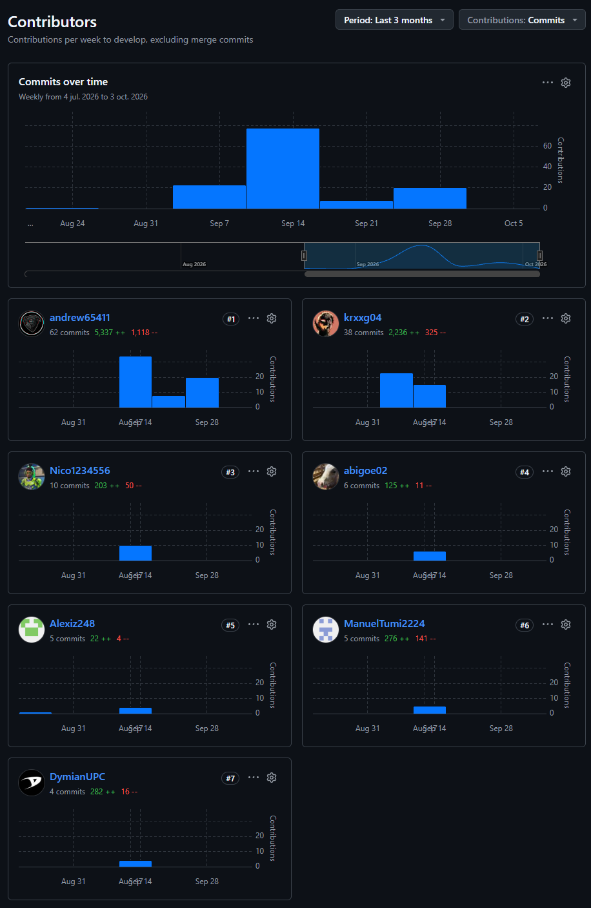

<em>Figura 4. Commits por integrante a develop en los últimos tres meses, acumulado del AV1 y el TB1 (GitHub Insights &gt; Contributors).</em>

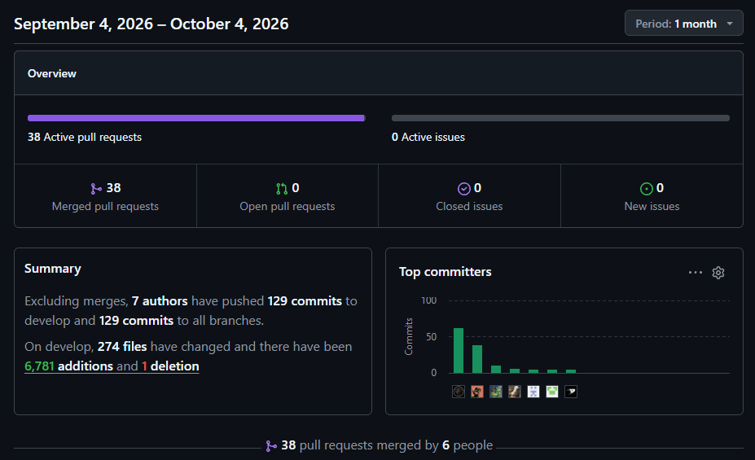

<em>Figura 5. Resumen de actividad del repositorio del informe (Pulse) del 04/09/2026 al 04/10/2026: 38 pull requests fusionados y 129 commits de siete autores.</em>

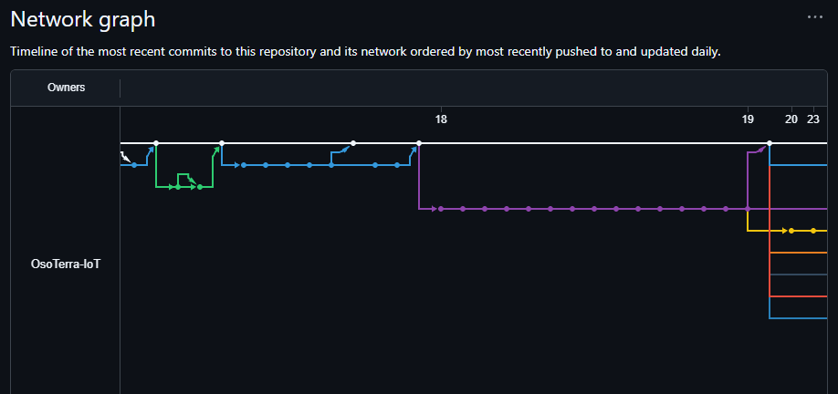
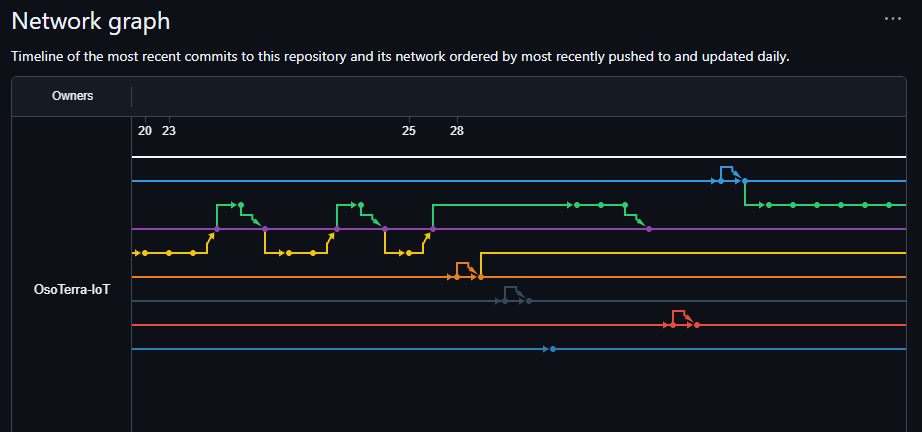
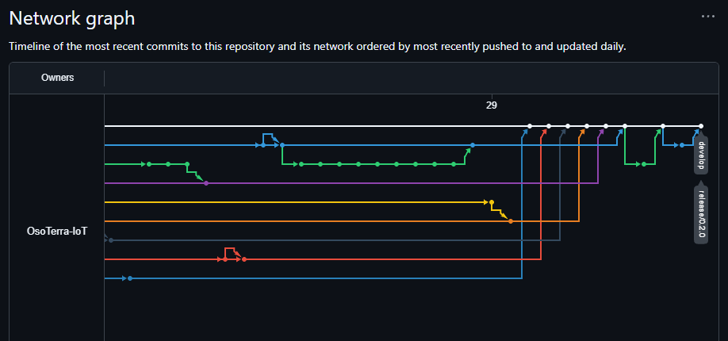

<em>Figura 6. Network graph del repositorio del informe, en tres tramos — TB1: cierre de <code>release/0.1.0</code> el 19/09, sub-ramas de sección integradas en las ramas de capítulo entre el 20 y el 28/09, integración de los capítulos en <code>develop</code> el 29/09 y apertura de <code>release/0.2.0</code>.</em>

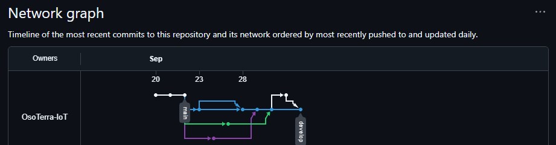
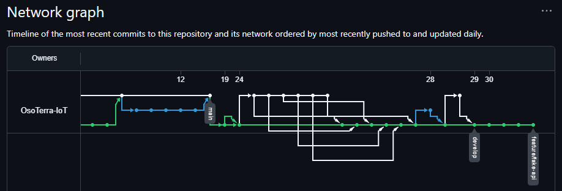
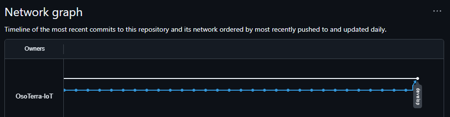

<em>Figura 7. Network graph de los repositorios de producto en el Sprint 1, de arriba abajo: Landing Page, Web App (con la rama <code>feature/fake-api</code> en curso) y RESTful API.</em>

